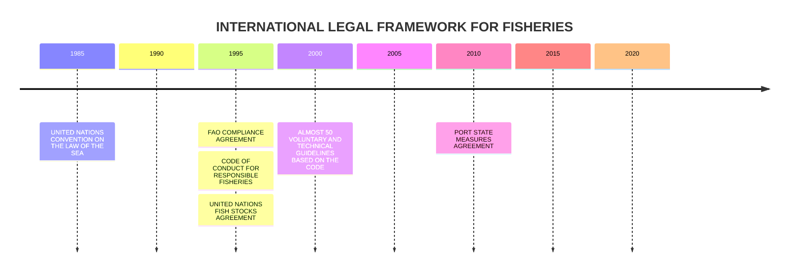
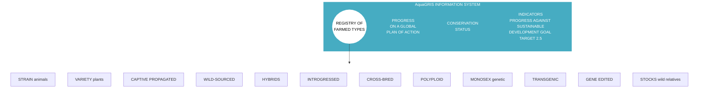
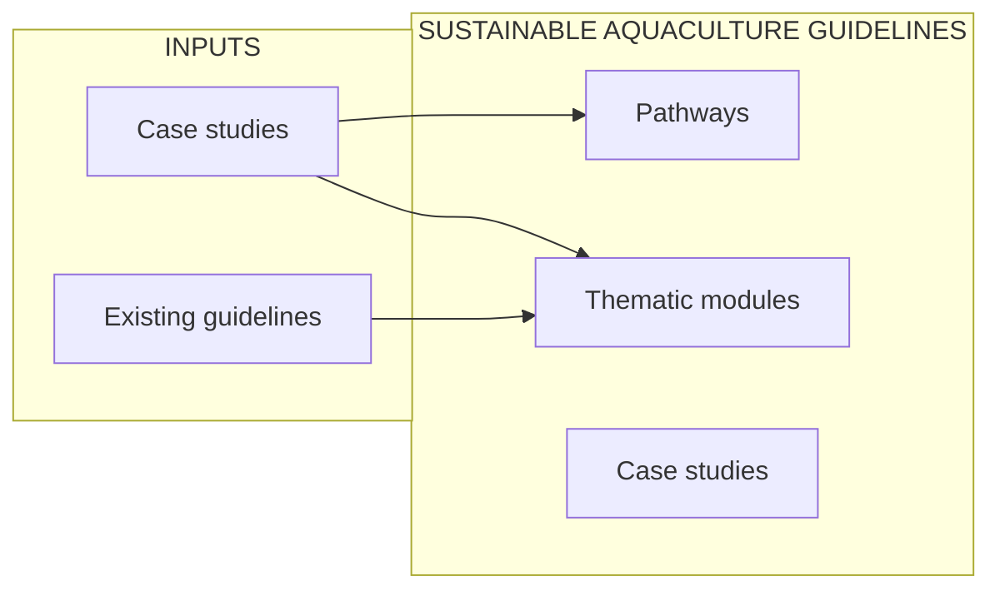
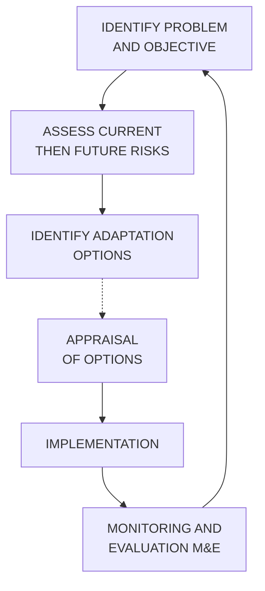
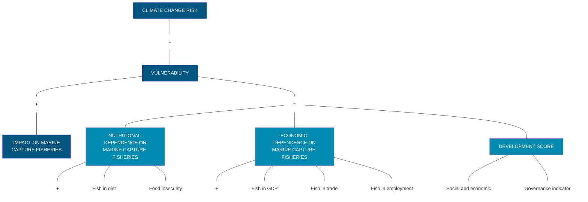
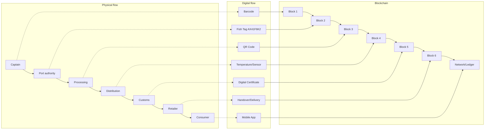

<description>
A teal rectangular banner in the top right corner contains the year 2020 in large white bold font, separated from the top by a curved white line.
</description>

# THE STATE OF WORLD FISHERIES AND AQUACULTURE

## SUSTAINABILITY IN ACTION

2020

This flagship publication is part of **THE STATE OF THE WORLD** series of the Food and Agriculture Organization of the United Nations.

Required citation:
FAO. 2020. *The State of World Fisheries and Aquaculture 2020. Sustainability in action.* Rome.
https://doi.org/10.4060/ca9229en

The designations employed and the presentation of material in this information product do not imply the expression of any opinion whatsoever on the part of the Food and Agriculture Organization of the United Nations (FAO) concerning the legal or development status of any country, territory, city or area or of its authorities, or concerning the delimitation of its frontiers or boundaries. The designations employed and the presentation of material in the maps do not imply the expression of any opinion whatsoever on the part of FAO concerning the legal or constitutional status of any country, territory or sea area, or concerning the delimitation of frontiers. The mention of specific companies or products of manufacturers, whether or not these have been patented, does not imply that these have been endorsed or recommended by FAO in preference to others of a similar nature that are not mentioned.

The views expressed in this information product are those of the author(s) and do not necessarily reflect the views or policies of FAO.

**ISSN 1020-5489 [PRINT]**
**ISSN 2410-5902 [ONLINE]**
**ISBN 978-92-5-132692-3**

**© FAO 2020**


Some rights reserved. This work is made available under the Creative Commons Attribution-NonCommercial-ShareAlike 3.0 IGO licence (CC BY-NC-SA 3.0 IGO; https://creativecommons.org/licenses/by-nc-sa/3.0/igo).

Under the terms of this licence, this work may be copied, redistributed and adapted for non-commercial purposes, provided that the work is appropriately cited. In any use of this work, there should be no suggestion that FAO endorses any specific organization, products or services. The use of the FAO logo is not permitted. If the work is adapted, then it must be licensed under the same or equivalent Creative Commons license. If a translation of this work is created, it must include the following disclaimer along with the required citation: "This translation was not created by the Food and Agriculture Organization of the United Nations (FAO). FAO is not responsible for the content or accuracy of this translation. The original English edition shall be the authoritative edition."

Any mediation relating to disputes arising under the licence shall be conducted in accordance with the Arbitration Rules of the United Nations Commission on International Trade Law (UNCITRAL) as at present in force.

**Third-party materials.** Users wishing to reuse material from this work that is attributed to a third party, such as tables, figures or images, are responsible for determining whether permission is needed for that reuse and for obtaining permission from the copyright holder. The risk of claims resulting from infringement of any third-party-owned component in the work rests solely with the user.

**Sales, rights and licensing.** FAO information products are available on the FAO website (<u>www.fao.org/publications</u>) and can be purchased through <u>publications-sales@fao.org</u>.
Requests for commercial use should be submitted via: <u>www.fao.org/contact-us/licence-request</u>.
Queries regarding rights and licensing should be submitted to: <u>copyright@fao.org</u>.

**COVER PHOTOGRAPH** ©FAO/Kyle LaFerriere

**GHANA.** Fishing canoes and gear in the Canoe Basin, Tema.

ISSN 1020-5489

# <mark>2020</mark>
# THE STATE OF **WORLD FISHERIES AND AQUACULTURE**
## <mark>SUSTAINABILITY IN ACTION</mark>

```description
A horizontal gradient bar transitioning from light blue on the left to a dark teal on the right.
```

Food and Agriculture Organization of the United Nations
**Rome, 2020**

# CONTENTS

FOREWORD **vi**
METHODOLOGY **viii**
ACKNOWLEDGEMENTS **x**
ABBREVIATIONS AND ACRONYMS **xii**

## PART 1
## WORLD REVIEW **1**
Overview 2
Capture fisheries production 9
Aquaculture production 21
Fishers and fish farmers 36
The status of the fishing fleet 41
The status of fishery resources 47
Fish utilization and processing 59
Fish consumption 65
Fish trade and products 73

## PART 2
## SUSTAINABILITY IN ACTION **91**
The twenty-fifth anniversary of the Code of Conduct for Responsible Fisheries 92
Monitoring fisheries and aquaculture sustainability 101
Securing fisheries and aquaculture sustainability 109
Reporting on fisheries and aquaculture sustainability 127
Fisheries and aquaculture sustainability in context 138

## PART 3
## OUTLOOK AND EMERGING ISSUES **163**
Fisheries and aquaculture projections 164
Illuminating Hidden Harvests: the contribution of small-scale fisheries to sustainable development 176
Improving the assessment of global inland fisheries 179
New and disruptive technologies for innovative data systems and practices 183
Aquaculture biosecurity 190
Towards a new vision for capture fisheries in the twenty-first century 193

**REFERENCES 199**

### <mark>TABLES</mark>
1. World fisheries and aquaculture production, utilization and trade **3**
2. Marine capture production: major producing countries and territories **13**
3. Marine capture production: major species and genera **14**
4. Capture production: FAO Major Fishing Areas **16**
5. Inland waters capture production: major producing countries **20**
6. Aquaculture production of main species groups by continent in 2018 **26**
7. Aquaculture production of aquatic algae by major producers **27**
8. Major species produced in world aquaculture **30**
9. World aquaculture production of aquatic algae **32**
10. Aquaculture fish production in regions, and by selected major producers **33**
11. Major global and regional aquaculture producers with relatively high percentage of bivalves in total aquaculture production of aquatic animals **36**

<table>
    <tr>
        <th>ii</th>
    </tr>
</table>

**12.** World employment for fishers and fish farmers, by region **37**

**13.** Reported number of motorized and non-motorized vessels by LOA class in fishing fleets from selected countries and territories, 2018 **46**

**14.** Percentage of global fish catch allocated to major hydrological/river basin **58**

**15.** Production trends and the relative contribution to the global catch **59**

**16.** Total and per capita apparent fish consumption by region and economic grouping, 2017 **70**

**17.** Projected fish production, 2030 **166**

**18.** Projected fish trade for human consumption **172**

**19.** Snapshot of data the Illuminating Hidden Harvests study is exploring **178**

**20.** Variables used in the threat assessment for inland fisheries **180**

**21.** Threat scores of basin areas that support inland fisheries **181**

**22.** Fish supply chain supported by blockchain **187**

<mark>**FIGURES**</mark>

**1.** World capture fisheries and aquaculture production **4**

**2.** World fish utilization and apparent consumption **4**

**3.** Regional contribution to world fisheries and aquaculture production **5**

**4.** Trends in global captures **9**

**5.** Top ten global capture producers, 2108 **12**

**6.** Trends in three main categories of fishing areas **17**

**7.** Top five inland waters capture producers **19**

**8.** World aquaculture production of aquatic animals and algae, 1990–2018 **22**

**9.** Annual growth rate of aquaculture fish production quantity in the new millennium **22**

**10.** Contribution of aquaculture in total production of aquatic animals **24**

**11.** Fed and non-fed aquaculture production, 2000–2018 **28**

**12.** Aquaculture production of major producing regions and major producers of main species groups, 2003–2018 **34**

**13.** Regional share of employment in fisheries and aquaculture **38**

**14.** Sex-disaggregated data on employment in fisheries and aquaculture, 2018 **40**

**15.** Distribution of motorized and non-motorized fishing vessels by region, 2018 **42**

**16.** Proportion of motorized and non-motorized fishing vessels by region, 2018 **43**

**17.** Distribution of motorized fishing vessels by region, 2018 **43**

**18.** Size distribution of motorized fishing vessels by region, 2018 **44**

**19.** Global trends in the state of the world’s marine fish stocks, 1974–2017 **48**

**20.** Percentages of stocks fished at biologically sustainable and unsustainable levels, by FAO statistical area, 2017 **49**

**21.** The three temporal patterns in fish landings, 1950–2017 **50**

<table>
    <tr>
        <th>iii</th>
    </tr>
</table>

CONTENTS

22. Estimated inland fishery catch allocated to major hydrologic regions and the river basins in which it was produced, expressed as a percentage of the global total inland catch **57**

23. Utilization of world fisheries and aquaculture production, 1962–2018 **60**

24. Utilization of world fisheries and aquaculture production: developed versus developing countries, 2018 **62**

25. Contribution of fish to animal protein supply, average 2015–2017 **67**

26. Apparent fish consumption per capita, average 2015–2017 **69**

27. Relative contribution of aquaculture and capture fisheries to fish available for human consumption **72**

28. World fisheries and aquaculture production and quantities destined for export **74**

29. Top exporters and importers of fish and fish products in terms of value, 2018 **76**

30. Trade of fish and fish products **77**

31. Trade flows of fish and fish products by continent (share of total imports, in terms of value), 2018 **78**

32. Import and export values of fish products for different regions, indicating net deficit or surplus **81**

33. Share of main groups of species in fish trade in terms of value, 2018 **84**

34. FAO Fish Price Index **85**

35. Groundfish prices in Norway **86**

36. Skipjack tuna prices in Ecuador and Thailand **87**

37. Fishmeal and soybean meal prices in Germany and the Netherlands **88**

38. Fish oil and soybean oil prices in the Netherlands **89**

39. International legal framework for fisheries **94**

40. Response by Members to the FAO Questionnaire on the Implementation of the Code of Conduct for Responsible Fisheries and Related Instruments, by region **97**

41. Number of fish management plans developed for marine and inland capture fisheries in accordance with the Code, as reported by Members **98**

42. Percentage of fisheries management plans implemented for marine and inland capture fisheries in accordance with the Code, as reported by Members **98**

43. Number of countries that have a legal framework for the development of responsible aquaculture in line with the Code, as reported by Members **99**

44. Proposed information system with a registry of farmed types of aquatic genetic resources at its core **108**

45. The process of the Sustainable Aquaculture Guidelines and the content for their development **126**

46. Average level of implementation of international instruments to combat illegal, unreported and unregulated fishing, SDG regional groupings, 2018 **132**

47. Implementation of instruments for access to resources and markets for small-scale fisheries, SDG regional groupings, 2018 **135**

48. The SSF Guidelines and the Sustainable Development Goals **136**

49. Adaptation planning cycle **147**

50. Development of international legal, environmental and management instruments **159**

51. World capture fisheries and aquaculture production, 1980–2030 **165**

52. Annual growth rate of world aquaculture, 1980–2030 **167**

<table>
    <tr>
        <th>iv</th>
    </tr>
</table>

**53.** World global capture fisheries and aquaculture production, 1980–2030 **167**

**54.** Contribution of aquaculture to regional fish production **168**

**55.** World fishmeal production, 1990–2030 **169**

**56.** Increasing role of aquaculture **171**

**57.** Global "status map" based on the interaction of 20 pressures at basin level for the 34 indicative basins that support inland fisheries **180**

**58.** Basin-level threat maps for important inland fisheries **182**

# <mark>BOXES</mark>

**1.** Revision of FAO fisheries and aquaculture production statistics **11**

**2.** Relevance of sex-disaggregated data: a focus on women in post-harvest activities **41**

**3.** AIS-based fishing data **45**

**4.** Fishery management demonstrably instrumental in improving stock status **55**

**5.** FAO Food Balance Sheets of fish and fish products **66**

**6.** The FAO fisheries and aquaculture knowledge base in numbers **102**

**7.** FAO Fishery and Aquaculture Country Profiles **104**

**8.** How components of FAO's fisheries and aquaculture knowledge base will contribute to an aquatic genetic resources information system **106**

**9.** Standardizing the nomenclature for aquatic genetic resources **107**

**10.** Global Record of Fishing Vessels **111**

**11.** FAO Global Programme to Support the Implementation of the PSMA and Complementary International Instruments **111**

**12.** International Year of Artisanal Fisheries and Aquaculture 2022 **117**

**13.** Ensuring access to secure livelihoods and sustainable development: the Volta River clam fishery in Ghana **118**

**14.** Tailoring safety-at-sea training to small-scale fisheries in the Pacific and Caribbean **121**

**15.** Managing bycatch more sustainably in Latin America and the Caribbean **123**

**16.** FAO's aquaculture–horticulture approach in remote areas in West Africa **125**

**17.** Securing sustainable small-scale fisheries in North Africa: supporting strong subregional momentum **134**

**18.** Determining risk and management needs for vulnerable resources in marine systems **139**

**19.** Adaptation to climate change: Chile takes action **148**

**20.** Addressing extreme events: FAO's damage and loss methodology **151**

**21.** Not leaving fisheries and aquaculture behind in multisectoral policies for food security and nutrition **156**

**22.** Vulnerability of countries to climate change impacts on capture fisheries **174**

**23.** SmartForms and Calipseo – FAO's new tools to help address weaknesses in national data systems **184**

<table>
    <tr>
        <th>v</th>
    </tr>
</table>

# FOREWORD

In September 2015, the United Nations launched the 2030 Agenda for Sustainable Development, a beautiful blueprint for global peace and prosperity. In adopting the 2030 Agenda, countries demonstrated a remarkable determination to take bold and transformative steps to shift the world onto a more sustainable and resilient path.

However, after 5 years of uneven progress and with less than 10 years to go, and despite progress in many areas, it is clear that action to meet the 17 Sustainable Development Goals (SDGs) is not yet advancing at the speed or scale required. In response, at the SDG summit in September 2019, the United Nations Secretary-General called on all sectors of society to mobilize for a Decade of Action to accelerate the development of sustainable solutions for the world's biggest challenges – ranging from poverty and inequality to climate change and closing the finance gap.

It is therefore necessary and timely that the 2020 edition of *The State of World Fisheries and Aquaculture* is devoted to the topic of *Sustainability in Action*. The fisheries and aquaculture sector has much to contribute to securing all the SDGs, but is at the core of SDG 14 – Conserve and sustainably use the oceans, seas and marine resources for sustainable development. As custodian of four out of ten indicators of SDG 14 progress, FAO has an obligation to accelerate the global momentum to secure healthy and productive oceans, a momentum whose pace will receive further impetus at the second United Nations Ocean Conference.

The 2020 edition of *The State of World Fisheries and Aquaculture* continues to demonstrate the significant and growing role of fisheries and aquaculture in providing food, nutrition and employment. It also shows the major challenges ahead despite the progress made on a number of fronts. For example, there is growing evidence that when fisheries are properly managed, stocks are consistently above target levels or rebuilding, giving credibility to the fishery managers and governments around the world that are willing to take strong action. However, the report also demonstrates that the successes achieved in some countries and regions have not been sufficient to reverse the global trend of overfished stocks, indicating that in places where fisheries management is not in place, or is ineffective, the status of fish stocks is poor and deteriorating. This unequal progress highlights the urgent need to replicate and re-adapt successful policies and measures in the light of the realities and needs of specific fisheries. It calls for new mechanisms to support the effective implementation of policy and management regulations for sustainable fisheries and ecosystems, as the only solution to ensure fisheries around the world are sustainable.

FAO is a technical agency created to fight hunger and poverty. Yet, as we approach a world of 10 billion people, we face the fact that since 2015 the numbers of undernourished and malnourished people have been growing. While there is no silver bullet to fix this problem, there is little doubt that we will need to use innovative solutions to produce more food, ensure access to it, and improve nutrition. While capture fisheries will remain relevant, aquaculture has already demonstrated its crucial role in global food security, with its production growing at 7.5 percent per year since 1970. Recognizing the capacity of aquaculture for further growth, but also the enormity of the environmental challenges the sector must face as it intensifies production, demands new sustainable aquaculture development strategies. Such strategies need to harness technical developments in, for example, feeds, genetic selection, biosecurity and disease control, and digital innovation, with business developments in investment and trade. The priority should be to further develop aquaculture in Africa and in other regions where population growth will challenge food systems most.

The FAO Hand-in-Hand Initiative is an ideal framework for efforts that combine fisheries and aquaculture trends and challenges in the context of blue growth. The Hand-in-Hand Initiative

<table>
    <tr>
        <th>vi</th>
    </tr>
</table>

aims to accelerate food systems transformation through matching donors with recipients, using the best data and information available. This evidence-based, country-led and country-owned initiative prioritizes countries where infrastructure, national capacities and international support are most limited, and where efficient collaboration and partnerships to transfer skills and technology can be of particular benefit. For example, climate change impacts on marine capture fisheries are projected to be more significant in tropical regions of Africa and Asia, where warming is expected to decrease productivity. Targeted fisheries and aquaculture development interventions in these regions, addressing their specific needs for food, trade and livelihoods, can provide the transformational change we need to feed everyone, everywhere.

Part of these targeted interventions is the recognition that most food systems affect the environment, but that there are trade-offs to ensure we improve food and nutrition security while minimizing the impacts on their supportive ecosystems. Fish and fisheries products are actually recognized not only as some of the healthiest foods on the planet, but also as some of the less impactful on the natural environment. For these reasons, they must be better considered in national, regional and global food security and nutrition strategies, and contribute to the ongoing transformation of food systems to ensure we eliminate hunger and malnutrition.

For FAO, 2020 is an important year in its history. It is the seventy-fifth anniversary of its creation – FAO is the oldest permanent specialized agency of the United Nations. It is also the twenty-fifth anniversary of the FAO Code of Conduct for Responsible Fisheries, the blueprint that has guided fisheries and aquaculture policy development around the world. However, there is no time for celebrations. These anniversaries remind us of the reason for our existence, they are calls to action, springboards for change, for a rapidly changing world in need of innovative and transformative solutions to old as well as new problems. As this report was being prepared, COVID-19 emerged as one of the greatest challenges that we have faced together since the creation of FAO. The deep socio-economic consequences of this pandemic will make our fight to defeat hunger and poverty harder and more challenging. As fisheries and aquaculture is one of the sectors most impacted by the pandemic, the baseline information provided in this report is already helping FAO respond with technical solutions and targeted interventions.

*The State of World Fisheries and Aquaculture* is the only publication of its kind, which for years has provided technical insight and factual information on a sector crucial for societal success. Among other things, the report highlights major trends and patterns observed in global fisheries and aquaculture and scans the horizon for new and emerging areas that need to be considered if we are to manage aquatic resources sustainably into the future. I hope this edition will have even greater quantitative and qualitative impact than previous editions, making valuable contributions in helping us meet the challenges of the twenty-first century.


**Qu Dongyu**
**FAO Director-General**

<table>
    <tr>
        <th>vii</th>
    </tr>
</table>

# METHODOLOGY

*The State of World Fisheries and Aquaculture 2020* is the product of a 15-month process that began in March 2019. An editorial board was formed, made up of staff from the FAO Fisheries and Aquaculture Department, supported by a core executive team including the Director of the FAO Fisheries and Aquaculture Department (FIA), five staff and consultants of the department’s Statistics and Information Branch, and a representative of the FAO Office of Corporate Communication. Chaired by the FIA Director, the editorial board met at regular intervals to plan the structure and content, refine terminology, review progress and address issues.

The editorial board decided to modify the structure of the 2020 edition, and to retain the format and process of previous years only Part 1, World Review. Part 2 would be renamed Sustainability in Action, and focus on issues coming to the fore in 2019–2020. In particular, it would examine issues related to Sustainable Development Goal 14 and its indicators for which FAO is the “custodian” United Nations agency. Sections would cover various aspects of fisheries and aquaculture sustainability: assessing, monitoring, developing policies, securing, reporting and context. The editorial board also decided that Part 2 should open with a special section marking the twenty-fifth anniversary of the Code of Conduct for Responsible Fisheries (the Code) and reporting on the progress made since the Code’s adoption. Part 3 would form the final part of the publication, covering projections (outlook) and emerging issues.

This decision for a revised structure was based on feedback received from internal and external reviewers on the previous edition, including an on-line questionnaire. The revision was guided by the management of the FAO Fisheries and Aquaculture Department, and benefited from inputs from the department’s different branches. This structure was approved by the department’s senior management.

Between April and May 2019, department staff were invited to identify suitable topics and contributors for Parts 2 and 3, and the editorial board compiled and refined an outline of the publication. The process from planning through to review involved virtually all officers in the department at headquarters, while decentralized staff were invited to contribute regional stories. The revised structure was accompanied by a change in the authoring leadership for Part 2 – various editorial board members were each assigned responsibility for a theme containing at least two sections. Many FAO authors contributed (some to multiple sections), as did several authors external to FAO (see Acknowledgements).

In June 2019, a summary of Parts 2 and 3 was prepared with the inputs of all lead authors, and revised based on feedback from the editorial board. The summary document was submitted to the department’s management and the FAO Deputy Director-General, Climate and Natural Resources, for approval in June 2019. This document then formed the blueprint guiding authors in the drafting of the publication.

Parts 2 and 3 were drafted between September and December 2019, edited for technical and language content, and submitted in January 2020 for review by FAO Fisheries and Aquaculture Department management, by external experts and by the editorial board.

<table>
    <tr>
        <th>viii</th>
    </tr>
</table>

```description
A solid teal rectangular block at the top of the page.
```

The world review in Part 1 is based on FAO’s official fishery and aquaculture statistics. To reflect the most up-to-date statistics available, this part was drafted in February–March 2020 upon annual closure of the various thematic databases in which the data are structured. The statistics are the outcome of an established programme to ensure the best possible information, including assistance to enhance countries’ capacity to collect and submit data according to international standards. The process is one of careful collation, revision and validation. In the absence of national reporting, FAO may make estimates based on the best data available from other sources or through standard methodologies.

A draft of the publication was sent for comments to other FAO departments and regional offices, and a final draft was submitted to the Office of the FAO Deputy Director-General, Climate and Natural Resources, and to the Office of the FAO Director-General for approval.

<table>
    <tr>
        <th>ix</th>
    </tr>
</table>

# ACKNOWLEDGEMENTS

The *State of World Fisheries and Aquaculture 2020* was prepared under the overall direction of Manuel Barange and an editorial board under his leadership, comprising Vera Agostini, Marcio Castro de Souza, Nicole Franz, Kim Friedman, Graham Mair, Julian Plummer, Marc Taconet, Raymon van Anrooy and Kiran Viparthi.

Main authors (all affiliated with FAO, unless otherwise stated) were:

<mark>Part 1</mark>
**Capture fisheries production:** James Geehan (lead author)
**Aquaculture production:** Xiaowei Zhou (lead author)
**Fishers and fish farmers; Fishing fleet:** Jennifer Gee (lead author)
**Status of fishery resources:** Yimin Ye (lead author), Tarûb Bahri, Pedro Barros, Simon Funge-Smith, Nicolas Gutierrez, Jeremy Mendoza-Hill, Hassan Moustahfid, Yukio Takeuchi, Merete Tandstad, Marcelo Vasconcellos
**Fish utilization and processing:** Stefania Vannuccini (lead author), Ansen Ward, Molly Ahern, Omar Riego Penarubia, Pierre Ami Maudoux
**Fish consumption:** Stefania Vannuccini (lead author), Felix Dent, Gabriella Laurenti
**Fish trade and products:** Stefania Vannuccini (lead author), Felix Dent

<mark>Part 2</mark>
**How has the Code supported the adoption of sustainable practices?:** Rebecca Metzner (lead author), Alexander Ford, Joseph Zelasney, Nicole Franz
**Progress on the road to sustainability – what the Code questionnaire reveals:** Joseph Zelasney (lead author), Alexander Ford, Rebecca Metzner, Nicole Franz
**FAO fisheries and aquaculture data and information systems:** Marc Taconet (lead author), Aureliano Gentile, Stefania Savore, Riccardo Fortuna
**An aquatic genetic resources information system to support sustainable growth in aquaculture:** Graham Mair (lead author), Daniela Lucente, Marc Taconet, Stefania Savore, Tamsin Vicary, Xiaowei Zhou
**Combating illegal, unreported and unregulated fishing:** Eszter Hidas (lead author), Matthew Camilleri, Giuliano Carrara, Alicia Mosteiro
**Product legality and origin:** John Ryder and Nianjun Shen (lead authors)
**Sustainability, tenure, access and user rights:** Rebecca Metzner (lead author), Amber Himes Cornell, Nicole Franz, Juan Lechuga Sanchez, Lena Westlund, Kwang Suk Oh, Ruben Sanchez Daroqui
**Social sustainability along value chains:** Marcio Castro de Souza (lead author), Mariana Toussaint
**Responsible fishing practices:** Raymon van Anrooy (lead author), Mariaeleonora D’Andrea, Carlos Fuentevilla, Amparo Perez Roda
**Guidelines and best practices for sustainable aquaculture:** Lionel Dabbadie (lead author), Rodrigo Roubach
**Fisheries, aquaculture and the 2030 Agenda for Sustainable Development:** Audun Lem (lead author), William Griffin
**Stock sustainability:** Yimin Ye (lead author)
**Progress in implementing international instruments to combat illegal, unreported and unregulated fishing:** Matthew Camilleri (lead author), Giuliano Carrara, Eszter Hidas

<table>
    <tr>
        <th>x</th>
    </tr>
</table>

**Providing access for small-scale fishers to marine resources and markets:** Nicole Franz (lead author), Jennifer Gee, Joseph Zelasney, Valerio Crespi, Sofiane Mahjoub
**Economic benefits from sustainable fisheries:** Marcio Castro de Souza (lead author), Weiwei Wang
**Mainstreaming biodiversity in fisheries and aquaculture:** Kim Friedman (lead author), Raymon van Anrooy, Amber Himes-Cornell, Pedro Barros, Simon Funge-Smith, Matthias Halwart, Graham Mair, Piero Mannini, Rodrigo Roubach, Vera Agostini
**Sustainability in areas beyond national jurisdiction:** Piero Mannini (lead author), Alejandro Anganuzzi, William Emerson
**Climate change adaptation strategies:** Florence Poulain (lead author), Tarûb Bahri, Felix Inostroza Cortés, Alessandro Lovatelli, Stefania Savore
**Abandoned, lost or otherwise discarded fishing gear and its pollution of the marine environment:** Raymon van Anrooy (lead author), Ingrid Giskes, Pingguo He
**Fish in food systems strategies for food security and nutrition:** Molly Ahern (lead author), John Ryder
**Blue growth achievements:** Lahsen Ababouch (international expert on fisheries and aquaculture; lead author), Henry De Bey, Vera Agostini

<mark>Part 3</mark>
**Fisheries and aquaculture projections:** Stefania Vannuccini (lead author), Pierre Maudoux, Felix Dent and Adrienne Egger
**Illuminating Hidden Harvests:** Kate Bevitt (WorldFish) (lead author), Nicole Franz, Giulia Gorelli, Xavier Basurto (Duke University)
**Improving the assessment of global inland fisheries:** Simon Funge-Smith (lead author)
**New and disruptive technologies for innovative data systems and practices:** Marc Taconet (lead author), Nada Bougouss, Anton Ellenbroek, Aureliano Gentile, Yann Laurent, Nianjun Shen
**Aquaculture Biosecurity:** Melba Reantaso (lead author), Xiaowei Zhou
**Towards a new vision for capture fisheries in the twenty-first century:** Manuel Barange

The publication also benefited from external review by Professor Massimo Spagnolo (Institute for Economic Research in Fishery and Aquaculture) and Kevern Cochrane (Department of Ichthyology and Fisheries Science, Rhodes University, South Africa). They are acknowledged for their significant contributions. The report was reviewed internally by Vera Agostini, Manuel Barange and the editorial board, as well as by colleagues in other technical divisions of FAO beyond the Fisheries and Aquaculture Department.

The Meeting Programming and Documentation Service of the FAO Conference, Council and Protocol Affairs Division provided translation and printing services.

The Publishing Group (OCCP) in FAO’s Office for Corporate Communication provided editorial support, design and layout, as well as production coordination, for editions in all six official languages.

<table>
    <tr>
        <th>xi</th>
    </tr>
</table>

# ABBREVIATIONS AND ACRONYMS

**2030 AGENDA**
2030 Agenda for Sustainable Development

**ABNJ**
areas beyond national jurisdiction

**ALDFG**
abandoned, lost or otherwise discarded fishing gear

**AQGR**
aquatic genetic resources

**ASFA**
Aquatic Sciences and Fisheries Abstracts

**ASFIS**
Aquatic Sciences and Fisheries Information System

**CBD**
Convention on Biological Diversity

**CDS**
catch documentation scheme

**CFS**
Committee on Food Security

**CITES**
Convention on International Trade in Endangered Species of Wild Fauna and Flora

**CMM**
conservation management measure

**CMS**
Convention on the Conservation of Migratory Species of Wild Animals

**CODE**
Code of Conduct for Responsible Fisheries

**COFI**
Committee on Fisheries

**COVID-19**
coronavirus disease

**CWP**
Coordinating Working Party on Fishery Statistics

**DHA**
docosahexaenoic acid

**DSF**
deep-sea fishing

**EAA**
ecosystem approach to aquaculture

**EAF**
ecosystem approach to fisheries

**EEZ**
exclusive economic zone

**EPA**
eicosapentaenoic acid

**FBS**
FAO Food Balance Sheets

**FIRMS**
Fisheries and Resources Monitoring System

**FPI**
FAO Fish Price Index

**GDP**
gross domestic product

**GESAMP**
United Nation's Joint Group of Experts on the Scientific Aspects of Marine Environmental Protection

**GIAHS**
Globally Important Agricultural Heritage Systems

**GIES**
global information exchange system

**GLOBAL RECORD**
Global Record of Fishing Vessels, Refrigerated Transport Vessels and Supply Vessels

**GPA**
global plan of action

**GRSF**
Global Record of Stocks and Fisheries

**GSP**
Generalized System of Preferences

**GSSI**
Global Sustainable Seafood Initiative

**HACCP**
Hazard Analysis Critical Control Point (system)

**HS**
Harmonized Commodity Description and Coding System

<table>
    <tr>
        <th>xii</th>
    </tr>
</table>

**ICZM**
integrated coastal zone management

**IFFO**
Marine Ingredients Organisation

**IHH**
Illuminating Hidden Harvests

**ILO**
International Labour Organization

**IMO**
International Maritime Organization

**IUU**
illegal, unreported and unregulated (fishing)

**LDC**
least developed country

**LIFDC**
low-income food-deficit country

**LOA**
length overall

**MCS**
monitoring, control and surveillance

**MPA**
marine protected area

**MSY**
maximum sustainable yield

**NGO**
non-governmental organization

**OECD**
Organisation for Economic Co-operation and Development

**OECM**
other effective area-based conservation measure

**PMP/AB**
Progressive Management Pathway for Improving Aquaculture Biosecurity

**PSMA**
Agreement on Port State Measures to Prevent, Deter and Eliminate Illegal, Unreported and Unregulated Fishing

**PUFA**
polyunsaturated fatty acid

**RAI**
Principles for Responsible Investment in Agriculture and Food Systems

**RFB**
regional fishery body

**RFMO/A**
regional fisheries management organization/arrangement

**RSN**
Regional Fishery Body Secretariats Network

**SAG**
Sustainable Aquaculture Guidelines

**SDG**
Sustainable Development Goal

**SIDS**
small island developing State

**SPF**
specific pathogen-free

**SSF GUIDELINES**
Voluntary Guidelines for Securing Sustainable Small-Scale Fisheries in the Context of Food Security and Poverty Eradication

**UNCLOS**
United Nations Convention on the Law of the Sea

**VGGT**
Voluntary Guidelines for Responsible Governance of Land, Fisheries and Forests in the Context of National Food Security

**VGMFG**
Voluntary Guidelines for the Marking of Fishing Gear

**VME**
vulnerable marine ecosystem

**WCO**
World Customs Organization

**WSSD**
World Summit on Sustainable Development

**WTO**
World Trade Organization

<table>
    <tr>
        <th>xiii</th>
    </tr>
</table>


**SPAIN**
Fishing vessels at their moorings in the port of Vigo.
©FAO/Miguel Riopa


# PART 1
# WORLD REVIEW

PART 1

# WORLD REVIEW

*Note: At the time of writing (March 2020), the COVID-19 pandemic has affected most countries in the world, with severe impacts on the global economy and the food production and distribution sector, including fisheries and aquaculture. FAO is monitoring the situation closely to assess the overall impact of the pandemic on fisheries and aquaculture production, consumption and trade.*

## OVERVIEW

Scientific developments of the last 50 years have led to a much improved understanding of the functioning of aquatic ecosystems, and to global awareness of the need to manage them in a sustainable manner. Twenty-five years after the adoption of the Code of Conduct for Responsible Fisheries (the Code; FAO, 1995), the importance of utilizing fisheries and aquaculture resources responsibly is now widely recognized and prioritized. The Code has informed the development of international instruments, policies and programmes to support responsible management efforts globally, regionally and nationally. These efforts have been consolidated and prioritized since 2015 to particularly address, in a coherent and coordinated manner, Sustainable Development Goal (SDG) 14 – Conserve and sustainably use the oceans, seas and marine resources for sustainable development – and other SDGs relevant to fisheries and aquaculture. To this end, the implementation of science-based fisheries and aquaculture management policies, coupled with predictable and transparent regimes for international fish utilization and trade, are widely accepted as minimum substantive criteria for sustainable fisheries and aquaculture. To support evidence-based endeavours, this edition of *The State of World Fisheries and Aquaculture* presents updated and verified statistics of the sector, and analyses current and emerging issues and approaches needed to accelerate international efforts to achieve the goal of sustainable fisheries and aquaculture.

Global fish<sup>1</sup> production is estimated to have reached about 179 million tonnes in 2018 (<mark>Table 1</mark><sup>2</sup> and <mark>Figure 1</mark>), with a total first sale value estimated at USD 401 billion, of which 82 million tonnes, valued at USD 250 billion, came from aquaculture production. Of the overall total, 156 million tonnes were used for human consumption, equivalent to an estimated annual supply of 20.5 kg per capita. The remaining 22 million tonnes were destined for non-food uses, mainly to produce fishmeal and fish oil (<mark>Figure 2</mark>). Aquaculture accounted for 46 percent of the total production and 52 percent of fish for human consumption. China has remained a major fish producer, accounting for 35 percent of global fish production in 2018. Excluding China, a significant share of production in 2018 came from Asia (34 percent), followed by the Americas (14 percent), Europe (10 percent), Africa (7 percent) and Oceania (1 percent). Total fish production has seen important increases in all the continents in the last few decades, except Europe (with a gradual decrease from the late 1980s, but recovering slightly in the last few years) and the Americas (with several ups and downs since the peak of the mid-1990s, mainly due to fluctuations in catches of anchoveta), whereas it has almost doubled during the last 20 years in Africa and Asia (<mark>Figure 3</mark>).

***

**1** Unless otherwise specified, throughout this publication, the term "fish" indicates fish, crustaceans, molluscs and other aquatic animals, but excludes aquatic mammals, reptiles, seaweeds and other aquatic plants.
**2** In the tables in this publication, figures may not sum to totals because of rounding.

<table>
    <tr>
        <th>2</th>
    </tr>
</table>

THE STATE OF WORLD FISHERIES AND AQUACULTURE **2020**

TABLE 1
## WORLD FISHERIES AND AQUACULTURE PRODUCTION, UTILIZATION AND TRADE<sup>1</sup>

<table>
  <thead>
    <tr>
        <th></th>
        <th>1986–1995</th>
        <th>1996–2005</th>
        <th>2006–2015</th>
        <th>2016</th>
        <th>2017</th>
        <th>2018</th>
    </tr>
    <tr>
        <th colspan="7">Average per year</th>
    </tr>
    <tr>
        <th colspan="7">(million tonnes, live weight)</th>
    </tr>
  </thead>
  <tbody>
    <tr>
        <td>**Production**</td>
        <td></td>
        <td></td>
        <td></td>
        <td></td>
        <td></td>
        <td></td>
    </tr>
    <tr>
        <td>**Capture**</td>
        <td></td>
        <td></td>
        <td></td>
        <td></td>
        <td></td>
        <td></td>
    </tr>
    <tr>
        <td>Inland</td>
        <td>6.4</td>
        <td>8.3</td>
        <td>10.6</td>
        <td>11.4</td>
        <td>11.9</td>
        <td>12.0</td>
    </tr>
    <tr>
        <td>Marine</td>
        <td>80.5</td>
        <td>83.0</td>
        <td>79.3</td>
        <td>78.3</td>
        <td>81.2</td>
        <td>84.4</td>
    </tr>
    <tr>
        <td>**Total capture**</td>
        <td>**86.9**</td>
        <td>**91.4**</td>
        <td>**89.8**</td>
        <td>**89.6**</td>
        <td>**93.1**</td>
        <td>**96.4**</td>
    </tr>
    <tr>
        <td>**Aquaculture**</td>
        <td></td>
        <td></td>
        <td></td>
        <td></td>
        <td></td>
        <td></td>
    </tr>
    <tr>
        <td>Inland</td>
        <td>8.6</td>
        <td>19.8</td>
        <td>36.8</td>
        <td>48.0</td>
        <td>49.6</td>
        <td>51.3</td>
    </tr>
    <tr>
        <td>Marine</td>
        <td>6.3</td>
        <td>14.4</td>
        <td>22.8</td>
        <td>28.5</td>
        <td>30.0</td>
        <td>30.8</td>
    </tr>
    <tr>
        <td>**Total aquaculture**</td>
        <td>**14.9**</td>
        <td>**34.2**</td>
        <td>**59.7**</td>
        <td>**76.5**</td>
        <td>**79.5**</td>
        <td>**82.1**</td>
    </tr>
    <tr>
        <td>**Total world fisheries and aquaculture**</td>
        <td>**101.8**</td>
        <td>**125.6**</td>
        <td>**149.5**</td>
        <td>**166.1**</td>
        <td>**172.7**</td>
        <td>**178.5**</td>
    </tr>
    <tr>
        <td>**Utilization<sup>2</sup>**</td>
        <td></td>
        <td></td>
        <td></td>
        <td></td>
        <td></td>
        <td></td>
    </tr>
    <tr>
        <td>Human consumption</td>
        <td>71.8</td>
        <td>98.5</td>
        <td>129.2</td>
        <td>148.2</td>
        <td>152.9</td>
        <td>156.4</td>
    </tr>
    <tr>
        <td>Non-food uses</td>
        <td>29.9</td>
        <td>27.1</td>
        <td>20.3</td>
        <td>17.9</td>
        <td>19.7</td>
        <td>22.2</td>
    </tr>
    <tr>
        <td>Population (billions)<sup>3</sup></td>
        <td>5.4</td>
        <td>6.2</td>
        <td>7.0</td>
        <td>7.5</td>
        <td>7.5</td>
        <td>7.6</td>
    </tr>
    <tr>
        <td>Per capita apparent consumption (kg)</td>
        <td>13.4</td>
        <td>15.9</td>
        <td>18.4</td>
        <td>19.9</td>
        <td>20.3</td>
        <td>20.5</td>
    </tr>
    <tr>
        <td>**Trade**</td>
        <td></td>
        <td></td>
        <td></td>
        <td></td>
        <td></td>
        <td></td>
    </tr>
    <tr>
        <td>Fish exports – in quantity</td>
        <td>34.9</td>
        <td>46.7</td>
        <td>56.7</td>
        <td>59.5</td>
        <td>64.9</td>
        <td>67.1</td>
    </tr>
    <tr>
        <td>Share of exports in total production</td>
        <td>34.3%</td>
        <td>37.2%</td>
        <td>37.9%</td>
        <td>35.8%</td>
        <td>37.6%</td>
        <td>37.6%</td>
    </tr>
    <tr>
        <td>Fish exports – in value (USD billions)</td>
        <td>37.0</td>
        <td>59.6</td>
        <td>117.1</td>
        <td>142.6</td>
        <td>156.0</td>
        <td>164.1</td>
    </tr>
  </tbody>
</table>

<sup>1</sup> Excludes aquatic mammals, crocodiles, alligators and caimans, seaweeds and other aquatic plants. Totals may not match due to rounding.
<sup>2</sup> Utilization data for 2014–2018 are provisional estimates.
<sup>3</sup> Source of population figures: UN DESA, 2019.

Global food fish consumption<sup>3</sup> increased at an average annual rate of 3.1 percent from 1961 to 2017, a rate almost twice that of annual world population growth (1.6 percent) for the same period, and higher than that of all other animal protein foods (meat, dairy, milk, etc.), which increased by 2.1 percent per year. Per capita food fish consumption grew from 9.0 kg (live weight equivalent) in 1961 to 20.5 kg in 2018, by about 1.5 percent per year.

Despite persistent differences in levels of fish consumption between regions and individual States, clear trends can be identified. In developed countries, apparent fish consumption increased from 17.4 kg per capita in 1961 to peak at 26.4 kg per capita in 2007, and gradually declined thereafter to reach 24.4 kg in 2017. In developing countries, apparent »

***

**3** The term "food fish" refers to fish destined for human consumption, thus excluding fish for non-food uses. The term "consumption" refers to apparent consumption, which is the average food available for consumption, which, for a number of reasons (for example, waste at the household level), is not equal to food intake.

<table>
    <tr>
        <th>3</th>
    </tr>
</table>

PART 1 WORLD REVIEW

## FIGURE 1
## WORLD CAPTURE FISHERIES AND AQUACULTURE PRODUCTION

<table>
  <thead>
    <tr>
        <th>Year</th>
        <th>Capture fisheries – inland waters</th>
        <th>Capture fisheries – marine waters</th>
        <th>Aquaculture – inland waters</th>
        <th>Aquaculture – marine waters</th>
    </tr>
  </thead>
  <tbody>
    <tr>
        <td>1950</td>
        <td>2</td>
        <td>17</td>
        <td>0</td>
        <td>0</td>
    </tr>
    <tr>
        <td>1954</td>
        <td>2</td>
        <td>22</td>
        <td>0</td>
        <td>0</td>
    </tr>
    <tr>
        <td>1958</td>
        <td>3</td>
        <td>26</td>
        <td>1</td>
        <td>0</td>
    </tr>
    <tr>
        <td>1962</td>
        <td>4</td>
        <td>35</td>
        <td>1</td>
        <td>1</td>
    </tr>
    <tr>
        <td>1966</td>
        <td>5</td>
        <td>45</td>
        <td>2</td>
        <td>1</td>
    </tr>
    <tr>
        <td>1970</td>
        <td>6</td>
        <td>58</td>
        <td>2</td>
        <td>1</td>
    </tr>
    <tr>
        <td>1974</td>
        <td>6</td>
        <td>58</td>
        <td>3</td>
        <td>2</td>
    </tr>
    <tr>
        <td>1978</td>
        <td>7</td>
        <td>61</td>
        <td>4</td>
        <td>3</td>
    </tr>
    <tr>
        <td>1982</td>
        <td>8</td>
        <td>61</td>
        <td>5</td>
        <td>3</td>
    </tr>
    <tr>
        <td>1986</td>
        <td>9</td>
        <td>71</td>
        <td>7</td>
        <td>4</td>
    </tr>
    <tr>
        <td>1990</td>
        <td>10</td>
        <td>73</td>
        <td>9</td>
        <td>5</td>
    </tr>
    <tr>
        <td>1994</td>
        <td>10</td>
        <td>81</td>
        <td>14</td>
        <td>7</td>
    </tr>
    <tr>
        <td>1998</td>
        <td>10</td>
        <td>76</td>
        <td>20</td>
        <td>9</td>
    </tr>
    <tr>
        <td>2002</td>
        <td>11</td>
        <td>78</td>
        <td>26</td>
        <td>12</td>
    </tr>
    <tr>
        <td>2006</td>
        <td>11</td>
        <td>78</td>
        <td>33</td>
        <td>14</td>
    </tr>
    <tr>
        <td>2010</td>
        <td>11</td>
        <td>77</td>
        <td>41</td>
        <td>18</td>
    </tr>
    <tr>
        <td>2014</td>
        <td>12</td>
        <td>79</td>
        <td>49</td>
        <td>24</td>
    </tr>
    <tr>
        <td>2018</td>
        <td>12</td>
        <td>84</td>
        <td>51</td>
        <td>31</td>
    </tr>
  </tbody>
</table>

**NOTE:** Excludes aquatic mammals, crocodiles, alligators and caimans, seaweeds and other aquatic plants.
**SOURCE:** FAO.

***

## FIGURE 2
## WORLD FISH UTILIZATION AND APPARENT CONSUMPTION

<table>
  <thead>
    <tr>
        <th>Year</th>
        <th>Food (Million tonnes)</th>
        <th>Non-food uses (Million tonnes)</th>
        <th>Population (Billions)</th>
        <th>Per capita apparent consumption (kg/capita)</th>
    </tr>
  </thead>
  <tbody>
    <tr>
        <td>1950</td>
        <td>17</td>
        <td>3</td>
        <td>2.5</td>
        <td>6</td>
    </tr>
    <tr>
        <td>1954</td>
        <td>21</td>
        <td>4</td>
        <td>2.7</td>
        <td>8</td>
    </tr>
    <tr>
        <td>1958</td>
        <td>25</td>
        <td>5</td>
        <td>2.9</td>
        <td>9</td>
    </tr>
    <tr>
        <td>1962</td>
        <td>31</td>
        <td>9</td>
        <td>3.1</td>
        <td>10</td>
    </tr>
    <tr>
        <td>1966</td>
        <td>37</td>
        <td>16</td>
        <td>3.4</td>
        <td>11</td>
    </tr>
    <tr>
        <td>1970</td>
        <td>41</td>
        <td>25</td>
        <td>3.7</td>
        <td>11</td>
    </tr>
    <tr>
        <td>1974</td>
        <td>47</td>
        <td>19</td>
        <td>4.0</td>
        <td>12</td>
    </tr>
    <tr>
        <td>1978</td>
        <td>53</td>
        <td>18</td>
        <td>4.3</td>
        <td>12</td>
    </tr>
    <tr>
        <td>1982</td>
        <td>57</td>
        <td>19</td>
        <td>4.6</td>
        <td>12</td>
    </tr>
    <tr>
        <td>1986</td>
        <td>66</td>
        <td>25</td>
        <td>4.9</td>
        <td>13</td>
    </tr>
    <tr>
        <td>1990</td>
        <td>71</td>
        <td>26</td>
        <td>5.3</td>
        <td>13</td>
    </tr>
    <tr>
        <td>1994</td>
        <td>83</td>
        <td>29</td>
        <td>5.6</td>
        <td>15</td>
    </tr>
    <tr>
        <td>1998</td>
        <td>93</td>
        <td>24</td>
        <td>6.0</td>
        <td>16</td>
    </tr>
    <tr>
        <td>2002</td>
        <td>101</td>
        <td>26</td>
        <td>6.3</td>
        <td>16</td>
    </tr>
    <tr>
        <td>2006</td>
        <td>114</td>
        <td>26</td>
        <td>6.6</td>
        <td>17</td>
    </tr>
    <tr>
        <td>2010</td>
        <td>128</td>
        <td>20</td>
        <td>6.9</td>
        <td>19</td>
    </tr>
    <tr>
        <td>2014</td>
        <td>146</td>
        <td>21</td>
        <td>7.3</td>
        <td>20</td>
    </tr>
    <tr>
        <td>2018</td>
        <td>156</td>
        <td>22</td>
        <td>7.6</td>
        <td>21</td>
    </tr>
  </tbody>
</table>

**NOTE:** Excludes aquatic mammals, crocodiles, alligators and caimans, seaweeds and other aquatic plants.
**SOURCE:** FAO.

<table>
    <tr>
        <th>4</th>
    </tr>
</table>

THE STATE OF WORLD FISHERIES AND AQUACULTURE 2020

## FIGURE 3
## REGIONAL CONTRIBUTION TO WORLD FISHERIES AND AQUACULTURE PRODUCTION

<table>
  <tbody>
    <tr>
        <td>Region</td>
        <td>Period</td>
        <td>Capture – inland waters</td>
        <td>Capture – marine areas</td>
        <td>Aquaculture – inland waters</td>
        <td>Aquaculture – marine areas</td>
    </tr>
    <tr>
        <td>CHINA</td>
        <td>Av. 1950–1969</td>
        <td>0.5</td>
        <td>1.5</td>
        <td>0.5</td>
        <td>0.2</td>
    </tr>
    <tr>
        <td>CHINA</td>
        <td>Av. 1970–1989</td>
        <td>0.5</td>
        <td>3.5</td>
        <td>1.5</td>
        <td>0.5</td>
    </tr>
    <tr>
        <td>CHINA</td>
        <td>Av. 1990–2009</td>
        <td>2.0</td>
        <td>11.0</td>
        <td>13.0</td>
        <td>7.5</td>
    </tr>
    <tr>
        <td>CHINA</td>
        <td>Av. 2010–2018</td>
        <td>2.2</td>
        <td>13.2</td>
        <td>26.2</td>
        <td>15.5</td>
    </tr>
    <tr>
        <td>ASIA, EXCLUDING CHINA</td>
        <td>Av. 1950–1969</td>
        <td>0.5</td>
        <td>10.5</td>
        <td>0.2</td>
        <td>0.2</td>
    </tr>
    <tr>
        <td>ASIA, EXCLUDING CHINA</td>
        <td>Av. 1970–1989</td>
        <td>1.5</td>
        <td>22.5</td>
        <td>1.5</td>
        <td>1.0</td>
    </tr>
    <tr>
        <td>ASIA, EXCLUDING CHINA</td>
        <td>Av. 1990–2009</td>
        <td>2.5</td>
        <td>26.5</td>
        <td>4.5</td>
        <td>3.5</td>
    </tr>
    <tr>
        <td>ASIA, EXCLUDING CHINA</td>
        <td>Av. 1970–1989</td>
        <td>5.5</td>
        <td>27.5</td>
        <td>14.0</td>
        <td>7.0</td>
    </tr>
    <tr>
        <td>AMERICAS</td>
        <td>Av. 1950–1969</td>
        <td>0.2</td>
        <td>9.2</td>
        <td>0.1</td>
        <td>0.1</td>
    </tr>
    <tr>
        <td>AMERICAS</td>
        <td>Av. 1970–1989</td>
        <td>0.4</td>
        <td>15.5</td>
        <td>0.1</td>
        <td>0.2</td>
    </tr>
    <tr>
        <td>AMERICAS</td>
        <td>Av. 1990–2009</td>
        <td>0.5</td>
        <td>23.5</td>
        <td>0.5</td>
        <td>1.0</td>
    </tr>
    <tr>
        <td>AMERICAS</td>
        <td>Av. 2010–2018</td>
        <td>0.5</td>
        <td>18.0</td>
        <td>0.8</td>
        <td>2.2</td>
    </tr>
    <tr>
        <td>EUROPE</td>
        <td>Av. 1950–1969</td>
        <td>0.2</td>
        <td>11.5</td>
        <td>0.1</td>
        <td>0.1</td>
    </tr>
    <tr>
        <td>EUROPE</td>
        <td>Av. 1970–1989</td>
        <td>0.5</td>
        <td>21.0</td>
        <td>0.5</td>
        <td>0.5</td>
    </tr>
    <tr>
        <td>EUROPE</td>
        <td>Av. 1990–2009</td>
        <td>0.4</td>
        <td>15.5</td>
        <td>0.5</td>
        <td>1.2</td>
    </tr>
    <tr>
        <td>EUROPE</td>
        <td>Av. 2010–2018</td>
        <td>0.4</td>
        <td>13.5</td>
        <td>0.5</td>
        <td>2.5</td>
    </tr>
    <tr>
        <td>AFRICA</td>
        <td>Av. 1950–1969</td>
        <td>0.5</td>
        <td>2.0</td>
        <td>0.0</td>
        <td>0.0</td>
    </tr>
    <tr>
        <td>AFRICA</td>
        <td>Av. 1970–1989</td>
        <td>1.5</td>
        <td>3.0</td>
        <td>0.0</td>
        <td>0.0</td>
    </tr>
    <tr>
        <td>AFRICA</td>
        <td>Av. 1990–2009</td>
        <td>2.2</td>
        <td>4.5</td>
        <td>0.2</td>
        <td>0.1</td>
    </tr>
    <tr>
        <td>AFRICA</td>
        <td>Av. 2010–2018</td>
        <td>2.8</td>
        <td>6.2</td>
        <td>1.2</td>
        <td>0.2</td>
    </tr>
    <tr>
        <td>OCEANIA</td>
        <td>Av. 1950–1969</td>
        <td>0.0</td>
        <td>0.2</td>
        <td>0.0</td>
        <td>0.0</td>
    </tr>
    <tr>
        <td>OCEANIA</td>
        <td>Av. 1970–1989</td>
        <td>0.0</td>
        <td>0.5</td>
        <td>0.0</td>
        <td>0.1</td>
    </tr>
    <tr>
        <td>OCEANIA</td>
        <td>Av. 1990–2009</td>
        <td>0.0</td>
        <td>1.0</td>
        <td>0.1</td>
        <td>0.2</td>
    </tr>
    <tr>
        <td>OCEANIA</td>
        <td>Av. 2010–2018</td>
        <td>0.0</td>
        <td>1.2</td>
        <td>0.1</td>
        <td>0.2</td>
    </tr>
  </tbody>
</table>

**NOTE:** Excludes aquatic mammals, crocodiles, alligators and caimans, seaweeds and other aquatic plants. Europe includes data for the Union of Soviet Socialist Republics for the years 1950–1987. Av. = Average per year.
**SOURCE:** FAO.

» fish consumption significantly increased from 5.2 kg per capita in 1961 to 19.4 kg in 2017, at an average annual rate of 2.4 percent. Among these, the least developed countries (LDCs) increased their consumption from 6.1 kg in 1961 to 12.6 kg in 2017, at an average annual rate of 1.3 percent. This rate has increased significantly in the last 20 years, reaching 2.9 percent per year, because of expanding fish production and imports. In low-income food-deficit countries (LIFDCs), fish consumption increased from 4.0 kg in 1961 to 9.3 kg in 2017, at a stable annual rate of about 1.5 percent.

In 2017, fish consumption accounted for 17 percent of the global population's intake of animal proteins, and 7 percent of all proteins consumed. Globally, fish provided more than 3.3 billion people with 20 percent of their average per capita intake of animal proteins, reaching 50 percent or more in countries such as Bangladesh, Cambodia, the Gambia, Ghana, Indonesia, Sierra Leone, Sri Lanka and several small island developing States (SIDS).

Global capture fisheries production in 2018 reached a record 96.4 million tonnes (<mark>Table 1</mark> and <mark>Figure 1</mark>), an increase of 5.4 percent from the average of the previous three years. The increase was mostly driven by marine capture fisheries, where production increased from 81.2 million tonnes in 2017 to 84.4 million tonnes in 2018, still below the all-time high of 86.4 million tonnes in 1996). The rise in marine catches resulted mainly

<table>
    <tr>
        <th>5</th>
    </tr>
</table>

**PART 1** WORLD REVIEW

from increased anchoveta catches (*Engraulis ringens*) in Peru and Chile. Catches from inland fisheries were at their highest ever in 2018 at 12.0 million tonnes. The top seven producing countries of global capture fisheries accounted for almost 50 percent of total captures, with China producing 15 percent of the total, followed by Indonesia (7 percent), Peru (7 percent), India (6 percent), the Russian Federation (5 percent), the United States of America (5 percent) and Viet Nam (3 percent). The top 20 producing countries accounted for about 74 percent of the total capture fisheries production.

Over the years, catches of major marine species have registered marked variations, as well as fluctuations, among the top-producing countries. Catches of anchoveta made it once again the top species at more than 7.0 million tonnes in 2018, after relatively lower catches recorded in recent years. Alaska pollock (*Theragra chalcogramma*) ranked second with 3.4 million tonnes, while skipjack tuna (*Katsuwonus pelamis*) was third for the ninth consecutive year at 3.2 million tonnes. Finfish represented 85 percent of total production, with small pelagics as the main group, followed by gadiformes and tuna and tuna-like species. Catches of tunas continued to increase, reaching their highest levels in 2018 at about 7.9 million tonnes, largely as a result of growing catches in the Western and Central Pacific (3.5 million tonnes in 2018, compared with 2.6 million tonnes in the mid-2000s). Within this species group, skipjack and yellowfin tuna accounted for about 58 percent of the catches. Cephalopod catches declined to about 3.6 million tonnes in 2017 and 2018, down from the 2014 peak catch of 4.9 million tonnes, but still high.

Global catches in inland waters accounted for 12.5 percent of total capture fisheries production. Their importance also varies significantly among the top capture producers, accounting for less than 1 percent of total captures for the United States of America, Japan and Peru, compared with 44 percent and 65 percent of total captures in Myanmar and Bangladesh, respectively.

Inland water catches are more concentrated than marine catches, both geographically and by country. Sixteen countries produced more than 80 percent of the total inland catch, with Asia accounting for two-thirds of global inland production since the mid-2000s. Inland catches are also important for food security in Africa, which accounts for 25 percent of global inland catches, while the combined catches for Europe and the Americas account for 9 percent.

In 2018, world aquaculture fish production reached 82.1 million tonnes, 32.4 million tonnes of aquatic algae and 26 000 tonnes of ornamental seashells and pearls, bringing the total to an all-time high of 114.5 million tonnes. In 2018, aquaculture fish production was dominated by finfish (54.3 million tonnes – 47 million tonnes from inland aquaculture and 7.3 million tonnes from marine and coastal aquaculture), molluscs, mainly bivalves (17.7 million tonnes), and crustaceans (9.4 million tonnes).

The contribution of world aquaculture to global fish production reached 46.0 percent in 2018, up from 25.7 percent in 2000, and 29.7 percent in the rest of the world, excluding China, compared with 12.7 percent in 2000. At the regional level, aquaculture accounted for 17.9 percent of total fish production in Africa, 17.0 percent in Europe, 15.7 percent in the Americas and 12.7 percent in Oceania. The share of aquaculture in Asian fish production (excluding China) reached 42.0 percent in 2018, up from 19.3 percent in 2000 (<mark>Figure 3</mark>). Inland aquaculture produced most farmed fish (51.3 million tonnes, or 62.5 percent of the world total), mainly in freshwater, compared with 57.7 percent in 2000. The share of finfish production decreased gradually from 97.2 percent in 2000 to 91.5 percent (47 million tonnes) in 2018, while production of other species groups increased, particularly through freshwater crustacean farming in Asia, including that of shrimps, crayfish and crabs.

In 2018, shelled molluscs (17.3 million tonnes) represented 56.3 percent of the production of marine and coastal aquaculture. Finfish (7.3 million tonnes) and crustaceans (5.7 million tonnes) taken together were responsible for 42.5 percent, while the rest consisted of other aquatic animals.

Fed aquaculture (57 million tonnes) has outpaced non-fed aquaculture, the latter accounting for 30.5 percent of total aquaculture production in 2018 compared with 43.9 percent in 2000,

<table>
    <tr>
        <th>6</th>
    </tr>
</table>

THE STATE OF WORLD FISHERIES AND AQUACULTURE **2020**

although its annual production continued to expand in absolute terms to 25 million tonnes in 2018. Of these, 8 million tonnes were filter-feeding inland-water finfish (mostly silver carp and bighead carp) and 17 million tonnes aquatic invertebrates, mostly marine bivalve molluscs.

Fish farming is dominated by Asia, which has produced 89 percent of the global total in volume terms in the last 20 years. Over the same period, the shares of Africa and the Americas have increased, while those of Europe and Oceania have decreased slightly. Outside China, several major producing countries (Bangladesh, Chile, Egypt, India, Indonesia, Norway and Viet Nam) have consolidated their shares in world aquaculture production to varying degrees over the past two decades. China has produced more farmed aquatic food than the rest of the world combined since 1991. However, because of government policies introduced since 2016, fish farming in China grew by only 2.2 percent and 1.6 percent in 2017 and 2018, respectively. China's share in world aquaculture production declined from 59.9 percent in 1995 to 57.9 percent in 2018 and is expected to decrease further in the coming years.

An estimated 59.51 million people were engaged (on a full-time, part-time or occasional basis) in the primary sector of capture fisheries (39.0 million people) and aquaculture (20.5 million people) in 2018, a slight increase from 2016. Women accounted for 14 percent of the total, with shares of 19 percent in aquaculture and 12 percent in capture fisheries. Of all those engaged in primary production, most are in developing countries, and most are small-scale, artisanal fishers and aquaculture workers. The highest numbers of workers are in Asia (85 percent), followed by Africa (9 percent), the Americas (4 percent), and Europe and Oceania (1 percent each). When post-harvest operations data are included, it is estimated that one in two workers in the sector is a woman.

The total number of fishing vessels in 2018, from small undecked and non-motorized boats to large industrial vessels, was estimated at 4.56 million, a 2.8 percent decrease from 2016. Despite a decline in numbers of vessels, Asia still had the largest fishing fleet, estimated at 3.1 million vessels, or 68 percent of the total, in 2018. Africa's vessels represented 20 percent of the global fleet, while those of the Americas had a 10 percent share. In Europe and Oceania, the fleet size represented over 2 percent and less than 1 percent of the global fleet, respectively, despite the importance of fishing in both regions. The global total of motorized vessels remained steady at 2.86 million vessels, or 63 percent of the total fleet. This stability masks regional trends, including decreases since 2000 in Europe and 2013 in China due to efforts to reduce fleet sizes. Asia had almost 75 percent (2.1 million vessels) of the reported motorized fleet in 2018, followed by Africa with 280 000 motorized vessels. The largest number of non-motorized vessels was in Asia (947 000), followed by Africa (just over 643 000), with smaller numbers in Latin America and the Caribbean, Oceania, North America and Europe. These non-motorized undecked vessels were mostly in the length overall (LOA) class of less than 12 m. Worldwide, FAO estimated there were about 67 800 fishing vessels of at least 24 m LOA in 2018.

The state of marine fishery resources, based on FAO's long-term monitoring of assessed marine fish stocks, has continued to decline. The proportion of fish stocks that are within biologically sustainable levels decreased from 90 percent in 1974 to 65.8 percent in 2017 (a 1.1 percent decrease since 2015), with 59.6 percent classified as being maximally sustainably fished stocks and 6.2 percent underfished stocks. The maximally sustainably fished stocks decreased from 1974 to 1989, and then increased to 59.6 percent in 2017, partly reflecting improved implementation of management measures. In contrast, the percentage of stocks fished at biologically unsustainable levels increased from 10 percent in 1974 to 34.2 percent in 2017. In terms of landings, it is estimated that 78.7 percent of current marine fish landings come from biologically sustainable stocks.

In 2017, among FAO's Major Fishing Areas, the Mediterranean and Black Sea had the highest percentage (62.5 percent) of stocks fished at unsustainable levels, followed by the Southeast Pacific (54.5 percent) and Southwest Atlantic

<table>
    <tr>
        <th>7</th>
    </tr>
</table>

PART 1 WORLD REVIEW

(53.3 percent). In contrast, the Eastern Central Pacific, Southwest Pacific, Northeast Pacific and Western Central Pacific had the lowest proportion (13–22 percent) of stocks fished at biologically unsustainable levels. Other areas varied between 21 percent and 44 percent in 2017.

Of the stocks of the ten species most landed between 1950 and 2017 – anchoveta, Alaska pollock, Atlantic herring, Atlantic cod, Pacific chub mackerel, Chilean jack mackerel, Japanese pilchard, Skipjack tuna, South American pilchard and capelin – 69 percent were fished within biologically sustainable levels in 2017. Among the seven principal tuna species, 66.6 percent of their stocks were fished at biologically sustainable levels in 2017, an increase of about 10 percentage points from 2015. In general, it is becoming increasingly clear that intensively managed fisheries have seen decreases in average fishing pressure and increases in average stock biomass, with many reaching or maintaining biologically sustainable levels, while fisheries with less-developed management systems are in poor shape. This uneven progress highlights an urgent need to replicate and re-adapt successful policies and measures in the light of the realities of specific fisheries, and to focus on creating mechanisms that can effectively develop and implement policy and regulations in fisheries with poor management.

In 2018, about 88 percent (156 million tonnes) of world fish production was utilized for direct human consumption. The remaining 12 percent (22 million tonnes) was used for non-food purposes, of which 82 percent (or 18 million tonnes) was used to produce fishmeal and fish oil (Figure 2). The proportion of fish used for direct human consumption has increased significantly from 67 percent in the 1960s. Live, fresh or chilled fish still represented the largest share (44 percent) of fish utilized for direct human consumption as being often the most preferred and highly priced form of fish. It was followed by frozen (35 percent), prepared and preserved fish (11 percent) and cured at 10 percent.

A growing share of fishmeal and fish oil, estimated at 25–35 percent, is produced from the by-products of fish processing, which previously were often discarded or used as direct feed, in silage or in fertilizers. Other aquatic organisms, including seaweeds and aquatic plants, are the subject of promising experimentation and pilot projects for use in medicine, cosmetics, water treatment, food industry and as biofuels.

Fish and fishery products remain some of the most traded food commodities in the world. In 2018, 67 million tonnes, or 38 percent of total fisheries and aquaculture production, were traded internationally. A total of 221 States and territories reported some fish trading activity, exposing about 78 percent of fish and fishery products to competition from international trade. Following a sharp decline in 2015, trade recovered subsequently in 2016, 2017 and 2018, with respective annual growth rates of 7 percent, 9 percent and 5 percent in value terms. Overall, from 1976 to 2018, the value of global fish exports increased from USD 7.8 billion to peak at USD 164 billion, at an annual growth rate of 8 percent in nominal terms and 4 percent in real terms (adjusted for inflation). Over the same period, global exports in terms of quantity increased at an annual growth rate of 3 percent, from 17.3 million tonnes. Exports of fish and fish products represent about 11 percent of the export value of agricultural products (excluding forest products).

In addition to being the major fish producer, China has been the main exporter since 2002 and, since 2011, the third major importing country in terms of value. Norway has been the second major exporter since 2004, followed by Viet Nam (since 2014), India (since 2017), Chile and Thailand. Developing countries have increased their share of international fish trade – up from 38 percent to 54 percent of global export value and from 34 percent to 60 percent of total volumes between 1976 and 2018.

In 2018, the European Union<sup>4</sup> was the largest fish importing market (34 percent in terms of value), followed by the United States of America (14 percent) and Japan (9 percent). In 1976, these shares were 33 percent, 22 percent and 21 percent, respectively.

***

**4** Here, the European Union is considered as the EU27.

<table>
    <tr>
        <th>8</th>
    </tr>
</table>

THE STATE OF WORLD FISHERIES AND AQUACULTURE **2020**

## FIGURE 4
## TRENDS IN GLOBAL CAPTURES


<table>
  <thead>
    <tr>
        <th></th>
        <th>Inland water captures</th>
        <th>Marine water captures (including anchoveta)</th>
        <th>Marine water captures (excluding anchoveta)</th>
    </tr>
  </thead>
  <tbody>
    <tr>
        <td>1950</td>
        <td>2</td>
        <td>18</td>
        <td>18</td>
    </tr>
    <tr>
        <td>1954</td>
        <td>3</td>
        <td>23</td>
        <td>23</td>
    </tr>
    <tr>
        <td>1958</td>
        <td>4</td>
        <td>28</td>
        <td>28</td>
    </tr>
    <tr>
        <td>1962</td>
        <td>5</td>
        <td>38</td>
        <td>32</td>
    </tr>
    <tr>
        <td>1966</td>
        <td>5</td>
        <td>48</td>
        <td>40</td>
    </tr>
    <tr>
        <td>1970</td>
        <td>6</td>
        <td>58</td>
        <td>48</td>
    </tr>
    <tr>
        <td>1974</td>
        <td>6</td>
        <td>60</td>
        <td>55</td>
    </tr>
    <tr>
        <td>1978</td>
        <td>6</td>
        <td>65</td>
        <td>62</td>
    </tr>
    <tr>
        <td>1982</td>
        <td>7</td>
        <td>70</td>
        <td>68</td>
    </tr>
    <tr>
        <td>1986</td>
        <td>7</td>
        <td>85</td>
        <td>80</td>
    </tr>
    <tr>
        <td>1990</td>
        <td>8</td>
        <td>82</td>
        <td>78</td>
    </tr>
    <tr>
        <td>1994</td>
        <td>8</td>
        <td>92</td>
        <td>82</td>
    </tr>
    <tr>
        <td>1998</td>
        <td>8</td>
        <td>85</td>
        <td>82</td>
    </tr>
    <tr>
        <td>2002</td>
        <td>9</td>
        <td>92</td>
        <td>82</td>
    </tr>
    <tr>
        <td>2006</td>
        <td>10</td>
        <td>90</td>
        <td>82</td>
    </tr>
    <tr>
        <td>2010</td>
        <td>10</td>
        <td>88</td>
        <td>83</td>
    </tr>
    <tr>
        <td>2014</td>
        <td>11</td>
        <td>91</td>
        <td>87</td>
    </tr>
    <tr>
        <td>2018</td>
        <td>12</td>
        <td>96</td>
        <td>90</td>
    </tr>
  </tbody>
</table>

**SOURCE: FAO.**

While the markets of developed countries still dominate fish imports, the importance of developing countries as consumers has been steadily increasing. Urbanization and expansion of the fish-consuming middle class have fuelled demand growth in developing market, outpacing that of developed nations. Imports of fish and fish products of developing countries represented 31 percent of the global total by value and 49 percent in quantity in 2018, compared with 12 percent and 19 percent, respectively, in 1976. Oceania, the developing countries of Asia and the Latin America and the Caribbean region remain solid net fish exporters. Europe and North America are characterized by a fish trade deficit. Africa is a net importer in volume terms, but a net exporter in terms of value. African fish imports, mainly affordable small pelagics and tilapia, represent an important source of nutrition, especially for populations that are otherwise dependent on a narrow range of staple foods. ■

# CAPTURE FISHERIES PRODUCTION

The long-term trend in total global capture fisheries has been relatively stable since the late-1980s, with catches generally fluctuating between 86 million tonnes and 93 million tonnes per year (<mark>Figure 4</mark>). However, in 2018, total global capture fisheries production reached the highest level ever recorded at 96.4 million tonnes – an increase of 5.4 percent from the average of the previous three years (<mark>Table 1</mark>).

The increase in 2018 was mostly driven by marine capture fisheries, whose production increased from 81.2 million tonnes in 2017 to 84.4 million tonnes in 2018, while catches from inland captures also recorded their highest-ever catches, at over 12 million tonnes. China remained the top capture producer –

<table>
    <tr>
        <th>9</th>
    </tr>
</table>

**PART 1** WORLD REVIEW

despite the recent downward revision of its catches for the years 2009–2016 (<mark>Box 1</mark>) and a decline in reported catches in 2017–2018. China accounted for about 15 percent of total global captures in 2018, more than the total captures of the second- and third-ranked countries combined. The top seven capture producers (China, Indonesia, Peru, India, the Russian Federation, the United States of America and Viet Nam) accounted for almost 50 percent of total global capture production (<mark>Figure 5</mark>); while the top 20 producers accounted for almost 74 percent of total global capture production.

Catch trends in marine and inland waters, which represent 87.4 percent and 12.6 percent, respectively, of the global production in the last three years, are discussed further below.

## Marine capture production

Global total marine catches increased from 81.2 million tonnes in 2017 to 84.4 million tonnes in 2018, but were still below the peak catches of 86.4 million tonnes in 1996. Catches of anchoveta (*Engraulis ringens*) by Peru and Chile accounted for most of the increase in catches in 2018, following relatively low catches for this species in recent years.

Even when taking into consideration catches of anchoveta – which are often substantial yet highly variable because of the influence of El Niño events – total marine catches have been relatively stable since the mid-2000s, ranging from 78 million tonnes to 81 million tonnes per year, following a decline from the peak catches of the late-1990s.

Despite the relatively stable trend in total marine captures, catches of major species have undergone marked variations over the years, as well as fluctuations in the catches among the top producing countries – notably Indonesia, whose marine catches increased from less than 4 million tonnes in the early 2000s to over 6.7 million tonnes in 2018, although improvements in the country’s data collection and reporting partially account for the increase.

In 2018, the top 7 producers were responsible for over 50 percent of the total marine captures, of which China accounted for 15 percent of the world total (<mark>Table 2</mark>), followed by Peru (8 percent), Indonesia (8 percent), the Russian Federation (6 percent), the United States of America (6 percent), India (4 percent), and Viet Nam (4 percent).

While China remains the world’s top producer of marine captures, its catches declined from an average 13.8 million tonnes per year between 2015 and 2017 to 12.7 million tonnes in 2018. A continuation of a catch reduction policy beyond its Thirteenth Five-Year Plan (2016–2020) is expected to result in further decreases in coming years (see the section Fisheries and aquaculture projections, p. 164).

In 2018, China reported about 2.26 million tonnes from its “distant-water fishery”, but provided details on species and fishing area only for those catches marketed in China (about 40 percent of the total for distant-water catches). In the absence of more complete information, the remaining 1.34 million tonnes were entered in the FAO database under “marine fishes not elsewhere included” in Major Fishing Area 61, the Northwest Pacific, possibly overstating the catches occurring in this area.

Thus, while the estimates of total catches for China in the FAO database are generally considered to be complete, improvements are needed to more accurately assign China’s distant-water fishery catches by area, and the disaggregation of catches by species.

The FAO global marine capture database includes catches for more than 1 700 species (including “not elsewhere included” categories), of which finfish represent about 85 percent of total marine capture production, with small pelagics as the main group, followed by gadiformes and tuna and tuna-like species.

In 2018, catches of anchoveta once again made it the top species, at over 7.0 million tonnes per year, after relatively lower catches recorded in recent years. Alaska pollock (*Theragra chalcogramma*) was second, at 3.4 million tonnes, while skipjack tuna (*Katsuwonus pelamis*) ranked third for the ninth consecutive year, at 3.2 million tonnes (<mark>Table 3</mark>). »

<table>
    <tr>
        <th>10</th>
    </tr>
</table>

THE STATE OF WORLD FISHERIES AND AQUACULTURE **2020**

<mark>
BOX 1
REVISION OF FAO FISHERIES AND AQUACULTURE PRODUCTION STATISTICS
</mark>

Compared with the 2018 edition of *The State of World Fisheries and Aquaculture*,<sup>1</sup> production data for both capture fisheries and aquaculture in the 2020 edition reflect a downward revision for the years 2009–2016 as a consequence of revised data for China. In 2016, China conducted its third national agriculture census, carried out by the Ministry of Agriculture and Rural Affairs, together with the National Bureau of Statistics. The census involved five million interviewees.

As occurred for the first time in the 2006 census, questions on fisheries and aquaculture were also included in the 2016 census. Agriculture censuses can be invaluable in providing a statistically sound source of statistics through the collection of a wider range of data compared with those that can be produced through administrative data or sample surveys (usually used for estimating agriculture statistics, including on fisheries and aquaculture). On the basis of the census results, and using international standards and methodologies, China revised its historical data on agriculture, animal husbandry, aquaculture and fisheries up to 2016. The broad data collected through the census helped to revise the aquaculture areas, and the statistics for seed production, employment, fleet and other indicators. These revised data provided improved and comprehensive knowledge of the fisheries and aquaculture sector and of its magnitude, and they were used as a reference for improving previous estimates for 2016 data for China’s fish production. Using 2016 data as its benchmark, China adjusted its fisheries and aquaculture production data for 2012–2015 in accordance with the ratios of production in annual reports from each province for each corresponding year. Following the same rationale, and in consultation with China, FAO subsequently revised its historical statistics for China for 2009–2011 to better reflect the overall development of China’s production and avoid a major break in series and trends.

Revisions varied according to species, area and sector, and, excluding aquatic plants, the overall result was a downward correction for 2016 data of about 13.5 percent (5.2 million tonnes) for China’s total fisheries and aquaculture production. This overall figure reflected a downward revision of 7.0 percent (3.4 million tonnes) for China’s aquaculture production and 10.1 percent (1.8 million tonnes) for its capture fisheries production. These adjustments, together with revisions provided by a few other countries, resulted in a downward adjustment of FAO’s 2016 global statistics of about 2 percent for global capture fisheries production and 5 percent for global aquaculture production. It should also be noted that China’s production of aquatic plants was also revised to reflect a decrease in dried weight of 8 percent in 2016.

Despite the revision, the decline in its capture fisheries production (estimated at 11 percent in 2018 compared with 2015) and the slowdown in the growth of its aquaculture production – mainly due to the implementation of its 2016–2020 Five-Year Plan,<sup>2</sup> China remains by far the largest fish-producing country. In 2018, its production reached 62.2 million tonnes (47.6 million tonnes from aquaculture and 14.6 million tonnes from capture fisheries), corresponding to a share of 58 percent of total aquaculture, 15 percent of capture fisheries and 35 percent of total fish production.

This is the second time that China has undertaken a major revision of its capture fisheries and aquaculture data. The first time was for the years 1997–2006. The 2006 data were modified on the basis of a revision of the statistical methodology as an outcome of China’s 2006 national agricultural census, as well as on the basis of results from various pilot surveys, most of which were conducted in collaboration with FAO. As a result, the 2006 data for China were revised downwards by more than 10 percent, corresponding to a reduction of more than 2 million tonnes in capture production and more than 3 million tonnes in aquaculture production. These changes implied a downward adjustment of 2 percent for global capture fisheries production and of 8 percent for global aquaculture production. China’s statistics for 1997–2005 were subsequently revised, with a downward impact on the global fisheries and aquaculture statistics reported by FAO. More information on the 1997–2006 changes and the work carried out by FAO in consultation with the China’s authorities is available in the 2008, 2010 and 2012 editions of *The State of World Fisheries and Aquaculture*.

***

<sup>1</sup> FAO. 2018. *The State of World Fisheries and Aquaculture 2018 – Meeting the Sustainable Development Goals*. Rome. 224 pp. Licence: CC BY-NC-SA 3.0 IGO. (also available at www.fao.org/3/i9540en/i9540en.pdf).
<sup>2</sup> Ibid, Box 31, p. 183.

<table>
    <tr>
        <th>11</th>
    </tr>
</table>

**PART 1** WORLD REVIEW

# FIGURE 5
# TOP TEN GLOBAL CAPTURE PRODUCERS, 2018

<table>
  <thead>
    <tr>
        <th>Country</th>
        <th>Inland waters captures (Million Tonnes)</th>
        <th>Marine waters captures (Million Tonnes)</th>
        <th>Share of global captures (cumulative %)</th>
    </tr>
  </thead>
  <tbody>
    <tr>
        <td>CHINA</td>
        <td>2.0</td>
        <td>12.7</td>
        <td>15%</td>
    </tr>
    <tr>
        <td>INDONESIA</td>
        <td>0.8</td>
        <td>6.4</td>
        <td>23%</td>
    </tr>
    <tr>
        <td>PERU</td>
        <td>0.1</td>
        <td>7.1</td>
        <td>30%</td>
    </tr>
    <tr>
        <td>INDIA</td>
        <td>1.7</td>
        <td>3.6</td>
        <td>36%</td>
    </tr>
    <tr>
        <td>RUSSIAN FEDERATION</td>
        <td>0.3</td>
        <td>4.8</td>
        <td>41%</td>
    </tr>
    <tr>
        <td>UNITED STATES OF AMERICA</td>
        <td>0.0</td>
        <td>4.7</td>
        <td>46%</td>
    </tr>
    <tr>
        <td>VIET NAM</td>
        <td>0.2</td>
        <td>3.1</td>
        <td>49%</td>
    </tr>
    <tr>
        <td>JAPAN</td>
        <td>0.1</td>
        <td>3.0</td>
        <td>53%</td>
    </tr>
    <tr>
        <td>NORWAY</td>
        <td>0.0</td>
        <td>2.5</td>
        <td>55%</td>
    </tr>
    <tr>
        <td>CHILE</td>
        <td>0.0</td>
        <td>2.1</td>
        <td>57%</td>
    </tr>
  </tbody>
</table>

■ Inland waters captures ■ Marine waters captures —●— Share of global captures (cumulative %)

SOURCE: FAO.

» Catches of four of the most highly valuable groups – tunas, cephalopods, shrimps and lobsters – marked new record catches in 2017 and 2018, or declined marginally from peak catches recorded in the last five years:

*   Catches of tuna and tuna-like species continued their year-on-year increase, reaching their highest levels in 2018 at over 7.9 million tonnes, mostly the result of catches in the Western and Central Pacific, which increased from about 2.6 million tonnes in the mid-2000s to over 3.5 million tonnes in 2018. Within this species group, skipjack and yellowfin tuna (*Thunnus albacares*) accounted for about 58 percent of the catches in 2018.
*   Cephalopod catches declined to about 3.6 million tonnes in 2017 and 2018, from their peak catches of 4.9 million in 2014, but remained at the relatively high levels that have marked their almost continuous growth over the last 20 years. Cephalopods are fast-growing species highly influenced by environmental variability, which probably explains their catch variability, including the recent decline in catches for the three main squid species – jumbo flying squid (*Dosidicus gigas*), Argentine shortfin squid (*Illex argentinus*) and Japanese flying squid (*Todarodes pacificus*).
*   Shrimp and prawn catches recorded new highs in 2017 and 2018 at over 336 000 tonnes, mostly due to the continued recovery in catches of Argentine red shrimp (*Pleoticus muelleri*) as a result of successful management measures enforced by the national authorities of Argentina. The increase in catches offset declines in the other main shrimp species, »

<table>
    <tr>
        <th>12</th>
    </tr>
</table>

THE STATE OF WORLD FISHERIES AND AQUACULTURE **2020**

TABLE 2
### MARINE CAPTURE PRODUCTION: MAJOR PRODUCING COUNTRIES AND TERRITORIES

<table>
<thead>
<tr>
<th>Country or territory</th>
<th colspan="3">Production<br/>(average per year)</th>
<th colspan="4">Production</th>
<th>Percentage of total, 2018</th>
</tr>
<tr>
<th></th>
<th>1980s</th>
<th>1990s</th>
<th>2000s</th>
<th>2015</th>
<th>2016</th>
<th>2017</th>
<th>2018</th>
<th></th>
</tr>
<tr>
<th></th>
<th colspan="7">(million tonnes, live weight)</th>
<th></th>
</tr>
</thead>
<tbody>
<tr>
<td>China</td>
<td>3.82</td>
<td>9.96</td>
<td>12.43</td>
<td>14.39</td>
<td>13.78</td>
<td>13.19</td>
<td>12.68</td>
<td>15</td>
</tr>
<tr>
<td>Peru (total)</td>
<td>4.14</td>
<td>8.10</td>
<td>8.07</td>
<td>4.79</td>
<td>3.77</td>
<td>4.13</td>
<td>7.15</td>
<td>8</td>
</tr>
<tr>
<td>Peru (excluding anchoveta)</td>
<td>2.50</td>
<td>2.54</td>
<td>0.95</td>
<td>1.02</td>
<td>0.92</td>
<td>0.83</td>
<td>0.96</td>
<td>–</td>
</tr><tr>
<td>Indonesia</td>
<td>1.74</td>
<td>3.03</td>
<td>4.37</td>
<td>6.22</td>
<td>6.11</td>
<td>6.31</td>
<td>6.71</td>
<td>8</td>
</tr><tr>
<td>Russian Federation</td>
<td>1.51</td>
<td>4.72</td>
<td>3.20</td>
<td>4.17</td>
<td>4.47</td>
<td>4.59</td>
<td>4.84</td>
<td>6</td>
</tr><tr>
<td>United States of America</td>
<td>4.53</td>
<td>5.15</td>
<td>4.75</td>
<td>5.02</td>
<td>4.88</td>
<td>5.02</td>
<td>4.72</td>
<td>6</td>
</tr><tr>
<td>India</td>
<td>1.69</td>
<td>2.60</td>
<td>2.95</td>
<td>3.50</td>
<td>3.71</td>
<td>3.94</td>
<td>3.62</td>
<td>4</td>
</tr><tr>
<td>Viet Nam</td>
<td>0.53</td>
<td>0.94</td>
<td>1.72</td>
<td>2.71</td>
<td>2.93</td>
<td>3.15</td>
<td>3.19</td>
<td>4</td>
</tr><tr>
<td>Japan</td>
<td>10.59</td>
<td>6.72</td>
<td>4.41</td>
<td>3.37</td>
<td>3.17</td>
<td>3.18</td>
<td>3.10</td>
<td>4</td>
</tr><tr>
<td>Norway</td>
<td>2.21</td>
<td>2.43</td>
<td>2.52</td>
<td>2.29</td>
<td>2.03</td>
<td>2.38</td>
<td>2.49</td>
<td>3</td>
</tr><tr>
<td>Chile (total)</td>
<td>4.52</td>
<td>5.95</td>
<td>4.02</td>
<td>1.79</td>
<td>1.50</td>
<td>1.92</td>
<td>2.12</td>
<td>3</td>
</tr><tr>
<td>Chile (excluding anchoveta)</td>
<td>4.00</td>
<td>4.45</td>
<td>2.75</td>
<td>1.25</td>
<td>1.16</td>
<td>1.29</td>
<td>1.27</td>
<td>–</td>
</tr><tr>
<td>Philippines</td>
<td>1.32</td>
<td>1.68</td>
<td>2.08</td>
<td>1.95</td>
<td>1.87</td>
<td>1.72</td>
<td>1.89</td>
<td>2</td>
</tr><tr>
<td>Thailand</td>
<td>2.08</td>
<td>2.70</td>
<td>2.38</td>
<td>1.32</td>
<td>1.34</td>
<td>1.31</td>
<td>1.51</td>
<td>2</td>
</tr><tr>
<td>Mexico</td>
<td>1.21</td>
<td>1.18</td>
<td>1.31</td>
<td>1.32</td>
<td>1.31</td>
<td>1.46</td>
<td>1.47</td>
<td>2</td>
</tr><tr>
<td>Malaysia</td>
<td>0.76</td>
<td>1.08</td>
<td>1.31</td>
<td>1.49</td>
<td>1.57</td>
<td>1.47</td>
<td>1.45</td>
<td>2</td>
</tr><tr>
<td>Morocco</td>
<td>0.46</td>
<td>0.68</td>
<td>0.97</td>
<td>1.35</td>
<td>1.43</td>
<td>1.36</td>
<td>1.36</td>
<td>2</td>
</tr><tr>
<td>Republic of Korea</td>
<td>2.18</td>
<td>2.25</td>
<td>1.78</td>
<td>1.64</td>
<td>1.35</td>
<td>1.35</td>
<td>1.33</td>
<td>2</td>
</tr><tr>
<td>Iceland</td>
<td>1.43</td>
<td>1.67</td>
<td>1.66</td>
<td>1.32</td>
<td>1.07</td>
<td>1.18</td>
<td>1.26</td>
<td>1</td>
</tr><tr>
<td>Myanmar</td>
<td>0.50</td>
<td>0.61</td>
<td>1.10</td>
<td>1.11</td>
<td>1.19</td>
<td>1.27</td>
<td>1.14</td>
<td>1</td>
</tr><tr>
<td>Mauritania</td>
<td>0.06</td>
<td>0.06</td>
<td>0.19</td>
<td>0.39</td>
<td>0.59</td>
<td>0.78</td>
<td>0.95</td>
<td>1</td>
</tr><tr>
<td>Spain</td>
<td>1.21</td>
<td>1.13</td>
<td>0.92</td>
<td>0.97</td>
<td>0.91</td>
<td>0.94</td>
<td>0.92</td>
<td>1</td>
</tr><tr>
<td>Argentina</td>
<td>0.41</td>
<td>0.99</td>
<td>0.94</td>
<td>0.80</td>
<td>0.74</td>
<td>0.81</td>
<td>0.82</td>
<td>1</td>
</tr><tr>
<td>Taiwan Province of China</td>
<td>0.83</td>
<td>1.05</td>
<td>1.02</td>
<td>0.99</td>
<td>0.75</td>
<td>0.75</td>
<td>0.81</td>
<td>1</td>
</tr>
<tr>
<td>Denmark</td>
<td>1.86</td>
<td>1.71</td>
<td>1.05</td>
<td>0.87</td>
<td>0.67</td>
<td>0.90</td>
<td>0.79</td>
<td>1</td>
</tr>
<tr>
<td>Canada</td>
<td>1.41</td>
<td>1.09</td>
<td>1.01</td>
<td>0.82</td>
<td>0.84</td>
<td>0.81</td>
<td>0.78</td>
<td>1</td>
</tr>
<tr>
<td>Iran (Islamic Republic of)</td>
<td>0.11</td>
<td>0.23</td>
<td>0.31</td>
<td>0.54</td>
<td>0.59</td>
<td>0.69</td>
<td>0.72</td>
<td>1</td>
</tr>
<tr>
<td>**Total 25 major producers**</td>
<td>**51.10**</td>
<td>**67.71**</td>
<td>**66.45**</td>
<td>**65.11**</td>
<td>**62.58**</td>
<td>**64.60**</td>
<td>**67.83**</td>
<td>**80**</td>
</tr>
<tr>
<td>**Total all other producers**</td>
<td>**21.00**</td>
<td>**14.15**</td>
<td>**15.12**</td>
<td>**15.39**</td>
<td>**15.69**</td>
<td>**16.61**</td>
<td>**16.58**</td>
<td>**20**</td>
</tr>
<tr>
<td>**World total**</td>
<td>**72.10**</td>
<td>**81.86**</td>
<td>**81.56**</td>
<td>**80.51**</td>
<td>**78.27**</td>
<td>**81.21**</td>
<td>**84.41**</td>
<td>**100**</td>
</tr>
</tbody>
</table>

SOURCE: FAO.

<table>
<tr>
<th>13</th>
</tr>
</table>

PART 1 WORLD REVIEW

TABLE 3
# MARINE CAPTURE PRODUCTION: MAJOR SPECIES AND GENERA

<table>
  <thead>
    <tr>
        <th>Species item</th>
        <th>Production</th>
        <th colspan="4">Production</th>
        <th>Percentage of total, 2018</th>
    </tr>
    <tr>
        <th></th>
        <th>2004–2013 (average per year)</th>
        <th>2015</th>
        <th>2016</th>
        <th>2017</th>
        <th>2018</th>
        <th></th>
    </tr>
    <tr>
        <th></th>
        <th colspan="5">(thousand tonnes, live weight)</th>
        <th></th>
    </tr>
  </thead>
  <tbody>
    <tr>
        <td colspan="6">**Finfish**</td>
        <td></td>
    </tr>
    <tr>
        <td>Anchoveta, *Engraulis ringens*</td>
        <td>7 276</td>
        <td>4 310</td>
        <td>3 192</td>
        <td>3 923</td>
        <td>7 045</td>
        <td>10</td>
    </tr>
    <tr>
        <td>Alaska pollock, *Gadus chalcogrammus*</td>
        <td>2 897</td>
        <td>3 373</td>
        <td>3 476</td>
        <td>3 489</td>
        <td>3 397</td>
        <td>5</td>
    </tr>
    <tr>
        <td>Skipjack tuna, *Katsuwonus pelamis*</td>
        <td>2 494</td>
        <td>2 822</td>
        <td>2 862</td>
        <td>2 785</td>
        <td>3 161</td>
        <td>4</td>
    </tr>
    <tr>
        <td>Atlantic herring, *Clupea harengus*</td>
        <td>2 162</td>
        <td>1 512</td>
        <td>1 640</td>
        <td>1 816</td>
        <td>1 820</td>
        <td>3</td>
    </tr>
    <tr>
        <td>Blue whiting, *Micromesistius poutassou*</td>
        <td>1 182</td>
        <td>1 414</td>
        <td>1 190</td>
        <td>1 559</td>
        <td>1 712</td>
        <td>2</td>
    </tr>
    <tr>
        <td>European pilchard, *Sardina pilchardus*</td>
        <td>1 084</td>
        <td>1 176</td>
        <td>1 279</td>
        <td>1 437</td>
        <td>1 608</td>
        <td>2</td>
    </tr>
    <tr>
        <td>Pacific chub mackerel, *Scomber japonicus*</td>
        <td>1 483</td>
        <td>1 457</td>
        <td>1 565</td>
        <td>1 514</td>
        <td>1 557</td>
        <td>2</td>
    </tr>
    <tr>
        <td>Yellowfin tuna, *Thunnus albacares*</td>
        <td>1 239</td>
        <td>1 377</td>
        <td>1 479</td>
        <td>1 513</td>
        <td>1 458</td>
        <td>2</td>
    </tr>
    <tr>
        <td>Scads nei,¹ *Decapterus* spp.</td>
        <td>1 199</td>
        <td>1 041</td>
        <td>1 046</td>
        <td>1 186</td>
        <td>1 336</td>
        <td>2</td>
    </tr>
    <tr>
        <td>Atlantic cod, *Gadus morhua*</td>
        <td>948</td>
        <td>1 304</td>
        <td>1 329</td>
        <td>1 308</td>
        <td>1 218</td>
        <td>2</td>
    </tr>
    <tr>
        <td>Largehead hairtail, *Trichiurus lepturus*</td>
        <td>1 326</td>
        <td>1 272</td>
        <td>1 234</td>
        <td>1 221</td>
        <td>1 151</td>
        <td>2</td>
    </tr>
    <tr>
        <td>Atlantic mackerel, *Scomber scombrus*</td>
        <td>751</td>
        <td>1 247</td>
        <td>1 141</td>
        <td>1 218</td>
        <td>1 047</td>
        <td>1</td>
    </tr>
    <tr>
        <td>Japanese anchovy, *Engraulis japonicus*</td>
        <td>1 347</td>
        <td>1 336</td>
        <td>1 128</td>
        <td>1 060</td>
        <td>957</td>
        <td>1</td>
    </tr>
    <tr>
        <td>Sardinellas nei, *Sardinella* spp.</td>
        <td>899</td>
        <td>1 057</td>
        <td>1 106</td>
        <td>1 138</td>
        <td>887</td>
        <td>1</td>
    </tr>
    <tr>
        <td>Others</td>
        <td>41 187</td>
        <td>41 936</td>
        <td>42 343</td>
        <td>43 444</td>
        <td>43 572</td>
        <td>61</td>
    </tr>
    <tr>
        <td>**Finfish total**</td>
        <td>**67 474**</td>
        <td>**66 634**</td>
        <td>**66 012**</td>
        <td>**68 613**</td>
        <td>**71 926**</td>
        <td>**100**</td>
    </tr>
    <tr>
        <td colspan="6">**Crustaceans**</td>
        <td></td>
    </tr>
    <tr>
        <td>Natantian decapods nei, *Natantia*</td>
        <td>784</td>
        <td>825</td>
        <td>879</td>
        <td>975</td>
        <td>850</td>
        <td>14</td>
    </tr>
    <tr>
        <td>Gazami crab, *Portunus trituberculatus*</td>
        <td>383</td>
        <td>561</td>
        <td>523</td>
        <td>513</td>
        <td>493</td>
        <td>8</td>
    </tr>
    <tr>
        <td>Akiami paste shrimp, *Acetes japonicus*</td>
        <td>585</td>
        <td>544</td>
        <td>486</td>
        <td>453</td>
        <td>439</td>
        <td>7</td>
    </tr>
    <tr>
        <td>Antarctic krill, *Euphausia superba*</td>
        <td>156</td>
        <td>251</td>
        <td>274</td>
        <td>252</td>
        <td>322</td>
        <td>5</td>
    </tr>
    <tr>
        <td>Marine crabs nei, *Brachyura*</td>
        <td>265</td>
        <td>360</td>
        <td>343</td>
        <td>343</td>
        <td>314</td>
        <td>5</td>
    </tr>
    <tr>
        <td>Blue swimming crab, *Portunus pelagicus*</td>
        <td>175</td>
        <td>237</td>
        <td>259</td>
        <td>302</td>
        <td>298</td>
        <td>5</td>
    </tr>
    <tr>
        <td>Argentine red shrimp, *Pleoticus muelleri*</td>
        <td>57</td>
        <td>144</td>
        <td>179</td>
        <td>244</td>
        <td>256</td>
        <td>4</td>
    </tr>
    <tr>
        <td>Southern rough shrimp, *Trachypenaeus curvirostris*</td>
        <td>314</td>
        <td>368</td>
        <td>314</td>
        <td>286</td>
        <td>248</td>
        <td>4</td>
    </tr>
    <tr>
        <td>Others</td>
        <td>2 735</td>
        <td>2 819</td>
        <td>2 722</td>
        <td>2 659</td>
        <td>2 776</td>
        <td>46</td>
    </tr>
    <tr>
        <td>**Crustaceans total**</td>
        <td>**5 454**</td>
        <td>**6 109**</td>
        <td>**5 979**</td>
        <td>**6 027**</td>
        <td>**5 997**</td>
        <td>**100**</td>
    </tr>
    <tr>
        <td colspan="6">**Molluscs**</td>
        <td></td>
    </tr>
    <tr>
        <td>Jumbo flying squid, *Dosidicus gigas*</td>
        <td>823</td>
        <td>1 004</td>
        <td>747</td>
        <td>763</td>
        <td>892</td>
        <td>15</td>
    </tr>
    <tr>
        <td>Marine molluscs nei, *Mollusca*</td>
        <td>802</td>
        <td>759</td>
        <td>674</td>
        <td>648</td>
        <td>664</td>
        <td>11</td>
    </tr>
    <tr>
        <td>Various squids nei, *Loliginidae*, *Ommastrephidae*</td>
        <td>641</td>
        <td>693</td>
        <td>629</td>
        <td>655</td>
        <td>570</td>
        <td>10</td>
    </tr>
    <tr>
        <td>Common squids nei, *Loligo* spp.</td>
        <td>248</td>
        <td>358</td>
        <td>319</td>
        <td>311</td>
        <td>369</td>
        <td>6</td>
    </tr>
    <tr>
        <td>Cuttlefish, bobtail squids nei, *Sepiidae*, *Sepiolidae*</td>
        <td>301</td>
        <td>405</td>
        <td>379</td>
        <td>395</td>
        <td>348</td>
        <td>6</td>
    </tr>
    <tr>
        <td>Cephalopods nei, *Cephalopoda*</td>
        <td>382</td>
        <td>388</td>
        <td>394</td>
        <td>433</td>
        <td>322</td>
        <td>5</td>
    </tr>
    <tr>
        <td>Yesso scallop, *Patinopecten yessoensis*</td>
        <td>309</td>
        <td>243</td>
        <td>224</td>
        <td>247</td>
        <td>316</td>
        <td>5</td>
    </tr>
    <tr>
        <td>Others</td>
        <td>3 110</td>
        <td>3 279</td>
        <td>2 361</td>
        <td>2 560</td>
        <td>2 478</td>
        <td>42</td>
    </tr>
    <tr>
        <td>**Molluscs total**</td>
        <td>**6 616**</td>
        <td>**7 129**</td>
        <td>**5 728**</td>
        <td>**6 012**</td>
        <td>**5 959**</td>
        <td>**100**</td>
    </tr>
  </tbody>
</table>

<table>
    <tr>
        <th>14</th>
    </tr>
</table>

THE STATE OF WORLD FISHERIES AND AQUACULTURE **2020**

TABLE 3
**(CONTINUED)**

<table>
  <thead>
    <tr>
        <th>Species item</th>
        <th>Production</th>
        <th colspan="4">Production</th>
        <th>Percentage of total, 2018</th>
    </tr>
    <tr>
        <th></th>
        <th>2004–2013 (average per year)</th>
        <th>2015</th>
        <th>2016</th>
        <th>2017</th>
        <th>2018</th>
        <th></th>
    </tr>
    <tr>
        <th></th>
        <th>(thousand tonnes, live weight)</th>
        <th colspan="4"></th>
        <th></th>
    </tr>
  </thead>
  <tbody>
    <tr>
        <td>**Other animals**</td>
        <td colspan="6"></td>
    </tr>
    <tr>
        <td>Jellyfishes nei, *Rhopilema* spp.</td>
        <td>312</td>
        <td>355</td>
        <td>293</td>
        <td>263</td>
        <td>264</td>
        <td>50</td>
    </tr>
    <tr>
        <td>Aquatic invertebrates nei, Invertebrata</td>
        <td>25</td>
        <td>121</td>
        <td>119</td>
        <td>120</td>
        <td>116</td>
        <td>22</td>
    </tr>
    <tr>
        <td>Sea cucumbers nei, Holothuroidea</td>
        <td>22</td>
        <td>31</td>
        <td>34</td>
        <td>38</td>
        <td>48</td>
        <td>9</td>
    </tr>
    <tr>
        <td>Chilean sea urchin, *Loxechinus albus*</td>
        <td>38</td>
        <td>32</td>
        <td>30</td>
        <td>31</td>
        <td>32</td>
        <td>6</td>
    </tr>
    <tr>
        <td>Cannonball jellyfish, *Stomolophus meleagris*</td>
        <td>6</td>
        <td>42</td>
        <td>25</td>
        <td>47</td>
        <td>29</td>
        <td>6</td>
    </tr>
    <tr>
        <td>Sea urchins nei, *Strongylocentrotus* spp.</td>
        <td>34</td>
        <td>33</td>
        <td>28</td>
        <td>30</td>
        <td>25</td>
        <td>5</td>
    </tr>
    <tr>
        <td>Others</td>
        <td>22</td>
        <td>22</td>
        <td>25</td>
        <td>27</td>
        <td>16</td>
        <td>3</td>
    </tr>
    <tr>
        <td>**Other animals total**</td>
        <td>**459**</td>
        <td>**636**</td>
        <td>**554**</td>
        <td>**556**</td>
        <td>**531**</td>
        <td>**100**</td>
    </tr>
    <tr>
        <td>**Total all species**</td>
        <td>**80 002**</td>
        <td>**80 507**</td>
        <td>**78 272**</td>
        <td>**81 208**</td>
        <td>**84 412**</td>
        <td></td>
    </tr>
  </tbody>
</table>
<sup>1</sup> nei: not elsewhere included.
SOURCE: FAO.

» notably, akiami paste shrimp (*Acetes japonicus*) and southern rough shrimp (*Trachypenaeus curvirostris*).
* Lobster catches continued to be reported at more than 300,000 tonnes, following the highest catches of 316 000 tonnes reported in 2016. Catches of American lobster (*Homarus americanus*) have increased continuously since 2008, and now account for over half of the total catches in this group, also offsetting the decrease in catches in the second major species, Norway lobster (*Nephrops norvegicus*).

Catch statistics by FAO Major Fishing Area for the last 5 years, as well as catches in recent decades, are presented in <mark>Table 4</mark>. Clear tendencies can be noted if fishing areas are classified in the following categories (<mark>Figure 5</mark>):

* temperate areas (areas 21, 27, 37, 41, 61, 67 and 81);
* tropical areas (areas 31, 51, 57 and 71);
* upwelling areas (areas 34, 47, 77 and 87);
* Arctic and Antarctic areas (areas 18, 48, 58 and 88).

Catches in temperate areas continue to remain stable at between 37.5 million tonnes and 39.6 million tonnes per year following the two highest peaks in catches between 1988 and 1997 at about 45 million tonnes. The observed fluctuations in catches are partly attributed to the allocation of China’s catches of “marine fishes not elsewhere included” to area 61, the Northwest Pacific, of which a significant proportion of catches include fish caught by distant-water nations fishing in other areas.

Catches in other temperate areas have been mostly stable in the last ten years, with the exception of recent decreases in areas 41 and 81, the Southwest Atlantic and the Southwest Pacific, partly the result of greatly reduced catches by distant-water fishing nations targeting cephalopods in the Southwest Atlantic and various species in the Southwest Pacific.

In tropical areas, the trend of increasing catches continued in 2017 and 2018, with catches in the Indian Ocean (areas 51 and 57) and the Pacific Ocean (area 71) reaching the highest levels recorded at 12.3 million tonnes and 13.5 million tonnes, respectively.

In the Indian Ocean, catches have been increasing steadily since the 1980s, particularly in area 57, the Eastern Indian Ocean, with catches of small pelagics, large pelagics (tunas and billfish), and shrimps driving most of the increase. »

<table>
    <tr>
        <th>15</th>
    </tr>
</table>

PART **1** WORLD REVIEW

TABLE 4
# CAPTURE PRODUCTION: FAO MAJOR FISHING AREAS

<table>
  <thead>
    <tr>
        <th>Fishing area code</th>
        <th>Fishing area name</th>
        <th colspan="3">Production (average per year)</th>
        <th colspan="4">Production</th>
        <th>Percentage share</th>
        <th></th>
    </tr>
    <tr>
        <th></th>
        <th></th>
        <th>1980s</th>
        <th>1990s</th>
        <th>2000s</th>
        <th>2015</th>
        <th>2016</th>
        <th>2017</th>
        <th>2018</th>
        <th></th>
        <th></th>
    </tr>
    <tr>
        <th></th>
        <th></th>
        <th colspan="7">(million tonnes, live weight)</th>
        <th></th>
        <th></th>
    </tr>
  </thead>
  <tbody>
    <tr>
        <td colspan="10">**Inland water captures**</td>
        <td></td>
    </tr>
    <tr>
        <td>01</td>
        <td>Africa – inland waters</td>
        <td>1.47</td>
        <td>1.89</td>
        <td>2.34</td>
        <td>2.84</td>
        <td>2.87</td>
        <td>3.00</td>
        <td>3.00</td>
        <td>25</td>
        <td></td>
    </tr>
    <tr>
        <td>02</td>
        <td>America, North – inland waters</td>
        <td>0.23</td>
        <td>0.21</td>
        <td>0.18</td>
        <td>0.21</td>
        <td>0.26</td>
        <td>0.22</td>
        <td>0.30</td>
        <td>2</td>
        <td></td>
    </tr>
    <tr>
        <td>03</td>
        <td>America, South – inland waters</td>
        <td>0.32</td>
        <td>0.33</td>
        <td>0.39</td>
        <td>0.36</td>
        <td>0.34</td>
        <td>0.35</td>
        <td>0.34</td>
        <td>3</td>
        <td></td>
    </tr>
    <tr>
        <td>04</td>
        <td>Asia – inland waters</td>
        <td>2.87</td>
        <td>4.17</td>
        <td>5.98</td>
        <td>7.30</td>
        <td>7.44</td>
        <td>7.90</td>
        <td>7.95</td>
        <td>66</td>
        <td></td>
    </tr>
    <tr>
        <td>05</td>
        <td>Europe – inland waters¹</td>
        <td>0.28</td>
        <td>0.43</td>
        <td>0.36</td>
        <td>0.43</td>
        <td>0.44</td>
        <td>0.41</td>
        <td>0.41</td>
        <td>3</td>
        <td></td>
    </tr>
    <tr>
        <td>06</td>
        <td>Oceania – inland waters</td>
        <td>0.02</td>
        <td>0.02</td>
        <td>0.02</td>
        <td>0.02</td>
        <td>0.02</td>
        <td>0.02</td>
        <td>0.02</td>
        <td>0</td>
        <td></td>
    </tr>
    <tr>
        <td>07</td>
        <td>Former Soviet Union area – inland waters</td>
        <td>0.51</td>
        <td>–</td>
        <td>–</td>
        <td>–</td>
        <td>–</td>
        <td>–</td>
        <td>–</td>
        <td>0</td>
        <td></td>
    </tr>
    <tr>
        <td>**Inland waters total**</td>
        <td>**5.70**</td>
        <td>**7.05**</td>
        <td>**9.27**</td>
        <td>**11.15**</td>
        <td>**11.37**</td>
        <td>**11.91**</td>
        <td>**12.02**</td>
        <td>**100**</td>
        <td colspan="2"></td>
    </tr>
    <tr>
        <td colspan="10">**Marine water captures**</td>
        <td></td>
    </tr>
    <tr>
        <td>21</td>
        <td>Atlantic, Northwest</td>
        <td>2.91</td>
        <td>2.33</td>
        <td>2.22</td>
        <td>1.85</td>
        <td>1.82</td>
        <td>1.75</td>
        <td>1.68</td>
        <td>7</td>
        <td></td>
    </tr>
    <tr>
        <td>27</td>
        <td>Atlantic, Northeast</td>
        <td>10.44</td>
        <td>10.39</td>
        <td>9.81</td>
        <td>9.14</td>
        <td>8.32</td>
        <td>9.33</td>
        <td>9.32</td>
        <td>41</td>
        <td></td>
    </tr>
    <tr>
        <td>31</td>
        <td>Atlantic, Western Central</td>
        <td>2.01</td>
        <td>1.83</td>
        <td>1.55</td>
        <td>1.40</td>
        <td>1.54</td>
        <td>1.45</td>
        <td>1.49</td>
        <td>7</td>
        <td></td>
    </tr>
    <tr>
        <td>34</td>
        <td>Atlantic, Eastern Central</td>
        <td>3.20</td>
        <td>3.56</td>
        <td>3.76</td>
        <td>4.45</td>
        <td>4.88</td>
        <td>5.41</td>
        <td>5.50</td>
        <td>24</td>
        <td></td>
    </tr>
    <tr>
        <td>37</td>
        <td>Mediterranean and Black Sea</td>
        <td>1.84</td>
        <td>1.50</td>
        <td>1.54</td>
        <td>1.33</td>
        <td>1.26</td>
        <td>1.36</td>
        <td>1.31</td>
        <td>6</td>
        <td></td>
    </tr>
    <tr>
        <td>41</td>
        <td>Atlantic, Southwest</td>
        <td>1.78</td>
        <td>2.25</td>
        <td>2.15</td>
        <td>2.44</td>
        <td>1.58</td>
        <td>1.84</td>
        <td>1.79</td>
        <td>8</td>
        <td></td>
    </tr>
    <tr>
        <td>47</td>
        <td>Altantic, Southeast</td>
        <td>2.32</td>
        <td>1.56</td>
        <td>1.54</td>
        <td>1.68</td>
        <td>1.70</td>
        <td>1.68</td>
        <td>1.55</td>
        <td>7</td>
        <td></td>
    </tr>
    <tr>
        <td></td>
        <td>***Atlantic Ocean and Mediterranean total***</td>
        <td>***24.50***</td>
        <td>***23.41***</td>
        <td>***22.57***</td>
        <td>***22.29***</td>
        <td>***21.09***</td>
        <td>***22.82***</td>
        <td>***22.64***</td>
        <td>***100***</td>
        <td></td>
    </tr>
    <tr>
        <td>51</td>
        <td>Indian Ocean, Western</td>
        <td>2.38</td>
        <td>3.68</td>
        <td>4.24</td>
        <td>4.72</td>
        <td>5.03</td>
        <td>5.45</td>
        <td>5.51</td>
        <td>45</td>
        <td></td>
    </tr>
    <tr>
        <td>57</td>
        <td>Indian Ocean, Eastern</td>
        <td>2.67</td>
        <td>4.13</td>
        <td>5.48</td>
        <td>6.35</td>
        <td>6.41</td>
        <td>6.92</td>
        <td>6.77</td>
        <td>55</td>
        <td></td>
    </tr>
    <tr>
        <td></td>
        <td>***Indian Ocean total***</td>
        <td>***5.05***</td>
        <td>***7.81***</td>
        <td>***9.72***</td>
        <td>***11.07***</td>
        <td>***11.44***</td>
        <td>***12.37***</td>
        <td>***12.28***</td>
        <td>***100***</td>
        <td></td>
    </tr>
    <tr>
        <td>61</td>
        <td>Pacific, Northwest</td>
        <td>20.95</td>
        <td>21.80</td>
        <td>19.97</td>
        <td>21.09</td>
        <td>20.94</td>
        <td>20.24</td>
        <td>20.06</td>
        <td>41</td>
        <td></td>
    </tr>
    <tr>
        <td>67</td>
        <td>Pacific, Northeast</td>
        <td>2.74</td>
        <td>2.98</td>
        <td>2.79</td>
        <td>3.17</td>
        <td>3.11</td>
        <td>3.38</td>
        <td>3.09</td>
        <td>6</td>
        <td></td>
    </tr>
    <tr>
        <td>71</td>
        <td>Pacific, Western Central</td>
        <td>5.94</td>
        <td>8.51</td>
        <td>10.78</td>
        <td>12.74</td>
        <td>12.99</td>
        <td>12.73</td>
        <td>13.54</td>
        <td>28</td>
        <td></td>
    </tr>
    <tr>
        <td>77</td>
        <td>Pacific, Eastern Central</td>
        <td>1.62</td>
        <td>1.44</td>
        <td>1.81</td>
        <td>1.66</td>
        <td>1.64</td>
        <td>1.75</td>
        <td>1.75</td>
        <td>4</td>
        <td></td>
    </tr>
    <tr>
        <td>81</td>
        <td>Pacific, Southwest</td>
        <td>0.57</td>
        <td>0.82</td>
        <td>0.69</td>
        <td>0.55</td>
        <td>0.47</td>
        <td>0.47</td>
        <td>0.45</td>
        <td>1</td>
        <td></td>
    </tr>
    <tr>
        <td>87</td>
        <td>Pacific, Southeast</td>
        <td>10.23</td>
        <td>14.90</td>
        <td>13.10</td>
        <td>7.70</td>
        <td>6.30</td>
        <td>7.19</td>
        <td>10.27</td>
        <td>21</td>
        <td></td>
    </tr>
    <tr>
        <td></td>
        <td>***Pacific Ocean total***</td>
        <td>***42.06***</td>
        <td>***50.45***</td>
        <td>***49.14***</td>
        <td>***46.91***</td>
        <td>***45.46***</td>
        <td>***45.76***</td>
        <td>***49.16***</td>
        <td>***100***</td>
        <td></td>
    </tr>
    <tr>
        <td>18, 48, 58, 88</td>
        <td>***Arctic and Antarctic areas total***</td>
        <td>***0.48***</td>
        <td>***0.19***</td>
        <td>***0.14***</td>
        <td>***0.24***</td>
        <td>***0.28***</td>
        <td>***0.26***</td>
        <td>***0.33***</td>
        <td>***100***</td>
        <td></td>
    </tr>
    <tr>
        <td>**Marine waters total**</td>
        <td>**72.10**</td>
        <td>**81.86**</td>
        <td>**81.56**</td>
        <td>**80.51**</td>
        <td>**78.27**</td>
        <td>**81.21**</td>
        <td>**84.41**</td>
        <td></td>
        <td colspan="2"></td>
    </tr>
    <tr>
        <td colspan="10">**Marine captures by major fishing area**</td>
        <td></td>
    </tr>
    <tr>
        <td>Temperate areas</td>
        <td>41.24</td>
        <td>42.07</td>
        <td>39.16</td>
        <td>39.57</td>
        <td>37.49</td>
        <td>38.37</td>
        <td>37.69</td>
        <td>45</td>
        <td colspan="2"></td>
    </tr>
    <tr>
        <td>Tropical areas</td>
        <td>13.01</td>
        <td>18.14</td>
        <td>22.05</td>
        <td>25.20</td>
        <td>25.98</td>
        <td>26.55</td>
        <td>27.31</td>
        <td>32</td>
        <td colspan="2"></td>
    </tr>
    <tr>
        <td>Upwelling areas</td>
        <td>17.37</td>
        <td>21.45</td>
        <td>20.21</td>
        <td>15.49</td>
        <td>14.53</td>
        <td>16.03</td>
        <td>19.07</td>
        <td>23</td>
        <td colspan="2"></td>
    </tr>
    <tr>
        <td>Arctic and Antarctic areas</td>
        <td>0.48</td>
        <td>0.19</td>
        <td>0.14</td>
        <td>0.24</td>
        <td>0.28</td>
        <td>0.26</td>
        <td>0.33</td>
        <td>0</td>
        <td colspan="2"></td>
    </tr>
    <tr>
        <td>**Marine waters total: major fishing areas**</td>
        <td>**72.10**</td>
        <td>**81.86**</td>
        <td>**81.56**</td>
        <td>**80.51**</td>
        <td>**78.27**</td>
        <td>**81.21**</td>
        <td>**84.41**</td>
        <td>**100**</td>
        <td colspan="2"></td>
    </tr>
  </tbody>
</table>

¹ Includes the Russian Federation.
SOURCE: FAO.

<table>
    <tr>
        <th>16</th>
    </tr>
</table>

THE STATE OF WORLD FISHERIES AND AQUACULTURE **2020**

###### FIGURE 6
# TRENDS IN THREE MAIN CATEGORIES OF FISHING AREAS

<table>
  <thead>
    <tr>
        <th>Year</th>
        <th>Temperate areas</th>
        <th>Tropical areas</th>
        <th>Upwelling areas</th>
    </tr>
  </thead>
  <tbody>
    <tr>
        <td>1970</td>
        <td>30.5</td>
        <td>7.5</td>
        <td>20.0</td>
    </tr>
    <tr>
        <td>1972</td>
        <td>32.5</td>
        <td>8.5</td>
        <td>18.5</td>
    </tr>
    <tr>
        <td>1974</td>
        <td>35.0</td>
        <td>9.0</td>
        <td>10.5</td>
    </tr>
    <tr>
        <td>1976</td>
        <td>37.5</td>
        <td>10.0</td>
        <td>12.5</td>
    </tr>
    <tr>
        <td>1978</td>
        <td>36.0</td>
        <td>11.0</td>
        <td>14.0</td>
    </tr>
    <tr>
        <td>1980</td>
        <td>37.0</td>
        <td>12.0</td>
        <td>14.5</td>
    </tr>
    <tr>
        <td>1982</td>
        <td>38.5</td>
        <td>12.5</td>
        <td>15.5</td>
    </tr>
    <tr>
        <td>1984</td>
        <td>42.0</td>
        <td>13.5</td>
        <td>13.0</td>
    </tr>
    <tr>
        <td>1986</td>
        <td>43.5</td>
        <td>14.0</td>
        <td>19.5</td>
    </tr>
    <tr>
        <td>1988</td>
        <td>45.0</td>
        <td>15.5</td>
        <td>19.5</td>
    </tr>
    <tr>
        <td>1990</td>
        <td>42.0</td>
        <td>16.5</td>
        <td>22.5</td>
    </tr>
    <tr>
        <td>1992</td>
        <td>40.0</td>
        <td>17.5</td>
        <td>21.0</td>
    </tr>
    <tr>
        <td>1994</td>
        <td>41.0</td>
        <td>18.5</td>
        <td>21.0</td>
    </tr>
    <tr>
        <td>1996</td>
        <td>43.5</td>
        <td>19.0</td>
        <td>26.0</td>
    </tr>
    <tr>
        <td>1998</td>
        <td>45.0</td>
        <td>20.0</td>
        <td>23.0</td>
    </tr>
    <tr>
        <td>2000</td>
        <td>42.0</td>
        <td>20.5</td>
        <td>14.5</td>
    </tr>
    <tr>
        <td>2002</td>
        <td>41.0</td>
        <td>20.5</td>
        <td>22.5</td>
    </tr>
    <tr>
        <td>2004</td>
        <td>39.0</td>
        <td>21.5</td>
        <td>18.0</td>
    </tr>
    <tr>
        <td>2006</td>
        <td>39.0</td>
        <td>22.0</td>
        <td>22.0</td>
    </tr>
    <tr>
        <td>2008</td>
        <td>37.5</td>
        <td>23.0</td>
        <td>19.0</td>
    </tr>
    <tr>
        <td>2010</td>
        <td>37.5</td>
        <td>23.5</td>
        <td>19.5</td>
    </tr>
    <tr>
        <td>2012</td>
        <td>38.0</td>
        <td>24.5</td>
        <td>15.5</td>
    </tr>
    <tr>
        <td>2014</td>
        <td>39.5</td>
        <td>25.5</td>
        <td>19.5</td>
    </tr>
    <tr>
        <td>2016</td>
        <td>37.0</td>
        <td>26.5</td>
        <td>14.5</td>
    </tr>
    <tr>
        <td>2018</td>
        <td>38.0</td>
        <td>27.5</td>
        <td>19.0</td>
    </tr>
  </tbody>
</table>

**SOURCE:** FAO.

» In area 71, the Western Central Pacific, tuna and tuna-like species accounted for most of the increase in catches, with skipjack tuna in particular increasing from 1.0 million tonnes to over 1.8 million tonnes in the last 20 years. In comparison, catches for the other main species groups have remained stable, or in the case of small pelagics, have even decreased in recent years.

In area 31, the Western Central Atlantic, catches have continued to be relatively stable since the mid-2000s, fluctuating between 1.4 million tonnes and 1.6 million tonnes per year. Trends in total production are largely dependent on catches by the United States of America of Gulf menhaden (*Brevoortia patronus*), a clupeoid species that is processed into fishmeal and fish oil, and that accounts for 35 percent of the total catches.

Catches in upwelling areas are characterized by high annual variability. Their combined catches (<mark>Figure 6</mark>) are highly influenced by catches in area 87, the Southeast Pacific, where El Niño oceanographic conditions strongly influence the abundance of anchoveta. Such catches account for 50–70 percent of total catches in area 87.

In this area, the long-term trend has been one of declining catches since the mid-1990s, even taking into account the fluctuation in catches of anchoveta. Annual catches have decreased from over 20 million tonnes in 1994 to between about 7 million tonnes and 10 million tonnes in recent years – driven by decreasing catches of two of the main species: anchoveta and Chilean jack mackerel (*Trachurus murphyi*). However, high-value catches of jumbo flying squid have continued to grow significantly since the 2000s, partially offsetting the decline in catches of other species. »

<table>
    <tr>
        <th>17</th>
    </tr>
</table>

**PART 1** WORLD REVIEW

» In area 34, the Eastern Central Atlantic Ocean, catches have increased almost continuously, reaching 5.5 million tonnes in 2018, the highest catches recorded. In area 47, the Southeast Atlantic, the opposite trend has occurred, with catches progressively decreasing from the peak of 3.3 million tonnes in 1978, although catches have recovered from their recent lows of 1.2 million tonnes recorded in 2009.

In area 77, the Eastern Central Pacific, catches have generally remained static, ranging between 1.6 million tonnes and 2 million tonnes per year.

The Antarctic fishing areas (areas 48, 58 and 88) reported their highest catches since the early 1990s, at 331 000 tonnes. Catches in the region are almost entirely driven by Antarctic krill (*Euphausia superba*), which increased from less than 100 000 tonnes in the late 1990s to 313 000 tonnes in 2018, following a decline in the early 1990s. Catches of the second-most important species, Patagonian toothfish (*Dissostichus eleginoides*), continued to be relatively stable at between 10 500 tonnes and 12 200 tonnes per year.

## Inland waters capture production

Global catches in inland waters have increased steadily year on year, reaching over 12 million tonnes in 2018, the highest levels recorded. Similarly, the share of inland waters in the total for global captures also increased from 8.0 percent in the late 1990s to 12.5 percent in 2018, offsetting the decline in marine captures since the late 1990s.

However, this continuously rising trend in inland fisheries production may be misleading, as the increase in catches can partially be attributed to improved reporting and assessment at the country level rather than entirely due to increased production. Many of the data collection systems for inland waters are unreliable, or in some cases non-existent, while improvements in reporting may also mask trends in individual countries.

Inland water catches have been relatively stable in China, the top producer, averaging about 2.1 million tonnes per year over the last 20 years, while the increase in total inland water catches has largely been driven by a number of other major producing countries – notably, India, Bangladesh, Myanmar and Cambodia (<mark>Figure 7</mark>). Most of the countries reporting declining catches represent a relatively low contribution to global production of inland water captures, although some of these are locally important food sources in the national or regional diets – in particular, Brazil, Thailand and Viet Nam.

Inland water captures are more concentrated than marine captures among major producing nations endowed with important waterbodies or river basins. In 2018, 16 countries produced over 80 percent of total inland captures, compared with 25 countries for marine captures.

For the same reason, the top producers of inland water captures are also more concentrated geographically, and are particularly important contributors to total captures in Asia, where inland water catches provide an important food source for many local communities. Asia has consistently accounted for two-thirds of global inland water production since the mid-2000s (<mark>Table 5</mark>), while the top six producers are all located in Asia and accounted for 57 percent of total inland water catches in 2018.

Africa accounts for 25 percent of the global inland captures, where they represent an important source of food security, particularly in the case of landlocked and low-income countries. The combined catches for Europe and the Americas account for 9 percent of total inland captures, while in Oceania catches are negligible.

Four major species groups account for about 85 percent of total inland water catches. The first group "carps, barbels and other cyprinids" has shown a continuous increase, rising from about 0.6 million tonnes per year in the mid-2000s to over 1.8 million tonnes in 2018, and explains most of the increase in catches from inland waters in recent years. Catches of the second-largest group "tilapias and other cichlids" have remained stable at between 0.7 million tonnes and 0.85 million tonnes per year, while catches of freshwater crustaceans and freshwater molluscs have also remained relatively stable at from about 0.4 million tonnes to 0.45 million

<table>
    <tr>
        <th>18</th>
    </tr>
</table>

THE STATE OF WORLD FISHERIES AND AQUACULTURE **2020**

###### FIGURE 7
### TOP FIVE INLAND WATERS CAPTURE PRODUCERS

<table>
  <thead>
    <tr>
        <th>Year</th>
        <th>China</th>
        <th>India</th>
        <th>Bangladesh</th>
        <th>Myanmar</th>
        <th>Cambodia</th>
    </tr>
  </thead>
  <tbody>
    <tr>
        <td>1999</td>
        <td>2010</td>
        <td>690</td>
        <td>650</td>
        <td>230</td>
        <td>150</td>
    </tr>
    <tr>
        <td>2000</td>
        <td>1960</td>
        <td>920</td>
        <td>660</td>
        <td>250</td>
        <td>160</td>
    </tr>
    <tr>
        <td>2001</td>
        <td>1870</td>
        <td>980</td>
        <td>690</td>
        <td>290</td>
        <td>230</td>
    </tr>
    <tr>
        <td>2002</td>
        <td>1970</td>
        <td>770</td>
        <td>710</td>
        <td>330</td>
        <td>250</td>
    </tr>
    <tr>
        <td>2003</td>
        <td>2130</td>
        <td>750</td>
        <td>710</td>
        <td>300</td>
        <td>280</td>
    </tr>
    <tr>
        <td>2004</td>
        <td>2090</td>
        <td>530</td>
        <td>730</td>
        <td>450</td>
        <td>250</td>
    </tr>
    <tr>
        <td>2005</td>
        <td>2200</td>
        <td>850</td>
        <td>860</td>
        <td>580</td>
        <td>320</td>
    </tr>
    <tr>
        <td>2006</td>
        <td>2190</td>
        <td>890</td>
        <td>960</td>
        <td>650</td>
        <td>420</td>
    </tr>
    <tr>
        <td>2007</td>
        <td>2250</td>
        <td>830</td>
        <td>1010</td>
        <td>710</td>
        <td>390</td>
    </tr>
    <tr>
        <td>2008</td>
        <td>2250</td>
        <td>950</td>
        <td>1050</td>
        <td>740</td>
        <td>370</td>
    </tr>
    <tr>
        <td>2009</td>
        <td>2170</td>
        <td>920</td>
        <td>1220</td>
        <td>750</td>
        <td>410</td>
    </tr>
    <tr>
        <td>2010</td>
        <td>2110</td>
        <td>1450</td>
        <td>1110</td>
        <td>750</td>
        <td>490</td>
    </tr>
    <tr>
        <td>2011</td>
        <td>2040</td>
        <td>1070</td>
        <td>1050</td>
        <td>790</td>
        <td>450</td>
    </tr>
    <tr>
        <td>2012</td>
        <td>2040</td>
        <td>1460</td>
        <td>1000</td>
        <td>830</td>
        <td>520</td>
    </tr>
    <tr>
        <td>2013</td>
        <td>2030</td>
        <td>1220</td>
        <td>960</td>
        <td>840</td>
        <td>520</td>
    </tr>
    <tr>
        <td>2014</td>
        <td>2030</td>
        <td>1250</td>
        <td>1000</td>
        <td>860</td>
        <td>500</td>
    </tr>
    <tr>
        <td>2015</td>
        <td>2000</td>
        <td>1350</td>
        <td>1020</td>
        <td>870</td>
        <td>490</td>
    </tr>
    <tr>
        <td>2016</td>
        <td>2000</td>
        <td>1480</td>
        <td>1040</td>
        <td>880</td>
        <td>510</td>
    </tr>
    <tr>
        <td>2017</td>
        <td>2180</td>
        <td>1610</td>
        <td>1160</td>
        <td>890</td>
        <td>520</td>
    </tr>
    <tr>
        <td>2018</td>
        <td>1960</td>
        <td>1700</td>
        <td>1210</td>
        <td>890</td>
        <td>530</td>
    </tr>
  </tbody>
</table>
**THOUSAND TONNES**

**SOURCE:** FAO.

tonnes per year, following a decline from their peak catches in the early 2000s and mid-1990s.

### Data sources and quality of FAO capture statistics

National reports are the main, although not the only, source of data used to maintain and update FAO’s capture fishery databases. Hence, the quality of FAO statistics depends largely on the accuracy, completeness and timeliness of the data collected by national fisheries institutions and annually reported to FAO.

Often, the data submitted are incomplete, inconsistent, or do not comply with international reporting standards, and FAO works to curate the data as far as possible in collaboration with the countries. While the species breakdown (an indicator of quality in reported catches) doubled between 1996 (1 035 species) and 2018 (2 221 species) thanks to FAO’s efforts, a significant proportion of catches are still not reported at the species level, particularly for groups such as sharks, rays and chimaeras in marine capture.

The quality and completeness of data also vary between marine and inland water captures, with marine catches having generally more complete data available by species than do inland captures. In addition, there are also issues of timeliness or the non-reporting of the data to FAO, which affects the quality and completeness of FAO’s estimates of total capture fisheries. The late submission of questionnaires makes it challenging for FAO to process, validate and review the capture fisheries statistics – in particular for the most recent year – prior to the official release of the data, usually in mid-March every year. In the absence of national reports

<table>
    <tr>
        <th>19</th>
    </tr>
</table>

**PART 1** WORLD REVIEW

TABLE 5
# INLAND WATERS CAPTURE PRODUCTION: MAJOR PRODUCING COUNTRIES

<table>
  <thead>
    <tr>
        <th>Country</th>
        <th colspan="3">Production<br/>(average per year)</th>
        <th colspan="4">Production</th>
        <th>Percentage of total, 2018</th>
    </tr>
    <tr>
        <th></th>
        <th>1980s</th>
        <th>1990s</th>
        <th>2000s</th>
        <th>2015</th>
        <th>2016</th>
        <th>2017</th>
        <th>2018</th>
        <th></th>
    </tr>
    <tr>
        <th colspan="9">(million tonnes, live weight)</th>
    </tr>
  </thead>
  <tbody>
    <tr>
        <td>**Top 25 Inland water capture producers**</td>
        <td></td>
        <td></td>
        <td></td>
        <td></td>
        <td></td>
        <td></td>
        <td></td>
        <td></td>
    </tr>
    <tr>
        <td>China</td>
        <td>0.54</td>
        <td>1.46</td>
        <td>2.11</td>
        <td>1.99</td>
        <td>2.00</td>
        <td>2.18</td>
        <td>1.96</td>
        <td>16</td>
    </tr>
    <tr>
        <td>India</td>
        <td>0.50</td>
        <td>0.58</td>
        <td>0.84</td>
        <td>1.35</td>
        <td>1.46</td>
        <td>1.59</td>
        <td>1.70</td>
        <td>14</td>
    </tr>
    <tr>
        <td>Bangladesh</td>
        <td>0.44</td>
        <td>0.50</td>
        <td>0.86</td>
        <td>1.02</td>
        <td>1.05</td>
        <td>1.16</td>
        <td>1.22</td>
        <td>10</td>
    </tr>
    <tr>
        <td>Myanmar</td>
        <td>0.14</td>
        <td>0.15</td>
        <td>0.48</td>
        <td>0.86</td>
        <td>0.89</td>
        <td>0.89</td>
        <td>0.89</td>
        <td>7</td>
    </tr>
    <tr>
        <td>Cambodia</td>
        <td>0.05</td>
        <td>0.09</td>
        <td>0.34</td>
        <td>0.49</td>
        <td>0.51</td>
        <td>0.53</td>
        <td>0.54</td>
        <td>4</td>
    </tr>
    <tr>
        <td>Indonesia</td>
        <td>0.27</td>
        <td>0.31</td>
        <td>0.31</td>
        <td>0.47</td>
        <td>0.43</td>
        <td>0.43</td>
        <td>0.51</td>
        <td>4</td>
    </tr>
    <tr>
        <td>Uganda</td>
        <td>0.19</td>
        <td>0.22</td>
        <td>0.33</td>
        <td>0.40</td>
        <td>0.39</td>
        <td>0.39</td>
        <td>0.44</td>
        <td>4</td>
    </tr>
    <tr>
        <td>Nigeria</td>
        <td>0.10</td>
        <td>0.10</td>
        <td>0.21</td>
        <td>0.34</td>
        <td>0.38</td>
        <td>0.42</td>
        <td>0.39</td>
        <td>3</td>
    </tr>
    <tr>
        <td>United Republic of Tanzania</td>
        <td>0.25</td>
        <td>0.29</td>
        <td>0.30</td>
        <td>0.31</td>
        <td>0.31</td>
        <td>0.33</td>
        <td>0.31</td>
        <td>3</td>
    </tr>
    <tr>
        <td>Russian Federation</td>
        <td>0.09</td>
        <td>0.26</td>
        <td>0.22</td>
        <td>0.29</td>
        <td>0.29</td>
        <td>0.27</td>
        <td>0.27</td>
        <td>2</td>
    </tr>
    <tr>
        <td>Egypt</td>
        <td>0.12</td>
        <td>0.23</td>
        <td>0.27</td>
        <td>0.24</td>
        <td>0.23</td>
        <td>0.26</td>
        <td>0.27</td>
        <td>2</td>
    </tr>
    <tr>
        <td>Democratic Republic of the Congo</td>
        <td>0.13</td>
        <td>0.17</td>
        <td>0.23</td>
        <td>0.23</td>
        <td>0.23</td>
        <td>0.23</td>
        <td>0.23</td>
        <td>2</td>
    </tr>
    <tr>
        <td>Brazil</td>
        <td>0.20</td>
        <td>0.18</td>
        <td>0.24</td>
        <td>0.23</td>
        <td>0.22</td>
        <td>0.22</td>
        <td>0.22</td>
        <td>2</td>
    </tr>
    <tr>
        <td>Mexico</td>
        <td>0.10</td>
        <td>0.11</td>
        <td>0.11</td>
        <td>0.15</td>
        <td>0.20</td>
        <td>0.17</td>
        <td>0.22</td>
        <td>2</td>
    </tr>
    <tr>
        <td>Malawi</td>
        <td>0.07</td>
        <td>0.06</td>
        <td>0.06</td>
        <td>0.14</td>
        <td>0.15</td>
        <td>0.20</td>
        <td>0.22</td>
        <td>2</td>
    </tr>
    <tr>
        <td>Thailand</td>
        <td>0.10</td>
        <td>0.18</td>
        <td>0.21</td>
        <td>0.18</td>
        <td>0.19</td>
        <td>0.19</td>
        <td>0.20</td>
        <td>2</td>
    </tr>
    <tr>
        <td>Philippines</td>
        <td>0.26</td>
        <td>0.19</td>
        <td>0.15</td>
        <td>0.20</td>
        <td>0.16</td>
        <td>0.16</td>
        <td>0.16</td>
        <td>1</td>
    </tr>
    <tr>
        <td>Viet Nam</td>
        <td>0.11</td>
        <td>0.14</td>
        <td>0.21</td>
        <td>0.15</td>
        <td>0.15</td>
        <td>0.16</td>
        <td>0.16</td>
        <td>1</td>
    </tr>
    <tr>
        <td>Pakistan</td>
        <td>0.07</td>
        <td>0.13</td>
        <td>0.12</td>
        <td>0.13</td>
        <td>0.14</td>
        <td>0.14</td>
        <td>0.14</td>
        <td>1</td>
    </tr>
    <tr>
        <td>Chad</td>
        <td>0.05</td>
        <td>0.08</td>
        <td>0.08</td>
        <td>0.10</td>
        <td>0.11</td>
        <td>0.11</td>
        <td>0.11</td>
        <td>1</td>
    </tr>
    <tr>
        <td>Iran (Islamic Republic of)</td>
        <td>0.01</td>
        <td>0.09</td>
        <td>0.07</td>
        <td>0.09</td>
        <td>0.09</td>
        <td>0.10</td>
        <td>0.11</td>
        <td>1</td>
    </tr>
    <tr>
        <td>Kenya</td>
        <td>0.09</td>
        <td>0.18</td>
        <td>0.14</td>
        <td>0.16</td>
        <td>0.13</td>
        <td>0.10</td>
        <td>0.10</td>
        <td>1</td>
    </tr>
    <tr>
        <td>Mozambique</td>
        <td>0.00</td>
        <td>0.01</td>
        <td>0.02</td>
        <td>0.09</td>
        <td>0.10</td>
        <td>0.10</td>
        <td>0.10</td>
        <td>1</td>
    </tr>
    <tr>
        <td>Mali</td>
        <td>0.07</td>
        <td>0.09</td>
        <td>0.10</td>
        <td>0.09</td>
        <td>0.10</td>
        <td>0.11</td>
        <td>0.09</td>
        <td>1</td>
    </tr>
    <tr>
        <td>Ghana</td>
        <td>0.05</td>
        <td>0.06</td>
        <td>0.08</td>
        <td>0.09</td>
        <td>0.09</td>
        <td>0.09</td>
        <td>0.09</td>
        <td>1</td>
    </tr>
    <tr>
        <td>**Top 25 producers**</td>
        <td>**4.01**</td>
        <td>**5.86**</td>
        <td>**8.08**</td>
        <td>**9.79**</td>
        <td>**10.01**</td>
        <td>**10.53**</td>
        <td>**10.64**</td>
        <td>**89**</td>
    </tr>
    <tr>
        <td>**Total all other producers**</td>
        <td>**1.69**</td>
        <td>**1.19**</td>
        <td>**1.19**</td>
        <td>**1.36**</td>
        <td>**1.36**</td>
        <td>**1.37**</td>
        <td>**1.38**</td>
        <td>**11**</td>
    </tr>
    <tr>
        <td>**All producers**</td>
        <td>**5.70**</td>
        <td>**7.05**</td>
        <td>**9.27**</td>
        <td>**11.15**</td>
        <td>**11.37**</td>
        <td>**11.91**</td>
        <td>**12.02**</td>
        <td>**100**</td>
    </tr>
    <tr>
        <td>**Inland water captures, by region**</td>
        <td></td>
        <td></td>
        <td></td>
        <td></td>
        <td></td>
        <td></td>
        <td></td>
        <td></td>
    </tr>
    <tr>
        <td>Asia</td>
        <td>2.87</td>
        <td>4.17</td>
        <td>5.98</td>
        <td>7.30</td>
        <td>7.44</td>
        <td>7.90</td>
        <td>7.95</td>
        <td>66</td>
    </tr>
    <tr>
        <td>Africa</td>
        <td>1.47</td>
        <td>1.89</td>
        <td>2.34</td>
        <td>2.84</td>
        <td>2.87</td>
        <td>3.00</td>
        <td>3.00</td>
        <td>25</td>
    </tr>
    <tr>
        <td>Americas</td>
        <td>0.56</td>
        <td>0.54</td>
        <td>0.58</td>
        <td>0.57</td>
        <td>0.60</td>
        <td>0.58</td>
        <td>0.63</td>
        <td>5</td>
    </tr>
    <tr>
        <td>Europe</td>
        <td>0.28</td>
        <td>0.43</td>
        <td>0.36</td>
        <td>0.43</td>
        <td>0.44</td>
        <td>0.41</td>
        <td>0.41</td>
        <td>3</td>
    </tr>
    <tr>
        <td>Oceania</td>
        <td>0.02</td>
        <td>0.02</td>
        <td>0.02</td>
        <td>0.02</td>
        <td>0.02</td>
        <td>0.02</td>
        <td>0.02</td>
        <td>0</td>
    </tr>
    <tr>
        <td>Others¹</td>
        <td>0.51</td>
        <td>–</td>
        <td>–</td>
        <td>–</td>
        <td>–</td>
        <td>–</td>
        <td>–</td>
        <td>0</td>
    </tr>
    <tr>
        <td>**World total**</td>
        <td>**5.70**</td>
        <td>**7.05**</td>
        <td>**9.27**</td>
        <td>**11.15**</td>
        <td>**11.37**</td>
        <td>**11.91**</td>
        <td>**12.02**</td>
        <td>**100**</td>
    </tr>
  </tbody>
</table>

¹ Includes the Union of Soviet Socialist Republics.
SOURCE: FAO.

<table>
    <tr>
        <th>20</th>
    </tr>
</table>

THE STATE OF WORLD FISHERIES AND AQUACULTURE **2020**

or in the event of inconsistencies in the data, FAO may make estimates based on the best data available from alternative official data sources (including data published by regional fisheries management organizations [RFMOs]), or through standard methodologies.

It is a concern that some countries have not responded to FAO questionnaires in recent years. In 2018, catches for a number of large capture producers were partially estimated due to non-reporting or data-reliability issues:

*   Brazil has not reported official production (capture and aquaculture) data to FAO since 2014, and its statistics have been estimated, with the exception of data on tunas and tuna-like species obtained through RFMOs.
*   Indonesia launched the One Data Initiative in May 2016 to standardize the procedures for the collection, processing and open data access of fisheries and, as a consequence, improve the quality of data. In the context of transition between two systems, catches were partially estimated by FAO in 2017 and 2018 to improve the reliability and consistency in relation to the historical trends.
*   Starting with 2015 data and going back to 2006, FAO has worked with Myanmar to revise historical catches for marine and inland captures downwards, based on estimates of fishing capacity. FAO continues to apply the same methodology, estimating the most recent years' catches, while collaborating with the country to improve fishery data collection in Myanmar's Yangon Region.

Improvements in the overall quality of the catch data in FAO's global databases can only be obtained by enhancing the national data collection systems, to produce better information that can support policy and management decisions at the national and regional levels (see "FAO's approach to improving the quality and utility of capture fishery data" [FAO, 2018a, pp. 92–98]). FAO continues to support projects to improve national data collection systems, including sampling schemes based on sound statistical analysis, coverage of fisheries subsectors not sampled before, and standardization of sampling at landing sites.

# AQUACULTURE PRODUCTION
## Overall status of production and trend in growth

According to the latest worldwide statistics on aquaculture compiled by FAO, world aquaculture production attained another all-time record high of 114.5 million tonnes in live weight in 2018 (<mark>Figure 8</mark>), with a total farmgate sale value of USD 263.6 billion. The total production consisted of 82.1 million tonnes of aquatic animals (USD 250.1 billion), 32.4 million tonnes of aquatic algae (USD 13.3 billion) and 26 000 tonnes of ornamental seashells and pearls (USD 179 000).

The farming of aquatic animals in 2018 was dominated by finfish (54.3 million tonnes, USD 139.7 billion), harvested from inland aquaculture (47 million tonnes, USD 104.3 billion) as well as marine and coastal aquaculture (7.3 million tonnes, USD 35.4 billion). Following finfish were molluscs (17.7 million tonnes, USD 34.6 billion) – mainly bivalves – crustaceans (9.4 million tonnes, USD 69.3 billion), marine invertebrates (435 400 tonnes, USD 2 billion), aquatic turtles (370 000 tonnes, USD 3.5 billion), and frogs (131 300 tonnes, USD 997 million).

World aquaculture production of farmed aquatic animals grew on average at 5.3 percent per year in the period 2001–2018 (<mark>Figure 9</mark>), whereas the growth was only 4 percent in 2017 and 3.2 percent in 2018. The recent low growth rate was caused by the slowdown in China, the largest producer, where aquaculture production growth of only 2.2 percent in 2017 and 1.6 percent in 2018 were witnessed, while the combined production from the rest of the world still enjoyed moderate growth of 6.7 percent and 5.5 percent, respectively, in the same two years.

Global production of farmed aquatic algae, dominated by seaweeds, experienced relatively low growth in the most recent years, and even fell by 0.7 percent in 2018. This change was mainly caused by the slow growth in the »

<table>
    <tr>
        <th>21</th>
    </tr>
</table>

**PART 1** WORLD REVIEW

## FIGURE 8
## WORLD AQUACULTURE PRODUCTION OF AQUATIC ANIMALS AND ALGAE, 1990–2018

<table>
  <thead>
    <tr>
        <th>Year</th>
        <th>Finfish – inland aquaculture</th>
        <th>Finfish – marine and coastal aquaculture</th>
        <th>Molluscs – all aquaculture (mostly marine)</th>
        <th>Crustaceans – marine and coastal aquaculture</th>
        <th>Crustaceans – inland aquaculture</th>
        <th>Other aquatic animals – all aquaculture</th>
        <th>Aquatic algae – all aquaculture (mostly seaweed)</th>
    </tr>
  </thead>
  <tbody>
    <tr>
        <td>1990</td>
        <td>8.17</td>
        <td>1.02</td>
        <td>3.63</td>
        <td>0.67</td>
        <td>0.03</td>
        <td>0.16</td>
        <td>3.78</td>
    </tr>
    <tr>
        <td>1991</td>
        <td>8.72</td>
        <td>1.12</td>
        <td>3.89</td>
        <td>0.83</td>
        <td>0.04</td>
        <td>0.18</td>
        <td>4.29</td>
    </tr>
    <tr>
        <td>1992</td>
        <td>9.39</td>
        <td>1.24</td>
        <td>4.54</td>
        <td>0.91</td>
        <td>0.05</td>
        <td>0.22</td>
        <td>5.38</td>
    </tr>
    <tr>
        <td>1993</td>
        <td>10.56</td>
        <td>1.36</td>
        <td>5.18</td>
        <td>0.86</td>
        <td>0.06</td>
        <td>0.28</td>
        <td>6.83</td>
    </tr>
    <tr>
        <td>1994</td>
        <td>12.10</td>
        <td>1.54</td>
        <td>5.91</td>
        <td>0.92</td>
        <td>0.08</td>
        <td>0.35</td>
        <td>7.76</td>
    </tr>
    <tr>
        <td>1995</td>
        <td>13.86</td>
        <td>1.74</td>
        <td>6.81</td>
        <td>0.94</td>
        <td>0.10</td>
        <td>0.43</td>
        <td>8.13</td>
    </tr>
    <tr>
        <td>1996</td>
        <td>15.18</td>
        <td>1.93</td>
        <td>7.81</td>
        <td>0.95</td>
        <td>0.12</td>
        <td>0.52</td>
        <td>8.81</td>
    </tr>
    <tr>
        <td>1997</td>
        <td>16.14</td>
        <td>2.10</td>
        <td>8.58</td>
        <td>0.98</td>
        <td>0.15</td>
        <td>0.61</td>
        <td>9.18</td>
    </tr>
    <tr>
        <td>1998</td>
        <td>17.34</td>
        <td>2.24</td>
        <td>9.10</td>
        <td>1.13</td>
        <td>0.18</td>
        <td>0.70</td>
        <td>9.58</td>
    </tr>
    <tr>
        <td>1999</td>
        <td>18.82</td>
        <td>2.41</td>
        <td>10.05</td>
        <td>1.29</td>
        <td>0.22</td>
        <td>0.81</td>
        <td>10.48</td>
    </tr>
    <tr>
        <td>2000</td>
        <td>20.14</td>
        <td>2.56</td>
        <td>10.73</td>
        <td>1.45</td>
        <td>0.27</td>
        <td>0.92</td>
        <td>10.13</td>
    </tr>
    <tr>
        <td>2001</td>
        <td>21.31</td>
        <td>2.71</td>
        <td>11.34</td>
        <td>1.61</td>
        <td>0.33</td>
        <td>1.04</td>
        <td>10.71</td>
    </tr>
    <tr>
        <td>2002</td>
        <td>22.43</td>
        <td>2.88</td>
        <td>11.78</td>
        <td>1.84</td>
        <td>0.40</td>
        <td>1.17</td>
        <td>11.58</td>
    </tr>
    <tr>
        <td>2003</td>
        <td>23.65</td>
        <td>3.05</td>
        <td>12.33</td>
        <td>2.13</td>
        <td>0.48</td>
        <td>1.31</td>
        <td>12.45</td>
    </tr>
    <tr>
        <td>2004</td>
        <td>25.51</td>
        <td>3.25</td>
        <td>12.82</td>
        <td>2.55</td>
        <td>0.58</td>
        <td>1.47</td>
        <td>13.92</td>
    </tr>
    <tr>
        <td>2005</td>
        <td>26.82</td>
        <td>3.47</td>
        <td>13.45</td>
        <td>2.96</td>
        <td>0.69</td>
        <td>1.64</td>
        <td>14.75</td>
    </tr>
    <tr>
        <td>2006</td>
        <td>28.22</td>
        <td>3.71</td>
        <td>13.73</td>
        <td>3.38</td>
        <td>0.81</td>
        <td>1.83</td>
        <td>15.45</td>
    </tr>
    <tr>
        <td>2007</td>
        <td>29.93</td>
        <td>3.97</td>
        <td>14.03</td>
        <td>3.58</td>
        <td>0.95</td>
        <td>2.04</td>
        <td>16.83</td>
    </tr>
    <tr>
        <td>2008</td>
        <td>31.61</td>
        <td>4.25</td>
        <td>14.19</td>
        <td>3.83</td>
        <td>1.10</td>
        <td>2.27</td>
        <td>17.53</td>
    </tr>
    <tr>
        <td>2009</td>
        <td>33.32</td>
        <td>4.55</td>
        <td>14.41</td>
        <td>4.05</td>
        <td>1.26</td>
        <td>2.52</td>
        <td>19.01</td>
    </tr>
    <tr>
        <td>2010</td>
        <td>35.18</td>
        <td>4.87</td>
        <td>14.79</td>
        <td>4.39</td>
        <td>1.44</td>
        <td>2.80</td>
        <td>20.87</td>
    </tr>
    <tr>
        <td>2011</td>
        <td>37.11</td>
        <td>5.21</td>
        <td>15.14</td>
        <td>4.74</td>
        <td>1.64</td>
        <td>3.11</td>
        <td>22.39</td>
    </tr>
    <tr>
        <td>2012</td>
        <td>39.61</td>
        <td>5.58</td>
        <td>15.54</td>
        <td>5.12</td>
        <td>1.87</td>
        <td>3.45</td>
        <td>24.41</td>
    </tr>
    <tr>
        <td>2013</td>
        <td>41.95</td>
        <td>5.97</td>
        <td>16.01</td>
        <td>5.53</td>
        <td>2.13</td>
        <td>3.83</td>
        <td>26.89</td>
    </tr>
    <tr>
        <td>2014</td>
        <td>44.14</td>
        <td>6.39</td>
        <td>16.52</td>
        <td>5.97</td>
        <td>2.42</td>
        <td>4.25</td>
        <td>28.54</td>
    </tr>
    <tr>
        <td>2015</td>
        <td>46.23</td>
        <td>6.84</td>
        <td>16.91</td>
        <td>6.44</td>
        <td>2.75</td>
        <td>4.71</td>
        <td>30.30</td>
    </tr>
    <tr>
        <td>2016</td>
        <td>48.32</td>
        <td>7.32</td>
        <td>17.14</td>
        <td>6.95</td>
        <td>3.12</td>
        <td>5.22</td>
        <td>31.22</td>
    </tr>
    <tr>
        <td>2017</td>
        <td>49.61</td>
        <td>7.83</td>
        <td>17.39</td>
        <td>7.50</td>
        <td>3.54</td>
        <td>5.79</td>
        <td>31.81</td>
    </tr>
    <tr>
        <td>2018</td>
        <td>51.32</td>
        <td>8.38</td>
        <td>17.74</td>
        <td>8.09</td>
        <td>4.02</td>
        <td>6.42</td>
        <td>32.39</td>
    </tr>
  </tbody>
</table>

**SOURCE:** FAO.

## FIGURE 9
## ANNUAL GROWTH RATE OF AQUACULTURE FISH PRODUCTION QUANTITY IN THE NEW MILLENNIUM

<table>
  <thead>
    <tr>
        <th>Region</th>
        <th>2001–2005</th>
        <th>2006–2010</th>
        <th>2011–2015</th>
        <th>2016–2018</th>
    </tr>
  </thead>
  <tbody>
    <tr>
        <td>Africa</td>
        <td>10.1</td>
        <td>14.7</td>
        <td>6.7</td>
        <td>7.2</td>
    </tr>
    <tr>
        <td>Americas</td>
        <td>8.9</td>
        <td>3.0</td>
        <td>5.5</td>
        <td>5.1</td>
    </tr>
    <tr>
        <td>China</td>
        <td>5.5</td>
        <td>4.8</td>
        <td>4.3</td>
        <td>2.8</td>
    </tr>
    <tr>
        <td>Asia, excluding China</td>
        <td>9.8</td>
        <td>7.3</td>
        <td>5.9</td>
        <td>6.7</td>
    </tr>
    <tr>
        <td>Europe</td>
        <td>0.8</td>
        <td>3.3</td>
        <td>3.1</td>
        <td>1.5</td>
    </tr>
    <tr>
        <td>Oceania</td>
        <td>4.5</td>
        <td>4.4</td>
        <td>-1.0</td>
        <td>4.8</td>
    </tr>
    <tr>
        <td>World, excluding China</td>
        <td>8.3</td>
        <td>6.6</td>
        <td>5.5</td>
        <td>6.0</td>
    </tr>
    <tr>
        <td>World</td>
        <td>6.5</td>
        <td>5.5</td>
        <td>4.8</td>
        <td>4.1</td>
    </tr>
  </tbody>
</table>

**SOURCE:** FAO.

<table>
    <tr>
        <th>22</th>
    </tr>
</table>

THE STATE OF WORLD FISHERIES AND AQUACULTURE **2020**

» output of tropical seaweeds species and reduced production in Southeast Asia, while seaweed farming production of temperate and coldwater species was still on the rise.

The subsector of breeding and cultivation of aquatic animals and plants for ornamental use is a well-established economic activity widely distributed around the world. Crocodiles, alligators and caimans are also commercially farmed in some countries for hides and meat. However, there is a lack of data on the production of ornamental aquatics. Available data on farm-raised crocodiles, etc. partially covering the producing countries are in number of animals rather than weight. Hence, they are excluded from the discussion in this section.

The high annual growth rates in world production of aquatic animals at 10.8 percent and 9.5 percent witnessed in the 1980s and 1990s, respectively, have slowed gradually in the third millennium. The average annual growth rate was 5.8 percent in the period 2001–2010 and 4.5 percent in the period 2011–2018 (<mark>Figure 9</mark>).

Despite the slow growth at the world level, a high growth rate in the period 2009–2018 was still observed in a number of countries, including major producers such as Indonesia (12.4 percent), Bangladesh (9.1 percent), Egypt (8.4 percent) and Ecuador (12 percent).

## Contribution to total fishery production

Based on time-series data of major species groups, world aquaculture production has progressively surpassed that of capture fisheries. The "farming more than catch" milestones were reached in 1970 for aquatic algae, in 1986 for freshwater fishes, in 1994 for molluscs, in 1997 for diadromous fishes, and in 2014 for crustaceans. However, despite the increasing output from global aquaculture, farming of marine fishes is unlikely to overtake marine capture production in the future.

The contribution of world aquaculture to world fish production has constantly increased, reaching 46.0 percent in 2016–18, up from 25.7 percent in 2000. By excluding the largest producer, China, this share reached 29.7 percent in 2018 in the rest of the world, compared with 12.7 percent in 2000. At the regional level, aquaculture accounted for 16–18 percent of total fish production in Africa, the Americas and Europe, followed by 12.7 percent in Oceania. The share of aquaculture in Asian fish production (excluding China) rose to 42 percent in 2018, up from 19.3 percent in 2000 (<mark>Figure 10</mark>).

In 2018, 39 countries, located across all regions except Oceania, produced more aquatic animals from farming than fishing. These countries, home to about half of the world population, harvested 63.6 million tonnes of farmed fish, while their combined capture production was 26 million tonnes. Aquaculture accounted for less than half but over 30 percent of total fish production in another 22 countries in 2018, including several major fish producers such as Indonesia (42.9 percent), Norway (35.2 percent), Chile (37.4 percent), Myanmar (35.7 percent) and Thailand (34.3 percent).

A lack of reporting by 35–40 percent of the producing countries, coupled with insufficient quality and completeness in reported data, hinders FAO's efforts to present an accurate and more detailed picture of world aquaculture development status and trends. FAO received 119 national data reports in 2018, representing 87.6 percent (71.9 million tonnes, excluding aquatic plants) of total food fish production by volume. Several non-reporting countries regularly publish reports on fisheries and aquaculture. These reports were used by FAO to estimate production from non-reporting countries at 12.4 percent (10.1 million tonnes) of the total production. The remaining data are official statistics collected on an ad hoc basis from a few countries that did not respond officially to FAO's request for national data.

Among the top ten countries with the largest total farmed and wild production in 2018, four exceed the 50 percent mark of aquaculture production as a percentage of total fish production (i.e. China 76.5 percent, India 57 percent, Viet Nam 55.3 percent and Bangladesh 56.2 percent); the other six are »

<table>
    <tr>
        <th>23</th>
    </tr>
</table>

PART 1 WORLD REVIEW

## FIGURE 10
## CONTRIBUTION OF AQUACULTURE IN TOTAL PRODUCTION OF AQUATIC ANIMALS

### WORLD
<table>
  <thead>
    <tr>
        <th>Year</th>
        <th>Aquaculture (Million Tonnes)</th>
        <th>Capture (Million Tonnes)</th>
        <th>Aquaculture share (%)</th>
    </tr>
  </thead>
  <tbody>
    <tr>
        <td>1990</td>
        <td>13</td>
        <td>80</td>
        <td>13</td>
    </tr>
    <tr>
        <td>1995</td>
        <td>24</td>
        <td>91</td>
        <td>21</td>
    </tr>
    <tr>
        <td>2000</td>
        <td>32</td>
        <td>93</td>
        <td>26</td>
    </tr>
    <tr>
        <td>2005</td>
        <td>44</td>
        <td>92</td>
        <td>32</td>
    </tr>
    <tr>
        <td>2010</td>
        <td>59</td>
        <td>88</td>
        <td>40</td>
    </tr>
    <tr>
        <td>2015</td>
        <td>74</td>
        <td>91</td>
        <td>45</td>
    </tr>
    <tr>
        <td>2018</td>
        <td>82</td>
        <td>96</td>
        <td>46</td>
    </tr>
  </tbody>
</table>

### AFRICA
<table>
  <thead>
    <tr>
        <th>Year</th>
        <th>Aquaculture (Million Tonnes)</th>
        <th>Capture (Million Tonnes)</th>
        <th>Aquaculture share (%)</th>
    </tr>
  </thead>
  <tbody>
    <tr>
        <td>1990</td>
        <td>0.1</td>
        <td>5</td>
        <td>2</td>
    </tr>
    <tr>
        <td>1995</td>
        <td>0.1</td>
        <td>6</td>
        <td>2</td>
    </tr>
    <tr>
        <td>2000</td>
        <td>0.4</td>
        <td>7</td>
        <td>5</td>
    </tr>
    <tr>
        <td>2005</td>
        <td>0.7</td>
        <td>8</td>
        <td>8</td>
    </tr>
    <tr>
        <td>2010</td>
        <td>1.3</td>
        <td>8</td>
        <td>14</td>
    </tr>
    <tr>
        <td>2015</td>
        <td>1.8</td>
        <td>9</td>
        <td>17</td>
    </tr>
    <tr>
        <td>2018</td>
        <td>2.2</td>
        <td>10</td>
        <td>18</td>
    </tr>
  </tbody>
</table>

### AMERICAS
<table>
  <thead>
    <tr>
        <th>Year</th>
        <th>Aquaculture (Million Tonnes)</th>
        <th>Capture (Million Tonnes)</th>
        <th>Aquaculture share (%)</th>
    </tr>
  </thead>
  <tbody>
    <tr>
        <td>1990</td>
        <td>0.5</td>
        <td>23</td>
        <td>2</td>
    </tr>
    <tr>
        <td>1995</td>
        <td>0.9</td>
        <td>31</td>
        <td>3</td>
    </tr>
    <tr>
        <td>2000</td>
        <td>1.4</td>
        <td>25</td>
        <td>5</td>
    </tr>
    <tr>
        <td>2005</td>
        <td>2.2</td>
        <td>25</td>
        <td>8</td>
    </tr>
    <tr>
        <td>2010</td>
        <td>2.6</td>
        <td>22</td>
        <td>11</td>
    </tr>
    <tr>
        <td>2015</td>
        <td>3.3</td>
        <td>22</td>
        <td>13</td>
    </tr>
    <tr>
        <td>2018</td>
        <td>3.8</td>
        <td>25</td>
        <td>13</td>
    </tr>
  </tbody>
</table>

### ASIA, EXCLUDING CHINA
<table>
  <thead>
    <tr>
        <th>Year</th>
        <th>Aquaculture (Million Tonnes)</th>
        <th>Capture (Million Tonnes)</th>
        <th>Aquaculture share (%)</th>
    </tr>
  </thead>
  <tbody>
    <tr>
        <td>1990</td>
        <td>5</td>
        <td>28</td>
        <td>15</td>
    </tr>
    <tr>
        <td>1995</td>
        <td>7</td>
        <td>28</td>
        <td>20</td>
    </tr>
    <tr>
        <td>2000</td>
        <td>9</td>
        <td>29</td>
        <td>24</td>
    </tr>
    <tr>
        <td>2005</td>
        <td>13</td>
        <td>30</td>
        <td>30</td>
    </tr>
    <tr>
        <td>2010</td>
        <td>18</td>
        <td>31</td>
        <td>37</td>
    </tr>
    <tr>
        <td>2015</td>
        <td>23</td>
        <td>33</td>
        <td>41</td>
    </tr>
    <tr>
        <td>2018</td>
        <td>26</td>
        <td>35</td>
        <td>43</td>
    </tr>
  </tbody>
</table>

### EUROPE
<table>
  <thead>
    <tr>
        <th>Year</th>
        <th>Aquaculture (Million Tonnes)</th>
        <th>Capture (Million Tonnes)</th>
        <th>Aquaculture share (%)</th>
    </tr>
  </thead>
  <tbody>
    <tr>
        <td>1990</td>
        <td>1.6</td>
        <td>19</td>
        <td>8</td>
    </tr>
    <tr>
        <td>1995</td>
        <td>1.6</td>
        <td>17</td>
        <td>9</td>
    </tr>
    <tr>
        <td>2000</td>
        <td>2.0</td>
        <td>17</td>
        <td>11</td>
    </tr>
    <tr>
        <td>2005</td>
        <td>2.1</td>
        <td>14</td>
        <td>13</td>
    </tr>
    <tr>
        <td>2010</td>
        <td>2.5</td>
        <td>13</td>
        <td>16</td>
    </tr>
    <tr>
        <td>2015</td>
        <td>3.0</td>
        <td>14</td>
        <td>18</td>
    </tr>
    <tr>
        <td>2018</td>
        <td>3.1</td>
        <td>14</td>
        <td>18</td>
    </tr>
  </tbody>
</table>

### OCEANIA
<table>
  <thead>
    <tr>
        <th>Year</th>
        <th>Aquaculture (Million Tonnes)</th>
        <th>Capture (Million Tonnes)</th>
        <th>Aquaculture share (%)</th>
    </tr>
  </thead>
  <tbody>
    <tr>
        <td>1990</td>
        <td>0.1</td>
        <td>0.8</td>
        <td>11</td>
    </tr>
    <tr>
        <td>1995</td>
        <td>0.1</td>
        <td>0.9</td>
        <td>10</td>
    </tr>
    <tr>
        <td>2000</td>
        <td>0.1</td>
        <td>1.2</td>
        <td>8</td>
    </tr>
    <tr>
        <td>2005</td>
        <td>0.2</td>
        <td>1.5</td>
        <td>12</td>
    </tr>
    <tr>
        <td>2010</td>
        <td>0.2</td>
        <td>1.3</td>
        <td>13</td>
    </tr>
    <tr>
        <td>2015</td>
        <td>0.2</td>
        <td>1.2</td>
        <td>14</td>
    </tr>
    <tr>
        <td>2018</td>
        <td>0.2</td>
        <td>1.3</td>
        <td>13</td>
    </tr>
  </tbody>
</table>

### WORLD, EXCLUDING CHINA
<table>
  <thead>
    <tr>
        <th>Year</th>
        <th>Aquaculture (Million Tonnes)</th>
        <th>Capture (Million Tonnes)</th>
        <th>Aquaculture share (%)</th>
    </tr>
  </thead>
  <tbody>
    <tr>
        <td>1990</td>
        <td>7</td>
        <td>75</td>
        <td>9</td>
    </tr>
    <tr>
        <td>1995</td>
        <td>10</td>
        <td>83</td>
        <td>11</td>
    </tr>
    <tr>
        <td>2000</td>
        <td>13</td>
        <td>80</td>
        <td>14</td>
    </tr>
    <tr>
        <td>2005</td>
        <td>18</td>
        <td>80</td>
        <td>18</td>
    </tr>
    <tr>
        <td>2010</td>
        <td>25</td>
        <td>77</td>
        <td>25</td>
    </tr>
    <tr>
        <td>2015</td>
        <td>31</td>
        <td>79</td>
        <td>28</td>
    </tr>
    <tr>
        <td>2018</td>
        <td>35</td>
        <td>83</td>
        <td>30</td>
    </tr>
  </tbody>
</table>

### CHINA (MAINLAND)
<table>
  <thead>
    <tr>
        <th>Year</th>
        <th>Aquaculture (Million Tonnes)</th>
        <th>Capture (Million Tonnes)</th>
        <th>Aquaculture share (%)</th>
    </tr>
  </thead>
  <tbody>
    <tr>
        <td>1990</td>
        <td>6</td>
        <td>5</td>
        <td>55</td>
    </tr>
    <tr>
        <td>1995</td>
        <td>14</td>
        <td>8</td>
        <td>64</td>
    </tr>
    <tr>
        <td>2000</td>
        <td>19</td>
        <td>13</td>
        <td>59</td>
    </tr>
    <tr>
        <td>2005</td>
        <td>26</td>
        <td>12</td>
        <td>68</td>
    </tr>
    <tr>
        <td>2010</td>
        <td>34</td>
        <td>11</td>
        <td>75</td>
    </tr>
    <tr>
        <td>2015</td>
        <td>43</td>
        <td>12</td>
        <td>78</td>
    </tr>
    <tr>
        <td>2018</td>
        <td>47</td>
        <td>13</td>
        <td>78</td>
    </tr>
  </tbody>
</table>


*   ■ Aquaculture
*   ■ Capture
*   — Aquaculture share (%)

SOURCE: FAO.

<table>
    <tr>
        <th>24</th>
    </tr>
</table>

THE STATE OF WORLD FISHERIES AND AQUACULTURE **2020**

» mostly well below the 50 percent mark (i.e. Peru 1.4 percent, the Russian Federation 3.8 percent, the United States of America 9 percent, Japan 17 percent and Norway 35.2 percent).

## Inland aquaculture

Inland aquaculture produces most farmed aquatic animals, mainly in freshwater; hence, it is interchangeably called freshwater aquaculture in most producing countries. In some countries, inland aquaculture also uses saline–alkaline waters to grow local species naturally adapted to such environments, or introduced species, including marine species, that tolerate the conditions and perform satisfactorily in meeting farmers’ expectations.

Farming systems are very diverse in terms of culture methods, practices, facilities and integration with other agricultural activities. Earthen ponds remain the most commonly used type of facility for inland aquaculture production, although raceway tanks, aboveground tanks, pens and cages are also widely used where local conditions allow. Rice–fish culture remains important in areas where it is traditional, but it is also expanding rapidly, especially in Asia. However, there have been rapid and significant advances in the improvement of integrated inland aquaculture farming systems in recent years, resulting in not only higher productivity and improved resource-use efficiency, but also reduced impact on the environment.

In 2018, inland aquaculture produced 51.3 million tonnes of aquatic animals, accounting for 62.5 percent of the world’s farmed food fish production, as compared with 57.9 percent in 2000. In inland aquaculture, the dominant position of finfish was gradually reduced from 97.2 percent in 2000 to 91.5 percent (47 million tonnes) in 2018, reflecting the strong growth of other species groups, particularly crustacean farming in freshwater in Asia, including shrimps, crayfish and crabs (<mark>Table 6</mark>). Inland aquaculture production of shrimps includes significant volumes of marine species such as the whiteleg shrimp grown in freshwater and in some arid regions with saline–alkaline water, for example, the Gobi Desert in Xinjiang, China, the farthest place from the sea on earth.

## Coastal aquaculture and mariculture

Coastal aquaculture plays an important role in livelihoods, employment and local economic development among coastal communities in many developing countries. It is practised in completely or partially artificial structures in areas adjacent to the sea, such as coastal ponds and gated lagoons. In coastal aquaculture with saline water, the salinity is less stable than in mariculture because of rainfall or evaporation, depending on the season and location. Although coastal ponds for aquaculture, modern or traditional, are found in almost all regions in the world, they are far more concentrated in South, Southeast and East Asia and Latin America for raising crustaceans, finfish, molluscs and, to a lesser extent, seaweeds. While many Asian countries, and more recently, Latin American, European and North American countries have developed their expertise and support institutions for marine and coastal aquaculture, most African countries are far behind despite ambitious projections at the regional and national levels. Proper policies and planning, supported by an enabling environment in support of infrastructure, technical expertise and investment are needed to promote marine aquaculture in Africa.

Mariculture, or marine aquaculture, is conducted in the sea, in a marine water environment. For some species whose production relies on the naturally occurring seed in the sea, the production cycle is entirely in the sea. For those species that rely on seed produced from hatchery and nursery facilities even in freshwater, mariculture represents the grow-out phase of the production cycle.

Because countries usually combine production from coastal aquaculture and mariculture for data reporting to FAO, it is difficult to separate mariculture from coastal aquaculture figures. This is particularly the case for finfish produced from both coastal ponds and cages in the sea, especially in Asia. In contrast to Asia, farmed finfish in saltwater are mostly

<table>
    <tr>
        <th>25</th>
    </tr>
</table>

PART **1** WORLD REVIEW

TABLE 6
**AQUACULTURE PRODUCTION OF MAIN SPECIES GROUPS BY CONTINENT IN 2018**

<table>
  <thead>
    <tr>
        <th>Category</th>
        <th>Africa</th>
        <th>Americas</th>
        <th>Asia<br/>(– Cyprus)</th>
        <th>Europe<br/>(+ Cyprus)</th>
        <th>Oceania</th>
        <th>World</th>
    </tr>
    <tr>
        <th>(thousand tonnes, live weight)</th>
        <th colspan="6"></th>
    </tr>
  </thead>
  <tbody>
    <tr>
        <td>**Inland aquaculture**</td>
        <td colspan="6"></td>
    </tr>
    <tr>
        <td>1. Finfish</td>
        <td>1 893</td>
        <td>1 139</td>
        <td>43 406</td>
        <td>508</td>
        <td>5</td>
        <td>46 951</td>
    </tr>
    <tr>
        <td>2. Crustacea</td>
        <td>0</td>
        <td>73</td>
        <td>3 579</td>
        <td>0</td>
        <td>0</td>
        <td>3 653</td>
    </tr>
    <tr>
        <td>3. Molluscs</td>
        <td>...</td>
        <td>...</td>
        <td>207</td>
        <td>...</td>
        <td>...</td>
        <td>207</td>
    </tr>
    <tr>
        <td>4. Other aquatic animals</td>
        <td>...</td>
        <td>1</td>
        <td>528</td>
        <td>0</td>
        <td>...</td>
        <td>528</td>
    </tr>
    <tr>
        <td>**Subtotal**</td>
        <td>**1 893**</td>
        <td>**1 213**</td>
        <td>**47 719**</td>
        <td>**508**</td>
        <td>**6**</td>
        <td>**51 339**</td>
    </tr>
    <tr>
        <td>**Marine and coastal aquaculture**</td>
        <td colspan="6"></td>
    </tr>
    <tr>
        <td>1. Finfish</td>
        <td>291</td>
        <td>1 059</td>
        <td>3 995</td>
        <td>1 892</td>
        <td>92</td>
        <td>7 328</td>
    </tr>
    <tr>
        <td>2. Crustacea</td>
        <td>6</td>
        <td>888</td>
        <td>4 834</td>
        <td>0</td>
        <td>6</td>
        <td>5 734</td>
    </tr>
    <tr>
        <td>3. Molluscs</td>
        <td>6</td>
        <td>640</td>
        <td>15 876</td>
        <td>680</td>
        <td>102</td>
        <td>17 304</td>
    </tr>
    <tr>
        <td>4. Other aquatic animals</td>
        <td>0</td>
        <td>...</td>
        <td>387</td>
        <td>3</td>
        <td>0</td>
        <td>390</td>
    </tr>
    <tr>
        <td>**Subtotal**</td>
        <td>**302**</td>
        <td>**2 587**</td>
        <td>**25 093**</td>
        <td>**2 575**</td>
        <td>**200**</td>
        <td>**30 756**</td>
    </tr>
    <tr>
        <td>**All aquaculture**</td>
        <td colspan="6"></td>
    </tr>
    <tr>
        <td>1. Finfish</td>
        <td>2 184</td>
        <td>2 197</td>
        <td>47 400</td>
        <td>2 399</td>
        <td>97</td>
        <td>54 279</td>
    </tr>
    <tr>
        <td>2. Crustacea</td>
        <td>6</td>
        <td>961</td>
        <td>8 414</td>
        <td>0</td>
        <td>6</td>
        <td>9 387</td>
    </tr>
    <tr>
        <td>3. Molluscs</td>
        <td>6</td>
        <td>640</td>
        <td>16 083</td>
        <td>680</td>
        <td>102</td>
        <td>17 511</td>
    </tr>
    <tr>
        <td>4. Other aquatic animals</td>
        <td>0</td>
        <td>1</td>
        <td>915</td>
        <td>3</td>
        <td>0</td>
        <td>919</td>
    </tr>
    <tr>
        <td>**Total**</td>
        <td>**2 196**</td>
        <td>**3 799**</td>
        <td>**72 812**</td>
        <td>**3 083**</td>
        <td>**205**</td>
        <td>**82 095**</td>
    </tr>
  </tbody>
</table>
NOTES: 0 = production quantity below 500 tonnes; ... = no production, or production data unavailable.
SOURCE: FAO.

produced in the sea, with some exceptions for countries such as Egypt and species such as turbot in Europe (Table 7).

Mariculture and coastal aquaculture collectively produced 30.8 million tonnes (USD 106.5 billion) of aquatic animals in 2018. Despite technological developments in marine finfish aquaculture, marine and coastal aquaculture produce currently many more molluscs than finfish and crustaceans. In 2018, shelled molluscs (17.3 million tonnes) represented 56.2 percent of the production of marine and coastal aquaculture. Finfish (7.3 million tonnes) and crustaceans (5.7 million tonnes) taken together were responsible for 42.5 percent.

### Aquaculture production with and without feeding
Fed aquaculture production has outpaced that of the non-fed subsector in world aquaculture. The contribution of non-fed aquaculture in total farmed aquatic animal production continued to decline from 43.9 percent in 2000 to 30.5 percent in 2018 (<mark>Figure 11</mark>), although its annual production continued to expand in absolute terms.

In 2018, total non-fed aquaculture production increased to 25 million tonnes, consisting of 8 million tonnes of filter-feeding finfish raised in inland aquaculture (mainly silver carp [*Hypophthalmichthys molitrix*] and bighead carp [*Hypophthalmichthys nobilis*]) and 17 million tonnes of aquatic invertebrates, mainly marine bivalve molluscs raised in seas, lagoons and coastal ponds.

<table>
    <tr>
        <th>26</th>
    </tr>
</table>

THE STATE OF WORLD FISHERIES AND AQUACULTURE **2020**

TABLE 7
### AQUACULTURE PRODUCTION OF AQUATIC ALGAE BY MAJOR PRODUCERS

<table>
  <thead>
    <tr>
        <th></th>
        <th>2000</th>
        <th>2005</th>
        <th>2010</th>
        <th>2015</th>
        <th>2016</th>
        <th>2017</th>
        <th>2018</th>
    </tr>
    <tr>
        <th colspan="8">(thousand tonnes, live weight)</th>
    </tr>
  </thead>
  <tbody>
    <tr>
        <td>China</td>
        <td>8 227.6</td>
        <td>10 774.1</td>
        <td>12 179.7</td>
        <td>15 537.9</td>
        <td>16 427.4</td>
        <td>17 461.7</td>
        <td>18 505.7</td>
    </tr>
    <tr>
        <td>Indonesia</td>
        <td>205.2</td>
        <td>910.6</td>
        <td>3 915.0</td>
        <td>11 269.3</td>
        <td>11 050.3</td>
        <td>10 547.6</td>
        <td>9 320.3</td>
    </tr>
    <tr>
        <td>Republic of Korea</td>
        <td>374.5</td>
        <td>621.2</td>
        <td>901.7</td>
        <td>1 197.1</td>
        <td>1 351.3</td>
        <td>1 761.5</td>
        <td>1 710.5</td>
    </tr>
    <tr>
        <td>Philippines</td>
        <td>707.0</td>
        <td>1 338.6</td>
        <td>1 801.3</td>
        <td>1 566.4</td>
        <td>1 404.5</td>
        <td>1 415.3</td>
        <td>1 478.3</td>
    </tr>
    <tr>
        <td>Democratic People's Republic of Korea</td>
        <td>401.0</td>
        <td>444.3</td>
        <td>445.3</td>
        <td>491.0</td>
        <td>553.0</td>
        <td>553.0</td>
        <td>553.0</td>
    </tr>
    <tr>
        <td>Japan</td>
        <td>528.6</td>
        <td>507.7</td>
        <td>432.8</td>
        <td>400.2</td>
        <td>391.2</td>
        <td>407.8</td>
        <td>389.8</td>
    </tr>
    <tr>
        <td>Malaysia</td>
        <td>16.1</td>
        <td>40.0</td>
        <td>207.9</td>
        <td>260.8</td>
        <td>206.0</td>
        <td>203.0</td>
        <td>174.1</td>
    </tr>
    <tr>
        <td>Zanzibar, United Republic of Tanzania</td>
        <td>49.9</td>
        <td>73.6</td>
        <td>125.2</td>
        <td>172.5</td>
        <td>111.1</td>
        <td>109.8</td>
        <td>103.2</td>
    </tr>
    <tr>
        <td>China, Taiwan Province of</td>
        <td>...</td>
        <td>48.5</td>
        <td>93.6</td>
        <td>81.2</td>
        <td>73.4</td>
        <td>71.9</td>
        <td>69.6</td>
    </tr>
    <tr>
        <td>Chile</td>
        <td>33.5</td>
        <td>15.5</td>
        <td>12.2</td>
        <td>12.0</td>
        <td>14.8</td>
        <td>16.7</td>
        <td>20.7</td>
    </tr>
    <tr>
        <td>Viet Nam</td>
        <td>15.0</td>
        <td>15.0</td>
        <td>18.2</td>
        <td>13.1</td>
        <td>11.2</td>
        <td>10.8</td>
        <td>19.3</td>
    </tr>
    <tr>
        <td>Solomon Islands</td>
        <td>...</td>
        <td>2.6</td>
        <td>7.1</td>
        <td>12.2</td>
        <td>10.6</td>
        <td>4.8</td>
        <td>5.5</td>
    </tr>
    <tr>
        <td>Madagascar</td>
        <td>0.7</td>
        <td>0.9</td>
        <td>4.0</td>
        <td>15.4</td>
        <td>17.4</td>
        <td>17.4</td>
        <td>5.3</td>
    </tr>
    <tr>
        <td>India</td>
        <td>...</td>
        <td>1.1</td>
        <td>4.2</td>
        <td>3.0</td>
        <td>2.0</td>
        <td>4.9</td>
        <td>5.3</td>
    </tr>
    <tr>
        <td>Russian Federation</td>
        <td>3.0</td>
        <td>0.2</td>
        <td>0.6</td>
        <td>2.0</td>
        <td>1.2</td>
        <td>1.5</td>
        <td>4.5</td>
    </tr>
    <tr>
        <td>Other producers</td>
        <td>33.4</td>
        <td>37.3</td>
        <td>25.6</td>
        <td>29.8</td>
        <td>25.1</td>
        <td>25.2</td>
        <td>21.0</td>
    </tr>
    <tr>
        <td>Total</td>
        <td>10 595.6</td>
        <td>14 831.3</td>
        <td>20 174.3</td>
        <td>31 063.8</td>
        <td>31 650.5</td>
        <td>32 612.9</td>
        <td>32 386.2</td>
    </tr>
  </tbody>
</table>
**NOTE:** ... = no production, or production data unavailable.
**SOURCE:** FAO.

In polyculture operations, feeds used for fed species may also be harvested by filter-feeding species, depending on the type and quality of feeds. At the same time, specially designed feeds are commercially produced and used by some farmers for bighead carp in southern China, for razor clams in east and northeast coastal provinces in China, and for hard clams in Taiwan Province of China. In Europe, a new practice has emerged of keeping oyster juveniles in indoor tanks for grow-out to marketable size by feeding them with microalgae of selected species artificially produced in outdoor ponds.

Stocking of filter-feeding carps in multispecies polyculture farming systems is a common practice in Asia, Central and Eastern Europe and Latin America. It enhances overall fish productivity by utilizing natural food and improving the water quality in the production system. In recent years, another filter-feeding finfish species, Mississippi paddlefish (*Polyodon spathula*), has emerged in polyculture in a few countries, particularly in China, where the production volume is estimated to be several thousand tonnes. In addition to filter-feeding finfish, freshwater bivalves, including those species that are produced for freshwater pearl production, are now utilized for aquaculture-effluent treatment on individual farms as well as under communal-setting clustering of several farms.

Marine bivalves, filter-feeding organisms that extract organic matter from water for growth, and seaweeds, which grow by photosynthesis by absorbing dissolved nutrients, are sometimes described as extractive species. When farmed in the same area with fed species, they benefit the environment by removing waste materials, including waste from fed species, thus lowering »

<table>
    <tr>
        <th>27</th>
    </tr>
</table>

PART 1 WORLD REVIEW

## FIGURE 11
## FED AND NON-FED AQUACULTURE PRODUCTION, 2000–2018

### WORLD
<table>
  <thead>
    <tr>
        <th>Year</th>
        <th>Fed (Million tonnes)</th>
        <th>Non-fed (Million tonnes)</th>
        <th>Non-fed share (%)</th>
    </tr>
  </thead>
  <tbody>
    <tr>
        <td>2000</td>
        <td>18</td>
        <td>14</td>
        <td>44</td>
    </tr>
    <tr>
        <td>2001</td>
        <td>19</td>
        <td>15</td>
        <td>44</td>
    </tr>
    <tr>
        <td>2002</td>
        <td>20</td>
        <td>15</td>
        <td>43</td>
    </tr>
    <tr>
        <td>2003</td>
        <td>21</td>
        <td>16</td>
        <td>43</td>
    </tr>
    <tr>
        <td>2004</td>
        <td>22</td>
        <td>16</td>
        <td>42</td>
    </tr>
    <tr>
        <td>2005</td>
        <td>24</td>
        <td>17</td>
        <td>41</td>
    </tr>
    <tr>
        <td>2006</td>
        <td>25</td>
        <td>17</td>
        <td>40</td>
    </tr>
    <tr>
        <td>2007</td>
        <td>27</td>
        <td>18</td>
        <td>40</td>
    </tr>
    <tr>
        <td>2008</td>
        <td>29</td>
        <td>19</td>
        <td>39</td>
    </tr>
    <tr>
        <td>2009</td>
        <td>31</td>
        <td>20</td>
        <td>39</td>
    </tr>
    <tr>
        <td>2010</td>
        <td>34</td>
        <td>21</td>
        <td>38</td>
    </tr>
    <tr>
        <td>2011</td>
        <td>36</td>
        <td>22</td>
        <td>38</td>
    </tr>
    <tr>
        <td>2012</td>
        <td>38</td>
        <td>23</td>
        <td>37</td>
    </tr>
    <tr>
        <td>2013</td>
        <td>40</td>
        <td>24</td>
        <td>37</td>
    </tr>
    <tr>
        <td>2014</td>
        <td>43</td>
        <td>25</td>
        <td>37</td>
    </tr>
    <tr>
        <td>2015</td>
        <td>45</td>
        <td>26</td>
        <td>36</td>
    </tr>
    <tr>
        <td>2016</td>
        <td>48</td>
        <td>27</td>
        <td>36</td>
    </tr>
    <tr>
        <td>2017</td>
        <td>51</td>
        <td>28</td>
        <td>35</td>
    </tr>
    <tr>
        <td>2018</td>
        <td>54</td>
        <td>29</td>
        <td>35</td>
    </tr>
  </tbody>
</table>

### AFRICA
<table>
  <thead>
    <tr>
        <th>Year</th>
        <th>Fed (Million tonnes)</th>
        <th>Non-fed (Million tonnes)</th>
        <th>Non-fed share (%)</th>
    </tr>
  </thead>
  <tbody>
    <tr>
        <td>2000</td>
        <td>0.4</td>
        <td>0.01</td>
        <td>2</td>
    </tr>
    <tr>
        <td>2001</td>
        <td>0.4</td>
        <td>0.01</td>
        <td>2</td>
    </tr>
    <tr>
        <td>2002</td>
        <td>0.4</td>
        <td>0.01</td>
        <td>2</td>
    </tr>
    <tr>
        <td>2003</td>
        <td>0.5</td>
        <td>0.01</td>
        <td>2</td>
    </tr>
    <tr>
        <td>2004</td>
        <td>0.5</td>
        <td>0.05</td>
        <td>9</td>
    </tr>
    <tr>
        <td>2005</td>
        <td>0.6</td>
        <td>0.02</td>
        <td>3</td>
    </tr>
    <tr>
        <td>2006</td>
        <td>0.7</td>
        <td>0.01</td>
        <td>1</td>
    </tr>
    <tr>
        <td>2007</td>
        <td>0.8</td>
        <td>0.01</td>
        <td>1</td>
    </tr>
    <tr>
        <td>2008</td>
        <td>0.9</td>
        <td>0.03</td>
        <td>3</td>
    </tr>
    <tr>
        <td>2009</td>
        <td>1.0</td>
        <td>0.01</td>
        <td>1</td>
    </tr>
    <tr>
        <td>2010</td>
        <td>1.3</td>
        <td>0.08</td>
        <td>6</td>
    </tr>
    <tr>
        <td>2011</td>
        <td>1.4</td>
        <td>0.08</td>
        <td>6</td>
    </tr>
    <tr>
        <td>2012</td>
        <td>1.5</td>
        <td>0.04</td>
        <td>3</td>
    </tr>
    <tr>
        <td>2013</td>
        <td>1.6</td>
        <td>0.14</td>
        <td>8</td>
    </tr>
    <tr>
        <td>2014</td>
        <td>1.7</td>
        <td>0.05</td>
        <td>3</td>
    </tr>
    <tr>
        <td>2015</td>
        <td>1.8</td>
        <td>0.07</td>
        <td>4</td>
    </tr>
    <tr>
        <td>2016</td>
        <td>1.9</td>
        <td>0.08</td>
        <td>4</td>
    </tr>
    <tr>
        <td>2017</td>
        <td>2.0</td>
        <td>0.07</td>
        <td>3</td>
    </tr>
    <tr>
        <td>2018</td>
        <td>2.1</td>
        <td>0.09</td>
        <td>4</td>
    </tr>
  </tbody>
</table>

### AMERICAS
<table>
  <thead>
    <tr>
        <th>Year</th>
        <th>Fed (Million tonnes)</th>
        <th>Non-fed (Million tonnes)</th>
        <th>Non-fed share (%)</th>
    </tr>
  </thead>
  <tbody>
    <tr>
        <td>2000</td>
        <td>1.3</td>
        <td>0.2</td>
        <td>15</td>
    </tr>
    <tr>
        <td>2001</td>
        <td>1.4</td>
        <td>0.2</td>
        <td>14</td>
    </tr>
    <tr>
        <td>2002</td>
        <td>1.5</td>
        <td>0.2</td>
        <td>14</td>
    </tr>
    <tr>
        <td>2003</td>
        <td>1.6</td>
        <td>0.3</td>
        <td>16</td>
    </tr>
    <tr>
        <td>2004</td>
        <td>1.6</td>
        <td>0.2</td>
        <td>13</td>
    </tr>
    <tr>
        <td>2005</td>
        <td>1.7</td>
        <td>0.3</td>
        <td>18</td>
    </tr>
    <tr>
        <td>2006</td>
        <td>1.8</td>
        <td>0.3</td>
        <td>14</td>
    </tr>
    <tr>
        <td>2007</td>
        <td>1.9</td>
        <td>0.3</td>
        <td>15</td>
    </tr>
    <tr>
        <td>2008</td>
        <td>2.0</td>
        <td>0.4</td>
        <td>16</td>
    </tr>
    <tr>
        <td>2009</td>
        <td>2.0</td>
        <td>0.4</td>
        <td>16</td>
    </tr>
    <tr>
        <td>2010</td>
        <td>2.0</td>
        <td>0.5</td>
        <td>21</td>
    </tr>
    <tr>
        <td>2011</td>
        <td>2.3</td>
        <td>0.5</td>
        <td>19</td>
    </tr>
    <tr>
        <td>2012</td>
        <td>2.4</td>
        <td>0.5</td>
        <td>18</td>
    </tr>
    <tr>
        <td>2013</td>
        <td>2.5</td>
        <td>0.5</td>
        <td>16</td>
    </tr>
    <tr>
        <td>2014</td>
        <td>2.7</td>
        <td>0.5</td>
        <td>17</td>
    </tr>
    <tr>
        <td>2015</td>
        <td>2.8</td>
        <td>0.6</td>
        <td>17</td>
    </tr>
    <tr>
        <td>2016</td>
        <td>2.8</td>
        <td>0.6</td>
        <td>17</td>
    </tr>
    <tr>
        <td>2017</td>
        <td>3.0</td>
        <td>0.6</td>
        <td>17</td>
    </tr>
    <tr>
        <td>2018</td>
        <td>3.2</td>
        <td>0.7</td>
        <td>18</td>
    </tr>
  </tbody>
</table>

### ASIA, EXCLUDING CHINA
<table>
  <thead>
    <tr>
        <th>Year</th>
        <th>Fed (Million tonnes)</th>
        <th>Non-fed (Million tonnes)</th>
        <th>Non-fed share (%)</th>
    </tr>
  </thead>
  <tbody>
    <tr>
        <td>2000</td>
        <td>5.5</td>
        <td>1.8</td>
        <td>24</td>
    </tr>
    <tr>
        <td>2001</td>
        <td>5.5</td>
        <td>1.6</td>
        <td>23</td>
    </tr>
    <tr>
        <td>2002</td>
        <td>6.5</td>
        <td>1.7</td>
        <td>21</td>
    </tr>
    <tr>
        <td>2003</td>
        <td>7.0</td>
        <td>1.8</td>
        <td>20</td>
    </tr>
    <tr>
        <td>2004</td>
        <td>8.0</td>
        <td>1.9</td>
        <td>19</td>
    </tr>
    <tr>
        <td>2005</td>
        <td>8.5</td>
        <td>2.0</td>
        <td>19</td>
    </tr>
    <tr>
        <td>2006</td>
        <td>9.5</td>
        <td>2.1</td>
        <td>18</td>
    </tr>
    <tr>
        <td>2007</td>
        <td>10.0</td>
        <td>2.2</td>
        <td>18</td>
    </tr>
    <tr>
        <td>2008</td>
        <td>11.0</td>
        <td>2.3</td>
        <td>17</td>
    </tr>
    <tr>
        <td>2009</td>
        <td>12.5</td>
        <td>2.3</td>
        <td>16</td>
    </tr>
    <tr>
        <td>2010</td>
        <td>13.0</td>
        <td>2.3</td>
        <td>15</td>
    </tr>
    <tr>
        <td>2011</td>
        <td>14.0</td>
        <td>2.3</td>
        <td>14</td>
    </tr>
    <tr>
        <td>2012</td>
        <td>15.0</td>
        <td>2.3</td>
        <td>13</td>
    </tr>
    <tr>
        <td>2013</td>
        <td>16.0</td>
        <td>2.4</td>
        <td>13</td>
    </tr>
    <tr>
        <td>2014</td>
        <td>17.0</td>
        <td>2.5</td>
        <td>13</td>
    </tr>
    <tr>
        <td>2015</td>
        <td>18.0</td>
        <td>2.6</td>
        <td>13</td>
    </tr>
    <tr>
        <td>2016</td>
        <td>19.0</td>
        <td>2.7</td>
        <td>12</td>
    </tr>
    <tr>
        <td>2017</td>
        <td>21.0</td>
        <td>2.8</td>
        <td>12</td>
    </tr>
    <tr>
        <td>2018</td>
        <td>23.0</td>
        <td>2.9</td>
        <td>11</td>
    </tr>
  </tbody>
</table>

### EUROPE
<table>
  <thead>
    <tr>
        <th>Year</th>
        <th>Fed (Million tonnes)</th>
        <th>Non-fed (Million tonnes)</th>
        <th>Non-fed share (%)</th>
    </tr>
  </thead>
  <tbody>
    <tr>
        <td>2000</td>
        <td>1.2</td>
        <td>0.8</td>
        <td>41</td>
    </tr>
    <tr>
        <td>2001</td>
        <td>1.3</td>
        <td>0.8</td>
        <td>38</td>
    </tr>
    <tr>
        <td>2002</td>
        <td>1.3</td>
        <td>0.7</td>
        <td>35</td>
    </tr>
    <tr>
        <td>2003</td>
        <td>1.4</td>
        <td>0.7</td>
        <td>34</td>
    </tr>
    <tr>
        <td>2004</td>
        <td>1.4</td>
        <td>0.7</td>
        <td>34</td>
    </tr>
    <tr>
        <td>2005</td>
        <td>1.4</td>
        <td>0.7</td>
        <td>34</td>
    </tr>
    <tr>
        <td>2006</td>
        <td>1.5</td>
        <td>0.7</td>
        <td>32</td>
    </tr>
    <tr>
        <td>2007</td>
        <td>1.6</td>
        <td>0.7</td>
        <td>30</td>
    </tr>
    <tr>
        <td>2008</td>
        <td>1.7</td>
        <td>0.7</td>
        <td>29</td>
    </tr>
    <tr>
        <td>2009</td>
        <td>1.8</td>
        <td>0.7</td>
        <td>28</td>
    </tr>
    <tr>
        <td>2010</td>
        <td>1.9</td>
        <td>0.7</td>
        <td>27</td>
    </tr>
    <tr>
        <td>2011</td>
        <td>2.0</td>
        <td>0.7</td>
        <td>26</td>
    </tr>
    <tr>
        <td>2012</td>
        <td>2.2</td>
        <td>0.6</td>
        <td>22</td>
    </tr>
    <tr>
        <td>2013</td>
        <td>2.2</td>
        <td>0.6</td>
        <td>22</td>
    </tr>
    <tr>
        <td>2014</td>
        <td>2.3</td>
        <td>0.7</td>
        <td>23</td>
    </tr>
    <tr>
        <td>2015</td>
        <td>2.3</td>
        <td>0.7</td>
        <td>23</td>
    </tr>
    <tr>
        <td>2016</td>
        <td>2.3</td>
        <td>0.7</td>
        <td>23</td>
    </tr>
    <tr>
        <td>2017</td>
        <td>2.3</td>
        <td>0.7</td>
        <td>23</td>
    </tr>
    <tr>
        <td>2018</td>
        <td>2.4</td>
        <td>0.7</td>
        <td>23</td>
    </tr>
  </tbody>
</table>

### OCEANIA
<table>
  <thead>
    <tr>
        <th>Year</th>
        <th>Fed (Thousand tonnes)</th>
        <th>Non-fed (Thousand tonnes)</th>
        <th>Non-fed share (%)</th>
    </tr>
  </thead>
  <tbody>
    <tr>
        <td>2000</td>
        <td>28</td>
        <td>90</td>
        <td>76</td>
    </tr>
    <tr>
        <td>2001</td>
        <td>35</td>
        <td>80</td>
        <td>70</td>
    </tr>
    <tr>
        <td>2002</td>
        <td>38</td>
        <td>90</td>
        <td>70</td>
    </tr>
    <tr>
        <td>2003</td>
        <td>35</td>
        <td>95</td>
        <td>73</td>
    </tr>
    <tr>
        <td>2004</td>
        <td>38</td>
        <td>100</td>
        <td>72</td>
    </tr>
    <tr>
        <td>2005</td>
        <td>40</td>
        <td>110</td>
        <td>73</td>
    </tr>
    <tr>
        <td>2006</td>
        <td>42</td>
        <td>115</td>
        <td>73</td>
    </tr>
    <tr>
        <td>2007</td>
        <td>50</td>
        <td>120</td>
        <td>71</td>
    </tr>
    <tr>
        <td>2008</td>
        <td>55</td>
        <td>120</td>
        <td>69</td>
    </tr>
    <tr>
        <td>2009</td>
        <td>65</td>
        <td>115</td>
        <td>64</td>
    </tr>
    <tr>
        <td>2010</td>
        <td>70</td>
        <td>115</td>
        <td>62</td>
    </tr>
    <tr>
        <td>2011</td>
        <td>75</td>
        <td>105</td>
        <td>58</td>
    </tr>
    <tr>
        <td>2012</td>
        <td>80</td>
        <td>105</td>
        <td>57</td>
    </tr>
    <tr>
        <td>2013</td>
        <td>85</td>
        <td>105</td>
        <td>55</td>
    </tr>
    <tr>
        <td>2014</td>
        <td>90</td>
        <td>110</td>
        <td>55</td>
    </tr>
    <tr>
        <td>2015</td>
        <td>95</td>
        <td>100</td>
        <td>51</td>
    </tr>
    <tr>
        <td>2016</td>
        <td>100</td>
        <td>110</td>
        <td>52</td>
    </tr>
    <tr>
        <td>2017</td>
        <td>110</td>
        <td>105</td>
        <td>49</td>
    </tr>
    <tr>
        <td>2018</td>
        <td>105</td>
        <td>100</td>
        <td>49</td>
    </tr>
  </tbody>
</table>

### WORLD, EXCLUDING CHINA
<table>
  <thead>
    <tr>
        <th>Year</th>
        <th>Fed (Million tonnes)</th>
        <th>Non-fed (Million tonnes)</th>
        <th>Non-fed share (%)</th>
    </tr>
  </thead>
  <tbody>
    <tr>
        <td>2000</td>
        <td>8</td>
        <td>3</td>
        <td>27</td>
    </tr>
    <tr>
        <td>2001</td>
        <td>9</td>
        <td>3</td>
        <td>25</td>
    </tr>
    <tr>
        <td>2002</td>
        <td>10</td>
        <td>3</td>
        <td>23</td>
    </tr>
    <tr>
        <td>2003</td>
        <td>11</td>
        <td>3</td>
        <td>21</td>
    </tr>
    <tr>
        <td>2004</td>
        <td>12</td>
        <td>3</td>
        <td>20</td>
    </tr>
    <tr>
        <td>2005</td>
        <td>13</td>
        <td>3</td>
        <td>19</td>
    </tr>
    <tr>
        <td>2006</td>
        <td>14</td>
        <td>3</td>
        <td>18</td>
    </tr>
    <tr>
        <td>2007</td>
        <td>15</td>
        <td>3</td>
        <td>17</td>
    </tr>
    <tr>
        <td>2008</td>
        <td>16</td>
        <td>4</td>
        <td>20</td>
    </tr>
    <tr>
        <td>2009</td>
        <td>17</td>
        <td>4</td>
        <td>19</td>
    </tr>
    <tr>
        <td>2010</td>
        <td>18</td>
        <td>4</td>
        <td>18</td>
    </tr>
    <tr>
        <td>2011</td>
        <td>20</td>
        <td>4</td>
        <td>17</td>
    </tr>
    <tr>
        <td>2012</td>
        <td>21</td>
        <td>4</td>
        <td>16</td>
    </tr>
    <tr>
        <td>2013</td>
        <td>22</td>
        <td>4</td>
        <td>15</td>
    </tr>
    <tr>
        <td>2014</td>
        <td>23</td>
        <td>4</td>
        <td>15</td>
    </tr>
    <tr>
        <td>2015</td>
        <td>24</td>
        <td>4</td>
        <td>14</td>
    </tr>
    <tr>
        <td>2016</td>
        <td>25</td>
        <td>4</td>
        <td>14</td>
    </tr>
    <tr>
        <td>2017</td>
        <td>27</td>
        <td>4</td>
        <td>13</td>
    </tr>
    <tr>
        <td>2018</td>
        <td>29</td>
        <td>4</td>
        <td>12</td>
    </tr>
  </tbody>
</table>

### CHINA (MAINLAND)
<table>
  <thead>
    <tr>
        <th>Year</th>
        <th>Fed (Million tonnes)</th>
        <th>Non-fed (Million tonnes)</th>
        <th>Non-fed share (%)</th>
    </tr>
  </thead>
  <tbody>
    <tr>
        <td>2000</td>
        <td>10</td>
        <td>11</td>
        <td>52</td>
    </tr>
    <tr>
        <td>2001</td>
        <td>11</td>
        <td>12</td>
        <td>52</td>
    </tr>
    <tr>
        <td>2002</td>
        <td>12</td>
        <td>12</td>
        <td>50</td>
    </tr>
    <tr>
        <td>2003</td>
        <td>12</td>
        <td>13</td>
        <td>52</td>
    </tr>
    <tr>
        <td>2004</td>
        <td>13</td>
        <td>13</td>
        <td>50</td>
    </tr>
    <tr>
        <td>2005</td>
        <td>14</td>
        <td>14</td>
        <td>50</td>
    </tr>
    <tr>
        <td>2006</td>
        <td>15</td>
        <td>14</td>
        <td>48</td>
    </tr>
    <tr>
        <td>2007</td>
        <td>15</td>
        <td>15</td>
        <td>50</td>
    </tr>
    <tr>
        <td>2008</td>
        <td>16</td>
        <td>15</td>
        <td>48</td>
    </tr>
    <tr>
        <td>2009</td>
        <td>17</td>
        <td>16</td>
        <td>48</td>
    </tr>
    <tr>
        <td>2010</td>
        <td>18</td>
        <td>17</td>
        <td>49</td>
    </tr>
    <tr>
        <td>2011</td>
        <td>19</td>
        <td>18</td>
        <td>49</td>
    </tr>
    <tr>
        <td>2012</td>
        <td>20</td>
        <td>19</td>
        <td>49</td>
    </tr>
    <tr>
        <td>2013</td>
        <td>21</td>
        <td>20</td>
        <td>49</td>
    </tr>
    <tr>
        <td>2014</td>
        <td>22</td>
        <td>21</td>
        <td>49</td>
    </tr>
    <tr>
        <td>2015</td>
        <td>23</td>
        <td>22</td>
        <td>49</td>
    </tr>
    <tr>
        <td>2016</td>
        <td>24</td>
        <td>23</td>
        <td>49</td>
    </tr>
    <tr>
        <td>2017</td>
        <td>25</td>
        <td>24</td>
        <td>49</td>
    </tr>
    <tr>
        <td>2018</td>
        <td>26</td>
        <td>25</td>
        <td>49</td>
    </tr>
  </tbody>
</table>


*   ■ Fed
*   ■ Non-fed
*   — Non-fed share (%)

SOURCE: FAO.

<table>
    <tr>
        <th>28</th>
    </tr>
</table>

THE STATE OF WORLD FISHERIES AND AQUACULTURE 2020

» the nutrient load. Culture of extractive species with fed species in the same mariculture sites is encouraged in aquaculture development planning and zoning exercises in the European Union and North America. Extractive species production accounted for 57.4 percent of total world aquaculture production in 2018.

## Aquatic species produced

The great diversity of climatic and environment conditions in locations across the world where aquaculture is practised has given rise to a rich and diverse number of species utilized in different types of aquaculture production practices with freshwater, brackish-water, marine water and inland saline water.

For 2018, FAO has recorded aquaculture productions for reporting countries and territories under a total of 622 units, defined for statistics purpose as "species items". Aquaculture production of these 622 species items corresponds to 466 individual species, 7 interspecific hybrids of finfish, 92 species groups at genus level, 32 species groups at family level, and 25 species groups at the level of order or higher.

However, counting the number of "species items" can be misused by many as the total number of farmed aquatic species. For example, in the FAO database, in addition to European seabass (*Dicentrarchus labrax*) and spotted seabass (*D. punctatus*), there is also the production data of "seabass not elsewhere included" (*Dicentrarchus* spp.) or when the reporting country was not sure of the exact species produced. This results in three species items, whereas in reality the genus *Dicentrarchus* has only two species.

The above-mentioned numbers do not include those species produced from aquaculture research experiments, cultivated as live feed in aquaculture hatchery operations, or ornamental aquatic animals produced in captivity. The total number of commercially farmed species items recorded by FAO has increased by 31.8 percent, from 472 in 2006 to 622 in 2018, as a result of further FAO's investigations and improvement in data reporting by producing countries. However, the FAO data do not keep pace with the actual species diversification in aquaculture. Numerous single species registered in the official statistics of many countries consist in reality of multiple species, and sometimes hybrids. While FAO has recorded only seven finfish hybrids in commercial production, the number of hybrids farmed is much greater.

As of 2018, there were about 200–300 more species, including some hybrids, known to have been farmed in aquaculture in addition to the above-mentioned 466 species and 7 hybrids. Their absence from the FAO global production statistics is due to the difficulties encountered in field data collection, the highly aggregated species grouping in the standard list of species in national statistics system, and data confidentiality in respect of national laws.

Despite the great diversity in the species raised, aquaculture production by volume is dominated by a small number of "staple" species or species groups at the national, regional and global levels. Finfish farming, the most diverse subsector, contains 27 species and species groups, which accounted for over 90 percent of total finfish production in 2018, of which 120 most important species accounted for 83.6 percent of total finfish production (Table 8). Compared with finfish, fewer species of crustaceans, molluscs and other aquatic animals are farmed.

## Aquatic algae

In 2018, farmed seaweeds represented 97.1 percent by volume of the total of 32.4 million tonnes of wild-collected and cultivated aquatic algae combined. Seaweed farming is practised in a relatively smaller numbers of countries, dominated by countries in East and Southeast Asia. The world production of marine macroalgae, or seaweed, has more than tripled, up from 10.6 million tonnes in 2000 to 32.4 million tonnes in 2018 (Table 9). Despite the slowdown in growth rates in recent years, the rapid growth in farming of tropical seaweed species (*Kappaphycus alvarezii* and *Eucheuma* spp.) in Indonesia as raw material for carrageenan extraction has been the major driver in the increase of farmed seaweed production in the past decade. Indonesia increased its seaweed farming output from less than 4 million tonnes in »

<table>
    <tr>
        <th>29</th>
    </tr>
</table>

PART 1 WORLD REVIEW

TABLE 8
# MAJOR SPECIES PRODUCED IN WORLD AQUACULTURE

<table>
  <thead>
    <tr>
        <th></th>
        <th>2010</th>
        <th>2012</th>
        <th>2014</th>
        <th>2016</th>
        <th>2018</th>
        <th>2018 share</th>
        <th></th>
    </tr>
    <tr>
        <th></th>
        <th colspan="5">(thousand tonnes)</th>
        <th></th>
        <th>(percentage)</th>
    </tr>
  </thead>
  <tbody>
    <tr>
        <td>**Finfish**</td>
        <td></td>
        <td></td>
        <td></td>
        <td></td>
        <td></td>
        <td></td>
        <td></td>
    </tr>
    <tr>
        <td>Grass carp, *Ctenopharyngodon idellus*</td>
        <td>4 213.1</td>
        <td>4 590.9</td>
        <td>5 039.8</td>
        <td>5 444.5</td>
        <td>5 704.0</td>
        <td>10.5</td>
        <td></td>
    </tr>
    <tr>
        <td>Silver carp, *Hypophthalmichthys molitrix*</td>
        <td>3 972.0</td>
        <td>3 863.8</td>
        <td>4 575.4</td>
        <td>4 717.0</td>
        <td>4 788.5</td>
        <td>8.8</td>
        <td></td>
    </tr>
    <tr>
        <td>Nile tilapia, *Oreochromis niloticus*</td>
        <td>2 657.7</td>
        <td>3 342.2</td>
        <td>3 758.4</td>
        <td>4 165.0</td>
        <td>4 525.4</td>
        <td>8.3</td>
        <td></td>
    </tr>
    <tr>
        <td>Common carp, *Cyprinus carpio*</td>
        <td>3 331.0</td>
        <td>3 493.9</td>
        <td>3 866.3</td>
        <td>4 054.7</td>
        <td>4 189.5</td>
        <td>7.7</td>
        <td></td>
    </tr>
    <tr>
        <td>Bighead carp, *Hypophthalmichthys nobilis*</td>
        <td>2 496.9</td>
        <td>2 646.4</td>
        <td>2 957.6</td>
        <td>3 161.5</td>
        <td>3 143.7</td>
        <td>5.8</td>
        <td></td>
    </tr>
    <tr>
        <td>Catla, *Catla catla*</td>
        <td>2 526.4</td>
        <td>2 260.6</td>
        <td>2 269.4</td>
        <td>2 509.4</td>
        <td>3 041.3</td>
        <td>5.6</td>
        <td></td>
    </tr>
    <tr>
        <td>*Carassius* spp.</td>
        <td>2 137.8</td>
        <td>2 232.6</td>
        <td>2 511.9</td>
        <td>2 726.7</td>
        <td>2 772.3</td>
        <td>5.1</td>
        <td></td>
    </tr>
    <tr>
        <td>Freshwater fishes nei,<sup>1</sup> *Osteichthyes*</td>
        <td>1 355.9</td>
        <td>1 857.4</td>
        <td>1 983.5</td>
        <td>2 582.0</td>
        <td>2 545.1</td>
        <td>4.7</td>
        <td></td>
    </tr>
    <tr>
        <td>Atlantic salmon, *Salmo salar*</td>
        <td>1 437.1</td>
        <td>2 074.4</td>
        <td>2 348.1</td>
        <td>2 247.3</td>
        <td>2 435.9</td>
        <td>4.5</td>
        <td></td>
    </tr>
    <tr>
        <td>Striped catfish, *Pangasianodon hypophthalmus*</td>
        <td>1 749.4</td>
        <td>1 985.4</td>
        <td>2 036.8</td>
        <td>2 191.7</td>
        <td>2 359.5</td>
        <td>4.3</td>
        <td></td>
    </tr>
    <tr>
        <td>Roho labeo, *Labeo rohita*</td>
        <td>1 133.2</td>
        <td>1 566.0</td>
        <td>1 670.2</td>
        <td>1 842.7</td>
        <td>2 016.8</td>
        <td>3.7</td>
        <td></td>
    </tr>
    <tr>
        <td>Milkfish, *Chanos chanos*</td>
        <td>808.6</td>
        <td>943.3</td>
        <td>1 041.4</td>
        <td>1 194.8</td>
        <td>1 327.2</td>
        <td>2.4</td>
        <td></td>
    </tr>
    <tr>
        <td>Torpedo-shaped catfishes nei, *Clarias* spp.</td>
        <td>343.3</td>
        <td>540.8</td>
        <td>867.0</td>
        <td>961.7</td>
        <td>1 245.3</td>
        <td>2.3</td>
        <td></td>
    </tr>
    <tr>
        <td>Tilapias nei, *Oreochromis* (=*Tilapia*) spp.</td>
        <td>472.5</td>
        <td>693.4</td>
        <td>960.8</td>
        <td>972.6</td>
        <td>1 030.0</td>
        <td>1.9</td>
        <td></td>
    </tr>
    <tr>
        <td>Rainbow trout, *Oncorhynchus mykiss*</td>
        <td>752.4</td>
        <td>882.1</td>
        <td>794.9</td>
        <td>832.1</td>
        <td>848.1</td>
        <td>1.6</td>
        <td></td>
    </tr>
    <tr>
        <td>Wuchang bream, *Megalobrama amblycephala*</td>
        <td>629.2</td>
        <td>642.8</td>
        <td>710.3</td>
        <td>858.4</td>
        <td>783.5</td>
        <td>1.4</td>
        <td></td>
    </tr>
    <tr>
        <td>Marine fishes nei, *Osteichthyes*</td>
        <td>467.7</td>
        <td>567.2</td>
        <td>661.0</td>
        <td>688.3</td>
        <td>767.5</td>
        <td>1.4</td>
        <td></td>
    </tr>
    <tr>
        <td>Black carp, *Mylopharyngodon piceus*</td>
        <td>409.5</td>
        <td>450.9</td>
        <td>505.7</td>
        <td>680.0</td>
        <td>691.5</td>
        <td>1.3</td>
        <td></td>
    </tr>
    <tr>
        <td>Cyprinids nei, *Cyprinidae*</td>
        <td>639.8</td>
        <td>601.1</td>
        <td>628.0</td>
        <td>596.1</td>
        <td>654.1</td>
        <td>1.2</td>
        <td></td>
    </tr>
    <tr>
        <td>Yellow catfish, *Pelteobagrus fulvidraco*</td>
        <td>177.8</td>
        <td>233.7</td>
        <td>302.7</td>
        <td>434.4</td>
        <td>509.6</td>
        <td>0.9</td>
        <td></td>
    </tr>
    <tr>
        <td>Other finfishes</td>
        <td>6 033.9</td>
        <td>6 869.3</td>
        <td>7 730.0</td>
        <td>8 217.1</td>
        <td>8 900.2</td>
        <td>16.4</td>
        <td></td>
    </tr>
    <tr>
        <td>**Finfish total**</td>
        <td>**37 745.1**</td>
        <td>**42 338.2**</td>
        <td>**47 219.1**</td>
        <td>**51 078.0**</td>
        <td>**54 279.0**</td>
        <td>**100**</td>
        <td></td>
    </tr>
    <tr>
        <td>**Crustaceans**</td>
        <td></td>
        <td></td>
        <td></td>
        <td></td>
        <td></td>
        <td></td>
        <td></td>
    </tr>
    <tr>
        <td>Whiteleg shrimp, *Penaeus vannamei*</td>
        <td>2 648.5</td>
        <td>3 144.9</td>
        <td>3 595.7</td>
        <td>4 126.0</td>
        <td>4 966.2</td>
        <td>52.9</td>
        <td></td>
    </tr>
    <tr>
        <td>Red swamp crawfish, *Procambarus clarkii*</td>
        <td>596.3</td>
        <td>548.7</td>
        <td>659.3</td>
        <td>894.7</td>
        <td>1 711.3</td>
        <td>18.2</td>
        <td></td>
    </tr>
    <tr>
        <td>Chinese mitten crab, *Eriocheir sinensis*</td>
        <td>572.4</td>
        <td>650.7</td>
        <td>722.7</td>
        <td>748.8</td>
        <td>757.0</td>
        <td>8.1</td>
        <td></td>
    </tr>
    <tr>
        <td>Giant tiger prawn, *Penaeus monodon*</td>
        <td>562.9</td>
        <td>669.3</td>
        <td>701.8</td>
        <td>705.9</td>
        <td>750.6</td>
        <td>8.0</td>
        <td></td>
    </tr>
    <tr>
        <td>Oriental river prawn, *Macrobrachium nipponense*</td>
        <td>193.1</td>
        <td>200.0</td>
        <td>204.1</td>
        <td>245.0</td>
        <td>237.1</td>
        <td>2.5</td>
        <td></td>
    </tr>
    <tr>
        <td>Giant river prawn, *Macrobrachium rosenbergii*</td>
        <td>217.7</td>
        <td>216.2</td>
        <td>233.7</td>
        <td>238.4</td>
        <td>234.4</td>
        <td>2.5</td>
        <td></td>
    </tr>
    <tr>
        <td>Other crustaceans</td>
        <td>687.9</td>
        <td>586.1</td>
        <td>631.1</td>
        <td>717.3</td>
        <td>729.9</td>
        <td>7.8</td>
        <td></td>
    </tr>
    <tr>
        <td>**Crustaceans total**</td>
        <td>**5 478.8**</td>
        <td>**6 016.0**</td>
        <td>**6 748.3**</td>
        <td>**7 676.1**</td>
        <td>**9 386.5**</td>
        <td>**100**</td>
        <td></td>
    </tr>
  </tbody>
</table>

<table>
    <tr>
        <th>30</th>
    </tr>
</table>

THE STATE OF WORLD FISHERIES AND AQUACULTURE **2020**

TABLE 8
**(CONTINUED)**

<table>
  <thead>
    <tr>
        <th></th>
        <th>2010</th>
        <th>2012</th>
        <th>2014</th>
        <th>2016</th>
        <th>2018</th>
        <th>2018 share</th>
        <th></th>
    </tr>
    <tr>
        <th></th>
        <th colspan="5">(thousand tonnes)</th>
        <th></th>
        <th>(percentage)</th>
    </tr>
  </thead>
  <tbody>
    <tr>
        <td>**Molluscs**</td>
        <td></td>
        <td></td>
        <td></td>
        <td></td>
        <td></td>
        <td></td>
        <td></td>
    </tr>
    <tr>
        <td>Cupped oysters nei, *Crassostrea* spp.</td>
        <td>3 570.7</td>
        <td>3 807.4</td>
        <td>4 181.6</td>
        <td>4 690.8</td>
        <td>5 171.1</td>
        <td>29.5</td>
        <td></td>
    </tr>
    <tr>
        <td>Japanese carpet shell, *Ruditapes philippinarum*</td>
        <td>3 500.2</td>
        <td>3 618.7</td>
        <td>3 838.6</td>
        <td>4 175.8</td>
        <td>4 139.2</td>
        <td>23.6</td>
        <td></td>
    </tr>
    <tr>
        <td>Scallops nei, Pectinidae</td>
        <td>1 366.6</td>
        <td>1 360.9</td>
        <td>1 576.5</td>
        <td>1 849.9</td>
        <td>1 918.0</td>
        <td>11.0</td>
        <td></td>
    </tr>
    <tr>
        <td>Sea mussels nei, Mytilidae</td>
        <td>871.4</td>
        <td>937.1</td>
        <td>992.9</td>
        <td>1 085.4</td>
        <td>1 205.1</td>
        <td>6.9</td>
        <td></td>
    </tr>
    <tr>
        <td>Marine molluscs nei, Mollusca</td>
        <td>556.3</td>
        <td>993.9</td>
        <td>1 035.4</td>
        <td>1 118.1</td>
        <td>1 056.4</td>
        <td>6.0</td>
        <td></td>
    </tr>
    <tr>
        <td>Constricted tagelus, *Sinonovacula constricta*</td>
        <td>693.3</td>
        <td>690.4</td>
        <td>752.0</td>
        <td>799.3</td>
        <td>852.9</td>
        <td>4.9</td>
        <td></td>
    </tr>
    <tr>
        <td>Pacific cupped oyster, *Crassostrea gigas*</td>
        <td>640.7</td>
        <td>609.1</td>
        <td>623.6</td>
        <td>573.8</td>
        <td>643.5</td>
        <td>3.7</td>
        <td></td>
    </tr>
    <tr>
        <td>Blood cockle, *Anadara granosa*</td>
        <td>456.7</td>
        <td>378.2</td>
        <td>434.2</td>
        <td>430.4</td>
        <td>433.4</td>
        <td>2.5</td>
        <td></td>
    </tr>
    <tr>
        <td>Chilean mussel, *Mytilus chilensis*</td>
        <td>221.5</td>
        <td>244.1</td>
        <td>238.1</td>
        <td>300.6</td>
        <td>365.6</td>
        <td>2.1</td>
        <td></td>
    </tr>
    <tr>
        <td>Other molluscs</td>
        <td>1 850.8</td>
        <td>1 706.7</td>
        <td>2 035.0</td>
        <td>1 816.0</td>
        <td>1 725.8</td>
        <td>9.9</td>
        <td></td>
    </tr>
    <tr>
        <td>**Molluscs total**</td>
        <td>**13 728.3**</td>
        <td>**14 346.7**</td>
        <td>**15 707.8**</td>
        <td>**16 840.1**</td>
        <td>**17 510.9**</td>
        <td>**100**</td>
        <td></td>
    </tr>
    <tr>
        <td>**Other animals**</td>
        <td></td>
        <td></td>
        <td></td>
        <td></td>
        <td></td>
        <td></td>
        <td></td>
    </tr>
    <tr>
        <td>Chinese softshell turtle, *Trionyx sinensis*</td>
        <td>261.1</td>
        <td>306.3</td>
        <td>313.6</td>
        <td>335.4</td>
        <td>320.9</td>
        <td>34.9</td>
        <td></td>
    </tr>
    <tr>
        <td>Japanese sea cucumber, *Apostichopus japonicus*</td>
        <td>126.6</td>
        <td>163.9</td>
        <td>193.0</td>
        <td>204.7</td>
        <td>176.8</td>
        <td>19.2</td>
        <td></td>
    </tr>
    <tr>
        <td>Aquatic invertebrates nei, Invertebrata</td>
        <td>215.5</td>
        <td>118.4</td>
        <td>103.6</td>
        <td>88.0</td>
        <td>120.9</td>
        <td>13.2</td>
        <td></td>
    </tr>
    <tr>
        <td>Frogs, *Rana* spp.</td>
        <td>79.6</td>
        <td>78.2</td>
        <td>87.9</td>
        <td>90.7</td>
        <td>107.3</td>
        <td>11.7</td>
        <td></td>
    </tr>
    <tr>
        <td>Other miscellaneous animals</td>
        <td>109.1</td>
        <td>112.3</td>
        <td>132.7</td>
        <td>190.8</td>
        <td>192.7</td>
        <td>21.0</td>
        <td></td>
    </tr>
    <tr>
        <td>**Other animals total**</td>
        <td>**791.8**</td>
        <td>**779.2**</td>
        <td>**830.7**</td>
        <td>**909.6**</td>
        <td>**918.6**</td>
        <td>**100**</td>
        <td></td>
    </tr>
  </tbody>
</table>
<sup>1</sup> nei = not elsewhere included – all cases.
SOURCE: FAO.

» 2010 to over 11 million tonnes in 2015 and 2016, and similar production levels in 2017 and 2018.

Because of confidentiality, there are limited data on small-scale seaweed farming reported by a small number of producing countries in Europe and North America. However, seaweed farming is gaining increasing attention to be promoted and monitored for climate and environmentally friendly bioeconomy development.

Of the 32.4 million tonnes of farmed seaweeds produced in 2018 (<mark>Table 9</mark>), some species (e.g. *Undaria pinnatifida*, *Porphyra* spp. and *Caulerpa* spp., produced in East and Southeast Asia) are produced primarily as human food, although low-grade products and scraps from processing factories are used for other purposes, including feed for abalone culture.

The farming of microalgae fits into the widely accepted definition of aquaculture. However, microalgae cultivation tends to be tightly regulated and monitored at the national or local level separately from aquaculture. A recently conducted national aquaculture census in one of the top 20 aquaculture-producing countries covered microalgae farming, but it is yet to be part of the national aquaculture data collection and reporting system.

Although FAO recorded 87 000 tonnes of farmed microalgae from 11 countries in 2018, 86 600 tonnes were reported from China alone.

<table>
    <tr>
        <th>31</th>
    </tr>
</table>

**PART 1** WORLD REVIEW

TABLE 9
# WORLD AQUACULTURE PRODUCTION OF AQUATIC ALGAE

<table>
  <thead>
    <tr>
        <th></th>
        <th>2000</th>
        <th>2005</th>
        <th>2010</th>
        <th>2015</th>
        <th>2016</th>
        <th>2017</th>
        <th>2018</th>
    </tr>
    <tr>
        <th>(thousand tonnes, live weight)</th>
        <th colspan="7"></th>
    </tr>
  </thead>
  <tbody>
    <tr>
        <td>Japanese kelp (*Laminaria japonica*)</td>
        <td>5 380.9</td>
        <td>5 699.1</td>
        <td>6 525.6</td>
        <td>10 302.7</td>
        <td>10 662.6</td>
        <td>11 174.5</td>
        <td>11 448.3</td>
    </tr>
    <tr>
        <td>Eucheuma seaweeds nei¹ (*Eucheuma* spp.)</td>
        <td>215.3</td>
        <td>986.9</td>
        <td>3 479.5</td>
        <td>10 189.8</td>
        <td>9 775.9</td>
        <td>9 578.0</td>
        <td>9 237.5</td>
    </tr>
    <tr>
        <td>Gracilaria seaweeds (*Gracilaria* spp.)</td>
        <td>55.5</td>
        <td>933.2</td>
        <td>1 657.1</td>
        <td>3 767.0</td>
        <td>4 248.9</td>
        <td>4 174.2</td>
        <td>3 454.8</td>
    </tr>
    <tr>
        <td>Wakame (*Undaria pinnatifida*)</td>
        <td>311.1</td>
        <td>2 439.7</td>
        <td>1 505.1</td>
        <td>2 215.6</td>
        <td>2 063.5</td>
        <td>2 341.7</td>
        <td>2 320.4</td>
    </tr>
    <tr>
        <td>Nori nei (*Porphyra* spp.)</td>
        <td>424.9</td>
        <td>703.1</td>
        <td>1 040.7</td>
        <td>1 109.9</td>
        <td>1 312.9</td>
        <td>1 733.1</td>
        <td>2 017.8</td>
    </tr>
    <tr>
        <td>Elkhorn sea moss (*Kappaphycus alvarezii*)</td>
        <td>649.5</td>
        <td>1 283.5</td>
        <td>1 884.2</td>
        <td>1 751.8</td>
        <td>1 524.5</td>
        <td>1 545.2</td>
        <td>1 597.3</td>
    </tr>
    <tr>
        <td>Brown seaweeds (Phaeophyceae)</td>
        <td>2 852.8</td>
        <td>1 827.2</td>
        <td>3 021.2</td>
        <td>436.8</td>
        <td>805.0</td>
        <td>666.6</td>
        <td>891.5</td>
    </tr>
    <tr>
        <td>Laver (*Porphyra tenera*)</td>
        <td>529.2</td>
        <td>584.2</td>
        <td>565.2</td>
        <td>688.5</td>
        <td>713.4</td>
        <td>831.2</td>
        <td>855.0</td>
    </tr>
    <tr>
        <td>Fusiform sargassum (*Sargassum fusiforme*)</td>
        <td>12.1</td>
        <td>115.6</td>
        <td>97.0</td>
        <td>209.3</td>
        <td>216.4</td>
        <td>254.6</td>
        <td>268.7</td>
    </tr>
    <tr>
        <td>Spiny eucheuma (*Eucheuma denticulatum*)</td>
        <td>84.3</td>
        <td>171.5</td>
        <td>258.7</td>
        <td>274.0</td>
        <td>214.0</td>
        <td>193.8</td>
        <td>174.9</td>
    </tr>
    <tr>
        <td>Spirulina nei (*Spirulina* spp.)</td>
        <td>...</td>
        <td>48.5</td>
        <td>93.5</td>
        <td>81.2</td>
        <td>73.4</td>
        <td>72.0</td>
        <td>69.6</td>
    </tr>
    <tr>
        <td>Seaweeds nei (algae)</td>
        <td>32.5</td>
        <td>13.6</td>
        <td>8.9</td>
        <td>15.2</td>
        <td>15.8</td>
        <td>20.0</td>
        <td>22.5</td>
    </tr>
    <tr>
        <td>Other algae</td>
        <td>47.4</td>
        <td>25.2</td>
        <td>37.6</td>
        <td>22.1</td>
        <td>24.2</td>
        <td>28.1</td>
        <td>27.8</td>
    </tr>
    <tr>
        <td>**Total**</td>
        <td>**10 595.6**</td>
        <td>**14 831.3**</td>
        <td>**20 174.3**</td>
        <td>**31 063.8**</td>
        <td>**31 650.5**</td>
        <td>**32 612.9**</td>
        <td>**32 386.2**</td>
    </tr>
  </tbody>
</table>

¹ nei = not elsewhere included.
NOTE: ... = no production, or production data unavailable.
SOURCE: FAO.

Farming of microalgae such as *Spirulina* spp., *Chlorella* spp., *Haematococcus pluvialis* and *Nannochloropsis* spp., ranging in scale from backyard to large-scale commercial production, is well established in many countries for production of human nutrition supplements and other uses. The FAO data understate the real scale of world microalgae farming because of unavailable data from important producers such as Australia, Czechia, France, Iceland, India, Israel, Italy, Japan, Malaysia, Myanmar and the United States of America.

## Aquaculture production distribution and major producers

As shown in <mark>Table 10</mark>, the uneven distribution pattern in aquaculture production and development across regions and countries around the globe remain largely unchanged. There are many developing nations with high aspirations for strong aquaculture development to feed their fast-growing populations. This requires political will to promote appropriate policies, strategies and private and public investment and cooperation with a clear focus on sustainable production increases.

World aquaculture production of farmed aquatic animals has been dominated by Asia, with an 89 percent share in the last two decades or so. Over the same period, Africa and the Americas have improved their respective shares in world production of farmed aquatic animals, while those of Europe and Oceania have dropped slightly. Among major producing countries, Egypt, Chile, India, Indonesia, Viet Nam, Bangladesh and Norway have consolidated their share in regional or world production to varying degree over the past two decades. In addition to Egypt, Nigeria has increased its aquaculture production significantly to become the second major producer in Africa, although the share of Africa is still low at about 2.7 percent of world aquaculture production.

China has produced more farmed aquatic food than the rest of the world combined since 1991. Ongoing policies, introduced since 2016, »

<table>
    <tr>
        <th>32</th>
    </tr>
</table>

THE STATE OF WORLD FISHERIES AND AQUACULTURE **2020**

TABLE 10
### AQUACULTURE FISH PRODUCTION IN REGIONS, AND BY SELECTED MAJOR PRODUCERS
#### (thousand tonnes;<sup>1</sup> percentage of world total)

<table>
  <tbody>
    <tr>
        <td>Region/selected countries</td>
        <td>1995</td>
        <td>2000</td>
        <td>2005</td>
        <td>2010</td>
        <td>2015</td>
        <td>2018</td>
    </tr>
    <tr>
        <th>**Africa**</th>
        <th>110.2<br/>(0.45%)</th>
        <th>399.6<br/>(1.23%)</th>
        <th>646.4<br/>(1.46%)</th>
        <th>1 285.8<br/>(2.23%)</th>
        <th>1 777.6<br/>(2.44%)</th>
        <th>2 195.9<br/>(2.67%)</th>
    </tr>
    <tr>
        <td>Egypt</td>
        <td>71.8<br/>(0.29%)</td>
        <td>340.1<br/>(1.05%)</td>
        <td>539.7<br/>(1.22%)</td>
        <td>919.6<br/>(1.59%)</td>
        <td>1 174.8<br/>(1.61%)</td>
        <td>1 561.5<br/>(1.90%)</td>
    </tr>
    <tr>
        <td>Northern Africa, excluding Egypt</td>
        <td>4.4<br/>(0.02%)</td>
        <td>4.8<br/>(0.01%)</td>
        <td>7.2<br/>(0.02%)</td>
        <td>10.0<br/>(0.02%)</td>
        <td>23.8<br/>(0.03%)</td>
        <td>38.0<br/>(0.05%)</td>
    </tr>
    <tr>
        <td>Nigeria</td>
        <td>16.6<br/>(0.07%)</td>
        <td>25.7<br/>(0.08%)</td>
        <td>56.4<br/>(0.13%)</td>
        <td>200.5<br/>(0.35%)</td>
        <td>316.7<br/>(0.44%)</td>
        <td>291.3<br/>(0.35%)</td>
    </tr>
    <tr>
        <td>Sub-Saharan Africa, excluding Nigeria</td>
        <td>17.4<br/>(0.07%)</td>
        <td>29.0<br/>(0.09%)</td>
        <td>43.1<br/>(0.10%)</td>
        <td>155.6<br/>(0.27%)</td>
        <td>262.3<br/>(0.36%)</td>
        <td>305.1<br/>(0.37%)</td>
    </tr>
    <tr>
        <th>**Americas**</th>
        <th>919.6<br/>(3.77%)</th>
        <th>1 423.4<br/>(4.39%)</th>
        <th>2 176.9<br/>(4.91%)</th>
        <th>2 514.6<br/>(4.35%)</th>
        <th>3 274.7<br/>(4.50%)</th>
        <th>3 799.2<br/>(4.63%)</th>
    </tr>
    <tr>
        <td>Chile</td>
        <td>157.1<br/>(0.64%)</td>
        <td>391.6<br/>(1.21%)</td>
        <td>723.9<br/>(1.63%)</td>
        <td>701.1<br/>(1.21%)</td>
        <td>1 045.8<br/>(1.44%)</td>
        <td>1 266.1<br/>(1.54%)</td>
    </tr>
    <tr>
        <td>Rest of Latin America and the Caribbean</td>
        <td>283.8<br/>(1.16%)</td>
        <td>447.4<br/>(1.38%)</td>
        <td>784.5<br/>(1.77%)</td>
        <td>1 154.5<br/>(2.00%)</td>
        <td>1 615.5<br/>(2.22%)</td>
        <td>1 873.6<br/>(2.28%)</td>
    </tr>
    <tr>
        <td>North America</td>
        <td>478.7<br/>(1.96%)</td>
        <td>584.5<br/>(1.80%)</td>
        <td>668.5<br/>(1.51%)</td>
        <td>659.0<br/>(1.14%)</td>
        <td>613.4<br/>(0.84%)</td>
        <td>659.6<br/>(0.80%)</td>
    </tr>
    <tr>
        <th>**Asia (– Cyprus)**</th>
        <th>21 677.1<br/>(88.90%)</th>
        <th>28 420.6<br/>(87.67%)</th>
        <th>39 185.9<br/>(88.46%)</th>
        <th>51 228.8<br/>(88.72%)</th>
        <th>64 591.8<br/>(88.76%)</th>
        <th>72 812.2<br/>(88.69%)</th>
    </tr>
    <tr>
        <td>China (mainland)</td>
        <td>15 855.7<br/>(65.03%)</td>
        <td>21 522.1<br/>(66.39%)</td>
        <td>28 120.7<br/>(63.48%)</td>
        <td>35 513.4<br/>(61.50%)</td>
        <td>43 748.2<br/>(60.12%)</td>
        <td>47 559.1<br/>(57.93%)</td>
    </tr>
    <tr>
        <td>India</td>
        <td>1 658.8<br/>(6.80%)</td>
        <td>1 942.5<br/>(5.99%)</td>
        <td>2 967.4<br/>(6.70%)</td>
        <td>3 785.8<br/>(6.56%)</td>
        <td>5 260.0<br/>(7.23%)</td>
        <td>7 066.0<br/>(8.61%)</td>
    </tr>
    <tr>
        <td>Indonesia</td>
        <td>641.1<br/>(2.63%)</td>
        <td>788.5<br/>(2.43%)</td>
        <td>1 197.1<br/>(2.70%)</td>
        <td>2 304.8<br/>(3.99%)</td>
        <td>4 342.5<br/>(5.97%)</td>
        <td>5 426.9<br/>(6.61%)</td>
    </tr>
    <tr>
        <td>Viet Nam</td>
        <td>381.1<br/>(1.56%)</td>
        <td>498.5<br/>(1.54%)</td>
        <td>1 437.3<br/>(3.24%)</td>
        <td>2 683.1<br/>(4.65%)</td>
        <td>3 462.4<br/>(4.76%)</td>
        <td>4 134.0<br/>(5.04%)</td>
    </tr>
    <tr>
        <td>Bangladesh</td>
        <td>317.1<br/>(1.30%)</td>
        <td>657.1<br/>(2.03%)</td>
        <td>882.1<br/>(1.99%)</td>
        <td>1 308.5<br/>(2.27%)</td>
        <td>2 060.4<br/>(2.83%)</td>
        <td>2 405.4<br/>(2.93%)</td>
    </tr>
    <tr>
        <td>Rest of Asia</td>
        <td>2 823.4<br/>(11.58%)</td>
        <td>3 011.8<br/>(9.29%)</td>
        <td>4 581.4<br/>(10.34%)</td>
        <td>5 633.1<br/>(9.76%)</td>
        <td>5 718.4<br/>(7.86%)</td>
        <td>6 220.7<br/>(7.58%)</td>
    </tr>
    <tr>
        <th>**Europe (+ Cyprus)**</th>
        <th>1 581.4<br/>(6.49%)</th>
        <th>2 052.6<br/>(6.33%)</th>
        <th>2 137.3<br/>(4.82%)</th>
        <th>2 527.0<br/>(4.38%)</th>
        <th>2 948.6<br/>(4.05%)</th>
        <th>3 082.6<br/>(3.75%)</th>
    </tr>
    <tr>
        <td>Norway</td>
        <td>277.6<br/>(1.14%)</td>
        <td>491.3<br/>(1.52%)</td>
        <td>661.9<br/>(1.49%)</td>
        <td>1 019.8<br/>(1.77%)</td>
        <td>1 380.8<br/>(1.90%)</td>
        <td>1 354.9<br/>(1.65%)</td>
    </tr>
    <tr>
        <td>European Union members</td>
        <td>1 182.6<br/>(4.85%)</td>
        <td>1 402.5<br/>(4.33%)</td>
        <td>1 272.4<br/>(2.87%)</td>
        <td>1 263.3<br/>(2.19%)</td>
        <td>1 263.7<br/>(1.74%)</td>
        <td>1 364.4<br/>(1.66%)</td>
    </tr>
    <tr>
        <td>Rest of Europe</td>
        <td>121.2<br/>(0.50%)</td>
        <td>158.7<br/>(0.49%)</td>
        <td>203.1<br/>(0.46%)</td>
        <td>243.9<br/>(0.42%)</td>
        <td>304.0<br/>(0.42%)</td>
        <td>363.2<br/>(0.44%)</td>
    </tr>
    <tr>
        <th>**Oceania**</th>
        <th>94.2<br/>(0.39%)</th>
        <th>121.5<br/>(0.37%)</th>
        <th>151.5<br/>(0.34%)</th>
        <th>187.8<br/>(0.33%)</th>
        <th>178.5<br/>(0.25%)</th>
        <th>205.3<br/>(0.25%)</th>
    </tr>
    <tr>
        <th>**World**</th>
        <th>**24 382.5**</th>
        <th>**32 417.7**</th>
        <th>**44 298.0**</th>
        <th>**57 743.9**</th>
        <th>**72 771.3**</th>
        <th>**82 095.1**</th>
    </tr>
  </tbody>
</table>

<sup>1</sup> Live weight – all cases.
SOURCE: FAO.

<table>
    <tr>
        <th>33</th>
    </tr>
</table>

**PART 1** WORLD REVIEW

# FIGURE 12
# AQUACULTURE PRODUCTION OF MAJOR PRODUCING REGIONS AND MAJOR PRODUCERS OF MAIN SPECIES GROUPS, 2003–2018

### WORLD AQUACULTURE FISH PRODUCTION BY GEO-REGION

<table>
  <thead>
    <tr>
        <th>Geo-region</th>
        <th>Production (Thousand tonnes, live weight) - 2018</th>
        <th>Geo-region (Inset Chart)</th>
        <th>Production (Million tonnes) - 2018</th>
    </tr>
  </thead>
  <tbody>
    <tr>
        <td>4. South America</td>
        <td>2694.9</td>
        <td>1. East Asia</td>
        <td>49.1</td>
    </tr>
    <tr>
        <td>5. Northern Europe</td>
        <td>1756.8</td>
        <td>2. Southeast Asia</td>
        <td>13.0</td>
    </tr>
    <tr>
        <td>6. North Africa</td>
        <td>1599.5</td>
        <td>3. South Asia</td>
        <td>10.2</td>
    </tr>
    <tr>
        <td>7. Southern Europe</td>
        <td>684.9</td>
        <td>Rest of world</td>
        <td>9.8</td>
    </tr>
    <tr>
        <td>8. North America</td>
        <td>659.6</td>
        <td></td>
        <td></td>
    </tr>
    <tr>
        <td>9. Western Asia</td>
        <td>462.7</td>
        <td></td>
        <td></td>
    </tr>
    <tr>
        <td>10. Central America</td>
        <td>410.4</td>
        <td></td>
        <td></td>
    </tr>
    <tr>
        <td>11. West Africa</td>
        <td>384.4</td>
        <td></td>
        <td></td>
    </tr>
    <tr>
        <td>12. Eastern Europe</td>
        <td>356.0</td>
        <td></td>
        <td></td>
    </tr>
    <tr>
        <td>13. Western Europe</td>
        <td>277.5</td>
        <td></td>
        <td></td>
    </tr>
    <tr>
        <td>14. Australia and New Zealand</td>
        <td>201.3</td>
        <td></td>
        <td></td>
    </tr>
    <tr>
        <td>15. East Africa</td>
        <td>194.8</td>
        <td></td>
        <td></td>
    </tr>
    <tr>
        <td>16. Central Asia</td>
        <td>62.1</td>
        <td></td>
        <td></td>
    </tr>
    <tr>
        <td>Other geo-regions</td>
        <td>55.4</td>
        <td colspan="2"></td>
    </tr>
  </tbody>
</table>

### WORLD AQUACULTURE FISH PRODUCTION BY MAJOR PRODUCERS

<table>
  <thead>
    <tr>
        <th>Producer</th>
        <th>Production (Thousand tonnes, live weight) - 2018</th>
        <th>Producer (Inset Chart)</th>
        <th>Production (Million tonnes) - 2018</th>
    </tr>
  </thead>
  <tbody>
    <tr>
        <td>4. Viet Nam</td>
        <td>4134.0</td>
        <td>1. China</td>
        <td>47.6</td>
    </tr>
    <tr>
        <td>5. Bangladesh</td>
        <td>2405.4</td>
        <td>2. India</td>
        <td>7.1</td>
    </tr>
    <tr>
        <td>6. Egypt</td>
        <td>1561.5</td>
        <td>3. Indonesia</td>
        <td>5.4</td>
    </tr>
    <tr>
        <td>7. Norway</td>
        <td>1354.9</td>
        <td>Rest of world</td>
        <td>22.0</td>
    </tr>
    <tr>
        <td>8. Chile</td>
        <td>1266.1</td>
        <td></td>
        <td></td>
    </tr>
    <tr>
        <td>9. Myanmar</td>
        <td>1130.4</td>
        <td></td>
        <td></td>
    </tr>
    <tr>
        <td>10. Thailand</td>
        <td>890.9</td>
        <td></td>
        <td></td>
    </tr>
    <tr>
        <td>11. Philippines</td>
        <td>826.1</td>
        <td></td>
        <td></td>
    </tr>
    <tr>
        <td>12. Japan</td>
        <td>642.9</td>
        <td></td>
        <td></td>
    </tr>
    <tr>
        <td>13. Brazil</td>
        <td>605.0</td>
        <td></td>
        <td></td>
    </tr>
    <tr>
        <td>14. Republic of Korea</td>
        <td>568.4</td>
        <td></td>
        <td></td>
    </tr>
    <tr>
        <td>15. Ecuador</td>
        <td>539.8</td>
        <td></td>
        <td></td>
    </tr>
    <tr>
        <td>16. United States of America</td>
        <td>468.2</td>
        <td></td>
        <td></td>
    </tr>
    <tr>
        <td>Other producers</td>
        <td>5649.8</td>
        <td colspan="2"></td>
    </tr>
  </tbody>
</table>

### WORLD INLAND AQUACULTURE PRODUCTION OF FINFISH BY MAJOR PRODUCERS

<table>
  <thead>
    <tr>
        <th>Producer</th>
        <th>Production (Thousand tonnes, live weight) - 2018</th>
        <th>Producer (Inset Chart)</th>
        <th>Production (Million tonnes) - 2018</th>
    </tr>
  </thead>
  <tbody>
    <tr>
        <td>4. Viet Nam</td>
        <td>2775.9</td>
        <td>1. China</td>
        <td>25.4</td>
    </tr>
    <tr>
        <td>5. Bangladesh</td>
        <td>2130.9</td>
        <td>2. India</td>
        <td>6.3</td>
    </tr>
    <tr>
        <td>6. Egypt</td>
        <td>1295.5</td>
        <td>3. Indonesia</td>
        <td>3.5</td>
    </tr>
    <tr>
        <td>7. Myanmar</td>
        <td>1103.4</td>
        <td>Rest of world</td>
        <td>11.7</td>
    </tr>
    <tr>
        <td>8. Brazil</td>
        <td>528.1</td>
        <td></td>
        <td></td>
    </tr>
    <tr>
        <td>9. Thailand</td>
        <td>387.8</td>
        <td></td>
        <td></td>
    </tr>
    <tr>
        <td>10. Iran (Islamic Republic of)</td>
        <td>369.9</td>
        <td></td>
        <td></td>
    </tr>
    <tr>
        <td>11. Philippines</td>
        <td>322.6</td>
        <td></td>
        <td></td>
    </tr>
    <tr>
        <td>12. Nigeria</td>
        <td>291.2</td>
        <td></td>
        <td></td>
    </tr>
    <tr>
        <td>13. Cambodia</td>
        <td>238.4</td>
        <td></td>
        <td></td>
    </tr>
    <tr>
        <td>14. United States of America</td>
        <td>191.8</td>
        <td></td>
        <td></td>
    </tr>
    <tr>
        <td>15. Russian Federation</td>
        <td>168.9</td>
        <td></td>
        <td></td>
    </tr>
    <tr>
        <td>16. Pakistan</td>
        <td>158.8</td>
        <td></td>
        <td></td>
    </tr>
    <tr>
        <td>Other producers</td>
        <td>1777.4</td>
        <td colspan="2"></td>
    </tr>
  </tbody>
</table>

**NOTE:** Columns for each entry represent production for the years from 2003 to 2018.
**SOURCE:** FAO.

<table>
    <tr>
        <th>34</th>
    </tr>
</table>

THE STATE OF WORLD FISHERIES AND AQUACULTURE **2020**

### WORLD MARINE AND COASTAL AQUACULTURE PRODUCTION OF FINFISH BY MAJOR PRODUCERS

<table>
  <thead>
    <tr>
        <th>Producer</th>
        <th>Production (Thousand tonnes, live weight)</th>
    </tr>
  </thead>
  <tbody>
    <tr>
        <td>4. Chile</td>
        <td>887.2</td>
    </tr>
    <tr>
        <td>5. Philippines</td>
        <td>368.1</td>
    </tr>
    <tr>
        <td>6. Egypt</td>
        <td>265.8</td>
    </tr>
    <tr>
        <td>7. Japan</td>
        <td>248.7</td>
    </tr>
    <tr>
        <td>8. Viet Nam</td>
        <td>233.5</td>
    </tr>
    <tr>
        <td>9. Turkey</td>
        <td>205.6</td>
    </tr>
    <tr>
        <td>10. United Kingdom</td>
        <td>169.6</td>
    </tr>
    <tr>
        <td>11. Canada</td>
        <td>137.8</td>
    </tr>
    <tr>
        <td>12. Bangladesh</td>
        <td>131.8</td>
    </tr>
    <tr>
        <td>13. India</td>
        <td>110.0</td>
    </tr>
    <tr>
        <td>14. Greece</td>
        <td>107.7</td>
    </tr>
    <tr>
        <td>15. Taiwan Province of China</td>
        <td>87.8</td>
    </tr>
    <tr>
        <td>16. Republic of Korea</td>
        <td>80.5</td>
    </tr>
    <tr>
        <td>Other producers</td>
        <td>532.1</td>
    </tr>
  </tbody>
</table>

**Top Producers (Million Tonnes)**
<table>
  <thead>
    <tr>
        <th>Producer</th>
        <th>Production (Million tonnes)</th>
    </tr>
  </thead>
  <tbody>
    <tr>
        <td>1. China</td>
        <td>1.5</td>
    </tr>
    <tr>
        <td>2. Norway</td>
        <td>1.4</td>
    </tr>
    <tr>
        <td>3. Indonesia</td>
        <td>0.9</td>
    </tr>
    <tr>
        <td>Rest of world</td>
        <td>3.6</td>
    </tr>
  </tbody>
</table>

### WORLD MARINE AND COASTAL AQUACULTURE PRODUCTION OF CRUSTACEANS BY MAJOR PRODUCERS

<table>
  <thead>
    <tr>
        <th>Producer</th>
        <th>Production (Thousand tonnes, live weight)</th>
    </tr>
  </thead>
  <tbody>
    <tr>
        <td>4. India</td>
        <td>682.3</td>
    </tr>
    <tr>
        <td>5. Ecuador</td>
        <td>510.0</td>
    </tr>
    <tr>
        <td>6. Thailand</td>
        <td>363.0</td>
    </tr>
    <tr>
        <td>7. Mexico</td>
        <td>157.9</td>
    </tr>
    <tr>
        <td>8. Bangladesh</td>
        <td>82.8</td>
    </tr>
    <tr>
        <td>9. Philippines</td>
        <td>80.4</td>
    </tr>
    <tr>
        <td>10. Brazil</td>
        <td>62.0</td>
    </tr>
    <tr>
        <td>11. Saudi Arabia</td>
        <td>56.1</td>
    </tr>
    <tr>
        <td>12. Iran (Islamic Republic of)</td>
        <td>47.9</td>
    </tr>
    <tr>
        <td>13. Malaysia</td>
        <td>45.9</td>
    </tr>
    <tr>
        <td>14. Honduras</td>
        <td>31.5</td>
    </tr>
    <tr>
        <td>15. Peru</td>
        <td>29.7</td>
    </tr>
    <tr>
        <td>16. Nicaragua</td>
        <td>29.5</td>
    </tr>
    <tr>
        <td>Other producers</td>
        <td>122.6</td>
    </tr>
  </tbody>
</table>

**Top Producers (Million Tonnes)**
<table>
  <thead>
    <tr>
        <th>Producer</th>
        <th>Production (Million tonnes)</th>
    </tr>
  </thead>
  <tbody>
    <tr>
        <td>1. China</td>
        <td>1.7</td>
    </tr>
    <tr>
        <td>2. Indonesia</td>
        <td>0.9</td>
    </tr>
    <tr>
        <td>3. Viet Nam</td>
        <td>0.8</td>
    </tr>
    <tr>
        <td>Rest of world</td>
        <td>2.3</td>
    </tr>
  </tbody>
</table>

### WORLD MARINE AND COASTAL AQUACULTURE OF MOLLUSCS BY MAJOR PRODUCERS

<table>
  <thead>
    <tr>
        <th>Producer</th>
        <th>Production (Thousand tonnes, live weight)</th>
    </tr>
  </thead>
  <tbody>
    <tr>
        <td>4. Japan</td>
        <td>350.4</td>
    </tr>
    <tr>
        <td>5. Viet Nam</td>
        <td>300.5</td>
    </tr>
    <tr>
        <td>6. Spain</td>
        <td>287.0</td>
    </tr>
    <tr>
        <td>7. United States of America</td>
        <td>181.2</td>
    </tr>
    <tr>
        <td>8. France</td>
        <td>144.8</td>
    </tr>
    <tr>
        <td>9. Italy</td>
        <td>93.2</td>
    </tr>
    <tr>
        <td>10. Thailand</td>
        <td>93.1</td>
    </tr>
    <tr>
        <td>11. New Zealand</td>
        <td>88.3</td>
    </tr>
    <tr>
        <td>12. Taiwan Province of China</td>
        <td>71.5</td>
    </tr>
    <tr>
        <td>13. Democratic People's Republic of Korea</td>
        <td>62.4</td>
    </tr>
    <tr>
        <td>14. Philippines</td>
        <td>55.0</td>
    </tr>
    <tr>
        <td>15. Netherlands</td>
        <td>45.5</td>
    </tr>
    <tr>
        <td>16. Canada</td>
        <td>43.3</td>
    </tr>
    <tr>
        <td>Other producers</td>
        <td>259.4</td>
    </tr>
  </tbody>
</table>

**Top Producers (Million Tonnes)**
<table>
  <thead>
    <tr>
        <th>Producer</th>
        <th>Production (Million tonnes)</th>
    </tr>
  </thead>
  <tbody>
    <tr>
        <td>1. China</td>
        <td>14.4</td>
    </tr>
    <tr>
        <td>2. Republic of Korea</td>
        <td>0.4</td>
    </tr>
    <tr>
        <td>3. Chile</td>
        <td>0.4</td>
    </tr>
    <tr>
        <td>Rest of world</td>
        <td>2.1</td>
    </tr>
  </tbody>
</table>

<table>
    <tr>
        <th>35</th>
    </tr>
</table>

**PART 1** WORLD REVIEW

TABLE 11
**MAJOR GLOBAL AND REGIONAL AQUACULTURE PRODUCERS WITH RELATIVELY HIGH PERCENTAGE OF BIVALVES IN TOTAL AQUACULTURE PRODUCTION OF AQUATIC ANIMALS**

<table>
<thead>
<tr>
<th></th>
<th>Total production</th>
<th>Bivalves production</th>
<th>Share of bivalves</th>
</tr>
<tr>
<th></th>
<th>(thousand tonnes, live weight)</th>
<th>(thousand tonnes, live weight)</th>
<th>(percentage)</th>
</tr>
</thead>
<tbody>
<tr>
<td>China</td>
<td>47 559.1</td>
<td>13 358.3</td>
<td>28.1</td>
</tr>
<tr>
<td>Chile</td>
<td>1 266.1</td>
<td>376.9</td>
<td>29.8</td>
</tr>
<tr>
<td>Japan</td>
<td>642.9</td>
<td>350.4</td>
<td>54.5</td>
</tr>
<tr>
<td>Republic of Korea</td>
<td>568.4</td>
<td>391.1</td>
<td>68.8</td>
</tr><tr>
<td>United States of America</td>
<td>468.2</td>
<td>181.1</td>
<td>38.7</td>
</tr><tr>
<td>Spain</td>
<td>347.8</td>
<td>287.0</td>
<td>82.5</td>
</tr><tr>
<td>Taiwan Province of China</td>
<td>283.2</td>
<td>75.8</td>
<td>26.8</td>
</tr><tr>
<td>Canada</td>
<td>191.3</td>
<td>43.2</td>
<td>22.6</td>
</tr>
<tr>
<td>France</td>
<td>185.2</td>
<td>144.8</td>
<td>78.2</td>
</tr>
<tr>
<td>Italy</td>
<td>143.3</td>
<td>93.2</td>
<td>65.0</td>
</tr>
<tr>
<td>New Zealand</td>
<td>104.5</td>
<td>88.2</td>
<td>84.3</td>
</tr>
</tbody>
</table>
SOURCE: FAO.

» aim to reshape the aquaculture sector in the country towards greener practices, improved quality of products, and improved efficiency and performance in resource utilization, as well as an enhanced role in rural economic development and in poverty alleviation in targeted regions. As a result, the annual growth rate of fish farming was only 2.2 percent and 1.6 percent in 2017 and 2018, respectively. China’s share in world production fell from 59.9 percent in 1995 to 57.9 percent in 2018 and is expected to fall further in coming years. In recent years, other major producing countries have reported low market prices of staple species, reflecting market saturation at least seasonally and locally for these mass-produced species.

<mark>Figure 12</mark> illustrates that, while the level of overall aquaculture development varies greatly among and within geographical regions, a few major producers dominate the production of certain groups of species. Inland aquaculture of finfish production is dominated by developing countries such as China, India and Indonesia, while a small number of OECD member countries such as Norway, Chile, Japan, the United Kingdom of Great Britain and Northern Ireland, Canada and Greece are major producers of mariculture of finfish species, especially coldwater salmonids.

Several developing countries in East and Southeast Asia rely more on coastal aquaculture for farmed finfish production than mariculture in the sea, especially in countries that are exposed to typhoons every year, including China, the Philippines and Viet Nam.

Marine shrimps dominate the production of crustaceans typically farmed in coastal aquaculture and are an important source of foreign-exchange earnings for a number of developing countries in Asia and Latin America.

Although the quantity of marine molluscs produced by China dwarfs that of all other producers, some countries produce significant quantities of bivalves. These include Japan, the Republic of Korea, Spain, France and Italy (<mark>Table 11</mark>). ■

# FISHERS AND FISH FARMERS

In 2018, an estimated 59.51 million people were engaged in the primary sector of fisheries and aquaculture (<mark>Table 12</mark>), 14 percent of them women. In total, about 20.53 million people were employed in aquaculture and 38.98 million in

<table>
<tr>
<th>36</th>
</tr>
</table>

THE STATE OF WORLD FISHERIES AND AQUACULTURE **2020**

TABLE 12
**WORLD EMPLOYMENT FOR FISHERS AND FISH FARMERS, BY REGION**

<table>
  <thead>
    <tr>
        <th></th>
        <th>1995</th>
        <th>2000</th>
        <th>2005</th>
        <th>2010</th>
        <th>2015</th>
        <th>2018</th>
    </tr>
    <tr>
        <th colspan="7">(thousands)</th>
    </tr>
  </thead>
  <tbody>
    <tr>
        <td>**Fisheries and aquaculture**</td>
        <td></td>
        <td></td>
        <td></td>
        <td></td>
        <td></td>
        <td></td>
    </tr>
    <tr>
        <td>Africa</td>
        <td>2 812</td>
        <td>3 348</td>
        <td>3 925</td>
        <td>4 483</td>
        <td>5 067</td>
        <td>5 407</td>
    </tr>
    <tr>
        <td>Americas</td>
        <td>2 072</td>
        <td>2 239</td>
        <td>2 254</td>
        <td>2 898</td>
        <td>3 193</td>
        <td>2 843</td>
    </tr>
    <tr>
        <td>Asia</td>
        <td>31 632</td>
        <td>40 434</td>
        <td>44 716</td>
        <td>49 427</td>
        <td>49 969</td>
        <td>50 385</td>
    </tr>
    <tr>
        <td>Europe</td>
        <td>476</td>
        <td>783</td>
        <td>658</td>
        <td>648</td>
        <td>453</td>
        <td>402</td>
    </tr>
    <tr>
        <td>Oceania</td>
        <td>466</td>
        <td>459</td>
        <td>466</td>
        <td>473</td>
        <td>479</td>
        <td>473</td>
    </tr>
    <tr>
        <td>**Total**</td>
        <td>**37 456**</td>
        <td>**47 263**</td>
        <td>**52 019**</td>
        <td>**57 930**</td>
        <td>**59 161**</td>
        <td>**59 509**</td>
    </tr>
    <tr>
        <td>**Fisheries**</td>
        <td></td>
        <td></td>
        <td></td>
        <td></td>
        <td></td>
        <td></td>
    </tr>
    <tr>
        <td>Africa</td>
        <td>2 743</td>
        <td>3 247</td>
        <td>3 736</td>
        <td>4 228</td>
        <td>4 712</td>
        <td>5 021</td>
    </tr>
    <tr>
        <td>Americas</td>
        <td>1 793</td>
        <td>1 982</td>
        <td>2 013</td>
        <td>2 562</td>
        <td>2 816</td>
        <td>2 455</td>
    </tr>
    <tr>
        <td>Asia</td>
        <td>24 205</td>
        <td>28 079</td>
        <td>29 890</td>
        <td>31 517</td>
        <td>30 436</td>
        <td>30 768</td>
    </tr>
    <tr>
        <td>Europe</td>
        <td>378</td>
        <td>679</td>
        <td>558</td>
        <td>530</td>
        <td>338</td>
        <td>272</td>
    </tr>
    <tr>
        <td>Oceania</td>
        <td>460</td>
        <td>451</td>
        <td>458</td>
        <td>467</td>
        <td>469</td>
        <td>460</td>
    </tr>
    <tr>
        <td>**Total**</td>
        <td>**29 579**</td>
        <td>**34 439**</td>
        <td>**36 655**</td>
        <td>**39 305**</td>
        <td>**38 771**</td>
        <td>**38 976**</td>
    </tr>
    <tr>
        <td>**Aquaculture**</td>
        <td></td>
        <td></td>
        <td></td>
        <td></td>
        <td></td>
        <td></td>
    </tr>
    <tr>
        <td>Africa</td>
        <td>69</td>
        <td>100</td>
        <td>189</td>
        <td>255</td>
        <td>355</td>
        <td>386</td>
    </tr>
    <tr>
        <td>Americas</td>
        <td>279</td>
        <td>257</td>
        <td>241</td>
        <td>336</td>
        <td>377</td>
        <td>388</td>
    </tr>
    <tr>
        <td>Asia</td>
        <td>7 426</td>
        <td>12 355</td>
        <td>14 826</td>
        <td>17 910</td>
        <td>19 533</td>
        <td>19 617</td>
    </tr>
    <tr>
        <td>Europe</td>
        <td>98</td>
        <td>104</td>
        <td>100</td>
        <td>118</td>
        <td>115</td>
        <td>129</td>
    </tr>
    <tr>
        <td>Oceania</td>
        <td>6</td>
        <td>8</td>
        <td>8</td>
        <td>6</td>
        <td>10</td>
        <td>12</td>
    </tr>
    <tr>
        <td>**Total**</td>
        <td>**7 878**</td>
        <td>**12 825**</td>
        <td>**15 364**</td>
        <td>**18 625**</td>
        <td>**20 390**</td>
        <td>**20 533**</td>
    </tr>
  </tbody>
</table>
NOTE: The regional and global totals have been adjusted in some cases as a result of extended work on the dataset to revise historical data and improve the methodologies applied for estimations.
SOURCE: FAO.

fisheries. <mark>Figure 13</mark> shows the regional breakdown in percentage terms of employment in fisheries and aquaculture. Overall, total employment (including full-time, part-time and occasional work status) in the primary sector has grown slightly, following measured increases in both fisheries and aquaculture employment. Compared with corresponding figures in previous editions of *The State of World Fisheries and Aquaculture*, these figures also reflect a revision of the 1995–2017 time series. FAO carried out this work through an extensive set of consultations with Members to revise historical data, uncover new data source, check data errors, and make imputations as necessary. For 35 countries, this activity was conducted in collaboration with the Organisation for Economic Co-operation and Development (OECD), harmonizing the employment datasets and also streamlining the data collection through the delivery of a join questionnaire on fisheries and aquaculture employment in the primary and secondary sector in order to eliminate a double reporting burden for Members.

Of all those engaged in fishing and fish farming, most are in developing countries, and the majority are small-scale, artisanal fishers and aquaculture workers. The various types of work in the primary sector cannot be considered equal as the forms of employment or engagement vary from occasional to full-time and between »

<table>
    <tr>
        <th>37</th>
    </tr>
</table>

FIGURE 13
**REGIONAL SHARE OF EMPLOYMENT IN FISHERIES AND AQUACULTURE**

## PANEL A

<table>
  <thead>
    <tr>
        <th>Region</th>
        <th>Aquaculture</th>
        <th>Fisheries</th>
    </tr>
  </thead>
  <tbody>
    <tr>
        <td>Africa</td>
        <td>1.8</td>
        <td>12.8</td>
    </tr>
    <tr>
        <td>Americas</td>
        <td>1.8</td>
        <td>6.3</td>
    </tr>
    <tr>
        <td>Asia</td>
        <td>95.8</td>
        <td>78.9</td>
    </tr>
    <tr>
        <td>Europe</td>
        <td>0.5</td>
        <td>0.7</td>
    </tr>
    <tr>
        <td>Oceania</td>
        <td>0.1</td>
        <td>1.3</td>
    </tr>
  </tbody>
</table>

## PANEL B

<table>
  <thead>
    <tr>
        <th>Region</th>
        <th>Aquaculture</th>
        <th>Fisheries</th>
    </tr>
  </thead>
  <tbody>
    <tr>
        <td>Africa</td>
        <td>1.8</td>
        <td>12.8</td>
    </tr>
    <tr>
        <td>Americas</td>
        <td>1.8</td>
        <td>6.3</td>
    </tr>
    <tr>
        <td>Europe</td>
        <td>0.5</td>
        <td>0.7</td>
    </tr>
    <tr>
        <td>Oceania</td>
        <td>0.1</td>
        <td>1.3</td>
    </tr>
  </tbody>
</table>

**NOTE:** Panel A shows values for all regions. Panel B shows all regions except Asia for increased resolution.
**SOURCE:** FAO.

<table>
    <tr>
        <th>38</th>
    </tr>
</table>

THE STATE OF WORLD FISHERIES AND AQUACULTURE **2020**

» seasonal, temporary and permanent occupations. Workers in fisheries and aquaculture are often engaged in more precarious types of employment, and at the far end of the spectrum there is forced labour and slavery. FAO’s extensive work in the forum of decent work is detailed in the section Social sustainability along value chains, p. 118.

The number of people engaged in the fisheries and aquaculture primary sector varies by region. <mark>Figure 14</mark> provides the regional breakdown using sex-disaggregated data. Overall, the highest numbers of fishers and aquaculture workers are in Asia (85 percent of the world total), followed by Africa (9 percent), the Americas (4 percent) and Europe and Oceania (1 percent each). Africa has experienced steady growth in the employment numbers in the sector, with most of the employment still being provided in fishing. Employment in aquaculture continues to increase in Africa, but with smaller absolute values. Asia continues to grow in terms of employment in the sector, albeit at a more measured pace with its large absolute number of people employed in the primary sector of aquaculture and fisheries. Oceania also displays a small, but steady increase in employment, with fisheries being quite consistent and the low numbers for aquaculture slowly climbing. Employment in the Americas and Europe has been declining in fisheries and aquaculture. However, viewed separately, in Europe, aquaculture employment has continued to grow slowly while fisheries employment has been declining since 2010.

Globally, the proportion of women in the total work force in aquaculture (19 percent) is larger than that in fisheries (12 percent) (<mark>Figure 14</mark>). Overall, women play a crucial role throughout the fish value chain, providing labour in both commercial and artisanal fisheries. Where appropriate technologies and capital are at their disposal, they also act as small-scale entrepreneurs, particularly in household-level cottage operations. In most regions, women are less involved in offshore and long-distance capture fishing. For example, in the United States of America, women in the Alaskan fisheries are mainly engaged in the near-shore salmon fisheries (Szymkowiak, 2020). In small-scale coastal fisheries, women are generally responsible for skilled and time-consuming onshore tasks, or they manage the smaller boats and canoes going out for fishing.

Aquaculture is being promoted as a significant growth sector, and as an activity that can empower women and young people, notably by facilitating women’s decision-making on the consumption and provision of nutritious food (FAO, 2017). However, Brugère and Williams (2017) recall that attention must be given to the species grown, preconceptions about gender roles<sup>5</sup> and control over production in order for women to be indeed empowered and benefit from these potential advantages.

Although FAO does not routinely collect statistics on employment in the secondary sector, many authors and non-governmental organizations (NGOs) report that one out of two seafood workers is a woman, when both the primary and secondary seafood sectors are considered (see example highlighted in <mark>Box 2</mark>). FAO is currently collaborating with the OECD for the collection of such data. The plan is to assess the availability of these data for other countries in the coming years to better reflect the relevance of post-harvest employment data and obtain a more comprehensive assessment of the fisheries and aquaculture sector, taking into account the importance of women’s contribution to production, trade, food security and livelihoods. These improvements will also be critical to allow the development and design of gender-sensitive fisheries and aquaculture policies, in order to promote the role of women in fisheries and aquaculture and pragmatically move towards gender equality in the sector. However, it must be emphasized that sex-disaggregated data are not sufficient to reflect the reality and the real position of women working in the various segments of the industry. In particular, such data do not reflect their role and responsibilities, their access and control over resources, assets, credits, information, training and technology, nor the power they have (or do not have), their decision-making, and nor their access to leadership. It is essential to adopt a gender lens alongside the collection of »

***

**5** Common roles of women in aquaculture: small-scale production, post-harvest industrial and artisanal processing, value addition, marketing and sales.

<table>
    <tr>
        <th>39</th>
    </tr>
</table>

PART 1 WORLD REVIEW

# FIGURE 14
# SEX-DISAGGREGATED DATA ON EMPLOYMENT IN FISHERIES AND AQUACULTURE, 2018

## A. AQUACULTURE

<table>
  <thead>
    <tr>
        <th>Region</th>
        <th>Female</th>
        <th>Male</th>
    </tr>
  </thead>
  <tbody>
    <tr>
        <td>Americas</td>
        <td>10</td>
        <td>90</td>
    </tr>
    <tr>
        <td>Africa</td>
        <td>17</td>
        <td>83</td>
    </tr>
    <tr>
        <td>World</td>
        <td>19</td>
        <td>81</td>
    </tr>
    <tr>
        <td>Asia</td>
        <td>19</td>
        <td>81</td>
    </tr>
    <tr>
        <td>Oceania</td>
        <td>21.5</td>
        <td>78.5</td>
    </tr>
    <tr>
        <td>Europe</td>
        <td>21.5</td>
        <td>78.5</td>
    </tr>
  </tbody>
</table>

**PERCENTAGE**
■ Female ■ Male

## B. FISHERIES

<table>
  <thead>
    <tr>
        <th>Region</th>
        <th>Female</th>
        <th>Male</th>
    </tr>
  </thead>
  <tbody>
    <tr>
        <td>Europe</td>
        <td>3</td>
        <td>97</td>
    </tr>
    <tr>
        <td>Asia</td>
        <td>10.5</td>
        <td>89.5</td>
    </tr>
    <tr>
        <td>World</td>
        <td>12</td>
        <td>88</td>
    </tr>
    <tr>
        <td>Africa</td>
        <td>13.5</td>
        <td>86.5</td>
    </tr>
    <tr>
        <td>Oceania</td>
        <td>24.5</td>
        <td>75.5</td>
    </tr>
    <tr>
        <td>Americas</td>
        <td>30.5</td>
        <td>69.5</td>
    </tr>
  </tbody>
</table>

**PERCENTAGE**
■ Female ■ Male

**NOTE:** The calculated ratio of females to males is based on reported figures, excluding those reported as unspecified.
**SOURCE:** FAO.

<table>
    <tr>
        <th>40</th>
    </tr>
</table>

THE STATE OF WORLD FISHERIES AND AQUACULTURE **2020**

<mark>
BOX 2
RELEVANCE OF SEX-DISAGGREGATED DATA: A FOCUS ON WOMEN IN POST-HARVEST ACTIVITIES
</mark>

In African fisheries, men are predominantly involved in fishing, while women are essentially – but not exclusively – more actively involved in the downstream activities, such as the post-harvest handling, selling fresh fish, processing, storage, packaging and marketing. These women make up 58 percent of the actors in the post-harvest activities of the seafood value chain. In many African countries, smoked fish plays an important role in everyday diets and is a vital source of income for many coastal communities. Typically, small-scale fisheries processing is characterized by hot smoking and drying processes, where women are in charge.

Women fish processors who use traditional ovens are particularly affected by smoke and heat, and suffer from respiratory problems. Their eyes and skin are also affected, and some women lose their fingerprints, adding another burden in obtaining identification or official papers. The social consequences of this fish processing technique are diverse and can negatively impact the family, creating tensions within the household relationships. The heavy **productive work** burden is coupled with the **unpaid reproductive work** burden within the household (child bearing and rearing; household maintenance, including cooking and fetching water and fuelwood; and caring for old and sick family members) and the **community-level work burden** resulting in a **triple work burden** for women working in agriculture, fisheries and aquaculture. This prevents women from having time and space to enjoy their human rights while realizing themselves and their full potential.

In 2008, the Centre National de Formation des Techniciens des Pêches et Aquaculture (in Côte d’Ivoire) designed the FTT-Thiaroye processing technique in collaboration with FAO to significantly improve working conditions, and product quality and safety. This gender-sensitive technique reduces women’s work burden by shortening the processing time and allows less exposure to heat and smoke. Another benefit of this technique is the reduction in the risk of conflictual relations with their spouse thanks to the elimination of the persistent smell of smoked fish on the women’s bodies and the fact that women can spend more time with their families. Moreover, the fisheries communities are strengthened by the establishment of a social safety net resulting from the adoption of the ovens and resultant improved income stability. This provides resilience, improves livelihoods, and contributes to food security and poverty reduction. The technique also significantly reduces post-harvest losses while extending the storage life of smoked fish products by up to 5–6 months. It also reduces the use of fuelwood, thus making it a climate-smart technology. In particular, it leads to greater consideration and representation of the fish processing profession within the community and society, and ultimately to greater solidarity and social cohesion due to the structuring and organization of women processors into cooperatives.<sup>1</sup>

***

<sup>1</sup> Mindjimba, K., Rosenthal, I., Diei-Ouadi, Y., Bomfeh, K. & Randrianantoandro, A. 2019. *FAO-Thiaroye processing technique: towards adopting improved fish smoking systems in the context of benefits, trade-offs and policy implications from selected developing countries.* FAO Fisheries and Aquaculture Paper No. 634. Rome, FAO. 160 pp. (also available at www.fao.org/3/ca4667en/CA4667EN.pdf).

» data, in order to enable the study of the complex power interactions and relationships between women and men in fisheries and aquaculture. Gender perceptions are deeply rooted and vary widely both within and between cultures. However, they can change over time and do not have to remain fixed (FAO, 2017). Gender studies and approaches have multiplied and have shown how women are often assigned the most unstable roles, or poorly paid or unpaid positions that require lower qualifications – most often in the secondary sector – and are under-recognized or not recognized at all in the sector. ■

# THE STATUS OF THE FISHING FLEET

## Estimate of the global fleet and its regional distribution

In 2018, the global total of fishing vessels was estimated to be 4.56 million, a 2.8 percent decrease from 2016. Between 2013 and 2018, China’s fleet was reduced by almost 20 percent from 1 071 000 vessels to 864 000 vessels. Asia continues to have the largest fleet with

<table>
    <tr>
        <th>41</th>
    </tr>
</table>

PART 1 WORLD REVIEW

## FIGURE 15
## DISTRIBUTION OF MOTORIZED AND NON-MOTORIZED FISHING VESSELS BY REGION, 2018

<table>
  <tbody>
    <tr>
        <td>Region</td>
        <td>Percentage</td>
    </tr>
    <tr>
        <td>ASIA</td>
        <td>67.6%</td>
    </tr>
    <tr>
        <td>AFRICA</td>
        <td>20.3%</td>
    </tr>
    <tr>
        <td>AMERICAS</td>
        <td>9.7%</td>
    </tr>
    <tr>
        <td>EUROPE</td>
        <td>2.1%</td>
    </tr>
    <tr>
        <td>OCEANIA</td>
        <td>0.3%</td>
    </tr>
  </tbody>
</table>

SOURCE: FAO.

3.1 million vessels, 68 percent of the global total (<mark>Figure 15</mark>). These figures reflect a decline both in absolute numbers as well as in the relative proportion of Asia's fleet in the global total over the past decade. Africa's fleet now accounts for 20 percent of the global total, while that of the Americas has held steady at about 10 percent. Europe's fleet accounts for just over 2 percent of the global total, while Oceania's share is less than 1 percent, although fishing remains an important activity in the respective regions, and particularly in the fishing communities that are home to these fleets and where the fleets operate.

After reaching a peak number of fishing vessels in 2013, the fleet capacity of China has been steadily reduced. This decline in the number of vessels drives the trend for Asia, but also globally due to the large size of the Chinese fleet. Moreover, the European Union has been following a policy of reducing fleet capacity since 2000. The European region as a whole has the highest percentage of motorized vessels – 99 percent of its fleet. The global total of motorized vessels has remained steady at an estimated 2.86 million vessels, or 63 percent of the total fleet.

<mark>Figure 16</mark> shows the proportion of motorized and non-motorized vessels by region. The figure shows each region's relative share of the motorized and non-motorized vessels. Note that the totals sum to 100 percent across categories, not by region. The motorized fleet is distributed unevenly around the world (<mark>Figure 17</mark>), with Asia having almost 75 percent of the reported motorized fleet in 2018 (2.1 million vessels), followed by Africa with about 280 000 motorized vessels. The largest absolute number of non-motorized vessels was in Asia, with more than 947 000 vessels estimated in 2018, followed by Africa (just over 643 000 non-motorized boats), Latin America and the Caribbean, Oceania, North America and Europe. These undecked vessels were mostly in the length overall (LOA) class of under 12 m and included the smallest boats used for fishing. The substantial proportion of unclassified vessels, both in terms of motorization status, but also as found for length categories and vessel types, points to the need to support further improvements in reporting granularity. »

<table>
    <tr>
        <th>42</th>
    </tr>
</table>

THE STATE OF WORLD FISHERIES AND AQUACULTURE **2020**

## FIGURE 16
### PROPORTION OF MOTORIZED AND NON-MOTORIZED FISHING VESSELS BY REGION, 2018

<table>
  <thead>
    <tr>
        <th>Region</th>
        <th>Non-motorized</th>
        <th>Motorized</th>
    </tr>
  </thead>
  <tbody>
    <tr>
        <td>Asia</td>
        <td>56</td>
        <td>74.5</td>
    </tr>
    <tr>
        <td>Africa</td>
        <td>38</td>
        <td>9.8</td>
    </tr>
    <tr>
        <td>Americas</td>
        <td>6</td>
        <td>11.9</td>
    </tr>
    <tr>
        <td>Europe</td>
        <td>0.1</td>
        <td>3.4</td>
    </tr>
    <tr>
        <td>Oceania</td>
        <td>0.1</td>
        <td>0.5</td>
    </tr>
  </tbody>
</table>

**NOTE:** Totals sum to 100 percent across categories, not by region.
**SOURCE:** FAO.

## FIGURE 17
### DISTRIBUTION OF MOTORIZED FISHING VESSELS BY REGION, 2018

<table>
  <thead>
    <tr>
        <th>Region</th>
        <th>Percentage</th>
    </tr>
  </thead>
  <tbody>
    <tr>
        <td>ASIA</td>
        <td>74.5</td>
    </tr>
    <tr>
        <td>AFRICA</td>
        <td>9.8</td>
    </tr>
    <tr>
        <td>AMERICAS</td>
        <td>11.9</td>
    </tr>
    <tr>
        <td>EUROPE</td>
        <td>3.4</td>
    </tr>
    <tr>
        <td>OCEANIA</td>
        <td>0.5</td>
    </tr>
  </tbody>
</table>

**SOURCE:** FAO.

<table>
    <tr>
        <th>43</th>
    </tr>
</table>

PART 1 WORLD REVIEW

## FIGURE 18
## SIZE DISTRIBUTION OF MOTORIZED FISHING VESSELS BY REGION, 2018

<table>
  <thead>
    <tr>
        <th>Region</th>
        <th>LOA &lt; 12 m</th>
        <th>LOA 12–24 m</th>
        <th>LOA &gt; 24 m</th>
    </tr>
  </thead>
  <tbody>
    <tr>
        <td>Africa</td>
        <td>92</td>
        <td>4</td>
        <td>4</td>
    </tr>
    <tr>
        <td>Americas</td>
        <td>85</td>
        <td>13</td>
        <td>2</td>
    </tr>
    <tr>
        <td>Asia</td>
        <td>89</td>
        <td>8</td>
        <td>3</td>
    </tr>
    <tr>
        <td>Europe</td>
        <td>81</td>
        <td>13</td>
        <td>6</td>
    </tr>
    <tr>
        <td>Oceania</td>
        <td>89</td>
        <td>6</td>
        <td>5</td>
    </tr>
  </tbody>
</table>

**NOTE:** The proportion is only for reported or estimated size classes and does not include vessels of uncategorized length.
**SOURCE:** FAO.

» There has both been a global downward trend in the number of fishing vessels, but also an adjustment in national and regional totals as an outcome of a comprehensive process conducted by FAO to revise and improve the fleet data for the period of 1995–2017. This period was selected as the focal time frame as it allows for the development and presentation of more than 20 years of historical data in more detailed form. The workflow followed a routine of working in close communication with Members to revise historical data, uncover new data sources, control data errors, and make imputations as necessary.

### Size distribution of vessels and the importance of small boats

In 2018, about 82 percent of the motorized fishing vessels (which had a known length classification) in the world were in the LOA class of less than 12 m, the majority of which were undecked, and those small vessels dominated in all regions (<mark>Figure 18</mark>). Asia had the largest absolute number of motorized vessels under 12 m, followed by the Americas (particularly Latin American and the Caribbean). Only about 3 percent of all motorized fishing vessels were 24 m and larger (roughly more than 100 gross tonnage) and the proportion of these large boats was highest in Oceania, Europe and North America. Worldwide, FAO estimated there were about 67 800 fishing vessels with an LOA of at least 24 m. This figure is the outcome of collaborative work detailed in <mark>Box 3</mark> and of the routine work to improve data quality and accuracy. One area of particular note is that the reporting of vessels of unknown size and type remains a significant factor, with Members that have some of the largest fleets not reporting their fleet statistics by size classification.

<table>
    <tr>
        <th>44</th>
    </tr>
</table>

THE STATE OF WORLD FISHERIES AND AQUACULTURE **2020**

<mark>
BOX 3
AIS-BASED FISHING DATA

In a two-year collaboration, FAO partnered with Global Fishing Watch (GFW), Fundación AZTI – AZTI Fundazioa and the Seychelles Fishing Authority to conduct a study on the strengths and limitations of fishing data based on the Automatic Identification System (AIS). The collaboration resulted in the *Global Atlas on AIS-based Fishing Activity*.<sup>1</sup> The atlas was the fruit of in-depth analysis of GFW data from the AIS, region by region, drawing on the knowledge of more than 50 fisheries experts, and FAO fisheries data and catch reconstructions, and including two detailed case studies for the Bay of Biscay (Spain) and Seychelles tuna fisheries.

At its core, the study made use of the AIS-based data that GFW had published that tracked the activity of more than 60 000 fishing vessels. The vessels included in AIS-data analysis were those that had active fishing activity for at least 24 hours in the reference year. Of the vessels tracked, slightly more than 22 000 were directly identified through matching AIS data on the vessels to registries, and the remaining vessels were identified by type through GFW algorithms, which identify fishing vessels based on their behaviour.

Utilization of the AIS is not consistent among the global fishing fleet. About two-thirds of the world’s fishing vessels of more than 24 m length overall (LOA) were found to be Chinese, and most of these broadcast an AIS signal at some point during 2017. The next-largest national fleet of vessels of more than 24 m LOA was found in Indonesia, but only a miniscule proportion of this fleet is equipped with the AIS.

However, most European Union countries have high use of the AIS on fishing vessels. The study noted that most of the countries with large fleets were, according to the World Bank’s classification, upper-middle income or higher-income States.

FAO fleet statistics, which are reported by FAO Members, were used to compare the number and types of vessels broadcasting AIS data with all fishing vessels in the world. The reporting, which varies in time and in coverage, was used as a baseline for comparison. In some cases, the AIS-based data provided novel sources of data, and this collaborative work has led to data improvements for the FAO dataset and helped refine estimates of the total number of vessels of more than 24 m LOA.

Through this research, it was found that in some regions, such as the North Atlantic, AIS data provide an almost complete picture of the fishing activity for vessels of more than 15 m LOA. However, in regions such as the Indian Ocean, the AIS data could only provide a partial picture of the total fishing vessels and their activity. This is partly due to the large proportion of artisanal or small vessels in many central and southern regions, but also because of the lower use of the AIS by larger vessels. In Southeast Asia, very few fishing vessels have AIS devices installed, and AIS reception quality is poor. However, the relevance of AIS-based data increases every year as the number of vessels broadcasting AIS data increases each year. For example, between 2014 and 2017, the number of vessels broadcasting increased by 10–30 percent each year.

***

<sup>1</sup> Taconet, M., Kroodsma, D. & Fernandes, J.A. 2019. *Global Atlas of AIS-based fishing activity – challenges and opportunities*. Rome, FAO. 392 pp. (also available at www.fao.org/3/ca7012en/ca7012en.pdf).
</mark>

Despite the global dominance of small vessels, estimations of their numbers are likely to be less accurate, as, unlike industrial vessels, they are often not subject to licensing and registration requirements. Moreover, even when registered, they may not be reported in national statistics. The lack of information and reporting is particularly acute for inland water fleets, which are often entirely omitted from national or local registries. Regarding the reporting of inland vessels for Europe, although the data trend appears to show an increase in the number of inland vessels, this only reflects a change in reporting. Data reporting still does not allow for accurate disaggregation between marine and inland water fleets. However, work »

<table>
    <tr>
        <th>45</th>
    </tr>
</table>

**PART 1** WORLD REVIEW

TABLE 13
### REPORTED NUMBER OF MOTORIZED AND NON-MOTORIZED VESSELS BY LOA CLASS IN FISHING FLEETS FROM SELECTED COUNTRIES AND TERRITORIES, 2018

<table>
  <thead>
    <tr>
        <th></th>
        <th>Non-motorized &lt; 12 m</th>
        <th>Non-motorized 12–24 m</th>
        <th>Non-motorized &gt; 24 m</th>
        <th>Motorized &lt; 12 m</th>
        <th>Motorized 12–24 m</th>
        <th>Motorized &gt; 24 m</th>
    </tr>
  </thead>
  <tbody>
    <tr>
        <td>**Africa**</td>
        <td></td>
        <td></td>
        <td></td>
        <td></td>
        <td></td>
        <td></td>
    </tr>
    <tr>
        <td>Angola</td>
        <td>5 244</td>
        <td>83</td>
        <td>188</td>
        <td>3 585</td>
        <td>–</td>
        <td>–</td>
    </tr>
    <tr>
        <td>Benin</td>
        <td>40 869</td>
        <td>–</td>
        <td>–</td>
        <td>582</td>
        <td>7</td>
        <td>21</td>
    </tr>
    <tr>
        <td>Mauritius</td>
        <td>130</td>
        <td>–</td>
        <td>–</td>
        <td>1 800</td>
        <td>44</td>
        <td>2</td>
    </tr>
    <tr>
        <td>Senegal</td>
        <td>–</td>
        <td>–</td>
        <td>–</td>
        <td>–</td>
        <td>29</td>
        <td>94</td>
    </tr>
    <tr>
        <td>Sudan</td>
        <td>–</td>
        <td>–</td>
        <td>–</td>
        <td>1 120</td>
        <td>–</td>
        <td>60</td>
    </tr>
    <tr>
        <td>Tunisia</td>
        <td>6 506</td>
        <td>–</td>
        <td>–</td>
        <td>5 469</td>
        <td>1 198</td>
        <td>303</td>
    </tr>
    <tr>
        <td>**Latin America and the Caribbean**</td>
        <td></td>
        <td></td>
        <td></td>
        <td></td>
        <td></td>
        <td></td>
    </tr>
    <tr>
        <td>Bahamas</td>
        <td>–</td>
        <td>–</td>
        <td>–</td>
        <td>751</td>
        <td>160</td>
        <td>23</td>
    </tr>
    <tr>
        <td>Chile</td>
        <td>1 607</td>
        <td>–</td>
        <td>–</td>
        <td>10 873</td>
        <td>1 765</td>
        <td>136</td>
    </tr>
    <tr>
        <td>Guatemala</td>
        <td>–</td>
        <td>–</td>
        <td>–</td>
        <td>75</td>
        <td>22</td>
        <td>2</td>
    </tr>
    <tr>
        <td>Guyana</td>
        <td>19</td>
        <td>–</td>
        <td>–</td>
        <td>728</td>
        <td>475</td>
        <td>–</td>
    </tr>
    <tr>
        <td>Mexico</td>
        <td>–</td>
        <td>–</td>
        <td>–</td>
        <td>74 339</td>
        <td>1 728</td>
        <td>240</td>
    </tr>
    <tr>
        <td>Saint Lucia</td>
        <td>–</td>
        <td>–</td>
        <td>–</td>
        <td>815</td>
        <td>7</td>
        <td>–</td>
    </tr>
    <tr>
        <td>Suriname</td>
        <td>69</td>
        <td>–</td>
        <td>–</td>
        <td>926</td>
        <td>439</td>
        <td>68</td>
    </tr>
    <tr>
        <td>**Asia**</td>
        <td></td>
        <td></td>
        <td></td>
        <td></td>
        <td></td>
        <td></td>
    </tr>
    <tr>
        <td>Bangladesh</td>
        <td>34 810</td>
        <td>–</td>
        <td>–</td>
        <td>32 859</td>
        <td>45</td>
        <td>210</td>
    </tr>
    <tr>
        <td>Cambodia</td>
        <td>39 726</td>
        <td>–</td>
        <td>–</td>
        <td>172 622</td>
        <td>–</td>
        <td>–</td>
    </tr>
    <tr>
        <td>Kazakhstan</td>
        <td>916</td>
        <td>–</td>
        <td>–</td>
        <td>605</td>
        <td>23</td>
        <td>3</td>
    </tr>
    <tr>
        <td>Lebanon</td>
        <td>119</td>
        <td>–</td>
        <td>–</td>
        <td>2 048</td>
        <td>46</td>
        <td>–</td>
    </tr>
    <tr>
        <td>Myanmar</td>
        <td>6 802</td>
        <td>–</td>
        <td>–</td>
        <td>15 228</td>
        <td>1 858</td>
        <td>971</td>
    </tr>
    <tr>
        <td>Oman</td>
        <td>4 899</td>
        <td>62</td>
        <td>2</td>
        <td>23 084</td>
        <td>1 362</td>
        <td>121</td>
    </tr>
    <tr>
        <td>Republic of Korea</td>
        <td>790</td>
        <td>27</td>
        <td>–</td>
        <td>55 470</td>
        <td>8 283</td>
        <td>1 336</td>
    </tr>
    <tr>
        <td>Sri Lanka</td>
        <td>28 546</td>
        <td>3</td>
        <td>–</td>
        <td>29 212</td>
        <td>2 578</td>
        <td>20</td>
    </tr>
    <tr>
        <td>Taiwan Province of China</td>
        <td>368</td>
        <td>1</td>
        <td>1</td>
        <td>14 493</td>
        <td>6 207</td>
        <td>837</td>
    </tr>
    <tr>
        <td>**Europe**</td>
        <td></td>
        <td></td>
        <td></td>
        <td></td>
        <td></td>
        <td></td>
    </tr>
    <tr>
        <td>Iceland</td>
        <td>–</td>
        <td>–</td>
        <td>–</td>
        <td>1 192</td>
        <td>173</td>
        <td>171</td>
    </tr>
    <tr>
        <td>Norway</td>
        <td>–</td>
        <td>–</td>
        <td>–</td>
        <td>4 936</td>
        <td>779</td>
        <td>303</td>
    </tr>
    <tr>
        <td>Poland</td>
        <td>68</td>
        <td>–</td>
        <td>–</td>
        <td>597</td>
        <td>113</td>
        <td>49</td>
    </tr>
    <tr>
        <td>**Oceania**</td>
        <td></td>
        <td></td>
        <td></td>
        <td></td>
        <td></td>
        <td></td>
    </tr>
    <tr>
        <td>New Caledonia</td>
        <td>–</td>
        <td>–</td>
        <td>–</td>
        <td>707</td>
        <td>21</td>
        <td>4</td>
    </tr>
    <tr>
        <td>New Zealand</td>
        <td>4</td>
        <td>–</td>
        <td>–</td>
        <td>665</td>
        <td>427</td>
        <td>72</td>
    </tr>
    <tr>
        <td>Vanuatu</td>
        <td>119</td>
        <td>–</td>
        <td>–</td>
        <td>95</td>
        <td>7</td>
        <td>59</td>
    </tr>
  </tbody>
</table>
SOURCE: FAO.

<table>
    <tr>
        <th>46</th>
    </tr>
</table>

THE STATE OF WORLD FISHERIES AND AQUACULTURE **2020**

» is under way to improve this through efforts such as those described in the section Illuminating Hidden Harvests, p. 176, focusing on small-scale fisheries and ongoing FAO work conducted on improving data quality and reporting. Information on vessels (best collected through registries) not only allows countries to report on the numbers of vessels, supporting the development of more informed fisheries management, but also constitutes a critical first step in recognizing and formalizing small-scale fishery activities and their actors at the regional and global level.

<mark>Table 13</mark> shows the number of vessels reported by selected countries and territories from each region, categorized by LOA class and motorization status. These selected countries and territories provide reliable data and offer a good regional representation. While these figures are not necessarily representative of the average for each region, it is notable that only 7 of the 28 countries and territories shown in the table had 200 or more vessels over 24 m LOA. Usually, non-motorized vessels were a minor component of the total national fleet, with the exception of Benin, where they constituted the large majority, and Cambodia and Sri Lanka, where they were up to 50 percent of the total. Of the selected countries in Latin America and the Caribbean, the great majority of the vessels were motorized, and a similar pattern was observed with Oceania and Europe. A recent study (Rousseau *et al.*, 2019) has confirmed that although the small vessels in the motorized category make up a significant share of the global motorized fleet in numbers, they still do not represent the largest share of total engine power. The study also found that the large vessels making up about 5 percent of the fleet constituted more than 33 percent of the total engine power. ■

# THE STATUS OF FISHERY RESOURCES

## Marine fisheries

### Status of fishery resources
Based on FAO’s assessment,<sup>6</sup> the fraction of fish stocks that are within biologically sustainable levels<sup>7</sup> decreased from 90 percent in 1974 to 65.8 percent in 2017 (<mark>Figure 19</mark>). In contrast, the percentage of stocks fished at biologically unsustainable levels increased, especially in the late 1970s and 1980s, from 10 percent in 1974 to 34.2 percent in 2017. This calculation treats all fish stocks equally regardless of their biomass and catch. In terms of landings, 78.7 percent of current landings come from biologically sustainable stocks.

In 2017, the maximally sustainably fished stocks accounted for 59.6 percent and underfished stocks for 6.2 percent of the total number of assessed stocks. The underfished stocks decreased continuously from 1974 to 2017, whereas the maximally sustainably fished stocks decreased from 1974 to 1989, and then increased to 59.6 percent in 2017.

In 2017, among the FAO’s 16 Major Fishing Areas, the Mediterranean and Black Sea (Area 37) had the highest percentage (62.5 percent) of stocks fished at unsustainable levels, followed by the Southeast Pacific 54.5 percent (Area 87) and Southwest Atlantic 53.3 percent (Area 41) (<mark>Figure 20</mark>). In contrast, the Eastern Central Pacific (Area 77), Southwest Pacific (Area 81), Northeast Pacific (Area 67), and Western Central Pacific (Area 71) had the lowest proportion (13–22 percent) of stocks fished at biologically unsustainable levels. Other areas varied between 21 percent and 44 percent in 2017 (<mark>Figure 20</mark>).

The temporal pattern of landings differs from area to area depending on the productivity of ecosystems, fishing intensity, management and fish stock status. In general, after excluding

***

**6** For the methodology for the assessment, see FAO Fisheries and Aquaculture Technical Paper No. 569 (FAO, 2011).
**7** For definitions regarding stock status, see Box 2 on p. 39 of *The State of World Fisheries and Aquaculture 2018* (FAO, 2018a).

<table>
    <tr>
        <th>47</th>
    </tr>
</table>

PART 1 WORLD REVIEW

## FIGURE 19
## GLOBAL TRENDS IN THE STATE OF THE WORLD'S MARINE FISH STOCKS, 1974–2017

<table>
<thead>
<tr>
<th>Year</th>
<th>Biologically Sustainable (%)</th>
<th>Maximally Sustainably Fished (%)</th>
<th>Unsustainable (%)</th>
<th>Overfished (%)</th>
</tr>
</thead>
<tbody>
<tr>
<td>1974</td>
<td>90</td>
<td>10</td>
<td>0</td>
<td>0</td>
</tr>
<tr>
<td>1980</td>
<td>80</td>
<td>15</td>
<td>5</td>
<td>0</td>
</tr>
<tr>
<td>1985</td>
<td>75</td>
<td>15</td>
<td>10</td>
<td>0</td>
</tr>
<tr>
<td>1990</td>
<td>70</td>
<td>15</td>
<td>15</td>
<td>0</td>
</tr>
<tr>
<td>1995</td>
<td>68</td>
<td>15</td>
<td>17</td>
<td>0</td>
</tr>
<tr>
<td>2000</td>
<td>65</td>
<td>15</td>
<td>20</td>
<td>0</td>
</tr>
<tr>
<td>2005</td>
<td>62</td>
<td>15</td>
<td>23</td>
<td>0</td>
</tr>
<tr>
<td>2010</td>
<td>58</td>
<td>12</td>
<td>30</td>
<td>0</td>
</tr>
<tr>
<td>2015</td>
<td>55</td>
<td>10</td>
<td>35</td>
<td>0</td>
</tr>
<tr>
<td>2017</td>
<td>53</td>
<td>8</td>
<td>39</td>
<td>0</td>
</tr>
</tbody>
</table>

**SOURCE: FAO.**

Arctic and Antarctic areas, which have minor landings, three groups of patterns can be observed (figure 21): (i) areas with a continuously increasing trend in catches since 1950; (ii) areas with catches oscillating around a globally stable value since 1990, associated with the dominance of pelagic, short-lived species; and (iii) areas with an overall declining trend following historical peaks. The first group had the highest percentage (71.5 percent) of biologically sustainable stocks in comparison with the second group (64.2 percent) and the third group (64.5 percent). Linking the catch pattern with stock status is not straightforward. In general, an increasing trend in catch usually suggests an improving stock status or an expansion in fishing intensity, whereas a decreasing trend is more likely to be associated with declines in abundance. However, other causes, such as environmental changes and fisheries measures to reduce fishing intensity in order to rebuild overfished stocks, may also explain decreasing catch.

### Status and trends by major species

Productivity and stock status also vary greatly among species. For the ten species that had the largest landings between 1950 and 2017 – anchoveta (Peruvian anchovy), Alaska pollock (walleye pollock), Atlantic herring, Pacific chub mackerel, Chilean jack mackerel, Japanese pilchard, Skipjack tuna, South American pilchard, and capelin – 69.0 percent of stocks were fished within biologically sustainable levels in 2017, slightly higher than the world average. Of these ten species, Chilean jack mackerel, Atlantic cod and Japanese pilchard had higher than average proportions of overfished stocks.

<table>
    <tr>
        <th>48</th>
    </tr>
</table>

THE STATE OF WORLD FISHERIES AND AQUACULTURE **2020**

## FIGURE 20
### PERCENTAGES OF STOCKS FISHED AT BIOLOGICALLY SUSTAINABLE AND UNSUSTAINABLE LEVELS, BY FAO STATISTICAL AREA, 2017

<table>
  <thead>
    <tr>
        <th>FAO Statistical Area</th>
        <th>Biologically sustainable</th>
        <th>Biologically unsustainable</th>
    </tr>
  </thead>
  <tbody>
    <tr>
        <td>Pacific, Eastern Central</td>
        <td>86.7</td>
        <td>13.3</td>
    </tr>
    <tr>
        <td>Pacific, Southwest</td>
        <td>84.6</td>
        <td>15.4</td>
    </tr>
    <tr>
        <td>Pacific, Northeast</td>
        <td>83.3</td>
        <td>16.7</td>
    </tr>
    <tr>
        <td>Atlantic, Northeast</td>
        <td>79.2</td>
        <td>20.8</td>
    </tr>
    <tr>
        <td>Pacific, Western Central</td>
        <td>77.3</td>
        <td>22.7</td>
    </tr>
    <tr>
        <td>Indian Ocean, Eastern</td>
        <td>68.8</td>
        <td>31.2</td>
    </tr>
    <tr>
        <td>Indian Ocean, Western</td>
        <td>68.2</td>
        <td>31.8</td>
    </tr>
    <tr>
        <td>Atlantic, Southeast</td>
        <td>67.6</td>
        <td>32.4</td>
    </tr>
    <tr>
        <td>Tunas</td>
        <td>66.6</td>
        <td>33.3</td>
    </tr>
    <tr>
        <td>Pacific, Northwest</td>
        <td>65.2</td>
        <td>34.8</td>
    </tr>
    <tr>
        <td>Atlantic, Western Central</td>
        <td>61.3</td>
        <td>38.7</td>
    </tr>
    <tr>
        <td>Atlantic, Eastern Central</td>
        <td>57.1</td>
        <td>42.9</td>
    </tr>
    <tr>
        <td>Atlantic, Northwest</td>
        <td>56.3</td>
        <td>43.7</td>
    </tr>
    <tr>
        <td>Atlantic, Southwest</td>
        <td>46.7</td>
        <td>53.3</td>
    </tr>
    <tr>
        <td>Pacific, Southeast</td>
        <td>45.5</td>
        <td>54.5</td>
    </tr>
    <tr>
        <td>Mediterranean and Black Sea</td>
        <td>37.5</td>
        <td>62.5</td>
    </tr>
  </tbody>
</table>

**NOTE:** Tuna stocks are singled out as they are largely migratory and straddling across statistical areas.
**SOURCE:** FAO.

Tunas are of great importance because of their high catches, high economic value and extensive international trade. Moreover, their sustainable management is subject to additional challenges owing to their highly migratory and often straddling distributions. The seven species of tunas of global commercial importance are albacore (*Thunnus alalunga*), bigeye (*Thunnus obesus*), skipjack (*Katsuwonus pelamis*), yellowfin tuna (*Thunnus albacares*) and three species of bluefin tuna (*Thunnus thynnus*, *Thunnus maccoyii* and *Thunnus orientalis*). Their combined landings were 5.03 million tonnes in 2017, a 5 percent increase from 2015 but 1 percent below the historical peak of 2014.

In 2017, among the seven principal tuna species, 33.3 percent of the stocks were estimated to be fished at biologically unsustainable levels, while 66.6 percent were fished within biologically sustainable levels. Three stocks have seen their status improve from unsustainable to sustainable, including Eastern and Western Pacific bigeye tuna and Eastern Pacific yellowfin tuna.

Tuna stocks are generally well assessed, and very few stocks of the principal tuna species are of unknown status. In contrast, most minor tuna species and/or tuna-like species remain unassessed or assessed under high uncertainty. Market demand for tuna remains high, and tuna fishing fleets continue to have significant overcapacity. Effective management, including the implementation of harvest control rules, is needed to restore overfished stocks and to maintain others at sustainable levels. Moreover, substantial additional efforts on data collection, reporting and assessment for minor tuna and tuna-like species are required.

<table>
    <tr>
        <th>49</th>
    </tr>
</table>

PART 1 WORLD REVIEW

## FIGURE 21
## THE THREE TEMPORAL PATTERNS IN FISH LANDINGS, 1950–2017

### Continuous Increasing Trend

<table>
    <tr>
        <th>Region</th>
        <th>1950</th>
        <th>1960</th>
        <th>1970</th>
        <th>1980</th>
        <th>1990</th>
        <th>2000</th>
        <th>2010</th>
        <th>2017</th>
        <th>Sustainable Level (2017)</th>
    </tr>
    <tr>
        <td>Pacific, Western Central</td>
        <td>0.5</td>
        <td>2</td>
        <td>4</td>
        <td>8</td>
        <td>10</td>
        <td>11</td>
        <td>12</td>
        <td>12</td>
        <td>71.5%</td>
    </tr>
    <tr>
        <td>Indian Ocean, Eastern</td>
        <td>0.2</td>
        <td>1</td>
        <td>2.5</td>
        <td>4</td>
        <td>5</td>
        <td>5.5</td>
        <td>6</td>
        <td>6</td>
        <td></td>
    </tr>
    <tr>
        <td>Indian Ocean, Western</td>
        <td>0.2</td>
        <td>0.5</td>
        <td>1.5</td>
        <td>3</td>
        <td>4</td>
        <td>4.5</td>
        <td>5</td>
        <td>5</td>
        <td></td>
    </tr>
</table>### Oscillation After Reaching a Plateau

<table>
    <tr>
        <th>Region</th>
        <th>1950</th>
        <th>1960</th>
        <th>1970</th>
        <th>1980</th>
        <th>1990</th>
        <th>2000</th>
        <th>2010</th>
        <th>2017</th>
        <th>Sustainable Level (2017)</th>
    </tr>
    <tr>
        <td>Pacific, Northwest</td>
        <td>1</td>
        <td>3</td>
        <td>6</td>
        <td>9</td>
        <td>10</td>
        <td>9</td>
        <td>8</td>
        <td>8</td>
        <td>44.2%</td>
    </tr>
    <tr>
        <td>Atlantic, Eastern Central</td>
        <td>0.5</td>
        <td>2</td>
        <td>4</td>
        <td>6</td>
        <td>8</td>
        <td>7</td>
        <td>6</td>
        <td>6</td>
        <td></td>
    </tr>
    <tr>
        <td>Atlantic, Southwest</td>
        <td>0.2</td>
        <td>0.5</td>
        <td>1.5</td>
        <td>3</td>
        <td>4</td>
        <td>3.5</td>
        <td>3</td>
        <td>3</td>
        <td></td>
    </tr>
</table>### Decreasing Trend Following a Peak

<table>
    <tr>
        <th>Region</th>
        <th>1950</th>
        <th>1960</th>
        <th>1970</th>
        <th>1980</th>
        <th>1990</th>
        <th>2000</th>
        <th>2010</th>
        <th>2017</th>
        <th>Sustainable Level (2017)</th>
    </tr>
    <tr>
        <td>Atlantic, Northeast</td>
        <td>2</td>
        <td>5</td>
        <td>10</td>
        <td>12</td>
        <td>10</td>
        <td>8</td>
        <td>6</td>
        <td>5</td>
        <td>64.5%</td>
    </tr>
    <tr>
        <td>Pacific, Southeast</td>
        <td>0.5</td>
        <td>1</td>
        <td>2</td>
        <td>3</td>
        <td>2.5</td>
        <td>2</td>
        <td>1.5</td>
        <td>1</td>
        <td></td>
    </tr>
    <tr>
        <td>Atlantic, Northwest</td>
        <td>0.2</td>
        <td>0.5</td>
        <td>1</td>
        <td>1.5</td>
        <td>1</td>
        <td>0.5</td>
        <td>0.3</td>
        <td>0.2</td>
        <td></td>
    </tr>
</table>### Decreasing Trend Following a Peak (Large Scale)

<table>
    <tr>
        <th>Region</th>
        <th>1950</th>
        <th>1960</th>
        <th>1970</th>
        <th>1980</th>
        <th>1990</th>
        <th>2000</th>
        <th>2010</th>
        <th>2017</th>
        <th>Sustainable Level (2017)</th>
    </tr>
    <tr>
        <td>Atlantic, Southeast</td>
        <td>500</td>
        <td>1000</td>
        <td>2000</td>
        <td>2500</td>
        <td>2000</td>
        <td>1500</td>
        <td>1200</td>
        <td>1200</td>
        <td>64.5%</td>
    </tr>
    <tr>
        <td>Mediterranean and Black Sea</td>
        <td>200</td>
        <td>300</td>
        <td>500</td>
        <td>800</td>
        <td>600</td>
        <td>400</td>
        <td>300</td>
        <td>300</td>
        <td></td>
    </tr>
    <tr>
        <td>Pacific, Southwest</td>
        <td>100</td>
        <td>200</td>
        <td>400</td>
        <td>600</td>
        <td>500</td>
        <td>400</td>
        <td>300</td>
        <td>300</td>
        <td></td>
    </tr>
</table>NOTE: Bars show the percentages of stocks at biologically sustainable levels in each group in 2017.

SOURCE: FAO.

---

### Status and trends by fishing area

The Northwest Pacific has the highest production among the FAO areas, producing 25 percent of global landings in 2017. Its total catch fluctuated between 17 million tonnes and 24 million tonnes in the 1980s and 1990s, and was about 22.2 million tonnes in 2017.

Historically, Japanese pilchard (*Sardinops melanostictus*) and Alaska pollock (*Theragra chalcogramma*) used to be the most productive species, with peak landings at 5.4 million and 5.1 million tonnes, respectively. However, their catches have declined significantly in the last 25 years. In contrast, landings of squids,

<table>
    <tr>
        <th>50</th>
    </tr>
</table>

THE STATE OF WORLD FISHERIES AND AQUACULTURE **2020**

cuttlefishes, octopuses and shrimps have increased greatly since 1990. In 2017, two stocks of Japanese anchovy (*Engraulis japonicus*) were overfished, while for Alaska pollock two stocks were sustainably fished and another one overfished. Overall, in 2017, about 65.4 percent of the fish stocks monitored by FAO (hereinafter referred to as the assessed stocks) were fished within biologically sustainable levels, and 34.6 percent fished outside of these levels, in the Northwest Pacific.

In recent decades, catches in the Eastern Central Pacific have oscillated between 1.5 million tonnes and 2.0 million tonnes. Total landings in 2017 were 1.7 million tonnes. A large proportion of the landings in this area are small and medium-sized pelagic fish (including important stocks of California pilchard, anchovy and Pacific jack mackerel), squids and prawns. These stocks of short-lived species are naturally more susceptible to variations in oceanographic conditions, which generate oscillations in production even if the fishing rate is fixed at a sustainable level. Overfishing currently impacts selected coastal resources of high value, such as groupers and shrimps. The percentage of assessed stocks in the Eastern Central Pacific fished within biologically sustainable levels has remained unchanged since 2015 at 86.7 percent.

The Southeast Pacific produced 7.2 million tonnes of fish in 2017, about 10 percent of global landings. The two most productive species were Peruvian anchoveta (*Engraulis ringens*) and jumbo flying squid (*Dosidicus gigas*), with landings of almost 4.0 million tonnes and 0.76 million tonnes respectively. These species are considered to be within biologically sustainable levels, although some concerns about the status of the jumbo flying squid off the Chilean coast have been identified. Chilean jack mackerel (*Trachurus murphyi*) and Pacific chum mackerel (*Scomber japonicus*) were also fished within biologically sustainable levels. In contrast, the South American pilchard (*Sardinops sagax*) continued to be severely overfished, and Patagonian toothfish (*Dissostichus eleginoides*) is currently being fished at unsustainable levels. Overall, 45 percent of assessed stocks in the Pacific Southeast are being fished within sustainable levels.

The Eastern Central Atlantic has seen an overall increasing trend in catches, but with fluctuations since the mid-1970s, reaching 5 million tonnes in 2017, the highest value in the time series. Sardine (*Sardina pilchardus*) is the single most important species, with reported catches of about 1 million tonnes per year since 2014 and its stocks remained underfished. Round sardinella (*Sardinella aurita*) is another important small pelagic species. Its catches have been generally decreasing since 2001, to about 220 000 tonnes in 2017, only about 50 percent of its peak value. The species is considered overfished. The demersal resources are known to be intensely fished in the region, and the status of the stocks varies – some are classes as being sustainable and others unsustainable). Overall, 57.2 percent of the assessed stocks in the Eastern Central Atlantic were within biologically sustainable levels in 2017.

In the Southwest Atlantic, total catches have varied between 1.8 million tonnes and 2.6 million tonnes (after a period of increase that ended in the mid-1980s), reaching 1.8 million tonnes in 2017, a 25 percent decrease from 2015. The most important species in the landings is the Argentine shortfin squid (*Illex argentinus*), representing 10–40 percent of the region’s total catches. However, total landings of this species experienced a sharp drop from more than 1.0 million tonnes in 2015 to 360 000 tonnes in 2017. Patagonian grenadier (*Macruronus magellanicus*) and southern blue whiting (*Micromesistius australis*) have shown a continuous decrease in catches in the last 20 years. Argentine hake (*Merluccius hubbsi*), the second-most important species in terms of landings in the region, has had stable landings at about 350 000 tonnes in the past decade, but its status has remained at unsustainable, although with signs of slow recovery. Overall, 46.7 percent of the assessed stocks in the Southwest Atlantic were fished within biologically sustainable levels in 2017, a 4 percent improvement from 2015.

In 2017, landings in the Northeast Pacific remained at the same level as 2013, at about 3.3 million tonnes. No significant changes have seen in species composition of the catches since then. Alaska pollock (*Theragra chalcogramma*) has remained the most abundant species,

<table>
    <tr>
        <th>51</th>
    </tr>
</table>

**PART 1** WORLD REVIEW

representing about 50 percent of total landings. Pacific cod (*Gadus microcephalus*), hakes and soles are also large contributors to the catches. Salmons, trouts and smelts have experienced great inter-year variations in the past decade, between 0.3 million tonnes and 0.5 million tonnes, with the catch being 480 000 tonnes in 2017. All the assessed stocks in the Southwest Atlantic seem to be sustainably managed except salmon stocks. Overall, 83.9 percent of the assessed stocks in the area were fished within biologically sustainable levels in 2017.

The Northeast Atlantic had the third-largest production in 2017, with a catch of 9.3 million tonnes. Its landings reached a peak of 13 million tonnes in 1976, then dropped, recovered in the 1990s and stabilized at about 70 percent of the peak value. The resources in this area experienced extreme fishing pressures in the late 1970s and early 1980s. Since then, owing to resource depletion, countries have decreased fishing pressures in order to rebuild overfished stocks. Most stocks have retained the same status since 2015, with positive results of some stocks no longer being classed as overfished. In the Northeast Atlantic, 79.3 percent of the assessed stocks were fished within biologically sustainable levels in 2017.

The Northwest Atlantic produced 1.84 million tonnes of fish in 2017, and continued a decreasing trend from its peak of 4.5 million tonnes in the early 1970s. The group of Atlantic cod (*Gadus morhua*), silver hake (*Merluccius bilinearis*), white hake (*Urophycis tenuis*) and haddock (*Melanogrammus aeglefinus*) has not shown a good recovery, with landings remaining at about 0.1 million tonnes since the late 1990s, only 5 percent of their historical peak value of 2.2 million tonnes. Although fisheries have dramatically reduced catches, stocks have not recovered yet. The lack of recovery may be largely caused by environmental factors, although further management actions are still needed. In contrast, American lobster (*Homarus americanus*) has seen a rapid increase in catches to 160 000 tonnes in 2017. Overall, 56.2 percent of the assessed stocks in the Northwest Atlantic were fished within biologically sustainable levels in 2017.

Total catches in the Western Central Atlantic reached a maximum of 2.5 million tonnes in 1984, then declined gradually to 1.2 million tonnes in 2014, and rebounded slightly to 1.5 million tonnes in 2017. Important stocks such as Gulf menhaden (*Brevoortia patronus*), round sardinella (*Sardinella aurita*) and skipjack tuna (*Katsuwonus pelamis*) have shown decreased catches, but are estimated to be biologically sustainable. Snappers and groupers have been intensively fished since the 1960s, but some of their stocks are now starting to recover in the Gulf of Mexico following tighter management regulations. Valuable invertebrate species such as Caribbean spiny lobster (*Panulirus argus*) and queen conch (*Lobatus gigas*) appear to be fully fished, as do shrimp resources in the Gulf of Mexico. However, some stocks of penaeid shrimps in the Caribbean and Guianas shelf have not shown signs of recovery in recent years, despite reductions in fishing effort. Stocks of American cupped oyster (*Crassostrea virginica*) in the Gulf of Mexico are now experiencing overfishing. In the Western Central Atlantic, 61.4 percent of the assessed stocks were fished within biologically sustainable levels in 2017.

The Southeast Atlantic has shown a decreasing trend in landings since the early 1970s, from a total of 3.3 million tonnes to 1.6 million tonnes in 2017, a slight recovery from the 2013 value of 1.3 million tonnes. Horse mackerel and hake support the largest fisheries of the region, and their stocks, including both deep-water and shallow-water hake off Namibia and South Africa have recovered to biologically sustainable levels as a consequence of good recruitment and strict management measures introduced since 2006. The Southern African pilchard (*Sardinops ocellatus*) is still very degraded, warranting special conservation measures from both Namibia and South Africa. The sardinella (*Sardinella aurita* and *S. maderensis*) stocks, very important off Angola and partially in Namibia, remained at biologically sustainable levels. Whitehead’s round herring (*Etrumeus whiteheadi*) was underfished. However, Cunene horse mackerel (*Trachurus trecae*) remained overfished in 2017, and perlemoen abalone (*Haliotis midae*), targeted heavily by illegal fishing, continued to deteriorate and remained overfished.

<table>
    <tr>
        <th>52</th>
    </tr>
</table>

THE STATE OF WORLD FISHERIES AND AQUACULTURE **2020**

Overall, 67.6 percent of the assessed stocks in the Southeast Atlantic were fished within biologically sustainable levels in 2017.

After reaching a historical maximum of about 2 million tonnes in the mid-1980s, total landings in the Mediterranean and Black Sea declined to a low of 1.1 million tonnes in 2014, and since 2015 have been about 1.3 million tonnes per year. Demersal stocks of the region have experienced higher fishing mortality rates than small pelagic stocks. Important commercial stocks of hake (*Merluccius merluccius*) and turbot (*Scophthalmus maximus*) show particularly high fishing pressure, while many stocks of anchovy (*Engraulis encrasicolus*) and sardine (*Sardina pilchardus*) show biomass levels below biologically sustainable levels. Despite the decreasing trend in fishing rates of some stocks in recent years (e.g. turbot in the Black Sea), this region continues to face serious overfishing. In 2017, 37.5 percent of the assessed stocks in the Mediterranean and Black Sea were fished within biologically sustainable levels.<sup>8</sup>

The Western Central Pacific produced the second-largest landings, 12.6 million tonnes (16 percent of the global total) in 2017, continuing a linear increasing trend since 1950. Major species are tuna and tuna-like species, contributing about 21 percent of total landings. Sardinellas and anchovies are also important in the region. Fish species are highly diversified but catches are often not split by species. Landings are often recorded as "miscellaneous coastal fishes", "miscellaneous pelagic fishes", and "marine fishes not identified", which together constituted 6.1 million tonnes, almost 50 percent of the region's total landings in 2017. Few stocks are considered to be underfished, particularly in the western part of the South China Sea. The high reported catches have probably been maintained through expansion of fishing to new areas or through changes in trophic levels of targeted species. The tropical and subtropical characteristics of this region and the limited data availability make stock assessment challenging with great uncertainties. Overall, 77.6 percent of the assessed fish stocks in the Western Central Pacific were fished within biologically sustainable levels in 2017.

The Eastern Indian Ocean continues to show a steady increase in catches, reaching an all-time high of 7 million tonnes in 2017. It is unclear whether the continued increase in catches was caused by changes in fishing patterns and resource productivity or an artefact created by problems in catch data collection and reporting. The monitoring of capture fisheries production is particularly problematic in the Bay of Bengal and Andaman Sea regions owing to inherent characteristics of small-scale and multispecies fisheries. Due to data limitations, the status of most stocks in the region has not been well assessed (involving high levels of uncertainty) and should be treated with caution. The available information indicates that stocks of toli shad (*Tenualosa toli*), croaker and drums (Sciaenidae), hairtails (*Trichiurus*), catfish (Ariidae), sardinellas (*Sardinella* spp.) and Indian oil sardine (*Sardinella longiceps*) are likely to be overfished, but anchovies (Engraulidae), hilsa shad (*Tenualosa ilisha*), Indian mackerel (*Rastrelliger kanagurta*), scads (*Decapterus* spp.), banana prawn (*Penaeus merguiensis*), giant tiger prawn (*Penaeus monodon*), squids (Sepiidae) and cuttlefish (Sepiolidae) are being fished sustainably. The current assessment indicates that 68.6 percent of the assessed stocks in the Eastern Indian Ocean were fished within biologically sustainable levels in 2017.

In the Western Indian Ocean, total landings continued to increase and reached 5.3 million tonnes in 2017. Recent assessments have shown that the main Penaeidae shrimp stocks fished in the South West Indian Ocean, a main source of export revenue, continue to show clear signs of overfishing, prompting the countries concerned to introduce more stringent management measures. The Southwest Indian Ocean Fisheries Commission continues to update the assessment of the status of the main fished stocks in the

***

**8** With the main aim to support fisheries management, the FAO General Fisheries Commission for the Mediterranean provides a regional assessment of the status of priority commercial stocks in the Mediterranean and Black Sea. This assessment is based on analytical scientific assessments of management units (a combination of priority species and geographical subareas of interest) covering about 50 percent of the catches. The assessment also indicates that, in 2016, a high percentage (78 percent) of priority commercial stocks assessed were considered to be outside sustainable fishing levels, in line with the results presented in *The State of World Fisheries and Aquaculture*, but also suggests that this percentage has decreased by about 10 percent since 2014 (FAO, 2018b).

<table>
    <tr>
        <th>53</th>
    </tr>
</table>

PART 1 WORLD REVIEW

region. The 2017 assessment estimated that 66.7 percent of the assessed stocks in the Western Indian Ocean were fished within biologically sustainable levels, while 33.3 percent were at biologically unsustainable levels.

## Prospects for rebuilding the world's marine fisheries

In 2017, 34.2 percent of the fish stocks of the world's marine fisheries were classified as overfished. This continuous increasing trend (Figure 19) warrants further effort and solid actions to combat overfishing. Overfishing – stock abundance fished to below the level that can produce maximum sustainable yield (MSY) – not only causes negative impacts on biodiversity and ecosystem functioning, but also reduces fish production, which subsequently leads to negative social and economic consequences. One study (Ye et al., 2013) has estimated that rebuilding overfished stocks to the biomass that enables them to deliver MSY could increase fisheries production by 16.5 million tonnes and annual rent by US$32 billion. This would increase the contribution of marine fisheries to the food security, economies and well-being of coastal communities. The situation seems more critical for some highly migratory, straddling and other fisheries resources that are fished solely or partially in the high seas. The United Nations Fish Stocks Agreement (in force since 2001) should be used as the legal basis for management measures of the high seas fisheries.

Regarding the Sustainable Development Goals (SDGs), the situation as at 2017 indicates that it is unlikely that SDG Target 14.4 (to end overfishing of marine fisheries by 2020) will be achieved. Achieving the target will require time and:

* stronger political will, especially at the national level;
* enhanced institutional and governance capacity, technology transfer and capacity building in science-based best management practices;
* controlling of fishing capacity and intensity at levels that do not impair resource productivity;
* transformation of consumers' perceptions through market mechanisms and education;
* strengthening of the global monitoring system to provide transparent and timely information to the public.

The continuous increase in the percentage of stocks fished at biologically unsustainable levels may mask regional differences in progress. In general, intensively managed fisheries have seen decreases in average fishing pressure and increases in stock biomass, with some reaching biologically sustainable levels, while fisheries with less-developed management are in poor shape (Box 4). This uneven progress highlights an urgent need to replicate and re-adapt successful policies and measures in the light of the realities of specific fisheries, and to focus on creating mechanisms that can effectively implement policy and regulations in fisheries with little management.

## Inland fisheries

Basins that support inland capture fisheries can be found throughout the world. In some cases, these are major sources of inland fish as food in national or regional diets (e.g. the African Great Lakes, the Lower Mekong Basin, the Peruvian and Brazilian Amazon, and the Brahmaputra and Ayeyarwady river basins). Elsewhere, their production may be modest but of strong local importance in the diet (e.g. interior regions of Sri Lanka, and Sumatra and Kalimantan in Indonesia). Allocating national inland fishery catch data by basin, sub-basin and large waterbody provides a more realistic picture of the areas where inland fisheries are conducted (Figure 22).

Table 14 shows the 60 most important hydrological or river basins in terms of contribution to the global inland fish catch. The first 50 percent of total global inland fish catch can be attributed to the top 7 basins. These basins also represent some of the highest levels of per capita fish consumption in the world.

Some of the world's largest inland fisheries come from basins or river systems that are facing severe threats from anthropogenic and natural environmental pressures. However, there is limited or no routine monitoring of the status of capture fisheries in most of these basins (see the section Improving the assessment of global inland fisheries, p. 179). Inland fisheries are strongly influenced by fluctuations in environmental and climate conditions, in

<table>
    <tr>
        <th>54</th>
    </tr>
</table>

THE STATE OF WORLD FISHERIES AND AQUACULTURE **2020**

# BOX 4
# FISHERY MANAGEMENT DEMONSTRABLY INSTRUMENTAL IN IMPROVING STOCK STATUS

Fishery management aims to protect and conserve fishery resources and ecosystems, and to provide a rationale for their sustainable utilization. It seeks to do so by drawing on science-based advice, stakeholder engagement and regional cooperation, and by relying on a system of agreed rules and regulations coupled with an appropriate monitoring, surveillance and enforcement system. All countries around the world have specific institutions for exercising such management authority within their exclusive economic zones, and many are part of regional and international fisheries bodies and management organizations to manage shared stocks and fisheries in areas beyond national jurisdictions. These fishery authorities should be in place when fishing starts and play important roles in establishing legal and governance systems, developing management plans, and regulating fishing practices. How effective are current fishery management systems around the world? And what has been achieved through management regulation?

A recent paper<sup>1</sup> shows that, in the case of "assessed" stocks, the average fishing pressure increased and fish biomass declined on average until 1995 when fishing pressure began to decrease. By 2005, average biomass had started to increase and reached a level of biomass higher than expected to deliver maximum sustainable yields (MSY) in 2016. At the same time, fishing pressure has declined to levels below that which is expected to deliver MSY (see figure). This study builds on a decade-long international collaboration to assemble estimates of the status of fish stocks – or distinct populations of fish – around the world. These results are significant because they demonstrate that fisheries are being managed sustainably in some places and that fisheries management works, allowing fish stocks to recover. This gives credibility to the fishery managers and governments around the world that are willing to take strong action. The solution for fishery sustainability around the world is clear: implement effective fisheries management. At the peak in 1994, about 50 percent of all fish landed were from "assessed stocks".

Fish are not isolated components of marine ecosystems. FAO has been promoting healthy fish stocks in the context of a systems approach, and examining the compounding impacts of fishing at the ecosystem level. One study<sup>2</sup> investigated the ecosystem-level efficiency of fisheries in five large marine ecosystems (LMEs: North Sea, Barents Sea, Benguela Current, Baltic Sea and North East Continental Shelf of the United States of America) with respect to yield and an aggregate measure of ecosystem impact. They concluded that three of the five LMEs are efficient with respect to long-term yield and ecosystem impact and their efficiency has improved in the last 30 years, while the other two were inefficient but steadily improving. These results again show that effective management can improve and lead to ecosystem-level efficiency and achieve ecosystem-scale win-wins with respect to conservation and fishery production.

However, successes in fisheries sustainability have not been even. While developed countries are improving the way they manage their fisheries, developing countries face a worsening situation in terms of overcapacity, production per unit of effort and stock status.<sup>3</sup> Compared with regions that are intensively managed, regions with less strict fisheries management have, on average, threefold greater harvest rates, and their stocks have half the abundance of assessed stocks and are in poor shape.<sup>1</sup> The less-intense management is common in many developing nations, and the situation is fuelled by economic interdependences coupled with limited management and governance capacities.<sup>3</sup> The current successes accomplished in some countries and regions are not sufficient to reverse the global declining trend of overfished stocks. This uneven progress highlights an urgent need to replicate and re-adapt successful policies and measures in the light of the realities of specific fisheries, and to focus on creating mechanisms that can effectively implement policy and management regulations for sustainable fisheries and ecosystems.

***

<sup>1</sup> Hilborn, R., Amoroso, R.O., Anderson, C.M., Baum, J.K., Branch, T.A., Costello, C., de Moor, C.L., Faraj, A., Hively, D., Jensen, O.P., Kurota, H., Little, L.R., Mace, P., McClanahan, T., Melnychuk, M.C., Minto, C., Osio, G.C., Parma, A.M., Pons, M., Segurado, S., Szuwalski, C.S., Wilson, J.R. & Ye, Y. 2020. Effective fisheries management instrumental in improving fish stock status. *Proceedings of the National Academy of Sciences*, 117(4): 2218–2224 [online]. [Cited 6 February 2020].

<sup>2</sup> Jacobsen. N.S., Burgess, M.G. & Andersen, K.H. 2017. Efficiency of fisheries is increasing at the ecosystem level. *Fish and Fisheries*, 18(2): 199–211.

<sup>3</sup> Ye, Y. & Gutierrez, N.L. 2017. Ending fishery overexploitation by expanding from local successes to globalized solutions. *Nature Ecology and Evolution*, 1: 0179 [online]. [Cited 6 February 2020].

<table>
    <tr>
        <th>55</th>
    </tr>
</table>

PART 1 WORLD REVIEW

## BOX 4 (CONTINUED)

### GEOMETRIC MEAN BIOMASS B/B<sub>MSY</sub>, U/U<sub>MSY</sub> AND CATCH / MEAN CATCH, 1970–2016, ESTIMATED BY A STATE-SPACE MODEL<sup>1</sup>

<table>
<thead>
<tr>
<th>Year</th>
<th>B/B<sub>MSY</sub></th>
<th>U/U<sub>MSY</sub></th>
<th>Catch/mean catch</th>
</tr>
</thead>
<tbody>
<tr>
<td>1970</td>
<td>1.90</td>
<td>0.40</td>
<td>0.80</td>
</tr>
<tr>
<td>1975</td>
<td>1.70</td>
<td>0.50</td>
<td>0.95</td>
</tr>
<tr>
<td>1980</td>
<td>1.45</td>
<td>0.65</td>
<td>1.10</td>
</tr>
<tr>
<td>1985</td>
<td>1.25</td>
<td>0.80</td>
<td>1.15</td>
</tr>
<tr>
<td>1990</td>
<td>1.15</td>
<td>0.95</td>
<td>1.20</td>
</tr>
<tr>
<td>1995</td>
<td>1.10</td>
<td>1.05</td>
<td>1.15</td>
</tr>
<tr>
<td>2000</td>
<td>1.00</td>
<td>1.10</td>
<td>1.05</td>
</tr>
<tr>
<td>2005</td>
<td>0.90</td>
<td>1.15</td>
<td>0.95</td>
</tr>
<tr>
<td>2010</td>
<td>0.80</td>
<td>1.10</td>
<td>0.85</td>
</tr>
<tr>
<td>2015</td>
<td>0.75</td>
<td>1.05</td>
<td>0.75</td>
</tr>
<tr>
<td>2020</td>
<td>0.85</td>
<td>0.95</td>
<td>0.70</td>
</tr>
</tbody>
</table>

<sup>1</sup> B = biomass; B<sub>MSY</sub> = biomass that can produce maximum sustainable yield (MSY); U = fishing pressure; U<sub>MSY</sub> = fishing pressure at MSY.

**NOTE:** Values are rescaled to the median in years of high coverage. All stocks are given equal weight. Circles denote years 1995 and 2005. Shaded regions denote 95% finite population corrected confidence bounds.

**SOURCE:** FAO.

---

addition to the effects of fishing, and they experience high inter- and intra-annual variation as a result. The fishing pressure exerted on an inland fishery is a function of: human population density; primary productivity and secondary production of the waterbody; accessibility of the fishery; and socio-economic dependence on inland fish and the availability of alternative foods and livelihoods.

Both natural and anthropogenic environmental drivers affect aquatic habitats, water flows, habitat connectivity and water quality. Climate variability and seasonal effects also influence both short-term annual cycles and longer-term trends. Human activities in agriculture (including irrigation), urbanization, industry and damming all have significant impacts on water and aquatic ecosystems. The status of inland fisheries is driven by the interactions between all of these factors, typically within catchments and river basins, reflecting the linkage between water resources, aquatic ecosystems and fisheries.

A comprehensive overview of global inland fisheries was published by FAO in 2018 (Funge-Smith, 2018); this document also

<table>
    <tr>
        <th>56</th>
    </tr>
</table>

THE STATE OF WORLD FISHERIES AND AQUACULTURE **2020**

## FIGURE 22
### ESTIMATED INLAND FISHERY CATCH ALLOCATED TO MAJOR HYDROLOGIC REGIONS AND THE RIVER BASINS IN WHICH IT WAS PRODUCED, EXPRESSED AS A PERCENTAGE OF THE GLOBAL TOTAL INLAND CATCH


<table>
  <thead>
    <tr>
        <th>Percentage Range (%)</th>
        <th>Color Representation</th>
    </tr>
  </thead>
  <tbody>
    <tr>
        <td>0–0.1</td>
        <td>Lightest green</td>
    </tr>
    <tr>
        <td>0.1–0.25</td>
        <td></td>
    </tr>
    <tr>
        <td>0.25–0.5</td>
        <td></td>
    </tr>
    <tr>
        <td>0.5–1</td>
        <td></td>
    </tr>
    <tr>
        <td>1–3</td>
        <td></td>
    </tr>
    <tr>
        <td>3–6</td>
        <td></td>
    </tr>
    <tr>
        <td>6–9</td>
        <td></td>
    </tr>
    <tr>
        <td>9–12</td>
        <td></td>
    </tr>
    <tr>
        <td>12–16</td>
        <td>Darkest green</td>
    </tr>
  </tbody>
</table>

**LEGEND:** White = no significant catch; lightest green = < 0.1% and darkest green = 14–18% of the global total inland fishery catch.
**NOTE:** Retained recreational catches not included.
**SOURCE:** Adapted from unpublished data from Hull International Fisheries Institute; FAO FishstatJ.

reviewed options for improved assessment of inland fisheries.

### Trends
Based on FAO’s inland fishery catch statistics for the decade 2007–2016, the aggregated global trend is one of steady growth. This global trend in inland fisheries production may be misleading, as it shows a continuous increase over time. Some of this increase can be attributed to improved reporting and assessment at the country level and may not be increased production. The improvement in reporting may also mask trends in individual countries where fisheries are declining.

To establish how this global inland fishery catch trend was composed, an analysis was made of individual country catch for the decade 2007–2016. Analysis at the national level (using the Mann–Kendall test for trend analysis, 90 percent confidence level) can indicate the catch trend of individual countries and thus the influence this has on the global inland fishery catch trend. This allows countries that are contributing positively to growth in inland fisheries to be identified, versus those countries for which inland fishery catch has no clear trend or is declining.

It was not possible to include all the 153 countries that have an inland fishery catch.

<table>
    <tr>
        <th>57</th>
    </tr>
</table>

**PART 1** WORLD REVIEW

TABLE 14
### PERCENTAGE OF GLOBAL FISH CATCH ALLOCATED TO MAJOR HYDROLOGICAL/RIVER BASIN

<table>
<thead>
<tr>
<th></th>
<th>Basin</th>
<th>Percentage of global catch</th>
<th>Basin</th>
<th>Percentage of global catch</th>
<th></th>
</tr>
</thead>
<tbody>
<tr>
<td>1</td>
<td>Mekong (including Tonlé Sap Lake)</td>
<td>15.18</td>
<td>31</td>
<td>Orinoco</td>
<td>0.59</td>
</tr>
<tr>
<td>2</td>
<td>Nile (including Lake Victoria)</td>
<td>9.70</td>
<td>32</td>
<td>Zambezi (excluding Lake Malawi/<br/>Shire sub-basins)</td>
<td>0.57</td>
</tr>
<tr>
<td>3</td>
<td>Ayeyarwady</td>
<td>7.82</td>
<td>33</td>
<td>Mahanadi (India)</td>
<td>0.52</td>
</tr>
<tr>
<td>4</td>
<td>Yangtze</td>
<td>6.83</td>
<td>34</td>
<td>Volta</td>
<td>0.50</td>
</tr>
<tr>
<td>5</td>
<td>Brahmaputra River and floodplains</td>
<td>5.52</td>
<td>35</td>
<td>Gulf of Guinea</td>
<td>0.50</td>
</tr><tr>
<td>6</td>
<td>Amazon</td>
<td>4.26</td>
<td>36</td>
<td>Amur</td>
<td>0.49</td>
</tr><tr>
<td>7</td>
<td>Ganges</td>
<td>3.51</td>
<td>37</td>
<td>Sabarmati (India)</td>
<td>0.46</td>
</tr><tr>
<td>8</td>
<td>Xun Jiang (Pearl)</td>
<td>3.27</td>
<td>38</td>
<td>Sri Lanka (all basins)</td>
<td>0.44</td>
</tr><tr>
<td>9</td>
<td>China coast</td>
<td>2.75</td>
<td>39</td>
<td>La Plata Basin (including Parana River)</td>
<td>0.42</td>
</tr><tr>
<td>10</td>
<td>Hong (Red)</td>
<td>2.46</td>
<td>40</td>
<td>India – south coast</td>
<td>0.41</td>
</tr><tr>
<td>11</td>
<td>Chao Phraya</td>
<td>2.37</td>
<td>41</td>
<td>Java – Timor (Indonesia, Timor-Leste)</td>
<td>0.38</td>
</tr><tr>
<td>12</td>
<td>Niger</td>
<td>2.13</td>
<td>42</td>
<td>South peninsular Thailand (sub-basins)</td>
<td>0.34</td>
</tr><tr>
<td>13</td>
<td>Yasai (India)</td>
<td>1.64</td>
<td>43</td>
<td>Cauvery (India)</td>
<td>0.29</td>
</tr><tr>
<td>14</td>
<td>Indus</td>
<td>1.56</td>
<td>44</td>
<td>Volga</td>
<td>0.28</td>
</tr><tr>
<td>15</td>
<td>Sumatra (Indonesia)</td>
<td>1.42</td>
<td>45</td>
<td>Angola – coast</td>
<td>0.25</td>
</tr><tr>
<td>16</td>
<td>Philippine archipelago</td>
<td>1.33</td>
<td>46</td>
<td>India – west coast</td>
<td>0.23</td>
</tr><tr>
<td>17</td>
<td>Salween</td>
<td>1.27</td>
<td>47</td>
<td>Bay of Bengal – northeast coast</td>
<td>0.23</td>
</tr><tr>
<td>18</td>
<td>Krishna (India)</td>
<td>1.23</td>
<td>48</td>
<td>Finland (all basins)</td>
<td>0.23</td>
</tr><tr>
<td>19</td>
<td>Godavari (India)</td>
<td>1.20</td>
<td>49</td>
<td>Brahmani</td>
<td>0.22</td>
</tr><tr>
<td>20</td>
<td>Lake Tanganyika</td>
<td>1.09</td>
<td>50</td>
<td>Japan (all basins)</td>
<td>0.21</td>
</tr><tr>
<td>21</td>
<td>Mexican basins</td>
<td>0.99</td>
<td>51</td>
<td>Limpopo</td>
<td>0.20</td>
</tr><tr>
<td>22</td>
<td>Lake Chad</td>
<td>0.96</td>
<td>52</td>
<td>Senegal</td>
<td>0.20</td>
</tr><tr>
<td>23</td>
<td>Congo (excluding Lake Tanganyika)</td>
<td>0.94</td>
<td>53</td>
<td>Madagascar (all basins)</td>
<td>0.17</td>
</tr><tr>
<td>24</td>
<td>Pennar (India)</td>
<td>0.94</td>
<td>54</td>
<td>Danube</td>
<td>0.16</td>
</tr><tr>
<td>25</td>
<td>Kalimantan (Indonesia)</td>
<td>0.92</td>
<td>55</td>
<td>Ob</td>
<td>0.14</td>
</tr><tr>
<td>26</td>
<td>Lake Malawi/Nyasa</td>
<td>0.92</td>
<td>56</td>
<td>Laurentian Great Lakes</td>
<td>0.13</td>
</tr><tr>
<td>27</td>
<td>Caspian Sea</td>
<td>0.76</td>
<td>57</td>
<td>Sulawesi (Indonesia)</td>
<td>0.13</td>
</tr>
<tr>
<td>28</td>
<td>Huang He (Yellow)</td>
<td>0.71</td>
<td>58</td>
<td>Tocantins</td>
<td>0.11</td>
</tr>
<tr>
<td>29</td>
<td>Ziya He</td>
<td>0.71</td>
<td>59</td>
<td>Mahakam River</td>
<td>0.10</td>
</tr>
<tr>
<td>30</td>
<td>India – east coast</td>
<td>0.68</td>
<td>60</td>
<td>India – northeast coast</td>
<td>0.10</td>
</tr>
</tbody>
</table>
**SOURCE:** FAO.

This is because some countries do not report with sufficient regularity to FAO, requiring estimation of their national catch. In order to base the trend analysis on national reports (and not FAO estimates), the analysis excluded those countries that reported inland fishery catch to FAO seven or fewer times over the decade.

The 43 countries so excluded represented 15.1 percent (1 756 309 tonnes) of the global inland fishery catch for 2016. For the remaining 110 countries, a Mann–Kendall trend analysis (90 percent confidence level) was performed to establish the trend in reported production (<mark>Table 15</mark>).

<table>
<tr>
<th>58</th>
</tr>
</table>

THE STATE OF WORLD FISHERIES AND AQUACULTURE **2020**

TABLE 15
## PRODUCTION TRENDS AND THE RELATIVE CONTRIBUTION TO THE GLOBAL CATCH

<table>
  <thead>
    <tr>
        <th>Catch trend, 2007–2016</th>
        <th>Number of countries</th>
        <th>Aggregate catch (tonnes)</th>
        <th>Percentage of global catch</th>
        <th>Countries having a significant effect on the group (&gt; 1% of total catch of group)</th>
    </tr>
  </thead>
  <tbody>
    <tr>
        <td>Increasing catch</td>
        <td>37</td>
        <td>6 830 955</td>
        <td>58.7</td>
        <td>China (34%), India (21%), Cambodia (7%), Indonesia (6%), Nigeria, Russian Federation, Mexico, Philippines, Kenya, Malawi, Pakistan, Chad, Mozambique, Iran (Islamic Republic of), Sri Lanka, Ethiopia, Congo</td>
    </tr>
    <tr>
        <td>Decreasing catch</td>
        <td>28</td>
        <td>691 672</td>
        <td>5.9</td>
        <td>Brazil (33%), Thailand (27%), Viet Nam (16%), Turkey, Madagascar, Japan, United States of America, Peru, Poland, Czechia</td>
    </tr>
    <tr>
        <td>Stable catch</td>
        <td>27</td>
        <td>893 401</td>
        <td>7.7</td>
        <td>United Republic of Tanzania UR (35%), Democratic Republic of the Congo (26%), Mali (11%), Kazakhstan, Niger, Finland, Benin, Venezuela (Bolivarian Republic of), Iraq, Nepal, Argentina, Togo, Romania</td>
    </tr>
    <tr>
        <td>No clear trend</td>
        <td>17</td>
        <td>1 464 573</td>
        <td>12.6</td>
        <td>Bangladesh (72%), Egypt (16%), Zambia, Canada, Burundi, Germany, Republic of Korea</td>
    </tr>
    <tr>
        <td>Excluded from analysis</td>
        <td>43</td>
        <td>1 756 309</td>
        <td>15.1</td>
        <td>Myanmar (50%), Uganda (22%), Ghana (5%), Lao People’s Democratic Republic (4%), South Sudan, Senegal, Sudan, Central African Republic, Guinea, Cameroon, Colombia, Paraguay, Zimbabwe, Mauritania, Turkmenistan, Papua New Guinea, Gabon</td>
    </tr>
  </tbody>
</table>
SOURCE: FAO.

Thirty-seven countries indicated an increasing production trend over the decade, representing 58.7 percent of global inland fish catch (<mark>Figure 22</mark>). The major drivers of this trend were China, India, Cambodia, Indonesia, Nigeria, the Russian Federation and Mexico.

Twenty-eight countries indicated decreasing production, representing 5.9 percent of global inland fish catch, with the trend driven by Brazil, Thailand, Viet Nam and Turkey. All four of these countries have significant aquaculture production. Inland fisheries remain extremely important at the subnational level in these countries (e.g. countries in the Mekong and the Amazon basins); hence, this decline should not be a cause for complacency.

Twenty-seven countries demonstrated stable catches, indicating that there is little or no variation in their reported catch trend. The major contributors to group are the United Republic of Tanzania, the Democratic Republic of the Congo, Mali and Kazakhstan. The group represents 7.7 percent of global inland fish catch. The remaining 17 countries had no discernible trend of increase or decrease in their catch. These countries represent 12.6 percent of global inland fish catch, and the group is dominated by Bangladesh and Egypt, followed by Zambia.

The conclusion of this analysis is that growth in global inland fisheries is driven by 34 countries, and of these, about 8 relatively large producers drive this trend. The 24 countries reporting declining catches represent a relatively low contribution to global production, but some of these have significant inland food fisheries that are locally important. ■

# FISH UTILIZATION AND PROCESSING

Fisheries and aquaculture production is highly diversified in terms of species, processing and product forms destined for food or non-food uses. As fish is a highly perishable food, particular care is required at harvesting and all along the supply chain in order to preserve fish quality and nutritional attributes, and to avoid contamination, loss and waste. In this context, many countries

<table>
    <tr>
        <th>59</th>
    </tr>
</table>

**PART 1** WORLD REVIEW

###### FIGURE 23
# UTILIZATION OF WORLD FISHERIES AND AQUACULTURE PRODUCTION, 1962–2018

<table>
  <thead>
    <tr>
        <th>Year</th>
        <th>Live, fresh or chilled</th>
        <th>Frozen</th>
        <th>Prepared or preserved</th>
        <th>Cured</th>
        <th>Non-food purposes</th>
    </tr>
  </thead>
  <tbody>
    <tr>
        <td>1962</td>
        <td>15</td>
        <td>10</td>
        <td>5</td>
        <td>10</td>
        <td>5</td>
    </tr>
    <tr>
        <td>1966</td>
        <td>18</td>
        <td>12</td>
        <td>6</td>
        <td>11</td>
        <td>10</td>
    </tr>
    <tr>
        <td>1970</td>
        <td>20</td>
        <td>15</td>
        <td>8</td>
        <td>12</td>
        <td>20</td>
    </tr>
    <tr>
        <td>1974</td>
        <td>22</td>
        <td>18</td>
        <td>10</td>
        <td>12</td>
        <td>18</td>
    </tr>
    <tr>
        <td>1978</td>
        <td>25</td>
        <td>22</td>
        <td>12</td>
        <td>12</td>
        <td>20</td>
    </tr>
    <tr>
        <td>1982</td>
        <td>28</td>
        <td>25</td>
        <td>14</td>
        <td>12</td>
        <td>22</td>
    </tr>
    <tr>
        <td>1986</td>
        <td>32</td>
        <td>28</td>
        <td>16</td>
        <td>12</td>
        <td>25</td>
    </tr>
    <tr>
        <td>1990</td>
        <td>35</td>
        <td>32</td>
        <td>18</td>
        <td>12</td>
        <td>28</td>
    </tr>
    <tr>
        <td>1994</td>
        <td>38</td>
        <td>38</td>
        <td>20</td>
        <td>12</td>
        <td>30</td>
    </tr>
    <tr>
        <td>1998</td>
        <td>40</td>
        <td>42</td>
        <td>22</td>
        <td>12</td>
        <td>32</td>
    </tr>
    <tr>
        <td>2002</td>
        <td>45</td>
        <td>48</td>
        <td>25</td>
        <td>12</td>
        <td>30</td>
    </tr>
    <tr>
        <td>2006</td>
        <td>50</td>
        <td>55</td>
        <td>28</td>
        <td>12</td>
        <td>32</td>
    </tr>
    <tr>
        <td>2010</td>
        <td>55</td>
        <td>62</td>
        <td>32</td>
        <td>12</td>
        <td>35</td>
    </tr>
    <tr>
        <td>2014</td>
        <td>65</td>
        <td>70</td>
        <td>35</td>
        <td>12</td>
        <td>38</td>
    </tr>
    <tr>
        <td>2018</td>
        <td>70</td>
        <td>85</td>
        <td>40</td>
        <td>12</td>
        <td>42</td>
    </tr>
  </tbody>
</table>

**SOURCE:** FAO.

employ preservation and packaging to optimize the utilization of fish, increase shelf life and diversify products. Moreover, improved utilization of fisheries and aquaculture production reduces loss and waste, and can help reduce the pressure on the fisheries resources and foster the sustainability of the sector.

In recent decades, the fish sector has become more complex and dynamic, with developments driven by high demand from the retail industry, species diversification, outsourcing of processing, and stronger supply linkages between producers, processors and retailers. Expansion of supermarket chains and large retailers worldwide has increased their role as key players in influencing market access requirements and standards.

Moreover, expansion in the global marketing, trade and consumption of fish products in recent decades (see the sections Fish consumption, p. 65, and Fish trade and products, p. 73) has been accompanied by a significant development in food quality and safety standards, improved nutritional attributes and loss reduction. To meet these food safety and quality standards and ensure consumer protection, stringent hygiene measures have been adopted at the national, regional and international levels, based on the Codex Code of Practice for Fish and Fishery Products (Codex Alimentarius Commission, 2016) and its guidance to countries on practical aspects of implementing good hygiene practices and the Hazard Analysis Critical Control Point (HACCP) food safety management system.

## Products, utilization and trends

In 2018, about 88 percent (or over 156 million tonnes)<sup>9</sup> of the 179 million tonnes of total fish production was utilized for direct human consumption (<mark>Figure 23</mark>), while the remaining 12 percent (or about 22 million tonnes) was used for non-food purposes. Of the latter, 80 percent

***

**9** In this section, all data in million tonnes are expressed in terms of live weight equivalent.

<table>
    <tr>
        <th>60</th>
    </tr>
</table>

# THE STATE OF WORLD FISHERIES AND AQUACULTURE 2020

(about 18 million tonnes) was reduced to fishmeal and fish oil, while the rest (4 million tonnes) was largely utilized as ornamental fish, for culture (e.g. fry, fingerlings or small adults for ongrowing), as bait, in pharmaceutical uses, for pet food, or as raw material for direct feeding in aquaculture and for the raising of livestock and fur animals.

The proportion of fish used for direct human consumption has increased significantly from 67 percent in the 1960s. In 2018, live, fresh or chilled fish still represented the largest share of fish utilized for direct human consumption (44 percent), and was often the most preferred and highly priced form of fish. It was followed by frozen (35 percent), prepared and preserved fish (11 percent) and cured^10 (10 percent). Freezing represents the main method of preserving fish for food, accounting for 62 percent of all processed fish for human consumption (i.e. excluding live, fresh or chilled fish).

These general data mask major differences. Fish utilization and processing methods differ significantly across continents, regions, countries and even within countries. The share of fish utilized for reduction into fishmeal and fish oil is highest in Latin America, followed by Asia and Europe. In Africa, the proportion of cured fish is higher than the world average. About two-thirds of the fish production used for human consumption is used in frozen and prepared and preserved forms in Europe and North America. In Asia, a large amount of production is sold live or fresh to consumers.

Major improvements in processing as well as in refrigeration, ice-making and transportation have enabled distribution of fish over long distances, across borders and in a greater variety of product forms. In more developed economies, fish processing has diversified particularly into high-value-added products, such as ready-to-eat meals. In developed countries, the share of frozen fish for human consumption rose from 27 percent in the 1960s, to 43 percent in the 1980s, to a record high of 58 percent in 2018, while the share of cured forms declined from 25 percent in the 1960s to 12 percent in 2018. In many developing countries, fish processing has been evolving from traditional methods to more advanced value-adding processes, depending on the commodity and market value. Overall, in developing countries, growth has been seen in the share of production destined for human consumption in frozen form (from 3 percent in the 1960s to 8 percent in the 1980s and 31 percent in 2018) and in prepared or preserved form (from 4 percent in the 1960s to 9 percent in 2018).

Fish preserved by salting, fermentation, drying and smoking – particularly customary in Africa and Asia – declined from 29 percent in the 1960s to 10 percent of all fish destined for human consumption in developing countries in 2018. However, in developing countries, fish continues to be mostly utilized in live or fresh form, soon after landing or harvesting from aquaculture, even as that share declined from 62 percent in the 1960s to 51 percent in 2018 (<mark>Figure 24</mark>).

Fish commercialized in live form is principally appreciated in East and Southeast Asia and in niche markets in other countries, mainly among immigrant Asian communities. In China and some Southeast Asian countries, live fish have been traded and handled for more than 3 000 years, and in many cases practices for their commercialization continue to be based on tradition and are not formally regulated. Yet, marketing and transportation of live fish can be challenging, as they are often subject to stringent health regulations, quality standards and animal welfare requirements (notably in Europe and North America). However, commercialization of live fish has continued to grow in recent years thanks to improved logistics and technological developments.

## Nutritional quality and processing

Nutritional attributes of fish can vary according to the way in which fish are processed and prepared. Heating (by sterilization, pasteurization, hot smoking or cooking) reduces the amount of thermolabile nutrients, although their concentration can increase by cooking, which reduces the relative moisture content of foods, thereby increasing concentration of some nutrients. Several chemicals, either natural (e.g.

---
10 Cured means dried, salted, in brine, fermented, smoked, etc.

<table>
    <tr>
        <th>61</th>
    </tr>
</table>

PART 1 WORLD REVIEW

## FIGURE 24
## UTILIZATION OF WORLD FISHERIES AND AQUACULTURE PRODUCTION: DEVELOPED VERSUS DEVELOPING COUNTRIES, 2018

<table>
  <thead>
    <tr>
        <th>Utilization</th>
        <th>Developed countries</th>
        <th>Developing countries</th>
    </tr>
  </thead>
  <tbody>
    <tr>
        <td>Live, fresh or chilled</td>
        <td>1.5</td>
        <td>67.5</td>
    </tr>
    <tr>
        <td>Frozen</td>
        <td>13.5</td>
        <td>40.5</td>
    </tr>
    <tr>
        <td>Non-food purposes</td>
        <td>5.5</td>
        <td>16.5</td>
    </tr>
    <tr>
        <td>Prepared or preserved</td>
        <td>5.8</td>
        <td>11.2</td>
    </tr>
    <tr>
        <td>Cured</td>
        <td>2.8</td>
        <td>12.7</td>
    </tr>
  </tbody>
</table>
**MILLION TONNES (LIVE WEIGHT)**
■ Developed countries ■ Developing countries

SOURCE: FAO.

some smoke constituents) or artificially added (e.g. anti-oxidants), can reduce the impact of heating or other processes on the nutritional quality of fish. Refrigeration and freezing have the least impact on the nutritional attributes of fish.

### Products: fishmeal and fish oil

As indicated above, a significant but declining proportion of world fisheries production is processed into fishmeal and fish oil. Fishmeal is a proteinaceous flour-type material obtained after milling and drying of fish or fish parts, while fish oil is obtained through the pressing of cooked fish and subsequent centrifugation of the liquid obtained. Fishmeal and fish oil can be produced from whole fish, fish trimmings or other fish processing by-products. A number of different species are used for fishmeal and fish oil production, as whole fish – mainly small pelagic species, including Peruvian anchoveta in large volumes.

Fishmeal and fish-oil production fluctuate according to changes in the catches of those species, in particular anchoveta, dominated by the El Niño–Southern Oscillation, which affects stock abundance. Over time, the adoption of good management practices and certification schemes has decreased the volumes of unsustainable catches of species targeted for reduction to fishmeal. The amount utilized for reduction to fishmeal and fish oil peaked in 1994 at over 30 million tonnes and then declined to less than 14 million tonnes in 2014. In 2018, it rose to about 18 million tonnes due to increased catches of Peruvian anchoveta (see the section Capture fisheries production, p. 9).

This progressive reduction in supply has been coupled with a surging demand driven by

<table>
    <tr>
        <th>62</th>
    </tr>
</table>

THE STATE OF WORLD FISHERIES AND AQUACULTURE **2020**

a fast-growing aquaculture industry, which increased the prices of fishmeal and fish oil. As a result, a growing share of fishmeal and fish oil is being produced from fish by-products. It is now estimated that these by-products are used to produce up to 25–35 percent of the total volume of fishmeal and fish oil, but regional differences exist. For example, by-product use in Europe was estimated at a comparatively high proportion of 54 percent of total production (Jackson and Newton, 2016). With no major increases in raw material expected to come from whole wild fish (in particular, small pelagics), any increase in fishmeal production will need to come from by-products, with different nutritional value, being lower in protein, but richer in minerals and amino acids in comparison with fishmeal obtained from whole fish.

Nevertheless, fishmeal and fish oil are still considered the most nutritious and most digestible ingredients for farmed fish, as well as the major source of omega-3 fatty acids (eicosapentaenoic acid [EPA] and docosahexaenoic acid [DHA]). However, their inclusion rates in compound feeds for aquaculture have shown a clear downward trend, largely as a result of supply and price variation coupled with continuously increasing demand from the aquafeed industry. They are increasingly used selectively at specific stages of production, such as for hatchery, broodstock and finishing diets, and the incorporation of fishmeal and fish oil in grower diets is decreasing. For example, their share in grower diets for farmed Atlantic salmon is now often less than 10 percent.

With regard to direct human consumption, fish oil represents the richest available source of long-chain polyunsaturated fatty acids (PUFAs), which perform a wide range of critical functions for human health. However, the Marine Ingredients Organisation (IFFO) estimates that about 75 percent of annual fish-oil production still goes into aquaculture feeds (Auchterlonie, 2018). Because of the variability of fishmeal and fish-oil production and associated price variations, many researchers are seeking alternative sources of PUFAs. These include stocks of large marine zooplankton, such as Antarctic krill (*Euphausia superba*) and the copepod *Calanus finmarchicus*, although concerns remain over the impacts on marine food webs. Krill oil in particular is marketed as a human nutrient supplement, while krill meal is finding a niche in production of certain aquafeeds. However, there are practical challenges regarding the processing of this raw material, notably due to the need to reduce its fluoride content, and because the cost of zooplankton products is too high for their inclusion as a general oil or protein ingredient in fish feed.

Fish silage, a rich protein hydrolysate, is a less expensive alternative to fishmeal and fish oil, and it is increasingly being used as a feed additive, for example, in aquaculture and in the pet-food industry. Obtained by acidification and natural protein hydrolysis, silage has potential to improve growth and reduce mortality of fed animals (Kim and Mendis, 2006; Toppe et al., 2018).

## By-product utilization

The expansion of fish processing has resulted in increasing quantities of by-products, which may represent up to 70 percent of processed fish. Historically, fish by-products were often: thrown away as waste; used directly as feed for aquaculture, livestock, pets or animals reared for fur production; or used in silage and fertilizers. However, other uses of fish by-products have been gaining attention over the past two decades, as they can represent a significant source of nutrition and can now be used more efficiently as a result of improved processing technologies (Al Khawli et al., 2019). The great amount of processing by-products involves significant environmental and technical challenges due to their high microbial and enzyme load and their susceptibility to rapid degradation unless processed or stored properly. Thus, timely collection and treatment of these by-products is crucial for their further processing. The by-products are usually composed of heads (which represent 9–12 percent of total fish weight), viscera (12–18 percent), skin (1–3 percent), bones (9–15 percent) and scales (about 5 percent).

Fish by-products can serve a wide range of purposes. Heads, frames, fillet cut-offs and skin can be used directly as food or processed

<table>
    <tr>
        <th>63</th>
    </tr>
</table>

**PART 1** WORLD REVIEW

into fish sausages, pâté, cakes, snacks, gelatine, soups, sauces and other products for human consumption. Small fish bones, with a minimum amount of meat, are consumed as snacks in some countries. By-products are also used in the production of feed (not only in the form of fishmeal and fish oil), biofuel and biogas, dietetic products (chitosan), pharmaceuticals (omega-3 oils), natural pigments, cosmetics, alternatives to plastic, and constituents in other industrial processes.

Enzymes and bioactive peptides can be obtained from fish waste and used for fish silage, fish feed or fish sauce production. There is also increasing demand for fish proteolytic enzymes, which can be isolated from fish viscera, because of their wide range of applications in leather, detergent, food and pharmaceutical industries, and in bioremediation processes (Mohanty *et al.*, 2018).

Fish bones, in addition to being a source of collagen and gelatine, are also an excellent source of calcium and other minerals such as phosphorus, which can be used in food, feed or food supplements. Calcium phosphates present in fish bone, such as hydroxyapatite, can help regenerate bones after major trauma or surgery. Collagen is used for a variety of applications such as edible casings, cosmetics and biomedical materials for pharmaceutical applications. Fish gelatine is an alternative to bovine gelatine and can stabilize emulsions, even after being subjected to changes in temperature, salt concentration and pH. Fish skin, in particular from larger fish, provides gelatine as well as leather for use in clothing, shoes, handbags, wallets, belts and other items. Antifreeze proteins from polar fishes’ skin tissue can be used to reduce the damage caused by frozen storage of meat. Antifungal and antibacterial properties of the epidermis, epidermal mucus of different fish species, liver, intestine, stomach and gills of some fish species, and the blood and shell of some crustaceans can act as an immunological barrier.

Beyond finfish, crustaceans and bivalves also offer numerous applications for their by-products, which not only increase the value of these products, but also address waste disposal issues caused by the slow natural degradation rate of their shells. Chitin, a polysaccharide extracted from crustacean shell waste, is a potential source of antimicrobial substances. Its derivative chitosan has shown a wide range of applications, notably in the fields of wastewater treatment, cosmetics, toiletries, food, beverages, agrochemicals and pharmaceuticals. Pigments such as astaxanthin and its esters, β-carotene, lutein, astacene, canthaxanthin and zeaxanthin are also found in crustacean waste. Some of these have important medical and biomedical applications due to their high antioxidant effects and as vitamin A precursors. The shells of bivalves, such as mussels and oysters, can be turned into calcium carbonate or calcium oxide, two highly versatile chemical compounds with wide industrial applications. Other uses for shells include their transformation into cosmetics and traditional medicines (pearl powder), calcium supplement in animal feed (shell powder), handicrafts and jewellery.

Other marine organisms are the subject of extensive research because of their potential for the discovery of powerful new molecules. Anti-cancer drugs, in particular, have been developed from marine sponges, cyanobacteria and tunicates. Other applications include ziconotide, a powerful painkiller derived from the venom of cone snails, and vidarabine, an antiviral drug that was isolated from a marine sponge (Malve, 2016). While these chemical compounds are chemically synthesized, the culture of some sponge species for this purpose is also being investigated.

Seaweeds and other aquatic plants have been used as food for centuries in Asia, and they are increasingly gaining attention in many countries elsewhere due to their perception as being an environmentally friendly food that is rich in nutrients, such as iodine, iron and vitamin A (Tanna and Mishra, 2019). Seaweeds can be used, generally in dried powder form, for feed additives, cosmetics (for example, the seaweed *Saccharina latissima*), dietary substitutes and additives, and are industrially processed to extract thickening agents such as alginate, agar and carrageenan. In medicine, seaweeds can be used to treat iodine deficiency and as a vermifuge (Marine Biotechnology, 2015). Research is also exploring the use of seaweeds as a salt substitute and in the industrial preparation of biofuel.

<table>
    <tr>
        <th>64</th>
    </tr>
</table>

THE STATE OF WORLD FISHERIES AND AQUACULTURE **2020**

### Food loss and waste<sup>11</sup>

Global food loss and waste is a serious issue and is the focus of Sustainable Development Goal (SDG) Target 12.3, which aims at halving wastage by 2030. Proper handling, hygiene and respect of the cold chain from harvest to consumption are crucial to preventing loss and waste and preserving quality. In fisheries and aquaculture, it is estimated that 35 percent of the global harvest is either lost or wasted every year. In most regions of the world, total fish loss and waste lies between 30 percent and 35 percent. Wastage rates have been estimated to be highest in North America and Oceania, where about half of all fish caught is wasted at the consumption stage. In Africa and Latin America, fish is mainly lost because of inadequate preservation infrastructure and expertise, with Latin America being the least wasteful region (under 30 percent of total fish lost).

Fish losses, in quantity and quality, are driven by inefficiencies in value chains. Despite technical advances and innovations, many countries – especially the least developed economies – still lack adequate infrastructure, services and practices for adequate onboard and on-shore handling and for preserving fish quality. Key deficiencies relate to access to electricity, potable water, roads, ice, cold storage and refrigerated transport. Effective fish loss and waste reduction requires appropriate policies, regulatory frameworks, capacity building, services and infrastructure, as well as physical access to markets. Understanding how these different factors interact in a given context is important, with the interaction and priorities varying according to location, species, climate and culture. It should be emphasized that reducing fish loss and waste can lead to a reduction in pressure on fish stocks and contribute to improving resource sustainability as well as food security. ■

# FISH CONSUMPTION

For over 60 years, global apparent food fish consumption<sup>12</sup> has increased at a rate significantly above that of world population growth. In the period 1961–2017, the average annual growth rate of total food fish consumption was 3.1 percent, outpacing annual population growth rate (1.6 percent). In the same period, the average annual growth rate of total food fish consumption (i.e total supply, see <mark>Box 5</mark>) also outpaced that of all other animal proteins (meat, eggs, milk, etc.), which increased at an average of 2.1 percent per year, and of all terrestrial meat combined (2.7 percent per year) or by individual groups (meat of bovine, mutton and goat, pig), with the notable exception of poultry, which grew at 4.7 percent per year. In per capita terms, food fish consumption rose from 9.0 kg (live weight equivalent) in 1961 to 20.3 kg in 2017, at an average rate of about 1.5 percent per year, while total meat consumption grew by 1.1 percent per year in the same period. Preliminary estimates for per capita fish consumption in 2018 currently stand at 20.5 kg. The expansion in consumption has been driven not only by increases in production, but also by a combination of many other factors. These include: technological developments in processing, cold chain, shipping and distribution; rising incomes worldwide, which strongly correlate with increased demand for fish and fish products; reductions in loss and waste; and increased awareness of the health benefits of fish among consumers.

Given the wide diversity of aquatic life, the nutritional composition of fish varies significantly according to species and the way in which they are processed and marketed. Although they are not calorie dense, fish and fish products are appreciated and important for their high-quality proteins and essential amino acids, »

***

**11** Food waste refers to the decrease in the quantity or quality of food resulting from decisions and actions by retailers, food service providers and consumers. An example of "waste" in fisheries is "discards", whereby fish are thrown away at sea. Food loss is the decrease in the quantity or quality of food resulting from decisions and actions by food. A reduction in quality usually leads to a reduction in nutritional value, economic value, or food safety issues. Information on the food loss and waste in fish value chain can be found on an FAO web page devoted to this topic (FAO, 2020a).

**12** All food fish consumption statistics reported in this section refer to apparent consumption derived from FAO Food Balance Sheets (FBS) of fish and fish products as at March 2020. All data are expressed in live weight equivalent. Consumption data for 2017 should be considered preliminary. These values could differ slightly from those to be released in the FBS section of the FAO Yearbook of Fishery and Aquaculture Statistics 2018, and in the FishStatJ workspace in mid-2020. The updated data can be accessed through an FAO web page (FAO, 2020b), as can all editions of the yearbook (FAO, 2020c).

<table>
    <tr>
        <th>65</th>
    </tr>
</table>

PART 1 WORLD REVIEW

## BOX 5
## FAO FOOD BALANCE SHEETS OF FISH AND FISH PRODUCTS

The FAO Food Balance Sheets (FBS) present a comprehensive and consolidated methodological approach to assess the pattern of a country's food supply and its utilization on an annual basis. The compilation of the FBS, according to FAO's current methodology, is a statistical exercise drawing together data from various sectors on the basis of information available on an annual basis. Fish and fish products contained in the FBS do not represent individual commodities, but the aggregation of different species and products. About 2 400 species produced and 1 000 items traded are conveyed into eight main groups of similar biological characteristic, reflecting FAO's International Standard Statistical Classification of Aquatic Animals and Plants. The eight groups are: freshwater and diadromous fish; demersal fish; pelagic fish; marine fish other; crustaceans; molluscs, excluding cephalopods; cephalopods; and other aquatic animals.

Production (capture and aquaculture) and trade raw data are aggregated into the 8 main groups also according to 11 product types, on the basis of the processing they undergo (fresh or chilled whole, frozen whole, filleted fresh or chilled, filleted frozen, cured, canned, prepared, reduced to meal and oils, etc.). Products are then balanced according to the following equation, valid for each series of primary and processed fishery commodities, prepared on a calendar-year and country-by-country basis:

> domestic production (capture fisheries and aquaculture), minus non-food uses (including amount used for reduction into fishmeal and fish oil and other non-food uses), minus food fish exports, plus food fish imports, plus or minus variation in stocks

Specific food composition factors are then applied to the related supply of each product type in order to obtain calories, proteins and fats. In order to have data-comparable statistics in homogeneous units applicable to all countries in the world, data are then converted into primary equivalent (live weight equivalent, i.e. the weight of the fish at the time of harvest) using specific technical conversion factors. The result corresponds to total apparent food fish consumption, which can be expressed in per capita terms when divided by population on a country-by-country basis.

In analysing FBS data, it is important to consider that they refer to "average food available for human consumption" and not to the amount effectively eaten. The latter can only be monitored through other types of analysis and surveys, such as household surveys or individual food consumption surveys. Moreover, data for production from subsistence and recreational fisheries, as well as for cross-border trade between some developing countries, may be incomplete, which may lead to underestimation of consumption.

The FBS data are generally used to support policy analysis and decision-making, to provide an assessment of self-sufficiency, to estimate whether the adequate nutritional requirements are met, and as a major element for projection of food demand. For fish and fish products, they also represent a useful tool to monitor the development in overall domestic fish availability and utilization, reveal changes in the types of species consumed, and give an indication of the role of fish in total food supply and its share in animal and overall proteins. Moreover, they represent a powerful instrument to further verify, and cross-check, the quality of the data collected, linking the production (capture and aquaculture) to its utilization. The FBS results reflect the quality of the data collected. Therefore, FAO works continuously to improve these statistics, in addition to striving to adopt the most correct methodology, and the food composition data and conversion factors for the FBS calculation. In recent years, major efforts have also been devoted to making fishery FBS data available to users through a wider range of platforms and tools.

<table>
    <tr>
        <th>66</th>
    </tr>
</table>

THE STATE OF WORLD FISHERIES AND AQUACULTURE **2020**

## FIGURE 25
## CONTRIBUTION OF FISH TO ANIMAL PROTEIN SUPPLY, AVERAGE 2015–2017


**FISH PROTEINS (GRAMS PER CAPITA PER DAY)**

<table>
  <thead>
    <tr>
        <th>&lt; 2 g</th>
        <th>4–6 g</th>
        <th></th>
        <th colspan="2"></th>
    </tr>
  </thead>
  <tbody>
    <tr>
        <td>&lt;mark style="background-color: lightblue"&gt; </mark> &lt; 2 g</td>
        <td>&lt;mark style="background-color: teal"&gt; </mark> 4–6 g</td>
        <td></td>
        <td colspan="2"></td>
    </tr>
    <tr>
        <td>&lt;mark style="background-color: skyblue"&gt; </mark> 2–4 g</td>
        <td>&lt;mark style="background-color: navy"&gt; </mark> 6–10 g</td>
        <td>&lt;mark style="background-color: grey"&gt; </mark> &gt; 10 g</td>
        <td>&lt;mark style="background-color: lightgrey"&gt; </mark> No data</td>
        <td>&lt;mark style="background-color: orange"&gt;●</mark> &gt; 20% contribution of fish to animal protein supply</td>
    </tr>
  </tbody>
</table>

**NOTE:** Final boundary between the Sudan and South Sudan has not yet been determined.
**SOURCE:** FAO.

» PUFAs and micronutrients, such as vitamins and minerals. Fish provided an average of only about 35 calories per capita per day in 2017, exceeding 100 calories per capita per day in countries where a preference for fish has developed and endured traditionally (e.g. Iceland, Japan, Norway and the Republic of Korea) and where alternative proteins are not easily accessible (e.g. the Faroe Islands, Greenland, and several small island developing States [SIDS] such as the Cook Islands, Kiribati, Maldives and Tokelau). The dietary contribution of fish is more significant in terms of high-quality animal proteins, PUFAs and micronutrients of fundamental importance for diversified and healthy diets. Fish proteins are essential in the diet of some densely populated countries where the total protein intake is low, particularly in SIDS. For these populations, fish often represents an affordable source of animal protein that may not only be cheaper than other animal protein sources, but preferred and part of local and traditional recipes. In 2017, fish accounted for about 17 percent of total animal protein, and 7 percent of all proteins, consumed globally. Moreover, fish provided about 3.3 billion people with almost 20 percent of their average per capita intake of animal protein (Figure 25). In Bangladesh, Cambodia, the Gambia, Ghana, Indonesia, Sierra Leone, Sri Lanka and some SIDS, fish contributed 50 percent or more of total animal protein intake.

Average daily consumption of total fat supplied by fish is also relatively low, at about 1.2 g per capita, but fish is an important source of healthy long-chain omega-3 fatty acids, essential

<table>
    <tr>
        <th>67</th>
    </tr>
</table>

**PART 1** WORLD REVIEW

amino acids, vitamins (particularly A, B and D) and minerals such as iron, calcium, zinc and selenium. This unique nutritional composition means that fish represents a valuable source for healthy dietary diversification, even in relatively small quantities. This is more important for many low-income food-deficit countries (LIFDCs) and least developed countries (LDCs), where populations may be overly dependent on a relatively narrow selection of staple foods, which cannot provide adequate amounts of essential amino acids, vitamins, micronutrients and healthy fats.

According to the 2019 edition of *The State of Food Security and Nutrition in the World* (FAO et al., 2019) about 11 percent (more than 820 million people) of the world's population remain undernourished, up from 10.6 percent in 2015. While, in absolute terms, the majority of undernourished people are located in South Asia, in Africa, and in particular in sub-Saharan Africa, this indicator has been pointing to deteriorating global food security. This is due to many factors, including the pressure of increasing population, conflicts and instability, income inequalities, poverty and ineffective nutritional policies. At the same time, progress towards World Health Organization global malnutrition reduction targets for 2030, now aligned with the timeline of the SDGs, in particular of SDG 2 (End hunger, achieve food security and improved nutrition and promote sustainable agriculture), has also been slower than hoped. Notably, some malnutrition problems such as anaemia in women of reproductive age and prevalence of obesity, including in children, are following an upward trend at the global level. Excessive consumption of sugar-rich, high-fat foods and their negative health impact is a growing problem in many countries, both developing and developed. Increased consumption of fish, with its diverse and valuable nutritional attributes, can directly reduce the prevalence of malnutrition and correct imbalanced high-calorie and low-micronutrient diets. This requires the adoption of proper nutrition policies to increase fish consumption and addresses many of the most severe and widespread nutritional deficiencies in the developing world, in particular deficiencies of iron, iodine, vitamin A and zinc. Full nutritional benefits can result from the consumption of the entire fish of small species, as their head, bones and skin are rich in micronutrients. This also helps to reduce waste and enhance global food security. Beyond meeting basic nutritional requirements, studies have also identified multiple health benefits associated with regular consumption of fish. For pregnant women and very young children in particular, fish consumption contributes to cognitive development during the most crucial stages of an unborn or young child's growth (the first most critical 1 000 days). In addition, there is evidence of beneficial effects of fish consumption on mental health and prevention of cardiovascular diseases, stroke and age-related macular degeneration.

Global data on fish consumption hide considerable regional variation both between and within countries. Annual per capita fish consumption varies from less than 1 kg to more than 100 kg because of the influence of cultural, economic and geographical factors, including the proximity and access to fish landings and aquaculture facilities. To a large extent, this explains why island nations such as Iceland, Kiribati, Maldives and several SIDS continue to record levels of fish consumption that are in some cases hundreds of times higher than many landlocked States such as Ethiopia, Mongolia and Tajikistan. These inland countries still consume less than 1 kg of fish despite the fact that advances in logistics and supply chain infrastructure have made it progressively easier to access fish products harvested and processed thousands of kilometres away. Differences in income levels represent another important factor underlying differences in fish consumption, as do the availability and price of substitutable proteins. Other determinants include climate, market penetration, regional demographic characteristics, as well as the density and quality of transportation and distribution infrastructure.

Despite persistent differences in levels of fish consumption between world regions and between individual States (<mark>Figure 26</mark>), some clear trends can nevertheless be identified. In developed countries, annual apparent fish consumption increased from 17.4 kg per capita

<table>
    <tr>
        <th>68</th>
    </tr>
</table>

THE STATE OF WORLD FISHERIES AND AQUACULTURE **2020**

## FIGURE 26
### APPARENT FISH CONSUMPTION PER CAPITA, AVERAGE 2015–2017


**AVERAGE PER CAPITA FISH SUPPLY**
**(IN LIVE WEIGHT EQUIVALENT)**

*   <mark> </mark> < 5 kg/year
*   <mark> </mark> 5–10 kg/year
*   <mark> </mark> 10–20 kg/year
*   <mark> </mark> 20–30 kg/year
*   <mark> </mark> 30–50 kg/year
*   <mark> </mark> > 50 kg/year
*   <mark> </mark> No data

NOTE: Final boundary between the Sudan and South Sudan has not yet been determined.
SOURCE: FAO.

in 1961 to peak at 26.4 kg per capita in 2007, and gradually decline in the following years to 24.4 kg in 2017. In developing countries, the corresponding value is lower, although it grew significantly from 5.2 kg in 1961 to 19.4 kg in 2017, at an average annual rate of 2.4 percent. Among these, the LDCs, most of which are located on Africa, increased their annual per capita fish consumption from 6.1 kg in 1961 to 12.6 kg in 2017, at an average annual rate of 1.3 percent. This growth rate has increased significantly in the last 20 years, reaching an average of 2.9 percent per year, explained primarily by the expansion of fish production and imports, in particular of small pelagic species, by a number of African States. In LIFDCs, where annual per capita fish consumption increased from 4.0 kg in 1961 to 9.3 kg in 2017, the growth rate has remained approximately stable at some 1.5 percent. Despite their relatively lower levels of fish consumption, consumers in developing countries record a higher share of fish protein in total animal proteins in their diets than do those in developed countries. In 2017, fish consumption accounted for about 29 percent of animal protein intake in LDCs, 19 percent in other developing countries, and about 18 percent in LIFDCs. This share, although it has increased since 1961, has stagnated in recent years because of the growing consumption of other animal proteins. The share of fish in animal protein intake grew consistently in developed countries, from 12.1 percent in 1961 to a peak of 13.9 percent in 1989, then decreased to 11.7 percent in 2017, while consumption of other animal proteins continued to increase.

<table>
    <tr>
        <th>69</th>
    </tr>
</table>

**PART 1** WORLD REVIEW

TABLE 16
### TOTAL AND PER CAPITA APPARENT FISH CONSUMPTION BY REGION AND ECONOMIC GROUPING, 2017

<table>
  <thead>
    <tr>
        <th>Region/economic grouping</th>
        <th>Total food fish consumption<br/>(million tonnes<br/>live weight equivalent)</th>
        <th>Per capita food<br/>fish consumption<br/>(kg/year)</th>
    </tr>
  </thead>
  <tbody>
    <tr>
        <td>World</td>
        <td>152.9</td>
        <td>20.3</td>
    </tr>
    <tr>
        <td>World (excluding China)</td>
        <td>97.7</td>
        <td>16.0</td>
    </tr>
    <tr>
        <td>Africa</td>
        <td>12.4</td>
        <td>9.9</td>
    </tr>
    <tr>
        <td>North America</td>
        <td>8.1</td>
        <td>22.4</td>
    </tr>
    <tr>
        <td>Latin America and the Caribbean</td>
        <td>6.7</td>
        <td>10.5</td>
    </tr>
    <tr>
        <td>Asia</td>
        <td>108.7</td>
        <td>24.1</td>
    </tr>
    <tr>
        <td>Europe</td>
        <td>16.1</td>
        <td>21.6</td>
    </tr>
    <tr>
        <td>Oceania</td>
        <td>1.0</td>
        <td>24.2</td>
    </tr>
    <tr>
        <td>Developed countries</td>
        <td>31.0</td>
        <td>24.4</td>
    </tr>
    <tr>
        <td>Least developed countries</td>
        <td>12.4</td>
        <td>12.6</td>
    </tr>
    <tr>
        <td>Other developing countries</td>
        <td>109.5</td>
        <td>20.7</td>
    </tr>
    <tr>
        <td>Low-income food-deficit countries</td>
        <td>23.6</td>
        <td>9.3</td>
    </tr>
  </tbody>
</table>
**NOTE:** Data are preliminary. Discrepancies with Table 1 in the Overview are due to the impact of trade and stock data in the overall calculation of the FAO Food Balance Sheets.
**SOURCE:** FAO.

Historically, a major proportion of global fish consumption has been accounted for by Japan, the United States of America and Europe. In 1961, the combined consumption of these three markets accounted for almost half (47 percent) of the world food fish supply. In 2017, this share was closer to one-fifth (19 percent) of the 153 million tonnes of total food fish consumption, while Asia accounted for 71 percent (up from 48 percent in 1961). In particular, China increased its share from 10 percent in 1961 to 36 percent in 2017. In 2017, the Americas consumed 10 percent of the total food fish supply, followed by Africa with 8 percent, and Oceania with less than 1 percent. This considerable decline in the importance of the developed markets is the result of structural changes in the sector. These include the growing role of Asian countries in fish production (in particular of aquaculture), urbanization and the significant increase in population of emerging economies, and their proportion of middle-class citizens with higher income, particularly in Asia.

Since 1961, average per capita fish consumption has been increasing in Asia at an annual rate of 2 percent. Per capita fish consumption in Latin America and Africa has also been increasing faster than the large traditional markets in the same period, both at 1.3 percent, but these regions started from a lower base. Meanwhile, per capita fish consumption in Europe and North America has been increasing by less than 1 percent (0.8 percent and 0.9 percent, respectively), while it has decreased by 0.2 percent per year in Japan. More recently, the growth rate of per capita consumption in the latter markets has declined further. Demand growth in value can still occur as per capita consumption levels off in maturing markets, reflecting a shift toward more expensive, value-added products rather than increases in quantity consumed.

At the regional and continental levels, the lowest per capita fish consumption occurs in Africa, where it peaked at 10.5 kg in 2014 and then declined to 9.9 kg in 2017 (<mark>Table 16</mark>). Yet, within Africa, consumption ranged from a maximum of about 12 kg per capita in West Africa to 5 kg per capita in East Africa. Major growth was observed in North Africa (from 2.9 kg per capita to 14.7 kg per capita between 1961 and 2017), while per capita fish consumption has remained static or decreased in some countries in sub-Saharan Africa. Low fish consumption in sub-Saharan Africa is the result of a number of interconnected

<table>
    <tr>
        <th>70</th>
    </tr>
</table>

THE STATE OF WORLD FISHERIES AND AQUACULTURE **2020**

factors, including among others: population increasing at a higher rate than food fish supply; stagnation of fish production because of pressure on capture fisheries resources; and a poorly developed aquaculture sector. Moreover, low income levels contribute to low fish consumption, as do inadequate landing, storage and processing infrastructure and the lack of marketing and distribution channels necessary to commercialize fish products. However, it should be stressed that in Africa actual values are probably higher than indicated by official statistics, in view of the under-recorded contribution of subsistence fisheries, some small-scale fisheries and informal cross-border trade.

The broad trends that have driven growth in global fish consumption in recent decades have been paralleled by many fundamental changes in the ways consumers choose, purchase, prepare and consume fish products. The globalization of fish and fish products, propelled by increased trade liberalization and facilitated by advances in food processing and transportation technologies, has expanded supply chains to the point where a given fish may be harvested in one country, processed in another and consumed in yet another. International trade has helped to reduce the impact of geographical location and limited domestic production, broadening the markets for many species and offering wider choices to consumers. Imports make up a substantial and increasing portion of fish consumed in Europe and North America (about 70–80 percent) and Africa (35 percent in 2017, down from over 40 percent in previous years) because of solid demand, including that for non-locally produced species, in the face of static or declining domestic fish production. This development has allowed consumers to access species of fish that are caught or farmed in regions far from their point of purchase, and it has introduced new species and products to what were previously only local or regional markets. Although the choices available to an individual consumer have multiplied, at the global level they are increasingly similar among countries and regions. Seasonal shortages of individual species in certain markets are also mitigated to some extent by the international diversification of supply sources and advances in preservation technologies. As a result, major supply shocks affecting key species are likely to affect consumption for a greater number of people in more geographically dispersed markets. Increasing consumer awareness of sustainability, legality, safety and quality issues is driving demand for traceability systems and certification schemes of a growing range of fish and fish products.

Urbanization has also shaped the nature and extent of fish consumption in many countries. Since 2007, the urban population has accounted for more than half of the world’s people, and it continues to grow. The number of megacities (cities with more than 10 million inhabitants) reached 33 in 2018, of which more than 15 are in developing countries (UN DESA, 2018). Urban inhabitants typically have more disposable income to spend on animal proteins such as fish, and they eat away from home more often. In addition, the infrastructure available in urban areas allows for more efficient storage, distribution and marketing of fish and fish products. Hypermarkets and supermarkets are developing rapidly throughout Africa, Asia and Latin America, and fish products are increasingly sold through these channels as opposed to traditional fishmongers and fish markets. At the same time, the ease of food preparation represents an increasingly important consideration for urban dwellers with fast-paced lifestyles and higher demands on their time. As a result, the demand for fish products prepared and marketed for convenience, through both retail and fast-food services, is rapidly increasing. The dietary preferences of modern urban consumers are also characterized by an emphasis on healthy living and a relatively high interest in the origin of the foods they eat – trends likely to continue to influence fish consumption patterns in both traditional and emerging markets.

Although fish producers and marketers can maintain a degree of responsiveness to the evolution of consumer preferences, natural resource availability and biological considerations are key in determining which species and products are made available to consumers. Significant expansion of aquaculture since the mid-1980s has resulted in a sharp increase in the proportion of farmed fish

<table>
    <tr>
        <th>71</th>
    </tr>
</table>

PART 1 WORLD REVIEW

## FIGURE 27
## RELATIVE CONTRIBUTION OF AQUACULTURE AND CAPTURE FISHERIES TO FISH AVAILABLE FOR HUMAN CONSUMPTION

<table>
<thead>
<tr>
<th>Year</th>
<th>Capture (kg/capita)</th>
<th>Aquaculture (kg/capita)</th>
</tr>
</thead>
<tbody>
<tr>
<td>1958</td>
<td>8.1</td>
<td>0.7</td>
</tr>
<tr>
<td>1968</td>
<td>9.9</td>
<td>0.8</td>
</tr>
<tr>
<td>1978</td>
<td>10.5</td>
<td>1.1</td>
</tr>
<tr>
<td>1988</td>
<td>10.9</td>
<td>2.1</td>
</tr>
<tr>
<td>1998</td>
<td>10.6</td>
<td>4.5</td>
</tr>
<tr>
<td>2008</td>
<td>9.9</td>
<td>7.9</td>
</tr>
<tr>
<td>2018</td>
<td>9.8</td>
<td>10.6</td>
</tr>
</tbody>
</table>

SOURCE: FAO.

consumed relative to wild-caught alternatives, even if differences exist among countries and regions in terms of preference, with a higher share of farmed fish being consumed by Asian countries, the main producers. At the global level, since 2016, aquaculture has been the main source of fish available for human consumption, a remarkable increase considering that this share was only 4 percent in 1980 and 19 percent in 1990 (Figure 27). In 2018, this share was 52 percent, a figure that can be expected to continue to increase in the long term. It is also important to mention that these figures do not refer to the quantity effectively eaten (Box 5). If the edible amount is taken into account (e.g. excluding shells and other inedible parts, which can differ also according to traditions), capture fisheries should still be the main source of the fish eaten due to the higher share of farmed bivalves and crustaceans compared with wild ones, but the gap is narrowing.

The dominance of aquaculture in global fish markets has significant implications for fish distribution and consumption. Fish farming allows greater control over production processes than do capture fisheries, and it is more conducive to vertical and horizontal integration in production and supply chains. As a result, aquaculture has expanded fish availability to regions and countries with otherwise limited or no access to the cultured species, often at cheaper prices, leading to improved nutrition and food security. The expansion in aquaculture production, especially for species such as shrimps, salmon, bivalves, tilapia, carp and catfish (including

<table>
    <tr>
        <th>72</th>
    </tr>
</table>

THE STATE OF WORLD FISHERIES AND AQUACULTURE **2020**

*Pangasius* spp.), has resulted in a steady increase in the rates of per capita consumption of these species groups in recent years. From 1990, at the start of the expansion in aquaculture production, average annual growth rates of per capita consumption up to 2017 were most significant for freshwater and diadromous fish (3.9 percent), crustaceans (2.9 percent) and molluscs, excluding cephalopods (2.7 percent). Meanwhile, species categories comprised mainly of wild fish (cephalopods, pelagic fish, demersal fish and other marine fish) saw zero or negative growth in the same period, with the exception of cephalopods, for which per capita consumption increased slightly at an average annual growth rate of 0.1 percent in the period 1990–2017.

In 2017, more than two-thirds of the fish consumed were finfish. However, since 1961 the share of total finfish (freshwater and marine) in total food fish supply has decreased from 86 percent to 74 percent. This is mainly due to decline in the share of marine fish (from 69 percent to 34 percent), the increase in that of freshwater and diadromous fish (from 17 percent to 40 percent), crustaceans (from 5 percent to 10 percent) and molluscs, excluding cephalopods (from 7 percent to 13 percent) in the period 1961–2017. The main group of species consumed in 2017 were freshwater and diadromous fish, at 8.1 kg per capita, followed by pelagic fish (3.1 kg), molluscs, excluding cephalopods (2.6 kg), crustaceans (2.0 kg), demersal fish (2.8 kg), other marine fish (1.0 kg), cephalopods (0.5 kg) and other aquatic animals and invertebrates (0.2 kg). It should be noted that the same calculation done using values instead of volumes would be significantly different, as a large proportion of freshwater species are of low value, e.g. carp, whereas crustaceans such as shrimps and lobsters, for example, are much more expensive.

Seaweeds and other aquatic plants, the majority being farmed, are not currently included in the FBS, but they are important components of national cuisines in many parts of Asia, in particular East Asia. Cultivated species include red seaweed nori (*Pyropia* and *Porphyra* species), used to wrap sushi, Japanese kelp (*Laminaria japonica*), which is a popular snack in East Asia in dried or pickled form, and *Eucheuma* seaweeds used for food processing as well as an ingredient in cosmetics. Seaweeds contain micronutrient minerals (e.g. iron, calcium, iodine, potassium and selenium) and vitamins (particularly A, C and B-12) and are the only non-fish sources of natural omega-3 long-chain fatty acids.

# FISH TRADE AND PRODUCTS

After some 50 years of rapid expansion, international trade has confirmed its important role in today's global fisheries and aquaculture sector as a driver of economic growth and a contributor to global food security. Exports of fish and fish products are essential to the economies of many countries and regions. For example, they exceed 40 percent of the total value of merchandise trade in Cabo Verde, Faroe Islands, Greenland, Iceland, Maldives, Seychelles and Vanuatu. In 2018, 67 million tonnes of fish (live weight equivalent) were traded internationally, equating to almost 38 percent of all fish caught or farmed worldwide (<mark>Figure 28</mark>). In the same year, 221 States and territories reported some fish trading activity. The total export value of USD 164 billion recorded in 2018<sup>13</sup> represented almost 11 percent of the export value of agricultural products (excluding forest products) and about 1 percent of the value of total merchandise trade. If exports for human consumption of fish and terrestrial meat are taken into account, since 2016 those of fish have been higher than those of terrestrial in value terms (51 percent versus 49 percent). However, these global figures do not include the value of trade in fisheries services such as consulting, resource management, infrastructure development, certification and labelling, trade promotion and marketing services, maintenance and research.

***

**13** Trade data quoted in this section refer to the available information up to early March 2020, with the term "fish" used with the meaning as defined in note 1 on p. 2. These figures could differ slightly from those in the FAO fisheries commodities production and trade dataset 1976–2018 and in the Commodities section of the FAO Yearbook of Fishery and Aquaculture Statistics 2018, both to be released in mid-2020. The updated data can be accessed through an FAO web page (FAO, 2020d), as can all editions of the yearbook (FAO, 2020c).

<table>
    <tr>
        <th>73</th>
    </tr>
</table>

**PART 1** WORLD REVIEW

## FIGURE 28
## WORLD FISHERIES AND AQUACULTURE PRODUCTION AND QUANTITIES DESTINED FOR EXPORT

<table>
  <thead>
    <tr>
        <th></th>
        <th>Production</th>
        <th>Fish exports</th>
    </tr>
  </thead>
  <tbody>
    <tr>
        <td>1976</td>
        <td>69</td>
        <td>16</td>
    </tr>
    <tr>
        <td>1977</td>
        <td>68</td>
        <td>17</td>
    </tr>
    <tr>
        <td>1978</td>
        <td>70</td>
        <td>18</td>
    </tr>
    <tr>
        <td>1979</td>
        <td>71</td>
        <td>19</td>
    </tr>
    <tr>
        <td>1980</td>
        <td>72</td>
        <td>20</td>
    </tr>
    <tr>
        <td>1981</td>
        <td>74</td>
        <td>21</td>
    </tr>
    <tr>
        <td>1982</td>
        <td>76</td>
        <td>22</td>
    </tr>
    <tr>
        <td>1983</td>
        <td>77</td>
        <td>22</td>
    </tr>
    <tr>
        <td>1984</td>
        <td>83</td>
        <td>24</td>
    </tr>
    <tr>
        <td>1985</td>
        <td>86</td>
        <td>26</td>
    </tr>
    <tr>
        <td>1986</td>
        <td>92</td>
        <td>28</td>
    </tr>
    <tr>
        <td>1987</td>
        <td>94</td>
        <td>29</td>
    </tr>
    <tr>
        <td>1988</td>
        <td>100</td>
        <td>31</td>
    </tr>
    <tr>
        <td>1989</td>
        <td>100</td>
        <td>31</td>
    </tr>
    <tr>
        <td>1990</td>
        <td>98</td>
        <td>32</td>
    </tr>
    <tr>
        <td>1991</td>
        <td>97</td>
        <td>33</td>
    </tr>
    <tr>
        <td>1992</td>
        <td>100</td>
        <td>34</td>
    </tr>
    <tr>
        <td>1993</td>
        <td>104</td>
        <td>37</td>
    </tr>
    <tr>
        <td>1994</td>
        <td>113</td>
        <td>44</td>
    </tr>
    <tr>
        <td>1995</td>
        <td>116</td>
        <td>43</td>
    </tr>
    <tr>
        <td>1996</td>
        <td>120</td>
        <td>45</td>
    </tr>
    <tr>
        <td>1997</td>
        <td>121</td>
        <td>42</td>
    </tr>
    <tr>
        <td>1998</td>
        <td>114</td>
        <td>40</td>
    </tr>
    <tr>
        <td>1999</td>
        <td>123</td>
        <td>44</td>
    </tr>
    <tr>
        <td>2000</td>
        <td>126</td>
        <td>46</td>
    </tr>
    <tr>
        <td>2001</td>
        <td>126</td>
        <td>47</td>
    </tr>
    <tr>
        <td>2002</td>
        <td>127</td>
        <td>48</td>
    </tr>
    <tr>
        <td>2003</td>
        <td>127</td>
        <td>49</td>
    </tr>
    <tr>
        <td>2004</td>
        <td>135</td>
        <td>52</td>
    </tr>
    <tr>
        <td>2005</td>
        <td>137</td>
        <td>55</td>
    </tr>
    <tr>
        <td>2006</td>
        <td>137</td>
        <td>54</td>
    </tr>
    <tr>
        <td>2007</td>
        <td>140</td>
        <td>56</td>
    </tr>
    <tr>
        <td>2008</td>
        <td>142</td>
        <td>55</td>
    </tr>
    <tr>
        <td>2009</td>
        <td>144</td>
        <td>56</td>
    </tr>
    <tr>
        <td>2010</td>
        <td>148</td>
        <td>58</td>
    </tr>
    <tr>
        <td>2011</td>
        <td>151</td>
        <td>60</td>
    </tr>
    <tr>
        <td>2012</td>
        <td>155</td>
        <td>61</td>
    </tr>
    <tr>
        <td>2013</td>
        <td>158</td>
        <td>61</td>
    </tr>
    <tr>
        <td>2014</td>
        <td>161</td>
        <td>62</td>
    </tr>
    <tr>
        <td>2015</td>
        <td>165</td>
        <td>60</td>
    </tr>
    <tr>
        <td>2016</td>
        <td>168</td>
        <td>61</td>
    </tr>
    <tr>
        <td>2017</td>
        <td>173</td>
        <td>65</td>
    </tr>
    <tr>
        <td>2018</td>
        <td>179</td>
        <td>67</td>
    </tr>
  </tbody>
</table>

**SOURCE:** FAO.

The overall value generated by these services is not yet known, as it is usually recorded together with the value of services related to other activities.

To a large extent, the growth of international trade in fish and fish products has followed the expansion of trade in general, enhanced by globalization and liberalization policies in recent decades. From 1960 to 2018, the share of merchandise trade in world gross domestic product (GDP) grew from 16.7 percent to 46.1 percent (World Bank, 2020). For the fisheries and aquaculture sector and many other industries, this progressive process of global economic integration can be broken down into a number of interconnected but distinct trends, as follows. The various economic activities that are necessary to produce, process, preserve and package fish have become more geographically segmented, with the fish supply chains becoming longer and more complex. Fish products often cross multiple international borders during their journey from production to processing and on to final consumer. Extensive international marketing campaigns have become a regular occurrence as producer countries seek to expand and diversify their export markets and, together with information technology, have also helped to facilitate the integration of once nation-specific dishes such as sushi into seafood menus across the world. For local producers, the dynamics of the wider international market have become increasingly relevant, with an estimated 78 percent of fish and fish products exposed to competition from international trade (Tveterås *et al.*, 2012). For many species frequently traded internationally, the impact of supply disruption shocks such as disease outbreaks and other causes of price volatility is no longer confined to the country or region in which they occur.

From 1976 to 2018, the value of global exports of fish and fish products increased at an annual rate of 8 percent in nominal terms and of 4 percent in real terms (adjusted for inflation).

<table>
    <tr>
        <th>74</th>
    </tr>
</table>

THE STATE OF WORLD FISHERIES AND AQUACULTURE **2020**

Export revenue in 2018 was more than 20 times the 1976 figure of USD 7.8 billion. In the same period, global export quantity increased at an annual rate of 3 percent from 17.3 million tonnes (live weight equivalent). The relatively slower growth rate in volume points to a steady increase in unit value over time, a reflection both of increasing fish prices and of a higher proportion of processed products in trade volumes.

Following the global financial and economic crisis of 2008–09, the upward trends in international trade in fish and fish products generally slowed, reflecting a slowdown in world GDP growth that saw several major developed and emerging markets lapse into periods of recession and weak consumer confidence. Both fish trade and total merchandise trade then fell steeply in 2015, by 10 percent and 13 percent respectively. Some of the factors behind this contraction included trade sanctions on the Russian Federation, economic decline in Brazil and the strengthening of the United States dollar against an array of currencies, which reduced the apparent value of trade conducted in those currencies. A recovery was subsequently realized in 2016, 2017 and 2018, with respective growth rates for trade in fish and fish products of 7 percent, 9 percent and 5 percent, as economic conditions improved in most of the world’s economies and fish prices rose strongly.

More recently, the escalation of trade tensions between two of the world’s largest trading partners, China and the United States of America, has introduced a note of uncertainty into the global fish market. While a number of heavily traded fish product items such as tilapia and lobster have been included on the list of tariffs of both countries, it is the wider economic impact and general uncertainty that have ultimately been the primary drivers of a growth slowdown, not only in China and the United States of America, but globally. Available estimates for 2019 suggest that total trade value contracted by about 2 percent in both quantity and value compared with the previous year. The outbreak of coronavirus disease (COVID-19), ongoing at the time of writing (March 2020), has already negatively impacted trade among key exporters and importers in 2020.

<mark>Figure 29</mark> shows the top exporters and importers of fish and fish products. In addition to being by far the major fish producer, China has also been the main exporter of fish and fish products since 2002, and since 2011 the third major importing country in terms of value. China’s imports have increased in recent years partly as a result of the outsourcing of processing from other countries, but also reflecting China’s growing domestic consumption of species not produced locally. According to the latest available estimates for 2019, China’s exports declined by 7 percent compared with 2018 (USD 20 billion versus USD 21.6 billion), possibly impacted by trade disputes between China and the United States of America.

Since 2004, Norway has been the second major exporter, now followed by Viet Nam, which has become the third major exporter since 2014. Catches by the Norwegian fleet comprise large volumes of small pelagics and groundfish species such as cod, while Norway’s aquaculture sector for salmonids (salmon, trout, etc.) is the largest in the world. High cod and salmon prices worldwide saw Norway’s seafood export industry achieve record export revenues in recent years, peaking at USD 12 billion in 2018 before slightly declining (–0.1 percent) in 2019. Meanwhile, Viet Nam has successfully maintained steady growth in recent years, thanks mainly to strong trading connections with a fast-growing Chinese market, an expanding Pangas catfish (*Pangasius* spp.) aquaculture sector in the Mekong Delta, and a booming processing and re-export industry.

Since 2017, India has become the fourth major exporter, boosted by a steep increase in farmed shrimp production. However, after peaking at USD 7.2 billion in 2017, the value of India’s exports declined by 3 percent in 2018 and by a further 1 percent in 2019 (USD 6.8 billion), driven primarily by a decline in shrimp prices. In Chile, aquaculture production of Atlantic salmon, coho salmon and rainbow trout has grown into a modern multibillion dollar industry, second only to Norway in global aquaculture production. Chile has seen sustained export revenue growth on the »

<table>
    <tr>
        <th>75</th>
    </tr>
</table>

FIGURE 29
**TOP EXPORTERS AND IMPORTERS OF FISH AND FISH PRODUCTS IN TERMS OF VALUE, 2018**

### EXPORTS

<table>
  <thead>
    <tr>
        <th>Country</th>
        <th>Percentage</th>
    </tr>
  </thead>
  <tbody>
    <tr>
        <td>Others</td>
        <td>48%</td>
    </tr>
    <tr>
        <td>China</td>
        <td>14%</td>
    </tr>
    <tr>
        <td>Norway</td>
        <td>7%</td>
    </tr>
    <tr>
        <td>Viet Nam</td>
        <td>5%</td>
    </tr>
    <tr>
        <td>Chile</td>
        <td>4%</td>
    </tr>
    <tr>
        <td>Thailand</td>
        <td>4%</td>
    </tr>
    <tr>
        <td>India</td>
        <td>4%</td>
    </tr>
    <tr>
        <td>United States of America</td>
        <td>4%</td>
    </tr>
    <tr>
        <td>Canada</td>
        <td>3%</td>
    </tr>
    <tr>
        <td>Netherlands</td>
        <td>4%</td>
    </tr>
    <tr>
        <td>Russian Federation</td>
        <td>3%</td>
    </tr>
  </tbody>
</table>

### IMPORTS

<table>
  <thead>
    <tr>
        <th>Country</th>
        <th>Percentage</th>
    </tr>
  </thead>
  <tbody>
    <tr>
        <td>Others</td>
        <td>40%</td>
    </tr>
    <tr>
        <td>United States of America</td>
        <td>14%</td>
    </tr>
    <tr>
        <td>Japan</td>
        <td>9%</td>
    </tr>
    <tr>
        <td>China</td>
        <td>9%</td>
    </tr>
    <tr>
        <td>Italy</td>
        <td>4%</td>
    </tr>
    <tr>
        <td>France</td>
        <td>4%</td>
    </tr>
    <tr>
        <td>Spain</td>
        <td>5%</td>
    </tr>
    <tr>
        <td>Germany</td>
        <td>4%</td>
    </tr>
    <tr>
        <td>Sweden</td>
        <td>3%</td>
    </tr>
    <tr>
        <td>Republic of Korea</td>
        <td>4%</td>
    </tr>
    <tr>
        <td>Netherlands</td>
        <td>3%</td>
    </tr>
  </tbody>
</table>

**NOTE:** Usually, exports are recorded at their free-on-board (FOB) value and imports at their cost, insurance and freight (CIF) value. Therefore, at the world level, the value of imports should be higher than that of exports. However, since 2011, this has not been the case. Work is under way to understand the reasons for this anomalous trend.
**SOURCE:** FAO.

<table>
    <tr>
        <th>76</th>
    </tr>
</table>

THE STATE OF WORLD FISHERIES AND AQUACULTURE 2020

## FIGURE 30
## TRADE OF FISH AND FISH PRODUCTS

### EXPORTS

<table>
  <thead>
    <tr>
        <th>Year</th>
        <th>USD BILLIONS (Developing)</th>
        <th>USD BILLIONS (Developed)</th>
        <th>MILLION TONNES (Developing)</th>
        <th>MILLION TONNES (Developed)</th>
    </tr>
  </thead>
  <tbody>
    <tr>
        <td>1976</td>
        <td>4</td>
        <td>5</td>
        <td>7</td>
        <td>11</td>
    </tr>
    <tr>
        <td>1982</td>
        <td>6</td>
        <td>10</td>
        <td>9</td>
        <td>12</td>
    </tr>
    <tr>
        <td>1988</td>
        <td>15</td>
        <td>20</td>
        <td>16</td>
        <td>15</td>
    </tr>
    <tr>
        <td>1994</td>
        <td>25</td>
        <td>27</td>
        <td>26</td>
        <td>18</td>
    </tr>
    <tr>
        <td>2000</td>
        <td>28</td>
        <td>28</td>
        <td>25</td>
        <td>20</td>
    </tr>
    <tr>
        <td>2006</td>
        <td>45</td>
        <td>45</td>
        <td>32</td>
        <td>23</td>
    </tr>
    <tr>
        <td>2012</td>
        <td>70</td>
        <td>60</td>
        <td>36</td>
        <td>25</td>
    </tr>
    <tr>
        <td>2018</td>
        <td>88</td>
        <td>75</td>
        <td>40</td>
        <td>27</td>
    </tr>
  </tbody>
</table>

### IMPORTS

<table>
  <thead>
    <tr>
        <th>Year</th>
        <th>USD BILLIONS (Developing)</th>
        <th>USD BILLIONS (Developed)</th>
        <th>MILLION TONNES (Developing)</th>
        <th>MILLION TONNES (Developed)</th>
    </tr>
  </thead>
  <tbody>
    <tr>
        <td>1976</td>
        <td>2</td>
        <td>8</td>
        <td>3</td>
        <td>13</td>
    </tr>
    <tr>
        <td>1982</td>
        <td>3</td>
        <td>15</td>
        <td>7</td>
        <td>19</td>
    </tr>
    <tr>
        <td>1988</td>
        <td>5</td>
        <td>30</td>
        <td>12</td>
        <td>23</td>
    </tr>
    <tr>
        <td>1994</td>
        <td>8</td>
        <td>48</td>
        <td>16</td>
        <td>28</td>
    </tr>
    <tr>
        <td>2000</td>
        <td>10</td>
        <td>48</td>
        <td>18</td>
        <td>31</td>
    </tr>
    <tr>
        <td>2006</td>
        <td>20</td>
        <td>75</td>
        <td>23</td>
        <td>33</td>
    </tr>
    <tr>
        <td>2012</td>
        <td>38</td>
        <td>95</td>
        <td>26</td>
        <td>32</td>
    </tr>
    <tr>
        <td>2018</td>
        <td>50</td>
        <td>110</td>
        <td>32</td>
        <td>33</td>
    </tr>
  </tbody>
</table>

**Legend:**
<mark>Developing countries or areas</mark>
<mark>Developed countries or areas</mark>

SOURCE: FAO.

» back of strong global demand for salmonids throughout the Americas, Europe and Asia and increase in prices. In 2018, Chile became the fifth major exporter of fish and fish products, but in 2019 their value declined by 3 percent to USD 6.6 billion. Thailand, the sixth major exporter, has experienced a significant decline in exports since 2012, mainly as a result of its reduced shrimp production due to disease outbreaks that have eroded its competitiveness at the global level.

The steady increase in developing countries' share of international trade flows, with faster rates of growth compared with developed countries (Figure 30), has been a defining feature of global fish market development. From 1976 to 2018, exports from developing countries increased by an average of 8.4 percent per year in value terms, compared with 6.8 percent for developed countries. In the period 1976–2018, the share of developing countries of trade in fish and fish products increased from 38 percent of global export »

<table>
    <tr>
        <th>77</th>
    </tr>
</table>

PART 1 WORLD REVIEW

# FIGURE 31
# TRADE FLOWS OF FISH AND FISH PRODUCTS BY CONTINENT (SHARE OF TOTAL IMPORTS, IN TERMS OF VALUE), 2018

### AFRICA
<table>
  <thead>
    <tr>
        <th>Origin Region</th>
        <th>Share of Total Imports to Africa</th>
    </tr>
  </thead>
  <tbody>
    <tr>
        <td>Intraregional Trade</td>
        <td>29%</td>
    </tr>
    <tr>
        <td>Europe</td>
        <td>33%</td>
    </tr>
    <tr>
        <td>Asia</td>
        <td>28%</td>
    </tr>
    <tr>
        <td>Latin America and the Caribbean</td>
        <td>6%</td>
    </tr>
    <tr>
        <td>North America</td>
        <td>2%</td>
    </tr>
    <tr>
        <td>Oceania</td>
        <td>1%</td>
    </tr>
  </tbody>
</table>

### NORTH AMERICA
<table>
  <thead>
    <tr>
        <th>Origin Region</th>
        <th>Share of Total Imports to North America</th>
    </tr>
  </thead>
  <tbody>
    <tr>
        <td>Intraregional Trade</td>
        <td>16%</td>
    </tr>
    <tr>
        <td>Asia</td>
        <td>48%</td>
    </tr>
    <tr>
        <td>Latin America and the Caribbean</td>
        <td>22%</td>
    </tr>
    <tr>
        <td>Europe</td>
        <td>12%</td>
    </tr>
    <tr>
        <td>Africa</td>
        <td>1%</td>
    </tr>
    <tr>
        <td>Oceania</td>
        <td>1%</td>
    </tr>
  </tbody>
</table>

### LATIN AMERICA AND THE CARIBBEAN
<table>
  <thead>
    <tr>
        <th>Origin Region</th>
        <th>Share of Total Imports to Latin America and the Caribbean</th>
    </tr>
  </thead>
  <tbody>
    <tr>
        <td>Intraregional Trade</td>
        <td>51%</td>
    </tr>
    <tr>
        <td>Asia</td>
        <td>32%</td>
    </tr>
    <tr>
        <td>Europe</td>
        <td>8%</td>
    </tr>
    <tr>
        <td>North America</td>
        <td>5%</td>
    </tr>
    <tr>
        <td>Africa</td>
        <td>3%</td>
    </tr>
    <tr>
        <td>Oceania</td>
        <td>0%</td>
    </tr>
  </tbody>
</table>


**INTRAREGIONAL TRADE**

NOTE: Final boundary between the Sudan and South Sudan has not yet been determined.
SOURCE: FAO.

<table>
    <tr>
        <th>78</th>
    </tr>
</table>

THE STATE OF WORLD FISHERIES AND AQUACULTURE 2020

# ASIA


<table>
  <thead>
    <tr>
        <th></th>
        <th>Origin Region</th>
        <th>Percentage of Exports to Asia</th>
    </tr>
  </thead>
  <tbody>
    <tr>
        <td>Intra-regional (Asia)</td>
        <td>49</td>
        <td></td>
    </tr>
    <tr>
        <td>Europe</td>
        <td>20</td>
        <td></td>
    </tr>
    <tr>
        <td>North America</td>
        <td>12</td>
        <td></td>
    </tr>
    <tr>
        <td>South America</td>
        <td>11</td>
        <td></td>
    </tr>
    <tr>
        <td>Oceania</td>
        <td>5</td>
        <td></td>
    </tr>
    <tr>
        <td>Africa</td>
        <td>3</td>
        <td></td>
    </tr>
  </tbody>
</table>

# EUROPE


<table>
  <thead>
    <tr>
        <th></th>
        <th>Origin Region</th>
        <th>Percentage of Exports to Europe</th>
    </tr>
  </thead>
  <tbody>
    <tr>
        <td>Intra-regional (Europe)</td>
        <td>63</td>
        <td></td>
    </tr>
    <tr>
        <td>Asia</td>
        <td>14</td>
        <td></td>
    </tr>
    <tr>
        <td>South America</td>
        <td>9</td>
        <td></td>
    </tr>
    <tr>
        <td>Africa</td>
        <td>8</td>
        <td></td>
    </tr>
    <tr>
        <td>North America</td>
        <td>5</td>
        <td></td>
    </tr>
    <tr>
        <td>Oceania</td>
        <td>1</td>
        <td></td>
    </tr>
  </tbody>
</table>

# OCEANIA


<table>
  <thead>
    <tr>
        <th></th>
        <th>Origin Region</th>
        <th>Percentage of Exports to Oceania</th>
    </tr>
  </thead>
  <tbody>
    <tr>
        <td>Asia</td>
        <td>67</td>
        <td></td>
    </tr>
    <tr>
        <td>Intra-regional (Oceania)</td>
        <td>13</td>
        <td></td>
    </tr>
    <tr>
        <td>Europe</td>
        <td>11</td>
        <td></td>
    </tr>
    <tr>
        <td>North America</td>
        <td>4</td>
        <td></td>
    </tr>
    <tr>
        <td>South America</td>
        <td>3</td>
        <td></td>
    </tr>
    <tr>
        <td>Africa</td>
        <td>3</td>
        <td></td>
    </tr>
  </tbody>
</table>

<table>
    <tr>
        <th>79</th>
    </tr>
</table>

PART 1 WORLD REVIEW

» value to 54 percent, and from 39 percent to 60 percent of total quantity (in live weight equivalent), supported by strong aquaculture production growth and heavy investment in export market development. China, the rest of developing East Asia, Southeast Asia and South America made the most substantial gains in this period. In 2018, fish exports of developing countries were valued at USD 88 billion, and their net fish export revenues (exports minus imports) reached USD 38 billion, higher than those of other agricultural commodities (such as meat, tobacco, rice and sugar) combined. Both as a source of export revenue and as a provider of employment, trade in fish and fish products represents an important contributor to economic growth in developing countries.

For many decades, three major markets have accounted for a large proportion of total imports – the European Union,<sup>14</sup> the United States of America and Japan – all heavily dependent on imports to meet consumer demand, often of relatively more expensive species than those consumed in other countries. In 1976, the value of imports by the European Union, the United States of America and Japan represented 33 percent, 22 percent and 21 percent, respectively, of the global total. In 2018, while the share of the European Union was largely unchanged (34 percent), the shares of the United States of America and Japan had fallen to 14 percent and 9 percent, respectively. According to the latest available estimates, these trends continued in 2019. Their declining shares are rather the result of much faster demand growth in many emerging economies, particularly in East and Southeast Asia.

While developed markets still dominate fish imports, the importance of developing countries as consumers as well as producers of fish and fish products has been steadily increasing. Urbanization, improved disposable income and expansion of the seafood-consuming middle class, have been fuelling demand growth in emerging markets that is far outpacing that observed in their developed counterparts. In 2018, fish imports by developing countries represented 31 percent of the global total by value and 49 percent by quantity (live weight), compared with 12 percent and 19 percent, respectively, in 1976. As consumer purchasing power increases and preferences evolve, an increasing proportion of production that would previously have been exported to developed markets is now being directed to meet the demand of regional and domestic consumers. Countries such as Brazil and China are now large consumers of high-value species such as shrimp and salmon. For LIFDCs, the value of imports has been increasing at an average annual growth rate of about 6 percent in the period 1976–2018, but in most cases these values remain at very low levels relative to the rest of the world.

In 2018, the average value of imports of fish and fish products by developing countries was USD 1.6 per kilogram (live weight equivalent), while the corresponding figure for developed countries was USD 3.4 per kilogram. Thus, while the import volumes of the two groups were comparable, developed countries accounted for about 69 percent of global import value in 2018 and, according to preliminary data, also in 2019. This discrepancy is in large part explained by the role of income levels in determining the types of products that consumers demand, in addition to different habits in food consumption. Another factor driving down the unit value of developing country imports is the extent of processing and re-export activities in these regions.

Interregional trade flows (<mark>Figure 31</mark>) continue to be significant, although this trade is often not adequately reflected in official statistics, in particular for Africa and selected countries in Asia and Oceania. Oceania, the developing countries of Asia and the Latin America and the Caribbean region remain solid net fish exporters. Latin American exports, comprising primarily shrimp, tuna, salmon and fishmeal from Ecuador, Chile and Peru, were boosted in 2018. Europe and North America are characterized by a fish trade deficit (<mark>Figure 32</mark>). Africa is a net importer in volume terms but a net exporter in terms of value, reflecting the higher unit value of exports, which are destined primarily for developed country markets, particularly Europe. African imports consist »

**14** Here, the European Union is considered as the EU27.
<table>
    <tr>
        <th>80</th>
    </tr>
</table>

THE STATE OF WORLD FISHERIES AND AQUACULTURE **2020**

## FIGURE 32
## IMPORT AND EXPORT VALUES OF FISH PRODUCTS FOR DIFFERENT REGIONS, INDICATING NET DEFICIT OR SURPLUS

### ASIA, EXCLUDING CHINA
<table>
  <thead>
    <tr>
        <th>Year</th>
        <th>Export value (free on board)</th>
        <th>Import value (cost, insurance, freight)</th>
        <th>Status</th>
    </tr>
  </thead>
  <tbody>
    <tr>
        <td>1976</td>
        <td>2</td>
        <td>3</td>
        <td>Deficit</td>
    </tr>
    <tr>
        <td>1982</td>
        <td>5</td>
        <td>6</td>
        <td>Deficit</td>
    </tr>
    <tr>
        <td>1988</td>
        <td>10</td>
        <td>12</td>
        <td>Deficit</td>
    </tr>
    <tr>
        <td>1994</td>
        <td>15</td>
        <td>20</td>
        <td>Deficit</td>
    </tr>
    <tr>
        <td>2000</td>
        <td>18</td>
        <td>22</td>
        <td>Deficit</td>
    </tr>
    <tr>
        <td>2006</td>
        <td>25</td>
        <td>28</td>
        <td>Deficit</td>
    </tr>
    <tr>
        <td>2012</td>
        <td>35</td>
        <td>38</td>
        <td>Deficit</td>
    </tr>
    <tr>
        <td>2018</td>
        <td>38</td>
        <td>42</td>
        <td>Deficit</td>
    </tr>
  </tbody>
</table>

### EUROPE
<table>
  <thead>
    <tr>
        <th>Year</th>
        <th>Export value (free on board)</th>
        <th>Import value (cost, insurance, freight)</th>
        <th>Status</th>
    </tr>
  </thead>
  <tbody>
    <tr>
        <td>1976</td>
        <td>3</td>
        <td>5</td>
        <td>Deficit</td>
    </tr>
    <tr>
        <td>1982</td>
        <td>6</td>
        <td>8</td>
        <td>Deficit</td>
    </tr>
    <tr>
        <td>1988</td>
        <td>10</td>
        <td>15</td>
        <td>Deficit</td>
    </tr>
    <tr>
        <td>1994</td>
        <td>15</td>
        <td>20</td>
        <td>Deficit</td>
    </tr>
    <tr>
        <td>2000</td>
        <td>20</td>
        <td>25</td>
        <td>Deficit</td>
    </tr>
    <tr>
        <td>2006</td>
        <td>35</td>
        <td>45</td>
        <td>Deficit</td>
    </tr>
    <tr>
        <td>2012</td>
        <td>45</td>
        <td>55</td>
        <td>Deficit</td>
    </tr>
    <tr>
        <td>2018</td>
        <td>58</td>
        <td>65</td>
        <td>Deficit</td>
    </tr>
  </tbody>
</table>

### NORTH AMERICA
<table>
  <thead>
    <tr>
        <th>Year</th>
        <th>Export value (free on board)</th>
        <th>Import value (cost, insurance, freight)</th>
        <th>Status</th>
    </tr>
  </thead>
  <tbody>
    <tr>
        <td>1976</td>
        <td>2</td>
        <td>3</td>
        <td>Deficit</td>
    </tr>
    <tr>
        <td>1982</td>
        <td>3</td>
        <td>5</td>
        <td>Deficit</td>
    </tr>
    <tr>
        <td>1988</td>
        <td>5</td>
        <td>8</td>
        <td>Deficit</td>
    </tr>
    <tr>
        <td>1994</td>
        <td>7</td>
        <td>10</td>
        <td>Deficit</td>
    </tr>
    <tr>
        <td>2000</td>
        <td>8</td>
        <td>13</td>
        <td>Deficit</td>
    </tr>
    <tr>
        <td>2006</td>
        <td>9</td>
        <td>17</td>
        <td>Deficit</td>
    </tr>
    <tr>
        <td>2012</td>
        <td>11</td>
        <td>23</td>
        <td>Deficit</td>
    </tr>
    <tr>
        <td>2018</td>
        <td>12</td>
        <td>27</td>
        <td>Deficit</td>
    </tr>
  </tbody>
</table>

### CHINA
<table>
  <thead>
    <tr>
        <th>Year</th>
        <th>Export value (free on board)</th>
        <th>Import value (cost, insurance, freight)</th>
        <th>Status</th>
    </tr>
  </thead>
  <tbody>
    <tr>
        <td>1976</td>
        <td>0.5</td>
        <td>0.2</td>
        <td>Surplus</td>
    </tr>
    <tr>
        <td>1982</td>
        <td>0.8</td>
        <td>0.3</td>
        <td>Surplus</td>
    </tr>
    <tr>
        <td>1988</td>
        <td>1.5</td>
        <td>0.5</td>
        <td>Surplus</td>
    </tr>
    <tr>
        <td>1994</td>
        <td>3</td>
        <td>1</td>
        <td>Surplus</td>
    </tr>
    <tr>
        <td>2000</td>
        <td>4</td>
        <td>2</td>
        <td>Surplus</td>
    </tr>
    <tr>
        <td>2006</td>
        <td>10</td>
        <td>5</td>
        <td>Surplus</td>
    </tr>
    <tr>
        <td>2012</td>
        <td>18</td>
        <td>8</td>
        <td>Surplus</td>
    </tr>
    <tr>
        <td>2018</td>
        <td>21</td>
        <td>14</td>
        <td>Surplus</td>
    </tr>
  </tbody>
</table>

### AFRICA
<table>
  <thead>
    <tr>
        <th>Year</th>
        <th>Export value (free on board)</th>
        <th>Import value (cost, insurance, freight)</th>
        <th>Status</th>
    </tr>
  </thead>
  <tbody>
    <tr>
        <td>1976</td>
        <td>0.5</td>
        <td>0.3</td>
        <td>Surplus</td>
    </tr>
    <tr>
        <td>1982</td>
        <td>1</td>
        <td>0.8</td>
        <td>Surplus</td>
    </tr>
    <tr>
        <td>1988</td>
        <td>1.2</td>
        <td>1</td>
        <td>Surplus</td>
    </tr>
    <tr>
        <td>1994</td>
        <td>2</td>
        <td>1.5</td>
        <td>Surplus</td>
    </tr>
    <tr>
        <td>2000</td>
        <td>3</td>
        <td>2</td>
        <td>Surplus</td>
    </tr>
    <tr>
        <td>2006</td>
        <td>4</td>
        <td>3</td>
        <td>Surplus</td>
    </tr>
    <tr>
        <td>2012</td>
        <td>6</td>
        <td>5.5</td>
        <td>Surplus</td>
    </tr>
    <tr>
        <td>2018</td>
        <td>8</td>
        <td>6</td>
        <td>Surplus</td>
    </tr>
  </tbody>
</table>

### OCEANIA
<table>
  <thead>
    <tr>
        <th>Year</th>
        <th>Export value (free on board)</th>
        <th>Import value (cost, insurance, freight)</th>
        <th>Status</th>
    </tr>
  </thead>
  <tbody>
    <tr>
        <td>1976</td>
        <td>0.2</td>
        <td>0.1</td>
        <td>Surplus</td>
    </tr>
    <tr>
        <td>1982</td>
        <td>0.5</td>
        <td>0.3</td>
        <td>Surplus</td>
    </tr>
    <tr>
        <td>1988</td>
        <td>0.8</td>
        <td>0.5</td>
        <td>Surplus</td>
    </tr>
    <tr>
        <td>1994</td>
        <td>1.2</td>
        <td>0.8</td>
        <td>Surplus</td>
    </tr>
    <tr>
        <td>2000</td>
        <td>1.8</td>
        <td>1</td>
        <td>Surplus</td>
    </tr>
    <tr>
        <td>2006</td>
        <td>2.2</td>
        <td>1.2</td>
        <td>Surplus</td>
    </tr>
    <tr>
        <td>2012</td>
        <td>3</td>
        <td>1.8</td>
        <td>Surplus</td>
    </tr>
    <tr>
        <td>2018</td>
        <td>3.5</td>
        <td>2</td>
        <td>Surplus</td>
    </tr>
  </tbody>
</table>

### LATIN AMERICA AND THE CARIBBEAN
<table>
  <thead>
    <tr>
        <th>Year</th>
        <th>Export value (free on board)</th>
        <th>Import value (cost, insurance, freight)</th>
        <th>Status</th>
    </tr>
  </thead>
  <tbody>
    <tr>
        <td>1976</td>
        <td>1.5</td>
        <td>0.5</td>
        <td>Surplus</td>
    </tr>
    <tr>
        <td>1982</td>
        <td>2.5</td>
        <td>0.8</td>
        <td>Surplus</td>
    </tr>
    <tr>
        <td>1988</td>
        <td>4</td>
        <td>1</td>
        <td>Surplus</td>
    </tr>
    <tr>
        <td>1994</td>
        <td>6</td>
        <td>1.5</td>
        <td>Surplus</td>
    </tr>
    <tr>
        <td>2000</td>
        <td>8</td>
        <td>2</td>
        <td>Surplus</td>
    </tr>
    <tr>
        <td>2006</td>
        <td>12</td>
        <td>3</td>
        <td>Surplus</td>
    </tr>
    <tr>
        <td>2012</td>
        <td>16</td>
        <td>5</td>
        <td>Surplus</td>
    </tr>
    <tr>
        <td>2018</td>
        <td>21</td>
        <td>5</td>
        <td>Surplus</td>
    </tr>
  </tbody>
</table>

**Legend:**
*   ■ Export value (free on board)
*   ■ Import value (cost, insurance, freight)

SOURCE: FAO.

<table>
    <tr>
        <th>81</th>
    </tr>
</table>

**PART 1** WORLD REVIEW

» largely of cheaper small pelagic species such as mackerel or tilapia, but represent an important source of dietary diversification for populations that are otherwise dependent on a narrow range of staple foods.

The growing importance of regional trade flows has been facilitated by a steady increase in the number of regional trade agreements since the 1990s. These agreements are reciprocal trade agreements establishing preferential terms of trade among trading partners in the same geographical region. They currently apply to a large proportion of global trade in fish and fish products and are expected to continue to play a prominent role in the structure and dynamics of international trade.

As constituents of bilateral agreements or as unilaterally imposed measures, tariffs are widely utilized trade policy tools and are important determinants of global trade flows. The World Trade Organization (WTO) principle of most-favoured nations generally prevents its members from discriminating against trading partners, but tariffs can be reduced or removed as part of free-trade agreements or to facilitate market access for developing countries through the application of preferential tariff regimes such as the Generalized System of Preferences (GSP). Tariff rates for fish and fish products generally remain low, particularly for unprocessed raw material. However, many developing countries still apply high tariffs for fish and fish products, which can limit interregional trade. In other cases, certain fish products, such as canned tuna and tuna loins, are subject to tariff rate quotas. This allows a certain quantity of the product to be imported at a reduced tariff. Tariff rates can also be used as incentives, such as within the European Union's GSP+ regime, which offers further trade incentives to countries that can demonstrate their commitment to implementing international conventions on human and labour rights, sustainable development and good government. The reduction of import tariffs has been a major driver of the expansion in international trade in recent decades, and it is generally accepted that tariffs will continue to fall further over time, despite temporary halts or reversals of this trend due to geopolitical developments or domestic policy shifts.

Furthermore, several other factors can affect access to international markets by exporting countries. Both regulators and buyers, particularly large consolidated retailers, enforce various types of standards and requirements for imported products. These non-tariff trade measures include: safety and quality standards; procedures for import licensing; rules of origin and conformity assessment; handling of customs classifications; and valuation and clearance procedures. As a result, the process of securing market access for a given product can involve extensive paperwork, lengthy certification procedures and various fees, and require a degree of knowledge and technical capacity that may be difficult to achieve, particularly for suppliers in developing countries. The entry into force of the WTO Trade Facilitation Agreement on February 2017 is expected to help to overcome some of these challenges and expedite the movement, release and clearance of goods across borders, reducing these negative influences on trade.

Developing countries are particularly vulnerable to the potentially negative consequences of overly strict regulations and standards, as compliance can impose prohibitively high costs on supply chain participants, which are often fragmented small businesses that lack the required capacity in terms of infrastructure, technology and expertise. For fish and fish products, the regulations and standards associated with sustainability of the resources and aquaculture production are most relevant in this regard, as they are many and diverse. This is an area of potential for trade conflicts resulting from multiple and diverse standards and conformity assessment requirements.

## Main commodities

Trade statistics of fish commodities can support the management of the fisheries resources and can help in uncovering the movements of illegally sourced products. However, their utility in this regard is dependent on both the accuracy and detail of reporting. Trade statistics are usually classified within specific commodity categories that are defined by the Harmonized Commodity Description and

<table>
    <tr>
        <th>82</th>
    </tr>
</table>

THE STATE OF WORLD FISHERIES AND AQUACULTURE **2020**

Coding System (HS), developed and maintained by the World Customs Organization (WCO). The most aggregated level within this system is the six-digit level, and classification at this level should be uniform across all reporting bodies. Individual countries and territories may often introduce additional commodity categories at lower levels of aggregation in order to take into account certain products or groups of products that are of particular relevance. FAO worked with the WCO to improve the detail of the HS codes classifying fish and fish products in the 2012 and 2017 revisions of the HS classification to address the issue of inadequate breakdown by species and product forms. However, there remains significant scope for improvement in terms of the distinctions made between different species and product types. One notable distinction that is not made explicit within the HS framework at the six-digit level is that of farmed versus wild capture products. The most reliable current estimates put the approximate share of aquaculture products in international trade at one-quarter of total quantity and one-third of total value. If fish products for direct human consumption only are taken into account, the share increases to 27–29 percent of traded volumes, and 36–38 percent of value.

Over 90 percent of the quantity (live weight equivalent) of trade in fish and fish products consisted of processed products (i.e. excluding live and fresh whole fish) in 2018, with frozen products representing the highest share. The high perishability of fish notwithstanding, consumer demand and innovative chilling, packaging and distribution technology have led to increased trade in live, fresh and chilled fish, which represented about 10 percent of world fish trade in 2018. About 78 percent of the quantity exported consisted of products destined for human consumption. Much fishmeal and fish oil is traded because, generally, the major producers (in South America, Northern Europe and Asia) are not the same countries as the main consumption centres (in Europe and Asia).

The value given above for exports of fish and fish products in 2018, USD 164 billion, does not include an additional USD 2 billion from trade in seaweeds and other aquatic plants (63 percent), inedible fish by-products (29 percent), and sponges and corals (8 percent). Trade in aquatic plants increased from USD 65 million in 1976 to more than USD 1.3 billion in 2018, with Indonesia, Chile and the Republic of Korea the major exporters, and China, Japan and the United States of America the leading importers. Owing to the increasing production of fishmeal and other products derived from fish processing by-products (see the section Fish utilization and processing, p. 59), trade in inedible fish by-products has also surged, up from USD 9 million in 1976 to USD 600 million in 2018.

Trade in fish and fishery products is characterized by great diversification among species and product forms. This reflects differences in consumers' tastes and preferences, with markets ranging from live aquatic animals to a wide range of processed products. Salmonids have been the most important commodity traded in value terms since 2013 and accounted for about 19 percent of the total value of internationally traded fish products in 2018. In the same year, the other main groups of exported species were shrimps and prawn with about 15 percent of the total, followed by groundfish (i.e. hake, cod, haddock, Alaska pollock, etc.) at 10 percent and tuna (9 percent) (Figure 33). In 2018, fishmeal represented about 3 percent of the value of exports, and fish oil 1 percent. A number of high-volume but relatively low-value species are also traded in large quantities both nationally and at the regional and international levels.

The FAO Fish Price Index (FPI) is calculated across a range of prices for the major species groups. The FPI index value of 100 is the average price observed over the base period 2014–16. Despite the sharp drop in FPI levels following the 2008–09 global financial and economic crisis and price variations associated primarily with boom and bust for certain heavily traded aquaculture species, overall fish prices have followed an upward trend due to limitations on supply growth, particularly for capture fisheries, and continued strong demand worldwide. International fish prices were about

<table>
    <tr>
        <th>83</th>
    </tr>
</table>

**PART 1** WORLD REVIEW

## FIGURE 33
## SHARE OF MAIN GROUPS OF SPECIES IN FISH TRADE IN TERMS OF VALUE, 2018

<table>
  <thead>
    <tr>
        <th></th>
        <th>Main Group</th>
        <th>Sub-group</th>
        <th>Value (%)</th>
    </tr>
  </thead>
  <tbody>
    <tr>
        <td>Finfish</td>
        <td>66</td>
        <td>Other finfish</td>
        <td>21</td>
    </tr>
    <tr>
        <td>Finfish</td>
        <td>66</td>
        <td>Salmons, trouts, smelts</td>
        <td>19</td>
    </tr>
    <tr>
        <td>Finfish</td>
        <td>66</td>
        <td>Cods, hakes, haddocks</td>
        <td>10</td>
    </tr>
    <tr>
        <td>Finfish</td>
        <td>66</td>
        <td>Tunas, bonitos, billfishes</td>
        <td>9</td>
    </tr>
    <tr>
        <td>Finfish</td>
        <td>66</td>
        <td>Other pelagics</td>
        <td>7</td>
    </tr>
    <tr>
        <td>Crustaceans</td>
        <td>22</td>
        <td>Shrimps, prawns</td>
        <td>15</td>
    </tr>
    <tr>
        <td>Crustaceans</td>
        <td>22</td>
        <td>Other crustaceans</td>
        <td>7</td>
    </tr>
    <tr>
        <td>Molluscs and other aquatic invertebrates</td>
        <td>12</td>
        <td>Squids, cuttlefishes, octopuses</td>
        <td>7</td>
    </tr>
    <tr>
        <td>Molluscs and other aquatic invertebrates</td>
        <td>12</td>
        <td>Other molluscs/aquatic invertebrates</td>
        <td>5</td>
    </tr>
  </tbody>
</table>

**SOURCE:** FAO.

3 percent lower, on average, in 2019 compared with the previous year (<mark>Figure 34</mark>). This was primarily due to price declines for many important farmed species, including shrimp, salmon, Pangas catfishes and tilapia, but also for canned tuna, as a consequence of supply outpacing demand.

### Salmon and trout
Salmon, particularly farmed Atlantic salmon, has proved a versatile and popular seafood item that aligns with trends in modern consumer preferences. Driven by strong demand in both developed and developing markets in almost every world region, salmon has become the largest single fish commodity by value. The markets for farmed coho salmon, rainbow trout and wild salmon species from North Pacific fisheries have all experienced growth, but it is Atlantic salmon that accounts for the largest proportion of export revenue. Atlantic salmon aquaculture, led by Norway

<table>
    <tr>
        <th>84</th>
    </tr>
</table>

THE STATE OF WORLD FISHERIES AND AQUACULTURE 2020

## FIGURE 34
## FAO FISH PRICE INDEX

<table>
<thead>
<tr>
<th>Period</th>
<th>Index Value (2011-2013 = 100)</th>
</tr>
</thead>
<tbody>
<tr>
<td>January 1990</td>
<td>70</td>
</tr>
<tr>
<td>January 1991</td>
<td>80</td>
</tr>
<tr>
<td>January 1992</td>
<td>75</td>
</tr>
<tr>
<td>January 1993</td>
<td>75</td>
</tr>
<tr>
<td>January 1994</td>
<td>70</td>
</tr>
<tr>
<td>January 1995</td>
<td>75</td>
</tr>
<tr>
<td>January 1996</td>
<td>70</td>
</tr>
<tr>
<td>January 1997</td>
<td>70</td>
</tr>
<tr>
<td>January 1998</td>
<td>65</td>
</tr>
<tr>
<td>January 1999</td>
<td>65</td>
</tr>
<tr>
<td>January 2000</td>
<td>70</td>
</tr>
<tr>
<td>January 2001</td>
<td>70</td>
</tr>
<tr>
<td>January 2002</td>
<td>65</td>
</tr>
<tr>
<td>January 2003</td>
<td>70</td>
</tr>
<tr>
<td>January 2004</td>
<td>75</td>
</tr>
<tr>
<td>January 2005</td>
<td>80</td>
</tr>
<tr>
<td>January 2006</td>
<td>85</td>
</tr>
<tr>
<td>January 2007</td>
<td>90</td>
</tr>
<tr>
<td>January 2008</td>
<td>100</td>
</tr>
<tr>
<td>January 2009</td>
<td>85</td>
</tr>
<tr>
<td>January 2010</td>
<td>95</td>
</tr>
<tr>
<td>January 2011</td>
<td>100</td>
</tr>
<tr>
<td>January 2012</td>
<td>105</td>
</tr>
<tr>
<td>January 2013</td>
<td>100</td>
</tr>
<tr>
<td>January 2014</td>
<td>110</td>
</tr>
<tr>
<td>January 2015</td>
<td>115</td>
</tr>
<tr>
<td>January 2016</td>
<td>105</td>
</tr>
<tr>
<td>January 2017</td>
<td>100</td>
</tr>
<tr>
<td>January 2018</td>
<td>105</td>
</tr>
<tr>
<td>January 2019</td>
<td>100</td>
</tr>
<tr>
<td>January 2020</td>
<td>95</td>
</tr>
</tbody>
</table>

**DATA SOURCES:** EUMOFA, INFOFISH, INFOPESCA, INFOVU, Statistics Norway.

**SOURCE:** FAO.

---

and Chile, is one of the most profitable and technologically advanced fish production industries globally, while on the market side the industry is notable for coordinated international marketing strategies and a rapid pace of product innovation. Physical and regulatory restraints on production growth helped to push traded salmon prices to record highs in 2018, levels that were approached once again in late 2019 and early 2020.

### Shrimp

Shrimp and prawns have historically been one of the most heavily traded fish products, with the bulk of production taking place in Asia and Latin America and the major markets located in the United States of America, the European Union and Japan. In more recent times, however, shrimp's share of total trade has been declining and it has been overtaken by salmon in terms of total traded value. Emerging markets, particularly China, are increasingly important targets for exporters and marketers of shrimp, whereas the scope for further growth in the traditional developed markets is limited. The farmed shrimp sector, which now supplies the majority of volume to the global market, has also suffered from the impact of disease outbreaks and price variations associated with the boom-and-bust cycle. High volumes of aquaculture production in 2018 and 2019 pushed market prices to low levels, leading to conservative planning by producers. An increase in Chinese imports, to a large extent attributable to a crackdown on illegal (and unreported) smuggling of shrimp via intermediary countries such as Viet Nam, has supported increases in export revenue for Ecuador in particular.

### Groundfish and other whitefish

The global market for whitefish is competitive, with a relatively high degree of substitutability

<table>
    <tr>
        <th>85</th>
    </tr>
</table>

**PART 1** WORLD REVIEW

### FIGURE 35
### GROUNDFISH PRICES IN NORWAY


<table>
  <thead>
    <tr>
        <th></th>
        <th>Frozen cod fillets</th>
        <th>Fresh cod fillets</th>
    </tr>
  </thead>
  <tbody>
    <tr>
        <td>OCT 2013</td>
        <td>5.8</td>
        <td>10.8</td>
    </tr>
    <tr>
        <td>JAN 2014</td>
        <td>6.2</td>
        <td>10.6</td>
    </tr>
    <tr>
        <td>APR 2014</td>
        <td>4.3</td>
        <td>11.1</td>
    </tr>
    <tr>
        <td>JUL 2014</td>
        <td>6.1</td>
        <td>8.2</td>
    </tr>
    <tr>
        <td>OCT 2014</td>
        <td>6.7</td>
        <td>9.8</td>
    </tr>
    <tr>
        <td>JAN 2015</td>
        <td>5.6</td>
        <td>9.5</td>
    </tr>
    <tr>
        <td>APR 2015</td>
        <td>6.1</td>
        <td>11.8</td>
    </tr>
    <tr>
        <td>JUL 2015</td>
        <td>5.8</td>
        <td>12.5</td>
    </tr>
    <tr>
        <td>OCT 2015</td>
        <td>6.1</td>
        <td>11.2</td>
    </tr>
    <tr>
        <td>JAN 2016</td>
        <td>5.6</td>
        <td>11.9</td>
    </tr>
    <tr>
        <td>APR 2016</td>
        <td>6.3</td>
        <td>9.2</td>
    </tr>
    <tr>
        <td>JUL 2016</td>
        <td>6.2</td>
        <td>8.3</td>
    </tr>
    <tr>
        <td>OCT 2016</td>
        <td>6.4</td>
        <td>10.8</td>
    </tr>
    <tr>
        <td>JAN 2017</td>
        <td>5.8</td>
        <td>11.2</td>
    </tr>
    <tr>
        <td>APR 2017</td>
        <td>6.8</td>
        <td>10.2</td>
    </tr>
    <tr>
        <td>JUL 2017</td>
        <td>5.9</td>
        <td>11.1</td>
    </tr>
    <tr>
        <td>OCT 2017</td>
        <td>6.9</td>
        <td>10.1</td>
    </tr>
    <tr>
        <td>JAN 2018</td>
        <td>7.0</td>
        <td>9.2</td>
    </tr>
    <tr>
        <td>APR 2018</td>
        <td>6.6</td>
        <td>8.9</td>
    </tr>
    <tr>
        <td>JUL 2018</td>
        <td>7.2</td>
        <td>11.6</td>
    </tr>
    <tr>
        <td>OCT 2018</td>
        <td>8.2</td>
        <td>12.5</td>
    </tr>
    <tr>
        <td>JAN 2019</td>
        <td>7.5</td>
        <td>11.2</td>
    </tr>
    <tr>
        <td>APR 2019</td>
        <td>6.0</td>
        <td>9.8</td>
    </tr>
    <tr>
        <td>JUL 2019</td>
        <td>8.0</td>
        <td>11.5</td>
    </tr>
    <tr>
        <td>OCT 2019</td>
        <td>6.2</td>
        <td>8.2</td>
    </tr>
    <tr>
        <td>JAN 2020</td>
        <td>8.4</td>
        <td>8.8</td>
    </tr>
    <tr>
        <td>APR 2020</td>
        <td>7.8</td>
        <td>10.3</td>
    </tr>
    <tr>
        <td>JUL 2020</td>
        <td>8.4</td>
        <td>10.5</td>
    </tr>
    <tr>
        <td>OCT 2020</td>
        <td>7.5</td>
        <td>9.4</td>
    </tr>
    <tr>
        <td>JAN 2021</td>
        <td>6.8</td>
        <td>10.2</td>
    </tr>
    <tr>
        <td>APR 2021</td>
        <td>7.6</td>
        <td>11.0</td>
    </tr>
    <tr>
        <td>JUL 2021</td>
        <td>7.4</td>
        <td>9.8</td>
    </tr>
    <tr>
        <td>OCT 2021</td>
        <td>9.2</td>
        <td>11.4</td>
    </tr>
    <tr>
        <td>JAN 2022</td>
        <td>8.5</td>
        <td>9.8</td>
    </tr>
    <tr>
        <td>APR 2022</td>
        <td>9.4</td>
        <td>11.5</td>
    </tr>
    <tr>
        <td>JUL 2022</td>
        <td>9.3</td>
        <td>10.2</td>
    </tr>
    <tr>
        <td>OCT 2022</td>
        <td>8.1</td>
        <td>11.5</td>
    </tr>
    <tr>
        <td>JAN 2023</td>
        <td>8.8</td>
        <td>10.9</td>
    </tr>
  </tbody>
</table>

**NOTE:** Average Norwegian cod export prices in USD/kg, FOB Norway.
**SOURCE:** Norwegian Seafood Council.

between different species, both wild-caught and farmed. Traditionally, cod and Alaska pollock have dominated this segment, but aquaculture producers of tilapia and Pangas catfishes have successfully increased their share of the global fish market, particularly in the United States of America and more recently in China. The Chinese tilapia industry, by far the largest in the world, has been negatively impacted by the imposition of tariffs on tilapia imports by the United States of America, as well as by a shift in development priorities by the Government of China. Future export growth is expected to come from other Asian producers such as Indonesia as well as the expanding Latin American industry. Viet Nam’s expanding aquaculture sector continues to account for almost all Pangas catfishes traded internationally, although exporters have become increasingly dependent on the Chinese market to absorb additional supply. Supplies of wild-caught marine groundfish were lower overall in 2019 than in 2018, driving prices higher for some species such as cod (<mark>Figure 35</mark>). The continued increase in processing costs in China has created incentives to relocate processing to Europe, and to also take advantage of the opportunity to reduce transportation costs to European markets.

#### Tuna
Most canned tuna is destined for the markets of the United States of America and the European Union, while Japan is the world’s largest importer of fresh and frozen tuna in whole or loin form. Major imported-tuna processing and re-export industries are located in China, Ecuador, the Philippines, Spain and Thailand. Raw material is sourced from long-distance tuna fleets fishing regional tuna stocks managed by regional fisheries management organizations (RFMOs). It comprises multiple species in the tropical and subtropical latitudes of the Atlantic,

<table>
    <tr>
        <th>86</th>
    </tr>
</table>

THE STATE OF WORLD FISHERIES AND AQUACULTURE **2020**

###### FIGURE 36
###### SKIPJACK TUNA PRICES IN ECUADOR AND THAILAND

<table>
  <thead>
    <tr>
        <th></th>
        <th>JAN 2009</th>
        <th>JAN 2010</th>
        <th>JAN 2011</th>
        <th>JAN 2012</th>
        <th>JAN 2013</th>
        <th>JAN 2014</th>
        <th>JAN 2015</th>
        <th>JAN 2016</th>
        <th>JAN 2017</th>
        <th>JAN 2018</th>
        <th>JAN 2019</th>
        <th>JAN 2020</th>
    </tr>
  </thead>
  <tbody>
    <tr>
        <td>Thailand</td>
        <td>0.9</td>
        <td>1.1</td>
        <td>1.5</td>
        <td>1.9</td>
        <td>2.1</td>
        <td>1.4</td>
        <td>1.1</td>
        <td>1.4</td>
        <td>1.6</td>
        <td>1.5</td>
        <td>1.4</td>
        <td>1.3</td>
    </tr>
    <tr>
        <td>Ecuador</td>
        <td>1.1</td>
        <td>0.9</td>
        <td>1.4</td>
        <td>2.0</td>
        <td>2.4</td>
        <td>1.5</td>
        <td>0.9</td>
        <td>1.5</td>
        <td>1.5</td>
        <td>2.2</td>
        <td>1.6</td>
        <td>1.3</td>
    </tr>
  </tbody>
</table>

**NOTE:** Data refer to prices for 4.5–7.0 pounds (2.0–3.2 kg) of fish. For Thailand, c&f (cost and freight); for Ecuador, ex-vessel.
**SOURCE:** FAO GLOBEFISH.

Pacific and Indian Oceans. Bluefin and bigeye tuna are typically used for sashimi and sushi, while skipjack, albacore and yellowfin are used in canned and other prepared and preserved products. Canned tuna is marketed and sold largely through consolidated supermarket chains as an affordable food fish item, while sashimi and sushi are targeted at health-conscious consumers amid a general increase in the popularity of Japanese cuisine in international markets. In late 2019, a surplus of tuna catches saw traded prices for tuna raw material drop to record lows (<mark>Figure 36</mark>), which in turn resulted in a drop in export revenues for major processors, although prices recovered in early 2020.

### Cephalopods
Cephalopods form a class of molluscs that includes octopus, squid and cuttlefish. The Chinese and Moroccan fleets account for the majority of octopus catches worldwide, while squid and cuttlefish are supplied primarily by China, Viet Nam, Peru and India. A large proportion of the Chinese catch is harvested by its long-distance fleet. Octopus is popular as an ingredient in a variety of dishes than have become popular with modern consumers, including Hawaiian poke (fish salad) and Spanish-style tapas, while squid is commonly featured on restaurant menus and as a packaged frozen seafood in supermarkets. Supplies of cephalopods, particularly of octopus, have become increasingly scarce in recent years as the productivity of important octopus fisheries has declined, requiring stringent management regimes. In recent years, demand for cephalopods has been strong, with prices increasing.

### Bivalves
Bivalve molluscs include mussels, clams, scallops and oysters. Today, aquaculture is by far the dominant source of bivalve

<table>
    <tr>
        <th>87</th>
    </tr>
</table>

**PART 1** WORLD REVIEW

## FIGURE 37
### FISHMEAL AND SOYBEAN MEAL PRICES IN GERMANY AND THE NETHERLANDS


<table>
  <thead>
    <tr>
        <th></th>
        <th>Year (Jan)</th>
        <th>Fishmeal (USD/TONNE)</th>
        <th>Soybean meal (USD/TONNE)</th>
    </tr>
  </thead>
  <tbody>
    <tr>
        <td>83</td>
        <td>420</td>
        <td>210</td>
        <td></td>
    </tr>
    <tr>
        <td>84</td>
        <td>510</td>
        <td>250</td>
        <td></td>
    </tr>
    <tr>
        <td>85</td>
        <td>300</td>
        <td>160</td>
        <td></td>
    </tr>
    <tr>
        <td>86</td>
        <td>320</td>
        <td>180</td>
        <td></td>
    </tr>
    <tr>
        <td>87</td>
        <td>350</td>
        <td>200</td>
        <td></td>
    </tr>
    <tr>
        <td>88</td>
        <td>580</td>
        <td>280</td>
        <td></td>
    </tr>
    <tr>
        <td>89</td>
        <td>450</td>
        <td>250</td>
        <td></td>
    </tr>
    <tr>
        <td>90</td>
        <td>400</td>
        <td>210</td>
        <td></td>
    </tr>
    <tr>
        <td>91</td>
        <td>500</td>
        <td>220</td>
        <td></td>
    </tr>
    <tr>
        <td>92</td>
        <td>510</td>
        <td>230</td>
        <td></td>
    </tr>
    <tr>
        <td>93</td>
        <td>400</td>
        <td>210</td>
        <td></td>
    </tr>
    <tr>
        <td>94</td>
        <td>380</td>
        <td>220</td>
        <td></td>
    </tr>
    <tr>
        <td>95</td>
        <td>450</td>
        <td>200</td>
        <td></td>
    </tr>
    <tr>
        <td>96</td>
        <td>620</td>
        <td>280</td>
        <td></td>
    </tr>
    <tr>
        <td>97</td>
        <td>550</td>
        <td>290</td>
        <td></td>
    </tr>
    <tr>
        <td>98</td>
        <td>680</td>
        <td>200</td>
        <td></td>
    </tr>
    <tr>
        <td>99</td>
        <td>400</td>
        <td>160</td>
        <td></td>
    </tr>
    <tr>
        <td>00</td>
        <td>420</td>
        <td>190</td>
        <td></td>
    </tr>
    <tr>
        <td>01</td>
        <td>500</td>
        <td>210</td>
        <td></td>
    </tr>
    <tr>
        <td>02</td>
        <td>600</td>
        <td>210</td>
        <td></td>
    </tr>
    <tr>
        <td>03</td>
        <td>600</td>
        <td>230</td>
        <td></td>
    </tr>
    <tr>
        <td>04</td>
        <td>650</td>
        <td>300</td>
        <td></td>
    </tr>
    <tr>
        <td>05</td>
        <td>650</td>
        <td>210</td>
        <td></td>
    </tr>
    <tr>
        <td>06</td>
        <td>1000</td>
        <td>250</td>
        <td></td>
    </tr>
    <tr>
        <td>07</td>
        <td>1200</td>
        <td>250</td>
        <td></td>
    </tr>
    <tr>
        <td>08</td>
        <td>1100</td>
        <td>520</td>
        <td></td>
    </tr>
    <tr>
        <td>09</td>
        <td>1000</td>
        <td>400</td>
        <td></td>
    </tr>
    <tr>
        <td>10</td>
        <td>1700</td>
        <td>450</td>
        <td></td>
    </tr>
    <tr>
        <td>11</td>
        <td>1500</td>
        <td>420</td>
        <td></td>
    </tr>
    <tr>
        <td>12</td>
        <td>1400</td>
        <td>450</td>
        <td></td>
    </tr>
    <tr>
        <td>13</td>
        <td>1900</td>
        <td>580</td>
        <td></td>
    </tr>
    <tr>
        <td>14</td>
        <td>1600</td>
        <td>550</td>
        <td></td>
    </tr>
    <tr>
        <td>15</td>
        <td>1800</td>
        <td>450</td>
        <td></td>
    </tr>
    <tr>
        <td>16</td>
        <td>1500</td>
        <td>350</td>
        <td></td>
    </tr>
    <tr>
        <td>17</td>
        <td>1400</td>
        <td>400</td>
        <td></td>
    </tr>
    <tr>
        <td>18</td>
        <td>1550</td>
        <td>350</td>
        <td></td>
    </tr>
    <tr>
        <td>19</td>
        <td>1450</td>
        <td>320</td>
        <td></td>
    </tr>
    <tr>
        <td>20</td>
        <td>1380</td>
        <td>320</td>
        <td></td>
    </tr>
  </tbody>
</table>

**NOTE:** Data refer to c.i.f. prices. Fishmeal: all origins, 64–65 percent, Hamburg, Germany. Soybean meal: 44 percent, Rotterdam, Netherlands.
**SOURCE:** Oil World; FAO GLOBEFISH.

molluscs, and China is the largest supplier by a significant margin. Demand for bivalves has increased substantially over time, a result of rising incomes worldwide but also a consequence of the favourable characteristics of bivalve species from a consumer perspective. Responsible aquaculture production of bivalves has a positive environmental impact and significant nutritional benefits, in particular in terms of providing micronutrients. The sustained high prices for bivalves have catalysed expansion of the bivalve aquaculture industry in various regions.

### Small pelagics, fishmeal and fish oil
Some of the most heavily traded small pelagic species are mackerel, herring, sardine and anchovy. Small pelagic fisheries are widespread geographically, and the network of producers and markets is complex. Small pelagic stocks often straddle multiple exclusive economic zones (EEZs), and their movements are significantly affected by climatic conditions. As a result, quota negotiations can be challenging, supply fluctuations are common, and price volatility is high. In general, the larger species such as mackerel, herring and sardine are utilized for human consumption, while smaller pelagics are more typically converted into fishmeal or fish oil for use as feed, mainly in aquaculture, but also for livestock. Increasingly, however, these smaller species, including Peruvian anchoveta are also being marketed for human consumption and for use in nutritional supplements. The growing production of fishmeal in some countries in West Africa, mainly destined for exports, is leading to concerns about food

<table>
    <tr>
        <th>88</th>
    </tr>
</table>

THE STATE OF WORLD FISHERIES AND AQUACULTURE **2020**

## FIGURE 38
## FISH OIL AND SOYBEAN OIL PRICES IN THE NETHERLANDS

<table>
  <thead>
    <tr>
        <th></th>
        <th>Fish oil</th>
        <th>Soybean oil</th>
    </tr>
  </thead>
  <tbody>
    <tr>
        <td>JAN 1984</td>
        <td>450</td>
        <td>700</td>
    </tr>
    <tr>
        <td>JAN 1987</td>
        <td>200</td>
        <td>350</td>
    </tr>
    <tr>
        <td>JAN 1990</td>
        <td>350</td>
        <td>450</td>
    </tr>
    <tr>
        <td>JAN 1993</td>
        <td>350</td>
        <td>450</td>
    </tr>
    <tr>
        <td>JAN 1996</td>
        <td>500</td>
        <td>600</td>
    </tr>
    <tr>
        <td>JAN 1999</td>
        <td>400</td>
        <td>500</td>
    </tr>
    <tr>
        <td>JAN 2002</td>
        <td>450</td>
        <td>450</td>
    </tr>
    <tr>
        <td>JAN 2005</td>
        <td>650</td>
        <td>550</td>
    </tr>
    <tr>
        <td>JAN 2008</td>
        <td>1700</td>
        <td>1200</td>
    </tr>
    <tr>
        <td>JAN 2011</td>
        <td>1600</td>
        <td>1200</td>
    </tr>
    <tr>
        <td>JAN 2014</td>
        <td>2100</td>
        <td>900</td>
    </tr>
    <tr>
        <td>JAN 2017</td>
        <td>1400</td>
        <td>800</td>
    </tr>
    <tr>
        <td>JAN 2020</td>
        <td>2000</td>
        <td>850</td>
    </tr>
  </tbody>
</table>

**NOTE:** Data refer to c.i.f. prices. Origin: South America. Rotterdam, the Netherlands.
**SOURCE:** Oil World; FAO GLOBEFISH.

security as fewer pelagics are available for human consumption, including sardinella and bonga shad. Although prices for fishmeal have generally been decreasing since mid-2018 (<mark>Figure 37</mark>), early closure of the second Peruvian anchoveta fishing season in late 2019 and a drop in raw material supply point to a likely reversal of this trend. Prices of fish oil have been increasing since mid-2018 and are expected to increase further (<mark>Figure 38</mark>). ■

<table>
    <tr>
        <th>89</th>
    </tr>
</table>


**TURKEY**
Semiha Basak, a fisher
in Akyaka, a town
included in FAO's
Blue Hope project.
©FAO/Emre Tazegul


# PART 2
# SUSTAINABILITY IN ACTION

PART 2

# SUSTAINABILITY IN ACTION

## THE TWENTY-FIFTH ANNIVERSARY OF THE CODE OF CONDUCT FOR RESPONSIBLE FISHERIES

### How has the Code supported the adoption of sustainable practices?

Fisheries and aquaculture resources, in both marine and freshwater ecosystems, constitute one of the world’s largest sources of animal protein. Fisheries are crucial to global food security and nutrition, and they offer development pathways to contribute to a more prosperous, peaceful and equitable world.

Today, the importance of utilizing fisheries and aquaculture resources responsibly is widely recognized and prioritized by countries. However, responsible utilization of resources was not always at the centre of development strategies in the sector. For much of history, resources were assumed to be infinite, and after the Second World War, scientific and technological advances drove the intensive development of fisheries and fishing fleets. With time, the fallacy of infinite resources was replaced by the realization that fisheries resources, although renewable, are not infinite.

In the late 1980s, with several fish stocks collapsing globally, it became increasingly clear that fisheries resources could no longer sustain the rapid and often unfettered advances in fishing effort, and that new approaches to fisheries management embracing conservation and environmental considerations were urgently needed. Unregulated fisheries on the high seas, in some cases involving straddling and highly migratory fish species, were also becoming a matter of increasing concern.

The Code of Conduct for Responsible Fisheries (the Code), unanimously adopted by FAO Members in 1995, is a foundational document that sets out globally agreed principles and standards for the use of fisheries and aquaculture resources, including through regional mechanisms and cooperation, to ensure sustainable use of aquatic living resources in harmony with the environment (FAO, 1995). As such, over the past 25 years, the Code has informed the development of a number of instruments to provide the overarching framework for international, regional and national efforts to sustainably and responsibly utilize fisheries and aquaculture resources.

### Development of the Code
The 1987 Brundtland Report, *Our Common Future* (World Commission on Environment and Development, 1987), marked a paradigm shift towards global efforts to ensure sustainable development. This came amid growing international concern regarding the overfishing of important fish stocks, damage to ecosystems, economic losses, and issues affecting fish trade – all of which threatened the long-term sustainability of fisheries and, in turn, the contribution of fisheries to food security. In 1991, the Nineteenth Session of the FAO Committee on Fisheries (COFI) requested that FAO develop the concept of responsible fisheries and elaborate a code of conduct to this end.

Subsequently, the International Conference on Responsible Fishing, held in 1992 in Cancún, Mexico, further requested FAO to prepare an international code of conduct for responsible fisheries. The resulting Cancún Declaration provided an important contribution to the 1992

<table>
    <tr>
        <th>92</th>
    </tr>
</table>

THE STATE OF WORLD FISHERIES AND AQUACULTURE **2020**

United Nations Conference on Environment and Development, in particular Agenda 21, a precursor to the Millennium Development Goals and the current SDGs.

Noting these and other important developments in world fisheries, FAO facilitated negotiation of the Code to be consistent with existing instruments and, in a non-mandatory manner, establish principles and standards applicable to the conservation, management and development of all fisheries. On 31 October 1995, the Code was unanimously adopted by more than 170 Member Governments at the Twenty-first FAO Conference, to provide the world with a groundbreaking framework for national, regional and international efforts for the sustainable use of aquatic living resources.

### What is in the Code?
The Code promotes responsible fisheries and aquaculture, covering virtually all aspects of the sector, from responsible fishing and aquaculture practices to trade and marketing, and it has guided government policies on all continents. It recognizes the nutritional, economic, social, environmental and cultural importance of fisheries and aquaculture, as well as the interests of all those involved in the harvesting, farming, processing, trade and consumption of seafood.

#### Objective
The objective of the Code is to promote responsible practices, from harvesting to consumption, in the capture fisheries and aquaculture sector. It establishes principles for fishing and aquaculture and related activities, and provides standards of conduct for all persons involved in the sector. It establishes criteria for the elaboration of national policies for the responsible management and development of fisheries and aquaculture resources. Moreover, it serves as a point of reference to assist States in establishing or improving legal and institutional frameworks for fisheries and aquaculture governance.

The Code facilitates and promotes technical and financial cooperation for the conservation and management of fisheries resources, for research on fisheries and associated ecosystems, and for trade in fish and fishery products. It promotes the contribution of fisheries to food security, giving priority to the nutritional needs of resource-dependent communities, and calls for protection of living aquatic resources and their habitats.

#### Nature and scope
The Code is global in scope, and is directed towards: FAO Members and Non-Members; fishing entities; subregional, regional and global organizations, whether governmental or non-governmental; and all persons concerned with the governance of fishery and aquaculture resources and their management and development, such as fishers, those engaged in processing and marketing of fish and fishery products, and other users of the aquatic environment in relation to fisheries. The Code is voluntary in nature; however, certain parts are based on relevant rules of international law. Broad in scope, it covers harvesting, processing and trade of fish and fishery products, fishing operations, aquaculture, fisheries research and the integration of fisheries and aquaculture into coastal area management.

#### The Code and the international legal framework for fisheries
International fisheries law (Al Arif, 2018) comprises a number of instruments on fisheries management and conservation, both

<table>
    <tr>
        <th>93</th>
    </tr>
</table>

**PART 2** SUSTAINABILITY IN ACTION

## FIGURE 39
### INTERNATIONAL LEGAL FRAMEWORK FOR FISHERIES



**SOURCE: FAO.**

binding and non-binding,<sup>15</sup> negotiated under the umbrella of the United Nations (Figure 39). The Code is a key reference for informing the formulation of policies and other legal and institutional frameworks.

### UNCLOS
The United Nations Convention on the Law of the Sea (UNCLOS), often referred to as the Constitution for the Oceans, was adopted in 1982 after nine years of negotiations. This international treaty is a framework convention that provides a foundation upon which to build an international framework for the management of fisheries resources. It provides coastal States with rights and responsibilities for the management and use of fishery resources within their EEZs, which embrace some 90 percent of the world’s marine fisheries. It gives States the right to engage in fishing on the high seas, and obliges them to cooperate with other States in the conservation and management of living aquatic resources, including through the establishment of subregional or regional fisheries organizations.

### Compliance Agreement
The Agreement to Promote Compliance with International Conservation and Management Measures by Fishing Vessels on the High Seas was approved by the FAO Conference in 1993 and entered into force in 2003. Its objective is to promote acquiescence with international conservation and management measures by fishing vessels operating on the high seas. Parties agree to take all necessary measures to ensure that fishing vessels entitled to fly their flag do not engage in any activity that undermines the effectiveness of international conservation and management measures, and to adopt enforcement measures in respect of fishing vessels that act in contravention of the provisions of the agreement. Parties further agree to, when and as appropriate, enter into cooperative agreements or arrangements of mutual assistance and encourage any State not Party to the agreement to accept it and adopt measures consistent with its provisions.

### Fish Stocks Agreement
The Agreement for the Implementation of the Provisions of the United Nations Convention on the Law of the Sea of 10 December 1982 relating to the Conservation and Management

***

<sup>**15**</sup> Legally binding instruments are agreements concluded by States or international organizations in writing with an intent to create legal rights and duties. They are called "hard law" because the contracting parties will be legally bound by the provisions of these instruments after they enter into force. On the other hand, non-binding instruments provide policy guidance for States and are often referred to as "soft law", as the parties to these instruments will not be legally bound by the provisions of these instruments.

<table>
    <tr>
        <th>94</th>
    </tr>
</table>

THE STATE OF WORLD FISHERIES AND AQUACULTURE **2020**

of Straddling Fish Stocks and Highly Migratory Fish Stocks (United Nations Fish Stocks Agreement) was adopted in 1995 by the United Nations Conference on Straddling Fish Stocks and Highly Migratory Fish Stocks with a view to implementing the relevant provisions of UNCLOS. This agreement establishes a requirement for management regimes based on the precautionary principle and the best available scientific information.

**Port State Measures Agreement**
The Agreement on Port State Measures to Prevent, Deter and Eliminate Illegal, Unreported and Unregulated Fishing (PSMA) was adopted by the FAO Conference in 2009 and entered into force in 2016. It is the only binding international agreement specifically developed to combat illegal, unreported and unregulated (IUU) fishing. Its objective is to prevent, deter and eliminate IUU fishing by preventing vessels engaged in IUU fishing from using ports and landing their catches. In this way, the PSMA reduces the incentive for such vessels to continue operating while, at the same time, blocking fishery products derived from IUU fishing from reaching national and international markets.

**Code of Conduct for Responsible Fisheries**
The Code consists of a collection of principles, goals and elements pertaining to the conservation, management and development of living aquatic resources, with due respect for the ecosystem and biodiversity. Although the Code represents a global consensus or agreement on a wide range of fisheries and aquaculture issues, the application of the Code is voluntary. The Code is to be interpreted and applied in conformity with the relevant rules of international law, and nothing in the Code prejudices the rights, jurisdiction and duties of States under international law as reflected in UNCLOS. As at the end of 2018, the set of Code products or "instruments" consisted of 8 sets of guidelines, 8 legal instruments (including the Code itself), 4 international plans of action, 3 strategies and 32 technical guidelines. The monitoring of the Code's implementation is conducted through three biennial questionnaires, as discussed in the section Progress on the road to sustainability, p. 96.

**Implementation of the Code**
Much has changed in the past 25 years, from overfishing to rapid development in international trade in fish and fish products, to the rapid growth of aquaculture, and to the recognition of the impacts of climate change on fisheries and aquaculture. Fish and fish products are now among the most traded food commodities in the world, totalling an estimated USD 145 billion in 2017. Fish is the main source of animal protein for billions of people worldwide, and the livelihoods of more than 10 percent of the global population depend on capture fishing and aquaculture (FAO, 2018a).

In the past 25 years, FAO and many other organizations and institutions have worked to promote the implementation of the Code and its supporting instruments. These supporting instruments, consisting of some 50 international and technical guidelines, 4 international plans of action and 3 strategies, have developed and adapted to support the international community in meeting emerging challenges. FAO has facilitated hundreds of conferences, workshops, expert and technical consultations to elaborate and disseminate the Code and its supporting instruments, and to support implementation of the Code at the regional, national and local levels.

Currently, the Code is available in more than 40 languages. It has guided the efforts of FAO and other international organizations and development agencies to provide legal, policy and technical advisory services and assistance to governments in the formulation or revision of national fisheries and aquaculture legislation, policy and institutional arrangements, and on related issues. It has informed support services to regional and subregional fisheries organizations in improving their legal framework to promote regional mechanisms and cooperation. It has shaped the development of technical capacity of governments to strengthen research, statistics and information systems to support evidence-based policy decisions at the national and regional levels.

**Conclusion**
As a universally adopted and applicable policy instrument, the Code has been a facilitator of

<table>
    <tr>
        <th>95</th>
    </tr>
</table>

PART 2 SUSTAINABILITY IN ACTION

change, catalysing cooperation at the local, regional and global levels. Today, the fisheries policies and legislation of most countries are compatible with the Code. The Code and its instruments have shaped fisheries policies, legal and management frameworks worldwide, instilling key principles of sustainable and responsible development of fisheries and aquaculture. The Code has also served as an important catalyst for incorporating conservation and environmental considerations into fisheries and aquaculture management, and inspired the development of the ecosystem approach to fisheries and aquaculture.

For a world population expected to exceed 9 billion by 2050, the Code and its related instruments provide the framework to promote sustainable fisheries and aquaculture and increase the role they play in sustainable food systems. Moreover, the Code provides the guidance needed to shape how to address new and emerging issues in fisheries, such as sustainable aquaculture development, ocean degradation, social responsibility, biodiversity conservation and climate change. Thus, the Code will be fundamental to international work in fisheries and aquaculture in support of the 2030 Agenda for Sustainable Development (2030 Agenda).

## Progress on the road to sustainability – what the Code questionnaire reveals

A mandate of COFI, as stipulated by Article 4 of the Code, is that FAO will report to COFI every two years concerning implementation of the Code (<mark>Figure 40</mark>). This task is largely performed using the FAO Questionnaire on the Implementation of the Code of Conduct for Responsible Fisheries and Related Instruments, which covers each article of the Code. FAO sends the questionnaire to all Members, regional fishery bodies (RFBs), and selected non-governmental organizations biennially, and the responses form the basis of a progress report for discussion at COFI. To date, FAO has prepared 11 such reports. FAO also sends out two other questionnaires to further monitor the implementation of the Code's Articles 9 (Aquaculture development) and 11 (Post-harvest practices and trade). Their results are discussed biennially at the COFI Sub-Committee on Aquaculture and the COFI Sub-Committee on Fish Trade, respectively.

In 2014, the Code questionnaire was digitalized, permitting participants to answer the questions succinctly, and helping with reporting on the application of the Code, as well as related developments. In 2016, 115 of the 193 Members responded to the questionnaire, an increase of 20 per cent since 2014; and for the latest questionnaire (in 2018), this figure rose again, to 128 Members responding.

At its Thirty-second Session in 2016, COFI agreed to the use of the data from the questionnaires for national reporting on SDG indicators and Aichi Biodiversity Targets, with due consideration for confidentiality. Subsequently, methodologies for SDG Indicators 14.6.1 (IUU fishing) and 14.b.1 (Access rights for small-scale fisheries) were finalized in consultation with the COFI Secretariat and approved by the Inter-agency and Expert Group on SDG Indicators. In parallel, the COFI Secretariat expanded sections in the questionnaire that are relevant to these SDG indicators and Aichi Biodiversity Target reporting. The increasing influx of work being done in conjunction with these platforms is enabling discreet elements of the questionnaire to be processed in an unprecedented way.

### Fisheries management
At the regional and global level, the questionnaire responses indicate a strong trend toward improvements in fisheries management in both marine fisheries and inland fisheries (<mark>Figures 41</mark> and <mark>42</mark>).

Another positive trend in the past decade has been the use of the ecosystem approach to fisheries (EAF) as the preferred fisheries management system. Three-quarters of Members report they have adopted the EAF, and most of these countries report having taken appropriate management actions and established ecological, socio-economic and governance objectives.

In 2011, RFBs reported that the Code was unlikely to be effective until these organizations adopted the EAF, including

<table>
    <tr>
        <th>96</th>
    </tr>
</table>

THE STATE OF WORLD FISHERIES AND AQUACULTURE **2020**

###### FIGURE 40
### RESPONSE BY MEMBERS TO THE FAO QUESTIONNAIRE ON THE IMPLEMENTATION OF THE CODE OF CONDUCT FOR RESPONSIBLE FISHERIES AND RELATED INSTRUMENTS, BY REGION

<table>
  <thead>
    <tr>
        <th>YEAR</th>
        <th>Africa</th>
        <th>Asia</th>
        <th>Europe</th>
        <th>Latin America and the Caribbean</th>
        <th>Near East</th>
        <th>Northern America</th>
        <th>Southwest Pacific</th>
        <th>Total percentage</th>
    </tr>
  </thead>
  <tbody>
    <tr>
        <td>2003</td>
        <td>36</td>
        <td>14</td>
        <td>16</td>
        <td>21</td>
        <td>6</td>
        <td>2</td>
        <td>11</td>
        <td>54</td>
    </tr>
    <tr>
        <td>2005</td>
        <td>12</td>
        <td>8</td>
        <td>10</td>
        <td>9</td>
        <td>5</td>
        <td>2</td>
        <td>5</td>
        <td>35</td>
    </tr>
    <tr>
        <td>2007</td>
        <td>26</td>
        <td>10</td>
        <td>11</td>
        <td>17</td>
        <td>4</td>
        <td>2</td>
        <td>4</td>
        <td>33</td>
    </tr>
    <tr>
        <td>2009</td>
        <td>16</td>
        <td>11</td>
        <td>11</td>
        <td>13</td>
        <td>6</td>
        <td>2</td>
        <td>7</td>
        <td>33</td>
    </tr>
    <tr>
        <td>2011</td>
        <td>12</td>
        <td>14</td>
        <td>18</td>
        <td>14</td>
        <td>7</td>
        <td>2</td>
        <td>11</td>
        <td>33</td>
    </tr>
    <tr>
        <td>2012</td>
        <td>15</td>
        <td>19</td>
        <td>15</td>
        <td>19</td>
        <td>5</td>
        <td>2</td>
        <td>2</td>
        <td>44</td>
    </tr>
    <tr>
        <td>2014</td>
        <td>25</td>
        <td>10</td>
        <td>18</td>
        <td>18</td>
        <td>11</td>
        <td>2</td>
        <td>9</td>
        <td>48</td>
    </tr>
    <tr>
        <td>2016</td>
        <td>26</td>
        <td>15</td>
        <td>25</td>
        <td>25</td>
        <td>5</td>
        <td>2</td>
        <td>8</td>
        <td>58</td>
    </tr>
    <tr>
        <td>2018</td>
        <td>31</td>
        <td>15</td>
        <td>37</td>
        <td>25</td>
        <td>8</td>
        <td>2</td>
        <td>10</td>
        <td>65</td>
    </tr>
  </tbody>
</table>

**SOURCE:** FAO.

the use of target reference points in the fisheries of their members. Today, almost three-quarters of Members have developed target reference points with monitoring and evaluation methods.

This move towards adoption of EAF management measures could herald an improvement in integrated coastal zone management (ICZM). Despite FAO’s initiatives to integrate the EAF into coastal zone management, there has been slow progress in the past 25 years. This has possibly been exacerbated since 2010, when ICZM as a top priority for countries responding to the questionnaire dropped from 43.6 percent to 28.9 percent in 2011, and today remains at 27.4 percent. Fewer than one-third of Members report having put in place complete and enabling policy, legal and institutional frameworks for ICZM, and about half have partially developed frameworks awaiting adoption (<mark>Figure 43</mark>). The most common conflicts reported within the coastal area regard fishing gear conflicts and conflicts between coastal and industrial fisheries. However, most of the Members concerned report having conflict-resolution mechanisms in place. The hope that the situation is on the cusp of change is not unfounded, with countries reporting that they are regulating their fleets more effectively through monitoring, control and surveillance (MCS), limiting fishing effort and increasing research activities. The questionnaire responses indicate that these efforts are largely undertaken in conjunction with EAF initiatives, but nonetheless have the potential to positively impact ICZM initiatives.

<table>
    <tr>
        <th>97</th>
    </tr>
</table>

**PART 2** SUSTAINABILITY IN ACTION

###### FIGURE 41
###### NUMBER OF FISH MANAGEMENT PLANS DEVELOPED FOR MARINE AND INLAND CAPTURE FISHERIES IN ACCORDANCE WITH THE CODE, AS REPORTED BY MEMBERS

<table>
  <thead>
    <tr>
        <th>Year</th>
        <th>Africa</th>
        <th>Asia</th>
        <th>Europe</th>
        <th>Latin America and the Caribbean</th>
        <th>Near East</th>
        <th>Northern America</th>
        <th>Southwest Pacific</th>
    </tr>
  </thead>
  <tbody>
    <tr>
        <td>2011</td>
        <td>50</td>
        <td>50</td>
        <td>20</td>
        <td>150</td>
        <td>10</td>
        <td>420</td>
        <td>100</td>
    </tr>
    <tr>
        <td>2012</td>
        <td>20</td>
        <td>60</td>
        <td>20</td>
        <td>110</td>
        <td>10</td>
        <td>410</td>
        <td>110</td>
    </tr>
    <tr>
        <td>2014</td>
        <td>120</td>
        <td>100</td>
        <td>10</td>
        <td>180</td>
        <td>20</td>
        <td>310</td>
        <td>760</td>
    </tr>
    <tr>
        <td>2016</td>
        <td>90</td>
        <td>70</td>
        <td>170</td>
        <td>180</td>
        <td>10</td>
        <td>250</td>
        <td>140</td>
    </tr>
    <tr>
        <td>2018</td>
        <td>110</td>
        <td>160</td>
        <td>360</td>
        <td>180</td>
        <td>30</td>
        <td>340</td>
        <td>220</td>
    </tr>
  </tbody>
</table>

**SOURCE:** FAO.

###### FIGURE 42
###### PERCENTAGE OF FISHERIES MANAGEMENT PLANS IMPLEMENTED FOR MARINE AND INLAND CAPTURE FISHERIES IN ACCORDANCE WITH THE CODE, AS REPORTED BY MEMBERS

<table>
  <thead>
    <tr>
        <th>Year</th>
        <th>Percentage</th>
    </tr>
  </thead>
  <tbody>
    <tr>
        <td>2011</td>
        <td>74</td>
    </tr>
    <tr>
        <td>2012</td>
        <td>87</td>
    </tr>
    <tr>
        <td>2014</td>
        <td>81</td>
    </tr>
    <tr>
        <td>2016</td>
        <td>88</td>
    </tr>
    <tr>
        <td>2018</td>
        <td>95</td>
    </tr>
  </tbody>
</table>

**SOURCE:** FAO.

<table>
    <tr>
        <th>98</th>
    </tr>
</table>

THE STATE OF WORLD FISHERIES AND AQUACULTURE **2020**

###### FIGURE 43
###### NUMBER OF COUNTRIES THAT HAVE A LEGAL FRAMEWORK FOR THE DEVELOPMENT OF RESPONSIBLE AQUACULTURE IN LINE WITH THE CODE, AS REPORTED BY MEMBERS

<table>
  <thead>
    <tr>
        <th>Year</th>
        <th>NUMBER</th>
    </tr>
  </thead>
  <tbody>
    <tr>
        <td>2011</td>
        <td>38</td>
    </tr>
    <tr>
        <td>2012</td>
        <td>37</td>
    </tr>
    <tr>
        <td>2014</td>
        <td>71</td>
    </tr>
    <tr>
        <td>2016</td>
        <td>85</td>
    </tr>
    <tr>
        <td>2018</td>
        <td>91</td>
    </tr>
  </tbody>
</table>

**SOURCE:** FAO.

### Small-scale marine and inland fisheries
The roles of both small-scale and inland fisheries are gaining greater attention. Members have been expressing an interest in better guidance on the governance of small-scale fisheries since the mid-2000s, especially with regard to safety at sea since 2009. In fact, interest in small-scale fishers has grown steadily in the past 25 years, with Members increasingly referencing their importance. The adoption of the human-rights based Voluntary Guidelines for Securing Sustainable Small-Scale Fisheries in the Context of Food Security and Poverty Eradication (SSF Guidelines) in 2014 has been hailed as a major leap forward in managing both marine and inland small-scale fisheries. Members have also noted the SSF Guideline's auxiliary role in developing social policy and regulation on aspects closely related to small-scale fisheries.

One recent trend catalysing this process is the defining of small-scale fisheries, with slightly fewer than half of Members having adopted a legal definition for small-scale fisheries. There is also a positive trend emerging between countries with a definition for small-scale fisheries and countries that collect sector-specific data (mainly on production, value of production, employment and trade).

The questionnaire responses also indicate a rise in the mechanisms through which small-scale fishers and fishworkers can contribute to decision-making processes, and more than three-quarters of these mechanisms would include the promotion of the active participation of women. At the global level, small-scale fisheries now feature as agenda items in COFI's deliberations. In relation to inland fisheries, regional cooperation is focusing on: prohibiting destructive fishing methods; addressing the biodiversity of aquatic habitats and ecosystems; and addressing the interests and rights of small-scale fishers in their management plans.

### Aquaculture development
The questionnaire reveals that the importance of aquaculture in national agendas grew significantly between 2011 and 2018 (<mark>Figure 43</mark>). In 2007, of the few countries that included aquaculture as an economic sector, 87 percent reported having some form of legal framework in place to regulate the development of responsible aquaculture. By 2012, 98 percent of Members

<table>
    <tr>
        <th>99</th>
    </tr>
</table>

**PART 2** SUSTAINABILITY IN ACTION

reported that aquaculture occurred in their countries, but only about 40 percent of these had legislative and institutional frameworks in place. Thus, the growth of aquaculture activities appears to have outpaced the development of legislation and legal frameworks to govern aquaculture. In 2018, the figure had risen to just over half, still indicating a need for some countries to adopt a legislative framework to better manage and benefit from aquacultural economic activity. In addition, Members that have taken measures to promote responsible aquaculture practices are equally ensuring support to rural communities, producer organizations and fish farmers.

### Post-harvest practices and trade
In 2012, 77 percent of Members reported having largely complete and enabling effective food-safety and quality-assurance systems for fish and fisheries products implemented nationally. Progress in this field has advanced steadily since 2001, when only 58 percent of Members reported having an effective food safety management system in place. An indication of this progress can be observed in the priority that countries assign to post-harvest practices, with a decrease of 6.9 percent between 2011 and 2018. Responses in 2018 reflected an increasing inclination to improved bycatch utilization. Moreover, more than three-quarters of Members reported that processors were in a position to trace the origin of the fisheries products they purchase, and this too can be observed in the 6.1 percent increase in priority that countries give to trade. The questionnaire section on post-harvest practices and trade highlights the global increase in food safety and quality assurance systems implemented since 2012. One possible deduction to be made from the shift in priorities is that, as countries have developed their post-harvest practices, they have been able to focus more on sustainable trade options, which have increasingly proved more lucrative as consumers in high-value markets are demanding guarantees on sustainable and certified seafood.

With trading in illegally harvested fish commonly recognized as an issue, most Members have taken measures to address it, frequently through enhanced fisheries control and inspections, as well as through customs and border controls, and implementation of national plans of action to prevent, deter and eliminate IUU fishing. In recent years, the uptake of the FAO Voluntary Guidelines for Catch Documentation Schemes has supported such actions. The coming into force and implementation of the PSMA is expected to be a major advance in combating IUU fishing and advancing traceability efforts.

### Constraints and suggested solutions
Regarding the Code's implementation, most Members report constraints related to insufficient budgetary and human resources. To overcome these constraints, Members highlighted the need for: access to more financial and human resources; training and awareness raising; and improvements in research and statistics.

The focus on small-scale fisheries and aquaculture will perhaps prompt greater engagement with civil society in achieving the Code's objectives. FAO's role in catalysing this engagement, and indeed across all areas of the Code, can be seen through ongoing regional and national workshops, as well technical guidelines, the translation of some guidelines, and assistance in elaborating national plans of action. However, to improve the use of the indicators reporting system, the COFI Secretariat has introduced a tool to allow users to extract a report of each indicator after completing the questionnaire.

Lastly, many countries advising on the interface between the Code and the questionnaire have suggested the need for periodic reviews of the questionnaire in order to integrate new challenges and frontiers in fisheries and ocean governance.

### The future of the questionnaire
Overall, the questionnaire has proved an important tool for reporting by Members and RFBs on their implementation of the Code globally. Moreover, in recent years, it has shown itself adaptable to emerging issues, and reporting on related SDG targets.

It is encouraging to see the increased number of responses since digitalization of the questionnaire and its improved accessibility. Moreover, the broadening of the topics in the

<table>
    <tr>
        <th>100</th>
    </tr>
</table>

THE STATE OF WORLD FISHERIES AND AQUACULTURE **2020**

questionnaire has proved beneficial for reporting on areas such as small-scale fisheries that previously may not have received due attention. The questionnaire should be proactive – including emerging issues, and learning from past responses in the formulation of new questions. Provision of quality and reliable responses by Members and RFBs, to reflect the reality on the ground at the local, national and regional levels, should make the questionnaire a valuable tool to gauge progress towards sustainable fisheries and aquaculture and related SDGs. ■

# MONITORING FISHERIES AND AQUACULTURE SUSTAINABILITY

## FAO fisheries and aquaculture data and information systems

Guided by its Members and with concern to respond to global societal demand, FAO has developed a wide range of data and information products in order to establish baselines, monitor changes, and support decision-making. At the apex, *The State of World Fisheries and Aquaculture*, as an FAO flagship publication, informs high-level policy audiences and supports evidence-based policy-making. Since 2015, the SDGs have been a key policy driver for fisheries and aquaculture. This section reviews FAO’s fisheries and aquaculture data and information systems and how they inform the status and trends of the three pillars of sustainability: economic, environmental and social (Box 6).

### Economic and social dimensions
FAO’s fisheries and aquaculture statistics databases on production, fleet, trade, employment, and the Food Balance Sheets (see Box 5, p. 66), were originally designed to respond to post-war society’s focus on food security and economic growth. In the following three decades, the quality of these databases – highly dependent upon Members’ capacity to collect, manage and report statistical data – improved thanks to the development of international standard classifications on aquatic species, fishing areas, gear types, vessels, trade, etc. guided by the Coordinating Working Party on Fishery Statistics (CWP). These classifications were complemented with illustrated catalogues aimed at helping countries with identification and terminology.

With the adoption of the Code in 1995 (FAO, 1995), the emphasis on sector sustainability induced complementary approaches to core statistics. The FAO strategy for improving information on the status and trends of capture fisheries and aquaculture promoted inventories of socio-economic indicators to develop a comprehensive knowledge base needed to demonstrate the importance of small-scale fisheries and related livelihoods. This was followed by the National Aquaculture Sector Overview maps initiative to compensate for insufficient knowledge on the sector. Moreover, an inventory of capture fisheries (see below) was initiated to promote higher visibility of those fisheries not monitored through existing statistical systems.

### Environmental dimension
With the 2000 Millennium Development Goals, ecosystem sustainability gained traction with the Reykjavik Declaration on Responsible Fisheries in the Marine Ecosystem giving rise to the EAF. As a result, FAO and RFBs launched various information systems and partnerships, such as:

* Fisheries and Resources Monitoring System (FIRMS), which disseminates inventory-based information on the status of stocks and fisheries;
* Database on Introductions of Aquatic Species, Vulnerable Marine Ecosystem Database and Database of Measures on the Conservation and Management of Sharks, which reflect actions taken by stakeholders (RFMOs and States) to preserve fragile habitats (such as vulnerable marine ecosystems [VMEs]) and vulnerable species (e.g. sharks);
* EAF-Net, which facilitates access to FAO resources on EAF application;
* in the near future, FAO’s Aquatic Genetic Resources Monitoring System (see the section An aquatic genetic resources information system to support sustainable growth in aquaculture, p. 105).

<table>
    <tr>
        <th>101</th>
    </tr>
</table>

**PART 2** SUSTAINABILITY IN ACTION

<mark>BOX 6
**THE FAO FISHERIES AND AQUACULTURE KNOWLEDGE BASE IN NUMBERS**</mark>

<mark>The FAO fisheries and aquaculture knowledge base is available as a system of databases integrated through a cross-cutting set of reference data (see figure). It consists of:

*   **12 databases of reference data or terminologies**, for example, Aquatic Sciences and Fisheries Information System List of Species for Fishery Statistics Purposes, International Standard Statistical Classification of Fishing Gear, International Standard Statistical Classification of Fishery Commodities, Glossary of Aquaculture;
*   **13 global and regional statistics databases** on, for example, capture and aquaculture production, trade, fleet, fishers, and Food Balance Sheets, accessible in various formats including PDF, yearbook and advanced query interfaces;
*   **34 databases of records or inventories** disseminated through catalogues or fact sheets on, for example, wild and cultured aquatic species, fish stocks, statistical fishing areas, port State measures, National Aquaculture Sector Overview, cultured species;
*   **8 geospatial databases** accessible through map viewers or GeoNetwork catalogue, for example, Stocks and Fisheries map viewer, Atlas of Tuna and Billfish Catches, Vulnerable Marine Ecosystems Database, National Aquaculture Sector Overview maps;
*   **68 thematic websites**;
*   **more than 20 software or special interfaces and mobile apps**, including online query panel or the desktop FishStatJ application offering detailed query functionality for fisheries statistical time series, specialized data management tools, World Aquaculture Performance Indicators; and OPEN ARTFISH, Calipseo and SmartForms providing a range of desktop, mobile, web and cloud solutions for data collection, management and reporting;
*   **a repository of more than 15 200 departmental publications and meeting reports**.

These semantically connected databases enable users to search across themes or download material in various formats, and applications to extract relevant content (e.g. charts, maps or text) to be embedded in enriched information products. </mark>

One key area for restoring the sustainability of fishery resources during the last decade, as also emphasized by the SDGs, has been combating IUU fishing. Vessel registries constitute the spearhead of data-sharing efforts at the international level, and, since 2018, FAO has launched the Global Record of Fishing Vessels, Refrigerated Transport Vessels and Supply Vessels (Global Record). These and other developments have resulted in the FAO fisheries and aquaculture knowledge base as it is today (<mark>Box 6</mark>).

These information systems are maintained using different levels of control, ownership and integration (<mark>Box 7</mark>). The core is fully integrated and directly maintained by different FAO units, either through countries’ submissions or through partnerships (e.g. with RFBs) where FAO acts as custodian. The operations of the information systems rely increasingly on cloud platforms through commercial agreements or partnerships with not-for-profit organizations.

The use of non-FAO-owned external databases is envisaged through partnerships and/or specific data-sharing agreements. In these new models, FAO acts as custodian, ensuring the high quality, neutrality, independence, transparency and long-term preservation of the knowledge base.

This knowledge base has a high value for different users. For example, the Overview section of *The State of World Fisheries and Aquaculture* – informed by FAO’s indicators built on this knowledge base – is the highest-rated section of this FAO flagship publication. An analysis of how FAO reaches its target audiences illustrates how the flagship publication and the knowledge-base products support the science–to–policy process of global fisheries (Ababouch *et al.*, 2016). It shows that the statistics on production, trade and apparent consumption, and the FAO Food Balance Sheets constitute main data sources for analysts from academia, policymakers and development institutions.

<table>
    <tr>
        <th>102</th>
    </tr>
</table>

THE STATE OF WORLD FISHERIES AND AQUACULTURE **2020**

<mark>BOX 6
(CONTINUED)</mark>

### HOW THE FAO FISHERIES AND AQUACULTURE KNOWLEDGE BASE INFORMS THE ECONOMIC, ENVIRONMENTAL AND SOCIAL PILLARS OF THE SDGs


<table>
  <thead>
    <tr>
        <th>Pillar</th>
        <th>Theme</th>
        <th>Asset Type</th>
        <th>Value</th>
        <th></th>
    </tr>
  </thead>
  <tbody>
    <tr>
        <td>Social</td>
        <td>Food security</td>
        <td>Records</td>
        <td>1</td>
        <td></td>
    </tr>
    <tr>
        <td>Social</td>
        <td>Food security</td>
        <td>Statistics</td>
        <td>2</td>
        <td></td>
    </tr>
    <tr>
        <td>Social</td>
        <td>Livelihoods</td>
        <td>Statistics</td>
        <td>1</td>
        <td></td>
    </tr>
    <tr>
        <td>Social</td>
        <td>Livelihoods</td>
        <td>GIS</td>
        <td>1</td>
        <td></td>
    </tr>
    <tr>
        <td>Social</td>
        <td>Livelihoods</td>
        <td>Records</td>
        <td>1</td>
        <td></td>
    </tr>
    <tr>
        <td>Social</td>
        <td>Livelihoods</td>
        <td>Websites</td>
        <td>3</td>
        <td></td>
    </tr>
    <tr>
        <td>Economic</td>
        <td>Trade</td>
        <td>Statistics</td>
        <td>1</td>
        <td></td>
    </tr>
    <tr>
        <td>Economic</td>
        <td>Trade</td>
        <td>Records</td>
        <td>1</td>
        <td></td>
    </tr>
    <tr>
        <td>Economic</td>
        <td>Trade</td>
        <td>Websites</td>
        <td>3</td>
        <td></td>
    </tr>
    <tr>
        <td>Economic</td>
        <td>Production</td>
        <td>Websites</td>
        <td>1</td>
        <td></td>
    </tr>
    <tr>
        <td>Economic</td>
        <td>Production</td>
        <td>GIS</td>
        <td>3</td>
        <td></td>
    </tr>
    <tr>
        <td>Economic</td>
        <td>Production</td>
        <td>Records</td>
        <td>5</td>
        <td></td>
    </tr>
    <tr>
        <td>Economic</td>
        <td>Production</td>
        <td>Statistics</td>
        <td>9</td>
        <td></td>
    </tr>
    <tr>
        <td>Economic</td>
        <td>Fishing compliance and aquaculture regulations</td>
        <td>GIS</td>
        <td>1</td>
        <td></td>
    </tr>
    <tr>
        <td>Economic</td>
        <td>Fishing compliance and aquaculture regulations</td>
        <td>Websites</td>
        <td>4</td>
        <td></td>
    </tr>
    <tr>
        <td>Economic</td>
        <td>Fishing compliance and aquaculture regulations</td>
        <td>Records</td>
        <td>11</td>
        <td></td>
    </tr>
    <tr>
        <td>Environment</td>
        <td>Fishing compliance and aquaculture regulations</td>
        <td>GIS</td>
        <td>4</td>
        <td></td>
    </tr>
    <tr>
        <td>Environment</td>
        <td>Fishing compliance and aquaculture regulations</td>
        <td>Websites</td>
        <td>4</td>
        <td></td>
    </tr>
    <tr>
        <td>Environment</td>
        <td>Fishery and aquaculture resources</td>
        <td>Statistics</td>
        <td>7</td>
        <td></td>
    </tr>
    <tr>
        <td>Environment</td>
        <td>Fishery and aquaculture resources</td>
        <td>Records</td>
        <td>14</td>
        <td></td>
    </tr>
    <tr>
        <td>Environment</td>
        <td>Fishery and aquaculture resources</td>
        <td>Statistics</td>
        <td>1</td>
        <td></td>
    </tr>
    <tr>
        <td>Environment</td>
        <td>Biodiversity and ecosystems</td>
        <td>GIS</td>
        <td>5</td>
        <td></td>
    </tr>
    <tr>
        <td>Environment</td>
        <td>Biodiversity and ecosystems</td>
        <td>Records</td>
        <td>8</td>
        <td></td>
    </tr>
    <tr>
        <td>Environment</td>
        <td>Biodiversity and ecosystems</td>
        <td>Websites</td>
        <td>16</td>
        <td></td>
    </tr>
    <tr>
        <th>Central Assets (Theme-neutral)</th>
        <th>Asset Type</th>
        <th>Value</th>
        <th colspan="2"></th>
    </tr>
    <tr>
        <td></td>
        <td>Terminologies</td>
        <td>4</td>
        <td></td>
        <td></td>
    </tr>
    <tr>
        <td></td>
        <td>Reference data</td>
        <td>8</td>
        <td></td>
        <td></td>
    </tr>
    <tr>
        <td></td>
        <td>Websites</td>
        <td>68</td>
        <td></td>
        <td></td>
    </tr>
    <tr>
        <td></td>
        <td>Publications</td>
        <td>15 200</td>
        <td colspan="2"></td>
    </tr>
  </tbody>
</table>

**NOTE:** The information assets of the knowledge base (websites, GIS, etc.) might be relevant to one or more thematic dimensions (environment, economic, etc.), or they might be theme-neutral. For this reason, there may be discrepancies in the total numbers indicated.
**SOURCE:** FAO.

to project medium-to-long-term supply and demand of fish in the broader food security landscape, and are of considerable interest to long-term planners.

#### The knowledge base and SDG 14 – an example of current relevance
The relevance of the knowledge base can also be assessed against the data needs of Sustainable Development Goal 14 (see the section Reporting on fisheries and aquaculture sustainability, p. 127). For example, SDG Indicator 14.4.1, which requires an understanding of the status of fish stocks to improve their management, is supported by FAO’s capture fisheries statistics database, and FIRMS and its Global Record of Stocks and Fisheries (GRSF). Sustainable Development Goal 14 Target 14.6 aims at prohibition of

<table>
    <tr>
        <th>103</th>
    </tr>
</table>

**PART 2** SUSTAINABILITY IN ACTION

> BOX 7
> **FAO FISHERY AND AQUACULTURE COUNTRY PROFILES**
>
> The FAO Fishery and Aquaculture Country Profiles have long been much in demand as an information product.<sup>1</sup> The online profiles cater to all who need to quickly obtain a comprehensive yet concise and balanced view of the fisheries and aquaculture sector in a country.
>
> This collection exemplifies how FAO addresses the challenge of record maintenance and regular updates in a context of increasingly constrained budgets. The profiles have evolved into a modular assemblage of knowledge resulting from distinct workflows, and today illustrate the integrated nature of the FAO’s fisheries and aquaculture knowledge base.
>
> A country profile consists of three sections. Part 1 includes a statistical summary updated at least every two years for FAO’s internal management needs, and statistical tables and graphs dynamically inserted (through widgets) and automatically updated with the yearly published statistics database. Part 2 provides an overview where qualitative information expands upon the quantitative information in Part 1. Part 3 includes additional maps and fisheries knowledge systems by automatically linking the profile to other FAO products and resources. Linked FAO thematic databases include: the FAO Country Profiles; the marine resources and fishery reports of the Fisheries and Resources Monitoring System; FAO’s legislative database; information on relevant regional fishery bodies; the FAO Fishing Vessel Finder; the Database on Introductions of Aquatic Species; the National Aquaculture Sector Overview; and the National Aquaculture Legislation Overview. There are also links to relevant FAO publications, reports and news archives.
>
> The “narrative” section, Part 2, remains a challenge owing to the large number of countries, and the contributions of national experts contracted and internal staff consulted during the editing and review process for each profile. For this reason, FAO is developing partnerships with relevant organizations to allow more regular and timely updates. For example, agreements between FAO and the Secretariat of the Pacific Community, and with INFOPESCA, have led to the updating of almost 50 profiles in the past three years, and a new agreement is being set up with the World Bank.
>
> Profiles with up-to-date Part 1 details and widgets are available for more than 170 countries, and with Part 2 narrative sections in English, French or Spanish for more than 80 countries. Given the high demand, FAO will strive to continue improving the timeliness and accuracy of the information provided.
>
> <sup>1</sup> This information product garnered 20 000 page views in November 2019, and represents about 7 percent of the overall traffic concerning the FAO fisheries and aquaculture knowledge base. Together with the fisheries statistics pages, it accounts for almost 20 percent of overall traffic concerning this knowledge base.

harmful subsidies, and WTO negotiations regularly refer to FAO’s databases on global catch and fleets, Global Record, and FIRMS-GRSF as sources of evidence.

However, application of SDG Indicator 14.4.1 is also confronted with insufficient quality of catch data and limited availability of fishing-effort data for stock assessment; the actions needed to build countries capacities (FAO, 2018a) will require an important effort by the international community to address problems such as these (see also Box 23, p. 184).

Furthermore, SDG Indicator 14.b.1 requires greater understanding of the contribution of small-scale fisheries to livelihoods, while SDG Indicator 14.7.1, which measures the economic contribution of sustainable fisheries, requires systematic collection of catch value as initiated by FAO in 2019. Data on the contribution of marine aquaculture to GDP are lacking due to limitations in data availability on farming systems (a classification of which the CWP is developing) and associated sustainable practices. These examples illustrate the need to improve socio-economic

<table>
    <tr>
        <th>104</th>
    </tr>
</table>

THE STATE OF WORLD FISHERIES AND AQUACULTURE **2020**

data available to and collected by FAO (FAO, 2016). The Illuminating Hidden Harvests project (see the section Illuminating Hidden Harvests, p. 176) is working on an updated assessment of the performance of marine and inland small-scale fisheries, and how to objectively characterize them. This could improve how small-scale fisheries are monitored in global databases.

Both SDG Indicators 14.2.1 and 14.5.1 require more emphasis on minimizing detrimental effects from fisheries on habitats and ecosystems. The pilot Protected Areas Information Management System shows how FAO’s fisheries information can be integrated with external repositories of information on biodiversity (the Ocean Biogeographic Information System), marine protected areas (MPAs; World Conservation Monitoring Centre) and their environmental and socio-economic features (Biodiversity and Protected Areas Management) to support conservation and spatial applications. iMarine provides an innovative platform for data-sharing agreements with these external actors (iMarine, 2019a), for example, in the context of marine biological diversity of areas beyond national jurisdiction.

As the SDGs rely on country assessments, they constitute a unique opportunity to increase data generation, quality, availability and usage in sectoral monitoring systems for policy guidance. The above examples illustrate FAO’s way forward to leverage information technologies and partnerships to respond to the challenges of proper monitoring and reporting on the SDGs.

## An aquatic genetic resources information system to support sustainable growth in aquaculture

Growth in demand for fish and fish products needs to be met primarily from expansion of aquaculture production. Several elements are necessary to achieve this growth sustainably, but one area that is sometimes overlooked is the need to effectively manage aquatic genetic resources (AqGR). Here, AqGR include DNA, genes, chromosomes, tissues, gametes, embryos and other early life-history stages, individuals, strains, and stocks and communities of organisms of actual or potential value for food and agriculture.

Typically, diversity of AqGR is considered only at the species level. More than 600 species are produced in aquaculture (while more than 1 800 species are fished), and this number is growing as culture techniques develop for new species. Although there is some consolidation of production around a small number of “commodity” species such as carps, tilapias, salmonids and shrimps, the total number of farmed species will probably continue to grow. While there is relatively good understanding of the diversity of farmed species, there is a paucity of knowledge on AqGR below the species level.

Genetic diversity is a cornerstone of aquaculture. It allows organisms to grow, to adapt to natural and human-induced impacts such as climate change, to resist diseases and parasites, and to continue to evolve and adapt to farming systems. FAO recognizes that AqGR cannot be managed effectively in a knowledge vacuum and is working to enhance understanding and to develop knowledge products on AqGR.

### <mark>What is known about AqGR used in aquaculture?</mark>
FAO publishes annual statistical data on aquaculture production from all known producing countries and territories. To reflect the diversity of aquatic species, these data are registered under designated statistical units called “species items”, for which scientific names (and common names, where available) are drawn from the Aquatic Sciences and Fisheries Information System (ASFIS [Box 8]).

A species item may refer to a taxonomically identified single species or to a species group. The level of aggregation of a species item varies greatly, from closely related species of the same genus to very loosely related species with common characteristics (e.g. marine invertebrates). Designed for production statistics, ASFIS has no authority over the taxonomic status of the species or species groups. It is also relatively static with periodic minor updates necessarily being based on reliable, consistent and detailed nomenclature changes or

<table>
    <tr>
        <th>105</th>
    </tr>
</table>

**PART 2** SUSTAINABILITY IN ACTION

> BOX 8
> ## HOW COMPONENTS OF FAO’S FISHERIES AND AQUACULTURE KNOWLEDGE BASE WILL CONTRIBUTE TO AN AQUATIC GENETIC RESOURCES INFORMATION SYSTEM
>
> The Aquatic Sciences and Fisheries Information System (ASFIS) is the standard reference list of species maintained by FAO to compile global capture fisheries and aquaculture production statistics. The ASFIS database provides the scientific name, higher taxonomic classification and corresponding codes for each species item stored. Codes assigned under the FAO International Standard Statistical Classification for Aquatic Animals and Plants (ISSCAAP) divide commercial species into 50 groups and 9 divisions according to their taxonomic, ecological and economic characteristics. FAO uses the taxonomic code for a more detailed classification of species items and for sorting them within each ISSCAAP group, while the 3-alpha identifier is a unique three-letter code widely used for data exchange with national correspondents and among fishery agencies.
>
> More than 12 750 species items are listed in ASFIS, of which just under 5 percent have been reported as having been farmed, according to FAO aquaculture statistics released in March 2019. ASFIS records are mainly at species level, with 150 at genus level or above. ASFIS also includes a few hybrids for which aquaculture production statistics could be provided, such as the hybrid catfish (*Clarias gariepinus* × *C. microcephalus*) and the hybrid striped bass (*Morone chrysops* × *M. saxatilis*). In the aquatic genetic resources (AqGR) information system, ASFIS will provide the species backbone to which the inventory of farmed types will be mapped.
>
> As a stakeholder of the ASFIS Reference Series, the Aquatic Science and Fisheries Abstracts (ASFA) can also be a valuable support tool for the AqGR information system. ASFA is a partnership, established in 1971, to ensure the dissemination of information on aquatic sciences, fisheries and aquaculture. More than 100 institutions around the world have contributed bibliographic records to the ASFA database of more than 3.7 million records.
>
> With a focus on capturing hard-to-reach grey literature of particular value to researchers and policymakers, ASFA is ideally placed to contribute to growing knowledge and awareness of AqGR. Its subject-specific thesaurus helps identify information of interest on AqGR, and the geographic and taxonomic terms can be used to specify where related aquaculture genetic research is taking place worldwide and on which species. For example, when an ASFA partner creates a record on the genetic characterization of *C. gariepinus* used for aquaculture in Nigeria, this can be linked to the appropriate record in the AqGR registry.
>
> Although much scientific literature is openly available online, ASFA’s use of controlled vocabulary terms to index its records means it can deliver a level of accuracy and specificity to data and information systems such as on AqGR. ASFA’s international partnership model also ensures representation from institutions worldwide, countering publication bias and ensuring that the valuable research performed in countries and regions under-represented by traditional publishers is not lost.
>
> Linking ASFA’s bibliographic records and the ASFIS database with the data in the AqGR registry will ensure a highly specific information stream on aquaculture species, alerting users of AqGR-relevant research conducted by ASFA contributors (research institutions, non-governmental organizations and academia).

additions. For FAO global aquaculture production statistics, all recorded production is aggregated at or above the species level.

Other information sources on AqGR include Aquatic Sciences and Fisheries Abstracts (ASFA [Box 8]), which enables searches of a large database of published resources, including on the genetics of aquatic species. FishBase has detailed information on finfish species (Froese and Pauly, 2000), and SeaLifeBase has similar information on other aquatic marine taxa (Palomares and Pauly, 2019); both include published information on genetics but generally not referencing

<table>
    <tr>
        <th>106</th>
    </tr>
</table>

THE STATE OF WORLD FISHERIES AND AQUACULTURE **2020**

<mark>BOX 9
**STANDARDIZING THE NOMENCLATURE FOR AQUATIC GENETIC RESOURCES**</mark>

Standardized use of terms to describe aquatic genetic resources (AqGR) is necessary for effective understanding and monitoring of their use in aquaculture. *The State of the World’s Aquatic Genetic Resources for Food and Agriculture*<sup>1</sup> uses the following definitions, which are based in part on the customs of crop and livestock nomenclature, but the terms “strain” and “farmed type” have been newly elaborated.

### STANDARDIZED TERMINOLOGY FOR AQUATIC GENETIC RESOURCES

<table>
  <thead>
    <tr>
        <th>Term</th>
        <th>Definition</th>
    </tr>
  </thead>
  <tbody>
    <tr>
        <td>Farmed type</td>
        <td>Cultured aquatic organisms that could be a strain, hybrid, triploid, monosex group, other genetically altered form, variety or wild type.</td>
    </tr>
    <tr>
        <td>Strain (for animals)</td>
        <td>A farmed type of aquatic species having homogeneous appearance (phenotype), homogeneous behaviour, and/or other characteristics that distinguish it from other organisms of the same species and that can be maintained by propagation.</td>
    </tr>
    <tr>
        <td>Variety (for plants)</td>
        <td>A plant grouping, within a single botanical taxon of the lowest known rank, defined by the reproducible expression of its distinguishing and other genetic characteristics.</td>
    </tr>
    <tr>
        <td>Stock</td>
        <td>A group of similar organisms in the wild that share a common characteristic that distinguishes them from other organisms at a given scale of resolution.</td>
    </tr>
    <tr>
        <td>Wild relative</td>
        <td>An organism of the same species as a farmed organism (conspecific) found and established in the wild, i.e. not in aquaculture facilities.</td>
    </tr>
  </tbody>
</table>
**SOURCE:** FAO.

<sup>1</sup> FAO. 2019. *The State of the World’s Aquatic Genetic Resources for Food and Agriculture*. FAO Commission on Genetic Resources for Food and Agriculture assessments. Rome. 290 pp. (also available at www.fao.org/3/CA5256EN/CA5256EN.pdf).

characteristics of AqGR found on farms. The Barcode of Life Data System (Ratnasingham and Hebert, 2007) is a storage and analysis platform for DNA barcodes. With sequence information for more than 15 000 fish species, it is a widely accepted standard for genetic identification of commercial species, but again not below the species level.

The FAO Commission on Genetic Resources for Food and Agriculture (the Commission) recognized the paucity of knowledge on AqGR below the species level and identified collecting information on AqGR as a priority in 2007. This led to the production of *The State of the World’s Aquatic Genetic Resources for Food and Agriculture* (FAO, 2019a). With its scope being farmed species and their wild relatives under national jurisdiction, the report presents a snapshot of the status of AqGR.

While not a complete inventory, it does throw new light on the drivers of and trends in the use of AqGR in aquaculture. It identifies key needs and challenges that must be addressed to enhance the conservation, sustainable use and development of these important resources. The report’s principal sources of information were country reports from 92 countries, representing 96 percent of global aquaculture production.

The report identified some discrepancies in species reported by the national focal points through this process and those reported regularly to FAO. This highlighted the need for greater harmonization of reporting procedures nationally and globally. In analysing the country reports, the lack of standardized use of terminology to describe AqGR was evident. The report adopted standard terminology (<mark>Box 9</mark>). The term

<table>
    <tr>
        <th>107</th>
    </tr>
</table>

**PART 2** SUSTAINABILITY IN ACTION

###### FIGURE 44
###### PROPOSED INFORMATION SYSTEM WITH A REGISTRY OF FARMED TYPES OF AQUATIC GENETIC RESOURCES AT ITS CORE



**SOURCE:** FAO.

"farmed type" is a particularly important term that can describe all the kinds of AqGR found in aquaculture. A 2019 FAO expert workshop identified 12 specific farmed types for inclusion in an information system (Figure 44).

The report's findings highlight key differences between aquatic and terrestrial genetic resources. For example, from a conservation point of view, the situation for AqGR is encouraging relative to other agriculture sectors, with wild relatives of all farmed species still existing in nature, although some are under threat. There is also a high level of interaction between farmed AqGR and their wild relatives, with aquaculture often relying on wild relatives as seed inputs. However, aquaculture systems can also have detrimental impacts on wild relative resources through habitat change or disturbance and the escape or release of hatchery-propagated AqGR.

Relatively few domesticated strains or varieties of AqGR are significantly differentiated from wild relative resources. This highlights the tremendous opportunity to sustainably increase yields in aquaculture through much wider adoption of effective genetic improvement programmes, focused on selective breeding of lower-value and high-production-volume species in developing countries. The report also found that introduced, non-native species are fundamentally important in global aquaculture, but that they can pose a threat to indigenous genetic diversity and, thus, require careful management.

**Measures for effective management of aquatic genetic resources**
In response to *The State of the World's Aquatic Genetic Resources for Food and Agriculture*, the Commission requested that FAO prepare a global plan of action (GPA) on AqGR. Once endorsed by FAO and its Members, the GPA will provide a framework, and a basis for resource mobilization, for the promotion of enhanced and effective conservation, sustainable use and development of these resources. Its development and implementation will build on the momentum

<table>
    <tr>
        <th>108</th>
    </tr>
</table>

THE STATE OF WORLD FISHERIES AND AQUACULTURE **2020**

achieved through the preparation and publication of the report. It will also act as a catalyst for countries to develop national and regional strategies for effective management of their AqGR. FAO’s role will be to develop and promote globally applicable resources to support the development of such strategies.

Given the distinctive characteristics of AqGR relative to terrestrial genetic resources, the GPA will differ somewhat in emphasis from existing GPAs for plant, animal and forest genetic resources, particularly with the inclusion of a high level priority area focused on accelerating the development of AqGR for aquaculture. The four strategic priority areas for the proposed GPA are:

* national regional and global characterization, monitoring and information systems for AqGR;
* appropriate development of AqGR for aquaculture;
* sustainable use and conservation of AqGR;
* policies, institutions and capacity building for AqGR management.

The GPA is being developed over a two-year period in consultation with COFI and its subsidiary bodies for negotiation by the Intergovernmental Technical Working Group on AqGR in September 2020, prior to presentation to the Commission in early 2021.

### An information system at the core of a global plan of action
The lack of reliable and accessible information on AqGR below the species level constrains effective decision-making on their management. While a few countries have national-level information systems, there is no standardized resource to record information on stocks, strains, varieties, hybrids or other farmed types of AqGR. Development of such a resource will enable producers, resource managers, conservationists, policymakers and researchers to make informed decisions on the effective management, sustainable utilization and appropriate exchange of these resources.

The Government of Germany is supporting FAO to develop a prototype registry of AqGR, which will provide an inventory of farmed types of cultured species available in FAO Member countries. The registry will be the core component of a broader information system on AqGR (with the working title AquaGRIS [<mark>Figure 44</mark>]). This will incorporate indicators to monitor: progress on the conservation status of farmed types and wild relative stocks; progress against a future GPA; and, potentially, progress against SDG Target 2.5, which currently only applies to terrestrial genetic resources.

Effective management of AqGR is fundamental to the future sustainable growth of aquaculture. However, it is not feasible in the absence of adequate information on the status of genetic resources, especially below the species level. *The State of the World’s Aquatic Genetic Resources for Food and Agriculture* captures the current status of AqGR used in aquaculture and should act as a catalyst for follow-up action. Through the development of a GPA with a global information system as a source of new knowledge, FAO is playing a leading role in transforming the future management of these vital resources. ■

# SECURING FISHERIES AND AQUACULTURE SUSTAINABILITY

## Combating illegal, unreported and unregulated fishing: global developments
The year 2020 is an important milestone to review worldwide advances in combating IUU fishing. Indeed, for the last five years, SDG Targets 14.4 and 14.6 – which aim to end IUU fishing and eliminate subsidies that contribute to IUU fishing by 2020, respectively – have been the drivers for action against IUU fishing by governments, RFMOs, intergovernmental and non-governmental organizations worldwide. This section reviews major advances in the uptake and implementation of international instruments, tools and initiatives that encourage and facilitate the combating of this destructive activity.

### Implementation of FAO’s 2009 Agreement on Port State Measures
In 2009, the FAO Conference approved the Agreement on Port State Measures to Prevent,

<table>
    <tr>
        <th>109</th>
    </tr>
</table>

**PART 2** SUSTAINABILITY IN ACTION

Deter and Eliminate Illegal, Unreported and Unregulated Fishing (PSMA). The PSMA aims to prevent fish caught through IUU fishing from entering national and international markets by prohibiting the entry into and use of ports by foreign vessels engaged, or suspected to be engaged, in IUU fishing.

The PSMA entered into force in June 2016 with 30 Parties, including the European Union as one Party representing its member States. The momentum has continued to build since then. As at February 2020, there were 66 Parties to the PSMA.

The first meeting of the Parties to the PSMA was held in May 2017 in Oslo, Norway, and the second meeting in June 2019 in Santiago, Chile. The meetings aimed to advance implementation of the PSMA, and have resulted in the following progress thus far.

### Global information exchange system
One of the cornerstones of the PSMA is the swift and efficient exchange of information among Parties on foreign vessels seeking entry into, and using, their designated ports. Information such as whether vessels have ever been denied entry into, or the use of, other ports, their track record of compliance, and outcomes of any inspections conducted, should be shared almost in real time to allow swift detection of IUU fishing activities.

Parties to the PSMA have recognized the importance of access to such basic information in order to fulfil the requirements of the PSMA, and consequently proposed the establishment of a global information exchange system (GIES) to facilitate the sharing of information relevant to the PSMA. The Parties tasked FAO with developing the GIES and established an informal working group to provide guidance on the elaboration of the system.

As a first step to allow the exchange of information among Parties, FAO has developed pilot PSMA applications for States to upload their designated ports and national contact points. As at February 2020, 49 States had uploaded their national contact points, and 39 States had uploaded information on their designated ports.

Regarding the development of the future GIES, Parties have agreed that: (i) the GIES should have the ability to connect and complement existing national and regional port State systems already in place, while also providing the option for Parties that do not yet have such a system available to them to access the GIES directly; (ii) active participation by States in the Global Record (see <mark>Box 10</mark>) is important to maximize the potential of the Global Record to support the functioning of the GIES; and (iii) the GIES should be operational as soon as possible.

### Requirements of developing States
Developing States Parties, constituting the majority of Parties to the PSMA, are key to ensuring widespread implementation of the PSMA. In recognition of this, the Parties established a dedicated working group, the Part 6 Working Group, to address the requirements of developing States Parties. Through the Part 6 Working Group, Parties have established an assistance fund for developing States Parties to receive capacity development support for the implementation of the PSMA (<mark>Box 11</mark>). In addition, the Parties tasked FAO with developing a global portal for capacity development to combat IUU fishing, which will aim to consolidate information on capacity development initiatives worldwide to allow for better coordination and cohesion among actors.

### Monitoring and evaluation
Parties have highlighted the need for a process for monitoring and reviewing implementation of the PSMA, especially at this early stage of implementation. Parties adopted a questionnaire to review and assess the effectiveness of the PSMA, with FAO responsible for distributing it to the Parties in mid-2020. The consolidated results of the questionnaire will be presented at the third meeting of the Parties to the PSMA, which is to be held in Brussels, Belgium, in November 2020. This meeting is to have a strong focus on assessing the effectiveness of the Agreement as per Article 24.2 of the PSMA.

### Implementation of the PSMA by regional fishery bodies
As highlighted in an email-based survey conducted through the Regional Fishery Body Secretariats Network (RSN) in March 2019, RFBs are playing an important role in the implementation of the »

<table>
    <tr>
        <th>110</th>
    </tr>
</table>

THE STATE OF WORLD FISHERIES AND AQUACULTURE 2020

# BOX 10
# GLOBAL RECORD OF FISHING VESSELS

The Global Record of Fishing Vessels, Refrigerated Transport Vessels and Supply Vessels (Global Record) is a global repository of State-validated data on vessels involved in fishing operations. The main objective of the Global Record is to increase transparency and traceability (and support risk assessments of vessels involved in fishing activities) in order to prevent, deter and eliminate illegal, unreported and unregulated (IUU) fishing activities within the framework of existing international instruments, including the Agreement on Port State Measures to Prevent, Deter and Eliminate Illegal, Unreported and Unregulated Fishing (PSMA).

Inclusion of a vessel in the Global Record requires it to have an International Maritime Organization (IMO) number. The IMO numbering scheme was originally drafted for cargo vessels and passenger ships, but its extension to include fishing vessels<sup>1</sup> has permitted for the first time a global unique vessel identifier scheme for such vessels. The IMO number stays with the vessel from construction to scrapping, regardless of re-flagging of the vessel, thus improving identification and traceability of the vessel and its information.

Since the release of the Global Record Information System at the Thirty-third Session of the Committee on Fisheries (July 2018), participation in the initiative has increased steadily, particularly in the FAO Regions of Europe, North America and, Latin America and the Caribbean. As at February 2020, 62 FAO Members had participated in the Global Record, consolidating in a single repository information on a total of 10 902 vessels – accounting for almost half of the global fleet with an IMO number eligible for inclusion in the Global Record.

Developments to the system are ongoing and will mainly look to improve system performance, usability, and upload mechanisms, and to create linkages with other relevant systems. In particular, these developments will seek to facilitate future exchange of information through automatic data upload mechanisms, including links with the IHS Maritime database, databases of regional fishery bodies, other existing regional and national databases, and the global information exchange system of the PSMA.

<sup>1</sup> Eligible fishing vessels include all those above 24 m length overall (LOA), as well as those from 12 m LOA that are authorized to operate beyond waters of national jurisdiction.

# BOX 11
# FAO GLOBAL PROGRAMME TO SUPPORT THE IMPLEMENTATION OF THE PSMA AND COMPLEMENTARY INTERNATIONAL INSTRUMENTS

In 2017, FAO launched its Global Programme to Support the Implementation of the PSMA and Complementary International Instruments (the Programme). The Programme aims to contribute to national, regional and global efforts to prevent, deter and eliminate illegal, unreported and unregulated (IUU) fishing. It represents the overall framework within which FAO and its development partners articulate and mobilize coordinated actions in support of the implementation of port State measures. As at February 2020, the Programme comprised ten projects with funding in excess of USD 16 million from the European Union, Iceland, Norway, the Republic of Korea, Spain, Sweden and the United States of America.

As at February 2020, the Programme had supported: (i) 33 developing States in the formulation of national strategies and action plans for the implementation of the Agreement on Port State Measures to Prevent, Deter and Eliminate Illegal, Unreported and Unregulated Fishing (PSMA) and complementary international instruments to combat IUU fishing; (ii) 18 developing States to reformulate their national policies and legislation, and 13 developing States in updating their monitoring, control and surveillance (MCS) systems and procedures, in order to align with the requirement of the PSMA and complementary international instruments; (iii) 54 officials from 16 developing States to receive legal training in international fisheries law, and 24 officials from 7 countries to receive MCS and port inspection training; and (iv) 4 States to receive national-level seminars on the PSMA.

<table>
    <tr>
        <th>111</th>
    </tr>
</table>

**PART 2** SUSTAINABILITY IN ACTION

» PSMA. Nine RFBs, comprising Contracting Parties from 93 coastal States and the European Union, provided input to the survey. Six of the nine RFBs had already adopted conservation management measures (CMMs) concerning port State measures, most of which were identified as either mostly or fully aligned with the PSMA. Five of these six RFBs had also established the mechanisms to monitor compliance with these CMMs. Finally, three of the seven RFBs that have developing State Contracting Parties had also developed capacity-building initiatives and materials to support the implementation of their CMMs related to the PSMA.

### Other FAO initiatives
#### Study on transshipment
Transshipment has become an intensely debated issue as one of the potential loopholes in global fisheries management. Transshipment is widely used in a number of fisheries to reduce operating costs and maximize fishing opportunities. Transshipment operations, particularly those occurring at sea, are difficult to monitor and control. Therefore transshipment can become an entry point for catches originating from IUU fishing activities into the market. The risk of transshipment contributing to IUU fishing is heightened in regions where fisheries governance is weak and the capacity to monitor and control is low.

In 2017, FAO initiated a global review of transshipment regulations, practices and control mechanisms. The study was presented in July 2018 at the Thirty-third Session of COFI, where Members expressed concern about transshipment activities, and called for a further study to support the development of guidelines on best practices for regulating, monitoring and controlling transshipment. Throughout 2019, FAO therefore conducted a global study on transshipment, focusing on collecting more quantitative data and aiming to characterize the different types of practices, economic incentives, patterns, available means of monitoring and control, and areas covered by relevant regulations. Results of the study will be presented at the Thirty-fourth Session of COFI in July 2020.

#### Estimation of IUU fishing
Establishing a baseline level of IUU fishing is crucial to understanding the effectiveness of measures applied to combating the phenomenon. However, estimating the magnitude of IUU fishing is a complex matter that depends on many factors such as the type of fishery and the availability of information. FAO is working on a suite of documents to guide the methodology of future IUU fishing estimations – to ensure that any estimates are comparable, regardless of who conducted them. The FAO Technical Guidelines for the Estimation of the Magnitude and Impact of IUU Fishing will be composed of six volumes, the first two of which have already been published, with the other four to be published in the coming years.

#### Marking of fishing gear
The implementation of the recently endorsed Voluntary Guidelines on the Marking of Fishing Gear (see the section Abandoned, lost or otherwise discarded fishing gear, p. 153) will facilitate the monitoring of fishing gear, tracking who is using it and for what purpose, thus contributing to the fight against IUU fishing.

<mark>**Global momentum to combat IUU fishing**</mark>
Global momentum and political will to address and end the devastating impacts of IUU fishing have been mounting in recent years, and there is no doubt that efforts are moving in the right direction to achieve SDG Targets 14.4 and 14.6, even if with some delay.

International forums, associations and conferences are increasingly drawing attention to the need to address and tackle IUU fishing, as the Asia-Pacific Economic Cooperation, the G20 and the Commonwealth of Nations have recently done through various mechanisms.

States and organizations active in the fight against IUU fishing are increasingly focused on cooperation and collaboration to approach the issue in a holistic and complementary manner. For example, in October 2019, the International Labour Organization (ILO) joined the Joint FAO/IMO Ad Hoc Working Group on IUU Fishing and Related Matters as a full member.

At a regional level, RFBs, RFMOs and other entities are also moving towards establishing regional cooperation mechanisms, such as regional plans of action (e.g. General Fisheries Commission for the Mediterranean, Western Central Atlantic Fishery Commission, Fisheries

<table>
    <tr>
        <th>112</th>
    </tr>
</table>

THE STATE OF WORLD FISHERIES AND AQUACULTURE **2020**

Committee for the West Central Gulf of Guinea) or informal information-exchange working groups (e.g. Network of Exchange of Information and Experience among Latin American and Caribbean Countries), to combat IUU fishing.

Finally, negotiations are continuing within the WTO for an agreement that would obligate States to prohibit subsidies from being given (or continuing to be given) to persons involved in IUU fishing. However, invoking such a prohibition involves a number of prerequisites, including agreeing on a set of definitions of terms such as "IUU fishing" and the steps or criteria for determining the occurrence of IUU fishing. Agreeing on these definitions and criteria is proving to be a major challenge, but there is hope for consensus.

## Product legality and origin

As global demand for fish and fishery products has increased significantly in recent years, so has awareness of the need to ensure that supplies come from operations free of economic, environmental and social issues along the whole fish value chain. Besides the original requirements that seafood traceability was established to address, namely food safety, more attention has focused on the legality aspect of fish and seafood supplies. Concurrently, debate on the utility, costs and benefits of sustainability certification in fisheries and aquaculture has continued, and various improvement programmes have stemmed from concerns over challenges facing developing-country producers in this regard. Another issue linked to product legality is food fraud. While not a new phenomenon, it has come under the spotlight in recent years. Major initiatives are under way in many countries, at both governmental and private-sector levels, to combat food fraud.

Catch documentation schemes (CDSs) are broadly recognized as a useful tool for preventing the entry into the value chain of fish originating from catches inconsistent with applicable measures, with which seafood legality is ensured at the entry point. After the adoption of the FAO Voluntary Guidelines for Catch Documentation Schemes (FAO, 2019b), the Indian Ocean Tuna Commission initiated the process to develop a new CDS. This will be the fourth CDS introduced by an RFMO, after those by the Convention on the Conservation of Antarctic Marine Living Resources, International Commission for the Conservation of Atlantic Tunas, and Commission for the Conservation of Southern Bluefin Tuna. In the meantime, several market-related measures to combat IUU fishing have been introduced. These include the Catch Certification System of the Republic of Korea (targeting three species), the Seafood Import Monitoring Program of the United States of America, and the CDS of the Association of Southeast Asian Nations. Other national or regional initiatives are under discussion or development. This demonstrates the global commitment and consensus to combat IUU fishing through multiple approaches. Almost a decade after its introduction, the catch certification regulation of the European Union has evolved into "CATCH", an electronic CDS that is expected to provide a single database with real-time monitoring of import controls.

Several recent FAO publications explore the roles different national authorities could play to ensure the effectiveness of national seafood traceability, and eventually to support the functionality of CDSs (Hosch, 2018; FAO, 2018c). The Global Dialogue on Seafood Traceability (GDST, 2016) is an industry-led international platform to develop a unified framework for interoperable seafood traceability practices based on four pillars: (i) internationally agreed key data elements; (ii) technical specifications for interoperable traceability systems; (iii) internationally agreed benchmarks for verifying data validity; and (iv) harmonization of business-smart national regulations. Another international initiative, the Seafood Alliance for Legality and Traceability, seeks collaboration and synergy among efforts around seafood traceability.

The debate on sustainability certification has focused more on challenges in developing regions, such as high costs, low incentives, lack of data and poor governance. However, in recent years, the numbers and multiplicity of such schemes have been confusing. The proliferation of rating systems, fishery improvement projects and aquaculture improvement projects has

<table>
    <tr>
        <th>113</th>
    </tr>
</table>

**PART 2** SUSTAINABILITY IN ACTION

further complicated the picture. Progress towards harmonization is noticeable, as the Global Sustainable Seafood Initiative (GSSI) has successfully recognized nine ecolabels (for both wild-caught and farmed seafood) using its benchmark tools (GSSI, 2019). There is no evidence that sustainability certification will be phased out in the near future, also in view of consumers' increasing demand for sustainable seafood, and the absence of a better alternative. A significant proportion of global seafood production is not ready to engage with the available sustainability ecolabelling and certification schemes. The GSSI Measuring and Accelerating Performance Program, supported by FAO, is a market-based programme targeting seafood producers currently working towards or not participating in sustainability certification. The programme supports local producers in committing to essential incremental improvements within specific time frames, in conformity with the Code. With market incentives for verified sustainability performance improvements and a lower barrier to entry, the programme has the potential to significantly expand the participation of seafood producers in the improvement and certification process.

The fisheries and aquaculture sector is highly vulnerable to food fraud given the complexity of the sector, the price differential between lookalike species, and the multiplicity of species and their corresponding value chains. Studies in the United States of America and the European Union have shown the seafood sector to be in the top two or three food sectors most vulnerable to fraudulent activity. A recent major coordinated action by the European Commission, INTERPOL and Europol across 11 European countries detected fraudulent practices concerning tuna fish, including species substitution and fraudulently selling tuna intended for canning as fresh tuna. More than 51 tonnes of tuna were seized and 5 criminal cases initiated.

In 2018, an FAO report highlighted how combating fish fraud is a complex task requiring the strengthening of national food regulatory programmes, the development of effective, science-based traceability systems, and improved methods for fish authenticity testing (FAO, 2018d). It also emphasized the need for the fish industry to develop and implement systems for fish-fraud vulnerability assessment in order to identify potential sources of fish fraud within supply chains, and to prioritize control measures to minimize the risk of receiving fraudulent or adulterated raw materials or ingredients.

In 2019, the Codex Committee on Food Import and Export Certification and Inspection Systems established an electronic working group on food fraud with a wide-ranging remit to review existing Codex texts to determine how to progress work in this area.

Building on these initiatives, FAO held a technical workshop on food fraud in Rome in November 2019 to aid the development of a comprehensive approach to tackling food fraud. At the workshop, experts and FAO staff explored the multifaceted aspects of food fraud, and identified key measures, tools and procedures in place to combat food fraud across various value chains. Specifically, the purpose of the workshop was to agree on key elements that contribute to food fraud and to identify the elements, institutions and mechanisms that countries need to put in place in order to effectively address the issue.

## Sustainability, tenure, access and user rights

For natural resources such as land, water, forests, fisheries and other aquatic resources in lakes, rivers, and seas, the term "tenure" generally refers to the norms and rules about how people govern, access and use these resources. The term "user" means the person, group of people, or other entities who may be doing these actions. Thus, the topic of tenure and user rights is about who can use these resources, for how long and under what conditions. The governance of tenure and user rights describes whether and how people are able to clarify, acquire and protect rights to use and to manage these resources.

In marine and inland fisheries, the connection between sustainable resource use and secure tenure, user and access rights is widely recognized. There is also increasing acknowledgement that environmental sustainability is intrinsically linked to and dependent on the social and economic

<table>
    <tr>
        <th>114</th>
    </tr>
</table>

THE STATE OF WORLD FISHERIES AND AQUACULTURE **2020**

sustainability of coastal and inland fisheries communities in the long term. The livelihoods of many, particularly among the rural poor, are based on having secure and equitable access to and management of fisheries and aquaculture resources, as these resources provide shelter and highly nutritious food, underpin social, cultural and religious practices, and are a central factor in equitable economic growth and social cohesion. Therefore, ineffective governance of tenure and user rights that does not consider the need to balance environmental, social and economic sustainability constitutes a major threat to secure livelihoods and the sustainable use of natural resources. Such governance often results in extreme poverty and hunger for communities that depend on these natural resources. Appropriate tenure systems, including clear access and user rights, are thus fundamental elements of securing sustainable fisheries and their contribution to the SDGs.

For centuries, many different tenure systems have existed, supporting different combinations of implicit and explicit social, management and policy objectives, which commonly reflect the three pillars of sustainability: ensuring resource conservation; contributing to social well-being; and generating economic benefits in a context of food security and poverty eradication. These systems range from community, traditional or other groups' access and use rights, to individual transferable quotas or catch shares, to preferential zones for particular groups such as small-scale fishers. While some systems prioritize economic efficiency among recognized resource users (such as individuals or groups of people), others are inspired by, or bring about the formal recognition of, informal or customary tenure systems.

If properly designed, tenure and user rights systems can secure the activity of historical users and dependent communities, and establish exclusive access to the resource and create the conditions to help avoid overfishing. In doing so, fishing becomes a long-term activity where the resource users are responsible for the future of the sector and play an important role as stewards of the resource. However, as rights are allocated and limited, they also become valuable for stakeholders inside and outside the sector, and this may render the sector subject to investment forces with different objectives from those of historical users and the communities that have relied on the local aquatic resources. Therefore, it is vital to safeguard legitimate tenure rights against transactions that could threaten the livelihoods, food security and nutrition of coastal communities. This consideration is manifest in the Committee on Food Security's Principles for Responsible Investment in Agriculture and Food Systems (CFS-RAI), the CFS Voluntary Guidelines for Responsible Governance of Land, Fisheries and Forests in the Context of National Food Security (VGGT) and in the Voluntary Guidelines for Securing Sustainable Small-Scale Fisheries in the Context of Food Security and Poverty Eradication (SSF Guidelines).<sup>16</sup>

Different ways of recognizing and allocating tenure, user and access rights generate important social, economic and environmental trade-offs. It is vital to understand this point as aquatic resources are gaining attention in national policies for economic development and conservation of natural resources. Competition over resources within the fisheries and aquaculture sector can arise where tenure systems are not clearly defined or not properly enforced. This is, for example, the case where large-scale and small-scale fisheries target the same fish stocks, or where a growing aquaculture industry in freshwater and marine areas claims more space and generates unintended consequences for capture fisheries. Similarly, the expansion of other sectors, such as tourism, urban development, port infrastructure, energy, transport and other industries, in locations where fisheries or aquaculture operations and related activities take place needs careful assessment. Such expansion can generate livelihood opportunities that complement or integrate fisheries activities. More often, however, fisheries and aquaculture activities are not considered and nor are stakeholders consulted, despite the fact that international norms call for their inclusion in decision-making about who is granted tenure and user rights to land, water and aquatic resources, and how. International norms also require consideration of fisheries and aquaculture

***

**16** For more information, please refer to previous editions of *The State of World Fisheries and Aquaculture*.

<table>
    <tr>
        <th>115</th>
    </tr>
</table>

**PART 2** SUSTAINABILITY IN ACTION

user rights in relation to spatial conservation measures, in particular, the designation of MPAs. More inclusive approaches and participatory area-based management systems that directly involve coastal communities whose livelihoods depend on fisheries and aquaculture are showing encouraging results for effective conservation measures that balance environmental, social and economic objectives, both within and between economic sectors.

A fundamental condition for ensuring appropriate tenure systems is that all stakeholders involved in the development and implementation process have the necessary capacity to fulfil their respective role in responsible governance. National fisheries administrations should understand the different tenure options and their respective trade-offs. Equally important is the capacity to apply participatory methods to conduct consultations with key actors to identify and operationalize the most appropriate tenure and user rights systems. The effectiveness of a given tenure system depends, to a large extent, on the collective involvement and ownership of the system by the resource users. This can be illustrated by co-management arrangements for locally managed marine areas or the use of spatial solutions such as territorial user rights that are developed with the direct involvement of local communities of resource users.

The Code is the global normative guidance framework that can inspire inclusive and fair tenure systems in support of sustainable fisheries and aquaculture (FAO, 1995). Specifically – anticipating to a certain extent SDG Target 14.b – paragraph 6.18 of the Code says: "States should appropriately protect the rights of fishers and fishworkers, particularly those engaged in subsistence, small-scale and artisanal fisheries, to a secure and just livelihood, as well as preferential access, where appropriate, to traditional fishing grounds and resources in the waters under their national jurisdiction." Similarly, paragraph 9.1.4 of the Code calls on States to ensure that the livelihoods of local communities, and their access to fishing grounds, are not negatively affected by aquaculture developments. Other relevant paragraphs of the Code state that:

* fishing communities should also be part of the decision-making processes and involved in other activities related to coastal area management planning and development (10.1.2);
* institutional and legal frameworks [should] ... determine the possible uses of coastal resources and to govern access to them should take into account the rights of coastal fishing communities and their customary practices compatible with sustainable development (10.1.3);
* States should facilitate the adoption of fisheries practices that avoid conflict among fisheries resources users and between them and other users of the coastal area (10.1.4).

In addition, other related global instruments that serve as guidance frameworks for secure tenure, user and access rights include the ones listed above: the VGGT; the SSF Guidelines; the FAO Voluntary Guidelines to Support the Progressive Realization of the Right to Adequate Food in the Context of National Food Security; and the CFS-RAI. All these voluntary guidelines support an emerging human rights-based approach that requires, among other things, good governance, participation and consultation, inclusiveness, transparency, redress, etc. Applying these frameworks helps stakeholders to better understand the impacts of different types of tenure and user rights systems – including on the most vulnerable and marginalized – and, hence, supports more informed decision-making.

Additional efforts to better understand and improve secure tenure, user and access rights systems have included FAO conferences and meetings, most recently: Tenure and User Rights in Fisheries 2018: Achieving Sustainable Development Goals by 2030; and Friends of User Rights 2019 Meeting. FAO is now engaged in a series of regional workshops around the world on fisheries tenure and user rights in response to the call to develop practical guidance on the options and opportunities for fisheries stakeholders to consider when advancing fisheries tenure and user rights, with particular care given to national and regional nuances. It is expected that such guidance will accelerate the uptake and adoption of both the VGGT and SSF Guidelines at the global, regional and local levels, and to support the achievement of the SDGs.

<table>
    <tr>
        <th>116</th>
    </tr>
</table>

THE STATE OF WORLD FISHERIES AND AQUACULTURE **2020**

> BOX 12
> **INTERNATIONAL YEAR OF ARTISANAL FISHERIES AND AQUACULTURE 2022**
>
> The United Nations General Assembly has declared 2022 the International Year of Artisanal Fisheries and Aquaculture (IYAFA 2022). FAO is the lead agency for celebrating the year in collaboration with other relevant organizations and bodies of the United Nations system. IYAFA 2022 is an important recognition of the millions of small-scale fishers, fish farmers and fishworkers who provide healthy and nutritious food to billions of people and contribute to achieving Zero Hunger. Small-scale fisheries and aquaculture also deserve attention for being crucial for the livelihoods of millions, and for the need for their responsible management to support healthy aquatic ecosystems.
>
> By leading the celebration of this international year, FAO aims to focus world attention on the key role that small-scale fishers, fish farmers and fishworkers can play in food security and nutrition, and poverty eradication, and for the urgency to improve their management, with the ambition to increase understanding, awareness and action to support them. IYAFA 2022 will offer a valuable opportunity to communicate broad messages to the general public, as well as tailored messages specifically urging policymakers, development partners, academia, the private sector, and, not least, small-scale fisheries and aquaculture organizations to take action.
>
> The celebration is also an opportunity to enhance meaningful participation and engagement of small-scale producers in sustainable management and facilitate the establishment of partnerships at the global, regional and national levels. The messages communicated during IYAFA 2022 will contribute to raising global awareness, empowering small-scale producers, and highlighting the benefits to be gained from strengthening small-scale fisheries and aquaculture through informed and inclusive policies and practices for their sustainable management. Moreover, IYAFA 2022 and the preparations leading up to it offer a good opportunity to review achievements regarding the objectives of the Voluntary Guidelines for Securing Sustainable Small-Scale Fisheries in the Context of Food Security and Poverty Eradication (SSF Guidelines) and to encourage States to incorporate the SSF Guidelines into public policies and programmes.
>
> An International Steering Committee, consisting of country representatives from different regions, United Nations organizations and other relevant partners from civil society and academia is being established to support preparations for and the celebration of IYAFA 2022. In addition, as IYAFA 2022 falls within the United Nations Decade of Family Farming (2019–2028), the two celebrations could reinforce one another in providing greater visibility for small-scale food producers. Similarly, IYAFA 2022 can act as a springboard towards achieving the Sustainable Development Goals (SDGs) by 2030, in particular the relevant targets of SDG 14. To make the most of this opportunity, it is time to think creatively, join hands and start making plans now for how to make IYAFA 2022 a memorable year. The Thirty-fourth Session of the Committee on Fisheries in 2020 provides an excellent platform for exploring with Members how to do so.

The 2030 Agenda is a strong commitment to leave no one behind, and SDG Target 14.b calls specifically for small-scale artisanal fishers to be provided with access to marine resources and markets (<mark>Box 12</mark>).<sup>17</sup> Such access needs to be underpinned by secure tenure and user rights to the aquatic resources that form the basis for social and cultural well-being, livelihoods and sustainable development of communities, including both women and men, that depend on fisheries and aquaculture (<mark>Box 13</mark>). Advancing knowledge on tenure and user rights is a crucial step for securing sustainability and achieving the objectives of the SDGs. This is true in relation to how the world’s marine and inland capture fisheries, coastal and aquatic spaces are accessed, used and managed. It also holds regarding their interactions with land, water and forest tenure and rights.

***

**17** This also requires addressing tenure and user rights beyond the aquatic space, as fisheries and aquaculture value chains rely equally on access to land and water to function, to ensure sustainability, economic advancement and social cohesion.

<table>
    <tr>
        <th>117</th>
    </tr>
</table>

**PART 2** SUSTAINABILITY IN ACTION

> BOX 13
> **ENSURING ACCESS TO SECURE LIVELIHOODS AND SUSTAINABLE DEVELOPMENT:**
> **THE VOLTA RIVER CLAM FISHERY IN GHANA**
>
> Communities and clam harvesters in the Volta River estuary have worked together to secure individual rights and tenure of clam miners and farmers.<sup>1</sup> As an innovation, a project piloted the FAO Open Tenure tool for mapping underwater clam farms. Open Tenure takes a crowd-sourcing approach to the collection of tenure relationships. It has been developed as a tool for communities to assess and clarify their tenure regimes in order to protect the individual and collective rights of their members. Mobile devices provide for in-the-field capture of legitimate tenure rights with boundary mapping. Data are then uploaded to a web-based community server. The tool has been successfully adapted to allow for formal recording of customary and informal rights where recognized by law.
>
> A step-by-step approach was used to analyse current traditional tenure rights arrangements in the clam fishery, spatial mapping of main clam fishing areas, and the development and distribution of maps showing competing uses, including: navigation and local transport, recreation, hospitality (including a new hotel), real estate, and aquaculture. The process identified key stakeholders and potential for fishers associations to develop a co-management programme, with options for the administration of user rights, tenure needs and sustainability. Documentation and dissemination of best practices and lessons learned were discussed with the traditional authority and the local government to inform the devolution for securing user rights.
>
> <sup>1</sup> For more information on these fisheries: Agbogah, K. 2018. *Whose tenure or users right - community and individual: the case of two river estuarine communities in Ghana* [online]. [Cited 25 December 2019]. www.fao.org/3/CA2338EN/ca2338en.pdf
>
> For additional comparable studies: FAO. 2019. Tenure and User Rights in Fisheries 2018: Achieving Sustainable Development Goals by 2030, 10–14 September 2018, Yeosu, Republic of Korea. In: FAO [online]. [Cited 25 December 2019]. www.fao.org/about/meetings/user-rights/en/

## Social sustainability along value chains

In the context of the 2030 Agenda, countries have committed to leave no one behind, and here the recognition of human dignity is fundamental. In particular, in regard to SDG 8 (Decent work and economic growth), encouraging entrepreneurship and promoting job creation are considered effective measures to eradicate forced labour, slavery and human trafficking.

In fisheries and aquaculture, the voices of fishers and fishworkers need to be heard. All over the world, human and labour rights violations and abuses in the sector have been documented, and despite commendable efforts by many governments and the industry, there are still too many cases of unacceptable practices taking place. These occur not only in developing countries but also in the developed world, and at all stages along value chains.

Many operators take their responsibilities seriously and respect both national and international laws and standards. However, far too many cases of unacceptable practices persist, institutional capacity is weak, enforcement non-existent, and the voices of fishers and fishworkers are simply not heard. On a more positive note, growing awareness among countries, consumer groups, retailers and industry itself is forcing change towards higher standards, including through certification and labelling.

Various reports have revealed cases of appalling working conditions within the fisheries sector. Abuses have been reported in fish processing plants and on board fishing vessels, where working conditions are more difficult to monitor. There are strong indications that human trafficking, forced labour and other labour abuses on board fishing vessels are associated with IUU fishing, with

<table>
    <tr>
        <th>118</th>
    </tr>
</table>

THE STATE OF WORLD FISHERIES AND AQUACULTURE **2020**

migrant workers identified as a particularly vulnerable group.

In recent years, numerous governmental and non-governmental initiatives and participatory multi-stakeholder processes at the national, regional and international level have called for the promotion of decent work, in particular the recognition of human and labour rights throughout fisheries and aquaculture value chains.

### FAO’s fisheries and aquaculture mandate
The strategic planning framework of FAO has identified social responsibility as key to eradicating hunger and rural poverty, including in fisheries and aquaculture. In 2016, at the Fifteenth Session of the COFI Sub-Committee on Fish Trade (in Agadir, Morocco), FAO Members highlighted the increasing concern about social and labour conditions in the industry.

In 2017, the Sixteenth Session of the COFI Sub-Committee on Fish Trade (in Busan, the Republic of Korea) welcomed the inclusion of social sustainability on the agenda. Members confirmed the significant importance and relevance of social sustainability issues in value chains, in particular, the recognition and protection of human and labour rights at the national and international levels.

In 2018, the Thirty-third Session of COFI recommended that future guidance on social sustainability be developed in cooperation with relevant stakeholders, including industry and fishworkers associations.

In 2019, the Seventeenth Session of the COFI Sub-Committee on Fish Trade (in Vigo, Spain) re-affirmed the importance of social responsibility in the fisheries and aquaculture sector (FAO Committee on Fisheries, 2020). The Sub-Committee noted the work presented by the Secretariat and acknowledged the efforts of FAO for the broad and inclusive consultation process leading to the development of the draft guidance. It was also recommended that the Secretariat develop a scoping paper to further contextualize the issues specific to the fisheries sector, providing a clear outline of the major challenges, and underlining that any guidance should be voluntary and targeting business actors.

### <mark>FAO’s work on social responsibility</mark>
FAO’s Strategic Programme on Rural Poverty Reduction promotes decent work and social protection in agriculture, including a significant range of related activities in the fisheries and aquaculture sector. This work has gained further significance since COFI recognized the linkages between IUU fishing and working conditions. However, to date, there has been no international document focusing specifically on social responsibility in fisheries and aquaculture and covering all the stages in the value chain. As a consequence, COFI has requested that FAO develop a guidance framework, compiling and integrating relevant existing international instruments covering the stages of the fish and seafood value chains where social sustainability play a key role. This document should be based on the international rule of law respecting human rights and principles, and relevant instruments and standards of the ILO.

Since 2014, FAO has organized an annual multi-stakeholder consultation called the Vigo Dialogue on Decent Work in Fisheries and Aquaculture, which reviews different experiences, their challenges and benefits, as well as ways and means of promoting decent employment in fisheries and aquaculture. The consultation aims to discuss labour issues and suggest priority actions for the implementation of relevant international and national legal frameworks and instruments by governments, unions, international organizations, non-governmental organizations (NGOs), civil society and industry, among others.

FAO’s work on social sustainability in fisheries and aquaculture was scaled up in 2019 when FAO conducted four multi-stakeholders consultations, respectively, in Agadir (Morocco), Brussels (Belgium), Rome (Italy) and Shanghai (China), to share inputs, comments, suggestions and feedback from relevant stakeholders in the sector. More than 154 participants attended, representing trade unions, governments, NGOs, academia, civil society, industry and international organizations.

In addition, for six weeks, the resulting first draft of guidance on social responsibility was open to an online consultation for comments and suggestions. Of the more than 1 000 people invited by FAO

<table>
    <tr>
        <th>119</th>
    </tr>
</table>

**PART 2** SUSTAINABILITY IN ACTION

to register for the e-consultation, more than 750 comments were received, with the participation of 57 subscribers. The feedback received was reviewed and used to enrich the draft guidance.

Finally, it is worth highlighting that, already in 2016, FAO together with the Organisation for Economic Co-operation and Development (OECD) had developed the OECD–FAO Guidance for Responsible Agricultural Supply Chains to help enterprises observe existing standards for responsible business conduct along agricultural supply chains in order to mitigate adverse impacts and contribute to sustainable development. The OECD–FAO Guidance includes the OECD Guidelines for Multinational Enterprises, the CFS–RAI, and the VGGT.

### Conclusion
Work on social sustainability in fisheries and aquaculture value chains has become a major focus of the international community and key stakeholders of the fisheries and aquaculture sector. It is central to FAO’s efforts to build consensus around international guidance and provide technical assistance to developing countries, especially the least developed ones, so they can meet modern requirements and their SDG commitments for social sustainability in fisheries and aquaculture. This requires resources and international collaboration with the ILO, OECD, RFMOs and other key stakeholders to support FAO in this endeavour.

## Responsible fishing practices
Article 8 of the Code sets out the principles for responsible fishing practices. It covers major areas of attention in fishing operations, technology, gear types and their environmental impacts, and the duties of States to ensure that fishing operations are conducted in a responsible manner. However, these aspects need to integrate the latest developments on bycatch and discard reduction, fishing technologies, fisheries finance, safety at sea, social security and decent employment.

### Safety at sea
Fishing remains one of the most dangerous occupations in the world, with high accident and fatality rates in most countries. Despite greater awareness and improved practices, the number of accidents and deaths among fishers has risen consistently. This may be partly attributed to the significant increase in the number of people employed in capture fisheries – up from 27 million in 2000 to 40 million in 2016. Although exact figures are unavailable, conservative estimates of fishing fatalities have increased to more than 32 000 people annually. The numbers of fishers injured or suffering from work-related illnesses are much higher. These fatalities and accidents have major impacts on families, crews and communities.

The Fifth International Fishing Industry Safety and Health Conference, held in Canada in 2018, showed that annual rates in the fisheries sector in many developed countries remain above 80 fatalities per 100 000 active fishers. It also reported that the numbers in some developed countries are declining slightly, but very slowly. However, anecdotal evidence from various developing countries indicates that the number of accidents has been increasing and that the issue of safety at sea is being inadequately dealt with. It is essential to fill gaps in information on accidents and fatalities in developing countries and to assess their causes. All stakeholders need to act to address safety at sea as well as occupational health and safety in fish processing and aquaculture. Following the call by COFI in 2018, FAO and partners have supported the development of an accident and fatality reporting system for fisheries in the Caribbean, as well as a capacity-building programme on safety at sea for small-scale fishers there (<mark>Box 14</mark>). In addition, in close collaboration with the Bay of Bengal Programme Inter-Governmental Organisation, FAO has developed practical manuals on safety at sea for small-scale fishers in South Asia and the Caribbean (FAO, 2019c).

### Social security, decent work and the link to IUU fishing
Social protection is a key instrument to address fishers’ specific vulnerabilities and risks. However, as other rural poor, fishers are often neglected by national social protection policies and programmes. In five Mediterranean countries, FAO reviewed small-scale fishers’ access to social protection systems, identifying

<table>
    <tr>
        <th>120</th>
    </tr>
</table>

THE STATE OF WORLD FISHERIES AND AQUACULTURE **2020**

> BOX 14
> ## TAILORING SAFETY-AT-SEA TRAINING TO SMALL-SCALE FISHERIES IN THE PACIFIC AND CARIBBEAN
>
> Safety-at-sea incidents in small-scale fisheries are all too frequent, but safety requirements, regulations and training are not always tailored for small-scale fishers.
>
> In Tokelau, a territory comprising three atolls in the Pacific Ocean, fishing is not just a source of food and nutrition, but a way of life. FAO and Maritime New Zealand are working with local communities on a programme to improve safety at sea for small-scale fishers. The programme includes the provision of appropriate safety gear, training on the use of gear, and safety education at schools. It also includes training on engine repair and maintenance, as engine breakdown is a primary reason for small vessels finding themselves in difficulty. The programme integrates new community-identified solutions into existing practices.
>
> With FAO support, local communities identified the appropriate technologies and tools to include in safety "grab bags" for use on the small-scale vessels. Gear-related safety challenges were identified and recommendations made to incorporate traditional practices and seafaring skills into the new safety-at-sea awareness-raising and training programmes.
>
> In Tokelau, young fishers are tested on their knowledge and understanding of fishing and navigation through the "kaukumete" ceremony. If successful, they may become a "tautai" (master fisher). The tautai and the local community have been engaged in a community consultation on gaps in safety practices and requirements for safety gear for vessels fishing beyond the lagoon.
>
> In the Caribbean, FAO has developed a training package and organized (together with the FISH Safety Foundation) a train-the-trainer session for coastguard, navy and fisheries trainers on safety at sea for small-scale fishers. The training package is flexible and offers a range of modules (emergency preparation, outboard-engine repair and maintenance, safety risk management, boat handling, first aid, communication, etc.).
>
> Across the Caribbean, almost 600 fishers have received specific training on information and communications technology (ICT), supported by FAO in 2019–2020, focusing on the three most important devices to safety at sea for small-scale fishers: VHF radio, Global Positioning System (GPS) and cell phones. FAO has trained small-scale fishers through performing drills on the radio, GPS and cell phones in class and at sea. Many fishers have a VHF radio, but are unaware of the correct procedure for making a distress call. They might not know how to find, read or communicate their GPS location to rescue agents, such as the coastguard. The new skill – to communicate their location correctly – is critical for swift and urgent rescue when fishers are caught in emergencies at sea.

several success stories, but also areas for improvement (FAO, 2019d). One such area is the collection of data on small-scale fishers, which need to be systemized, including data on the most vulnerable and post-harvest workers. Where programmes to address fishers' vulnerability exist, coverage could be expanded by facilitating flexible contribution options. Such arrangements should be sensitive to the seasonality of fishing operations and fluctuating incomes of fishers and fishworkers.

Successful cases demonstrate social protection schemes as integral elements of the sector development strategy – linking formalization, fishing licensing and access to market. The review also suggests that fishers' organizations are key actors for strengthening and complementing state provision of social security.

At the regional level, social protection and decent work have become integral elements of the ten-year Regional Plan of Action for Small-scale Fisheries in the Mediterranean and the Black Sea. Prospective areas of work include analysis to better understand and promote the role of social protection in fisheries management. This will be coupled with continuous advocacy and

<table>
    <tr>
        <th>121</th>
    </tr>
</table>

**PART 2** SUSTAINABILITY IN ACTION

policy-support work to help countries achieve commitments towards SDG Target 1.3.<sup>**18**</sup>

Tackling IUU fishing can also help combat the drivers of substandard working conditions. With overfishing and rising costs in many fishing fleets, many operators have pared labour costs and sacrificed working standards. In supporting the uptake of international standards, FAO and partners organized seminars in Asia, the South West Indian Ocean, and West Africa to promote safety in fisheries and decent work (FAO, 2019e). The meetings led to calls for improved cooperation between safety, labour and fisheries authorities. Other actions called for included preventing labour and human rights abuses in the sector, and greater attention to the specificities of small-scale fishers.

### Bycatch and discards
In 2019, FAO published its third assessment of global marine fisheries discards (Pérez Roda *et al.*, 2019), which adopted the "fishery by fishery" approach followed in the second assessment (published in 2005). The new assessment includes, among others: an estimate of annual discards by marine commercial fisheries for the period 2010–14; an evaluation and discussion of bycatch and discards of endangered, threatened and protected species; and a review of current measures for managing bycatch (<mark>Box 15</mark>) and reduction of discards. It contains two new outcomes on bycatch and discards in global marine capture fisheries:

*   an annual discard quantity of about 9.1 million tonnes (10.1 percent of annual catches), of which 4.2 million tonnes from bottom trawls, 1.0 million tonnes from purse seines, 0.9 million tonnes from midwater trawls, and 0.8 million tonnes from gillnet fisheries;
*   an annual estimate of fisheries interactions with at least 20 million individuals of endangered, threatened and/or protected species.

Assessing progress in reducing discards is a challenge because no coherent time series of discard rates at the global level can be constructed on the basis of the series of FAO assessments. Therefore, it is not possible to estimate temporal trends in discard levels. However, the assessment indicates an increase in reporting of discards by government agencies in the last ten years. This may include country-specific reports, reporting and minimizing discards as required by third-party certification schemes, and the consequential increase in the number and scale of onboard observer and electronic monitoring programmes.

Regarding interactions with endangered, threatened and/or protected species, solid data are lacking for many fisheries and from many parts of the world. Therefore, more effort is needed to better quantify fisheries interactions with such species, and to implement measures to reduce mortality.

In 2018, COFI requested that FAO continue its work on developing best practices for reducing the bycatch of marine mammals in the form of technical guidelines. In September 2019, FAO organized an expert meeting on the matter.

### Fishing technologies
Technological developments keep improving efficiency by reducing costs and saving energy. Examples include innovations in propulsion systems, improvements in vessel hull design, reduced use of wooden vessels, and the use of larger vessels. Other technological innovations focus on increasing fishing efficiency and reducing environmental or ecological impacts. Innovations in these fields that are now in widespread use are GPS, fishfinders, seabed mapping technology, fish aggregating devices (including ones that communicate with vessels via satellite), biodegradable and collapsible traps, LED light use in night fishing, bycatch reduction devices, turtle excluder devices, and circle hooks in longline fisheries. In some cases, pelagic fishing has become a highly efficient harvesting sector, with skippers largely able to estimate, when they set out, how much they are likely to catch and where.

Improvements in fishing technology and operations to address resource sustainability include: innovations in gear types to reduce

**18** SDG Target 1.3: Implement nationally appropriate social protection systems and measures for all, including floors, and by 2030 achieve substantial coverage of the poor and the vulnerable.

<table>
    <tr>
        <th>122</th>
    </tr>
</table>

THE STATE OF WORLD FISHERIES AND AQUACULTURE **2020**

<mark>
BOX 15
**MANAGING BYCATCH MORE SUSTAINABLY IN LATIN AMERICA AND THE CARIBBEAN**

Since 2015, the FAO/GEF Project on the Sustainable Management of Bycatch in Latin America and Caribbean Trawl Fisheries has worked with partners across the region and in countries such as Brazil, Colombia, Costa Rica, Mexico, Suriname and Trinidad and Tobago to test, adapt, support and disseminate socio-economic policies, technologies and best practices that reduce bycatch in bottom trawl fisheries.<sup>1</sup>

Bycatch reduction technologies are readily available and easily transferable – if technical knowledge is shared, local testing capacity is available, and fishers are willing to test the gear improvements. The main gear improvements introduced and disseminated by the project have been: square-mesh panels; fisheye devices; and increases in codend mesh size. These three measures have gained wide acceptance and resulted in bycatch reductions in industrial and semi-industrial fleets of 25–50 percent, with acceptable levels of target species losses. These percentages are in line with those achieved in the Australian Northern Prawn Fishery (which is certified by the Marine Stewardship Council) and the United States Gulf of Mexico shrimp trawl fishery. Where trawl fisheries depend on both fish and shrimp catches, the devices retain larger specimens of commercially important fish species, contributing to economic viability and environmental sustainability.

To support the uptake of such devices and measures, all project countries have established institutional structures for participatory management, with bycatch management being integrated into management plans or normative measures. This has resulted in an engaged fishing sector and increased trust between government agencies and fisheries stakeholders. The establishment of spatial and temporal closures, as well as fleet zoning regulations, have contributed to a significant reduction in overall bycatch from trawl fisheries. The beneficiary countries report clear improvements in their ability to implement the ecosystem approach to fisheries, as demonstrated in a series of management plans and regulations with high degrees of ownership from fishing communities, particularly in Brazil and Colombia. Moreover, the project has helped local communities and vulnerable groups of women increase the use and value of bycatch and participate in fisheries decision-making processes.

***

<sup>1</sup> **FAO. 2019. Sustainable Management of Bycatch in Latin America and Caribbean Trawl Fisheries (REBYC-II LAC). In: FAO [online]. [Cited 2 January 2020].**
**www.fao.org/in-action/rebyc-2/en/**
</mark>

bycatch in trawl fisheries; high-resolution underwater cameras to monitor fish behaviour on the gear; and ways to systematically collect and recycle used fishing gear. However, uptake by small-scale fishers in particular is often slow (FAO, 2019f).

Despite these technological improvements, overcapacity is negatively affecting the profitability of many fishing fleets. Initial findings of FAO's 2019 techno-economic performance assessment of the world's main fishing fleets show ageing fleets as lower levels of vessel profitability lead to reduced investment.

### Finance and investment
The fisheries sector requires access to financial services (e.g. savings, credit and insurance) and investments to support the transition to more sustainable and responsible fishing, as well as to address climate change adaptation and mitigation. Investment programmes recognize that small-scale fisheries often operate within overfished coastal areas, with open-access regimes. FAO has partnered with the Asia-Pacific Rural and Agricultural Credit Association to build capacity among rural finance institutions on doing business with the fisheries sector and to increase access by small-scale fishers to microfinance, credit and insurance services. Capacity-building programmes and pilot projects in several countries in Asia in 2020 will support the implementation of guidelines developed in 2019 (Grace and van Anrooy, 2019; Tietze and van Anrooy, 2019).

<table>
    <tr>
        <th>123</th>
    </tr>
</table>

PART 2 SUSTAINABILITY IN ACTION

## Guidelines and best practices for sustainable aquaculture

Aquaculture is a millennia-old activity that has evolved slowly, often by building on traditional knowledge, advances gained through farmers’ curiosity, needs, positive experience and errors, or cooperation. As a result, it has expanded for centuries, integrated with its natural, social, economic and cultural environments. Major developments in aquaculture have benefited from scientific progress in the twentieth and twenty-first centuries. The result in terms of growth has been unprecedented, and aquaculture now supplies more than half of the world’s fish for human consumption (Cai and Zhou, 2019). However, there have also been undesirable environmental impacts at the local, regional and global levels. These detrimental effects include social conflicts between users of land and aquatic resources (especially water), and the destruction of important ecosystem services. Moreover, recent aquaculture undertakings have raised concern and societal debate, especially with regard to: poor site selection; habitat destruction (e.g. of mangroves); the use of harmful chemicals and veterinary drugs; the impact of escapees on wild stocks; inefficient or unsustainable production of fishmeal and fish oil; and social and cultural impacts on aquaculture workers and communities.

Although most traditional systems have been viable over a long period, the need to develop and promote sustainable aquaculture practices emerged in the 1990s and has since gained strong momentum. Several approaches have been implemented in this regard:

*   The first such approach has promoted traditional sustainable aquaculture systems by giving them due recognition. One example is the designation Globally Important Agricultural Heritage Systems (GIAHS), which, for example, has been awarded to China’s rice–fish system and its mulberry–dyke and fish-pond system (FAO, 2019g). Several other countries also promote their own sustainable aquaculture heritage in different ways.
*   Other efforts have privileged the development of codes of practice, codes of conduct, good aquaculture practices, best (or better) management practices, technical guidelines, etc., and their implementation by governments and stakeholders through incentives (subsidies, tax reductions, technical support, research and development, etc.) and enforcing regulations targeting unsustainable practices (strict requirements to obtain permits, regulations banning unsustainable practices, establishment and enforcement of authorized veterinary drugs, etc.). In 1995, FAO adopted the Code of Conduct for Responsible Fisheries (the Code) (see the section How has the Code supported the adoption of sustainable practices?, p. 92), the reference framework for national, regional and international efforts to ensure sustainable production and harvesting of aquatic living resources in harmony with the environment (FAO, 1995). Since 1997, the Code has been enriched by a strategy to improve information on status and trends of aquaculture and several technical guidelines to promote sustainable aquaculture (FAO, 2019h).
*   The expansion of global fisheries and aquaculture trade, at a time of food and consumer protection issues and scares in the 1990s and 2000s, led to the emergence of stricter food laws and regulations, private standards and market-based requirements, initially to tackle food safety issues by promoting good aquaculture practices, and gradually encompassing environmental and social as well as animal well-being considerations.

However, these developments have often ignored the burden for farmers (e.g. cost of certification, technical capacity of the smaller stakeholders, or the need to comply with various competing standards). Moreover, they do not always consider the local specificities of production systems (Mialhe *et al.*, 2018). As a result, inclusive, non-sectoral, participatory and holistic approaches, such as the ecosystem approach to aquaculture, have been promoted in order to re-establish a satisfactory trade-off between the various local and global dimensions of aquaculture sustainability.

Per capita global fish consumption has doubled since the 1960s (FAO, 2018a). In a context of projected global demographic growth and rising incomes, aquaculture production will need to

<table>
    <tr>
        <th>124</th>
    </tr>
</table>

THE STATE OF WORLD FISHERIES AND AQUACULTURE **2020**

<mark>
BOX 16
FAO’S AQUACULTURE–HORTICULTURE APPROACH IN REMOTE AREAS IN WEST AFRICA
</mark>

<mark>
Fish tanks for catfish culture integrated with horticulture has proved a productive combination in countries such as Ghana and Nigeria, where fish feed and fingerlings are locally available. After some experimental attempts, it was concluded that youth groups of 10–15 persons could easily manage clusters of 10 tanks. The youth groups, who later formed cooperatives, started their aquaculture production with 500 juvenile catfish in each tank. FAO has implemented projects in close collaboration with young people in Ghana, and with internally displaced persons in combination with host communities in Nigeria, due to an unstable situation in the Lake Chad region.

The projects have provided the beneficiaries with fish and water tanks, fingerlings and fish feed. The fish tanks are filled with about 3 000 litres of groundwater and 500 specimens, making the fish density high, and thus the fish consequently produce much waste. The polluted water is drained and replaced whenever the water becomes, as a rule of thumb, “smelly”, and is then used to irrigate tomato plants, maize and other crops with nutrient-rich water. At harvest time, both the fish and various crops are harvested.

Fish growth performance in both countries has been impressive, with an average feed conversion ratio of 1.1 kg of feed for 1 kg of fish. This is a remarkable result for novice fish farmers; with increased experience, the ratio may even improve further.

By design, the projects have been implemented in remote areas to assist vulnerable communities.

Therefore, available economic data indicate that profits are being made, but that there will be room for improvement if the supply of fish feed and fingerlings is more centrally organized. This also holds for the marketing of the products. For that purpose, the projects have developed training programmes to show where operational costs can be reduced. The projects provided the inputs for the first production cycle, but it was made clear to the participants that they would have to purchase subsequent batches of fingerlings and feed themselves. At harvest time, the entire production from one tank generally has to be sold straight away. In order to reduce possible post-harvest losses, the projects supplied FTT fish smoking kilns (FAO-Thiaroye Technique). These kilns can significantly reduce toxic substances (polycyclic aromatic hydrocarbons) in the smoke inhaled by the fish processors – almost all of whom are women – inhale, and also help prevent such substances from entering the fish flesh. The processed fish has an increased shelf life and is of excellent quality, meaning it could readily sell on regional and international markets.

The aquaculture–horticulture approach piloted in Ghana and Nigeria has increased the self-reliance and self-confidence of project beneficiaries, who produce their own food and earn income. The food and nutrition security in their communities has improved considerably. Rural distress migration among young people and the number of them joining of militant groups have both fallen significantly.
</mark>

grow in the coming decades, while at the same time comply with the 2030 Agenda. This requires the adoption of new and more sustainable fish production systems.

To date, various policies and technologies have been implemented in several countries in support of sustainable and resilient aquaculture. These include technology-intensive innovations such as aquaponics or integrated aquaculture, and raceways-in-ponds technologies, but also innovative governance, policies for decent work, gender equity, certification and many other commendable practices (<mark>Box 16</mark>). The Sub-Committee on Aquaculture (of COFI) called for the identification of such initiatives and their documentation and compilation into guidelines. The aim is to help countries improve implementation of the Code, while engaging and enabling their aquaculture sector to effectively participate in the implementation of the 2030 Agenda (FAO Committee on Fisheries, 2018; FAO, 2019i).

The Sustainable Aquaculture Guidelines (SAG), which target primarily policymakers, will be developed by making use of, and sharing the

<table>
    <tr>
        <th>125</th>
    </tr>
</table>

**PART 2** SUSTAINABILITY IN ACTION

###### FIGURE 45
###### THE PROCESS OF THE SUSTAINABLE AQUACULTURE GUIDELINES AND THE CONTENT FOR THEIR DEVELOPMENT


**SOURCE:** FAO.

lessons learned from, various case studies selected in different regions. In parallel, existing guidelines will be reviewed during regional consultations in order to identify the gaps to be filled, and the updates needed, as well as the specific constraints, needs and expectations of Members. The SAG will consist of three main components (<mark>Figure 45</mark>):

1. Possible pathways towards successful implementation of sustainable aquaculture in different regional contexts, based on case studies of accomplishments in similar settings or regions.
2. A series of practical thematic modules that will represent the core of the SAG. They will describe the rationale and attributes for approaches and practices on specific topics, the existing guidelines and practices, and the key recommendations for successful implementation and capacity development, based on the achievements and difficulties highlighted by case studies. They will be comprehensive and practical. They will cover both the aquaculture farms and their wider environments (i.e. at the sector, value chain, landscape, territory, country or region levels). At the farm level, the thematic modules will focus on: the impact of fish farming (zoning, site selection, area management, environmental impact assessment, risk assessment and mitigation measures); farm operation and business management (biosecurity and aquatic health management engineering or rehabilitation, food safety and quality management, animal well-being, decent and safe work); and special aquaculture operations (aquaculture-based fisheries, capture-based aquaculture, offshore and high seas aquaculture, etc.). Beyond the farmgate, they will focus on: market access; governance; gender; sector and value chain performance; specific capacity of the State in monitoring the sustainable development of the sector; integration; synergies and trade-offs between aquaculture, surrounding ecosystems and other stakeholders (small-scale fisheries, tourism, and shipping); data and statistics; communication and knowledge exchange; and resource sharing.

<table>
    <tr>
        <th>126</th>
    </tr>
</table>

THE STATE OF WORLD FISHERIES AND AQUACULTURE **2020**

3. A series of case studies describing the process, the accomplishment and the constraints, to illustrate the possible pathways and thematic fact sheets.

The methodology for development of the SAG was discussed at an expert consultation held in Rome in June 2019 and presented at the tenth session of the Sub-Committee on Aquaculture in August 2019. The Sub-Committee on Aquaculture welcomed the work proposed and expressed its full support, requesting Members to contribute their experiences. For this, a regional consultation took place in Bamako, Mali, in December 2019, and further consultations will be organized in Asia and Latin America in 2020. The Sub-Committee on Aquaculture also underlined the need to develop guidelines covering all aspects of aquaculture and applicable to large-, medium- and small-scale farms. It further recommended that the SAG be a dynamic document, regularly revised. ■

# REPORTING ON FISHERIES AND AQUACULTURE SUSTAINABILITY

## Fisheries, aquaculture and the 2030 Agenda for Sustainable Development

### 2030 Agenda
Sustainable development presents an international challenge that will require consistent, coherent and effective cooperation among countries and institutions. To this end, the United Nations' 2030 Agenda for Sustainable Development (2030 Agenda) was adopted in 2015. The 2030 Agenda builds on the foundations of the Millennium Development Goals and provides a comprehensive set of objectives by which businesses, governments and individuals may focus their efforts for the betterment of society. The objectives are built on 17 wide-ranging SDGs, which, among other objectives, aim to end all forms of poverty, reduce inequality and tackle climate change. Inclusive development is at the heart of all policies. The targets are highly interlinked, such that progress in one area will aid the achievement of other objectives and bring benefits for society as a whole. Having a quantifiable and agreed-upon set of targets allows individual countries, subnational entities and other bodies to formulate policy and assistance in a focused, coordinated and effective manner. As part of this process, gender and social equality should be addressed, while also providing opportunities to improve the standard of nutrition and secure sustainable livelihoods for those most in need.

### Sustainable Development Goals
In the context of fisheries and aquaculture, the SDGs promote environmentally and socially sustainable production systems. In principle, this promotes a fair and just way of meeting the needs of today without compromising the ability of future generations to do the same. Fisheries and aquaculture are central to the achievement of food security, and economic, social and environmental goals. Sustainable Development Goal 14 (Conserve and sustainably use the oceans, seas and marine resources for sustainable development) has clear and important implications for fisheries and aquaculture; by extension, achievement of its objective will bring progress across other SDG objectives. Enhanced fisheries management, policy, practices and technology are pivotal in providing quality food to ever-more people while ensuring that practices are ethical and sustainable. The challenges are many, especially improving data collection, protecting threatened species, preventing IUU fishing, sustaining MPAs and ensuring social sustainability in the value chain. FAO-led initiatives have laid the foundations for progress in many aspects pertinent to fisheries and aquaculture through, among others, implementation of the Code, PSMA and SSF Guidelines. Measurable outputs that should result from implementing the SDGs include improving livelihoods and achieving greater equality, while preserving natural resources, and directing policies, programmes, partnerships and investments.

The comprehensiveness of the SDGs reflects the extent of the challenge faced, and provides a road map to enable development that is socially, environmentally and economically sustainable and inclusive.

<table>
    <tr>
        <th>127</th>
    </tr>
</table>

**PART 2** SUSTAINABILITY IN ACTION

### Food security goals
The framework of SDG 2 balances food security concerns with sustainability considerations, seeking to "end hunger, achieve food security and improved nutrition and promote sustainable agriculture." The underlying issues threatening food and nutrition security are often complex and continue to present challenges for development. It is estimated that 821 million people, 1 out of 9 people in the world, were undernourished in 2018. Having been on a declining trend for many years, this figure been rising since 2014. The need for sustainable and resilient food systems is increasingly apparent. The fisheries and aquaculture sector offers unique opportunities to support all four pillars of food security, namely: availability, access, utilization and stability. Efforts are under way to increase fish availability and consumption, and thereby contribute to the eradication of hunger and malnutrition. Fish consumption levels continue to rise, feeding billions of people and helping to ensure that diets are nutritious. Fish often provides a cheap and nutritious source of protein rich in essential amino acids and it is an important source of essential micronutrients, necessary for healthy diets. This is particularly true for isolated communities that rely on small-scale and artisanal fisheries and aquaculture, where fish is a central part of the diet. With proper management, fisheries and aquaculture provide a resilient, high-quality and sustainable component of nutrition.

### Economic goals
The SDGs promote inclusive and sustainable economic growth that is able to guarantee decent employment and reduce social and gender inequality. The fisheries and aquaculture sector encompasses numerous opportunities to enable sustainable development and income enhancement, especially in the achievement of SDG 1 (End poverty in all its forms everywhere) and SDG 8 (Promote sustained, inclusive and sustainable economic growth, full and productive employment and decent work for all). The fisheries and aquaculture value chain extends from harvesting through to processing and marketing. The sector provides income and employment for an estimated 250 million people and, as a consequence, it is central for ensuring the livelihoods of a substantial proportion of the world's population. This is particularly relevant in developing countries. In some instances, small-scale and subsistence fisheries may provide the principle source of income for entire communities, providing economic resilience where often sources of alternative employment are limited or non-existent.

### Social sustainability goals
Social sustainability, non-discrimination, gender equality and shared growth are key focuses of the SDGs, with the objective of ensuring the widest distribution of benefits from natural resources and their use. The SDGs aim to nurture broad development and engender wider social inclusiveness and stability. As part of this process, efforts to empower organizations that support the development of fishing and aquaculture communities and fish processors are key areas of focus. The fostering of social sustainability in fisheries and aquaculture may serve as a catalyst for improving equality within society as a whole by promoting gender equality, securing workers' rights, enacting social protection schemes and reducing social inequalities overall. A particular focus is the empowerment of women through SDG 5 (Achieve gender equality and empower all women and girls), especially in the marketing of fish and the post-harvest processing of fisheries products, where women make up the majority of the workforce. In many less-developed communities that depend on fisheries and aquaculture, improving conditions and equality along the value chain will have wide-ranging benefits for society as whole and help to ensure that the benefits of development are felt by all.

### Environmental goals
The use of natural resources and the principles of sustainable food systems permeate all of the SDGs, being particularly pertinent to SDG 12 (Ensure sustainable consumption and production patterns) and SDG 13 (Take urgent action to combat climate change and its impacts). The output of fisheries and aquaculture produces lower greenhouse emissions for the equivalent nutrition than do most agricultural food systems. At the same time, there are environmental challenges relating to fisheries

<table>
    <tr>
        <th>128</th>
    </tr>
</table>

THE STATE OF WORLD FISHERIES AND AQUACULTURE **2020**

management, climate change and preventing illegal exploitation. Properly managed fisheries combined with aquaculture practices that foster the sustainable use of resources while preserving aquatic biodiversity are needed to ensure the future of the sector. The role of new technologies in minimizing food loss and waste across the fish value chain will allow for the more efficient use of resources, and move towards more complete utilization of fish, thereby reducing the need to extract further resources. This includes the transformation into valuable and nutritious goods of that part of the harvest that would otherwise be wasted. Robust fisheries management, more efficient transport and greater waste reclamation must all play a part in reducing post-harvest losses and limiting the environmental effects of the sector.

## Sustainable Development Goal 14
Fisheries and aquaculture are integral to sustainable development and have a key role to play in achieving the objectives set out by the 2030 Agenda. Sustainable Development Goal 14 (Conserve and sustainably use the oceans, seas and marine resources for sustainable development) has clear implications for marine fisheries and aquaculture, providing actionable objectives that require international collaboration. The strong linkages that exist between the SDGs mean that achieving the targets set out in SDG 14 will have positive knock-on effects that are felt across society, and that achieving SDG 14 will be dependent on good progress being made towards the other closely related SDGs. The ten targets of SDG 14 are wide-ranging and diverse, addressing fundamental issues for healthy, sustainable economies. FAO is the custodian agency for the implementation and monitoring of four targets: end overfishing; curtail harmful subsidies; increase economic benefits from sustainable fisheries; and ensure access to resources and markets for small-scale fishers. The work of FAO has high relevance to successfully achieving SDG 14, which also includes targets to reduce marine pollution, protect aquatic ecosystems, minimize ocean acidification, develop scientific capacity relevant to fisheries, and improve the implementation of international law pertinent to the sustainable use of oceans.

## Stock sustainability
Sustainable Development Goal (SDG) Indicator 14.4.1, for which FAO is the custodian United Nations agency, measures the proportion of fish stocks within biologically sustainable levels (see the section The status of fishery resources, p. 47, and <mark>Box 4</mark>, p. 55). A fish stock whose abundance (total number or biomass of all the fishes that constitute a stock) is at or greater than the level that can produce the maximum sustainable yield (MSY) is classified as biologically sustainable. In contrast, when abundance falls below the MSY level, the stock is considered biologically unsustainable.

To calculate this proportion, it is necessary to establish a reference list of stocks, and to assess the status of each stock using agreed methodologies. In ideal circumstances, a stock assessment would be conducted to diagnose the current status of all stocks in the reference list. However, reliable stock assessment requires catch statistics data as well as fishing effort data, life-history parameters of fish stocks, and technical parameters of fishing vessels, which in many cases are not available. Moreover, stock assessment requires numerical modelling skills. As a result, today only about 25 percent of the global catch comes from numerically assessed stocks. Estimating the status of the large number of unassessed stocks is a highly challenging task, but one that is necessary in order to significantly increase the volume of stocks for which estimates of status are known. For implementation of SDG Indicator 14.4.1, FAO has worked to develop new methods that are applicable to data-limited and capacity-poor fisheries, while maintaining current methodologies for assessed stocks. Below is a summary of FAO's plan for country-level assessment and reporting.

### Target and current status for SDG Indicator 14.4.1
FAO has been monitoring the state of the world's fishery stocks since 1974, classifying about 445 stocks every 2–3 years. The species that have been assessed account for about 75 percent of global catch, and thus provide a comprehensive overview of global sustainability status. For some species, different types of data exist, whereas for others, little information apart from catch statistics is available. To balance the goals of using the best available data and assessing

<table>
    <tr>
        <th>129</th>
    </tr>
</table>

**PART 2** SUSTAINABILITY IN ACTION

stock status worldwide, FAO uses various methods ranging from recognized model-based assessment to surrogate measures of abundance supplemented by expert opinions.

FAO’s current assessment is carried out based on FAO statistical areas, rather than by country, and classifies fish stocks into three categories: underfished, maximally sustainably fished, and overfished. Overfished stocks are considered biologically unsustainable, while both underfished and maximally sustainably fished stocks are considered biologically sustainable. The percentage of biologically sustainable stocks is used as SDG Indicator 14.4.1.

FAO’s global assessment results are published biennially in *The State of World Fisheries and Aquaculture*. The percentage of biologically sustainable stocks was used as an indicator for the United Nations Millennium Development Goal 7 – Sustainable Environment, and is now used for SDG Indicator 14.4.1 and the Convention on Biological Diversity’s Aichi Target 6. Sustainable Development Goal (SDG) 14 has set a target of 100 percent of fish stocks within biologically sustainable levels by 2020. The latest assessment shows that SDG Indicator 14.4.1 decreased from about 90 percent in 1973 to 67 percent in 2017. This continuous decrease indicates that the 2020 target is unlikely to be achieved because: (i) the indicator is moving further away from the target; and (ii) no matter what measures are taken before 2020, not all fish stocks can be rebuilt to the MSY level within such a short period. A fish stock usually needs 2–3 times its lifespan for management regulations to turn into effective results in stock abundance. For long-lived species such as blue shark (*Prionace glauca*) and shortfin mako shark (*Isurus oxyrinchus*), it may take dozens of years, especially under unfavourable environmental circumstances.

### FAO’s effort to facilitate implementation of SDG Indicator 14.4.1
#### Development of methodologies
The SDGs are country-led and country-owned. To implement SDG Indicator 14.4.1, a country-level assessment is needed. However, up to 80 percent the world’s fish stocks are unassessed (Costello *et al.*, 2012) owing to insufficient data and limited capacity, particularly in developing countries. In order to make SDG Indicator 14.4.1 meaningful, it must include data-poor stocks that make a significant contribution to fisheries, in addition to the small number of assessed stocks of high landings for which there is ample information. However, there is no commonly accepted method for assessing data-poor fisheries. To carry out a country-level assessment, it is necessary to develop a new method that will work fairly well with limited data and require less technical capacity.

In the past decade, FAO has invested a great deal of human and financial resources in developing new methods in pursuit of increased coverage of its assessment and monitoring of global fish stocks. Although a universally applicable, reliable method has not yet appeared, cumulative progress and achievements have led to the stage that a potential method is emerging. FAO is now collaborating with institutions to produce such a new method, which should be ready for testing by 2020.

#### E-learning course
An e-learning course developed by FAO is part of a series on the framework, methodologies, estimation and reporting of the SDG indicators. It aims to support countries in the collection and analysis of statistical information for SDG Indicator 14.4.1.

The course targets individuals who play a role in the monitoring of and reporting on the indicator, including policymakers, national experts and professionals working in national statistical offices, institutions and bodies designated for the estimation and reporting of SDG Indicator 14.4.1. It may also be of interest to professionals in FAO and other international and national agencies responsible for providing support at the country level, as well as to universities and research institutions.

The e-learning course consists of five chapters:

1. General introduction on SDG Indicator 14.4.1.
2. Concepts and process behind the estimations of the indicator.
3. Estimation of the indicator from classic stock assessment outputs.
4. Estimation of the indicator from data-limited methods.
5. Guidelines for national monitoring and reporting.

<table>
    <tr>
        <th>130</th>
    </tr>
</table>

THE STATE OF WORLD FISHERIES AND AQUACULTURE **2020**

Considering the needs of capacity-limited countries, a virtual research environment has been developed to facilitate the application of the data-poor stock assessment methods discussed in Chapter 4. Data can be uploaded and a few simple methods can be run online (iMarine, 2019b). With the outputs, stock status can be determined to help with the estimation and reporting of the indicator. However, these methods have limitations and should be used with caution. The data-poor method through the virtual research environment will be updated periodically.

## Progress in implementing international instruments to combat illegal, unreported and unregulated fishing

Illegal, unreported and unregulated (IUU) fishing remains one of the greatest threats to marine ecosystems, undermining efforts to manage fisheries sustainably and to conserve marine biodiversity (see the section Combating illegal, unreported and unregulated fishing, p. 109). Fisheries resources are frequently poached, often leading to the collapse of local fisheries, with fisheries in developing countries proving particularly vulnerable. Products derived from IUU fishing can find their way into overseas trade markets, thus throttling the local food supply. In short, IUU fishing threatens livelihoods, exacerbates poverty, and augments food insecurity.

In order to eliminate IUU fishing, various international instruments have been developed. They cover the responsibilities of flag, coastal, port and market States. Together, these instruments comprise a powerful suite of tools to combat IUU fishing. Following the entry into force of the PSMA in June 2016 (see the section How has the Code supported the adoption of sustainable practices?, p. 92), the first international binding agreement developed expressly to combat IUU fishing, FAO has stepped up its capacity development efforts to assist developing countries in their implementation of the PSMA and complementary international instruments and regional mechanisms to combat IUU fishing.

Progress by countries in implementing international instruments to combat IUU fishing is measured under SDG Indicator 14.6.1. The methodology for this indicator was approved in April 2018 by the Inter-agency and Expert Group on SDG Indicators. It is based upon responses by States to the FAO Questionnaire on the Implementation of the Code of Conduct for Responsible Fisheries and Related Instruments (see the section Progress on the road to sustainability, p. 96). The indicator is comprised of five variables, each of which has been assigned a weighting depending on its importance in eliminating IUU fishing, while taking into consideration areas of overlap between certain instruments. The five variables are:

* adherence and implementation of UNCLOS (10 percent);
* adherence and implementation of the United Nations Fish Stocks Agreement (10 percent);
* development and implementation of a national plan of action to combat IUU fishing in line with the International Plan of Action to Prevent, Deter and Eliminate Illegal, Unreported and Unregulated Fishing (30 percent);
* adherence and implementation of the PSMA (30 percent);
* implementation of flag State responsibilities in the context of the Compliance Agreement and the Voluntary Guidelines for Flag State Performance (20 percent).

The indicator assesses the level of implementation for each variable with regard to policy, legislation, institutional framework, and operations and procedures. Responses by countries to questions relevant to each variable within the questionnaire are used to calculate a score for this indicator. These scores are then converted into bands, assigning the States a level of implementation from 1, the lowest level of implementation, to 5, the highest. Indicator scores will be available every two years, after each edition of the questionnaire.

As shown in <mark>Figure 46</mark>, after the first reporting period for this indicator in 2018, globally, a medium level of implementation of international instruments applicable to combating IUU fishing has been reached. Regionally, figures suggest

<table>
    <tr>
        <th>131</th>
    </tr>
</table>

**PART 2** SUSTAINABILITY IN ACTION

## FIGURE 46
### AVERAGE LEVEL OF IMPLEMENTATION OF INTERNATIONAL INSTRUMENTS TO COMBAT ILLEGAL, UNREPORTED AND UNREGULATED FISHING, SDG REGIONAL GROUPINGS, 2018

<table>
  <thead>
    <tr>
        <th>SDG Regional Grouping</th>
        <th>Level of Implementation</th>
    </tr>
  </thead>
  <tbody>
    <tr>
        <td>SMALL ISLAND DEVELOPING STATES</td>
        <td>3</td>
    </tr>
    <tr>
        <td>LEAST DEVELOPED COUNTRIES</td>
        <td>3</td>
    </tr>
    <tr>
        <td>SUB-SAHARAN AFRICA</td>
        <td>4</td>
    </tr>
    <tr>
        <td>OCEANIA (EXCLUDING AUSTRALIA AND NEW ZEALAND)</td>
        <td>4</td>
    </tr>
    <tr>
        <td>CENTRAL AND SOUTHERN ASIA</td>
        <td>3</td>
    </tr>
    <tr>
        <td>EASTERN AND SOUTH-EASTERN ASIA</td>
        <td>4</td>
    </tr>
    <tr>
        <td>LATIN AMERICA AND THE CARIBBEAN</td>
        <td>3</td>
    </tr>
    <tr>
        <td>NORTHERN AFRICA AND WESTERN ASIA</td>
        <td>3</td>
    </tr>
    <tr>
        <td>EUROPE AND NORTHERN AMERICA</td>
        <td>5</td>
    </tr>
    <tr>
        <td>AUSTRALIA AND NEW ZEALAND</td>
        <td>5</td>
    </tr>
    <tr>
        <td>WORLD</td>
        <td>3</td>
    </tr>
  </tbody>
</table>
**5 = HIGHEST**

**SOURCE:** FAO.

that Europe, North America, and Australia and New Zealand have registered the highest level of implementation. Conversely, the lowest levels of implementation have been in Latin America and the Caribbean, Eastern and South-Eastern Asia, and Northern Africa and Western Asia, all registering a medium level of implementation. Small island developing States (SIDS), faced with particular challenges in fully implementing these instruments due to their large EEZs, also registered a medium level of implementation. The same level of implementation was found in least developed countries.

Since the coming into force of the PSMA, the number of parties to the agreement has rapidly increased and, as at February 2020, it stood at 65 States and 1 Member Organization (the European Union, representing its member States). While this confirms the global commitment of States to combating IUU fishing (as reflected by the 2018 scores relating to SDG Indicator 14.6.1), further efforts need to be made towards the implementation of these instruments.

Further to the implementation of these instruments, transshipment has become an intensely debated issue as a potential loophole in global fisheries management. At its Thirty-third Session, COFI expressed its concern about transshipment activities, and called for an in-depth study to support the development of guidelines on best practices for regulating, monitoring and controlling transshipment. These would become a further instrument to support countries in combating IUU fishing. In addition, FAO is continually developing new tools, such as the PSMA Global Information Exchange System, and improving existing ones, such as the Global Record of Fishing Vessels, Refrigerated Transport Vessels and Supply Vessels, in an effort to support countries in eliminating IUU fishing.

<table>
    <tr>
        <th>132</th>
    </tr>
</table>

THE STATE OF WORLD FISHERIES AND AQUACULTURE **2020**

## Providing access for small-scale fishers to marine resources and markets

Small-scale fisheries contribute about half of global fish catches and employ more than 90 percent of people employed in fisheries, about half of them women (mainly engaged in marketing and processing, for an example, see <mark>Box 2</mark>, p. 41). An estimated 97 percent of all these fishworkers live in developing countries, with many small-scale fishing communities experiencing high levels of poverty and being overlooked with regard both to resource management and from a broader social and economic development perspective.

Target 14.b of the 2030 Agenda – provide access for small-scale artisanal fishers to marine resources and markets – recognizes the importance of addressing the challenges facing small-scale fisheries. Access to marine resources and space is often challenged by: growing competition from marine aquaculture; different fleet segments targeting the same stocks and operating in the same space; and conservation measures such as MPAs. Other sectors with higher economic importance, such as tourism, energy exploitation and marine transport, are expanding in the space in which small-scale fisheries are operating. The direct participation of small-scale fishers in fisheries management, through co-management arrangements, is key to providing access to marine living aquatic resources. The evolving paradigm of blue economy / blue growth needs to address these challenges to ensure inclusive development for all.

Regarding market access, better opportunities for small-scale fishers and their products do exist. Approaches and tools are available to overcome issues, such as compliance with food safety regulations, the lack of appropriate technology, such as improved processing, information and communication technology, and low levels of organizational capacity, to ensure small-scale fisheries actors benefit fully from access to lucrative markets. Key tools to help achieve SDG Target 14.b are: capacity development of fishers and fishworkers, including for women engaged in post-harvest activities; technical assistance; and information dissemination regarding market access requirements and markets. <mark>Box 17</mark> provides an example of a regional effort in the Maghreb in support of small-scale fisheries.

This requires a regulatory framework and an enabling environment that recognize and protect small-scale fishers’ rights to access fisheries resources and build their capacity to access markets. Such an enabling environment has three key features:

* appropriate legal, regulatory and policy frameworks;
* specific initiatives to support small-scale fisheries;
* related institutional mechanisms that allow for the participation of small-scale fisheries organizations in management and related processes.

SDG Indicator 14.b.1 (Progress by countries in the degree of application of a legal/regulatory/policy/institutional framework that recognizes and protects access rights for small-scale fishers) is a tool for countries to track progress towards SDG Target 14.b. It is based on three questions of the FAO Questionnaire on the Implementation of the Code of Conduct for Responsible Fisheries and Related Instruments that Members and RFBs complete every two years (see the section Progress on the road to sustainability, p. 96). The three questionnaire questions used for SDG Indicator 14.b.1 reporting are proxies for capturing efforts to promote and facilitate access rights for small-scale fishers. More specifically, they relate to:

* laws, regulations, policies, plans or strategies that target or address the small-scale fisheries sector;
* ongoing initiatives to implement the SSF Guidelines;
* mechanisms through which small-scale fishers and fishworkers contribute to decision-making processes.

<mark>Figure 47</mark> summarizes results of reporting against these three questions in 2018 at the regional level.

<table>
    <tr>
        <th>133</th>
    </tr>
</table>

**PART 2** SUSTAINABILITY IN ACTION

<mark>
**BOX 17**
**SECURING SUSTAINABLE SMALL-SCALE FISHERIES IN NORTH AFRICA: SUPPORTING STRONG SUBREGIONAL MOMENTUM**

In 2011, the Twenty-ninth Session of the Committee on Fisheries called for the development of an international instrument for small-scale fisheries. As a result, FAO organized numerous consultations with fisherfolk organizations, governmental organizations, regional fishery bodies, academia, research institutions and civil society at the global, regional and national scale. This work led to the adoption in 2014 of the Voluntary Guidelines for Securing Sustainable Small-Scale Fisheries in the Context of Food Security and Poverty Eradication (SSF Guidelines).<sup>1</sup>

In the Mediterranean, the General Fisheries Commission for the Mediterranean supported a number of dedicated small-scale fisheries events (a symposium, a regional consultation and a regional workshop). These efforts culminated in the signing of the Regional Plan of Action for Small-Scale Fisheries in the Mediterranean and the Black Sea,<sup>2</sup> which set out concrete actions in line with the SSF Guidelines to support sustainable small-scale fisheries in the period 2018–2028. Governments and civil society organizations have also been actively contributing to these processes in the North Africa subregion. Created in 2014, the Maghreb Platform for Sustainable Small-Scale Fisheries brings together the national small-scale fisheries networks of Algeria, Mauritania, Morocco and Tunisia. With the support of FAO, it has been playing a significant role in advocating for achieving the objectives of Sustainable Development Goal (SDG) Target 14.b (Provide access for small-scale artisanal fishers to marine resources and markets), by implementing field projects and promoting the SSF Guidelines. Other related subregional activities working to secure sustainable small-scale fisheries are being implemented by the General Fisheries Commission for the Mediterranean, by the FAO Blue Hope Initiative in the Mediterranean Sea and by the FAO Mediterranean fisheries management support projects MedSudMed and CopeMed II. These are contributing to improving knowledge on small-scale fisheries, the role of small-scale fisheries communities in sustainable fisheries management, and blue growth processes. In particular, FAO is supporting countries in the socio-economic characterization of small-scale fisheries, the spatial mapping of fishing activities, and the involvement of small-scale fisheries in a multi-stakeholder discussion toward fisheries management based on the ecosystem approach to fisheries.

Future FAO efforts will focus on a subregional inventory of the sector in order to complement previous and ongoing activities to secure sustainable small-scale fisheries in North Africa. The overall scope of the inventory is to obtain a clear picture of the status of the small-scale fisheries sector and to identify fishing grounds and the most sustainable and economic viable fishing methods to support the achievement of SDG Target 14.b in the subregion.

***

<sup>1</sup> **FAO.** 2015. *Voluntary Guidelines for Securing Sustainable Small-Scale Fisheries in the Context of Food Security and Poverty Eradication.* Rome. 30 pp. (also available at www.fao.org/3/a-i4356en.pdf).
<sup>2</sup> **General Fisheries Commission for the Mediterranean (GFCM).** 2020. Regional Plan of Action for Small-Scale Fisheries in the Mediterranean and the Black Sea - RPOA-SSF. In: *FAO* [online]. [Cited 14 February 2020]. www.fao.org/gfcm/activities/fisheries/small-scale-fisheries/rpoa-ssf
</mark>

As custodian agency for SDG Indicator 14.b.1, FAO is assisting Members and other partners to better understand, monitor and report on SDG Target 14.b (FAO, 2019j). An e-learning course is available online in six languages and has been used in two workshops, one at the global level in 2017 and one for the Pacific region in 2019. One outcome of the latter was the recognition that the region has a number of relevant frameworks, in particular the New Song (the Noumea Strategy, 2015) for Coastal Fisheries, for which information is regularly collected (Pacific Community, 2019). Thus, there is an opportunity to strengthen synergies between the New Song and SDG Indicator 14.b.1 reporting process.

<table>
    <tr>
        <th>134</th>
    </tr>
</table>

THE STATE OF WORLD FISHERIES AND AQUACULTURE **2020**

## FIGURE 47
### IMPLEMENTATION OF INSTRUMENTS FOR ACCESS TO RESOURCES AND MARKETS FOR SMALL-SCALE FISHERIES, SDG REGIONAL GROUPINGS, 2018

<table>
  <thead>
    <tr>
        <th>Region</th>
        <th>Score</th>
    </tr>
  </thead>
  <tbody>
    <tr>
        <td>SMALL ISLAND DEVELOPING STATES</td>
        <td>4</td>
    </tr>
    <tr>
        <td>LEAST-DEVELOPED COUNTRIES</td>
        <td>4</td>
    </tr>
    <tr>
        <td>SUB-SAHARAN AFRICA</td>
        <td>4</td>
    </tr>
    <tr>
        <td>OCEANIA (EXCLUDING AUSTRALIA AND NEW ZEALAND)</td>
        <td>4</td>
    </tr>
    <tr>
        <td>CENTRAL AND SOUTHERN ASIA</td>
        <td>3</td>
    </tr>
    <tr>
        <td>EASTERN AND SOUTH-EASTERN ASIA</td>
        <td>4</td>
    </tr>
    <tr>
        <td>LATIN AMERICA AND THE CARIBBEAN</td>
        <td>4</td>
    </tr>
    <tr>
        <td>NORTHERN AFRICA AND WESTERN ASIA</td>
        <td>4</td>
    </tr>
    <tr>
        <td>EUROPE AND NORTHERN AMERICA</td>
        <td>4</td>
    </tr>
    <tr>
        <td>AUSTRALIA AND NEW ZEALAND</td>
        <td>3</td>
    </tr>
    <tr>
        <td>WORLD</td>
        <td>3</td>
    </tr>
  </tbody>
</table>
**5 = HIGHEST**

**SOURCE:** FAO, 2019j.

The workshops concluded that there is a need for a participatory approach to finding information at the national level to be able to respond to the questionnaire in a responsible manner. There are many sources of information at different scales, and the information collection process should be multidisciplinary and use a bottom-up approach where local stakeholders' information and knowledge are collected and aggregated at the national level for reporting. There was a call to support small-scale fisheries organizations and platforms to allow for their effective participation in the processes. Ensuring efficient communication between those in charge of responding to the questionnaire and national SDG focal points was also identified as a priority. Moreover, development partners, such as NGOs, should be consulted along with communities and small-scale fisheries actors; and regional organizations also have a role in facilitating data collection efforts for reporting on SDG Indicator 14.b.1.

The workshops revealed that the reporting process is helpful in understanding needs and opportunities for moving towards securing sustainable small-scale fisheries, and identifying actions and processes for implementing the SSF Guidelines. The SSF Guidelines provide a framework for action towards achieving SDG Target 14.b, in particular, Chapter 5 (Governance of tenure in small-scale fisheries and resource management), and Chapter 7 (Value chains, post-harvest and trade) (<mark>Figure 48</mark>).

An analysis of the voluntary commitments made at the high-level United Nations Conference to Support the Implementation of SDG 14 in June 2017 revealed that 278 commitments for SDG Target 14.b had been submitted by a wide variety of stakeholders (United Nations, 2019a). The commitments covered issues such as: community empowerment in managing marine resources; improving access to coastal fishing

<table>
    <tr>
        <th>135</th>
    </tr>
</table>

**PART 2** SUSTAINABILITY IN ACTION

FIGURE 48
# THE SSF GUIDELINES AND THE SUSTAINABLE DEVELOPMENT GOALS


<table>
  <thead>
    <tr>
        <th>Objective</th>
        <th>Linked Sustainable Development Goals (SDGs)</th>
    </tr>
  </thead>
  <tbody>
    <tr>
        <td>ENHANCE CONTRIBUTION OF SSF TO FOOD SECURITY AND NUTRITION</td>
        <td>2 ZERO HUNGER</td>
    </tr>
    <tr>
        <td>ERADICATE POVERTY AND IMPROVE SOCIO-ECONOMIC DEVELOPMENT</td>
        <td>1 NO POVERTY<br/>5 GENDER EQUALITY<br/>7 AFFORDABLE AND CLEAN ENERGY<br/>8 DECENT WORK AND ECONOMIC GROWTH<br/>9 INDUSTRY, INNOVATION AND INFRASTRUCTURE<br/>10 REDUCED INEQUALITIES</td>
    </tr>
    <tr>
        <td>SUSTAINABLE UTILIZATION, MANAGEMENT AND CONSERVATION OF FISHERIES</td>
        <td>3 GOOD HEALTH AND WELL-BEING<br/>6 CLEAN WATER AND SANITATION<br/>14 LIFE BELOW WATER</td>
    </tr>
    <tr>
        <td>PROMOTE THE CONTRIBUTION OF SSF TO A SUSTAINABLE FUTURE</td>
        <td>11 SUSTAINABLE CITIES AND COMMUNITIES<br/>13 CLIMATE ACTION<br/>15 LIFE ON LAND</td>
    </tr>
    <tr>
        <td>PROVIDE GUIDANCE OF POLICIES, STRATEGIES AND LEGAL FRAMEWORKS FOR SSF</td>
        <td>16 PEACE, JUSTICE AND STRONG INSTITUTIONS<br/>17 PARTNERSHIPS FOR THE GOALS</td>
    </tr>
    <tr>
        <td>ENHANCE PUBLIC AWARENESS OF SMALL-SCALE FISHERIES</td>
        <td>4 QUALITY EDUCATION<br/>12 RESPONSIBLE CONSUMPTION AND PRODUCTION</td>
    </tr>
  </tbody>
</table>

**SOURCE:** FAO, 2019k.

grounds; improving human and institutional capacity; and transfer of fishing technologies. Access to markets generally included actions such as improving traceability, certification and ecolabelling as well as access to market-based instruments, and related capacity building for fishing communities. Moreover, the 3rd World Small-Scale Fisheries Congress, organized by the research network Too Big To Ignore in Thailand in October 2018 (Ramírez Luna, Kereži and Saldaña, 2018), also discussed SDG Target 14.b.

The declaration by the United Nations General Assembly of 2022 as the International Year of Artisanal Fisheries and Aquaculture (see <mark>Box 12</mark>, p. 117) will provide an important milestone to assess progress towards achieving SDG

<table>
    <tr>
        <th>136</th>
    </tr>
</table>

THE STATE OF WORLD FISHERIES AND AQUACULTURE **2020**

Target 14.b, and to share related good practices around the world.

## Economic benefits from sustainable fisheries

Under the SDGs, SDG Target 14.7 is defined (United Nations, 2019b) thus: "By 2030, increase the economic benefits to small island developing States and least developed countries from the sustainable use of marine resources, including through sustainable management of fisheries, aquaculture and tourism." Its related indicator, SDG Indicator 14.7.1, is defined thus: "Sustainable fisheries as a percentage of GDP in small island developing States, least developed countries and all countries."

In 2019, FAO developed a methodology for SDG Indicator 14.7.1 that monitors the economic contribution of fisheries to national economies by calculating sustainable fisheries as a percentage of GDP.

During the development of the methodology, many countries endorsed this role of promoting the importance of the fisheries sector in the economy. Given the global nature of the SDGs, SDG Indicator 14.7.1 was developed to be applicable to as many countries as possible with minimal additional reporting requirements for countries while still using internationally accepted inputs for all aspects of its calculation.

FAO's methodology for SDG Indicator 14.7.1 focuses only on the sustainable use of marine resources by fisheries. The methodology is built on three main inputs, which are all internationally recognized standards: GDP, value added to fisheries, and biological sustainability of fish stocks.

Gross domestic product is primarily a monetary and central measure for the value of final goods and services produced by a country. It has been recognized by international agencies, policymakers and public bodies, among others. When examining the value of goods and services produced by a specific sector, such as fisheries, the value added gives a representative figure for the size of an industry within a country's economy.

Regarding the biological sustainability of fish stocks, FAO has been estimating the status and trends of fish stocks since 1974, currently covering 584 fish stocks around the world<sup>19</sup> (representing 70 percent of global landings; see the section The status of fishery resources, p. 47). In addition, these assessments for each FAO major marine fishing area have laid solid foundations for the estimation of the sustainability multiplier – an important parameter for SDG Indicator 14.7.1.

The indicator measures the value added of sustainable marine capture fisheries as a proportion of GDP. For each country, the sustainability multiplier will be the average sustainability weighted by the proportion of the quantity of marine capture for each respective fishing area in which the country performs fishing activities. When a country fishes in only one FAO fishing area, its sustainability multiplier will be equal to the average sustainability of stocks in that area.

At the country level, the percentage contribution of fisheries and aquaculture to GDP<sup>20</sup> is estimated by simply dividing the value added of fisheries and aquaculture by national GDP. In order to disaggregate for the value added of marine capture fisheries and the value added of aquaculture, the quantity of fish produced from marine capture fisheries will be divided by the total quantity<sup>21</sup> of national production of fish, and then multiplied by the percentage of GDP from fisheries and aquaculture.

Subsequently, the value added of marine capture fisheries will be adjusted by the aforementioned sustainability multiplier to obtain the value for sustainable marine capture fisheries as a percentage of GDP.

***

<sup>**19**</sup> The base data from which stock status is modelled and a detailed description of the approach used by FAO are available in *Review of the State of World Marine Fishery Resources* (FAO, 2011).
<sup>**20**</sup> The data series on the value added of fisheries and aquaculture, and GDP, integrate data from National Accounts Official Country Data (provided by the United Nations Statistics Division) and the Annual National Accounts Database of the Organisation for Economic Co-operation and Development.
<sup>**21**</sup> As such, the quantity of production of marine capture fisheries is used as a proxy for the value of marine capture fisheries.

<table>
    <tr>
        <th>137</th>
    </tr>
</table>

PART 2 SUSTAINABILITY IN ACTION

Mathematically, the contribution of sustainable marine capture fisheries to a country's GDP is calculated as follows:

$$ SuGDP_F = \sum_{i=1}^{n} S_i \frac{Q_i}{Q_N} \times \left( \frac{Q_M}{Q_T} \times \frac{VA_{FIA}}{GDP} \right) $$

*   $SuGDP_F$: GDP from sustainable marine capture fisheries;
*   $S_i$: average sustainability published periodically for FAO major marine fishing area $i$;
*   $Q_i$: quantity fished from FAO major marine fishing area $i$;
*   $Q_N$: total quantity fished from FAO major marine fishing areas;
*   $Q_M$: quantity of marine capture fisheries;
*   $Q_T$: total quantity of fish;
*   $VA_{FIA}$: value added fisheries and aquaculture;
*   $GDP$: national GDP.

An indicator monitoring the economic contribution of sustainable fisheries promotes the real importance of fisheries in the national economy of countries, supporting a more balanced allocation of resources that may benefit the sector.

The current framework established by FAO for SDG Indicator 14.7.1 can provide a robust and internationally applicable measure for the economic contribution of sustainable marine capture fisheries. It provides policymakers and the public at large with an analysis interconnecting the sector with the main pillars of the SDGs and promoting the sustainable use of the resources and sustainable economic activities.

The most recent data available for SDG Indicator 14.7.1 show that, for many regions of the world, the share of sustainable fisheries has been increasing, associated with improved fisheries management policies. Least developed countries and SIDS have been reporting steady contributions of sustainable fisheries to their GDP since 2011. ■

# FISHERIES AND AQUACULTURE SUSTAINABILITY IN CONTEXT

## Mainstreaming biodiversity in fisheries and aquaculture

### Why mainstream biodiversity in the fisheries and aquaculture sector
Biological diversity, also called biodiversity, is the variability of life forms at all levels of biological systems – from the ecosystem down to the molecular level. Marine and freshwater biodiversity directly and indirectly supports food security, nutrition and livelihoods that are essential for millions of people around the world (FAO, 2018a). Importantly, it provides a primary source of essential nutrients for poorer communities (see the section Fish in food systems, p. 155). Maintaining the health of aquatic ecosystems is vital in order to meet the nutritional needs of a growing global population in a sustainable way.

Capture fisheries are unique food production systems, as they are the only large-scale food sector that relies fully on wild biodiversity. In addition, species are harvested with minimal physical or chemical modification of the ecosystem. Despite fisheries and aquaculture not being reliant on wholescale environmental change, fished species depend on, or support, a number of other species and habitats, as components of complex human–natural systems.

By its very nature, fishing activity affects the abundance of targeted fish populations and can have impacts on the status of associated or dependent species. The unsustainable use of fisheries resources damages their capacity for self-renewal and comes at the expense of ecosystem health and biodiversity conservation (<mark>Box 18</mark>). Overfishing, pollution, habitat destruction and heat-related climate change events, among other anthropogenic pressures, put at risk prospects for food security and nutrition, and resilient livelihoods in the longer term –

<table>
    <tr>
        <th>138</th>
    </tr>
</table>

THE STATE OF WORLD FISHERIES AND AQUACULTURE 2020

## BOX 18
## DETERMINING RISK AND MANAGEMENT NEEDS FOR VULNERABLE RESOURCES IN MARINE SYSTEMS

At the heart of a fishery manager's task is the maintaining of sustainable production, cognizant that fish are a renewable but not infinite resource. Although there is no record of a fully marine vertebrate fish species going extinct because of fishing, synergistic pressures from fishing and a range of other pressures have resulted in losses of fish from freshwater and brackish-water systems.

Fishery managers need to consider risk as part of a precautionary approach, recognizing uncertainty in both the accuracy of available information and estimates of future conditions. This entails considering both the likelihood and consequences of known threats. A full range of qualitative and quantitative methodologies exists for risk assessment, a practice that benefits from broad stakeholder engagement.<sup>1</sup>

Fishery managers respond to the challenge of achieving maximum production without pulling stocks of unacceptable risk through knowing: the inherent vulnerability of the species; the stocks' status; and how a species could respond to threats. In the absence of scientific evidence, they need to take a precautionary approach in order to avoid doing irreversible harm. Unlike for non-renewable resources, detrimental impacts in fisheries are mostly apparent well before irretrievable change occurs. In addition, documented experience exists on critical reference points that define the limit of fishing and the management responses needed to "rebuild" stocks.<sup>2</sup>

The biodiversity conservation sector has adopted frameworks to describe the risk of fish extinction. Both the International Union for Conservation of Nature and the Convention on International Trade in Endangered Species of Wild Fauna and Flora have criteria to describe extinction risk. These risk-based approaches, as sustainability measures in fisheries, are often integral to countries' governance frameworks.

Risk-based approaches are increasingly informing decision-making across the management of the freshwater and marine realms,<sup>3</sup> reflecting greater sophistication in a general evolution under way since the mid-twentieth century from growing the catch to becoming more centered on management and conservation.<sup>2</sup> Their judicious use provides checks and balances to help to ensure fishing and trade are conducted sustainably and irretrievable impacts are prevented or minimized.

ecosystem services can be valued at more than the equivalent annual global domestic product of the world's economies (Costanza et al., 2017).

In fisheries and aquaculture, the consideration of the impacts of harvests and culture of fish on natural environments has been increasing over time. This has resulted in more broadly focused, science-based governance approaches that have evolved and expanded the concept of natural resource management to include more integrated operational paradigms – management that recognizes biodiversity as indispensable for sustainable production (Friedman, Garcia and Rice, 2018; Brugère et al., 2018). This consideration of biodiversity in fisheries and aquaculture management is being progressively and interactively implemented across national,

<sup>1</sup> Catter, J., Lart, W., de Rozarieux, N., Kingston, A., Colada, R., La Queene, W., Jennings, S., Caveen, A. & Brown, M. 2015. A development of ecological risk screening with an application to fisheries off SW England. ICES Journal of Marine Science, 72(3): 1092–1104.

<sup>2</sup> Fletcher, W.J. 2015. Review and refinement of an existing quantitative risk assessment method for application within an ecosystem-based management framework. ICES Journal of Marine Science, 72(3): 1043–1056.

<sup>3</sup> Garcia, S.M., Ye, Y., Rice, J. & Charles, A., eds. 2018. Rebuilding marine fisheries. Part 1: Global review. FAO Fisheries and Aquaculture Technical Paper No. 630/1, Rome, FAO, 294 pp. (also available at www.fao.org/3/ca0161en/CA0161EN.pdf).

<sup>4</sup> Garcia, S.M. & Ye, Y., eds. 2018. Rebuilding marine fisheries. Part 2: Case studies. FAO Fisheries and Aquaculture Technical Paper No. 630/2, Rome, FAO, 232 pp. (also available at www.fao.org/3/ca0342en/CA0342EN.pdf).

<sup>5</sup> Gibbs, M.T. & Browman, H.I. 2015. Risk assessment and risk management: a primer for marine scientists. ICES Journal of Marine Science, 72(3): 992–996.

<table>
    <tr>
        <th>139</th>
    </tr>
</table>

**PART 2** SUSTAINABILITY IN ACTION

regional and international management authorities, and through cooperation and collaborations defined by multilateral agreements and treaties.

### How to mainstream biodiversity – multilateral agreements
The international community is responding to increasing concern about degradation of marine and freshwater ecosystems by working at international, regional, national and local scales on actions to conserve or restore biodiversity. Multilateral agreements are being negotiated to strengthen policies and practice, considering the needs of biodiversity as a core element of sustainable use. The aim of these agreements is to maintain productivity and resilience across aquatic systems through pre-empting and countering biodiversity loss.

A prominent example of the recognition of biodiversity’s essential role in sustainable use can be seen both directly and indirectly in several of the SDGs – especially SDG 14. FAO’s guidance to countries on how to meet the SDGs, includes “mainstream biodiversity and protect ecosystem functions” as a foundational principle for sustainable food production (FAO, 2018e).

To support its Members, FAO is assisting a range of aquatic-related global policy forums relevant to the mainstreaming of biodiversity. Five exemplars are: (i) the establishment of the Post-2020 Global Biodiversity Framework; (ii) negotiations on an international legally binding instrument under UNCLOS on the conservation and sustainable use of marine biological diversity of areas beyond national jurisdiction; (iii) the listing of species, as appropriate, and implementation of designated conservation actions under the appendices of the Convention on International Trade in Endangered Species of Wild Fauna and Flora (CITES); (iv) the Convention on the Conservation of Migratory Species of Wild Animals (CMS); and (v) the Ramsar Convention on Wetlands of International Importance especially as Waterfowl Habitat (Ramsar Convention) – this an example of approaches that elevate the level of management across ecosystems. A summary explanation of activity for each of these, including its relevance to the fisheries and aquaculture sector, is provided below.

Parties to the Convention on Biological Diversity (CBD) continue to promote “mainstreaming of biodiversity for well-being”, the theme of the CBD 2016 global conference. As the CBD Strategic Plan for Biodiversity 2011–2020 and its 20 Aichi Biodiversity Targets are renewed, the establishment of the Post-2020 Global Biodiversity Framework will set a new transformational vision for the delivery of biodiversity mainstreaming, including for “sustainable use”. Such goals have the opportunity to strengthen coherence of policy and practice in the delivery of both biodiversity conservation and fishery outcomes if they are well crafted. Therefore, it is important to define biodiversity conservation goals that both engage use sectors such as fisheries and aquaculture, and that target species-rich environments where human pressures are greatest. Such well-crafted objective-setting can focus the attention of international financing mechanisms, and engender and strengthen cross-sectoral support for actions that contribute to conserving biodiversity.

At the same time, the global community is looking at strengthening management of living resources in the deep ocean (seabed and waterbody beyond the continental shelf and States’ EEZ). In this case, a series of intergovernmental conferences has been convened to put in place an international legally binding instrument focused on this biodiversity beyond national jurisdictions.<sup>22</sup> This process responds to new understanding of life in the deep ocean, and to the need for governments and international organizations to ensure sustainable and equitable use of those renewable resources. The negotiations include elements on how to assess impacts from the use of these genetic resources, spatial management of any use of the resources, and capacity building and marine technology transfer. Considering access and use of marine genetic resources, the discussion also considers how and whether benefit sharing from the commercialization of these resources will happen (see the section *An aquatic genetic resources information system to support sustainable growth in aquaculture*, p. 105).

***

<sup>**22**</sup> Following United Nations General Assembly Resolution 72/249.

<table>
    <tr>
        <th>140</th>
    </tr>
</table>

THE STATE OF WORLD FISHERIES AND AQUACULTURE 2020

A fundamental requirement for productive fisheries is maintenance of the biodiversity that offers natural systems resilience against changing conditions. Although species extinction in the oceans is markedly lower than on land (McCauley, 2015), extra-ordinary management responses, often involving a broadened range of governance actors, are being put in place to recover productivity of many ocean areas by reversing marked depletions of fish stocks. Recognizing that stocks become depleted for a range of reasons, the fisheries sector as a whole is working on reversing overfishing on target stocks and fisheries impacts on non-commercially fished species (Garcia et al., 2018). Both CITES and the CMS promote a diverse array of policy positions related to sustainable use and conservation of vulnerable and threatened species. Within the context of these two conventions, marine and freshwater species can be listed on their appendices at the will of treaty Parties, triggering increased regulation of take of or/and trade in those species. Given that status information and advice on species proposed for listing is of varied quality (Friedman et al., 2020) and that countries have reported ongoing challenges in maintaining legal trade of species once they are listed in CITES Appendix II (Friedman et al., 2018), FAO supports this process through convening an expert group that provides status information on the species proposed for listing (i.e. expert advice on whether species meet the established listing criteria). FAO also promotes best practice management advice for recovery of species already accepted onto convention appendices.

Other multilateral conventions approach biodiversity conservation at a larger scale than species. The Ramsar Convention, as the World Heritage Convention, facilitates conservation of biodiversity in locations of conservation concern – referred to as sites (Ramsar Regional Center – East Asia, 2017). The Ramsar Convention includes various measures to respond to threats to the ecological character of sites, where specific iconic species or more general aquatic biodiversity of conservation interest is found, or where fishery and/or sociocultural qualities are of global importance. The conservation and wise use of such biodiverse wetlands through local and national actions and international cooperation contributes towards achieving sustainable development of freshwater and coastal systems (for example, Fiji designated Cololigoli Cokavata [Ramsar Site no. 2331], which covers coastal fishing grounds on Fiji's second-largest island), and presents opportunities to conserve and enhance aquatic biodiversity in managed agricultural ecosystems.

Analogous species- and area-based conservation is ongoing within RFMO/As, which may have mandates that cover waters both within and beyond national jurisdiction.23 Specific to the deep seas, the United Nations General Assembly has adopted a series of resolutions24 calling on high seas fishing nations to take urgent action to protect VMEs from destructive fishing practices. Several RFMO/As and regional environmental authorities (regional seas organizations and conventions) are working together to incorporate explicit benchmarks for the conservation of this biodiversity, benchmarks that reflect the more decisive commitment of capture fisheries to address ecosystem and biodiversity considerations across its activities (FAO, 2018). While RFMOs have made significant progress, it is recognized that capacity strengthening is still needed, especially in relation to biodiversity-related planning, research, monitoring, compliance, communication and assessment of fishery-related impacts (Uan-Jordá et al., 2018). Many RFMO/As and national fishery authorities continue to respond to this changing management paradigm by further updating or replacing their policies and measures. Such sectoral efforts are increasingly being achieved through collaboration, either through the RSN, or by strengthening the relationships between sustainable use and environmental interests (Garcia, Rice and Charles, 2014).

## How to mainstream biodiversity – management approaches and tools

The Code offers guidance on sustainable indicators and the use of the precautionary approach for fisheries and aquaculture (FAO,

23 The Common Oceans ABNJ Program supports improvement of sustainable fisheries management and biodiversity conservation over areas of the oceans that make up 40 percent of the surface of the planet, comprising 62 percent of the surface of the oceans and almost 95 percent of their volume (FAO, 2019).

24 Beginning with United Nations General Assembly Resolution 59/25 in 2004.

<table>
    <tr>
        <th>141</th>
    </tr>
</table>

**PART 2** SUSTAINABILITY IN ACTION

1995), as do related guidelines. This instrument responded to growing interest in strengthening biodiversity considerations in fisheries management (Friedman, Garcia and Rice, 2018; Sinclair and Valdimarsson, 2003). The adoption of the Code and of the sustainable development objectives at the World Summit on Sustainable Development (WSSD) provided a foundation for the development of the EAF and ecosystem approach to aquaculture (EAA). With the formalization of the Code in 1995 and subsequently, the fisheries management paradigm has progressively integrated the need to preserve the productivity of natural systems, together with the explicit consideration of social and economic goals and constraints of conventional fisheries approaches. This has resulted in increasing recognition of the EAF as the overall framework for fisheries management. In accordance with the WSSD, this recognizes the need to: (i) maintain essential ecological processes and life support systems; (ii) preserve genetic diversity; and (iii) ensure the sustainable utilization of species and ecosystems. These are all preconditions for achieving the goals of reducing hunger, malnutrition and poverty.

The EAF is based on holistic management of fisheries activities. It requires fisheries to minimize the negative effects of fishing on the natural productivity of ecosystems, including deleterious effects on non-target species or habitat degradation. Similarly, the EAA considers potential negative impacts, also as a consequence of species escapes, on habitats and on the biodiversity of culture systems and processes. Where effectively regulated, the fisheries and aquaculture sector is increasingly addressing, among other initiatives, the implementation of the International Guidelines on Bycatch Management and Reduction of Discards. This approach ensures that the impacts of fishing activity are managed, by addressing all fishing operations, fishing techniques across different gear types, and their impacts on the full range of species affected. Within this context, FAO has facilitated the development of best practice technical guidelines on mitigation of marine bycatch to limit the accidental capture and entanglement of vulnerable and ecologically valuable species groups, such as marine mammals, sharks and rays, seabirds and turtles (see the section Responsible fishing practices, p. 120).<sup>25</sup>

Spatial management approaches can be effective tools to conserve and restore ecosystems that support commercial production of fish, to conserve or rebuild populations, or to limit a wider range of anthropogenic pressures where needed. Area-based fishery management measures are increasingly being recognized as contributing to *in situ* conservation of biodiversity, and/or improving the connectivity and integration of conservation seascapes across wider scales. Some of these measures comply with the criteria of "other effective area-based conservation measures" (OECMs), a spatial approach to *in situ* conservation of biodiversity that is part of the CBD's Aichi Target 11. FAO is supporting its Members by raising awareness about the role that spatial fishery management measures can have in increasing the health, productivity and resilience of aquatic ecosystems. In particular, FAO and its partners are helping countries operationalize and document OECMs, a mechanism that has the potential to widen the constituency in support of biodiversity conservation, and account for many sectoral efforts already in place to support biodiversity conservation.

Management approaches to maintain species abundances or efforts to conserve natural systems are not the only mechanisms for mainstreaming biodiversity in the sector. Given the vitally important role that aquaculture will have to play in the coming decades in order to meet the growing demand for fish and fish products and to achieve food security, it is important that aquatic genetic resources utilized and developed within aquaculture are effectively managed but also that the impact of aquaculture on natural aquatic biodiversity is monitored and negative impacts controlled. FAO's Members are being supported to report on the changing global picture of the conservation, sustainable use and development of aquatic genetic resources. Published in 2019, *The State of the World's Aquatic Genetic Resources for Food and Agriculture* report (FAO, 2019a) highlights the current and future potential for diversification in species and

---
**25** See also actions to limit lost and discarded fishing gear.

<table>
    <tr>
        <th>142</th>
    </tr>
</table>

THE STATE OF WORLD FISHERIES AND AQUACULTURE **2020**

"farmed types" (cultured fish types below species level), as well as interactions between cultured species and their wild relatives.

Strengthening and promoting sustainable aquaculture practices is another important opportunity to mainstream biodiversity in the sector. To this end, FAO is supporting Members through a process of developing the Sustainable Aquaculture Guidelines (SAG; see the section Guidelines and best practices for sustainable aquaculture, p. 124) that identify relevant practical themes at global and regional levels, describe successful case studies showing best practices, and promote pathways towards successful implementation suitable for supporting the long-term development of sustainable aquaculture (from species and farmed environments to value chains) at a landscape, country and region level. Through these processes, the SAG will provide practical guidance to government authorities and policymakers aimed at helping the countries achieve a better implementation of the Code, while engaging and enabling their aquaculture sector to effectively participate in the implementation of the 2030 Agenda.

### Mainstreaming biodiversity – the way forward
Enduring food security, nutrition and livelihoods are reliant on the maintenance of biodiverse life across aquatic ecosystems. To be successful in realizing the aims of productive and sustainable fisheries and aquaculture, it is necessary to ensure that the variety of life forms that directly and indirectly support the functioning of resilient ecosystems are restored where they have become depleted, and maintained to help meet the interconnected SDGs, of particularly relevance under SDG 14.

"Mainstreaming biodiversity" is a construct that has only recently been highlighted in international arenas. Sustainable development is inherently dependent on healthy ecosystems; thus, the connection to biodiversity in its wider definition is not new. The recognition of the importance of healthy ecosystems is not new for the fisheries and aquaculture sector. However, the term biodiversity has traditionally been used mainly when referring to the detrimental impacts of fishing. The vital connection between biodiversity, food production and livelihoods is often forgotten by specialists and the general public alike and needs to be highlighted. It is the shared understanding of this connection, the ability to collectively point to and leverage the long history of fisheries-related work supporting this connection, and the development of concrete actions that support this connection that will truly enable the mainstreaming of biodiversity in support of sustainable development. This will require more effective communication across sectors, as well as diverse partnerships. Given the increasing pressures on the oceans, there is no time to waste – mainstreaming biodiversity is an imperative.

## Sustainability in areas beyond national jurisdiction
Areas beyond national jurisdiction (ABNJ) cover 40 percent of the surface of the planet, or 62 percent of the total ocean surface area. Their living resources have long been utilized, whereas, in recent years, their non-living marine resources have become increasingly utilized (Jobsvogt *et al.*, 2014).

In force since 1994, UNCLOS defines the high seas as the water column beyond the EEZ, or beyond the territorial sea where no EEZ has been declared. The seabed that lies beyond the limits of national jurisdiction is designated as "the Area". Therefore, this distinguishes the area (seabed) from the high seas (water column above), and the total of both would then be referred to as the ABNJ. The ABNJ do not belong to any single State; instead, under UNCLOS, they are managed through a suite of agreements and global and regional bodies, each with its own mandate and priorities. All nations with a "real interest" in the ABNJ share responsibility for the proper management and conservation of ABNJ resources and biodiversity.

Despite the vast geographical extension of the ABNJ, the current understanding of their role, influence and importance to coastal waters is limited. There is increasing evidence that ABNJ and coastal waters are closely connected, and that activities in ABNJ can influence coastal zones (Popova *et al.*, 2019).

<table>
    <tr>
        <th>143</th>
    </tr>
</table>

**PART 2** SUSTAINABILITY IN ACTION

Fisheries resources of importance in ABNJ are deep-sea fisheries and highly migratory species such as tunas. The International Guidelines for the Management of Deep-sea Fisheries in the High Seas apply where the total catch (including bycatch) includes species that can only sustain low fishing rates and where fishing gear is used that is likely to contact the sea floor during operations. Deep-sea fishing (DSF) occurs over continental slopes, seamounts, ridge systems and banks on soft muddy sediments and hard, rocky substrates, mostly between 400 m and 1 500 m, although some specialized vessels may fish down to 2 000 m.

While DSF can be traced back 450 years, major expansion began with the deployment of factory-freezer trawlers in the mid-1950s, leading to huge catches. However, since 1980, only three major developments in DSF have taken place: orange roughy trawling; longlining for toothfish; and bottom trawling for Greenland halibut (Hosch, 2018).

Many deep-sea living resources have low productivity and are only able to sustain low fishing rates. Moreover, once depleted, their recovery is long and not assured. However, concerns associated with DSF extend beyond the potential impact on the targeted stocks to wider impacts on associated species and marine biodiversity.

In contrast, tuna are highly migratory species, typically crossing many EEZ boundaries and moving into ABNJ. Tuna fisheries produce a yield of about 7 000 000 tonnes (although only about 40–50 percent is estimated to be caught in ABNJ).

Apart from these widely distributed and highly migratory pelagic fish stocks, other species of conservation importance also traverse ABNJ and the territorial waters of numerous countries, or spend most of their annual cycle in ABNJ (Harrison *et al.*, 2018). In contrast, DSF produces only about 220 000 tonnes, mainly by industrial vessels, but these vessels interact more profoundly with the habitat (operating on or close to the seafloor), including vulnerable ecosystems. Both fisheries are of major interest in terms of biodiversity conservation, as well as interactions with other users of the same marine space.

Overarching rules governing the use of oceans and seas and their resources were established by UNCLOS. However, during the UNCLOS negotiating process, fishing in ABNJ was not perceived as a major problem requiring priority attention. Therefore, with respect to fishery resources occurring partly or entirely in ABNJ, UNCLOS limited itself to providing general principles for their conservation, optimal utilization and management, calling upon all States to cooperate towards the further development and implementation of these general principles.

Other international instruments adopted in the last 20 years for the conservation and management of world fisheries resources, including in ABNJ, impose legally binding obligations on their Parties, such as: the Agreement for the Implementation of the Provisions of the United Nations Convention on the Law of the Sea of 10 December 1982 relating to the Conservation and Management of Straddling Fish Stocks and Highly Migratory Fish Stocks; the FAO Agreement to Promote Compliance with International Conservation and Management Measures by Fishing Vessels on the High Seas; and, most recently, the FAO Agreement on Port State Measures to Prevent, Deter and Eliminate Illegal, Unreported and Unregulated Fishing.

Concerns regarding DSF led to specific guidance from the United Nations General Assembly (e.g. through UNGA Resolutions 61/105 and 64/72), principally aimed at improving the management of high seas fishery areas. This has helped promote measures to protect benthic habitats and VMEs in particular, especially at the regional level – implemented by RFMOs. FAO has also been central in developing international policy frameworks for DSF. It adopted the International Guidelines for the Management of Deep-Sea Fisheries in the High Seas in 2008 and created the VME Database.<sup>26</sup>

All areas of distribution and all fleets catching tuna and tuna-like species are under the mandate of five tuna RFMOs (which encompass more

**26** The VME Database can be accessed at: www.fao.org/in-action/vulnerable-marine-ecosystems/en

<table>
    <tr>
        <th>144</th>
    </tr>
</table>

THE STATE OF WORLD FISHERIES AND AQUACULTURE **2020**

than 80 countries). This reflects the importance of tuna fisheries for the economies of countries along the supply chain, as well as in providing nutrition to many coastal communities.

Eight deep-sea RFMOs and other organizations exist with the competence to manage small pelagic and demersal fisheries in the high seas, covering about 77 percent of ABNJ. Their remit includes bycatch mitigation and the wider protection of the environment from significant adverse impacts. In all areas, flag States are responsible for the activities of their fishing vessels when utilizing fishery resources in the high seas. In addition, port States and coastal States also contribute to the verification of compliance with regulations.

While recognized current best practice is to manage all associated species within ecosystem-based management frameworks, such frameworks can be complex and difficult to operationalize (Tingley and Dunn, 2018). Therefore, often, the ecosystem considerations in RFMOs have been implemented through the adoption of actions to mitigate the impact of fishing on non-target species, or on the ecosystem structure and function. In deep-sea RFMOs, in which the fisheries involve a higher level of interaction of fishing gear with the habitat, protocols have been adopted to cease fishing when a VME is encountered. Tuna fisheries have seen improved mitigation of incidental catch of important associated species such as turtles, birds, sharks and small tuna.

Minimum standards for "best available" science to support fisheries management have been developed and published (MFish, 2008). A high degree of transparency in science and management is fundamental to enabling fishers, NGOs, other science and management organizations, processers and retailers to have confidence in fisheries management.

Current guidance for managing impacts on benthic habitat proposes area closures to mobile demersal fishing gear, but these may also extend to static gear. The South Pacific Regional Fisheries Management Organisation, which manages the largest high seas orange roughy fishery, has closures amounting to more than 95 percent of its convention area, and about half of the fishable depth within that area (Tingley and Dunn, 2018).

The effectiveness of area-based management measures depends on the mobility of the species involved. Marine protected areas (MPAs) will be less effective for highly migratory species in comparison with deep-sea species that are almost resident in a particular area (for example, those associated with a seamount), especially so in ABNJ, where pelagic species may occupy large geographical areas.

The aims of area closures are diverse. Many are for the protection of specific benthic areas of interest, such as seamounts and deep-water coral reefs, or for the protection of demersal species. Other closures aim to reduce impacts on pelagic species, including both adults and juveniles (Davis *et al.*, 2012). In general, closures are accompanied by other more targeted management arrangements, including regulation of fishing effort and catch quotas, adopted under the RFMOs. The role of pelagic MPAs in conservation and management is likely to remain controversial until more documented studies become available. The seabed and water column are inextricably linked. Emerging research increasingly links upper-ocean communities and processes to seabed ecology and biogeochemistry (O'Leary and Roberts, 2018).

Sustainability cannot be achieved without biodiversity conservation, and sustainable utilization of fisheries resources in ABNJ is compatible with biodiversity conservation. This realization is reflected by many RFMOs adopting the EAF, recognizing the need to manage fisheries more holistically. An additional challenge is to implement sufficient cross-sectoral coordination among the multiple users of ABNJ to ensure that biodiversity impacts from any user, and overall, are monitored and mitigated. Action should be taken to minimize the impact of fishing operations on biodiversity, building on the RFMOs' existing mandate, and ensuring appropriate communication and coordination with other initiatives and users.

Since 2014, FAO, in close cooperation with many partners and with the support of the Global

<table>
    <tr>
        <th>145</th>
    </tr>
</table>

**PART 2** SUSTAINABILITY IN ACTION

Environment Facility, has been implementing the Global Sustainable Fisheries Management and Biodiversity Conservation in the Areas Beyond National Jurisdiction (ABNJ) Program – commonly called the Common Oceans ABNJ Program. This programme has offered an innovative and comprehensive initiative consisting of four projects (FAO, 2019l) that bring together governments, RFMOs, civil society, the private sector, academia and industry to try to ensure the sustainable use of ABNJ resources and to achieve global targets agreed in international forums. The successes and lessons learned have paved the way for a stronger partnership, which is now proposing a second phase of activities to reinforce the impacts of the first five years of the programme.

There is growing expectation for a more clearly defined legal, ethical and moral responsibility for all countries and individuals using ABNJ for fishing and trade. The new international legally binding instrument on the conservation and sustainable use of marine biological diversity of ABNJ (United Nations General Assembly Resolution 72/249), currently under development, presents an important opportunity to ensure that the ABNJ are managed sustainably and equitably by all sectors (United Nations, 2018).

## Climate change adaptation strategies

Fisheries and aquaculture have a key role to play in feeding a growing world population with nutritious and low-carbon-footprint foods. The sector is also a provider of alternative foods such as edible seaweed. In addition, the sector is critical for the livelihoods of almost 60 million people worldwide (FAO, 2018a).

However, fisheries are expected to be significantly affected by climate change, as a result of changes in abiotic (sea temperature, oxygen levels, salinity and acidity) and biotic conditions (primary production, and food webs) of the sea affecting aquatic species in terms of their distributional patterns, growth and size, catch potential, etc. (Barange *et al.*, 2018). There are also potential impacts from climate change on the people who rely upon these aquatic resources, many of whom are small-scale harvesters, as well as on industry, markets and trade. Sea-level rise, marine heat waves and changes in the intensity and the frequency of extreme weather events (e.g. extreme winds, and storms) are also projected to increase. In the case of inland fisheries, in addition to warming and changes in precipitation, interactions with other human activities (e.g. increasing demand for freshwater from other sectors, and dam construction) could create additional impacts, with the disappearance of habitats, and drastic changes in biodiversity or in fish migration dynamics (Harrod *et al.*, 2018). For aquaculture, although the sector is expected to continue growing to meet the world’s demand for aquatic food, climate change could result in favourable, unfavourable or neutral changes, with negative impacts likely to predominate in developing countries as a result of a decreased productivity due to suboptimal farming conditions and other perturbations (Dabbadie *et al.*, 2018).

In the past decade, various studies have identified ecological and social indicators of vulnerability to such changes and examined how climate change could affect aquatic resources (e.g. Barange *et al.*, 2018). Other studies have focused on climate change impacts on fishing communities, on the basis of case studies and qualitative methods from social science perspectives. In addition, several global and regional quantitative studies have used modelling approaches to look at the potential impacts of climate change on annual catch and the redistribution of stocks or catch potential with climate change (Cheung *et al.*, 2009; Cheung *et al.*, 2010; Cheung *et al.*, 2013; Blanchard *et al.*, 2012; Merino *et al.*, 2012; Barange *et al.*, 2014; Lotze *et al.*, 2019). These modelling studies generally project that fisheries productivity will increase in high latitudes and decrease in mid- and low latitudes (Porter *et al.*, 2014), primarily due to species shift. This has important implications for developing countries, which are generally located in the tropics.

Alongside this, there is a recognition that the response to climate change will call for a variety of adaptation options, both technical and non-technical. These can be broadly categorized (Poulain, Himes-Cornell and Shelton, 2018) as: institutional adaptation; livelihood adaptation; and risk reduction

<table>
    <tr>
        <th>146</th>
    </tr>
</table>

THE STATE OF WORLD FISHERIES AND AQUACULTURE 2020

## FIGURE 49
## ADAPTATION PLANNING CYCLE



**SOURCE:** Adapted from Willows et al. (2003), and Bisaro and Hinkel (2013).

and management for resilience. Institutional adaptation is mainly undertaken on the part of public bodies to address legal, policy, management and institutional issues (Box 19). It includes the management of fisheries and aquaculture in a manner that considers the dynamic nature of systems and societal needs in line with the ecosystem approach to fisheries and to aquaculture alongside climate risks. Livelihoods adaptations are commonly market and livelihood interventions to respond climate-induced changes within the sector or along the value chain. These are mainly in and by the private sector and communities, but may also require public support to encourage and facilitate changes. Risk reduction and management interventions (e.g. early warning and information systems, and prevention and preparedness strategies) include a mix of public and private activities to reduce and manage the risks of a changing climate.

There has been considerable growth in knowledge on climate risks, impacts, vulnerability and adaptation. However, planned adaptation that results from a deliberate policy decision remains a challenge, as it has to address climate risks that can vary dynamically and non-linearly over time. That said, a number of tools/approaches have been developed and applied, as outlined below.

The starting point for climate change adaptation planning is to identify the type of adaptation problem to be addressed and to set the objectives and goals (Figure 49). The timescale for the adaptation decision is important in terms of both climate risks (whether it is near term or long term) and adaptation (whether it is for an immediate project proposal or a long-term adaptation policy). It is also important to frame adaptation in the wider context to understand whether it is a stand-alone application policy

<table>
    <tr>
        <th>147</th>
    </tr>
</table>

**PART 2** SUSTAINABILITY IN ACTION

> BOX 19
> **ADAPTATION TO CLIMATE CHANGE: CHILE TAKES ACTION**
>
> Chile is highly vulnerable to climate change owing to its low-lying coastal areas. The combination of overfishing and variability in environmental conditions (e.g. temperature, oxygen and currents) are having social and economic effects, with food-security implications, on Chile's fisheries and aquaculture communities. Launched in 2016, Strengthening the Adaptive Capacity to Climate Change in the Fisheries and Aquaculture Sector of Chile is a project funded by the Global Environment Facility and implemented by FAO. It involves the active participation of stakeholders from the public sector (central and regional policymakers and regulatory bodies) and private sector (mainly small-scale fishers and fish farmers).
>
> FIGURE A
> **WEAKNESSES AND ACTIONS IDENTIFIED UNDER EACH COMPONENT OF THE PROJECT**
>
> ```mermaid
> flowchart TD
>     Main((STRENGTHENING OF<br/>ADAPTIVE CAPACITY<br/>IN FISHERIES AND<br/>AQUACULTURE TO<br/>CLIMATE CHANGE))
> 
>     IS[INSTITUTIONAL STRENGTHENING]
>     ILAC[IMPROVEMENT OF<br/>LOCAL ADAPTATION CAPACITIES]
>     ARCC[AWARENESS RAISING OF<br/>COASTAL COMMUNITIES]
> 
>     IS --- ILAC
>     IS --- ARCC
>     ILAC --- ARCC
> 
>     subgraph IS_List [ ]
>         direction TB
>         L1[Creation of coordination,<br/>communication and collaboration<br/>advisory entities]
>         L2[Design of an information system for<br/>decision-making]
>         L3[Training of public institutions]
>     end
>     IS --- IS_List
> 
>     subgraph ILAC_List [ ]
>         direction TB
>         L4[Training of communities and local<br/>fishing and aquaculture organizations]
>         L5[Establishment of local monitoring<br/>programmes of climate change<br/>indicators]
>         L6[Diversification of fishing]
>         L7[Diversification of aquaculture]
>         L8[Generation of other livelihoods<br/>opportunities]
>     end
>     ILAC --- ILAC_List
> 
>     subgraph ARCC_List [ ]
>         direction TB
>         L9[Awareness raising of civil society<br/>in coastal communities]
>         L10[Increasing knowledge and awareness<br/>of schoolchildren and youth]
>         L11[Mechanisms for dissemination of<br/>climate-change adaptation measures]
>     end
>     ARCC --- ARCC_List
> 
>     style Main fill:#fff,stroke:#007095,stroke-width:2px
>     style IS fill:#007095,color:#fff
>     style ILAC fill:#007095,color:#fff
>     style ARCC fill:#007095,color:#fff
>     style IS_List fill:#007095,color:#fff,stroke:none
>     style ILAC_List fill:#007095,color:#fff,stroke:none
>     style ARCC_List fill:#007095,color:#fff,stroke:none
>     style L1 fill:#007095,color:#fff,stroke:none
>     style L2 fill:#007095,color:#fff,stroke:none
>     style L3 fill:#007095,color:#fff,stroke:none
>     style L4 fill:#007095,color:#fff,stroke:none
>     style L5 fill:#007095,color:#fff,stroke:none
>     style L6 fill:#007095,color:#fff,stroke:none
>     style L7 fill:#007095,color:#fff,stroke:none
>     style L8 fill:#007095,color:#fff,stroke:none
>     style L9 fill:#007095,color:#fff,stroke:none
>     style L10 fill:#007095,color:#fff,stroke:none
>     style L11 fill:#007095,color:#fff,stroke:none
> ```
>
> **SOURCE:** Project GCP /CHI/039/SCF – Strengthening the Adaptive Capacity to Climate Change in the Fisheries and Aquaculture Sector.

The project identified as barriers to adaptation: (i) institutional weaknesses; ii) low adaptive capacity of local livelihoods; and (iii) low level of awareness or unclear appreciation among coastal communities of climate change impacts. The project also identified options to overcome these limitations, and four vulnerable and representative pilot sites (coves) were selected as locations for carrying out replicable and scalable interventions (<mark>Figure A</mark>).

As of 2017, 46 initiatives had been identified and designed, some focused on central and regional government authorities (policymakers and regulators), and others on the four pilot sites in line with the local fisheries and aquaculture specificities (<mark>Figure B</mark>) and duly taking local knowledge into account. They are being executed under the leadership of research centres, universities and experts from the private sector, or led by fisheries and aquaculture authorities.

<table>
    <tr>
        <th>148</th>
    </tr>
</table>

THE STATE OF WORLD FISHERIES AND AQUACULTURE **2020**

<mark>**BOX 19**
**(CONTINUED)**</mark>

### FIGURE B
### MAP OF THE PILOT SITES


<table>
  <thead>
    <tr>
        <th>Zone</th>
        <th>PILOT COVES</th>
        <th>Region</th>
    </tr>
  </thead>
  <tbody>
    <tr>
        <td>North zone</td>
        <td>RIQUELME COVE (IQUIQUE)</td>
        <td>Tarapacá</td>
    </tr>
    <tr>
        <td>Central North zone</td>
        <td>TONGOY COVE (COQUIMBO)</td>
        <td>Coquimbo</td>
    </tr>
    <tr>
        <td>Central South zone</td>
        <td>COLIUMO COVE (TOMÉ)</td>
        <td>Biobío</td>
    </tr>
    <tr>
        <td>South zone</td>
        <td>EL MANZANO COVE (HUALAIHUÉ)</td>
        <td>Los Lagos</td>
    </tr>
  </tbody>
</table>

**SOURCE:** Project GCP /CHI/039/SCF – Strengthening the Adaptive Capacity to Climate Change in the Fisheries and Aquaculture Sector.

At an initial stage, vulnerability was assessed; and it is expected to be re-assessed at the end of the project to measure the progress made. The active involvement of indigenous communities was formalized with a focus on women. Moreover, an awareness-raising process was initiated with national, regional and local authorities to inform about climate change impacts and foster support for adaptation activities targeting coastal communities.

Given the timeline and diversity of the interventions, final results are expected for the second half of 2020. To date, the ongoing initiatives (see table) have resulted in the creation and functioning of seven inter-institutional coordination entities focused on the fisheries sector at the national, regional and local levels, and training and awareness raising on climate change targeting civil society, schoolchildren and youth. In addition, local climate and environmental monitoring programmes are under way to support local decision-making and planning intended for fishers and farmers.

Awareness raising among state regulators has generated the understanding that adequate policies for coastal food production are needed and will support the implementation of the new Fishing Coves Law (*Ley de Caletas*), which emphasizes the long-term social and economic well-being of the coves in the face of climate change. The local technical, technological and/or operational innovations and initiatives supported and implemented by the project are increasing the overall resilience of the fishing communities. Improved utilization of natural resources

<table>
    <tr>
        <th>149</th>
    </tr>
</table>

# PART 2 SUSTAINABILITY IN ACTION

## BOX 19 (CONTINUED)

has included, for example, reduction and utilization of bycatch, local production of value-added products, and improved/adapted farming practices. In addition, initiatives on alternative livelihoods (e.g. tourism and gastronomy) have been implemented, and integrated practices have been developed. These practices include thematic risk and monitoring dynamic maps,

and a certification programme that indicates the commitment of fishing communities to sustainable fisheries (including climate change adaptation). Together, all these actions are enhancing the resilience of the fishing communities and ensuring their conscious contribution in actively taking part in the global effort to address climate change.

### ONGOING ADAPTATION INTERVENTIONS

<table>
<thead>
<tr>
<th>Component</th>
<th>Local adaptation measure</th>
<th colspan="4">Intervention<br/>Local relevance (pilot sites)</th>
<th>National relevance</th>
</tr>
<tr>
<th></th>
<th></th>
<th>Riquelme</th>
<th>Tangoy</th>
<th>Coliumo</th>
<th>El Manzano</th>
<th></th>
</tr>
</thead>
<tbody>
<tr>
<td rowspan="3">1</td>
<td>Coordinating and assessment entities</td>
<td></td>
<td></td>
<td>(2)</td>
<td>(2)</td>
<td></td>
</tr>
<tr>
<td>Design of an integrated information system (climate change and fisheries)</td>
<td></td>
<td></td>
<td></td>
<td></td>
<td></td>
</tr>
<tr>
<td>Institutional strengthening</td>
<td></td>
<td></td>
<td></td>
<td></td>
<td></td>
</tr>
<tr>
<td rowspan="11">2</td>
<td>Strengthening of artisanal producers organizations</td>
<td></td>
<td></td>
<td></td>
<td></td>
<td></td>
</tr>
<tr>
<td>Monitoring of local climate change indicators</td>
<td></td>
<td></td>
<td></td>
<td></td>
<td></td>
</tr>
<tr>
<td>Thematic maps</td>
<td></td>
<td></td>
<td></td>
<td></td>
<td></td>
</tr>
<tr>
<td>Climate change adaptation recognition (seal)</td>
<td></td>
<td></td>
<td></td>
<td></td>
<td></td>
</tr>
<tr>
<td>Use of bycatch</td>
<td></td>
<td></td>
<td></td>
<td></td>
<td></td>
</tr>
<tr>
<td>Algae farming in allocated areas for benthic resource management and exploitation</td>
<td></td>
<td></td>
<td>(2)</td>
<td></td>
<td></td>
</tr>
<tr>
<td>Mollusc farming in allocated areas for benthic resource management and exploitation</td>
<td></td>
<td></td>
<td></td>
<td></td>
<td></td>
</tr>
<tr>
<td>Training in improved collection of natural bivalve spots (scallops, mussels)</td>
<td></td>
<td></td>
<td></td>
<td></td>
<td></td>
</tr>
<tr>
<td>Value addition to all fisheries-product landings</td>
<td></td>
<td></td>
<td></td>
<td></td>
<td></td>
</tr>
<tr>
<td>Identification of tourism-related options</td>
<td></td>
<td></td>
<td></td>
<td></td>
<td></td>
</tr>
<tr>
<td>Artificial reefs</td>
<td></td>
<td></td>
<td></td>
<td></td>
<td></td>
</tr>
<tr>
<td>3</td>
<td>Awareness raising of coastal communities</td>
<td></td>
<td></td>
<td></td>
<td></td>
<td></td>
</tr>
<tr>
<td colspan="2">Number of local and cross-cutting interventions</td>
<td>11</td>
<td>9</td>
<td>11</td>
<td>11</td>
<td>4</td>
</tr>
<tr>
<td colspan="2">Total number of interventions [ongoing]</td>
<td colspan="4">46</td>
<td></td>
</tr>
</tbody>
</table>

(2) Two coordination, communication and collaboration advisory entities (one local and one regional) / two aquaculture farming initiatives.

NOTE: Blue: intervention under implementation; light blue: intervention considered relevant but implementation not initiated.

SOURCE: Project GCP/CHI/039/SCF – Strengthening the Adaptive Capacity to Climate Change in the Fisheries and Aquaculture Sector.

<table>
    <tr>
        <th>150</th>
    </tr>
</table>

THE STATE OF WORLD FISHERIES AND AQUACULTURE **2020**

<mark>BOX 20
ADDRESSING EXTREME EVENTS: FAO’S DAMAGE AND LOSS METHODOLOGY</mark>

As highlighted in the *IPCC Special Report on the Ocean and Cryosphere in a Changing Climate*,<sup>1</sup> multiple climate-related hazards, including tropical cyclones, extreme sea levels, flooding and marine heatwaves, are increasing. Fishing and fish-farming communities and small islands (including small island developing States) are in the front line facing these changes. Since 1980, natural disasters have hit every region of the world with growing frequency and intensity. The Sendai Framework for Disaster Risk Reduction recognizes the crucial role of governments, United Nations agencies, and international and national organizations in reducing disaster risk, and FAO is responsible for the Sendai Framework’s target C-2: direct agricultural loss attributed to disaster. Between 2006 and 2016, the overall damage and loss to the fisheries sector from disasters amounted to more than USD 1.1 billion, which represents about 3 percent of all damage and loss in the agriculture sector.<sup>2</sup>

Disasters often significantly affect small-scale and artisanal fisheries. For example, in Mozambique in 2019, cyclone Idai caused damage and loss amounting to about USD 20 million in the fisheries sector, including: damaged and destroyed vessels, engines and gear; infrastructural and environmental damage (e.g. mangroves); and loss of fishing days.<sup>3</sup>

Each year, East African countries are among those experiencing the highest number of natural and human-induced disasters in Africa. In addition to cyclones and storms, floods, landslides, drought and conflicts continuously undermine livelihoods in the region, often leading to prolonged humanitarian crises and emergencies. This is often the cause of internal displacement or even cross-border migration.

Proactive management of climate- and non-climate-related risks requires sound pre- and post-disaster data. However, more often than not, such data are either lacking or incomplete. To bridge this gap, FAO has developed a corporate methodology<sup>2</sup> to calculate damage and loss in the agriculture sector, together with a data collation questionnaire. The aim is to provide countries with the tools to build a strong national information system and conduct data-based analysis to develop successful and timely damage and loss assessments in the marine, inland and aquaculture subsectors. The tools are integral to a disaster risk reduction and adaptation response, as they show the economic value of fish and fisheries products and identify key value-chain stakeholders. Good-quality information on production and assets is essential for building both adaptation response programmes and national and regional resilience.

***

<sup>1</sup> Intergovernmental Panel on Climate Change. 2019. *IPCC Special Report on the Ocean and Cryosphere in a Changing Climate*, edited by H.-O. Pörtner, D.C. Roberts, V. Masson-Delmotte, P. Zhai, M. Tignor, E. Poloczanska, K. Mintenbeck, A. Alegría, M. Nicolai, A. Okem, J. Petzold, B. Rama & N.M. Weyer [online]. [Cited 10 December 2019]. www.ipcc.ch/site/assets/uploads/sites/3/2019/12/SROCC_FullReport_FINAL.pdf
<sup>2</sup> FAO. 2018. *2017: The impact of disasters and crises on agriculture and food security*. Rome. 152 pp. (also available at www.fao.org/3/I8656EN/i8656en.pdf).
<sup>3</sup> United Nations Development Programme. 2019. *Mozambique Cyclone Idai Post-Disaster Needs Assessment (PDNA)*. In: *UNDP* [online]. [Cited 10 December 2019]. www.undp.org/content/undp/en/home/librarypage/crisis-prevention-and-recovery/mozambique-cyclone-idai-post-disaster-needs-assessment--pdna-dna.html

» or investment, or part of a broader initiative that might require mainstreaming (integration). In the latter case, it is critical to understand the underlying decision context.

The second step is to understand climate-related risks. This generally starts with an analysis of how current weather or climate events are affecting fisheries and aquaculture today (present-day risks), and whether there have been recent trends, for example, rising temperatures, or changes in extreme weather events, that are increasing risks (<mark>Box 20</mark>) or creating new opportunities. It is also important to understand the socio-economic factors included in fisheries and aquaculture, as these will influence the adaptation response. Once the current risks and socio-economic context are »

<table>
    <tr>
        <th>151</th>
    </tr>
</table>


**KYRGYZSTAN**
Artisanal fishers with
their catch – a source
of food, employment
and income.
©FAO/Sergey Kozmin

THE STATE OF WORLD FISHERIES AND AQUACULTURE **2020**

» understood, the next step is to consider the timing and uncertainty of future climate risks. The combined sequence of risks – from current through to the future – can then be used to consider possible adaptation, and in particular, to identify early adaptation options to address immediate, medium-term and long-term risks. This requires analysis of when potential risks might emerge in order to sequence the adaptation response, as well as the lifetime of decisions involved.

The next step in the cycle is to identify adaptation options to address the potential climate risks identified. The use of frameworks to help prioritize promising early adaptation options can be very useful at this stage. These typically focus on identifying adaptation priorities for the next five years or so, to tackle short-, medium- and long-term risks. The literature (e.g. Warren *et al.*, 2018) identifies three priorities for these early adaptation priorities:

* Interventions that address current climate impacts and early trends (the existing adaptation deficit). These are often known as no- or low-regret actions. Many of these overlap with current good practices in the fisheries and aquaculture sector.
* Early interventions to ensure that adaptation is considered in early decisions that have a long lifetime or a risk of lock-in, e.g. long-lived investment that will be exposed to future change such as infrastructure development.
* Early adaptive management actions to help inform decisions that have a long lead time or longer-term risks, e.g. planning, monitoring and pilots.

All the above options may be needed, and they are not mutually exclusive.

In many cases, the application of an initial analysis as set out above may be sufficient to identify and plan adaptation road maps. In other cases, a more formalized appraisal may be needed to help select the most appropriate adaptation options. Where such an appraisal is focused on short-term, no- and low-regret adaptation, conventional decision-support methods, such as cost–benefit analysis or multicriteria analysis, can be used. For options that involve longer-term decisions, where uncertainty becomes important, a more detailed set of appraisal methods is applicable. These methods include those for decision-making under uncertainty. There is emerging guidance available on the application of these approaches (Watkiss, Ventura and Poulain, 2019), although to date this has not been widely applied for fisheries and aquaculture. Together with the appraisal of adaptation, there is a focus on mainstreaming climate change adaptation in fisheries/aquaculture policy and planning. Mainstreaming can leverage resources and activities associated with fisheries and/or aquaculture, and help integrate climate change alongside other issues, allowing a more holistic approach. However, it also raises additional challenges, given the difficulty of delivering cross-cutting and cross-sectoral policy and programmes.

## Abandoned, lost or otherwise discarded fishing gear and its pollution of the marine environment

Marine litter from fishing operations has received much international attention and is considered one of the most prominent and impactful forms of sea-based sources of litter. Recent high-profile publications related to plastic litter in the sea have put the issue at the forefront of marine environmental problems. States have expressed growing concern about this issue and adopted resolutions on marine litter, plastic debris and/or microplastics at every session of the United Nations Environment Assembly in recent years. The key elements in these resolutions are reiterated in SDG 14, particularly in SDG Target 14.1: by 2025, prevent and significantly reduce marine pollution of all kinds, in particular from land-based activities, including marine debris and nutrient pollution.

Abandoned, lost or otherwise discarded fishing gear (ALDFG), also called "ghost gear", constitutes a significant part of marine plastic pollution in the world's oceans and seas. It threatens marine life – 46 percent of the species on the IUCN Red List of Threatened Species have been impacted by ALDFG, mainly through

<table>
    <tr>
        <th>153</th>
    </tr>
</table>

**PART 2** SUSTAINABILITY IN ACTION

entanglement or ingestion, which impacts biodiversity. Through its ability to ensnare fish after it has been lost or abandoned, ALDFG can continue to catch commercially important fish species, resulting in the waste of important fisheries resources and lost value. In addition, it befouls sensitive marine habitats (e.g. coral reefs) when on the sea floor or washed ashore, and poses hazards to navigation and safety at sea when floating on the surface. Animals can die after ingesting disintegrated pieces of ALDFG, and microplastics from ALDFG can enter the food chain with potential health issues for humans.

While it is estimated that ALDFG may only constitute about 10 percent of all marine litter, it is recognized as the deadliest form of marine debris to ocean wildlife. This is due to its inherent nature for fish capture, and because ALDFG continues to ghost-fish and entangle marine animals for a long time.

Although no new global estimate of ALDFG in the ocean is currently available, its contribution to marine litter is estimated at several hundred thousand tonnes annually. In 2019, to make a better estimate of the contribution of the fisheries sector to marine litter, FAO and the International Maritime Organization (IMO) formed a working group on "Sea-based sources of marine litter including fishing gear and other shipping related litter" (Working Group 43) under the United Nation's Joint Group of Experts on the Scientific Aspects of Marine Environmental Protection (GESAMP). The overall objective of the working group is to build understanding of the amount and relative contribution of sea-based sources of marine litter, in particular from the shipping and fishing sectors, and the extent of the impacts of sea-based sources of marine litter. In order to establish a benchmark for monitoring and evaluating future mitigation measures, FAO is also working with the Commonwealth Scientific and Industrial Research Organisation in Australia, the University of California, Davis in the United States of America, and the Global Ghost Gear Initiative on a global assessment to quantify the scale and distribution of fishing gear loss.

The international community as well as many regional and multilateral bodies and organizations broadly agree that preventive measures should be the priority for reducing ALDFG and its harmful impacts, together with measures to remove existing ALDFG from the marine environment. As the custodian United Nations agency for SDG Indicator 14.6.1, which measures the degree of implementation of international instruments to combat IUU fishing, FAO developed the Voluntary Guidelines for the Marking of Fishing Gear (VGMFG), which were endorsed by the Thirty-third Session of COFI in 2018 (FAO, 2019m).

The VGMFG recognize the importance of identifying ownership of the fishing gear, its location and the legality of its use. Properly marked fishing gear and an associated reporting system as stipulated in the VGMFG can reduce ALDFG and its harmful impact. Gear marking helps to identify sources of ALDFG, aid recovery of lost gear, and facilitate management measures such as penalties for discarding and inappropriate disposal. The VGMFG also encourage incentives for the reuse and recycling of used gear, and promote best practice for the management of fishing gear, including its disposal. Consistent application of an approved gear marking system may also help identify and prevent IUU fishing, which in turn will reduce illegal abandonment and disposal of fishing gear.

The VGMFG stress the importance of awareness raising and capacity building to facilitate their implementation by developing States, particularly for small island developing States (SIDS). Therefore, in collaboration with the Global Ghost Gear Initiative and host countries, FAO conducted four regional workshops in 2019: South Pacific (Vanuatu), Southeast Asia (Indonesia), West Africa (Senegal), and Latin America and the Caribbean (Panama). These workshops will be succeeded by projects such as Glo-Litter (part of a development programme with Norway and the IMO) and specific actions to support States to implement measures and tools to prevent and reduce ALDFG. These multi-stakeholder activities are being undertaken within FAO's umbrella programme on responsible practices for sustainable fisheries and reduction of impacts of fishing operations.

<table>
    <tr>
        <th>154</th>
    </tr>
</table>

THE STATE OF WORLD FISHERIES AND AQUACULTURE **2020**

FAO will continue to actively engage with stakeholders, including States and other relevant organizations to implement measures to prevent and reduce ALDFG. FAO also encourages development of gear-marking technologies that are cost-effective, operationally efficient, environmentally friendly, and versatile for different types of fishing gear. FAO supports preventive measures – including promotion of circular economy approaches – that reduce marine litter and microplastics in the ocean. Finding alternatives to plastic, including the development of biodegradable materials for fishing gear, and reducing the use of short-life-span plastics would decrease the sources of marine plastic litter and microplastics. In tackling the issues, special attention should be paid to developing States, SIDS and low-income, food-deficit countries in view of their possible lack of human capacity and finance.

## Fish in food systems – strategies for food security and nutrition

Expanded aquaculture production is largely credited with meeting increases in fish consumption globally. However, decreases in food losses and waste along the value chain coupled with a decline in the use of fish products in animal feeds also mean more fish is available for consumption. Although fishmeal increasingly comes from by-products that were formerly wasted and the use of fishmeal and fish oil in feeds for aquaculture has been on a downward trend, nutrient-rich fish are still diverted from human consumption to farmed fish (and other animal) feeds.

Aquatic food<sup>27</sup> systems strategies can help address the complex issue of the "triple burden of malnutrition" (food insecurity, undernutrition and overweight). Many coastal and inland populations rely on fish as the most accessible source of animal protein (<mark>Box 21</mark>). In addition to high-quality protein, fish, especially small fish consumed whole, can be rich sources of omega-3 fatty acids, vitamins A, D and B, and minerals such as calcium, zinc, iodine and iron, while seaweed represents an excellent source of fatty acids, vitamins and minerals. Benefits of consuming fish include: reduced risk of chronic diseases such as cardiovascular disease; improved maternal health during pregnancy and lactation; improved physical and cognitive development during early childhood; and mitigation of health risks associated with anaemia, stunting and child blindness.

Sustainable food systems dialogues and the EAT-Lancet Planetary Health guidelines promote limited consumption of red meat as key to sustainable diets, while recognizing that fish consumption from sustainable fisheries and aquaculture is highly recommended (Willett *et al.*, 2019). These guidelines can be improved with due consideration to trade, location and culture in the diet–environmental footprint analysis (Kim *et al.*, 2019). Fish and aquatic food can have a lower environmental impact, are often produced more efficiently than terrestrial animal foods (Hilborn *et al.*, 2018), and represent an excellent source of macronutrients and micronutrients. However, there is a need for stronger recognition of the complementarity of nutrient-rich, sustainably produced animal foods (including fish) paired with plant-based foods to increase the bioavailability of micronutrients that are inadequately absorbed from plant-based diets (Bogard *et al.*, 2015).

Aquaculture supplies more fish and seaweed for human consumption than do capture fisheries (Cheshire, Nayar and Roos, 2019). However, farmed larger carnivorous fish species consumed in developed countries are grown using feed based on wild small fish, fish that are more nutrient-rich as they are traditionally consumed whole, especially in developing countries (Bogard *et al.*, 2015). Moreover, the contribution of inland capture fisheries to food security and nutrition has been under-recognized until recently (Fluet-Chouinard, Funge-Smith and McIntyre, 2018) – 95 percent of the global inland catch is in developing countries and most of it is consumed domestically. Developing countries account for 50 percent of the value of seafood exports and only 23 percent of seafood imports, which may be seen positively through poverty reduction »

***

**27** Aquatic foods include finfish, crustaceans, molluscs and aquatic plants such as seaweed.

<table>
    <tr>
        <th>155</th>
    </tr>
</table>

**PART 2** SUSTAINABILITY IN ACTION

> BOX 21
> ## NOT LEAVING FISHERIES AND AQUACULTURE BEHIND IN MULTISECTORAL POLICIES FOR FOOD SECURITY AND NUTRITION
>
> The multisectoral nature of food security and nutrition (FSN) calls for policies that address these issues by different sectors in a coordinated way. In the island nations of the Pacific, where people face numerous challenges in accessing affordable, nutritious and diverse foods, fish are an essential part of the diet, constituting an important source of protein and micronutrients.
>
> Pacific communities have long been particularly dependent on marine resources, with consumption levels at 2–4 times the global average.<sup>1</sup> However, substantial changes in consumption patterns have resulted in a greater focus on processed, cheap and unhealthy foods, thereby fuelling an obesity pandemic and contributing to high rates of non-communicable diseases in all Pacific countries.
>
> Despite these facts and the importance of fisheries for food and nutrition in the Pacific, general awareness on the need to consider FSN in fisheries policies remains limited (see figure), as does the incorporation of fisheries in FSN policies. Moreover, evidence-based ways on how to implement integration are even harder to find.
>
> FAO is working in the FSN policy landscape to reverse this situation. Country-level diagnostics assessing the effectiveness of FSN in Fiji and Solomon Islands were carried out by the Food and Nutrition Security Impact, Resilience, Sustainability and Transformation (FIRST) programme in 2019 in an attempt to improve resource allocation and investment and capacity development decisions in this domain, informing the new policy initiatives. The analyses identified fisheries as key to achieving Zero Hunger and provided entry points and recommendations on how to incorporate the sector in upcoming FSN actions.
>
> Countries are now seeing the need to integrate these important pieces of policy into the national policy framework. Fisheries is part of two upcoming FSN policies in Solomon Islands. The Lokol Kaikai Initiative, a framework for action on food security, and the National Food Security, Food Safety and Nutrition Policy both consider the fisheries sector as one of the main pillars. For the latter policy, fisheries stakeholders have been actively engaged as members in the working committee overseeing its implementation.
>
> Making progress in a multisectoral environment is challenging, and more needs to be done to bridge the gap between policy design and actual implementation. However, these examples provide promising evidence of ongoing changes in terms of FSN policy and planning, and show that integration has already begun.
>
> ---
> <sup>1</sup> Bell, J.D., Johnson, J.E., Ganachaud, A.S., Gehrke, P.C., Hobday, A.J., Hoegh-Guldberg, O., Le Borgne, R., Lehodey, P., Lough, J.M., Pickering, T., Pratchett, M.S. & Waycott, M. 2011. *Vulnerability of tropical Pacific fisheries and aquaculture to climate change: summary for Pacific island countries and territories.* Noumea, Secretariat of the Pacific Community. 394 pp.

### LEVEL OF INTEGRATION OF FOOD SECURITY AND NUTRITION IN NATIONAL FISHERIES POLICIES IN THE PACIFIC

<table>
  <thead>
    <tr>
        <th>Region</th>
        <th>No</th>
        <th>Low</th>
        <th>Moderate</th>
        <th>High</th>
    </tr>
  </thead>
  <tbody>
    <tr>
        <td>Polynesia</td>
        <td colspan="2">Value</td>
        <td>[blank]</td>
        <td>[blank]</td>
    </tr>
    <tr>
        <td>Micronesia</td>
        <td colspan="2">Value</td>
        <td>[blank]</td>
        <td>[blank]</td>
    </tr>
    <tr>
        <td>Melanesia</td>
        <td colspan="2">Value</td>
        <td>[blank]</td>
        <td>[blank]</td>
    </tr>
    <tr>
        <td>Australia and New Zealand</td>
        <td colspan="2">Value</td>
        <td>[blank]</td>
        <td>[blank]</td>
    </tr>
  </tbody>
</table>

**NOTE:** Low = only a mention of food security and nutrition (FSN); moderate = FSN included as an objective; and high = FSN included in objectives along with specific details and action items needed to meet those objectives.
**SOURCE:** Koehn, J.Z. 2020. *Fishing for nutrition - improving the connection between fisheries, the food system and public health.* University of Washington, Seattle. (Doctoral dissertation)

<table>
    <tr>
        <th>156</th>
    </tr>
</table>

THE STATE OF WORLD FISHERIES AND AQUACULTURE **2020**

» but can also be a significant issue from a food security and nutrition perspective (Asche *et al.*, 2015). In addition, lower-value small fish may be diverted from human consumption to feeds for farmed fish species, although they could have a greater impact in terms of food security and nutrition if consumed directly.

There has been increased attention to the use of small fish and seaweed in value-added products such as snacks and seasonings, fish chutney and fish powders for fortifying young children’s foods. Small fish and fish powders are easy to share and mix into dishes with vegetables, legumes and other foods, enhancing nutrient bioavailability. Fish powders produced from grinding all parts of small fish or unused parts of larger fish (bones, head, eyes and viscera, which can account for up to 50 percent of the fish when processed) are micronutrient-rich and have been found to be highly acceptable to children (Bogard *et al.*, 2015).

Communities situated at greater distances from waterbodies or fish farms (so-called “fish deserts”) may spend more money on fish; per capita income and fish consumption are positively correlated, and social norms may play into intra-household consumption patterns (Asche *et al.*, 2015). This underlines the importance of location, seasonality, socio-economic status, and gender in relation to access to fish as food.

The significant investment required for aquaculture farms, coupled with limited purchasing power in developing countries, may drive investment into export-oriented and lucrative aquaculture (Asche *et al.*, 2015). For aquaculture to create lasting solutions to nutrition security without exacerbating existing inequities in access to food and land, development programmes must consider the sociocultural dynamics of local food systems. Cost-sensitive production of innovative fish products, expansion of nutrition-sensitive preservation, storage and distribution of fish to fish deserts, and improving women’s direct access to fish – both economically and geographically – have the potential to enhance food security and nutrition, particularly in nutritionally vulnerable communities.

There are successful cases of aquaculture’s orientation for food security and nutrition in populations with little access to fish or income opportunities. These include approaches such as pond polyculture, where nutrient-rich small fish for household consumption are grown together with higher-value large fish to increase household income. From a livelihoods perspective, capture fisheries and aquaculture indirectly contribute to food security through livelihood opportunities for almost 60 million people engaged in the primary sectors of capture fisheries (38.98 million) and aquaculture (20.53 million). Women account for 14 percent of those 60 million people, although when secondary-sector activities such as processing and marketing are considered, the total work force is more evenly divided. Many studies have demonstrated that women’s engagement in livelihood activities is linked to better health and nutrition outcomes for themselves and their children.

Evidence of the positive impact of fish and aquatic foods on human health is prevalent in the scientific literature, but is not reaching enough decision makers, marginalizing the role that capture or culture fisheries can and should play in national food security and nutrition policies. If the benefits of fisheries and aquaculture are to be realized for food security and nutrition – particularly in nutritionally vulnerable populations – attention in policymaking and management must focus on smaller, food-critical and economically viable fisheries and fish farms (Bogard *et al.*, 2019). Better understanding of nutritionally vulnerable populations’ fish preferences, combined with improved preservation, storage and distribution, can re-orient fisheries and aquaculture for food security and ensure that fish is available and accessible in fish deserts. Data on sustainable fish food systems can be improved through: (i) disaggregation of nutrient composition data by species; (ii) inclusion of local and underutilized species in composition and consumption data; (iii) diet–environmental footprint analysis for various fish production methods; and (iv) improved reporting methods for inland fisheries stocks. Expanding the data and evidence on fish in nutritious, sustainable food systems has the potential to improve the

<table>
    <tr>
        <th>157</th>
    </tr>
</table>

**PART 2** SUSTAINABILITY IN ACTION

standing of under-recognized sources of fish in food security and nutrition decision-making and policy.

## Blue growth achievements
### Background
Oceans and inland waters (lakes, rivers and reservoirs) are increasingly recognized as indispensable for addressing many of the global challenges facing the planet in the decades to come, from world food security, poverty alleviation and climate change to the provision of energy, natural resources, improved well-being and medical care.

Blue growth, also referred to as "blue economy", "green economy in a blue world" or "ocean economy", has its origins in the green economy concept endorsed at the United Nations Conference on Sustainable Development (Rio+20) in 2012. Although pioneered by SIDS at the Rio+20 Oceans Day, it was considered relevant to all coastal States and countries with an interest in waters within and beyond national jurisdiction.

At its core, the blue growth concept seeks to de-couple socio-economic development from environmental degradation by the major users of oceans and inland waters. These include traditional sectors such as fisheries, irrigation, tourism and maritime transport, but also new and emerging activities, such as renewable energy, water desalinization, marine aquaculture, seabed extractive activities, marine biotechnology and bioprospecting.

### FAO's Blue Growth Initiative
In 2013, FAO launched the Blue Growth Initiative (BGI) in support of food security, poverty alleviation and sustainable management of aquatic natural resource. FAO defines blue growth as "sustainable growth and development emanating from economic activities using living aquatic resources of the oceans, inland waters and coastal zones, that minimize environmental degradation and biodiversity loss and maximize economic and social benefits."

For sustainable production from capture fisheries and aquaculture, the BGI builds on the international policy framework encompassing legal, environmental and management streams (<mark>Figure 50</mark>). The goal is to enable effective, joined-up implementation of policies, investment and innovation that would underpin sustainable growth in fisheries and aquaculture production and give rise to new economic opportunities in ecosystem goods and services. It aims to mobilize financial and technical support and build local capacity and governance frameworks for the design and implementation of blue growth strategies, and to create action-oriented policy options and institutions tailored to the respective economic circumstances and constraints of FAO's Members.

As per FAO's mandate, work on fisheries and aquaculture management is centred around the Code and its related international agreements, strategies, guidelines and plans of action. At the same time, to support the economic and social development of coastal communities, the BGI aims to address the significant inefficiencies that still characterize seafood value chains, particularly in coastal and island developing nations, often due to a lack of skills, technology and infrastructure. These inefficiencies reduce wealth extraction from value addition, cause post-harvest losses and reduce market access opportunities. The BGI also aims to engage with other relevant sectors using oceans or inland waters around key policies, investment and innovations in support of sustainable growth in fisheries and aquaculture and which open up new economic opportunities in ecosystem goods and services.

### FAO's Blue Growth Initiative in action
FAO's BGI has proved relevant to many developing coastal countries at different scales – local, national, regional and global. Moving the BGI from concept to action, several field projects enabled beneficiary countries to weigh the relative importance of the different sectors. Thus, based on their own circumstances, they were able to decide which sectors to prioritize, including with regard to trade-offs among different groups of oceans and wetlands users and how to ensure sustainability via proper stewardship of ecosystems supporting production from those sectors. The following are illustrative examples of BGI activities to

<table>
    <tr>
        <th>158</th>
    </tr>
</table>

THE STATE OF WORLD FISHERIES AND AQUACULTURE **2020**

### FIGURE 50
### DEVELOPMENT OF INTERNATIONAL LEGAL, ENVIRONMENTAL AND MANAGEMENT INSTRUMENTS

<table>
  <thead>
    <tr>
        <th>Category</th>
        <th>Year</th>
        <th>Instrument</th>
    </tr>
  </thead>
  <tbody>
    <tr>
        <td>International legal</td>
        <td>1982</td>
        <td>United Nations Convention on the Law of the Sea (UNCLOS)</td>
    </tr>
    <tr>
        <td>International legal</td>
        <td>1995</td>
        <td>United Nations Fish Stocks Agreement</td>
    </tr>
    <tr>
        <td>International legal</td>
        <td>2003</td>
        <td>FAO Compliance Agreement</td>
    </tr>
    <tr>
        <td>International legal</td>
        <td>2014</td>
        <td>Port State Measures Agreement</td>
    </tr>
    <tr>
        <td>International legal</td>
        <td>1999-present</td>
        <td>United Nations Informal Consultative Process on Oceans and the Law of the Sea (UNICPOLOS)</td>
    </tr>
    <tr>
        <td>Environmental</td>
        <td>1972</td>
        <td>United Nations Conference on the Human Environment</td>
    </tr>
    <tr>
        <td>Environmental</td>
        <td>1992</td>
        <td>United Nations Conference on Environment and Development (UNCED): Rio Declaration, Convention on Biodiversity, Agenda 21 (Chapter 17)</td>
    </tr>
    <tr>
        <td>Environmental</td>
        <td>1995</td>
        <td>Jakarta Mandate on marine and coastal biodiversity</td>
    </tr>
    <tr>
        <td>Environmental</td>
        <td>2002</td>
        <td>World Summit for Sustainable Development (WSSD)</td>
    </tr>
    <tr>
        <td>Environmental</td>
        <td>2012</td>
        <td>United Nations Conference on Sustainable Development (Rio+20)</td>
    </tr>
    <tr>
        <td>Environmental</td>
        <td>2015</td>
        <td>Paris Agreement on Climate Change</td>
    </tr>
    <tr>
        <td>Management</td>
        <td>1992</td>
        <td>Cancun International Conference on Responsible Fisheries</td>
    </tr>
    <tr>
        <td>Management</td>
        <td>1995</td>
        <td>Code of Conduct for Responsible Fisheries</td>
    </tr>
    <tr>
        <td>Management</td>
        <td>2001</td>
        <td>Reykjavik Declaration on Responsible Fisheries in the Marine Ecosystem</td>
    </tr>
    <tr>
        <td>Management</td>
        <td>2015</td>
        <td>Sustainable Development Goal 14</td>
    </tr>
    <tr>
        <td>Management</td>
        <td>Post-1995</td>
        <td>Instruments in support of the Code: 4 international plans of action (sharks, seabirds, capacity, IUU); 2 strategies on improving status and trends of capture fisheries and aquaculture; more than 42 international and technical guidelines</td>
    </tr>
  </tbody>
</table>

**NOTE:** Instrument type – red = international legal; green = environmental; blue = management.
**SOURCE:** FAO.

inform of the vast possibilities for promoting a good balance between sustained growth of fisheries and aquaculture, conservation and social responsibility.

#### International advocacy
At the core of BGI promotion and implementation, advocacy by FAO senior management and experts in international forums is key. Increasing awareness around the BGI, and mobilizing international support and resources were vital for enabling actions, piloting innovative BGI approaches, sharing and disseminating results and scaling up successful experiences. Examples of international forums organized by or with the participation of FAO include:

* Asia Conference on Oceans, Food Security and Blue Growth (Indonesia, 2013);
* Global Oceans Action Summit for Food Security and Blue Growth (the Netherlands, 2014);
* Launch of the Global Action Network on Blue Growth and Food Security (Grenada, 2015);

<table>
    <tr>
        <th>159</th>
    </tr>
</table>

**PART 2** SUSTAINABILITY IN ACTION

* fisheries and aquaculture in the context of the blue economy, at the High Level Conference – Feeding Africa (Senegal, 2015), and at the Sustainable Blue Economy Conference (Kenya, 2018).

Examples of national awareness-increasing activities and consultations among the users of ocean and inland waters include:

* Morocco: development of a blue belt strategy, which was presented at twenty-second session of the Conference of the Parties (2016);
* Bangladesh Blue Economy Dialogue on Fisheries and Mariculture to enhance environmental and social sustainability of fisheries and aquaculture and to explore new opportunities in marine aquaculture;
* a national workshop in Madagascar to review its national blue economy strategy and elaborate a road map for its implementation.

### Implementation of FAO’s Blue Growth Initiative
Since its launch in 2013, BGI activities have been implemented in various regions and countries. Detailed information on these activities can be accessed through a dedicated web page and blog (FAO, 2020e). Below are three examples to illustrate the BGI in action at the national, regional and international levels.

**Cabo Verde’s Blue Growth Charter:** Cabo Verde is a dry Sahelian SIDS in Africa. The country is highly vulnerable to climate variability and change, with more than 80 percent of its population living in coastal areas. Ocean or “blue” sectors, including fisheries and tourism, play a key role in the national economy. In 2015, the Government of Cabo Verde adopted a charter to coordinate all blue growth policies and investment across all sectors using the ocean, with the ultimate goal of generating further economic growth and creating decent work for its population while ensuring environmental preservation. FAO, in collaboration with the African Development Bank, has been supporting the implementation of a national strategic framework, including an accounting framework, a national investment plan, and the Observatory for the Blue Economy – for implementing the transition to blue growth in Cabo Verde.

**Fisheries and aquaculture governance and seafood value chain performance in West Africa:** African coastal waters contain some of the richest fisheries in the world and have great potential for aquaculture development, as demonstrated by the spectacular aquaculture growth in Egypt, where production reached a record of 1 561 500 tonnes in 2018, almost triple that of 476 000 tonnes in 2007. In West Africa, up to one-quarter of jobs are linked to fisheries, and the sector contributes essential protein and micronutrients to national diets. Up to two-thirds of all animal protein in coastal West African States come from fish and seafood. Artisanal fishers are linked to consumers through a vast intraregional trading network, of fresh, salted, dried or smoked fish, in which women play a central role. However, sub-Saharan African fisheries and aquaculture are characterized by weak governance and limited capacity of institutions to drive the necessary changes for sustainable growth. Resource users feel marginalized from the decision-making process and lack social protection and incentives to comply with conservation and management measures.

The Coastal Fisheries Initiative is a project funded by the Global Environment Facility and implemented by FAO in Cabo Verde, Côte d’Ivoire and Senegal in collaboration with the United Nations Environment Programme and the respective national administrations. It provides technical assistance to stakeholders to improve fisheries governance and management and value-chain performance through implementation of the ecosystem approach to fisheries and other relevant guidelines of the Code. The project pays particular attention to strengthening access and user rights, co-management and gender equality, while also supporting improved working conditions, product quality and market access along the value chain.

**European Development Fund Fish4ACP:** Launched in December 2019, Fish4ACP is a programme funded by the European Union and implemented by FAO to support sustainable development of fisheries and aquaculture value chains in the African, Caribbean and Pacific group of States. Through the project, seafood

<table>
    <tr>
        <th>160</th>
    </tr>
</table>

THE STATE OF WORLD FISHERIES AND AQUACULTURE **2020**

value chains in ten of these countries are being assessed to promote blue growth actions aiming to maximize their economic returns and social benefits, while minimizing detrimental effects on natural habitats and marine wildlife, with a special attention to small-scale fisheries. The aims are to: address the main challenges in each of the value chains; help the countries explore new markets, reduce waste and losses; and improve fishers' working conditions – all while ensuring sustainable management of fish stocks and the stewardship of the ecosystems that support those value chains.

**Transformative actions of FAO's Blue Growth Initiative**
Implementation of BGI projects requires transformative actions that embrace a blue growth model requiring environmental, economic and social considerations. To start with, reducing the pressure on fish stocks often requires a reduction in fishing effort and/or capacity. To achieve this successfully, alternative income-generation activities for fishers are needed. Similarly, improving income and creating livelihood opportunities for women and young people have proved necessary in order to alleviate poverty among coastal communities in the beneficiary countries. Finally, in order to ensure that aquatic ecosystems can in the future provide the food that coastal communities depend upon, holistic management needs to be put in place and stewardship of those ecosystems promoted.

Areas explored with success under FAO's BGI to produce alternative income-generation activities include blue fashion, ocean ecotourism, and fisheries services such as certification and ecolabelling. Blue fashion uses fish industry by-products – such as fish skins that are made into leather clothes and shoes – creating employment and income, especially for women and young people. FAO is now part of the United Nations Alliance for Sustainable Fashion, which supports projects and policies that promote the fashion value chain's contribution to the Sustainable Development Goals (UN Alliance for Sustainable Fashion, 2020). Similarly, ecotourism that promotes responsible recreational fishing, local cultures and biodiversity conservation offers significant employment alternatives, especially for young people in coastal communities. Successful activities have been implemented in Kenya, and there is an ongoing regional project (Blue Hope) involving Algeria, Tunisia and Turkey that is looking at infrastructure, investment and innovations.

Promoting blue growth actions often requires an upgrade of fishing harbour infrastructure. A fishing harbour represents a vital link for various stakeholders (fishers, buyers, sellers, service providers, and public and private institutions) concerned with the promotion of sustainable fisheries and aquaculture – by reducing waste and environmental pollution and the preservation of fish nutritional attributes, quality, prices and exports. While having the right infrastructure at the right place is very important for the proper functioning of a fishing harbour, how it is managed and maintained are crucial considerations as well. FAO's Blue Fishing Ports initiative aims to leverage the strategic position of fishing ports in the seafood value chain to promote positive and sustainable socio-economic growth while reducing their pollution footprint. Based on a successful project implemented in Tunisia in 2018, FAO and Spain's Port of Vigo hosted the world's first Blue Fishing Ports meeting in June 2019, bringing together government and non-governmental representatives from countries in Africa, Asia and Central and South America to share experiences of blue fishing ports and best practices for further dissemination.

However, implementing a blue growth model often requires new and innovative types of financing, from the public and private sectors. Various financial approaches (from impact investing to blended finance) and mechanisms (from blue bonds to microfinance) are increasingly being tested and used to promote blue growth across countries and communities worldwide. To help raise awareness about these different approaches and the prerequisites for using them, FAO has produced a series of guidance notes with the ultimate goal of helping to mobilize financial resources for blue growth transformative change. ■

<table>
    <tr>
        <th>161</th>
    </tr>
</table>


**BANGLADESH**
A fish farmer checks
on her tilapia.
©WorldFish
on Visualhunt


# PART 3
# OUTLOOK AND EMERGING ISSUES

PART 3

# OUTLOOK AND EMERGING ISSUES

## FISHERIES AND AQUACULTURE PROJECTIONS

> **Note:** At the time of writing (March 2020), the COVID-19 pandemic has affected most countries in the world, with severe impacts on the global economy and the food production and distribution sector, including fisheries and aquaculture. FAO is monitoring the situation closely to assess the overall impact of the pandemic on fisheries and aquaculture production, consumption and trade. The following projections are based on the assumption that there will be a significant disruption in the short run for production, consumption and trade, with a recovery in late 2020 or early 2021. Adjustments will be introduced in future revisions of the projections as impact assessments become available.

This section presents the medium-term outlook using the FAO fish model (FAO, 2012, pp. 186–193), developed in 2010 to shed light on potential future developments in fisheries and aquaculture. The fish model has links to, but is not integrated into, the Aglink-Cosimo model used to generate the ten-year horizon agricultural projections elaborated jointly by the OECD and FAO each year and published in the OECD-FAO Agricultural Outlook (OECD/FAO, 2020). The FAO fish model uses a set of macroeconomic assumptions and selected prices used to generate the agricultural projections. The fish projections presented in this section have been obtained through an ad hoc analysis carried out by FAO for the years 2019–2030.

The future of fisheries and aquaculture will be influenced by many different factors and interconnected challenges of global, regional and local relevance. Population and economic growth, together with urbanization, technological developments and dietary diversification, are expected to create an expansion in food demand, and in particular for animal products, including fish. The projections illustrated in this section depict an outlook for fisheries and aquaculture in terms of projected production, utilization, trade, prices and key issues that might influence future supply and demand. These results are not forecasts, but rather plausible scenarios that provide insight into how these sectors may develop in the light of a set of specific assumptions regarding: the future macroeconomic environment; international trade rules and tariffs; the frequency and effects of events on resources; the absence of other severe climate effects such as tsunamis, tropical storms (cyclones, hurricanes and typhoons), floods and emerging fish diseases; fisheries management measures, including catch limitations; and the absence of market shocks. In view of the major role of China in fisheries and aquaculture, the assumptions consider policy developments in China, which are expected to continue along the path outlined by its Thirteenth Five-Year Plan (2016–2020) (see FAO, 2018a, Box 31, p. 183) towards more sustainable and environmentally friendly fisheries and aquaculture, away from the past emphasis on increasing production.

## Production

On the basis of the assumptions used, total fish production (excluding aquatic plants) is expected to expand from 179 million tonnes in 2018 to 204 million tonnes in 2030 (Table 17). In absolute terms, the overall increase up to 2030 is 15 percent (26 million tonnes) over 2018, a slowdown compared with the

<table>
    <tr>
        <th>164</th>
    </tr>
</table>

THE STATE OF WORLD FISHERIES AND AQUACULTURE **2020**

## FIGURE 51
## WORLD CAPTURE FISHERIES AND AQUACULTURE PRODUCTION, 1980–2030

<table>
  <thead>
    <tr>
        <th>Year</th>
        <th>Capture fisheries</th>
        <th>Aquaculture</th>
    </tr>
  </thead>
  <tbody>
    <tr>
        <td>1980</td>
        <td>72</td>
        <td>5</td>
    </tr>
    <tr>
        <td>1985</td>
        <td>85</td>
        <td>10</td>
    </tr>
    <tr>
        <td>1990</td>
        <td>88</td>
        <td>15</td>
    </tr>
    <tr>
        <td>1995</td>
        <td>92</td>
        <td>25</td>
    </tr>
    <tr>
        <td>2000</td>
        <td>95</td>
        <td>35</td>
    </tr>
    <tr>
        <td>2005</td>
        <td>90</td>
        <td>45</td>
    </tr>
    <tr>
        <td>2010</td>
        <td>89</td>
        <td>60</td>
    </tr>
    <tr>
        <td>2015</td>
        <td>92</td>
        <td>78</td>
    </tr>
    <tr>
        <td>2020</td>
        <td>93</td>
        <td>90</td>
    </tr>
    <tr>
        <td>2025</td>
        <td>95</td>
        <td>100</td>
    </tr>
    <tr>
        <td>2030</td>
        <td>96</td>
        <td>109</td>
    </tr>
  </tbody>
</table>
**MILLION TONNES (LIVE WEIGHT EQUIVALENT)**
SOURCE: FAO.

27 percent growth in the period 2007–2018. Aquaculture will continue to be the driving force behind the growth in global fish production, extending a decades-old trend (Figure 51). Aquaculture production is projected to reach 109 million tonnes in 2030, an increase of 32 percent (26 million tonnes) over 2018. Yet, the average annual growth rate of aquaculture should slow from 4.6 percent in 2007–2018 to 2.3 percent in 2019–2030 (<mark>Figure 52</mark>). A number of factors should contribute to this slowdown.<sup>28</sup> These include: broader adoption and enforcement of environmental regulations; reduced availability of water and suitable production locations; increasing outbreaks of aquatic animal diseases related to intensive production practices; and decreasing aquaculture productivity gains. The projected deceleration of China’s aquaculture production is expected to be partially compensated by an increase in production in other countries. As initiated with China’s Thirteenth Five-Year Plan (2016–2020), the country’s policies in the next decade are expected to continue the transition from extensive to intensive aquaculture, aiming to better integrate production with the environment through the adoption of ecologically sound technological innovations, with capacity reduction, followed by faster growth. However, the share of farmed species in global fishery production (for food and non-food uses), is projected to grow from 46 percent in 2018 to 53 percent in 2030 (<mark>Figure 53</mark>).

Asia will continue to dominate the aquaculture sector (<mark>Figure 54</mark>) and will be responsible for more than 89 percent of the increase in production by 2030, making the continent account for 89 percent of 2030 global aquaculture production. While China will remain the world’s leading producer, its share in total production will decrease from 58 percent in 2018 to 56 percent in 2030. Overall, aquaculture production is projected to continue growing on all continents, with variations in the range of species and products across countries and regions. The sector is expected to expand most in Africa (up 48 percent) and in Latin America (up 33 percent). The growth in Africa’s aquaculture production will be driven by the additional culturing capacity put in place in recent years, as well as »

***

<sup>**28**</sup> It is important to note that a slowdown in growth rate does not indicate a decrease in production. Expressed in percentage terms, growth rates are usually higher when the calculation starts from a low base, and decline as the size of the base grows.

<table>
    <tr>
        <th>165</th>
    </tr>
</table>

**PART 3** OUTLOOK AND EMERGING ISSUES

TABLE 17
### PROJECTED FISH PRODUCTION, 2030 (live weight equivalent)

<table>
  <thead>
    <tr>
        <th></th>
        <th colspan="3">Production</th>
        <th colspan="3">Of which aquaculture</th>
    </tr>
    <tr>
        <th></th>
        <th>2018</th>
        <th>2030</th>
        <th>Growth of 2030 vs 2018</th>
        <th>2018</th>
        <th>2030</th>
        <th>Growth of 2030 vs 2018</th>
    </tr>
    <tr>
        <th></th>
        <th>(1 000 tonnes)</th>
        <th>(1 000 tonnes)</th>
        <th>(%)</th>
        <th>(1 000 tonnes)</th>
        <th>(1 000 tonnes)</th>
        <th>(%)</th>
    </tr>
  </thead>
  <tbody>
    <tr>
        <td>**Asia**</td>
        <td>**122 404**</td>
        <td>**145 850**</td>
        <td>**19.2**</td>
        <td>**72 820**</td>
        <td>**96 350**</td>
        <td>**32.3**</td>
    </tr>
    <tr>
        <td>China</td>
        <td>62 207</td>
        <td>73 720</td>
        <td>18.5</td>
        <td>47 559</td>
        <td>60 450</td>
        <td>27.1</td>
    </tr>
    <tr>
        <td>India</td>
        <td>12 386</td>
        <td>15 610</td>
        <td>26.0</td>
        <td>7 066</td>
        <td>10 040</td>
        <td>42.1</td>
    </tr>
    <tr>
        <td>Indonesia</td>
        <td>12 642</td>
        <td>14 940</td>
        <td>18.2</td>
        <td>5 427</td>
        <td>7 710</td>
        <td>42.1</td>
    </tr>
    <tr>
        <td>Japan</td>
        <td>3 774</td>
        <td>3 520</td>
        <td>-6.7</td>
        <td>643</td>
        <td>740</td>
        <td>15.1</td>
    </tr>
    <tr>
        <td>Philippines</td>
        <td>2 876</td>
        <td>3 220</td>
        <td>12.0</td>
        <td>826</td>
        <td>905</td>
        <td>9.6</td>
    </tr>
    <tr>
        <td>Republic of Korea</td>
        <td>1 905</td>
        <td>1 850</td>
        <td>-2.9</td>
        <td>568</td>
        <td>605</td>
        <td>6.4</td>
    </tr>
    <tr>
        <td>Thailand</td>
        <td>2 598</td>
        <td>2 790</td>
        <td>7.4</td>
        <td>891</td>
        <td>1 220</td>
        <td>36.9</td>
    </tr>
    <tr>
        <td>Viet Nam</td>
        <td>7 481</td>
        <td>9 590</td>
        <td>28.2</td>
        <td>4 134</td>
        <td>6 020</td>
        <td>45.6</td>
    </tr>
    <tr>
        <td>**Africa**</td>
        <td>**12 268**</td>
        <td>**13 820**</td>
        <td>**12.7**</td>
        <td>**2 196**</td>
        <td>**3 249**</td>
        <td>**48.0**</td>
    </tr>
    <tr>
        <td>Egypt</td>
        <td>1 935</td>
        <td>2 610</td>
        <td>34.9</td>
        <td>1 561</td>
        <td>2 220</td>
        <td>42.2</td>
    </tr>
    <tr>
        <td>Nigeria</td>
        <td>1 169</td>
        <td>1 275</td>
        <td>9.0</td>
        <td>291</td>
        <td>365</td>
        <td>25.3</td>
    </tr>
    <tr>
        <td>South Africa</td>
        <td>566</td>
        <td>594</td>
        <td>5.0</td>
        <td>6</td>
        <td>10</td>
        <td>61.8</td>
    </tr>
    <tr>
        <td>**Europe**</td>
        <td>**18 102**</td>
        <td>**19 290**</td>
        <td>**6.6**</td>
        <td>**3 075**</td>
        <td>**3 620**</td>
        <td>**17.7**</td>
    </tr>
    <tr>
        <td>European Union¹</td>
        <td>5 879</td>
        <td>6 025</td>
        <td>2.5</td>
        <td>1 167</td>
        <td>1 320</td>
        <td>13.1</td>
    </tr>
    <tr>
        <td>Norway</td>
        <td>3 844</td>
        <td>3 960</td>
        <td>3.0</td>
        <td>1 355</td>
        <td>1 620</td>
        <td>19.6</td>
    </tr>
    <tr>
        <td>Russian Federation</td>
        <td>5 308</td>
        <td>6 010</td>
        <td>13.2</td>
        <td>200</td>
        <td>312</td>
        <td>56.4</td>
    </tr>
    <tr>
        <td>**North America**</td>
        <td>**6 536**</td>
        <td>**6 981**</td>
        <td>**6.8**</td>
        <td>**660**</td>
        <td>**838**</td>
        <td>**27.1**</td>
    </tr>
    <tr>
        <td>Canada</td>
        <td>1 019</td>
        <td>1 120</td>
        <td>9.9</td>
        <td>191</td>
        <td>255</td>
        <td>33.3</td>
    </tr>
    <tr>
        <td>United States of America</td>
        <td>5 213</td>
        <td>5 590</td>
        <td>7.2</td>
        <td>468</td>
        <td>582</td>
        <td>24.3</td>
    </tr>
    <tr>
        <td>**Latin America and Caribbean**</td>
        <td>**17 587**</td>
        <td>**16 730**</td>
        <td>**-4.9**</td>
        <td>**3 140**</td>
        <td>**4 170**</td>
        <td>**32.8**</td>
    </tr>
    <tr>
        <td>Argentina</td>
        <td>839</td>
        <td>905</td>
        <td>7.9</td>
        <td>3</td>
        <td>4</td>
        <td>24.8</td>
    </tr>
    <tr>
        <td>Brazil</td>
        <td>1 319</td>
        <td>1 490</td>
        <td>12.9</td>
        <td>605</td>
        <td>800</td>
        <td>32.2</td>
    </tr>
    <tr>
        <td>Chile</td>
        <td>3 388</td>
        <td>3 950</td>
        <td>16.6</td>
        <td>1 266</td>
        <td>1 650</td>
        <td>30.3</td>
    </tr>
    <tr>
        <td>Mexico</td>
        <td>1 939</td>
        <td>2 050</td>
        <td>5.7</td>
        <td>247</td>
        <td>365</td>
        <td>47.7</td>
    </tr>
    <tr>
        <td>Peru</td>
        <td>7 273</td>
        <td>5 600</td>
        <td>-23.0</td>
        <td>104</td>
        <td>160</td>
        <td>54.4</td>
    </tr>
    <tr>
        <td>**Oceania**</td>
        <td>**1 617**</td>
        <td>**1 750**</td>
        <td>**8.2**</td>
        <td>**205**</td>
        <td>**290**</td>
        <td>**41.3**</td>
    </tr>
    <tr>
        <td>Australia</td>
        <td>281</td>
        <td>360</td>
        <td>28.0</td>
        <td>97</td>
        <td>150</td>
        <td>55.0</td>
    </tr>
    <tr>
        <td>New Zealand</td>
        <td>511</td>
        <td>560</td>
        <td>9.5</td>
        <td>105</td>
        <td>135</td>
        <td>29.1</td>
    </tr>
    <tr>
        <td>**World²**</td>
        <td>**178 529**</td>
        <td>**204 421**</td>
        <td>**14.5**</td>
        <td>**82 095**</td>
        <td>**108 517**</td>
        <td>**32.2**</td>
    </tr>
    <tr>
        <td>**Developed countries**</td>
        <td>**29 233**</td>
        <td>**30 730**</td>
        <td>**5.1**</td>
        <td>**4 603**</td>
        <td>**5 499**</td>
        <td>**19.5**</td>
    </tr>
    <tr>
        <td>**Developing countries**</td>
        <td>**135 096**</td>
        <td>**173 691**</td>
        <td>**28.6**</td>
        <td>**73 330**</td>
        <td>**103 018**</td>
        <td>**40.5**</td>
    </tr>
  </tbody>
</table>

¹ Cyprus is included in Asia as well as in the European Union.
² For 2018, the aggregate includes also 14 263 tonnes for not identified countries, data not included in any other aggregates.
SOURCE: FAO.

<table>
    <tr>
        <th>166</th>
    </tr>
</table>

THE STATE OF WORLD FISHERIES AND AQUACULTURE **2020**

## FIGURE 52
## ANNUAL GROWTH RATE OF WORLD AQUACULTURE, 1980–2030

<table>
  <thead>
    <tr>
        <th>Decade</th>
        <th>Percentage</th>
    </tr>
  </thead>
  <tbody>
    <tr>
        <td>1980s</td>
        <td>11.3</td>
    </tr>
    <tr>
        <td>1990s</td>
        <td>10.0</td>
    </tr>
    <tr>
        <td>2000s</td>
        <td>6.1</td>
    </tr>
    <tr>
        <td>2010s</td>
        <td>4.3</td>
    </tr>
    <tr>
        <td>2020s</td>
        <td>2.7</td>
    </tr>
  </tbody>
</table>

SOURCE: FAO.

## FIGURE 53
## WORLD GLOBAL CAPTURE FISHERIES AND AQUACULTURE PRODUCTION, 1980–2030

<table>
  <thead>
    <tr>
        <th>Year</th>
        <th>Aquaculture for human consumption</th>
        <th>Total capture fisheries</th>
        <th>Capture fisheries for human consumption</th>
    </tr>
  </thead>
  <tbody>
    <tr>
        <td>1980</td>
        <td>5</td>
        <td>67</td>
        <td>47</td>
    </tr>
    <tr>
        <td>1981</td>
        <td>5</td>
        <td>68</td>
        <td>48</td>
    </tr>
    <tr>
        <td>1982</td>
        <td>6</td>
        <td>70</td>
        <td>49</td>
    </tr>
    <tr>
        <td>1983</td>
        <td>6</td>
        <td>71</td>
        <td>50</td>
    </tr>
    <tr>
        <td>1984</td>
        <td>7</td>
        <td>78</td>
        <td>53</td>
    </tr>
    <tr>
        <td>1985</td>
        <td>8</td>
        <td>78</td>
        <td>54</td>
    </tr>
    <tr>
        <td>1986</td>
        <td>9</td>
        <td>83</td>
        <td>56</td>
    </tr>
    <tr>
        <td>1987</td>
        <td>10</td>
        <td>84</td>
        <td>57</td>
    </tr>
    <tr>
        <td>1988</td>
        <td>11</td>
        <td>88</td>
        <td>57</td>
    </tr>
    <tr>
        <td>1989</td>
        <td>12</td>
        <td>89</td>
        <td>58</td>
    </tr>
    <tr>
        <td>1990</td>
        <td>13</td>
        <td>84</td>
        <td>57</td>
    </tr>
    <tr>
        <td>1991</td>
        <td>14</td>
        <td>84</td>
        <td>55</td>
    </tr>
    <tr>
        <td>1992</td>
        <td>15</td>
        <td>85</td>
        <td>55</td>
    </tr>
    <tr>
        <td>1993</td>
        <td>18</td>
        <td>87</td>
        <td>57</td>
    </tr>
    <tr>
        <td>1994</td>
        <td>21</td>
        <td>92</td>
        <td>60</td>
    </tr>
    <tr>
        <td>1995</td>
        <td>25</td>
        <td>92</td>
        <td>62</td>
    </tr>
    <tr>
        <td>1996</td>
        <td>27</td>
        <td>94</td>
        <td>64</td>
    </tr>
    <tr>
        <td>1997</td>
        <td>28</td>
        <td>94</td>
        <td>64</td>
    </tr>
    <tr>
        <td>1998</td>
        <td>30</td>
        <td>86</td>
        <td>64</td>
    </tr>
    <tr>
        <td>1999</td>
        <td>33</td>
        <td>93</td>
        <td>64</td>
    </tr>
    <tr>
        <td>2000</td>
        <td>35</td>
        <td>95</td>
        <td>64</td>
    </tr>
    <tr>
        <td>2001</td>
        <td>38</td>
        <td>92</td>
        <td>64</td>
    </tr>
    <tr>
        <td>2002</td>
        <td>40</td>
        <td>93</td>
        <td>64</td>
    </tr>
    <tr>
        <td>2003</td>
        <td>43</td>
        <td>90</td>
        <td>65</td>
    </tr>
    <tr>
        <td>2004</td>
        <td>46</td>
        <td>94</td>
        <td>65</td>
    </tr>
    <tr>
        <td>2005</td>
        <td>49</td>
        <td>94</td>
        <td>65</td>
    </tr>
    <tr>
        <td>2006</td>
        <td>52</td>
        <td>91</td>
        <td>66</td>
    </tr>
    <tr>
        <td>2007</td>
        <td>55</td>
        <td>92</td>
        <td>66</td>
    </tr>
    <tr>
        <td>2008</td>
        <td>59</td>
        <td>91</td>
        <td>66</td>
    </tr>
    <tr>
        <td>2009</td>
        <td>62</td>
        <td>90</td>
        <td>67</td>
    </tr>
    <tr>
        <td>2010</td>
        <td>66</td>
        <td>89</td>
        <td>67</td>
    </tr>
    <tr>
        <td>2011</td>
        <td>70</td>
        <td>92</td>
        <td>68</td>
    </tr>
    <tr>
        <td>2012</td>
        <td>74</td>
        <td>91</td>
        <td>69</td>
    </tr>
    <tr>
        <td>2013</td>
        <td>78</td>
        <td>92</td>
        <td>71</td>
    </tr>
    <tr>
        <td>2014</td>
        <td>81</td>
        <td>93</td>
        <td>72</td>
    </tr>
    <tr>
        <td>2015</td>
        <td>83</td>
        <td>93</td>
        <td>73</td>
    </tr>
    <tr>
        <td>2016</td>
        <td>84</td>
        <td>91</td>
        <td>72</td>
    </tr>
    <tr>
        <td>2017</td>
        <td>84</td>
        <td>94</td>
        <td>72</td>
    </tr>
    <tr>
        <td>2018</td>
        <td>84</td>
        <td>97</td>
        <td>72</td>
    </tr>
    <tr>
        <td>2019</td>
        <td>85</td>
        <td>93</td>
        <td>72</td>
    </tr>
    <tr>
        <td>2020</td>
        <td>86</td>
        <td>91</td>
        <td>73</td>
    </tr>
    <tr>
        <td>2021</td>
        <td>88</td>
        <td>92</td>
        <td>73</td>
    </tr>
    <tr>
        <td>2022</td>
        <td>90</td>
        <td>93</td>
        <td>73</td>
    </tr>
    <tr>
        <td>2023</td>
        <td>92</td>
        <td>94</td>
        <td>73</td>
    </tr>
    <tr>
        <td>2024</td>
        <td>94</td>
        <td>94</td>
        <td>73</td>
    </tr>
    <tr>
        <td>2025</td>
        <td>96</td>
        <td>93</td>
        <td>74</td>
    </tr>
    <tr>
        <td>2026</td>
        <td>99</td>
        <td>94</td>
        <td>74</td>
    </tr>
    <tr>
        <td>2027</td>
        <td>102</td>
        <td>94</td>
        <td>74</td>
    </tr>
    <tr>
        <td>2028</td>
        <td>105</td>
        <td>95</td>
        <td>74</td>
    </tr>
    <tr>
        <td>2029</td>
        <td>107</td>
        <td>95</td>
        <td>74</td>
    </tr>
    <tr>
        <td>2030</td>
        <td>109</td>
        <td>96</td>
        <td>74</td>
    </tr>
  </tbody>
</table>

**MILLION TONNES (LIVE WEIGHT EQUIVALENT)**

SOURCE: FAO.

<table>
    <tr>
        <th>167</th>
    </tr>
</table>

**PART 3** OUTLOOK AND EMERGING ISSUES

FIGURE 54
**CONTRIBUTION OF AQUACULTURE TO REGIONAL FISH PRODUCTION**

<table>
  <thead>
    <tr>
        <th>Region</th>
        <th>2018</th>
        <th>2030</th>
    </tr>
  </thead>
  <tbody>
    <tr>
        <td>China</td>
        <td>76</td>
        <td>80</td>
    </tr>
    <tr>
        <td>Asia, excluding China</td>
        <td>42</td>
        <td>50</td>
    </tr>
    <tr>
        <td>Latin America and the Caribbean</td>
        <td>18</td>
        <td>25</td>
    </tr>
    <tr>
        <td>Africa</td>
        <td>18</td>
        <td>23</td>
    </tr>
    <tr>
        <td>Europe</td>
        <td>16</td>
        <td>19</td>
    </tr>
    <tr>
        <td>Oceania</td>
        <td>12</td>
        <td>16</td>
    </tr>
    <tr>
        <td>North America</td>
        <td>10</td>
        <td>12</td>
    </tr>
    <tr>
        <td>World</td>
        <td>46</td>
        <td>53</td>
    </tr>
    <tr>
        <td>World, excluding China</td>
        <td>29</td>
        <td>39</td>
    </tr>
  </tbody>
</table>

**SOURCE:** FAO.

» by local policies promoting aquaculture fuelled by rising local demand from higher economic growth. However, despite this expected growth, overall aquaculture production in Africa will remain limited, at slightly more than 3.2 million tonnes in 2030, with the bulk of it (2.2 million tonnes) produced by Egypt.

In terms of species, the majority (62 percent) of global aquaculture production in 2030 will be composed of freshwater species, such as carp and Pangas catfish (including *Pangasius* spp.), as compared with 60 percent in 2018. Production of higher-value species, such as shrimps, salmon and trout, is also projected to continue to grow. In general, species that require larger proportions of fishmeal and fish oil in their diets are expected to grow more slowly owing to expected higher prices and reduced availability of fishmeal.

Capture fisheries production is projected to stay at high levels, reaching about 96 million tonnes in 2030, with some fluctuations over the next decade linked to the El Niño phenomenon with reduced catches in South America, especially for anchoveta, resulting in an overall decrease in world capture fisheries production of about 2 percent in those years.<sup>29</sup> Factors influencing sustained capture fisheries production include: (i) increased catches in some fishing areas where stocks of certain species are recovering owing to improved resource management; (ii) growth in catches in waters of the few countries with underfished resources, where new fishing opportunities exist or where fisheries management measures are less restrictive; and (iii) improved utilization of the harvest, including reduced onboard discards, waste and losses as driven by legislation or higher market fish prices, both for food and non-food products. The projections also include a 9 percent decrease

***

<sup>**29**</sup> The projections assume normal weather and production conditions, with the exception of the impact of the El Niño phenomenon set for selected Latin American countries to occur more strongly every five years, based on more recent trends. The years in which it will occur might not be exact ones, but they provide an indication as to what could be the overall effects on both capture fisheries production as well on aquaculture. This climatic phenomenon reduces production of fishmeal and fish oil obtained from anchoveta and other small pelagic species in the affected region, with an impact on prices and input costs for aquaculture.

<table>
    <tr>
        <th>168</th>
    </tr>
</table>

THE STATE OF WORLD FISHERIES AND AQUACULTURE **2020**

###### FIGURE 55
### WORLD FISHMEAL PRODUCTION, 1990–2030

<table>
  <thead>
    <tr>
        <th></th>
        <th>Year</th>
        <th>From fish by-products</th>
        <th>From whole fish</th>
    </tr>
  </thead>
  <tbody>
    <tr>
        <td>1990</td>
        <td>1.4</td>
        <td>5.0</td>
        <td></td>
    </tr>
    <tr>
        <td>1992</td>
        <td>1.3</td>
        <td>5.2</td>
        <td></td>
    </tr>
    <tr>
        <td>1994</td>
        <td>1.2</td>
        <td>6.3</td>
        <td></td>
    </tr>
    <tr>
        <td>1996</td>
        <td>1.1</td>
        <td>5.8</td>
        <td></td>
    </tr>
    <tr>
        <td>1998</td>
        <td>1.0</td>
        <td>4.4</td>
        <td></td>
    </tr>
    <tr>
        <td>2000</td>
        <td>1.3</td>
        <td>5.7</td>
        <td></td>
    </tr>
    <tr>
        <td>2002</td>
        <td>1.4</td>
        <td>4.8</td>
        <td></td>
    </tr>
    <tr>
        <td>2004</td>
        <td>1.6</td>
        <td>5.1</td>
        <td></td>
    </tr>
    <tr>
        <td>2006</td>
        <td>1.1</td>
        <td>4.2</td>
        <td></td>
    </tr>
    <tr>
        <td>2008</td>
        <td>1.2</td>
        <td>4.0</td>
        <td></td>
    </tr>
    <tr>
        <td>2010</td>
        <td>0.9</td>
        <td>3.5</td>
        <td></td>
    </tr>
    <tr>
        <td>2012</td>
        <td>1.2</td>
        <td>3.5</td>
        <td></td>
    </tr>
    <tr>
        <td>2014</td>
        <td>1.2</td>
        <td>3.8</td>
        <td></td>
    </tr>
    <tr>
        <td>2016</td>
        <td>1.1</td>
        <td>3.4</td>
        <td></td>
    </tr>
    <tr>
        <td>2018</td>
        <td>1.3</td>
        <td>4.6</td>
        <td></td>
    </tr>
    <tr>
        <td>2020</td>
        <td>1.2</td>
        <td>3.9</td>
        <td></td>
    </tr>
    <tr>
        <td>2022</td>
        <td>1.4</td>
        <td>4.0</td>
        <td></td>
    </tr>
    <tr>
        <td>2024</td>
        <td>1.5</td>
        <td>4.1</td>
        <td></td>
    </tr>
    <tr>
        <td>2026</td>
        <td>1.6</td>
        <td>4.2</td>
        <td></td>
    </tr>
    <tr>
        <td>2028</td>
        <td>1.7</td>
        <td>4.2</td>
        <td></td>
    </tr>
    <tr>
        <td>2030</td>
        <td>1.7</td>
        <td>4.3</td>
        <td></td>
    </tr>
  </tbody>
</table>
**MILLION TONNES (PRODUCT WEIGHT)**
■ From whole fish ■ From fish by-products
**SOURCE:** FAO.

in capture fisheries in China, owing to the implementation of the policies that started with the above-mentioned Thirteenth Five-Year Plan (2016–2020), and are expected to continue into the next decade. For capture fisheries, China’s policies aim to reduce its domestic catches through controls on licensing, reduction in the number of fishers and fishing vessels, and output controls. Other objectives include: the modernization of gear, vessels and infrastructure; regular reduction of fuel subsidies; elimination of IUU fishing; and restoration of domestic fish stocks through the use of restocking, artificial reefs and seasonal closures. However, it should be noted that the current policies also point to developing the country’s distant-water fleet, which might partly offset reductions in its domestic catches.

The share of capture fisheries production reduced into fishmeal and fish oil should decline slightly in the next decade (18 percent by 2030 compared with 19 percent in 2018). However, in 2030, the total amount of fishmeal and fish oil produced is expected to be higher than in 2018, by 1 percent and 7 percent, respectively, owing to an increased amount of the production being obtained from fish waste and by-products of the processing industry. Between 2018 and 2030, the proportion of total fish oil obtained from fish waste is projected to increase from 40 percent to 45 percent, while for fishmeal this proportion will grow from 22 percent to 28 percent (<mark>Figure 55</mark>).

### Prices

In nominal terms, prices in the fishery and aquaculture sector are expected to rise in the long term up to 2030. A number of factors explain this tendency. On the demand side, these include improved income, population growth and higher meat prices. On the supply side, stable capture fisheries production, slowing growth in aquaculture production, and cost increase for inputs (feed, energy and oil) are likely to play a role. In addition, the slowdown in China’s fisheries and aquaculture production will stimulate higher prices in China, with repercussions on world prices. The increase in the average price of farmed fish (24 percent over the projection period) will be greater than that of captured fish (23 percent, when excluding fish for non-food uses). Prices of farmed fish will also grow owing to higher fishmeal and fish oil prices, which are

<table>
    <tr>
        <th>169</th>
    </tr>
</table>

PART 3 OUTLOOK AND EMERGING ISSUES

expected to increase by 30 percent and 13 percent, respectively, in nominal terms by 2030, as a result of strong global demand. High feed prices could also have an impact on the species composition in aquaculture, with a shift towards species requiring less feed, cheaper feed, or no feed at all. The higher prices at the production level, coupled with high demand of fish for human consumption, will stimulate an estimated 22 percent increase in the average price of internationally traded fish by 2030 relative to 2018.

However, in real terms (i.e. adjusted for inflation), all average prices are expected to decline slightly over the projection period, while remaining relatively high. For individual fishery commodities, price volatility could be more pronounced as a result of supply or demand fluctuations. Moreover, because aquaculture is expected to represent a higher share of world fish supply, it could have a stronger impact on price formation in national and international fish markets.

## Consumption

The share of fish production destined for human consumption is expected to continue to grow, reaching 89 percent by 2030. The main factors behind this increase will be a combination of high demand resulting from rising incomes and urbanization, linked with the expansion of fish production, improvements in post-harvest methods and distribution channels expanding the commercialization of fish. Demand will also be stimulated by changes in dietary trends, pointing towards more variety in the typology of food consumed, and a greater focus on better health, nutrition and diet, with fish playing a key role in this regard. World food fish<sup>30</sup> consumption in 2030 is projected to be 18 percent (28 million tonnes live weight equivalent) higher than in 2018. Overall, its average annual growth rate will be slower in the projection period (1.4 percent) than in the period 2007–2018 (2.6 percent), mainly because of reduced production growth, higher fish prices and a deceleration in population growth. About 71 percent of the world’s fish available for human consumption in 2030 (183 million tonnes) will be consumed in Asia, while the lowest quantities will be consumed in Oceania and Latin America. Total food fish consumption is expected to increase in all regions and subregions by 2030 in comparison with 2018, with higher growth rates projected in Latin America (33 percent), Africa (27 percent), Oceania (22 percent) and Asia (19 percent).

In per capita terms, world fish consumption is projected to reach 21.5 kg in 2030, up from 20.5 kg in 2018. However, the average annual growth rate of per capita food fish consumption will decline from 1.3 percent in 2007–2018 to 0.4 percent in 2019–2030. Per capita fish consumption will increase in all regions except Africa (with a decline of 3 percent). The highest growth rates are projected for Asia (9 percent), Europe (7 percent), and Latin America and Oceania (6 percent each). Despite these regional trends, the overall tendencies in quantities and variety of fish consumed will vary among and within countries. In 2030, about 59 percent of the fish available for human consumption is expected to originate from aquaculture production, up from 52 percent in 2018 (<mark>Figure 56</mark>). Farmed fish will continue to meet the demand for, and consumption of, species that have shifted from being primarily wild-caught to being primarily aquaculture-produced.

In Africa, per capita fish consumption is expected to decrease slightly by 0.2 percent per year up to 2030, declining from 10.0 kg in 2018 to 9.8 kg in 2030. The decline will be greater in sub-Saharan Africa (from 8.9 kg to 8.1 kg in the same period). The main reason for this decline is the growth of Africa’s population outpacing the growth in supply. Increasing domestic production (by 13 percent over the period 2019–2030) and higher fish imports will not be sufficient to meet the region’s growing demand. The share of imports of fish for human consumption in total food fish supply is expected to grow from 37 percent in 2018 to 40 percent in 2030. However, this increase, together with the expansion of aquaculture production (by 48 percent in 2030 compared with 2018) and capture fisheries production (by 5 percent), will only partially compensate for the population growth. One of the few exceptions will be Egypt, as the country is expected to further increase its already substantial

**30** See note 12 on p. 65.
<table>
    <tr>
        <th>170</th>
    </tr>
</table>

THE STATE OF WORLD FISHERIES AND AQUACULTURE **2020**

## FIGURE 56
## INCREASING ROLE OF AQUACULTURE

### GLOBAL CAPTURE AND AQUACULTURE PRODUCTION

<table>
  <thead>
    <tr>
        <th></th>
        <th>Capture</th>
        <th>Aquaculture</th>
    </tr>
  </thead>
  <tbody>
    <tr>
        <td>2018</td>
        <td>54</td>
        <td>46</td>
    </tr>
    <tr>
        <td>2030</td>
        <td>47</td>
        <td>53</td>
    </tr>
  </tbody>
</table>

### GLOBAL FOOD FISH CONSUMPTION

<table>
  <thead>
    <tr>
        <th></th>
        <th>From capture fisheries</th>
        <th>From aquaculture</th>
    </tr>
  </thead>
  <tbody>
    <tr>
        <td>2018</td>
        <td>48</td>
        <td>52</td>
    </tr>
    <tr>
        <td>2030</td>
        <td>41</td>
        <td>59</td>
    </tr>
  </tbody>
</table>

**SOURCE: FAO.**

aquaculture production (up 42 percent in 2030 compared with 2018). The projected decline in per capita fish consumption in Africa raises food-security concerns because of the region's high prevalence of undernourishment (FAO *et al.*, 2019) and the importance of fish in total animal protein intake in many African countries (see the section Fish consumption, p. 65). The decline may also weaken the ability of more fish-dependent countries to meet nutrition targets (2.1 and 2.2) of SDG 2 (End hunger, achieve food security and improved nutrition and promote sustainable agriculture).

### Trade

Fish and fish products will continue to be highly traded. It is projected that about 36 percent of total fish production will be exported in 2030 in the form of various products for human consumption or non-edible goods. In quantity terms, world trade in fish for human consumption is expected to grow by 9 percent in the projection period, and to reach more than 54 million tonnes in live weight equivalent in 2030 and 47 million tonnes if trade within the European Union is excluded (Table 18). Overall, the average annual »

<table>
    <tr>
        <th>171</th>
    </tr>
</table>

**PART 3** OUTLOOK AND EMERGING ISSUES

TABLE 18
### PROJECTED FISH TRADE FOR HUMAN CONSUMPTION (live weight equivalent)

<table>
  <thead>
    <tr>
        <th colspan="4">Exports</th>
        <th colspan="3">Imports</th>
    </tr>
    <tr>
        <th></th>
        <th>2018</th>
        <th>2030</th>
        <th>Growth of 2030 vs 2018</th>
        <th>2018</th>
        <th>2030</th>
        <th>Growth of 2030 vs 2018</th>
    </tr>
    <tr>
        <th></th>
        <th>(1 000 tonnes)</th>
        <th>(1 000 tonnes)</th>
        <th>(%)</th>
        <th>(1 000 tonnes)</th>
        <th>(1 000 tonnes)</th>
        <th>(%)</th>
    </tr>
  </thead>
  <tbody>
    <tr>
        <td>**Asia**</td>
        <td>**20 901**</td>
        <td>**23 660**</td>
        <td>**13.2**</td>
        <td>**17 183**</td>
        <td>**17 740**</td>
        <td>**3.2**</td>
    </tr>
    <tr>
        <td>China</td>
        <td>8 171</td>
        <td>8 708</td>
        <td>6.6</td>
        <td>4 398</td>
        <td>4 667</td>
        <td>6.1</td>
    </tr>
    <tr>
        <td>India</td>
        <td>1 398</td>
        <td>1 351</td>
        <td>-3.4</td>
        <td>56</td>
        <td>109</td>
        <td>95.6</td>
    </tr>
    <tr>
        <td>Indonesia</td>
        <td>1 221</td>
        <td>1 536</td>
        <td>25.7</td>
        <td>183</td>
        <td>213</td>
        <td>16.4</td>
    </tr>
    <tr>
        <td>Japan</td>
        <td>720</td>
        <td>746</td>
        <td>3.6</td>
        <td>3 505</td>
        <td>3 230</td>
        <td>-7.8</td>
    </tr>
    <tr>
        <td>Philippines</td>
        <td>420</td>
        <td>422</td>
        <td>0.5</td>
        <td>554</td>
        <td>545</td>
        <td>-1.6</td>
    </tr>
    <tr>
        <td>Republic of Korea</td>
        <td>590</td>
        <td>675</td>
        <td>14.4</td>
        <td>1 866</td>
        <td>1 949</td>
        <td>4.4</td>
    </tr>
    <tr>
        <td>Thailand</td>
        <td>1 779</td>
        <td>2 145</td>
        <td>20.6</td>
        <td>2 041</td>
        <td>2 106</td>
        <td>3.2</td>
    </tr>
    <tr>
        <td>Viet Nam</td>
        <td>3 091</td>
        <td>4 322</td>
        <td>39.8</td>
        <td>513</td>
        <td>506</td>
        <td>-1.3</td>
    </tr>
    <tr>
        <td>**Africa**</td>
        <td>**2 957**</td>
        <td>**2 763**</td>
        <td>**-6.6**</td>
        <td>**4 780**</td>
        <td>**6 688**</td>
        <td>**39.9**</td>
    </tr>
    <tr>
        <td>Egypt</td>
        <td>45</td>
        <td>70</td>
        <td>55.7</td>
        <td>650</td>
        <td>1 330</td>
        <td>104.6</td>
    </tr>
    <tr>
        <td>Nigeria</td>
        <td>6</td>
        <td>6</td>
        <td>0.1</td>
        <td>559</td>
        <td>712</td>
        <td>27.4</td>
    </tr>
    <tr>
        <td>South Africa</td>
        <td>171</td>
        <td>199</td>
        <td>16.3</td>
        <td>356</td>
        <td>463</td>
        <td>30.2</td>
    </tr>
    <tr>
        <td>**Europe**</td>
        <td>**10 881**</td>
        <td>**11 793**</td>
        <td>**8.4**</td>
        <td>**11 701**</td>
        <td>**12 377**</td>
        <td>**5.8**</td>
    </tr>
    <tr>
        <td>European Union¹</td>
        <td>2 806</td>
        <td>2 892</td>
        <td>3.1</td>
        <td>8 318</td>
        <td>8 678</td>
        <td>4.3</td>
    </tr>
    <tr>
        <td>Norway</td>
        <td>2 968</td>
        <td>3 042</td>
        <td>2.5</td>
        <td>254</td>
        <td>185</td>
        <td>-27.3</td>
    </tr>
    <tr>
        <td>Russian Federation</td>
        <td>2 522</td>
        <td>3 328</td>
        <td>31.9</td>
        <td>804</td>
        <td>1 251</td>
        <td>55.7</td>
    </tr>
    <tr>
        <td>**North America**</td>
        <td>**3 009**</td>
        <td>**2 851**</td>
        <td>**-5.3**</td>
        <td>**6 312**</td>
        <td>**6 502**</td>
        <td>**3.0**</td>
    </tr>
    <tr>
        <td>Canada</td>
        <td>808</td>
        <td>808</td>
        <td>0.1</td>
        <td>661</td>
        <td>680</td>
        <td>3.0</td>
    </tr>
    <tr>
        <td>United States of America</td>
        <td>1 941</td>
        <td>1 777</td>
        <td>-8.5</td>
        <td>5 649</td>
        <td>5 820</td>
        <td>3.0</td>
    </tr>
    <tr>
        <td>**Latin America and Caribbean**</td>
        <td>**4 613**</td>
        <td>**5 106**</td>
        <td>**10.7**</td>
        <td>**2 478**</td>
        <td>**2 975**</td>
        <td>**20.0**</td>
    </tr>
    <tr>
        <td>Argentina</td>
        <td>599</td>
        <td>633</td>
        <td>5.6</td>
        <td>73</td>
        <td>60</td>
        <td>-17.9</td>
    </tr>
    <tr>
        <td>Brazil</td>
        <td>54</td>
        <td>64</td>
        <td>18.4</td>
        <td>638</td>
        <td>800</td>
        <td>25.4</td>
    </tr>
    <tr>
        <td>Chile</td>
        <td>1 516</td>
        <td>2 328</td>
        <td>53.6</td>
        <td>136</td>
        <td>170</td>
        <td>25.3</td>
    </tr>
    <tr>
        <td>Mexico</td>
        <td>364</td>
        <td>309</td>
        <td>-15.2</td>
        <td>519</td>
        <td>635</td>
        <td>22.4</td>
    </tr>
    <tr>
        <td>Peru</td>
        <td>800</td>
        <td>414</td>
        <td>-48.3</td>
        <td>170</td>
        <td>186</td>
        <td>9.6</td>
    </tr>
    <tr>
        <td>**Oceania**</td>
        <td>**907**</td>
        <td>**882**</td>
        <td>**-2.7**</td>
        <td>**701**</td>
        <td>**772**</td>
        <td>**10.1**</td>
    </tr>
    <tr>
        <td>Australia</td>
        <td>59</td>
        <td>47</td>
        <td>-20.4</td>
        <td>490</td>
        <td>536</td>
        <td>9.4</td>
    </tr>
    <tr>
        <td>New Zealand</td>
        <td>410</td>
        <td>433</td>
        <td>5.5</td>
        <td>55</td>
        <td>55</td>
        <td>0.1</td>
    </tr>
    <tr>
        <td>**World**</td>
        <td>**43 267**</td>
        <td>**47 054**</td>
        <td>**8.8**</td>
        <td>**43 155**</td>
        <td>**47 054**</td>
        <td>**9.0**</td>
    </tr>
    <tr>
        <td>**Developed countries**</td>
        <td>**15 080**</td>
        <td>**15 869**</td>
        <td>**5.2**</td>
        <td>**22 063**</td>
        <td>**22 700**</td>
        <td>**2.9**</td>
    </tr>
    <tr>
        <td>**Developing countries**</td>
        <td>**28 187**</td>
        <td>**31 184**</td>
        <td>**10.6**</td>
        <td>**21 092**</td>
        <td>**24 353**</td>
        <td>**15.5**</td>
    </tr>
  </tbody>
</table>

¹ Cyprus is included in Asia as well as in the European Union. Intra-European Union trade excluded.
SOURCE: FAO.

<table>
    <tr>
        <th>172</th>
    </tr>
</table>

THE STATE OF WORLD FISHERIES AND AQUACULTURE **2020**

» growth rate of exports is projected to decline from 2 percent in 2007–2018 to 1 percent in 2019–2030. This can be partly explained by: (i) the slower expansion of production; (ii) stronger domestic demand in some of the major producing and exporting countries, such as China; and (iii) rather high fish prices, which will restrain overall fish consumption. Aquaculture will contribute to a growing share of international trade in fishery commodities for human consumption. China will continue to be the major exporter of fish for human consumption, followed by Viet Nam and Norway. The bulk of the growth in fish exports is projected to originate from Asia, which will account for about 73 percent of the additional exported volumes by 2030. Asia’s share in total trade of fish for human consumption will increase from 48 percent in 2018 to 50 percent in 2030. Advanced economies are expected to remain highly dependent on imports to meet their domestic demand. The European Union, Japan and the United States of America will account for 38 percent of total imports for food fish consumption in 2030, a slightly lower share than in 2018 (40 percent) (<mark>Table 18</mark>).

## Summary of main outcomes from the projections

The following major trends for the period up to 2030 emerge from the analysis:

* World fish production, consumption and trade are expected to increase, but with a growth rate that will slow over time.
* In spite of reduced capture fisheries production in China, world capture production is projected to grow moderately owing to increased production in other areas if resources are properly managed.
* The world’s growth in aquaculture production, despite its deceleration, is anticipated to fill the supply–demand gap.
* While prices will all increase in nominal terms, they should decline but remain high in real terms.
* Food fish supply will increase in all regions, while per capita fish consumption is expected to decline in Africa, in particular in sub-Saharan Africa, raising concerns in terms of food security.
* Trade in fish and fish products is expected to increase more slowly than in the past decade, but the share of fish production that is exported is projected to remain stable.
* The new fisheries and aquaculture reforms and policies to be implemented by China as a continuation of its Thirteenth Five-Year Plan (2016–2020) are expected to have a noticeable impact at the world level, with changes in prices, output and consumption.

## Main uncertainties

The projections presented in this section are based on a series of economic, policy and environmental assumptions. A shock to any of these variables would result in different fish projections. Many uncertainties and potential issues may arise over the projection period. In addition to the uncertainties caused by COVID-19, the projections reported here can be affected by the policy reforms in China and a multitude of other factors. The next decade is likely to see major changes in the natural environment, resource availability, macroeconomic conditions, international trade rules and tariffs, market characteristics and social conduct, which may affect production, markets and trade in the medium term. Climate variability and change, including in the frequency and extent of extreme weather events are expected to have significant and geographically differential impacts on the availability, processing and trade of fish and fish products, making countries more vulnerable to risks (<mark>Box 22</mark>). These risks can be exacerbated by: (i) poor governance causing environmental degradation and habitat destruction, leading to pressure on the resource bases, overfishing, IUU fishing, diseases and invasions by escapees and non-native species; and (ii) aquaculture issues associated with the accessibility and availability of sites and water resources and access to credit, seeds and expertise. However, these risks can be mitigated through responsive and effective governance promoting stringent fisheries management regimes, responsible aquaculture growth and improvements in technology, innovations and research. In addition, market access requirements related to food safety, quality and traceability standards and product legality will continue to regulate international fish trade. ■

<table>
    <tr>
        <th>173</th>
    </tr>
</table>

PART 3 OUTLOOK AND EMERGING ISSUES

# BOX 22
# VULNERABILITY OF COUNTRIES TO CLIMATE CHANGE IMPACTS ON CAPTURE FISHERIES

Rising water temperatures and acidification are two of the primary mechanisms by which the process of climate change is impacting marine biodiversity<sup>1</sup> and affecting both the productivity and the distribution of marine fish stocks.<sup>2</sup> The scale and magnitude of these ecological changes are of crucial importance for those societies that are dependent on marine fisheries for their livelihoods.<sup>3</sup> To support management and mitigation of these impacts, FAO has conducted a preliminary study that assigns a climate change risk score to marine coastal States for which data on changes in catch potential up to 2050 are available. This score takes into account: (i) the outputs of models for predicting area-specific changes in catch potential; and (ii) a composite score derived from a selection of metrics measuring the State's economic and nutritional dependence on marine capture fisheries, in addition to its overall level of economic and social development.

The dimension that captures the projected change in catch potential is termed the **impact** dimension, while the dimension that measures economic and social vulnerability is identified as the **vulnerability** dimension (Figure A). Four versions of the scoring framework were generated, one for each set of predictions outputted by two models:
1. dynamic bioclimate envelope model,
2. dynamic size-based food web model,

under two greenhouse gas emission scenarios:
1. RCP2.6 (low emissions),
2. RCP8.5 (high emissions),

as described by Cheung, Bruggeman and Momme.<sup>4</sup>

States with high projected increases under these model-scenario combinations are scored highly along the impact dimension, on a scale from 0 to 1. The vulnerability dimension, also scored from 0 to 1, is divided into three subcomponents:
1. **Nutritional dependence**, which includes also dependence on trade for fish supply, total dependence on fish for demographic-adjusted nutrient requirements and a dummy variable indicating whether a country is classified as a low-income food-deficit country (LIFDC).
2. **Economic dependence on marine capture fisheries**, calculated from the estimated value of capture fisheries production as a percentage of gross domestic product (GDP), the value of fisheries exports as a percentage of GDP and as a percentage of total commodity exports, and the percentage of the population employed in the marine fisheries sector.
3. **Relative level of economic and social development.** This is based on per capita GDP, a composite of the World Bank's governance indicators and a dummy variable indicating whether a State is classified as a least developed country (LDC).

A given State is then assigned a climate change risk score from 0 to 1 calculated as an average of that State's impact and vulnerability scores.

Although individual country scores inevitably vary across the different combinations of projection models and scenarios, it is possible to observe several common results across countries. The States identified as most at

## FIGURE A
## COMPOSITION OF THE CLIMATE CHANGE RISK SCORE



**SOURCE:** FAO.

<table>
    <tr>
        <th>174</th>
    </tr>
</table>

FIGURE B
CLIMATE CHANGE IMPACT ON MARINE CAPTURE FISHERIES AND VULNERABILITY: RISK BY COUNTRY

## Map Legend

<table>
    <tr>
        <th>Risk Level</th>
        <th>Color</th>
    </tr>
    <tr>
        <td>Low</td>
        <td>Yellow</td>
    </tr>
    <tr>
        <td>Medium</td>
        <td>Orange</td>
    </tr>
    <tr>
        <td>High</td>
        <td>Dark Orange</td>
    </tr>
    <tr>
        <td>Very High</td>
        <td>Dark Red/Brown</td>
    </tr>
    <tr>
        <td>No data</td>
        <td>Light Gray</td>
    </tr>
</table>## Note

> This indicator combines vulnerability and potential catch change. Scenario: DBEM 2050 2.6. The map only shows countries for which data on changes in catch potential up to 2050 were available. Final boundary between the Sudan and South Sudan has not yet been determined.
>
> SOURCE: FAO.

## Analysis

Risk from projected changes in catch potential are, for the most part, located in the tropical coastal regions of sub-Saharan Africa, in addition to several small island States in the Pacific. Benin, Kiribati, Liberia, Mauritania, Mozambique, Sierra Leone, Solomon Islands and Togo all score consistently highly across all combinations (Figure B). Outside of sub-Saharan Africa and the Pacific, Cambodia and Haiti are also consistently placed in the group of States at very high risk of suffering significant negative effects from climate change due to a combination of high projected (negative) changes in catch potential and high social and economic vulnerability.

Although mitigation strategies and policy decisions will need to be developed and implemented on a region-by-region basis, this preliminary study provides a general framework for identifying priority States and targeting high-impact future intervention efforts. These priority interventions could be carried out with key FAO partners as part of the development of the Hand-in-Hand Initiative led by FAO, in close collaboration with the International Fund for Agricultural Development (IFAD) and the World Food Programme (WFP). Through building partnerships with other United Nations agencies and multilateral development banks, this country-led and country-owned initiative identifies best opportunities to raise incomes and reduce inequities and vulnerabilities, while ensuring that United Nations' standards are fully reflected in policies that advance all three pillars of sustainable development – economic, social and environmental. To this end, the initiative promotes the sustainable use of biodiversity, natural resources and ecosystem services. It also supports climate change adaptation, mitigation and resilience, and supports key objectives of the 2030 Agenda for Sustainable Development, including the sustainable development of food system.<sup>5</sup>

<sup>1</sup> | Partner, H.-O., Karl, D.M., Boyd, P.W., Cheung, W.W.L., Lluch-Cota, S.E., Nojiri, Y., Schmidt, D.N. & Zavialov, P.O. 2014. Ocean systems. In C.B. Field, V.R. Barros, D.J. Dokken, K.J. Mach, M.D. Mastrandrea, T.E. Bilir, M. Chatterjee, K.L. Ebi, Y.O. Estrada, R.C. Genova, B. Girma, E.S. Kissel, A.N. Levy, S. MacCracken, P.R. Mastrandrea & L.L. White, eds. Climate Change 2014: Impacts, Adaptation and Vulnerability. Part A: Global and Sectoral Aspects. Contribution of Working Group II to the Fifth Assessment Report of the Intergovernmental Panel on Climate Change, pp. 411–484. Cambridge, UK and New York, USA, Cambridge University Press. 1132 pp.

<sup>2</sup> Barange, M., Bahri, T., Beveridge, M.C.M., Cochrane, K.L., Funge-Smith, S. & Poulain, F., eds. 2018. Impacts of climate change on fisheries and aquaculture: synthesis of current knowledge, adaptation and mitigation options. FAO Fisheries and Aquaculture Technical Paper No. 627. Rome, FAO. 628 pp. (also available at www.fao.org/3/i9750en/i9750en.pdf).

<sup>3</sup> Barange, M., Merino, G., Blanchard, J.L., Scholtens, J., Harle, J., Allison, E., Allen, I., Holt, J. & Jennings, S. 2014. Impacts of climate change on marine ecosystem production in societies dependent on fisheries. Nature Climate Change, 4, 211–216 [online]. [Cited 20 March 2020]. https://doi.org/10.1038/nclimate2119

<sup>4</sup> Op. cit., note 2, pp. 63–85.

<sup>5</sup> FAO. 2020. Regional Conference for Asia and the Pacific, Thirty-fifth Session, Thimphu, Bhutan, 17–20 February 2020: FAO's Hand-in-Hand Initiative: a New Approach [online]. APRC/20/INF/21. [Cited 20 March 2020]. www.fao.org/3/nk850en/nk850en.pdf

<table>
    <tr>
        <th>175</th>
    </tr>
</table>

**PART 3** OUTLOOK AND EMERGING ISSUES

# ILLUMINATING HIDDEN HARVESTS: THE CONTRIBUTION OF SMALL-SCALE FISHERIES TO SUSTAINABLE DEVELOPMENT

Illuminating Hidden Harvests (IHH) is a new global study into the contributions and impacts of small-scale fisheries in the context of sustainable development. With its release due in late 2020, the study has been led by FAO, Duke University and the CGIAR Research Program on Fish Agri-Food Systems led by WorldFish. The Norwegian Agency for Development Cooperation, Swedish International Development Cooperation Agency, Oak Foundation and CGIAR Trust Fund have provided funding for the study.

The IHH study represents one of the most extensive efforts to compile available data and information on small-scale fisheries around the world. It aims to contribute evidence to inform global dialogues and policy-making processes to enable fishers, civil society organizations and NGOs to advocate for productive, sustainable and equitable small-scale fisheries.

## Sustainable development and the contributions and impacts of small-scale fisheries

From roadside drainage channels in Southeast Asia, to the mega-deltas of the world’s large river systems and the nearshore waters of oceans and seas, small-scale fisheries play an important role. While small-scale fisheries can look very different in each of these contexts, they have in common that they provide livelihoods for millions, essential nutrition to billions, and contribute substantially to household, local and national economies and economic growth. It is estimated that small-scale fisheries provide 90 percent of the employment in the marine fisheries sector (World Bank, 2012). Inland rivers, lakes and floodplains support even more fishers, processors and traders than do marine sectors, often as a crucial component of a complex and seasonally variable livelihood. In addition, small-scale fisheries are often culturally important to the identity of those involved, and can be central to coastal communities’ social structures, cultural heritage and trade.

However, owing to the highly diverse and dispersed nature of small-scale fisheries, quantifying and understanding their multiple contributions to and impacts on sustainable development is difficult. As a result, despite at times impressive headline statistics, small-scale fisheries are too frequently marginalized in social, economic and political processes and not given due attention in policy. This invisibility is becoming increasingly problematic as growing pressure from outside the sector (e.g. through competition for coastal/marine space and aquatic resources, and impacts of climate change) and from within (e.g. rising fishing effort, limited investment in management, and expansion of certain types of conservation measures) and the costs of marginalization are increasingly apparent.

The Voluntary Guidelines for Securing Sustainable Small-Scale Fisheries in the Context of Food Security and Poverty Eradication (SSF Guidelines) represent a global, highly participatory multi-stakeholder framework to redress this issue (FAO, 2015). The SSF Guidelines have the goal of supporting the development of small-scale fisheries and fishing communities through a human-rights-based approach to fisheries that is socially, economically and environmentally sustainable. Achieving this goal will require substantial support and collaboration from a variety of partners, including governments, small-scale fisheries organizations, development partners, research/academia and NGOs. A key element in building the case for this support is better illuminating the diverse contributions and impacts of these fisheries, and providing credible evidence in a way that communities and advocates can use to make a strong case for support to the sector, also supporting the achieving of the SDGs, in particular SDG Target 14.b on providing access for small-scale artisanal fishers to marine resources and markets.

<table>
    <tr>
        <th>176</th>
    </tr>
</table>

THE STATE OF WORLD FISHERIES AND AQUACULTURE **2020**

## What are the hidden harvests of small-scale fisheries?

The 2012 Hidden Harvest study was a first attempt to synthesize information on the diverse and misreported contributions of capture fisheries globally (World Bank, 2012). It produced detailed case studies from countries with important inland and marine small-scale fisheries, and used these to estimate global contributions. This synthesis produced some valuable estimates of the relative importance of large-scale and small-scale fisheries, including:

* Millions of tonnes of fish from the small-scale fisheries are "hidden" – in the sense of being invisible and unreported – with the inland fisheries catch estimated to be underreported by about 70 percent.
* Of the 120 million people who depend on capture fisheries, 116 million work in developing countries. Of these, more than 90 percent work in small-scale fisheries, and women make up almost 50 percent of the workforce.
* In developing countries, small-scale fisheries produce more than half the fish catch, and 90–95 percent of this is consumed locally in rural settings where poverty rates are high and good-quality nutrition is sorely needed.
* Employment in small-scale fisheries is several times higher per tonne of harvest than in large-scale fisheries.

## Shedding new light on hidden harvests

To support the growing momentum in implementing the SSF Guidelines – and in response to the SDGs – FAO, WorldFish and Duke University have been working in partnership with experts globally to revisit and build on the initial Hidden Harvest study. Encompassing the harvesting and post-harvesting sectors of inland and marine fisheries, the IHH study aims to address the following questions:

* What are the social, environmental, economic and governance contributions and impacts of small-scale fisheries at the global and local scales (<u>Table 19</u>)?
* What are the key drivers of change in these sectors, including both threats and opportunities?

## Case study approach

The IHH study is using a case study approach to engage with local expertise in priority countries that have substantial small-scale fisheries sectors or notable nutritional dependence on small-scale fisheries, both from marine and inland systems. A global synthesis will be built from country case study data, available global and regional datasets and responses to an FAO ad hoc questionnaire to all countries.

The IHH study seeks to reflect the need for more comprehensive approaches to sustainable development by expanding the scope of analysis compared with the 2012 Hidden Harvest study by also providing new synthesis on social and nutritional benefits, governance characteristics, and social differentiation in the flow of benefits from different fisheries sectors. A series of thematic studies will highlight available information on important themes, for example: gender, indigenous peoples and cultural identity.

The methodology for the study has been informed by consultations with experts, and a technical advisory group is supporting the IHH core team.

### Country case studies
The IHH study includes about 50 country case studies. The countries were chosen for the absolute importance (global level) and/or relative importance (country level) of their small-scale fisheries, considering fisheries production, estimated small-scale fisheries production, employment in fisheries, role of fish for food security, and geographical representation.

The case-study countries represent 76 percent of the global marine catch, 83 percent of the global small-scale fisheries catch, and 86 percent of marine fishers. For inland fisheries, the countries account for 89 percent of global inland catch and 96 percent of inland fishers and post-harvest workers. By continent, the breakdown of the case-study countries is: Africa, 26; Asia-Pacific, 18; America, 10; and Europe, 5.

<table>
    <tr>
        <th>177</th>
    </tr>
</table>

**PART 3** OUTLOOK AND EMERGING ISSUES

TABLE 19
### SNAPSHOT OF DATA THE ILLUMINATING HIDDEN HARVESTS STUDY IS EXPLORING

<table>
  <thead>
    <tr>
        <th>Social</th>
        <th></th>
    </tr>
  </thead>
  <tbody>
    <tr>
        <td>Global to local</td>
        <td>Data collected on cultural importance of small-scale fisheries, gender, and indigenous populations</td>
    </tr>
    <tr>
        <th>Environmental – status and characterization of small-scale fisheries</th>
        <th></th>
    </tr>
    <tr>
        <td>Global<br/>(small-scale fisheries and large-scale fisheries)</td>
        <td>Catch volume by taxonomic level, inland and marine<br/>Catch value and utilization (for human consumption)<br/>Effort and fuel efficiency</td>
    </tr>
    <tr>
        <td>Regional to local</td>
        <td>Potential impacts – on vulnerable species, habitats and environment</td>
    </tr>
    <tr>
        <th>Economic contributions of small-scale fisheries</th>
        <th></th>
    </tr>
    <tr>
        <td>Global<br/>(small-scale fisheries and large-scale fisheries)</td>
        <td>Employment – number of people, gender<br/>Dependence on small-scale fisheries – number of people<br/>Exports and food security<br/>National investment in small-scale fisheries (management costs)</td>
    </tr>
    <tr>
        <td>Regional to local</td>
        <td>Value chains – post-harvest loss and waste and nutritional value of small-scale fisheries</td>
    </tr>
    <tr>
        <th>Nutrition – contribution of small-scale fisheries to food security and nutrition</th>
        <th></th>
    </tr>
    <tr>
        <td>Global</td>
        <td>Global nutrition potential of small-scale fisheries – micronutrients (e.g. vitamin B12)<br/>Fish supply from small-scale fisheries for human consumption<br/>Food safety issues in small-scale fisheries</td>
    </tr>
    <tr>
        <td>Regional to local</td>
        <td>Socio-economic and food security benefits of small-scale fisheries livelihoods<br/>Nutritional and health benefits of small-scale fisheries for women and young children</td>
    </tr>
    <tr>
        <th>Governance</th>
        <th></th>
    </tr>
    <tr>
        <td>Global to local</td>
        <td>Diversity of formal small-scale fisheries governance arrangements in place<br/>Data on fishers organizations and national representation<br/>Fishers’ participation in fisheries management decision-making</td>
    </tr>
  </tbody>
</table>
SOURCE: FAO.

#### Key audiences and engagement
**National governments and fisheries institutions:** With primary responsibility for policy and as central actors in fisheries management, government institutions are an important target group as well as collaborators in the IHH study. For case-study countries, the study is expected to offer expert synthesis of existing survey and research data that can provide new, policy-relevant understandings of the diverse contributions and impacts of the national inland and marine small-scale fisheries sectors.

Fisheries administrations actively contribute to the IHH study by completing an FAO ad hoc survey on small-scale fisheries that will feed into both national case studies and global synthesis. This survey includes specific questions about the small-scale fisheries sector and the availability of data. It also complements the existing section on small-scale fisheries of the FAO questionnaire on the implementation of the Code (see the section Progress on the road to sustainability, p. 96) and related instruments.

**Small-scale fisheries advocates, in particular small-scale fisheries organizations:** Small-scale fisheries organizations and related civil society organizations and NGOs supporting small-scale fisheries actors at the national, regional and international level are important voices in advocating for a productive, equitable and sustainable future for small-scale fisheries grounded in the principles of the SSF

<table>
    <tr>
        <th>178</th>
    </tr>
</table>

THE STATE OF WORLD FISHERIES AND AQUACULTURE **2020**

Guidelines. The development of the IHH study includes engaging directly with these groups to understand information needs and the best approaches to presenting outcomes of the study in a way that more effectively supports the inclusion of small-scale fisheries in relevant processes within and beyond fisheries.

**Science and development communities:** For both advocates and research partners in the sector, local contextual and high-level synthesized data and information on the contributions of small-scale fisheries are important in setting the priorities, direction and design of research. The IHH study engages local, national and international research centres, scientists and practitioners, as relevant, in case-study countries to help identify existing data and studies most relevant to the small-scale fisheries sector. It also encourages exploring available data that are usually not analysed from a small-scale fisheries perspective, for example, in relation to nutrition, but that can provide important insights on the contributions of the sector and, hence, help in directing policy and development attention.

## Study outputs

The IHH project will produce a major synthesis report that will be launched in late 2020. Thematic studies, and possibly a number of country case studies, will appear as separate reports and scientific journal articles where appropriate. A communications strategy supports the process, involving close engagement with key stakeholders to understand communication needs to support small-scale fisheries communities and the drive to implement the SSF Guidelines.

In addition, methods developed for the IHH study will be made available, including in the form of e-learning, to facilitate their uptake. This is expected to further support capacity development in relation to gathering and analysing information on small-scale fisheries.

More information about the IHH study is available online (FAO, 2019n). ■

# IMPROVING THE ASSESSMENT OF GLOBAL INLAND FISHERIES

The lack of routine monitoring across a wide range of inland fisheries constrains the ability to provide an indication of the status or health of global inland fisheries (see the section Inland fisheries, p. 54). This limitation covers both the effect of fishing activity, as well as that arising from anthropogenic drivers (including climate variability).

With the exception of some notable large-scale fisheries, monitoring of individual fisheries does not adequately reflect the state of inland fisheries across river basins or within national boundaries. The current global level of information available for analysis is national catch data, which is an aggregate of all national production data reported by countries.

Observing trends of increasing or decreasing national catch provides little insight into the state or sustainability of individual fisheries and their stocks within a country. Therefore, a meaningful assessment of inland fisheries must attempt to link the multiple environmental pressures acting on waterbodies across catchments and basins. This can indicate the extent to which these factors will exert influence on the degree to which a catchment can support inland fisheries activities (FAO, 2018f). FAO is cooperating with the United States Geological Survey to develop a global threat map for inland fisheries. This work uses a nested modelling approach to combine global geographical information datasets of 20 identified pressures (subindicators) that influence inland fisheries (<mark>Table 20</mark>).

The output is a composite map intended to provide a visual (and quantifiable) indication of the relative levels of threat to the potential of the waterbody to support inland fisheries or aquatic biodiversity within a basin and its sub-basins. The threat map can also be considered a proxy for the relative combined anthropogenic pressure on a specific basin or sub-basin supporting fisheries (<mark>Figure 57</mark>), noting that, up to a point, some of »

<table>
    <tr>
        <th>179</th>
    </tr>
</table>

**PART 3** OUTLOOK AND EMERGING ISSUES

TABLE 20
**VARIABLES USED IN THE THREAT ASSESSMENT FOR INLAND FISHERIES**

<table>
  <thead>
    <tr>
        <th>Major threat</th>
        <th>Subindicators</th>
    </tr>
  </thead>
  <tbody>
    <tr>
        <td>Population-related</td>
        <td>Population density; gross domestic product; road accessibility</td>
    </tr>
    <tr>
        <td>Loss of connectivity</td>
        <td>Dams; barrages, weirs, dykes and other barriers; channelization; dredging</td>
    </tr>
    <tr>
        <td>Land use</td>
        <td>Deforestation, land degradation; mining; sedimentation; nitrogen runoff; phosphorous runoff, agricultural land use</td>
    </tr>
    <tr>
        <td>Climate variability</td>
        <td>Temperature increase/decrease/variability; precipitation increase/decrease/variability; predicted extreme climate events</td>
    </tr>
    <tr>
        <td>Water use</td>
        <td>For irrigation, agriculture; industry; urban and human consumption</td>
    </tr>
    <tr>
        <td>Pollution</td>
        <td>Pesticides, other chemical runoff; plastics, pharmaceuticals, other pollution; aquaculture effluents; urban sewage</td>
    </tr>
  </tbody>
</table>
**SOURCE:** Drawn from IPBES, 2019.

FIGURE 57
**GLOBAL "STATUS MAP" BASED ON THE INTERACTION OF 20 PRESSURES AT BASIN LEVEL FOR THE 34 INDICATIVE BASINS THAT SUPPORT INLAND FISHERIES**


**THREAT SCORE**
<table>
  <tbody>
    <tr>
        <td>10</td>
        <td>[Darkest Brown]</td>
    </tr>
    <tr>
        <td>9</td>
        <td></td>
    </tr>
    <tr>
        <td>8</td>
        <td></td>
    </tr>
    <tr>
        <td>7</td>
        <td></td>
    </tr>
    <tr>
        <td>6</td>
        <td></td>
    </tr>
    <tr>
        <td>5</td>
        <td></td>
    </tr>
    <tr>
        <td>4</td>
        <td></td>
    </tr>
    <tr>
        <td>3</td>
        <td></td>
    </tr>
    <tr>
        <td>2</td>
        <td></td>
    </tr>
    <tr>
        <td>1</td>
        <td>[Lightest Tan]</td>
    </tr>
    <tr>
        <td>N/A</td>
        <td>[Grey]</td>
    </tr>
  </tbody>
</table>

**NOTE:** Basins outlined in white represent about 95% of global inland fisheries catch.
**SOURCE:** Unpublished data from US Geological Survey, Land and Water Lab at the University of Florida.

<table>
    <tr>
        <th>180</th>
    </tr>
</table>

THE STATE OF WORLD FISHERIES AND AQUACULTURE **2020**

TABLE 21
**THREAT SCORES OF BASIN AREAS THAT SUPPORT INLAND FISHERIES**

<table>
  <thead>
    <tr>
        <th>Threat score</th>
        <th>Number of basins</th>
        <th>Share of global inland fish catch (%)</th>
    </tr>
  </thead>
  <tbody>
    <tr>
        <td>1–3 (low)</td>
        <td>2</td>
        <td>&lt; 1</td>
    </tr>
    <tr>
        <td>4–5 (intermediate)</td>
        <td>37</td>
        <td>47</td>
    </tr>
    <tr>
        <td>6–7 (moderate)</td>
        <td>33</td>
        <td>38</td>
    </tr>
    <tr>
        <td>8–10 (high)</td>
        <td>15</td>
        <td>10</td>
    </tr>
    <tr>
        <td>Total</td>
        <td>87</td>
        <td>95</td>
    </tr>
  </tbody>
</table>
SOURCE: FAO.

» the drivers measured may increase fishery productivity rather than constrain it.

This work is an ongoing programme under the United States Geological Survey. Upon completion, the threat-mapping GIS layer will be freely available through ScienceBase and other open-source information systems. ScienceBase will serve as the data repository, a catalogue of code and data processing documentation, and a link to acquired datasets and relevant collaborations (United States Geological Survey, 2020). It is expected that at the aggregated, global scale, data layers will only change significantly over a five-to-ten-year period, and this would be the typical time frame for periodic updates on a global state of threats to the inland fisheries. FAO will be able to use the information and data generated for further analysis and linkage to capture fisheries reporting, preferably at the subnational level.

The mapping in <mark>Figure 58</mark> identifies areas that are most prone to negative impacts as a result of pressures from increased eutrophication, high population density, pollution, land use and habitat fragmentation. It can provide insight as to where effort should be directed to understand the consequences of these pressures, especially if the area has a high catch or is of particular significance for aquatic biodiversity. The preliminary results of the analysis covered 87 identified basin areas, which produce 95 percent of the global inland fish catch (<mark>Table 21</mark>).

At the basin scale, the highest threat scores facing inland fisheries, arise from a combination of loss of hydrologic connectivity, water abstraction, low gross domestic product and high population density (this will tend to drive fishing for food), and land-use change and associated runoff. These threats may be more relevant to riverine and floodplain systems rather than large lake systems.

Only two of the basins score below 3, reflecting either low population densities and relatively low agricultural pressures, or regions where environmental management places some limits on the threat to freshwater environments and their fisheries. However, these two basins produce a negligible amount of inland fish.

The majority of the world’s inland fishery catch comes from basins that score 4–5 (47 percent) or higher at 6–7 (38 percent). The latter category represents some of the world’s most productive inland fisheries that have rather high threat scores, underlining the fact that, in these basins, high population densities and nutrient loadings, coupled with abundant water resources, might drive their productivity. Only 10 percent of global inland fish catch comes from the basins with the highest threat scores.

The threat maps may be more representative of fisheries in large, shallow lakes (e.g. Tonlé Sap) and riverine floodplains, wetlands, deltas and reservoirs, than those in very large waterbodies (e.g. Caspian Sea, Laurentian Great Lakes, Lake Malawi, Lake Tanganyika and Lake Victoria). This may be due to the high residence time and slow water exchange of large lake systems, allowing them to absorb or accumulate impacts, through processes that occur over a period of many years, before reaching a tipping point. Hence, a “low-impact” basin, could surround a large lake where significant eutrophication effects are seen (e.g. Lake Victoria). »

<table>
    <tr>
        <th>181</th>
    </tr>
</table>

**PART 3** OUTLOOK AND EMERGING ISSUES

FIGURE 58
# BASIN-LEVEL THREAT MAPS FOR IMPORTANT INLAND FISHERIES


```description
The figure contains three maps (A, B, and C) representing the Mekong, Nile, and Zambezi river basins respectively. Each map uses a color-coded "THREAT SCORE" ranging from 1 (light tan) to 10 (dark brown), with N/A represented in light blue. The maps show the geographical extent of the basins and the intensity of threats across different sub-regions within them.
```

**THREAT SCORE**
<table>
  <tbody>
    <tr>
        <td>Score</td>
        <td>Color</td>
    </tr>
    <tr>
        <td>10</td>
        <td>Dark Brown</td>
    </tr>
    <tr>
        <td>9</td>
        <td>[cell]</td>
    </tr>
    <tr>
        <td>8</td>
        <td>[cell]</td>
    </tr>
    <tr>
        <td>7</td>
        <td>[cell]</td>
    </tr>
    <tr>
        <td>6</td>
        <td>[cell]</td>
    </tr>
    <tr>
        <td>5</td>
        <td>[cell]</td>
    </tr>
    <tr>
        <td>4</td>
        <td>[cell]</td>
    </tr>
    <tr>
        <td>3</td>
        <td>[cell]</td>
    </tr>
    <tr>
        <td>2</td>
        <td>[cell]</td>
    </tr>
    <tr>
        <td>1</td>
        <td>Light Tan</td>
    </tr>
    <tr>
        <td>N/A</td>
        <td>Light Blue</td>
    </tr>
  </tbody>
</table>

SOURCE: Unpublished data from US Geological Survey, Land and Water Lab at the University of Florida.

<table>
    <tr>
        <th>182</th>
    </tr>
</table>

THE STATE OF WORLD FISHERIES AND AQUACULTURE **2020**

» Such waterbodies will require a separate threat analysis for the waterbody itself.

<mark>Figure 58</mark> presents four basin-level threat maps for important inland fisheries in Africa and Asia. The sub-basin disaggregation shows how different parts of a basin may contribute to its overall threat level. The different levels may be due to a high concentration of impacts in some areas, but not in others. It emphasizes that not all parts of basin are affected in the same way, and this has implications for both fisheries and biodiversity in each of these subareas.

An important feature of these threat maps is that they are scalable, ranging from the global map (<mark>Figure 57</mark>) through to basin and sub-basin scales (<mark>Figure 58</mark>) and to even lower resolution where the data exist. This allows fisheries and environmental managers to examine threats and drivers at the level appropriate to their management plans, and it supports an ecosystem approach to fishery management.

The advantage of this mapping method is that it uses global, publicly available data, allowing coverage of countries that may have very limited capacity to collect and report data to FAO. The interpretation of the maps can be greatly enhanced by triangulating the results of threat maps with field observations based on local knowledge and data collection, something that FAO and its Members could seek to strengthen. Linking the threat maps to fishery data at a subnational level will enable more detailed national analysis and planning, especially pointing to areas where there is a need for greater understanding of primary threats and their relationship to fisheries production and fish biodiversity. This would enable national fishery agencies to identify important inland fisheries (or aquatic biodiversity) that are at risk and prioritize appropriate fishery monitoring and management interventions.

The mapping could also be used to select and track some key inland fisheries as indicator fisheries, for a replicable assessment of the changes in global inland fisheries production. Such assessments could initially be supported by holistic fishery evaluation approaches, which aim to capture fishery status without the requirement for intensive sampling programmes. Linking an understanding of the state of the selected inland fisheries to the global threat map would also provide a baseline and means to report meaningfully on progress towards international goals such as the Aichi Biodiversity Targets on inland fish stocks, as well as action on ecosystem restoration to support the SDGs.

Ultimately, this work will require commitment and additional resources to undertake assessments of the indicator fisheries on a routine basis, and agreement to report into a common framework in order to enable FAO to collate a global assessment in a similar manner to that of the FAO marine stock status assessment. ■

# NEW AND DISRUPTIVE TECHNOLOGIES FOR INNOVATIVE DATA SYSTEMS AND PRACTICES

The 2018 edition of *The State of World Fisheries and Aquaculture* outlined the need to improve the availability and use of fishery data, statistics and information (FAO, 2018a). While the fisheries and aquaculture sector has historically lagged behind in terms of adoption of efficient information systems, increased attention is now focusing on the opportunities that innovations in information technologies can provide, and on how these can change the way fisheries and aquaculture sustainability issues are generated, interpreted and communicated (FAO, 2020f). New tools building on proven technologies such as mobile phones or cloud-based systems are being deployed to address some of the persistent weaknesses (<mark>Box 23</mark>). However, the irruption of new and emerging technologies – such as high-resolution satellite imagery, the Automatic Identification System (AIS), cameras and *in situ* sensors, DNA and genetic profiling, blockchain, the Internet of Things (IoT), big data, artificial intelligence (AI) and machine learning – is likely to significantly affect the established data supply chain and disrupt the sector’s management in the short-to-medium term.

<table>
    <tr>
        <th>183</th>
    </tr>
</table>

**PART 3** OUTLOOK AND EMERGING ISSUES

> BOX 23
> **SMARTFORMS AND CALIPSEO – FAO’S NEW TOOLS TO HELP ADDRESS WEAKNESSES IN NATIONAL DATA SYSTEMS**
>
> While emerging technologies are expected to cause significant disruption of existing monitoring and management frameworks, there is an immediate need to address weaknesses in existing data systems. Data collection in small-scale fisheries is typically poor because the fishing activity is usually dispersed along coasts, and data systems are complex and costly. The data that are collected are often scattered and in different formats. The lack of integration remains a major challenge to sector monitoring and management. Countries face increasing difficulties in coping with multiple reporting to international bodies. To help countries address these issues, FAO has developed two innovative tools: SmartForms, and Calipseo.
>
> SmartForms is a multilingual application to collect and review fishery data. The platform allows users to design forms according to survey needs, to install a mobile app that implements the forms, and to store, review and analyse data in a portable database. This database can be exchanged with any authorized third-party system such as Calipseo (below). SmartForms is built on a participatory approach where stakeholders, such as fishers, scientific observers, national institutions and intergovernmental organizations, can share the same app and collect data under international standards with linkages to national and regional standards. Conversely, each survey is autonomous and collects data in a secure and confidential environment. This new FAO app has also been released as an open-source application, and interested organizations are welcome to join and contribute. SmartForms is expected to enhance data collection capacity, including by applying international standards, and should therefore facilitate harmonization of datasets among data collection schemes. SmartForms also constitutes an innovative approach to data collection for sectors that are poorly documented and monitored (e.g. recreational fisheries, and socio-economic information).
>
> Calipseo is an IT solution to integrate and streamline fisheries data along the national data supply chain. It is a web-based multilingual application that can be deployed in the cloud or on local servers. It has been designed to collect and manage the various typologies of fisheries data, including fisheries administrative data (vessel, fisher and fishing companies records or registries), fishing activities data (landing forms, logbooks, and purchase orders from processing plants), statistical survey data collected through sampling, and biological data (crucial for stock assessment). The data-processing engine is customizable and produces reports and statistics according to the needs of national fisheries authorities. Data and information can be also shared according to the standard reporting templates or models with regional fisheries management organizations and with international organizations with a priority for FAO. Following a pilot developed for the Bahamas, the system has now been deployed in Trinidad and Tobago.

In line with the vision of the SDGs, which anticipates benefits from innovation in information technologies, the fisheries and aquaculture sector is rapidly introducing these technologies to improve economic, social and environmental sustainability along value chains. This will result in fully monitored fisheries and precision aquaculture, with vessels and farms connected to multiple-sensor networks generating big datasets that can be used for all management purposes.

## Automatic Identification System, artificial intelligence and machine learning

With advances in satellite technology, the tracking of vessel movements around the globe is well within the realms of technical possibility. One tracking technology designed for navigation safety is AIS. Every 10–30 seconds, it transmits a vessel’s position, identity, course and speed. The tracking of the movements of tens of thousands of industrial fishing

<table>
    <tr>
        <th>184</th>
    </tr>
</table>

THE STATE OF WORLD FISHERIES AND AQUACULTURE **2020**

vessels, analysed jointly with vessel registers by machine-learning algorithms enables predictions of the type of fishing activity, and quantification of fishing intensity by fishing gear. Thus, it is possible to create a global database of fishing effort by gear type with unprecedented spatial and temporal resolutions. To this end, FAO and its partners are promoting the potential of AIS to assist fisheries management and research around the globe, and highlight its strengths, limitations and gaps (Taconet, Kroodsma and Fernandes, 2019).

In 2017, AIS started to be considered a valid technology for estimating fishing indicators. It can track most of the world’s large fishing vessels (those longer than 24 m), especially distant-water fleets and vessels on the high seas from upper- and middle-income countries. However, these larger vessels represent only 2 percent of the world’s total of 2.8 million motorized fishing vessels (Taconet, Kroodsma and Fernandes, 2019), and only a small fraction of the smaller and more coastal fleets carry AIS. The performance of AIS in tracking fishing activity varies significantly by fishing areas. For example, in Europe, where almost all vessels of more than 15 m in length have AIS, it provides a good estimate of fishing activity in the Northern Atlantic. However, in Southeast Asia, where the proportion of small vessels is large, where very few of them have AIS, and where reception quality is poor, AIS reports only a small fraction of the fishing activity. The largest discrepancy between AIS-based information and other fishing data occurs for fishing activity in the Eastern Indian Ocean.

Although AIS can provide information on fishing activity much more rapidly than can logbooks or official assessments via a vessel monitoring system (VMS), its level of detail (e.g. number of fishing gear or species captured) could be insufficient for many other uses, and compared with a VMS, vessels can easily turn off their AIS or broadcast incorrect identity information. Many benefits can be derived from combining AIS with VMS and logbook data.

The ability of AIS to differentiate gear is improving, although progress is still needed. Longliners, with a wide presence on the high seas worldwide, are the type of vessels best captured by AIS-based algorithms, to the point that this technology can be considered for providing metrics of fishing effort for stock assessments. The system also captures well other main fishing vessel types, such as purse seiners and trawlers, but tends to under-represent their importance compared with longliners. However, AIS is still limited in its ability to discriminate fishing activities for multi-gear vessels.

Overall, AIS can begin to be considered a viable technology for near-real-time estimates of fishing effort and marine spatial planning, provided it is supported by human verification (given the variable accuracy of AIS). Many actors see AIS as a technology that can track illegal fishing. However, AIS was originally designed for maritime security purposes – so that ships are aware of other ships’ positions – and its use for another purpose is likely to lead to problems and is not recommended. That said, AIS data could be used to provide statistical estimates of illegal fishing in certain situations.

In the future, AIS should be able to support fisheries management in the face of uncertainty and changing climate. It, or similar technologies, should be able to provide near-real-time monitoring of catch volume by fishery together with fishing effort. This step requires improved algorithm performance to integrate additional data sources, including VMS and logbooks, and comprehensive knowledge on species biology, fishing techniques, and the physical and jurisdictional environment. Generating intelligence and accurate estimates of fishing effort and catch of this big data assemblage will increasingly require AI and machine learning. Moreover, new infrastructures will be necessary to fill in the missing data of currently undetectable fleet segments. These include low-cost devices installed on small vessels to transmit their position, which are already being tested, and newer satellites that will be capable of detecting smaller transponders, detecting vessels using radio frequencies, or combining synthetic-aperture radar with AIS to identify vessels not using AIS or a VMS.

<table>
    <tr>
        <th>185</th>
    </tr>
</table>

**PART 3** OUTLOOK AND EMERGING ISSUES

## Precision aquaculture and monitoring technologies

In aquaculture, sensors increasingly collect optical (e.g. by video camera) and physical data to monitor, for example, fish growth, health and feed loss reduction. While past innovations focused on hardware and data collection, the problem is now the pressure on farmers to consistently interpret the large amount of data. Here, AI and data processing can help by identifying patterns in feeding activities and presenting strategies to farmers, ranging from cost-efficient use of feed to maintaining fish welfare.

Genomics is rapidly impacting many facets of life. In the fisheries and aquaculture sector, DNA technology has become important in: fish breeding; the detection of pathogens; early warning systems for detecting plankton-borne threats to aquaculture based on environmental DNA; and fish authentication and provenance, especially for fish products in international trade. Moreover, DNA can be used to confirm the authenticity of specific products, with data also being stored in a blockchain structure (<mark>Table 22</mark>). However, there is no regulatory standard for DNA-based authentication of fish products, and an international collaboration based on industry-agreed systems is needed in order to make this innovation accessible.

The knowledge needed for developing aquaculture systems under a blue growth paradigm requires innovations in monitoring. This is achievable through intensive data integration across various scales. Satellites, with, for example, normalized difference vegetation index products, can elucidate the location, number, surface of cages or ponds, and even the type of aquaculture practised. The IoT provides this interconnectedness among systems and across sensors, and enables managers to analyse data generated by satellite observations jointly with those provided from electronic fish tags.

The key challenge with all these innovations is to combine data across data providers and countries and analyse them in a consistent way. Cloud computing and AI will benefit if data are consistent and follow standards for their collection and processing. Here, FAO can play a leading role by contributing to the development of standards, guidelines and best practices through standard-setting bodies such as the Coordinating Working Party on Fishery Statistics (CWP), United Nations Centre for Trade Facilitation and Electronic Business, and the Research Data Alliance.

## Blockchain

Blockchain has considerable potential to improve traceability, accuracy and accountability along fisheries value chains, although significant constraints remain. It can provide an online traceability infrastructure for the permanent storage and sharing of key data elements (e.g. catch area, species and product type, production or expiry date) along with critical tracking events (e.g. fishing vessel operations, landing, product splits and processing). Blockchain is already used as a digital ledger for recording transactions of products between supply chain actors.

Blockchain consists of a linked chain that stores auditable data in units called blocks (FAO and ITU, 2019). It can be used to record, track and monitor physical and digital assets in fish supply chains. It offers opportunities to integrate and manage, in real time, processes, product attributes and transactions that are added by supply-chain actors and the IoT, i.e. sensors and other devices. <mark>Table 22</mark> illustrates a fish supply chain supported by blockchain where the end-user (consumer) will be able to retrieve the full history of the product as well as its attributes. Data stored in the blockchain are secure, decentralized and immutable.

Applications of blockchain in food supply chains can address a wide array of issues (FAO and ITU, 2019; Nofima, 2019; Bermeo-Almeida *et al.*, 2018). These include: improving food safety, traceability and transparency; and enhancing performance, revenue, accountability, data security, and brand protection. From an operational perspective, blockchain in fish value chains could provide incentives for different stakeholders in the industry. For the private sector, it could improve operational efficiencies and bolster brands in the marketplace, while for governmental authorities it could be a means to verify and validate catch reports and to document that export market requirements are met. »

<table>
    <tr>
        <th>186</th>
    </tr>
</table>

THE STATE OF WORLD FISHERIES AND AQUACULTURE 2020

TABLE 22
# FISH SUPPLY CHAIN SUPPORTED BY BLOCKCHAIN

<table>
  <thead>
    <tr>
        <th>Fishing operation</th>
        <th>Landing</th>
        <th>Processor</th>
        <th>Distributor</th>
        <th>Customs</th>
        <th>Retailer</th>
        <th>Consumer</th>
    </tr>
  </thead>
  <tbody>
    <tr>
        <td>Captain/ skipper enters e-logbook data on: FAO major fishing area, species, vessel information (flag of fishing vessel, name and licence of fishing vessel, home port, International Maritime Organization [IMO] number, etc.), fishing method, inspection during fishing trip, etc.</td>
        <td>Port authority ensures data uploaded on landing date, total weight of catch, enters or verifies vessel logbook data, certification</td>
        <td>Government-inspected facility receives data on fish, prepares fish products and adds QR code to packaging</td>
        <td>Stores and transports fish products from suppliers to retailers, restaurants and importers</td>
        <td>In the case of international trade, receives digital certifications</td>
        <td>Runs machine-learning-based forecasting</td>
        <td>Scans QR code via app</td>
    </tr>
    <tr>
        <td rowspan="2"></td>
        <td>Fish is tagged with radio-frequency identification chip</td>
        <td>Uploads data on storage and processing conditions, food safety compliance, lot number, certifications and QR codes</td>
        <td>Uploads data on shipment and delivery details, storage and transport conditions, and warehouse and vehicle food safety and sanitation measures</td>
        <td>Uploads data on holding times, testing results and customs-clearing details</td>
        <td>Adapts orders and promotions accordingly</td>
        <td>Receives full information on the fish product, e.g. where caught, and where and how processed and transported</td>
    </tr>
    <tr>
        <td>Assigns Universally Unique Identifier (UUID) based on the Global Record of Stocks and Fisheries (GRSF)</td>
        <td>Uploads DNA data to prove authenticity</td>
        <td></td>
        <td>Allows entry for products, and custom duties are automatically dispersed by smart contract</td>
        <td>Uploads data on delivery details, inventory metrics and sanitation measures</td>
        <td></td>
    </tr>
    <tr>
        <td colspan="5"></td>
        <td>Provides app for end-consumers</td>
        <td></td>
    </tr>
    <tr>
        <td colspan="5"></td>
        <td>Uploads DNA data to prove authenticity</td>
        <td></td>
    </tr>
    <tr>
        <td colspan="7">Sensors transmit data on time, location and condition to the blockchain</td>
    </tr>
  </tbody>
</table>



**SOURCE:** Inspired by a figure describing an agricultural supply chain in Tripoli and Schmidhuber, 2018.

<table>
    <tr>
        <th>187</th>
    </tr>
</table>


**WEST BANK AND GAZA STRIP**
A fish farmer harvesting fish from one of the 120 ponds FAO has sponsored in the area.
©FAO/Marco Longari

THE STATE OF WORLD FISHERIES AND AQUACULTURE **2020**

» A recent FAO study (Blaha and Katafano, 2020) has investigated blockchain applications in fish value chains. Tuna is by far the most tracked commodity using blockchain, with other commodities being Patagonian toothfish and farmed shrimp. Although building on different blockchain platforms, the various initiatives converge in their objectives of data sharing and securing immutability of data. Implementing blockchain is practical in a context of high-value fish commodities with clearly defined value chains, as well as where there is effective buy-in from value chain stakeholders. Challenges include: the reliance on human inputs subject to tampering, or on physical fish tags or labels (which could be lost, damaged or tampered with); the lack of openness to the public of private and consortium blockchain platforms, resulting in transactions that cannot be independently verified; and the incompletely tested solutions regarding real-world complex fish value chain scenarios where the value chain actors are unknown.

Tools for developing blockchain solutions continue to improve, and solutions for implementation continue to grow. However, in general terms, adoption, implementation and the scaling up of blockchain-based solutions are currently impeded by a number of barriers. The most important of these are uncertainties regarding forthcoming regulations, the lack of trust among users, and the difficulties in bringing existing networks together and achieving interoperability (Tripolo and Schmidhuber, 2018). In the particular case of traceability in fish value chains, the inherent challenges of the sector and the opportunities offered by the technology need to be taken into account when developing business cases, with careful cost–benefit analysis building on well-designed decision models (FAO and ITU, 2019; Litan, 2019) in order to determine whether blockchain-based solutions are the best choice when compared with existing electronic traceability systems.

In light of the above, and considering that blockchain is a high-technology system that builds on and improves existing systems, the lack of traceability, standardization and interoperability remains a major concern. FAO has a role to play in providing technical assistance to countries to develop and implement traceability systems, while recognizing the different applications of these systems, such as food safety, legality, ecolabelling, catch documentation and food fraud (FAO and ITU, 2019).

## Perspectives and challenges of augmented technology

The above examples illustrate how the fishing industry is collecting and analysing more and more data, which contribute to the reality of the "data deluge" together with the increasing availability of huge public datasets, such as the Copernicus earth observation programme and its Global Ocean Observing System, or the National Oceanic and Atmospheric Administration's observation systems. In the past decade, the world has gained access to unprecedented amounts of data on the fishing and aquaculture sector. About 400 hundred satellites observe the earth's climate and environment, several thousand floats collect environmental data, and almost 50 000 fishing vessels were already being tracked in 2017. Moreover, the technology should soon be able to track fishing activity and (lost) fishing gear. The 100 million small-scale fishers who need safety at sea and fair prices will benefit from mobile applications for improving their livelihood, and by the same token be able to transmit data. Sensors will be everywhere – in vessels, on gear, on animals, in space, and in water.

On top of this, big-data flows, AI and machine learning will generate reports that will inform authorities and the owners of aquaculture farms and fishing vessels in real time. In aquaculture and fisheries, these innovations offer cheap and reliable alternatives for relatively simple tasks such as performance analysis using environmental and technical data, or more complex tasks such as identifying safe and profitable fishing routes. In fisheries management, the combination of big data and AI is likely to be a game changer. For example, they are anticipated to be able to forecast biomass or to provide real-time support to decision-making regarding which

<table>
    <tr>
        <th>189</th>
    </tr>
</table>

PART 3 OUTLOOK AND EMERGING ISSUES

fishing areas should be closed. Truly adaptive fisheries management strategies responding to signals from the field could become the norm. The enforcing of regulations will become more data-driven, and monitoring agencies should considerably improve their understanding of the sector.

High-tech and big-data approaches have the potential to improve sustainability and working conditions for fishers and fish farmers, and help society to understand better the interdependences that aquaculture and fisheries have with the environment. However, new technologies can infringe on privacy, run the risk of breaking established monitoring and management frameworks, and may not automatically result in efficient controls on activities. Here, FAO has a role to play in promoting the use of standards, in ensuring that fishers' rights and livelihoods are improved in the future by fostering international collaboration on data management and privacy, and in encouraging the development of appropriate regulations, guidelines and best practices for information systems. ■

# AQUACULTURE BIOSECURITY
## Disease emergence

Aquatic animal disease is one of the most serious constraints to the expansion and development of sustainable aquaculture. Globally, a trend in aquaculture is that a previously unreported pathogen that causes a new and unknown disease will emerge, spread rapidly, including across national borders, and cause major production losses approximately every three to five years (FAO, 2019o). Such serious transboundary aquatic animal diseases are most often caused by viruses, but occasionally a bacterium or a parasite may be the causative agent. A long time lapse (usually years) then ensues, from the time that a serious mortality event is observed in the field, to the subsequent identification and confirmation of its causative agent, to global awareness, and to the establishment and implementation of surveillance and reporting/notification systems and effective risk management measures. In this regard, as stated in the previous edition of this publication (FAO, 2018a), "a paradigm shift is needed in dealing with aquaculture biosecurity risks." By the time the pathogen has been identified and its host range determined, it may have already become widespread globally (including to wild populations), through the movement of live animals of uncertain health status, most often for aquaculture development.

In recent years, the understanding of the drivers for disease emergence in aquaculture has increased, and the factors and pathways involved can be grouped in four general categories (FAO Committee on Fisheries, 2019a), namely:

* **Trade and movement of live animals and their products:** Fish, shrimp and other cultured aquatic animals (and aquatic plants) have become food commodities, traded globally as live aquatic organisms (e.g. eggs, larvae, fry and adults) and products (fresh, frozen, dried, salted and smoked), often in huge volumes. When adequate national biosecurity is lacking, pathogens (and invasive aquatic species) may be transferred at the same time.
* **Knowledge of pathogens and their hosts:** Due to their unique aquatic medium, the health of cultured populations of aquatic animals is not readily apparent. The large number of species reared under a variety of aquaculture systems (more than 600 species are farmed globally) means that knowledge on new diseases and the range of susceptible host species often lags behind aquaculture development. Moreover, there is often a slow collective awareness of new threats among relevant stakeholders and entities responsible for maintaining biosecurity. Basic knowledge on the pathogen (e.g. pathogenicity and transmission routes) and its host(s) (e.g. species, life stages infected, immunity and genetics) is often lacking, as are sensitive, specific, and rapid diagnostic tests for identification.
* **Aquatic animal health management:** A lack (or insufficient number and quality) of institutional and technical capacities limits the application of effective biosecurity measures. Some of the more important ones are: (i) weak regulatory frameworks, enforcement and implementation of international standards

<table>
    <tr>
        <th>190</th>
    </tr>
</table>

THE STATE OF WORLD FISHERIES AND AQUACULTURE **2020**

and guidelines for biosecurity best practices; (ii) weak coordination between the multiple institutions involved in aquaculture production and aquatic animal health management (i.e. fisheries, aquaculture and veterinary authorities); (iii) a lack of adequate and well-implemented biosecurity strategies at the farm, sector and national levels; and (iv) absent or insufficient capacity for response to emergencies;
* **Ecosystem changes:** Aquatic ecosystems are dynamic, changing through both direct human activity (dams, community expansion, pollution, shipping, tourism, new species introductions, etc.) and non-human impacts (climate change, hurricanes, algal blooms, etc.). In these evolving situations, achieving successful aquaculture is complicated by the physiology of the animals (e.g. poikilothermic constraints to adaptation), emergence of pathogens, and changing geographical ranges of wild stocks, and microbes and parasites as environmental factors change near the tolerance levels for hosts and disease agents.

The environmental, social and economic impacts of disease outbreaks in aquaculture are many, and can be very substantial. They can include: direct costs of lost production due to mortalities and slow growth; temporary or permanent closure of aquaculture facilities, causing loss of employment in aquaculture and related upstream and downstream industries; and decreased trade and loss of markets due to bans on exportation, and loss of domestic sales due to public concerns over the safety of consuming fish and shellfish (with spillover into capture fisheries). A recent study (Shinn *et al.*, 2018) estimated the economic losses in Thailand due to acute hepatopancreatic necrosis disease in the period 2010–2016 at USD 7.38 billion, with a further USD 4.2 billion in lost exports. Also for Thailand, losses due to *Enterocytozoon hepatopenaei* could be up to USD 180 million per year. According to the China Fisheries Statistics Yearbook, disease outbreaks caused a direct production loss to Chinese aquaculture of 205 000 tonnes, worth USD 401 million (CNY 2.6 billion), in 2018. In the questionnaire for the Census of Aquaculture 2018 carried out by the Department of Agriculture in the United States of America, disease was listed ahead of all other causes of production losses.

Biosecurity has been challenging the aquaculture sector for the last three decades. Stakeholders from national competent authorities, producer and academic sectors, regional and international entities and development institutions as well as donors agree that actions need to be taken, and they have exerted great efforts in addressing biosecurity. However, very often, such actions have been reactive and costly because less-costly preventative approaches based on international biosecurity best practices have not been implemented. Is there something else that can be done?

## Challenges and solutions

To assist its Members in supporting the goals of FAO’s BGI, in particular that of promoting sustainable aquaculture development for food security and economic growth, the COFI Sub-Committee on Aquaculture endorsed the Progressive Management Pathway for Improving Aquaculture Biosecurity (PMP/AB) at its tenth session held in Trondheim, Norway, August 2019 (FAO Committee on Fisheries, 2019b). This new paradigm, introduced in *The State of World Fisheries and Aquaculture 2018* (FAO, 2018a), focuses on building management capacity through combined bottom-up and top-down approaches with strong stakeholder engagement, leading to co-management of biosecurity and promotion of long-term commitment to risk management.

Using the PMP/AB platform, a participating country or enterprise may progress through four stages, as appropriate to its specific situation:

1. Biosecurity risks identified and defined.
2. Biosecurity systems developed and implemented.
3. Biosecurity and preparedness enhanced.
4. Sustainable biosecurity and health management systems established to support the national aquaculture sector.

As countries and aquaculture enterprises advance along the biosecurity pathway, the following outcomes can be expected: reduced burden of diseases; improved aquatic health at the farm and national levels; minimized global spread

<table>
    <tr>
        <th>191</th>
    </tr>
</table>

**PART 3** OUTLOOK AND EMERGING ISSUES

of diseases; optimized national socio-economic benefits from aquaculture; attraction of investment into aquaculture; and achievement of One Health goals. These outcomes will provide benefits at the enterprise, national, regional and global levels.

This process will include the development of PMP toolkits to support its implementation, for example: governance and national application guidelines; risk-based surveillance; decision trees for investigating aquatic animal (including plant) mortality events; emergency preparedness and response system audits; aquatic animal disease burden; public–private-sector partnerships; and biosecurity actions plans specific to farms and commodities (sectors).

Another milestone decision reached at the tenth session of the Sub-Committee on Aquaculture was the recommendation to COFI to consider the development, as part of FAO’s global aquaculture sustainability programme, of a multidonor-assisted, long-term component on aquaculture biosecurity and its five pillars:

1. Strengthening disease prevention at the farm level through responsible fish farming (including reducing antimicrobial resistance in aquaculture and application of suitable alternatives to antimicrobials) and other science-based and technology-proven measures.
2. Improving aquaculture biosecurity governance through implementing the PMP/AB, enhancing interpretation and implementation of international standards and strengthening the One Health approach by bringing together state and non-state (producers and value chain stakeholders) actors, international and regional organizations, and research, academic, donor and financial institutions to design and implement mandated biosecurity measures.
3. Expanding understanding of aquaculture health economics (burden and investments).
4. Enhancing emergency preparedness (early warning and forecasting tools, early detection, and early response) at all levels.
5. Actively supporting Pillars 1–4 with several cross-cutting issues such as capacity and competence development, disease intelligence and risk communication, education and extension, targeted research and development and innovation (FAO Committee on Fisheries, 2019b).

The PMP/AB emphasizes the need to understand aquaculture health economics (burden and investments, costs and benefits). With respect to Pillar 3, FAO is collaborating with the University of Liverpool and partners to address diseases in aquaculture within the Global Burden of Animal Diseases programme. This programme, coupled with guidance for the estimation of losses due to aquatic diseases, is expected to support more consistent and accurate estimates of the cost of diseases at the national, regional and global levels. This information will demonstrate the potential economic benefits to be gained by implementing the PMP/AB.

The need for long-term biosecurity management strategies, including implementation of international standards on aquatic animal health of the World Organisation for Animal Health (OIE, 2020), has long been emphasized, including in the previous edition of this publication (FAO, 2018a). Among such strategies, the mandatory development of domesticated, specific pathogen-free (SPF) stocks for aquaculture species targeted for sustainable industrial production is becoming essential. It is now timely to optimize the use of SPF stocks. While the use of SPF shrimp stocks varies greatly between regions and farming practices, evidence is increasingly showing that they have reduced the introduction of pathogens and disease expression in farms, and provided a means for the safe introduction of *Penaeus vannamei* around the world – the species of choice and the dominant species in shrimp farming. Moreover, SPF shrimp has become an important asset in laboratory-based studies such as disease challenges and other nutritional and biochemical studies (Alday-Sanz et al., 2018). The use of infected broodstock perpetuates disease problems all along the production cycle.

In conclusion, to meet the ever-growing demand for fish and seafood for human consumption, aquaculture systems must become more efficient by increasing production and profitability through prevention and long-term biosecurity

<table>
    <tr>
        <th>192</th>
    </tr>
</table>

THE STATE OF WORLD FISHERIES AND AQUACULTURE **2020**

management strategies that can greatly reduce the economic and environmental losses caused by diseases. Creating healthy and resilient hosts through good biosecurity – in combination with good genetics and nutrition – is needed for a maturing aquaculture industry. It is now time to pursue multi-stakeholder commitment and multidonor support towards a coherent, cooperative and coordinated aquaculture biosecurity component of the global aquaculture sustainability programme. ■

# TOWARDS A NEW VISION FOR CAPTURE FISHERIES IN THE TWENTY-FIRST CENTURY

The capture fisheries sector is at a crossroads. On the one hand, fish and fish products make a crucial and increasing contribution to economic growth, food, nutrition and livelihood security. For example, of the 34 countries where fish contributes more than one-third of the total animal protein supply, 18 are LIFDCs. Moreover, per capita fish consumption has doubled in the last 50 years (see p. 65); and dietary recommendations include a significant increase in fish consumption (Willett *et al.*, 2019). On the other hand, 34 percent of assessed fish stocks are fished at levels that exceed biological sustainability (see p. 47). Furthermore, the fish stock status in developed countries is improving, while many developing countries face a worsening situation in terms of overcapacity, production per unit of effort and stock status (see Box 4, p. 55). The capture fisheries sector is therefore in need of significant management action in some regions, particularly in the context of the expected impacts of climate change in coming decades.

Navigating this crossroads demands a vision that outlines how the sector can respond to the complex and rapidly changing challenges facing society. This vision needs to recognize the crucial role of fisheries in future economic development, food, nutrition and livelihood security, in the context of the multiple environmental impacts that humans have to address, on land and in water, in order to place humanity on a more sustainable footing. To develop this vision, FAO hosted the International Symposium on Fisheries Sustainability, on 18–21 November 2019 in Rome (FAO, 2020f). The event attracted almost 1 000 attendees from more than 100 countries, including academia, the private sector, governments, and intergovernmental, non-governmental and civil society organizations, to discuss a number of strategic questions addressed in eight topical sessions. The recommendations emerging from the debates are summarized below, by topic, for information and consideration by all stakeholders. These recommendations do not constitute a set of necessary steps agreed by all, and they are not geographically or temporally explicit or prioritized in any way. They represent a collective set of views on issues that need consideration in order to drive sustainability forward.

TOPIC 1. On the challenges to achieving ecological sustainability of global and regional fisheries:

* Promote assessment and monitoring of individual stocks and improve transparency at the stock and country level to better understand the status of fisheries at relevant geographical scales.
* Encourage the development and implementation of simpler stock assessment methods that require less-detailed data and less technical expertise to reduce the proportion of unassessed stocks around the globe.
* Improve the monitoring of inland fisheries and the collection of biological, fishery and habitat information in a cost-efficient and rigorous manner.
* Mobilize resources and provide financial support for continued capacity development programmes aimed at strengthening stock and fisheries assessment and monitoring systems, particularly in developing-world, small-scale and inland fisheries.
* Consider adoption of a new global target for sustainable management that would be more conservative or precautionary in data-limited situations and/or where governance is weaker.
* Data-poor does not always mean information-poor. Develop and implement better mechanisms to incorporate multiple

<table>
    <tr>
        <th>193</th>
    </tr>
</table>

PART 3 OUTLOOK AND EMERGING ISSUES

types of available information, including local knowledge and expertise, and their integration into assessment and management approaches.

* Collect basic data needed for a particular fishery and capture local knowledge to help design empirical, simple harvest control rules.
* Encourage appropriate communication, knowledge mobilization and education across all actors (fishers, scientists and managers) involved in decision-making to improve transfer of information and buy-in compliance to regulations to achieve effective management systems.
* Promote appropriate communication and awareness about the impact of illegal fishing on overfishing and fish stock recovery.
* Encourage mechanisms to improve and reward compliance with management regulations.

## TOPIC 2. On how to better link biodiversity conservation and food security objectives:

* Support the development of joint biodiversity and food security objectives that recognize trade-offs and are nationally and locally relevant.
* Engage and influence existing and emerging policy frameworks (for example, the CBD's post-2020 global biodiversity framework, and the SDGs) that represent opportunities to design, implement and monitor joint objectives.
* Continue developing inclusive integrated management frameworks that rapidly move to reference points consistent with ecosystem sustainability goals, promoting stewardship and participatory management that effectively translate into action at all scales.
* Enhance the ability to monitor and report on ecological, economic and social sustainability by incorporating information on ecosystems (including people), drawing on diverse sets of knowledge (social, economic and biological sciences, and local and traditional knowledge), disaggregated by gender.
* Promote and strengthen diverse, inclusive and accountable partnerships to effectively manage ecosystems for both biodiversity and food security.
* Integrate market-based mechanisms that advance sustainability in fisheries management.
* The tools (including new technologies) exist to help achieve joint objectives. Implementation should build on previous experiences using these tools and remain mindful of the specific context.

## TOPIC 3. On the contribution of fisheries to food security and nutrition:

* Use best available science to make food policy and nutrition action plans.
* Improve data collection and analysis of aquatic food consumption and analysis of nutrients and food safety (at species level, considering parts used, processing and preparation methods).
* Ensure that aquatic foods are reaching those who need them most, across diverse communities within regions, and diverse individual needs within households – to ensure that essential micronutrients, fatty acids and bioavailable proteins reach children, women and men.
* Deploy context specific messaging through appropriate channels to encourage consumption of diverse nutritious and sustainably produced aquatic foods.
* Include aquatic foods in food systems policies, given their potential contribution to addressing malnutrition in all its forms.
* Improve the utilization and stability of the aquatic food supply by supporting disruptive technologies, social innovations and targeted risks to unleash new networks of supply chain governance capable of being inclusive and socially just.

## TOPIC 4. On how to secure sustainable fisheries livelihoods:

* Highlight the contribution and support the role of fisheries, in particular small-scale fisheries, in income, culture, and food security and nutrition.
* Recognize the role of women and prioritize achieving gender equality across the value chain, including decision-making.
* Empower fishing communities, strengthen participatory approaches and build capacity. Develop and support inclusive institutions and small-scale fisheries organizations, including those representing the rights of indigenous communities, women and marginalized sectors

<table>
    <tr>
        <th>194</th>
    </tr>
</table>

THE STATE OF WORLD FISHERIES AND AQUACULTURE **2020**

of societies, so that local communities can participate in resource planning, development and governance to secure access to resources and markets.
* Modify data collection systems to include disaggregated data to account for nutrition, well-being, gender and other dimensions beyond catch. Encourage co-production of information with stakeholders to promote trust and collaboration among governments, academia and small-scale fishing communities, and build capacity to use information.
* Promote approaches to fisheries development and governance that build on the principles of the SSF Guidelines.
* Ensure that actors along the value chain, in particular women and small-scale producers and processors, have the capacity to seize opportunities and reap their fair share of benefits and engage fully in sustainable and equitable food systems.
* Encourage recognition of the role of small-scale fisheries in livelihoods, food and nutrition to millions of people globally, and use the occasion of the International Year of Artisanal Fisheries and Aquaculture in 2022 to raise the profile of fisheries livelihoods.

### TOPIC 5. On the economic sustainability of fisheries:

* Fishing is an economic activity, and the efficient and effective allocation and utilization of scarce economic resources should be part of the policy discussion also in the fisheries sector.
* Improve the collection and analysis of economic data on the full impact of the sector to support policymakers to make informed decisions.
* Include economic factors in policy trade-offs as social support systems in combination with value-chain development strategies.
* Increasing average age of fishers together with higher availability of technological tools provide opportunities for sectoral restructuring and improved opportunities for young and well-qualified people, leading to reductions in catching efforts with improved economic returns and resource sustainability.
* Promote trust across value-chain relationships. Fisheries management does not take place in isolation and instead requires building awareness through participation in sustainability at all levels of the supply chain, including consumers and fisherfolk.
* Define and allocate property rights and implement actions, based on local contexts, to improve the economic performance of fisheries.
* Ensure human capital is being fully utilized. Mainstream gender-inclusive polices to increase the role, well-being and working conditions of women in the sector, including at decision-making levels.
* Improve access to credit, finance and insurance, especially in the small-scale subsector, and in particular for women entrepreneurs and operators from disadvantaged groups.
* Reduce waste and increase utilization by developing new products and markets.
* Reduce and eliminate harmful subsidies that contribute to overcapacity and overfishing.
* Promote greater social responsibility in the fisheries value chain, working together through public–private partnerships, and through international collaboration with the ILO, IMO and others.

### TOPIC 6. On the impacts of climate change on fisheries sustainability:

* Transformative adaptation is urgently needed. Many fishers and aquaculture farmers are already adapting, but institutions and policies need to follow suit. Learn from examples of successful adaptation.
* Respond to climate change by improving fisheries management through the implementation of cross-sectoral, holistic and precautionary approaches that attain robustness to variability, rather than stability.
* Develop adaptive spatial management mechanisms that can help address shifts in species distributions and changes in the seasonality of ecological processes.
* Climate change will almost always result in winners and losers. This requires negotiating trade-offs and building on climate justice, equity and ethical considerations when taking decisions on the allocation of and access to fisheries resources.
* Diversify value chains by adding value to new or currently undervalued resources.

<table>
    <tr>
        <th>195</th>
    </tr>
</table>

**PART 3** OUTLOOK AND EMERGING ISSUES

Promote market diversification to avoid weak links that result in low resilience to changes and shocks. Educate consumers.
* Design adaptation solutions that account for gender differences in terms of vulnerability and build on the specific skills and the positive role women and youth can play.
* Invest in innovation of fishing and fish farming practices, modern insurance alternatives, early warning systems, communication, and the use of industry real-time data.

**TOPIC 7.** On the role of innovation and new information technologies:

* Integrate data collection and supply chains. Deficiencies in data collection are still important, but no longer the only driver in data gaps. There is a strong need for developing countries to invest in the capacity to collect, compile and analyse data in fully integrated systems.
* Promote online structures delivering analytic services, and invest in remote sensing technologies, Internet accessibility and sensors as ways to generate new, real-time and inclusive knowledge.
* Development of key simple and easy data that can be collected on a phone application would greatly expand the pool of data to support fisheries management decisions.
* Tackle unnecessary institutional and regulatory barriers. Recognize the importance of institutional, governmental and regulatory barriers in the implementation of effective fisheries information systems and data sharing, and consider open-data policies governed by principles that are secure and transparent.
* Build trusted knowledge from data. Develop well-defined, transparent and inclusive processes to facilitate communication at the science–policy interface in order to ensure that trusted sources of data and information (including indigenous ones) produce credible, relevant and legitimate fisheries knowledge, openly accessible, at all scales.
* Reduce the digital divide. Invest in mobile data collection and the use of remote-sensing technologies, involve fisherfolk communities, including women and youth, and empower them with services (including analytics) to improve their livelihoods and facilitate ownership. Ensure awareness of new available technologies, and build capacities to facilitate their adoption, ensuring sustainable choices.
* Support capacity building in the data supply chain, i.e. data collection, data management and data analysis.
* Develop international policy guidelines on how to develop and equitably utilize emerging technologies and ensure FAIR principles (Findable, Accessible, Interoperable, Reusable).
* By supporting strengthened governance and increased partnerships among data and technology providers, the public sector can help achieve comprehensive, neutral and sharable data feeds from local applications to global statistics and trends monitoring.

**TOPIC 8.** On the policy opportunities for fisheries and aquatic ecosystems in the twenty-first century:

* Integrate fisheries into broader planning and governance frameworks – fisheries management cannot act in isolation, and should be working alongside other more visible and economically valuable sectors.
* Continue and intensify efforts to eradicate IUU fishing. In particular, all flag, port, coastal and market States need to ratify and implement the PSMA.
* Support small-scale fisheries actors by implementing the SSF Guidelines, and increase financial support in the context of the blue economy and ocean management.
* Strengthen the political will and capacity to improve implementation of existing policy frameworks, and support policy innovation for emerging challenges.
* Ensure fisheries policy and management decisions are inclusive, promoting respectful recognition of scientific evidence and of local and traditional knowledge.
* Improve public and governmental perception of fisheries to justify investment and respond to criticism, thus increasing ownership of the fisheries agenda.
* Increase accountability and build greater trust in the capacity and transparency of the fisheries sector to be part of the solution, and improve cohesion with conservation objectives.
* Ensure livelihoods, well-being and decent

<table>
    <tr>
        <th>196</th>
    </tr>
</table>

THE STATE OF WORLD FISHERIES AND AQUACULTURE **2020**

work are fundamental goals in fisheries governance and management, involving stakeholders, and securing rights and access, while reconciling food security and supply objectives with conservation.
* Ensure that efforts to develop the blue economy are based on sustainable development, and incorporate the rights of those whose livelihoods depend on the sea now and for future generations of fishers.
* Improve gender equality, support to younger generations and capacity building in fisher communities.

The above recommendations should be considered by FAO and its partners in the development of their work plans for coming years. They should also provide the technical basis for a Declaration on Fisheries Sustainability to be tabled at the Thirty-fourth Session of COFI. This declaration will recognize successes and challenges on the path towards sustainable fisheries, and move the community forward with a new and positive vision for fisheries, 25 years after endorsement by countries of the FAO Code of Conduct for Responsible Fisheries. ■

<table>
    <tr>
        <th>197</th>
    </tr>
</table>


**BRAZIL**
Casting a net at
Castanhão Dam,
Jaguaribara.
©FAO/Ueslei Marcelino


# REFERENCES

# REFERENCES

Ababouch, L., Taconet, M., Plummer, J., Garibaldi, L. & Vannuccini, S. 2016. Bridging the science–policy divide to promote fisheries knowledge for all: the case of the Food and Agriculture Organization of the United Nations. In B.H. MacDonald, S.S. Soomai, E.M. De Santo & P.G. Wells, eds. *Science, information and policy interface for effective coastal and ocean management*, pp. 389–417. Boca Raton, USA, CRC Press.

Al Arif, A. 2018. An Introduction to International Fisheries Law Research. In: *GlobaLex* [online]. [Cited 18 December 2019]. www.nyulawglobal.org/globalex/International_Fisheries_Law.html

Al Khawli, F., Pateiro, M., Domínguez, R., Lorenzo, J.M., Gullón, P., Kousoulaki, K., Ferrer, E., Berrada, H. & Barba, F.J. 2019. Innovative green technologies of intensification for valorization of seafood and their by-products. *Marine Drugs*, 17: 689 [online]. [Cited 18 March 2020]. www.mdpi.com/1660-3397/17/12/689/htm

Alday-Sanz, V., Brock, J., Flegel, T.W., McIntosh, R., Bondad-Reantaso, M., Salazar, M. & Subasinghe, R. 2018. Facts, truths and myths about SPF shrimp in aquaculture. *Reviews in Aquaculture* [online]. [Cited 12 February 2020]. https://doi.org/10.1111/raq.12305

Asche, F., Bellemare, M.F., Roheim, C., Smith, M.D. & Tveteras, S. 2015. Fair enough? Food security and the international trade of seafood. *World Development*, 67(2010): 151–160.

Auchterlonie, N. 2018. The continuing importance of fishmeal and fish oil in aquafeeds Presented at the Aquafarm Conference, Pordenone, Italy, 15–16 February. In: *IFFO* [online]. [Cited 25 February 2020]. www.iffo.net/iffo-presentations

Barange, M., Bahri, T., Beveridge, M.C.M., Cochrane, K.L., Funge-Smith, S. & Poulain, F., eds. 2018. *Impacts of climate change on fisheries and aquaculture: synthesis of current knowledge, adaptation and mitigation options*. FAO Fisheries and Aquaculture Technical Paper No. 627. Rome, FAO. 628 pp. (also available at www.fao.org/3/i9705en/i9705en.pdf).

Barange, M., Merino, G., Blanchard, L., Scholtens, J., Harle, J., Allison, E., Allen, I., Holt, J. & Jennings, S. 2014. Impacts of climate change on marine ecosystem production in societies dependent on fisheries. *Nature Climate Change*, 4: 211–216 [online]. [Cited 20 December 2019]. https://doi.org/10.1038/nclimate2119

Bermeo-Almeida, O., Cardenas-Rodriguez, M., Samaniego-Cobo, T., Ferruzola-Gómez, E., Cabezas-Cabezas, R. & Bazán-Vera, W. 2018. Blockchain in agriculture: a systematic literature review. In R. Valencia-García, G. Alcaraz-Mármol, J.D. Cioppo-Morstadt, N. Vera-Lucio & M. Bucaram-Leverone, eds. *Technologies and Innovation: 4th International Conference, CITI 2018, Guayaquil, Ecuador, November 6–9, 2018, Proceedings*, pp. 44–56. Cham, Switzerland, Springer International Publishing. 316 pp.

Bisaro & Hinkel. 2013. *Choosing salient approaches and methods for adaptation: decision support methods for adaptation*. MEDIATION Project, Briefing Note.

Blaha, F. & Katafano, K. 2020. *Blockchain application in seafood value chains*. FAO Fisheries and Aquaculture Circular No. 1207. Rome, FAO. 51 pp. (also available at www.fao.org/3/ca8751en/ca8751en.pdf).

Blanchard, J., Jennings, S., Holmes, R., Harle, J., Merino, G., Allen, I., Holt, J., Dulvy, N. & Barange, M. 2012. Potential consequences of climate change on primary production and fish production in large marine ecosystems. *Philosophical Transactions of the Royal Society B*, 367: 2979–2989 [online]. [Cited 20 December 2019]. https://doi.org/10.1098/rstb.2012.0231

Bogard, J.R., Farmery, A.K., Little, D.C., Fulton, E.A. & Cook, M. 2019. Will fish be part of future healthy and sustainable diets? *The Lancet Planetary Health*, 3(4): e159–e160 [online]. [Cited 13 December 2019]. https://doi.org/10.1016/S2542-5196(19)30018-X

Bogard, J.R., Thilsted, S.H., Marks, G.C., Wahab, M.A., Hossain, M.A.R., Jakobsen, J. & Stangoulis, J. 2015. Nutrient composition of important fish species in Bangladesh and potential contribution to recommended nutrient intakes. *Journal of Food Composition and Analysis*, 42, 120–133.

Brugère, C. & Williams, M. 2017. Women in aquaculture. In: *GAF* [online]. [Cited 22 March 2020]. www.genderaquafish.org/discover-gaf/gaf-networks-and-resources/women-in-aquaculture/

Brugère, C., Aguilar-Manjarrez, J., Beveridge, M.C.M. & Soto, D. 2018. The ecosystem approach to aquaculture 10 years on – a critical review and consideration of its future role in blue growth. *Reviews in Aquaculture*, 11: 493–514.

<table>
    <tr>
        <th>200</th>
    </tr>
</table>

Cai, J. & Zhou, X. 2019. Contribution of aquaculture to total fishery production: the 50-percent mark. *FAO Aquaculture Newsletter*, 60: 43–45. (also available at www.fao.org/3/ca5223en/ca5223en.pdf).

Cheshire, A., Nayar, S. & Roos, G. 2019. Understanding the macroalgal value chain: from production to post-harvest processing. In G. Roos, A. Cheshire, S. Nayar, S.M. Clarke & W. Zhang, eds. *Harnessing marine macroalgae for industrial purposes in an Australian context: emerging research and opportunities*, pp. 1–21. Hershey, USA, IGI Global.

Cheung, W., Lam, V., Sarmiento, J., Kearney, K., Watson, R., Zeller, D. & Pauly, D. 2010. Large-scale redistribution of maximum fisheries catch potential in the global ocean under climate change. *Global Change Biology*, 16(1): 24–35 [online]. [Cited 20 December 2019]. DOI: 10.1111/j.1365-2486.2009.01995.x

Cheung, W.W.L., Lam, V.W.Y., Sarmiento, J.L., Kearney, K., Watson, R. & Pauly, D. 2009. Projecting global marine biodiversity impacts under climate change scenarios. *Fish and Fisheries*, 10(3): 235–251 [online]. [Cited 20 December 2019]. https://doi.org/10.1111/j.1467-2979.2008.00315.x

Cheung, W.W.L., Sarmiento, J.L., Dunne, J., Frölicher, T.L., Lam, V.W.Y., Deng Palomares, M.L., Watson, R. & Pauly, D. 2013. Shrinking of fishes exacerbates impacts of global ocean changes on marine ecosystems. *Nature Climate Change*, 3: 254–258 [online]. [Cited 20 December 2019]. DOI: 10.1038/NCLIMATE1691

Codex Alimentarius Commission. 2016. *Code of Practice for Fish and Fishery Products*. CAC/RCP 52-2003, updated 2016. Rome, FAO & WHO. (also available at www.fao.org/fao-who-codexalimentarius/codex-texts/codes-of-practice).

Convention on Biological Diversity (CBD). 2018. *Sustainable Ocean Initiative* [online]. [Cited 26 December 2019]. www.cbd.int/soi

Costanza, R., de Groot, R., Braat, L., Kubiszewski, I., Fioramonti, L., Sutton, P., Farber, S. & Grasso, M. 2017. Twenty years of ecosystem services: How far have we come and how far do we still need to go? *Ecosystem Services*, 28: 1–16.

Costello, C., Ovando, D., Hilborn, R., Gaines, S.D., Deschenes, O. & Lester, S.E. 2012. Status and solutions for the world’s unassessed fisheries. *Science*, 338(6106): 517–520.

Dabbadie, L., Aguilar-Manjarrez, J., Beveridge, M.C.M., Bueno, P.B., Ross, L.G. & Soto, D. 2018. Effects of climate change on aquaculture: drivers, impacts and policies. In M. Barange, T. Bahri, M.C.M. Beveridge, K.L. Cochrane, S. Funge-Smith & F. Poulain, eds. 2018. *Impacts of climate change on fisheries and aquaculture: synthesis of current knowledge, adaptation and mitigation options.*, pp. 449–463. FAO Fisheries and Aquaculture Technical Paper No. 627. Rome, FAO. 628 pp. (also available at www.fao.org/3/i9705en/i9705en.pdf).

Davies, T.K., Martin, S., Mees, C., Chassot, E. & Kaplan, D.M. 2012. A review of the conservation benefits of marine protected areas for pelagic species associated with fisheries. ISSF Technical Report 2012-02. McLean, USA, International Seafood Sustainability Foundation.

FAO. 1995. *Code of Conduct for Responsible Fisheries*. Rome. 41 pp. (also available at www.fao.org/3/a-v9878e.pdf).

FAO. 2011. *Review of the state of world marine fishery resources*. FAO Fisheries and Aquaculture Technical Paper No. 569. Rome. 334 pp. (also available at www.fao.org/3/i2389e/i2389e.pdf).

FAO. 2012. *The State of World Fisheries and Aquaculture 2012*. Rome. 209 pp. (also available at www.fao.org/3/a-i2727e.pdf).

FAO. 2015. *Voluntary Guidelines for Securing Sustainable Small-Scale Fisheries in the Context of Food Security and Poverty Eradication*. Rome. 30 pp. (also available at www.fao.org/3/a-i4356en.pdf).

FAO. 2016. Data needs for blue growth. In FAO. *The State of World Fisheries and Aquaculture 2016. Contributing to food security and nutrition for all*, pp. 108–113. Rome. 200 pp. (also available at www.fao.org/3/a-i5555e.pdf).

FAO. 2017. *Towards gender-equitable small-scale fisheries governance and development - A handbook. In support of the implementation of the Voluntary Guidelines for Securing Sustainable Small-Scale Fisheries in the Context of Food Security and Poverty Eradication*, by Nilanjana Biswas. Rome. 169 pp. (also available at www.fao.org/3/a-i7419e.pdf).

FAO. 2018a. *The State of World Fisheries and Aquaculture 2018 – Meeting the Sustainable Development Goals*. Rome. 224 pp. Licence: CC BY-NC-SA 3.0 IGO. (also available at www.fao.org/3/i9540en/i9540en.pdf).

<table>
    <tr>
        <th>201</th>
    </tr>
</table>

# REFERENCES

**FAO. 2018b.** *The State of Mediterranean and Black Sea Fisheries.* General Fisheries Commission for the Mediterranean. Rome. 172 pp. Licence: CC BY-NC-SA 3.0 IGO. (also available at www.fao.org/3/ca2702en/CA2702EN.pdf).

**FAO. 2018c.** *Good Practice Guidelines (GPG) on National Seafood Traceability Systems*, by Vincent André. FAO Fisheries and Aquaculture Circular No. 1150. Rome. 32 pp. (also available at www.fao.org/3/i8795en/I8795EN.pdf).

**FAO. 2018d.** *Overview of food fraud in the fisheries sector*, by Alan Reilly. FAO Fisheries and Aquaculture Circular No. 1165. Rome. 29 pp. (also available at www.fao.org/3/i8791en/I8791EN.pdf).

**FAO. 2018e.** *Transforming Food and Agriculture to Achieve the SDGs: 20 interconnected actions to guide decision-makers.* Technical Reference Document. Rome. 132 pp. Licence: CC BY-NC-SA 3.0 IGO. (also available at www.fao.org/3/CA1647EN/ca1647en.pdf).

**FAO. 2018f.** *Report of the Advisory Roundtable on the Assessment of Inland Fisheries, Rome, Italy, 8-10 May 2018.* FAO Fisheries and Aquaculture Report No. 1240. Rome. 44 pp. Licence: CC BY-NC-SA 3.0 IGO. (also available at www.fao.org/3/CA2322EN/ca2322en.pdf).

**FAO. 2019a.** *The State of the World’s Aquatic Genetic Resources for Food and Agriculture.* FAO Commission on Genetic Resources for Food and Agriculture assessments. Rome. 290 pp. (also available at www.fao.org/3/CA5256EN/CA5256EN.pdf).

**FAO. 2019b.** *Voluntary Guidelines for Catch Documentation Schemes.* In: FAO [online]. Rome. [Cited 14 December 2019]. www.fao.org/iuu-fishing/international-framework/voluntary-guidelines-for-catch-documentation-schemes/en/

**FAO. 2019c.** *Safety at sea for small-scale fishers.* Rome. 103 pp. (also available at www.fao.org/3/ca5772en/ca5772en.pdf).

**FAO. 2019d.** *Social protection for small-scale fisheries in the Mediterranean region – a review.* Rome. 92 pp. (also available at www.fao.org/3/ca4711en/ca4711en.pdf).

**FAO. 2019e.** *Joining forces in the fisheries sector: promoting safety, decent work and the fight against IUU fishing.* Outcomes from the Regional Technical Seminar [online]. [Cited 23 October 2019]. www.fao.org/3/ca2511en/CA2511EN.pdf

**FAO. 2019f.** *Report of the 2019 Symposium on Responsible Fishing Technology for Healthy Ecosystems and a Clean Environment, Shanghai, China, 8–12 April 2019.* FAO Fisheries and Aquaculture Report No. 1269. Rome. 90 pp. (also available at www.fao.org/publications/card/en/c/CA5742EN/).

**FAO. 2019g.** *GIAHS: Globally Important Agricultural Heritage Systems.* In: FAO [online]. Rome. [Cited 27 December 2019]. www.fao.org/giahs/giahsaroundtheworld/en/

**FAO. 2019h.** *Supplementary documentation and analysis towards the preparation of sustainable aquaculture guidelines* [online]. Committee on Fisheries. Tenth Session of the Sub-Committee on Aquaculture, Trondheim, Norway, 23–27 August 2019. COFI:AQ/X/2019/SBD.2. [Cited 27 December 2019]. www.fao.org/3/ca5545en/ca5545en.pdf

**FAO. 2019i.** *Report of the 33rd Session of the Committee on Fisheries (Rome, 9–13 July 2018)* [online]. Forty-first Session of the FAO Conference, Rome, 22–29 June 2019. C 2019/23. [Cited 27 December 2019]. www.fao.org/fileadmin/user_upload/bodies/Conference_2019/MX970_23/MX970_C_2019_23_en.pdf

**FAO. 2019j.** *Sustainable Development Goals – Indicator 14.b.1.* In: FAO [online]. [Cited 8 November 2019]. www.fao.org/sustainable-development-goals/indicators/14b1/en/

**FAO. 2019k.** *The SSF Guidelines and the Sustainable Development Goals.* In: FAO [online]. [Cited 8 November 2019]. www.fao.org/voluntary-guidelines-small-scale-fisheries/news-and-events/detail/en/c/1235924/

**FAO. 2019l.** *Common Oceans – A partnership for sustainability in the ABNJ.* In: FAO [online]. Rome. [Cited 30 November 2019]. www.fao.org/in-action/commonoceans/projects/en/

**FAO. 2019m.** *Voluntary Guidelines on the Marking of Fishing Gear. Directives volontaires sur le marquage des engins de pêche. Directrices voluntarias sobre el marcado de las artes de pesca.* Rome/Roma. 88 pp. Licence/Licencia: CC BY-NC-SA 3.0 IGO. (also available at www.fao.org/3/ca3546t/ca3546t.pdf).

**FAO. 2019n.** *Voluntary Guidelines for Securing Sustainable Small-Scale Fisheries in the Context of Food Security and Poverty Eradication: Facts and figures.* In: FAO [online]. [Cited 19 December 2019]. www.fao.org/voluntary-guidelines-small-scale-fisheries/ihh/en/

**FAO. 2019o.** *Report of the FAO/MSU/WB First Multi-Stakeholder Consultation on a Progressive Management Pathway to Improve Aquaculture Biosecurity (PMP/AB), Washington, D.C., United States of America, 10–12 April 2018.* FAO Fisheries and Aquaculture Report No. 1254. Rome. 76 pp. Licence: CC BY-NC-SA 3.0 IGO. (also available at www.fao.org/3/ca4891en/ca4891en.pdf).

**FAO. 2020a.** *Food loss and waste in fish value chains.* In: FAO [online]. [Cited 18 March 2020]. www.fao.org/flw-in-fish-value-chains/en/

**FAO. 2020b.** *Consumption of fish and fishery products.* In: FAO [online]. [Cited 20 March 2020]. www.fao.org/fishery/statistics/global-consumption/en

<table>
    <tr>
        <th>202</th>
    </tr>
</table>

**FAO.** 2020c. *FAO Yearbook of Fishery and Aquaculture Statistics*. In: FAO [online]. [Cited 19 March 2020]. www.fao.org/fishery/statistics/yearbook/en

**FAO.** 2020d. *Fishery commodities and trade*. In: FAO [online]. [Cited 20 March 2020]. www.fao.org/fishery/statistics/global-commodities-production/en

**FAO.** 2020e. *Blue Growth*. In: FAO [online]. [Cited 23 February 2020]. www.fao.org/fisheries/blue-growth/en/

**FAO.** 2020f. *Proceedings of the International Symposium on Fisheries Sustainability: strengthening the science-policy nexus*. FAO Headquarters, 18–21 November 2019. FAO Fisheries and Aquaculture Proceedings No. 65. Rome. 109 pp. (also available at www.fao.org/3/ca9165en/ca9165en.pdf)..

**FAO Committee on Fisheries.** 2019a. *Preventing and managing aquatic animal disease risks in aquaculture through a progressive management pathway*. Tenth Session of the Sub-Committee on Aquaculture of the Committee on Fisheries, Trondheim, Norway, 23–27 August 2019 [online]. [Cited 12 February 2020]. www.fao.org/3/na265en/na265en.pdf

**FAO Committee on Fisheries / Comité des Pêches de la FAO / Comité de Pesca de la FAO.** 2019b. *Report of the Tenth Session of the Sub-Committee on Aquaculture*. Trondheim, Norway, 23–27 August 2019 / *Rapport de la dixième session du Sous-Comité de l’aquaculture*. Trondheim (Norvège), 23-27 août 2019 / *Informe de la 10.ª reunión del Subcomité de Acuicultura*. Trondheim (Noruega), 23-27 de agosto de 2019. FAO Fisheries and Aquaculture Report/Rapport de la FAO sur les pêches et l’aquaculture/FAO, Informe de pesca y acuicultura No. 1287. Rome/Roma. 62 pp. (also available at www.fao.org/3/ca7417t/CA7417T.pdf).

**FAO Committee on Fisheries.** 2020. *Report of the Seventeenth Session of the Sub-Committee on Fish Trade of the Committee on Fisheries*. Vigo, Spain, 25–29 November 2019/*Rapport de la dix-septième session du Sous-Comité du Commerce du Poisson*, Vigo, Espagne, 25-29 novembre 2019/*Informe de la 17.a reunión del Subcomité de Comercio Pesquero*, Vigo (España), 25-29 de noviembre de 2019. FAO Fisheries and Aquaculture Report No. R1307/FAO Rapport sur les pêches et l’aquaculture no. R1307/FAO Informe de pesca y acuicultura N.o R1302. Rome/Roma. 61 pp. (also available at www.fao.org/3/ca8665t/ca8665t.pdf).

**FAO, IFAD, UNICEF, WFP & WHO.** 2019. *The State of Food Security and Nutrition in the World 2019. Safeguarding against economic slowdowns and downturns*. Rome, FAO. 235 pp. Licence: CC BY-NC-SA 3.0 IGO. (also available at www.fao.org/3/ca5162en/ca5162en.pdf).

**FAO & International Telecommunication Union (ITU).** 2019. *E-agriculture in action: blockchain for agriculture; opportunities and challenges*. 66 pp. Bangkok. (also available at www.fao.org/3/CA2906EN/ca2906en.pdf).

**Fluet-Chouinard, E., Funge-Smith, S. & McIntyre, P.B.** 2018. Global hidden harvest of freshwater fish revealed by household surveys. *Proceedings of the National Academy of Sciences of the United States of America*, 115(29): 7623–7628.

**Friedman, K., Garcia, S. & Rice, J.** 2018. Mainstreaming biodiversity in fisheries. *Marine Policy*, 95: 209–220.

**Friedman, K., Braccini, M., Bjerregaard-Walsh, M., Bonfil, R., Bradshaw, C.J.A., Brouwer, S., Campbell, I., Coelho, R., Cortés, E., Dimmlich, W., Frisk, M.G., Kingma, I., McCully Phillips, S.R., O’Criodain, C., Parker, D., Shephard, S., Tovar-Ávila, J. & Yokawa, K.** 2020. Informing CITES Parties: strengthening science-based decision-making when listing marine species. *Fish and Fisheries*, 21(1): 13–31.

**Friedman, K., Gabriel, S., Abe, O., Adnan Nuruddin, A., Ali, A., Bidin Raja Hassan, R., Cadrin, S.X., Cornish, A., De Meulenaer, T., Dharmadi, Fahmi, Huu Tuan Anh, L., Kachelriess, D., Kissol, L. Jr., Krajangdara, T., Rahman Wahab, A., Tanoue, W., Tharith, C., Torres, F. Jr., Wanchana, W., Win, S., Yokawa, K. & Ye, Y.** 2018. Examining the impact of CITES listing of sharks and rays in Southeast Asian fisheries. *Fish and Fisheries*, 19(4): 662–676.

**Froese, R. & Pauly, D. eds.** 2000. *FishBase 2000: concepts, design and data sources*. Los Baños, Philippines, International Center for Living Aquatic Resources Management. 344 pp. (also available at www.fishbase.org).

**Funge-Smith, S.J.** 2018. *Review of the state of world fishery resources: inland fisheries*. FAO Fisheries and Aquaculture Circular No. 942, Rev. 3. Rome, FAO. 397 pp. (also available at www.fao.org/3/ca0388en/CA0388EN.pdf).

**Garcia, S.M., Rice, J. & Charles, A., eds.** 2014. *Governance of marine fisheries and biodiversity conservation: interaction and coevolution*. Chichester, UK. Wiley-Blackwell. 552 pp.

**Garcia, S.M., Ye, Y., Rice, J. & Charles, A., eds.** 2018. *Rebuilding of marine fisheries. Part 1: Global review*. FAO Fisheries and Aquaculture Technical Paper No. 630/1. Rome, FAO. 294 pp. (also available at www.fao.org/3/ca0161en/CA0161EN.pdf).

**Global Dialogue on Seafood Traceability (GDST).** 2016. *Global Dialogue on Seafood Traceability* [online]. [Cited 14 December 2019]. https://traceability-dialogue.org/

**Global Sustainable Seafood Initiative (GSSI).** 2019. GSSI recognized certification. In: *GSSI* [online]. [Cited 14 December 2019]. www.ourgssi.org/gssi-recognized-certifcation/

<table>
    <tr>
        <th>203</th>
    </tr>
</table>

# REFERENCES

**Grace, L. & van Anrooy, R.** 2019. *Guidelines for micro-finance and credit services in support of small-scale fisheries in Asia. A handbook for finance and fisheries stakeholders. In support of the implementation of the Voluntary Guidelines for Securing Sustainable Small-Scale Fisheries in the Context of Food Security and Poverty Eradication.* Rome, FAO. 52 pp. (also available at www.fao.org/3/ca5128en/CA5128EN.pdf).

**Harrison, A.L., Costa, D.P., Winship, A.J., Benson, S.R., Bograd, S.J., Antolos, M., Carlisle, A.B., Dewar, H., Dutton, P.H., Jorgensen, S.J., Kohin, S., Mate, B.R., Robinson, P.W., Schaefer, K.M., Shaffer, S.A., Shillinger, G.L., Simmons, S.E., Weng, K.C., Gjerde, K.M. & Block, B.A.** 2018. The political biogeography of migratory marine predators. *Nature Ecology & Evolution*, 2(10): 1571–1578.

**Harrod, C., Ramírez, A., Valbo-Jørgensen, J. & Funge-Smith, S.** 2018. How climate change impacts inland fisheries. In M. Barange, T. Bahri, M.C.M. Beveridge, K.L. Cochrane, S. Funge-Smith & F. Poulain, eds. 2018. *Impacts of climate change on fisheries and aquaculture: synthesis of current knowledge, adaptation and mitigation options*, pp. 375–391. FAO Fisheries and Aquaculture Technical Paper No. 627. Rome, FAO. 628 pp. (also available at www.fao.org/3/i9705en/i9705en.pdf).

**Hilborn, R., Banobi, J., Hall, S.J., Pucylowski, T. & Walsworth, T.E.** 2018. The environmental cost of animal source foods. *Frontiers in Ecology and the Environment*, 16(6): 329–335.

**Hosch, G.** 2018. *Catch documentation schemes for deep-sea fisheries in the ABNJ – Their value, and options for implementation.* FAO Fisheries and Aquaculture Technical Paper No. 629. Rome, FAO. 94 pp. Licence: CC BY-NC-SA 3.0 IGO. (also available at www.fao.org/3/CA2401EN/ca2401en.pdf).

**iMarine.** 2019a. *iMarine* [online]. [Cited 18 December 2019]. www.i-marine.eu/Pages/Home.aspx

**iMarine.** 2019b. *About SDG Indicator 14.4.1VRE.* In: *iMarine* [online]. [Cited 28 November 2019]. [https://bluebridge.d4science.org/web/sdg-indicator14.4.1](https://bluebridge.d4science.org/web/sdg-indicator14.4.1)

**Intergovernmental Science-Policy Platform on Biodiversity and Ecosystem Services (IPBES).** 2019. Status and trends – drivers of change. Unedited draft Chapter 2.1 of the IPBES Global Assessment on Biodiversity and Ecosystem Services. In: *IPBES* [online]. [Cited 19 February 2020]. [https://ipbes.net/sites/default/files/ipbes_global_assessment_chapter_2_1_drivers_unedited_31may.pdf](https://ipbes.net/sites/default/files/ipbes_global_assessment_chapter_2_1_drivers_unedited_31may.pdf)

**Jackson, A. & Newton, R.W.** 2016. *Project to model the use of fisheries by-products in the production of marine ingredients with special reference to omega-3 fatty acids EPA and DHA.* UK, Institute of Aquaculture, University of Stirling and Marine Ingredients Organisation.

**Jobsvogt, N., Hanley, N., Hynes, S., Kenter, J. & Witte, U.** 2014. Twenty thousand sterling under the sea: estimating the value of protecting deep-sea biodiversity. *Ecological Economics*, 97: 10–19.

**Juan-Jordá, M.J., Murua, H., Arrizabalaga, H., Dulvy, N.K. & Restrepo, V.** 2018. Report card on ecosystem-based fisheries management in tuna regional fisheries management organizations. *Fish and Fisheries*, 19(2): 321–339.

**Kim, B.F., Santo, R.E., Scatterday, A.P., Fry, J.P., Synk, C.M., Cebron, S.R., Mekonnen, M.M., Hoekstra, A.Y., de Pee, S., Bloem, M.W., Neff, R.A. & Nachman, K.E.** 2019. Country-specific dietary shifts to mitigate climate and water crises. *Global Environmental Change*, [online]. [Cited 13 December 2019]. [https://doi.org/10.1016/j.gloenvcha.2019.05.010](https://doi.org/10.1016/j.gloenvcha.2019.05.010)

**Kim, S.-E. & Mendis, E.** 2006. Bioactive compounds from marine processing byproducts – a review. *Food Research International*, 39: 383–393.

**Litan, A.** 2019. Enterprise (permissioned) blockchain; hardly a revolution yet. In: *Gartner Blog Network* [online]. [Cited 7 January 2020] [https://blogs.gartner.com/avivah-litan/2019/03/05/enterprise-permissioned-blockchain-hardly-revolution-yet/](https://blogs.gartner.com/avivah-litan/2019/03/05/enterprise-permissioned-blockchain-hardly-revolution-yet/)

**Lotze, H.K., Tittensor, D.P., Bryndum-Buchholz, A., Eddy, T.D., Cheung, W.W.L., Galbraith, E.D., Barange, M., Barrier, N., Bianchi, D., Blanchard, J.L., Bopp, L., Büchner, M., Bulman, C.M., Carozza, D.A., Christensen, V., Coll, M., Dunne, J.P., Fulton, E.A., Jennings, S., Jones, M.C., Mackinson, S., Maury, O., Niiranen, S., Oliveros-Ramos, R., Roy, T., Fernandes, J.A., Schewe, J., Shin, Y.-J., Silva, T.A.M., Steenbeek, J., Stock, C.A., Verley, P., Volkholz, J., Walker, N.D. & Worm, B.** 2019. Global ensemble projections reveal trophic amplification of ocean biomass declines with climate change. *Proceedings of the National Academy of Sciences of the United States of America*, 116(26): 12907–12912 [online]. [Cited 20 December 2019]. [https://doi.org/10.1073/pnas.1900194116](https://doi.org/10.1073/pnas.1900194116)

**Malve, H.** 2016. Exploring the ocean for new drug developments: marine pharmacology. *Journal of Pharmacy & BioAllied Sciences*, 8(2): 83–91.

**Marine Biotechnology.** 2015. *Examples of marine biotechnology successes.* In: *MarineBiotech* [online]. [Cited 18 March 2020]. www.marinebiotech.eu/wiki/Examples_of_Marine_Biotechnology_successes

**McCauley, D.J., Pinsky, M.L., Palumbi, S.R., Estes, J.A., Joyce, F.H. & Warner, R.R.** 2015. Marine defaunation: animal loss in the global ocean. *Science*, 347(6219): 1255641 [online]. [Cited 26 December 2019]. DOI: 10.1126/science.1255641

**Merino, G., Barange, M., Blanchard, J.L., Harle, J., Holmes, R., Allen, I., Allison, E.H., Badcheck, M.C., Dulvy, N.K., Holt, J., Jennings, S., Mullon, C. & Rodwell, L.D.** 2012. Can marine fisheries and aquaculture meet fish demand from a growing human population in a changing climate? *Global Environmental Change*, 22(4): 795–806 [online]. [Cited 20 December 2019]. [https://doi.org/10.1016/j.gloenvcha.2012.03.003](https://doi.org/10.1016/j.gloenvcha.2012.03.003)

<table>
    <tr>
        <th>204</th>
    </tr>
</table>

Mialhe, F., Morales, E., Dubuisson-Quellier, S., Vagneron, I., Dabbadie, L. & Little, D.C. 2018. Global standardization and local complexity. A case study of an aquaculture system in Pampanga delta, Philippines. *Aquaculture*, 493: 365–375 [online]. [Cited 27 December 2019]. https://doi.org/10.1016/j.aquaculture.2017.09.043

Ministry of Fisheries (MFish). 2008. *Harvest Strategy Standard for New Zealand Fisheries*. Wellington. 30 pp.

Mohanty, B., Mohanty, U., Pattanaik, S., Panda, A. & Jena, A. 2018. Future prospects and trends for effective utilization of fish processing wastes in India. *Innovative Farming*, 3(1): 1–5[online]. [Cited 18 March 2020]. www.innovativefarming.in/index.php/innofarm/article/view/239/190

Nofima. 2019. Blockchain and traceability of food products. In: *Nofima* [online]. [Cited 7 January 2020]. www.nofima.no/en/nyhet/2018/09/blockchain-and-traceability-of-food-products

OECD/FAO. 2020. *OECD-FAO Agricultural Outlook* [online]. [Cited 23 March 2020]. http://www.agri-outlook.org/about/

O’Leary, B.C. & Roberts. C.M. 2018. Ecological connectivity across ocean depths: implications for protected area design. *Global Ecology and Conservation*, 15: e00431 [online]. [Cited 30 November 2019]. www.sciencedirect.com/science/article/pii/S2351989418301021

Pacific Community. 2019. Future of fisheries: roadmap and report cards. In: *Pacific Community* [online]. [Cited 5 November 2019]. https://fame1.spc.int/en/publications/roadmap-a-report-cards

Palomares, M.L.D. & Pauly, D., eds. 2019. *SeaLifeBase* [online]. [Cited 24 October 2019]. www.sealifebase.org

Pérez Roda, M.A., ed., Gilman, E., Huntington, T., Kennelly, S.J., Suuronen, P., Chaloupka, M. & Medley, P. 2019. *A third assessment of global marine fisheries discards*. FAO Fisheries and Aquaculture Technical Paper No. 633. Rome, FAO. 78 pp. (also available at www.fao.org/3/CA2905EN/ca2905en.pdf).

Popova, E., Vousden, D., Sauer, W.H.H., Mohammed, E.Y., Allain, V., Downey-Breedt, N., Fletcher, R., Gjerde, K.M., Halpin, P.N., Kelly, S., Obura, D., Pecl, G., Roberts, M., Raitsos, D.E., Rogers, A., Samoilys, M., Sumaila, U.R., Tracey, S. & Yool, A. 2019. Ecological connectivity between the areas beyond national jurisdiction and coastal waters: safeguarding interests of coastal communities in developing countries. *Marine Policy*, 104: 90–102.

Porter, J.R., Xie, L., Challinor, A.J., Cochrane, K., Howden, S.M., Iqbal, M.M., Lobell, D.B. & Travasso, M.I. 2014. Food security and food production systems. In C.B. Field, V.R. Barros, D.J. Dokken, K.J. Mach, M.D. Mastrandrea, T.E. Bilir, M. Chatterjee, K.L. Ebi, Y.O. Estrada, R.C. Genova, B. Girma, E.S. Kissel, A.N. Levy, S. MacCracken, P.R. Mastrandrea & L.L. White, eds. *Climate Change 2014: Impacts, Adaptation, and Vulnerability. Part A: Global and Sectoral Aspects. Contribution of Working Group II to the Fifth Assessment Report of the Intergovernmental Panel on Climate Change*, pp. 485–533. Cambridge, UK, and New York, USA, Cambridge University Press.

Poulain, F., Himes-Cornell, A. & Shelton, C. 2018. Methods and tools for climate change adaptation in fisheries and aquaculture. In M. Barange, T. Bahri, M.C.M. Beveridge, K.L. Cochrane, S. Funge-Smith & F. Poulain, eds. 2018. *Impacts of climate change on fisheries and aquaculture: synthesis of current knowledge, adaptation and mitigation options*, pp. 535–566. FAO Fisheries and Aquaculture Technical Paper No. 627. Rome, FAO. 628 pp. (also available at www.fao.org/3/i9705en/i9705en.pdf).

Ramírez Luna, V., Kereži, V. & Saldaña, A., eds. 2018. *Proceedings of the 3rd World Small-Scale Fisheries Congress, October 22-26, 2018, Chiang Mai, Thailand* [online]. [Cited 8 November 2019]. https://docs.wixstatic.com/ugd/45cb94_3505c589af504d16921ea246deb51036.pdf

Ramsar Regional Center – East Asia. 2017. *The designation and management of Ramsar sites – a practitioner’s guide* [online]. [Cited 26 December 2019]. www.ramsar.org/sites/default/files/documents/library/designation_management_ramsar_sites_e.pdf

Ratnasingham, S. & Hebert, P.D.N. 2007. BOLD: The Barcode of Life Data System (http://www.barcodinglife.org). *Molecular ecology notes*, 7(3): 355–364.

Rousseau, Y., Watson, R.A., Blanchard, J.L. & Fulton, E.A. 2019. Evolution of global marine fishing fleets and the response of fished resources. *Proceedings of the National Academy of Sciences of the United States of America*, 116(25): 12238–12243.

Shinn, A.P., Pratoomyot, J., Griffiths, D., Trong, T.Q., Vu, N.T., Jiravanichpaisal, P. & Briggs, M. 2018. Asian shrimp production and the economic costs of disease. *Asian Fisheries Science*, 31S: 30–58.

Sinclair, M. & Valdimarsson, G. 2003. *Responsible fisheries in the marine ecosystem*. Wallingford, UK, CAB International. 448 pp.

Szymkowiak, M. 2020. Genderizing fisheries: Assessing over thirty years of women’s participation in Alaska fisheries. *Marine Policy*, 115: 103846 [online]. [Cited 22 March 2020]. https://doi.org/10.1016/j.marpol.2020.103846

Taconet, M., Kroodsma, D. & Fernandes, J.A. 2019. *Global Atlas of AIS-based fishing activity – challenges and opportunities*. Rome, FAO. 395 pp. (also available at www.fao.org/3/ca7012en/ca7012en.pdf).

Tanna, B. & Mishra, A. 2019. Nutraceutical potential of seaweed polysaccharides: structure, bioactivity, safety, and toxicity. *Comprehensive Reviews in Food Science and Food Safety*, 18(3): 817–831.

<table>
    <tr>
        <th>205</th>
    </tr>
</table>

# REFERENCES

**Tietze, U. & van Anrooy, R.** 2019. *Guidelines for increasing access of small-scale fisheries to insurance services in Asia. A handbook for insurance and fisheries stakeholders. In support of the implementation of the Voluntary Guidelines for Securing Sustainable Small-Scale Fisheries in the Context of Food Security and Poverty Eradication.* Rome, FAO. 58 pp. (also available at www.fao.org/3/ca5129en/ca5129en.pdf).

**Tingley, G. & Dunn, M., eds.** 2018. *Global review of orange roughy (Hoplostethus atlanticus), their fisheries, biology and management.* FAO Fisheries and Aquaculture Technical Paper No. 622. Rome, FAO. 128 pp. (also available at www.fao.org/3/ca1870en/CA1870EN.pdf).

**Toppe, J., Olsen, R.L., Peñarubia, O.R. & James, D.G.** 2018. *Production and utilization of fish silage. A manual on how to turn fish waste into profit and a valuable feed ingredient or fertilizer.* Rome, FAO. 30 pp. (also available at www.fao.org/documents/card/en/c/I9606EN).

**Tripolo, M. & Schmidhuber, J.** 2018. *Emerging Opportunities for the Application of Blockchain in the Agri-food Industry.* Rome and Geneva, FAO and ICTSD. 36 pp. Licence: CC BY-NC-SA 3.0 IGO. (also available at www.fao.org/3/CA1335EN/ca1335en.pdf).

**Tveterås, S., Asche, F., Bellemare, M.F., Smith, M.D., Guttormsen, A.G., Lem, A., Lien, K. & Vannuccini, S.** 2012. Fish is food – the FAO’s Fish Price Index. *PLoS ONE*, 7(5): e36731 [online]. [Cited 20 March 2020]. https://doi.org/10.1371/journal.pone.0036731

**United Nations.** 2018. *International legally binding instrument under the United Nations Convention on the Law of the Sea on the conservation and sustainable use of marine biological diversity of areas beyond national jurisdiction.* A/RES/72/249. New York, USA. (also available at https://undocs.org/A/RES/72/249).

**United Nations.** 2019a. The Ocean Conference: Registry of Voluntary Commitments. In: *United Nations* [online]. [Cited 8 November 2019]. https://oceanconference.un.org/commitments/

**United Nations.** 2019b. *Global indicator framework for the Sustainable Development Goals and targets of the 2030 Agenda for Sustainable Development* [online]. [Cited 27 December 2019]. https://unstats.un.org/sdgs/indicators/Global%20Indicator%20Framework%20after%202019%20refinement_Eng.pdf

**UN Alliance for Sustainable Fashion.** 2020. *UN Alliance for Sustainable Fashion* [online]. [Cited 23 February 2020]. https://unfashionalliance.org/

**United Nations, Department of Economic and Social Affairs, Population Division (UN DESA).** 2018. *World Urbanization Prospects: The 2018 Revision*, custom data acquired via website. In: *United Nations* [online]. [Cited 19 March 2020]. https://population.un.org/wup/

**United Nations, Department of Economic and Social Affairs, Population Division (UN DESA).** 2019. *World Population Prospects: The 2019 Revision.* In: *United Nations* [online]. [Cited 27 March 2020]. https://population.un.org/wpp/

**United States Geological Survey.** 2020. ScienceBase-Catalog. In: *USGS* [online]. [Cited 18 February 2020]. www.sciencebase.gov/catalog/

**Warren, R., Wilby, R., Brown, K., Watkiss, P., Betts, R.A., Murphy, J.M. & Lowe, J.A.** 2018. Advancing national climate change risk assessment to deliver national adaptation plans. *Philosophical Transactions of the Royal Society A: Mathematical, Physical and Engineering Sciences*, 376 [online]. [Cited 20 December 2019]. https://doi.org/10.1098/rsta.2017.0295

**Watkiss, P., Ventura, A. & Poulain, F.** 2019. *Decision-making and economics of adaptation to climate change in the fisheries and aquaculture sector.* FAO Fisheries and Aquaculture Technical Paper No. 650. Rome, FAO. 67 pp. www.fao.org/3/ca7229en/ca7229en.pdf

**Willett, W., Rockström, J., Loken, B., Springmann, M., Lang, T., Vermeulen, S., Garnett, T., Tilman, D., DeClerck, F., Wood, A., Jonell, M., Clark, M., Gordon, L.J., Fanzo, J., Hawkes, C., Zurayk, R., Rivera, J.A., De Vries, W., Sibanda, L.M., Afshin, A., Chaudhary, A., Herrero, M., Agustina, R., Branca, F., Lartey, A., Fan, S., Crona, B., Fox, E., Bignet, V., Troell, M., Lindahl, T., Singh, S., Cornell, S.E., Reddy, K.S., Narain, S., Nishtar, S. & Murray, C.J.L.** 2019. Food in the Anthropocene: the EAT–Lancet Commission on healthy diets from sustainable food systems. *The Lancet*, 393(10170): 447–492.

**Willows, R.I., Reynard, N., Meadowcroft, I. & Connell, R.K., eds.** 2003. *Climate adaptation: risk, uncertainty and decision-making. Part 2.* UKCIP Technical Report. Oxford, UK, UKCIP.

**World Bank.** 2012. *Hidden harvest: the global contribution of capture fisheries.* Washington, DC. 92 pp. (also available at http://documents.worldbank.org/curated/en/515701468152718292/Hidden-harvest-the-global-contribution-of-capture-fisheries).

**World Bank.** 2020. Merchandise trade (% of GDP). In: *The World Bank* [online]. [Cited 20 March 2020]. https://data.worldbank.org/indicator/TG.VAL.TOTL.GD.ZS?end=2018&start=1960&view=chart).

**World Commission on Environment and Development.** 1987. *Our Common Future.* Oxford, UK, Oxford University Press. 27 pp. (also available at https://sustainabledevelopment.un.org/content/documents/5987our-common-future.pdf).

**World Organisation for Animal Health (OIE).** 2020. *World Organisation for Animal Health* [online]. [Cited 12 February 2020]. www.oie.int/

**Ye, Y., Cochrane, K., Bianchi, G., Willmann, R., Majkowski, J., Tandstad, M. & Carocci, F.** 2013. Rebuilding global fisheries: the World Summit Goal, costs and benefits. *Fish and Fisheries*, 14(2): 174–185.

<table>
    <tr>
        <th>206</th>
    </tr>
</table>


# 2020
# THE STATE OF WORLD FISHERIES AND AQUACULTURE
## SUSTAINABILITY IN ACTION

The 2020 edition of *The State of World Fisheries and Aquaculture* has a particular focus on sustainability. This reflects a number of specific considerations. First, 2020 marks the twenty-fifth anniversary of the Code of Conduct for Responsible Fisheries (the Code). Second, several Sustainable Development Goal indicators mature in 2020. Third, FAO hosted the International Symposium on Fisheries Sustainability in late 2019, and fourth, 2020 sees the finalization of specific FAO guidelines on sustainable aquaculture growth, and on social sustainability along value chains.

While Part 1 retains the format of previous editions, the structure of the rest of the publication has been revised. Part 2 opens with a special section marking the twenty-fifth anniversary of the Code. It also focuses on issues coming to the fore, in particular, those related to Sustainable Development Goal 14 and its indicators for which FAO is the "custodian" agency. In addition, Part 2 covers various aspects of fisheries and aquaculture sustainability. The topics discussed range widely, from data and information systems to ocean pollution, product legality, user rights and climate change adaptation. Part 3 now forms the final part of the publication, covering projections and emerging issues such as new technologies and aquaculture biosecurity. It concludes by outlining steps towards a new vision for capture fisheries.

*The State of World Fisheries and Aquaculture* aims to provide objective, reliable and up-to-date information to a wide audience – policymakers, managers, scientists, stakeholders and indeed everyone interested in the fisheries and aquaculture sector.


ISBN 978-92-5-132692-3 ISSN 1020-5489

9 789251 326923
CA9229EN/1/06.20