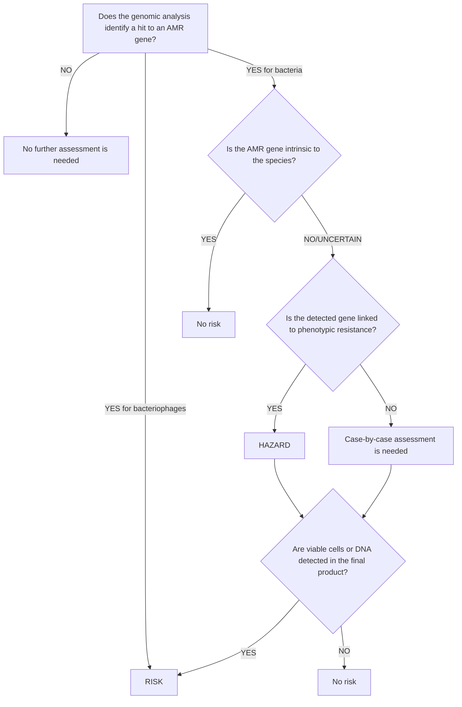

Adopted: 24 September 2025
DOI: 10.2903/j.efsa.2025.9705
efsa JOURNAL

**G U I D A N C E**

# Guidance on the characterisation of microorganisms in support of the risk assessment of products used in the food chain

**EFSA Scientific Committee | Susanne Hougaard Bennekou | Ana Allende | Angela Bearth | Josep Casacuberta | Laurence Castle | Tamara Coja | Amélie Crépet | Thorhallur Ingi Halldorsson | Ron Hoogenboom | Pikka Jokelainen | Helle Katrine Knutsen | Claude Lambré | Søren Saxmose Nielsen | Dominique Turck | Antonio Vicent Civera | Roberto Edoardo Villa | Holger Zorn | Margarita Aguilera Gómez | Stéphane Brétagne | Henrik Christensen | Pier Sandro Cocconcelli | Lieve Herman | Miguel Prieto-Maradona | Baltasar Mayo | Carmen Peláez | Maria Saarela | José Sánchez Serrano | Laurence Vernis | Andrey Yurkov | Jaime Aguilera | Montserrat Anguita | Nicole Bozzi Cionci | Rosella Brozzi | Sandra Correia | Yolanda García-Cazorla | Frédérique Istace | Elisa Pettenati | Joana Revez | Reinhilde Schoonjans | Piera Valeri | Boet Glandorf**

**Correspondence:** mese@efsa.europa.eu

> **Abstract**
> This document provides guidance to assist in the preparation of applications for regulated products to be used in the food chain containing, made from or produced by using microorganisms, genetically modified or not, that are subject to risk assessment within EFSA's remit before their placement on the EU market. This guidance focuses on the scientific requirements to characterise the microorganisms and, to some extent, their products. It provides the basis for hazard identification in support of the risk assessment of microorganisms and establishes the data requirements to conduct the risk assessment.
>
> **KEYWORDS**
> food chain, hazard, microorganisms, regulated products, risk assessment

This is an open access article under the terms of the Creative Commons Attribution-NoDerivs License, which permits use and distribution in any medium, provided the original work is properly cited and no modifications or adaptations are made.
© 2025 European Food Safety Authority. *EFSA Journal* published by Wiley-VCH GmbH on behalf of European Food Safety Authority.

*EFSA Journal.* 2025;23:e9705.
https://doi.org/10.2903/j.efsa.2025.9705
efsa.onlinelibrary.wiley.com/journal/1831-4732 **1 of 38**

2 of 38 | GUIDANCE ON THE CHARACTERISATION OF MICROORGANISMS USED IN THE FOOD CHAIN

# CONTENTS

Abstract 1
1. Background and Terms of Reference as provided by EFSA 4
   1.1. Background as provided by EFSA 4
   1.2. Terms of Reference 4
2. Scope 5
   2.1. Microorganisms and products under scope 5
3. Characterisation of the Microorganism 6
   3.1. Taxonomic identification 6
   3.2. Antimicrobial resistance 7
      3.2.1. Bacteria and bacteriophages 7
         3.2.1.1. Genomic analysis 8
         3.2.1.2. Discrimination between intrinsic and acquired AMR genes 8
         3.2.1.3. Phenotypic testing 9
         3.2.1.4. Interpretation of the results 9
      3.2.2. Yeasts and filamentous fungi 9
   3.3. Production of antimicrobial substances 10
   3.4. Toxigenicity and pathogenicity 11
      3.4.1. Bacteria 11
         3.4.1.1. *Bacillus* species included in the QPS list 11
         3.4.1.2. *Bacillus cereus* 11
         3.4.1.3. *Enterococcus faecium* and *Enterococcus lactis* 11
      3.4.2. Yeasts and filamentous fungi 12
      3.4.3. Viruses 12
      3.4.4. Microalgae and other protists 13
   3.5. Genetic modifications 13
      3.5.1. Characteristics of the genetic modifications 13
         3.5.1.1. Inserted sequences 13
         3.5.1.2. Other modifications 14
      3.5.2. Structure of the genetic modification 14
         3.5.2.1. Structure of the genetic modification using WGS data 14
         3.5.2.2. Structure of the genetic modification without using WGS data 14
4. Presence of viable cells and DNA in the final product 15
   4.1. Presence of viable cells of the strain 15
   4.2. Presence of DNA from the strain 15
5. Environmental risk assessment 16
   5.1. Non-GM active agents 16
   5.2. Non-GM and GM biomasses 17
   5.3. GM active agents 17
      5.3.1. Areas of risk 18
         5.3.1.1. Persistence and invasiveness, including selective advantage (1 and 2) 18
         5.3.1.2. Horizontal gene transfer (3) 18
         5.3.1.3. Effects on target organisms (4) 18
         5.3.1.4. Effects on non-target organisms (NTOs) (5) 19
         5.3.1.5. Effects on humans or animals (6 and 7) 19
         5.3.1.6. Effect on biogeochemical processes (8) 19
         5.3.1.7. Effect of management techniques (9) 20
6. Outcomes 20

18314732, 2025, 11, Downloaded from https://efsa.onlinelibrary.wiley.com/doi/10.2903/j.efsa.2025.9705 by NICE, National Institute for Health and Care Excellence, Wiley Online Library on [17/03/2026]. See the Terms and Conditions (https://onlinelibrary.wiley.com/terms-and-conditions) on Wiley Online Library for rules of use; OA articles are governed by the applicable Creative Commons License

GUIDANCE ON THE CHARACTERISATION OF MICROORGANISMS USED IN THE FOOD CHAIN | **3 of 38**

6.1. Non-GM active agents 20
6.2. GM active agents 20
6.3. GM and non-GM biomasses 21
6.4. Products produced by using GM and non-GM microorganisms 21
6.5. GM and non-GM bacteriophages 21
Glossary 22
Abbreviations 23
Acknowledgements 24
Requestor 24
Question number 24
Copyright for non-EFSA content 24
Panel members 24
References 24
Appendix A 26
Appendix B 28
Appendix C 29
Appendix D 30
Appendix E 31
Appendix F 32
Appendix G 33
Appendix H 34
Appendix I 35
Appendix J 36
Appendix K 37
Annex A 38

18314732, 2025, 11, Downloaded from https://efsa.onlinelibrary.wiley.com/doi/10.2903/j.efsa.2025.9705 by NICE, National Institute for Health and Care Excellence, Wiley Online Library on [17/03/2026]. See the Terms and Conditions (https://onlinelibrary.wiley.com/terms-and-conditions) on Wiley Online Library for rules of use; OA articles are governed by the applicable Creative Commons License

4 of 38 | GUIDANCE ON THE CHARACTERISATION OF MICROORGANISMS USED IN THE FOOD CHAIN

# 1 | BACKGROUND AND TERMS OF REFERENCE AS PROVIDED BY EFSA

## 1.1 | Background as provided by EFSA

Products containing microorganisms or prepared/obtained from/with1 microorganisms are used in the food chain. These products could be placed on the European market following a pre-market authorisation process, which may require a risk assessment. For those products, relevant European Food Safety Authority (EFSA) Panels have prepared guidance/reference documents detailing the necessary data for the risk assessment in the different sectors of the food chain.

In general, the risk assessment of products containing or prepared/obtained from/with microorganisms considers the characterisation of the microorganisms, genetically modified or not, and their resulting products, their safety for animals, humans and the environment, and their efficacy. The data required for the risk assessment may differ depending on the regulatory framework, the type of product, and the intended use.

However, the characterisation of the microorganisms provides information relevant to the safety assessment, which should be the same irrespective of the food sector for which the product is intended to be authorised. In this regard, the characterisation of the microorganisms requires data in relation to:

*   Their taxonomic identification and the presence of traits/genes of concern such as those encoding antimicrobial resistance and virulence factors, and involved in the production of toxins, antimicrobial substances or harmful secondary metabolites.
*   The genetic modification(s) to which they may be subject.

Similarly, the products prepared/obtained from/with microorganisms need to be characterised for aspects related to the microorganism(s) from which they are prepared/obtained from/within a harmonised way across areas. These aspects include, for instance, the presence of antimicrobial activity and the presence of viable cells and/or DNA of the microorganism. Moreover, there may be a need for data to assess the potential effects of the product on the receiving environment(s) and beyond (e.g. food/feed and gut microbiome).

Considering all of the above, it is important that EFSA ensures alignment on the characterisation of microorganisms and harmonisation of the requirements for applications underpinning the assessment of microorganisms in the food chain. EFSA should also address current gaps in existing guidance documents and set requirements for certain taxonomic groups of microorganisms/products, as well as for aspects of the risk assessment for which guidance does not exist or it is very limited (e.g. viruses, microalgae; risk assessment for the environment). Finally, EFSA should ensure that guidance for applicants is according to up-to-date knowledge.

## 1.2 | Terms of Reference

EFSA requests the Scientific Committee to prepare guidance on the characterisation of microorganisms used in the food chain considering:

*   existing guidance documents/reference documents as well as EFSA's current practices in the risk assessment of microorganisms;
*   current and future needs for the risk assessment of microorganisms and their products;
*   up-to-date scientific knowledge.

The document should provide guidance for the characterisation and risk assessment of microorganisms, genetically modified or not, used as such or to obtain/produce from/with regulated products. The guidance should:

*   consider taxonomic groups of interest for regulated products including, at least, bacteria, yeasts, filamentous fungi, microalgae and other protists, and viruses including bacteriophages, as well as the different uses of the microorganisms in the food chain;
*   establish the requirements to characterise the microorganisms in relation to the genetic modification (when relevant), the presence of traits/genes of concern, the characterisation of products obtained/produced from/with microorganisms characterised for aspects related to the microorganism(s), and the basis for the safety risk assessment of microorganisms.

1Recital 16 of Regulation (EC) No 1829/2003 on GM food and feed clarifies that food and feed ‘produced with’ a GMO (as opposed to food and feed ‘produced from’) is excluded from the regulation. To avoid confusion with terms of legal meaning, reference to products obtained from microbial fermentation in which step to remove the microorganism has been applied have been changed to ‘produced by using’ microorganisms in the text of this guidance document.

GUIDANCE ON THE CHARACTERISATION OF MICROORGANISMS USED IN THE FOOD CHAIN | 5 of 38

# 2 | SCOPE

This document provides guidance to assist in the preparation of applications for products to be used in the food chain containing, made from, or produced by using microorganisms, genetically modified (GM) or not, that are subject to risk assessment within EFSA's remit before their placement on the European Union (EU) market.

This guidance focuses on the scientific requirements to characterise the microorganisms and, to some extent, their products. It provides the basis for hazard identification in support of the risk assessment of microorganisms and establishes the data requirements to conduct the risk assessment in relation to:

*   the taxonomic identification of the microorganism(s);
*   the presence of genes of concern involved in the resistance to and/or production of therapeutic antimicrobials, and the virulence and toxigenic potential of the microorganism(s);
*   the presence of viable cells, genetic material and/or substances of concern (e.g. toxins, toxic metabolites, therapeutic antimicrobials) that may remain in the product made from or produced by using the microorganism(s);
*   the possible impact of the products containing living microorganisms and made from microorganisms on the environment.

The possible impact of the products under scope on the gut microbiome, should be considered in certain cases (e.g. when an adverse effect can be anticipated based on the body of knowledge, or when their use is expected to have effects on the gut microbiome of animals or humans), and will be assessed on a case-by-case basis. Examples of adverse effects on the gut microbiome include, e.g. colitis, diarrhoea or shedding of pathogenic microorganisms.

The guidance covers the characterisation of bacteria, yeasts, filamentous fungi, microalgae and other protists, and viruses, including bacteriophages and their host strains. For cyanobacteria, the requirements for bacteria will apply, while for other taxonomic groups (e.g. Archaea) the basic principles would apply but the assessment will be conducted on a case-by-case basis.

EFSA uses a specific safety assessment approach of microbial species included in the ‘updated list of Qualified Presumption of Safety (QPS)-recommended microorganisms for safety risk assessments carried out by EFSA’ (‘QPS list’) and available at the Knowledge Junction in Zenodo.2 A microorganism is suitable for the QPS approach if it belongs to a taxonomic unit (species for bacteria, yeasts, fungi and microalgae/protists; family for viruses) included in the most recent QPS list and it fulfils all the qualifications set. For genetically modified microorganisms (GMMs) for which the species of the parental/recipient strain qualifies for the QPS status, and for which the genetic modification does not give rise to safety concerns, the QPS approach can be extended to the genetically modified strain(s) used as production strains, biomasses or active agents. The QPS approach can also be followed if the qualifications for QPS are met due to the removal of a gene(s) of concern, by means of genetic modification (EFSA BIOHAZ Panel, 2025). This approach waives the need for some safety data for the microorganisms, GM or not, and products made from or produced by using them. Considering the above, this guidance provides indications on how to taxonomically identify the strain, meet any qualification, and when relevant, to establish the safety of the genetic modification, to determine the suitability of the microorganism under assessment to qualify for the QPS approach.

This guidance describes the requirements for the characterisation of the microorganisms for the purpose of risk assessment, and it can be applied in all areas of the food chain, ensuring alignment across food domains.

It is noted that for products falling under the Regulation on plant protection products (PPPs),3 the risk assessment is conducted by the Member States and EFSA in line with the relevant regulatory framework.4 In this context, this guidance document covers the scientific requirements supporting the characterisation of the microorganism (sections 3, 4 and relevant parts of section 6) and can be considered in addition to other existing guidance documents.5

Appendix A provides a list of the EFSA guidance documents currently available that are impacted by this guidance.

## 2.1 | Microorganisms and products under scope

For the purpose of this guidance, the following definitions apply to the microorganisms and their products that are under the scope:

2Updated list of QPS-recommended microorganisms for safety risk assessments carried out by EFSA. Available online: https://doi.org/10.5281/zenodo.1146566 (the link leads to the latest version of the QPS list, and also shows the versions associated to each QPS Panel Statement).
3Legislation on Plant Protection Products (PPPs). Available online: https://food.ec.europa.eu/plants/pesticides/legislation-plant-protection-products-ppps_en.
4Regulation (EC) No 1107/2009 of the European Parliament and of the Council of 21 October 2009 concerning the placing of plant protection products on the market and repealing Council Directives 79/117/EEC and 91/414/EEC. Available online: https://eur-lex.europa.eu/eli/reg/2009/1107/2022-11-21.
5https://food.ec.europa.eu/plants/pesticides/micro-organisms_en.

6 of 38 | GUIDANCE ON THE CHARACTERISATION OF MICROORGANISMS USED IN THE FOOD CHAIN

*   ‘Active agent’ is a GM6 or a non-GM microorganism capable of multiplication that may be used as such in products.
*   ‘Biomass’ is a product produced from a GM7 or a non-GM microorganism where steps have been taken in the manufacturing process to inactivate the microorganisms. No viable cells (capable of multiplication) are detected in the product, but the genetic material typically remains in the product.
*   ‘Production strain’ is a GM or a non-GM microorganism that produces substances (or precursors) of interest (‘product’8) via a manufacturing process that includes step(s) to remove the microorganisms.

For the scope of this guidance, bacteriophages are considered as active agents. The bacterial host strain(s) in which the bacteriophages are replicated are considered as production strain(s).

For products involving several strains, data should be provided for each of them.

In the context of this guidance, the outcome of the risk assessment of the identified hazard(s) will depend on the end use of the product. For instance, if a hazard (e.g. acquired genes encoding for resistance to therapeutic antimicrobials) is identified, this will be considered a risk if the microorganism is an active agent since exposure to the hazard is expected. Conversely, for a production strain when no viable cells nor DNA are detected in the final product, exposure to the hazard is not expected and the use of the product is not considered to be a risk.

# 3 | CHARACTERISATION OF THE MICROORGANISM

The characterisation should be based on data obtained from the specific strain(s) under assessment. For bacteriophages, the characterisation applies to both the bacteriophage and its host strain(s).

The strain should be deposited in an internationally recognised culture collection, preferably in the EU and maintained by the culture collection for the authorised life of the product. A certificate from the culture collection should be provided at the time of submission including the safe deposit, the valid published name of the species, the strain identifier(s) and the accession number under which it is held. In cases in which the strain cannot be assigned to any validly published microbial species, ‘sp.’ should be written after the genus name to denote its undefined species taxonomic status. If different names or codes for the microorganism are used in-house or in third-party data, a statement should be provided confirming that they correspond to the strain under assessment.

The origin and history of modifications of the strain, if any, including mutagenesis steps performed during its development, should be reported. Any genetic modification, as defined in the applicable GMO legislation, should be characterised according to Section 3.5.

The characterisation of microorganisms should be generally performed by whole genome sequencing (WGS)-based analyses. The analysis of complete WGS data should be provided for bacteria, yeasts, filamentous fungi and viruses. Further information on how to conduct and report the sequencing and WGS-based analyses is available in the ‘EFSA Statement on the requirements for whole genome sequence analysis of microorganisms intentionally used in the food chain’ (EFSA, 2024a, and future updates). All the bioinformatic analyses should not be older than 2 years at the time of submission of the application. Maintained/curated databases should be used.

The WGS data for the strain under assessment should provide information on the taxonomic identity of the strain, as well as information on its characterisation regarding the genetic modifications, if any, and the potential presence of genes of concern. For this guidance, genes of concern are those known to contribute to the production of toxins, harmful metabolites, therapeutic antimicrobials, acquired gene(s) conferring resistance to therapeutic antimicrobials and those coding for virulence factors.

## 3.1 | Taxonomic identification

The microorganism(s) under assessment should be unambiguously identified. Bacteria, yeasts, filamentous fungi, microalgae and other protists and viruses should be identified at the species level. Moreover, in the area of PPPs, unequivocal identification at strain level should be provided.9

The taxonomic information should be provided for the specific microorganism under assessment. Identification of the parental strain or other strains belonging to the same lineage alone is not sufficient.

6Formerly known in the Guidance on the risk assessment of genetically modified microorganisms and their products intended for food and feed use as category 4: Products consisting of or containing GMMs capable of multiplication or of transferring genes (e.g. live starter cultures for fermented foods and feed).
7Formerly known in the Guidance on the risk assessment of genetically modified microorganisms and their products intended for food and feed use as category 3: Products derived from GMMs in which GMMs capable of multiplication or of transferring genes are not present, but in which newly introduced genes are still present (e.g. heat-inactivated starter cultures).
8For products produced by using GM microorganisms, these are formerly known in the Guidance on the risk assessment of genetically modified microorganisms and their products intended for food and feed use as category 1: Chemically defined purified compounds and their mixtures in which both GMMs and newly introduced genes have been removed (e.g. amino acids, vitamins) and category 2: Complex products in which both GMMs and newly introduced genes are no longer present (e.g. cell extracts, most enzyme preparations).
9Commission Regulation (EU) No 283/2013 of 1 March 2013 setting out the data requirements for active substances, in accordance with Regulation (EC) No 1107/2009 of the European Parliament and of the Council concerning the placing of plant protection products on the market. Available online: https://eur-lex.europa.eu/eli/reg/2013/283/2022-11-21.

GUIDANCE ON THE CHARACTERISATION OF MICROORGANISMS USED IN THE FOOD CHAIN | 7 of 38

For bacteria, the nomenclature that should be followed is covered by the ‘International Code of Nomenclature of Prokaryotes’ (ICNP; 2022 revision and future updates).10 Validly published names are included in the Approved Lists of Bacterial Names and in the *International Journal of Systematic and Evolutionary Microbiology* (IJSEM) and updated in the ‘List of Prokaryotic Names with Standing in Nomenclature’ (LPSN).11

For fungi, the nomenclature that should be followed is covered by the ‘International Code of Nomenclature for algae, fungi, and plants’ (ICNafp) (Turland & Wiersema, 2024, and future updates).12 Validly published names are included in the MycoBank and Index Fungorum databases.13

For viruses, validly published names are maintained by the International Committee on Taxonomy of Viruses (ICTV)14 and an overview of the phage taxonomy along with guidelines to assign taxonomic units has been described by Turner et al. (2021). When applicable, both the valid name and commonly used vernacular names should be provided.

For microalgae and other protists, although currently there is no unanimously accepted classification, their nomenclature and taxonomy are covered by the AlgaeBase database and the ICNafp and can be found at the NCBI taxonomy browser.15

The microorganism under assessment should be identified taxonomically using up-to-date methodologies and current knowledge:

*   For bacteria, yeasts, filamentous fungi and viruses, the taxonomic identification should be established based on WGS data analyses. For details on how to conduct and report the analyses, the applicant should refer to EFSA WGS Statement (EFSA, 2024a; and future updates).
*   For microalgae and other protists, the taxonomic identification should be achieved by combining morphological and DNA sequencing information of selected genetic markers, i.e. the complete or a large portion of the 18S rRNA gene16 together with loci, which are variable enough to provide a robust identification at the species level (using single marker genes or sets of concatenated genes, e.g. ITS1–5.8S–ITS2 rDNA, *rcbL* regions) (Darienko et al., 2015; Fawley & Fawley, 2020; Kezlya et al., 2023; Kollár et al., 2019). The choice of primers targeting the relevant loci should be described, paying attention to possible paralogs or orthologs. The data for the strain under assessment should be compared with those of the type strain of the expected species and those of closely related species. If the genome of the type strain is not available, publicly available genome sequences of other well-identified strain(s) can be used as a reference. For identification of a microorganism/strain at the species level, at least a 99% identity with the sequences of the type/reference strain should be shared for each locus used in the analysis (Fawley & Fawley, 2020).

If the microorganism under assessment cannot be assigned to any validly published microbial species, its phylogenetic position with respect to the closest described species should be provided (e.g. for bacteria using a genome taxonomy database such as the Genome Taxonomy Database17 or the Type Strain Genome Server18).

For microorganisms obtained by synthetic biology, the identification of the cellular host used as a recipient of engineered biological systems (i.e. chassis) should be provided.

## 3.2 | Antimicrobial resistance

### 3.2.1 | Bacteria and bacteriophages

This section applies to bacteria, and bacteriophages and their host strain(s). It refers to the assessment of genes that may confer resistance to antimicrobials of medical and veterinary importance for humans and animals as defined by the World Health Organization (WHO) and World Organisation for Animal Health (WOAH), respectively (‘medically important antimicrobials’ (WHO, 202419 and future updates) and ‘veterinary critically important antimicrobial agents, veterinary highly important antimicrobial agents and veterinary important antimicrobial agents’ (WOAH, 202420 and future updates).21 These antimicrobials will be referred throughout the text as ‘therapeutic antimicrobials’.

10International Code of Nomenclature of Prokaryotes Prokaryotic Code (2022 Revision). Available online https://www.microbiologyresearch.org/content/journal/ijsem/10.1099/ijsem.0.005585#tab2.
11List of Prokaryotic Names withstanding in Nomenclature (LPSN). Available online: https://lpsn.dsmz.de/.
12International Code of Nomenclature for algae, fungi, and plants (ICNafp). Available online: https://www.iapt-taxon.org/nomen/main.php.
13MycoBank Database, available online: http://www.mycobank.org and Index Fungorum, available online: https://www.indexfungorum.org.
14International Committee on Taxonomy of Viruses (ICTV). Available online: https://ictv.global/.
15AlgaeBase, available online: https://www.algaebase.org; NCBI taxonomy Database, available online: https://www.ncbi.nlm.nih.gov/Taxonomy/Browser/wwwtax.cgi.
16For instance the Protist Ribosomal Reference (PR2) Database, available online: https://pr2-database.org/.
17Genome Taxonomy Database. Available online: https://gtdb.ecogenomic.org/.
18Type Strain Genome Server. Available online: https://tygs.dsmz.de/.
19WHO (World Health Organization). (2024). WHO's List of Medically Important Antimicrobials: A risk management tool for mitigating antimicrobial resistance due to non-human use. Available online: https://cdn.who.int/media/docs/default-source/gcp/who-mia-list-2024-lv.pdf?sfvrsn=3320dd3d_2.
20WOAH List of Antimicrobial Agents of Veterinary Importance (June 2024). Available online: https://www.woah.org/app/uploads/2021/06/amended-91gs-tech-03-amr-working-group-report-en.pdf.
21Classification of antimicrobials is reliant on the provision of guidance by relevant bodies (World Health Organization (WHO), World Organisation for Animal Health (WOAH), European Medicines Agency (EMA), European Commission (EC), etc.).

18314732, 2025, 11, Downloaded from https://efsa.onlinelibrary.wiley.com/doi/10.2903/j.efsa.2025.9705 by NICE, National Institute for Health and Care Excellence, Wiley Online Library on [17/03/2026]. See the Terms and Conditions (https://onlinelibrary.wiley.com/terms-and-conditions) on Wiley Online Library for rules of use; OA articles are governed by the applicable Creative Commons License

8 of 38 | GUIDANCE ON THE CHARACTERISATION OF MICROORGANISMS USED IN THE FOOD CHAIN

Products intentionally added to the food chain should not contribute to the pool of antimicrobial resistance (AMR) in the receiving environment(s).

The assessment of antimicrobial resistance is primarily performed via WGS-based analysis (see Section 3.2.1.1). For the purpose of this guidance, any sequence showing an identity and length coverage above the established thresholds (EFSA, 2024a; and future updates) with an AMR gene included in a maintained/curated database is defined as a 'hit'. When the genomic analysis identifies a hit to an AMR gene, its intrinsic/acquired nature should be determined (EFSA BIOHAZ Panel, 2023a and future updates). Phenotypic data and literature searches may be required to complement the assessment. However, for microorganisms with a limited body of knowledge, a case-by-case assessment is needed. Figure 1 shows the decision tree on the assessment of AMR in bacteria and bacteriophages.

**FIGURE 1** Decision tree on the risk assessment of antimicrobial resistance in bacteria and bacteriophages.

### 3.2.1.1 | Genomic analysis

The search for the presence of genes conferring resistance to therapeutic antimicrobials should be conducted in the complete genome of bacteria (including any extrachromosomal elements) and bacteriophages (EFSA, 2024a; and future updates). For bacteriophages, the search should be performed both in the genomes of the bacteriophage and the bacterial host strain (production strain).

The comparison of the WGS data of the strain under assessment against at least two maintained/curated AMR databases following the provisions of the EFSA WGS Statement (EFSA, 2024a; and future updates) should be performed and the outcome reported.

Any hit identified by the analysis should be subject to further assessment as described below.

### 3.2.1.2 | Discrimination between intrinsic and acquired AMR genes

When the genomic comparison analysis identifies a hit with a known AMR gene, the nature of the gene (i.e. acquired vs. intrinsic) in the bacterial species of the strain under assessment should be determined. Indications on how to discriminate between acquired and intrinsic AMR genes are provided in the "Statement on how to interpret the QPS qualification on 'acquired antimicrobial resistance genes'" (EFSA BIOHAZ Panel, 2023a, and future updates). The principles described in that document apply also to non-QPS bacteria. A bioinformatics pipeline implementing those principles is available22 and can be used to perform the analysis (EFSA, 2024b).

22Pipeline for the automated analysis of gene distribution in microbial species. Available online: https://zenodo.org/records/12608405.

18314732, 2025, 11, Downloaded from https://efsa.onlinelibrary.wiley.com/doi/10.2903/j.efsa.2025.9705 by NICE, National Institute for Health and Care Excellence, Wiley Online Library on [17/03/2026]. See the Terms and Conditions (https://onlinelibrary.wiley.com/terms-and-conditions) on Wiley Online Library for rules of use; OA articles are governed by the applicable Creative Commons License

GUIDANCE ON THE CHARACTERISATION OF MICROORGANISMS USED IN THE FOOD CHAIN | 9 of 38

If uncertainty remains about the intrinsic nature of the AMR gene, the AMR gene will be considered as acquired and assessed accordingly (see Figure 1).

For GMMs in which the genetic modification introduces an AMR gene, this is regarded as acquired and therefore considered to be of relevance to hazard identification and risk assessment.

### 3.2.1.3 | Phenotypic testing

For acquired AMR genes and the ones whose nature is uncertain, phenotypic tests of the strain under assessment with the antimicrobial(s) against which the AMR gene may confer resistance should be performed. Antimicrobial susceptibility testing should be performed to distinguish resistant from susceptible strains by determining the minimum inhibitory concentration (MIC) values following Appendix B, and comparing them, when available, with the established cut-off values in Appendix C. When cut-off values for the specific or closely related species are not available, MIC distribution retrieved from the literature, and/or generated in-house may be used as a basis for defining cut-off values.

### 3.2.1.4 | Interpretation of the results

*Bacteriophages*

If a hit to a known AMR gene present in a database is identified in the genome, it is considered to be a risk.

*Bacteria*

If a hit to a known AMR gene present in a database is identified, but it can be shown that the gene is intrinsic to the species, it is considered to be of no concern and no further information is needed.

If a hit to a known AMR gene present in a database is identified, but the data do not allow the conclusion that the gene is intrinsic to the species, the assessment should be complemented with phenotypic data and the results should be interpreted as described below.

For active agents:

* If the MIC value is above the cut-off value indicating phenotypic resistance, it is considered to be a risk.
* If the MIC value is equal to or below the cut-off value indicating no phenotypic resistance linked to the genotype, a case-by-case analysis is needed to assess the potential of the AMR gene to become active. This case-by-case analysis should take into account the identity and coverage of the matching sequence with the identified gene, the presence of insertions or deletions (indels), mutations, regulatory sequences, plus existing knowledge about its actual cellular/physiological function.

For production strains (including host strains in which the bacteriophages are replicated) and strains used to produce biomasses:

* If the MIC value is above the cut-off value indicating resistance, it is considered to be a hazard.
* If the MIC value is equal to or below the cut-off value indicating no phenotypic resistance linked to the genotype, a case-by-case analysis is needed to assess the potential of the AMR gene to become active. This case-by-case analysis should take into account the identity and coverage of the matching sequence with the identified gene, the presence of insertions or deletions (indels), mutations, regulatory sequences, plus existing knowledge about its actual cellular/physiological function.

For production strains and biomasses, the presence of acquired AMR gene(s) in the strain is not considered to be a risk when, following the analyses described in Section 4, neither DNA nor viable cells are detected in the final product.

### 3.2.2 | Yeasts and filamentous fungi

This section applies to all yeasts and filamentous fungi used as active agents and to those used as production strains if the potential presence of viable cells has not been excluded, following the analyses described in Section 4. To distinguish resistant from susceptible strains, susceptibility testing should be performed by determining the MIC values following Appendix B and comparing them, when available, with the established cut-off values in Appendix D. When cut-off values for the specific or closely related species are not available, MIC distribution retrieved from the literature, and/or generated in house may be used as a basis for defining cut-off values.

18314732, 2025, 11, Downloaded from https://efsa.onlinelibrary.wiley.com/doi/10.2903/j.efsa.2025.9705 by NICE, National Institute for Health and Care Excellence, Wiley Online Library on [17/03/2026]. See the Terms and Conditions (https://onlinelibrary.wiley.com/terms-and-conditions) on Wiley Online Library for rules of use; OA articles are governed by the applicable Creative Commons License

10 of 38 | GUIDANCE ON THE CHARACTERISATION OF MICROORGANISMS USED IN THE FOOD CHAIN

Susceptibility to at least two commonly used therapeutic antifungal compounds (ideally belonging to two classes with distinct molecular mode of action) should be shown.23 This would ensure that effective therapeutic options remain available in case of accidental fungal infections occurring in humans and animals.

Acquired antifungal resistance arises as an evolutionary response to selective antimicrobial pressure and horizontal transfer of resistance genes has not been demonstrated (Fisher et al., 2022). Therefore, conducting genomic analysis to elucidate the nature (acquired vs. intrinsic) of a particular antifungal resistance is not considered relevant for the purpose of this guidance.

## 3.3 | Production of antimicrobial substances

This section applies to active agents (excluding bacteriophages), production strains (including host strains in which the bacteriophages are replicated) and strains used to produce biomasses belonging to taxonomic units:

*   not qualifying for the QPS approach, or
*   known to produce relevant antimicrobials, or
*   included in the QPS list but for which a qualification for antimicrobial production exists.

For the purpose of the assessment of antimicrobial production in this guidance, the antimicrobial substances considered are those described in Section 3.2.1. The assessment should be performed using WGS-based analysis and phenotypic tests.

The WGS data for the strain should be interrogated for the presence of genes or gene clusters involved in the biosynthesis of antimicrobials against a maintained/curated database. The analysis should be conducted and reported following the provisions of the EFSA WGS Statement (EFSA, 2024a; and future updates).

Phenotypic tests should be carried out to assess the inhibitory activity of the strain under assessment following the principles of internationally recognised methods developed for antimicrobial susceptibility testing (e.g. European Committee on Antimicrobial Susceptibility Testing (EUCAST); Matuschek et al., 2014; FAO, 2006). A set of at least six reference/indicator bacterial strains representing different Gram-negative and Gram-positive species (e.g. *Escherichia coli* DSM 1103, *Pseudomonas aeruginosa* DSM 1117, *Staphylococcus aureus* DSM 1104, *Enterococcus faecalis* DSM 2570, *Bacillus spizizenii* DSM 347, *Streptococcus pyogenes* DSM 1172824 or other reference strains), known to be susceptible to different antimicrobial classes, should be included and the rationale for their choice should be provided. The result of the analysis should be reported for each reference/indicator strain tested.

The phenotypic tests described above should be conducted as follows:

*   **For active agents:** the culture supernatant of the strain(s) should be tested.
*   **For production strains and strains used to produce biomasses:** the culture supernatant and/or the fermentation product should be tested. For fermentation products, samples should be taken from the industrial scale process and the exact stage of the manufacturing process from which these are taken should be indicated. Samples from the pilot scale process can be considered only if those from the industrial process are not available. In this case, it should be documented that the pilot-scale process (fermentation and downstream) is representative of the industrial scale process.

When antimicrobial activity towards at least one indicator strain is observed, the nature of the antimicrobial activity should be investigated to exclude the production of therapeutic antimicrobials.

If the genomic analysis detects the presence of genes/gene clusters involved in the biosynthesis of therapeutic antimicrobials, the possible presence of the antimicrobial compound(s) should be quantitatively analysed in culture supernatants of the strain (for active agents) or final product (e.g. for production strains, strains used to produce biomasses, PPPs). Attention should be paid to the possible presence of such compounds at sub-inhibitory concentrations that may elicit resistance in bacteria (EFSA BIOHAZ Panel, 2021).

If the genomic analysis does not detect the presence of genes/gene clusters involved in the biosynthesis of therapeutic antimicrobials, and no inhibition is observed in the phenotypic test, the strain is considered not able to produce relevant antimicrobials.

In any other cases, a case-by-case assessment should be conducted.

For ionophoric coccidiostats used as feed additives and produced by species known to produce other therapeutic antimicrobials, the presence of antimicrobial activity not related to the ionophore in the fermentation/feed additive should be investigated (e.g. by comparing the inhibitory spectrum of the pure ionophore with that of the additive). The set of indicator strains described above can be used for this purpose.

23The main antifungal substances used to treat invasive fungal infections can be found in Global guideline for the diagnosis and management of candidiasis (ECMM, ISHAM, ASM, 2025; available online: https://doi.org/10.1016/S1473-3099(24)00749-7) and Diagnosis and management of *Aspergillus* diseases: executive summary of the 2017 ESCMID-ECMM-ERS guideline (2018; available online: https://doi.org/10.1016/j.cmi.2018.01.002).
24The correspondence of the microbial strain identifiers deposited in different culture collections may be found in the StrainInfo database. Available online: https://straininfo.dsmz.de/.

GUIDANCE ON THE CHARACTERISATION OF MICROORGANISMS USED IN THE FOOD CHAIN | 11 of 38

## 3.4 | Toxigenicity and pathogenicity

For strains belonging to a species not included in the QPS list, information should be provided related to the toxigenicity and pathogenicity (including infectivity), as well as the history of use of the strain/species and/or closely related strains/species. In general, this should be based on an up-to-date extensive literature search.25

Any step performed during the development of the strain (including mutagenesis and/or genetic modifications) resulting in the reduction of its toxigenicity and/or pathogenicity should be clearly documented and supported by data.

For strains belonging to a species included in the QPS list, safety concerns related to their potential toxigenicity and pathogenicity are excluded and the sections below do not apply, unless a qualification exists.

### 3.4.1 | Bacteria

For bacterial strains, including host strains of bacteriophages, a WGS-based analysis should be conducted to identify genes coding for known virulence factors or known harmful metabolites. For this purpose, a WGS-based analysis of the strain under assessment against at least one maintained/curated database should be performed and reported following the provisions of the EFSA WGS Statement (EFSA, 2024a; and future updates). Hits to genes encoding virulence factors and/or known harmful metabolites may trigger phenotypic testing. On a case-by-case basis (such as when the level of knowledge of the species is low), the bioinformatic analysis may need to be complemented further with literature and/or experimental data (e.g. toxicological studies).

Exceptions to the above requirements are taxonomic units for which safety can be established by specific tests (i.e. *Bacillus* spp. and related genera included in the QPS list, *Bacillus cereus*, *Enterococcus faecium* and *Enterococcus lactis*).

#### 3.4.1.1 | *Bacillus* species included in the QPS list

*Bacillus* species and taxonomically related species (including those formerly belonging to *Bacillus* genus) are included in the QPS list with the qualification of ‘absence of toxigenic activity’. Compliance with this qualification should be shown by a cytotoxicity test, to evaluate the potential of the strain to produce high levels of non-ribosomally synthesised peptides. A generally accepted in vitro VERO cell-based method should be used (e.g. Lindbäck & Granum, 2005; Moravek et al., 2006; Haug et al., 2010) including the use of cytotoxic *B. cereus* strains as positive controls.26

Considering the type of product and its intended use, a strain with toxigenic activity is a hazard. Depending on the exposure (e.g. food, feed), a risk cannot be excluded.

#### 3.4.1.2 | *Bacillus cereus*

The toxigenic potential of *Bacillus cereus* sensu lato strains is known. It should be assessed as follows:

*   A WGS-based analysis should be conducted following the provisions of the EFSA WGS Statement (EFSA, 2024a; and future updates) to identify genes/operons encoding enterotoxins, cereulide and other virulence factors (e.g. non-haemolytic enterotoxin, haemolysin BL and cytotoxin K). The genes identified should be investigated for functionality. This should take into account the identity and coverage of the matching sequence with the identified gene, the presence of insertions or deletions (indels), mutations and regulatory sequences.
*   A cytotoxicity test should be conducted as described in Section 3.4.1.1.

Considering the type of product and its intended use, a strain with toxigenic activity is a hazard. Depending on the exposure (e.g. food, feed), a risk cannot be excluded.

#### 3.4.1.3 | *Enterococcus faecium* and *Enterococcus lactis*

Pathogenesis in *E. faecium* seems to be associated with a diverse set of putative virulence markers (e.g. genes encoding surface proteins, pili, secreted virulence factors) with some of their variants being *E. faecium*-specific or present mainly in *E. faecium* isolates that cause infections (e.g. *ptsD*, *esp*, *IS16*, *hyl*Efm and *orf1481*) (Belloso Daza et al., 2022b; Roer et al., 2024).

*E. faecium* consists of distinct subpopulations. The community-associated clade B, containing strains colonising the human and animal gut, has been recently reassigned to the species *E. lactis* based on WGS analyses (Belloso Daza et al., 2021). *E. lactis* strains are generally more susceptible to antimicrobials than *E. faecium* isolates and lack hospital-associated markers (Belloso Daza et al., 2021, 2022a, 2022b). Moreover, genes associated with adhesion/colonisation are either truncated or show low identity with those harboured by *E. faecium* reference strains (Belloso Daza et al., 2022b; Roer et al., 2024).

25E.g., Technical manual for performing electronic literature searches in food and feed safety (Glanville et al., 2014a, 2014b), Appendix D of the ‘Tools for critically appraising different study designs, systematic review and literature searches’. Available online: https://efsa.onlinelibrary.wiley.com/doi/pdf/10.2903/sp.efsa.2015.EN-836.
26Percentage of cytotoxicity is calculated using the following formula: ((Negative control – sample)/Negative control) × 100; in which the negative control is Vero cells without the addition of sample. A value >20% is considered as an indication of cytotoxicity.

18314732, 2025, 11, Downloaded from https://efsa.onlinelibrary.wiley.com/doi/10.2903/j.efsa.2025.9705 by NICE, National Institute for Health and Care Excellence, Wiley Online Library on [17/03/2026]. See the Terms and Conditions (https://onlinelibrary.wiley.com/terms-and-conditions) on Wiley Online Library for rules of use; OA articles are governed by the applicable Creative Commons License

12 of 38 | GUIDANCE ON THE CHARACTERISATION OF MICROORGANISMS USED IN THE FOOD CHAIN

The discrimination between *E. faecium* and *E. lactis* strains based on the WGS data should be performed including the type strains27 of both species (see Section 3.1).

To determine the potential virulence of the strain under assessment, a bioinformatic analysis should be made following the provisions of the EFSA WGS Statement (EFSA, 2024a; and future updates) to query for genes/operons encoding putative virulence factors. If no hits are detected, no further phenotypic testing is necessary; if hits are detected, their relevance should be assessed on a case-by-case basis.

Additionally, if the strain belongs to *E. faecium*, the MIC value for ampicillin should be determined:

a. if the MIC >2 mg/L, the strain is considered to be a hazard and for products for which exposure to viable cells is presumed, it is a risk;
b. if the MIC ≤2 mg/L, the presence of the genes encoding for *ptsD*, *esp*, *IS16*, *hyl*Efm and *orf1481* should be investigated by WGS data interrogation. If one or more of these genetic elements are detected, the strain is considered to be a hazard and for products for which exposure is presumed, it is a risk.

### 3.4.2 | Yeasts and filamentous fungi

For yeasts and filamentous fungi, their potential pathogenicity or ability to produce harmful metabolites should be assessed.

A literature search should be carried out to identify the ability of the species or a closely related species to produce known harmful metabolites.

A WGS-based analysis should be performed to identify known metabolic pathways involved in toxigenicity. For this purpose, a comparison of the WGS data for the strain under assessment against at least one maintained/curated database should be performed and reported following the provisions of the EFSA WGS Statement (EFSA, 2024a; and future updates).

If the bioinformatic search of the strain under assessment and/or the literature data on the species and/or taxonomically close species indicate the potential of the strain to produce known harmful metabolites, the following should be provided:

* For active agents: phenotypic tests to investigate the ability of the strain to produce these metabolites under conditions relevant to the production or use of the product.
* For production strains and strains used to produce biomasses: quantitative analyses of the metabolites in the final product subject of the application (e.g. food enzyme, feed additive, novel food).

Details of the method used should be provided.

Further data/studies (e.g. toxicological studies) may still be needed if required by sectorial guidance documents and/or regulatory requirements applicable to the product under assessment.

### 3.4.3 | Viruses

The known host range/infectivity of viruses should be indicated. In addition, the infectivity and the absence of adverse effects of viruses on non-intended species should be investigated on a representative set of species.

The specificity of infection of plant viruses for the target plant species and the absence of adverse effects on non-target plant species should be investigated on a representative set of plant species. The choice of the species to be included (target and non-target) in the analysis should be based on literature and/or updated database(s).28 Regarding insect viruses for which a narrow host range is well documented (e.g. baculoviruses), existing internationally recognised guidance can be used to define the host range.29

The host range for bacteriophages needs to be determined on a representative set of strains belonging to the target and closely related bacterial species. Different subspecies/serovars/molecular genetic types of the bacterial species need to be included for the host range determination.

For bacteriophages, WGS data should be interrogated, using maintained/curated database(s) for querying the presence of:

* genes coding for toxins and other virulence factors
* genes coding for lysogeny
* genetic elements known to be involved in transduction (i.e. genes involved in genome packaging (terminases) and sequences essential for the recognition and cleavage of unit length genome (cos, pac)).

27Available online: https://straininfo.dsmz.de/strain/9315?SI-DP9250 and https://straininfo.dsmz.de/strain/370344?SI-DP855382.
28E.g. Wageningen University plant virus transmissions database. Available online: https://library.wur.nl/WebQuery/virus.
29OECD Guidance document on Baculoviruses as plant protection products. Available online: https://www.oecd.org/content/dam/oecd/en/publications/reports/2023/10/guidance-document-on-baculoviruses-as-plant-protection-products_1893107e/8f0dc501-en.pdf.

GUIDANCE ON THE CHARACTERISATION OF MICROORGANISMS USED IN THE FOOD CHAIN | 13 of 38

For details on how to conduct and report the WGS-based analysis, the applicant should refer to the EFSA WGS Statement (EFSA, 2024a; and future updates).

### 3.4.4 | Microalgae and other protists

For microalgae and other protists, their potential pathogenicity or ability to produce metabolites that could be harmful should be assessed. A literature search should be carried out to identify the ability of the specific or closely related species to produce known harmful metabolites.

When the literature search indicates the ability of the specific or closely related species to produce known harmful metabolites, phenotypic tests should be performed on the cell biomass and in the cell culture supernatants to investigate whether the strain under assessment is able to produce these metabolites under conditions relevant to the production or use of the product.

Moreover, for production strains and strains used to produce biomasses, quantitative analyses of the metabolites in the final product subject of the application (e.g. food enzyme, feed additive, novel food) should also be performed. Details of the method used should be reported.

Further studies (e.g. toxicological studies) may be needed if required by sectorial guidance documents and/or regulatory requirements applicable to the product under assessment.

## 3.5 | Genetic modifications

This section applies to microorganism(s) that are genetically modified as defined by the applicable GMO legislation.30

The genetic modification and its purpose should be described. A description of the traits and changes in the phenotype and metabolism of the microorganism resulting from the genetic modification is required.

### 3.5.1 | Characteristics of the genetic modifications

#### 3.5.1.1 | *Inserted sequences*

The sequence(s) inserted in the GMM can be derived from defined donor organism(s) or may be synthetically designed. The following information should be provided.

*DNA from donor organisms*

The taxonomic affiliation (genus and species) of the donor organism(s) should be provided. For sequences obtained from metagenomic data, the closest orthologous gene(s) should be indicated. The description of the inserted sequence(s) should include the:

*   nucleotide sequence of all inserted elements including a functional annotation and physical mapping of all functional elements including coding and non-coding regions;
*   name, derived amino acid sequence(s) and function(s) of the encoded protein(s). When available, the Enzyme Commission number (IUBMB) of the encoded enzyme.

*Designed sequences*

Designed sequences are those not known to occur in nature (e.g. codon-optimised genes, designed chimeric/synthetic genes). In such cases, information should be provided on the:

*   rationale and strategy for the design;
*   DNA sequence and a physical map of the functional elements;
*   derived amino acid sequence(s);
*   function(s) of the encoded gene product(s);
*   in the case of chimeric/synthetic proteins, similarity with sequences in maintained/curated databases. This should identify the functional domains (if described) of the recombinant protein; the best hits should be reported and described.

30Article 2(2) of Directive 2001/18/EC on the deliberate release into the environment of genetically modified organisms. *OJ L 106, 17.4.2001, p. 1–39.*

18314732, 2025, 11, Downloaded from https://efsa.onlinelibrary.wiley.com/doi/10.2903/j.efsa.2025.9705 by NICE, National Institute for Health and Care Excellence, Wiley Online Library on [17/03/2026]. See the Terms and Conditions (https://onlinelibrary.wiley.com/terms-and-conditions) on Wiley Online Library for rules of use; OA articles are governed by the applicable Creative Commons License

14 of 38 | GUIDANCE ON THE CHARACTERISATION OF MICROORGANISMS USED IN THE FOOD CHAIN

### 3.5.1.2 | *Other modifications*

Intentionally deleted sequence(s), introduced base pair substitutions, frameshift mutations or any other edited sequences should be indicated and described, together with an explanation of their intended effect.

### 3.5.2 | Structure of the genetic modification

#### 3.5.2.1 | *Structure of the genetic modification using WGS data*

Characterisation of the genetic modification(s) should be done by comparing the WGS data for the GMM with those of the non-genetically modified reference strain. This should be done for bacteria, viruses, yeasts and filamentous fungi. For further details, the applicant should refer to the EFSA statement on the requirements for whole genome sequence analysis of microorganisms intentionally used in the food chain (EFSA, 2024a; and future updates). Any gene of concern identified in the GMM by WGS alignment should be clearly indicated.

The most appropriate reference to be used is the non-GM strain from which the strain under assessment is derived (parental strain). The origin of the parental strain and the history of its modifications (i.e. conventional mutagenesis) should be described.

In instances in which the parental strain is not used as a reference, a valid alternative comparator should be used, and the choice should be justified.

Even though WGS data may not be used for the characterisation of certain microorganisms (e.g. microalgae and other protists), the use of sequencing is recommended for the characterisation of the modified region(s) by comparing the strain under assessment with the non-GM parental strain.

#### 3.5.2.2 | *Structure of the genetic modification without using WGS data*

When the WGS data are not required (e.g. microalgae and other protists) or are available but do not allow characterisation of the genetic modification, all the modification steps should be described.

The applicant should:

*   describe the methods used to introduce, delete, replace or modify the DNA into the recipient/parental strain and methods for selection of the GMM;
*   indicate whether the introduced DNA remains in the vector or is inserted into the chromosome(s) and/or, for eukaryotic microorganisms, into the DNA of organelles (e.g. mitochondria).

All the genetic material introduced to develop the strain under assessment should be described.

*Characteristics of the vector*

The description of the vector(s) used for the development of the GMM should include:

*   the source, type (plasmid, bacteriophage, virus, transposon) and host range of the vector. When helper plasmids are used, they should also be described;
*   a genetic map specifying the position of all functional elements and other vector components;
*   a table identifying each component of the vector (such as coding and non-coding sequences, origin(s) of replication and transfer, regulatory sequences and AMR genes) properly annotated, including the size, origin and role.

*Structure of the resulting genetic modification*

A graphical representation depicting the resulting genetic modification (i.e. any vector and/or donor nucleic acid remaining, or region deleted including its size and function) should be provided.

*Genes and sequences of concern*

Any gene or DNA sequence of concern inserted in the GMM should be clearly indicated.

Data excluding the presence of any sequence of concern not intended to be present in the GMM should be provided. The sequences of concern include:

*   sequences used transiently during the genetic modification process including vectors and helper plasmids;
*   sequences in plasmids/replicons from which a fragment was derived and used for transformation.

18314732, 2025, 11, Downloaded from https://efsa.onlinelibrary.wiley.com/doi/10.2903/j.efsa.2025.9705 by NICE, National Institute for Health and Care Excellence, Wiley Online Library on [17/03/2026]. See the Terms and Conditions (https://onlinelibrary.wiley.com/terms-and-conditions) on Wiley Online Library for rules of use; OA articles are governed by the applicable Creative Commons License

GUIDANCE ON THE CHARACTERISATION OF MICROORGANISMS USED IN THE FOOD CHAIN | 15 of 38

The presence of these sequences should be analysed by using appropriate methods (e.g. polymerase chain reaction (PCR) analyses). PCR experiments should include a positive control using the same gene(s) of concern (e.g. AMR gene(s)) as the one(s) used during strain development, together with controls to exclude PCR inhibition and to ensure sufficient sensitivity. A negative control should also be included.

# 4 | PRESENCE OF VIABLE CELLS AND DNA IN THE FINAL PRODUCT

This section applies to biomasses and products produced by using production strains, including host strains in which the bacteriophage is replicated.

The analyses described below should be done using samples of at least 1 g or 1 mL31 representative of the final product. At least nine samples obtained from a minimum of three independent batches32 of the product should be analysed. Samples should be taken from the industrial-scale process; the exact stage of the manufacturing process should be indicated. Samples from pilot-scale processes can be considered only if those from the industrial process are not available. In this case, it should be documented that the pilot scale process (fermentation and downstream) is representative of the industrial scale process. Equally or more concentrated upstream intermediate products used to manufacture the final product may be used. For different production processes, the product obtained from each process should be tested. For products with different formulations, the most concentrated form(s) should be tested. The raw data from the analyses (e.g. pictures of the gels/plates of controls and samples where any growth is observed) should be provided.

## 4.1 | Presence of viable cells of the strain

This section applies to:

*   biomasses obtained from GM and non-GM microorganisms;
*   products produced by using GM and non-GM production strains;33
*   bacteriophages to check for the presence of the bacterial host strain in which the bacteriophage is replicated.34

The techniques used to remove/inactivate microbial cells during downstream processing should be described in detail. The presence of viable cells35 of the strain under assessment should be investigated using a well described method:

*   Testing should be conducted by means of a suitable culture-based method. Cultivation-independent methods are not acceptable.
*   The procedure should enable the recovery of stressed cells by cultivation with a suitable medium and consider the possibility of contaminating microorganisms that might interfere with the detection of the strain. The cultivation should be done by growing the strain on solid medium with a prolonged incubation time (at least twice) compared with the standard one.
*   If colonies are observed on the solid medium, molecular methods should be used to exclude the presence of the strain under assessment. Discrimination by phenotypic traits may be acceptable on a case-by-case basis.
*   If the strain is able to form spores, their possible presence should be investigated using germination procedures specifically adapted to the strain prior to culturing (e.g. thermal treatment for bacteria).
*   To prove that the cultivation conditions enable the growth of any possible viable cells remaining in the product, a positive control with samples spiked with viable cells of the strain ($\le 100$ CFU/g or mL) should be included for at least one of the batches tested.

## 4.2 | Presence of DNA from the strain

This section applies to:

*   biomasses obtained from GM and non-GM microorganisms that harbour genes of concern (e.g. acquired AMR genes);
*   products produced by using GM production strains;36
*   products produced by using non-GM production strains that harbour genes of concern (e.g. acquired AMR genes);
*   bacteriophages when the bacterial host strain is GM or harbours genes of concern (e.g. acquired AMR genes).

31 In the case of products based on bacteriophages replicated in pathogenic species, the absence of the host strain should be demonstrated in samples of 25 g/mL, or in line with any applicable existing legislation.
32 Obtained from independent fermentation batches.
33 Testing the possible presence of viable cells of the non-GM production strain in the final product may not be needed depending on the regulatory requirements.
34 Testing the possible presence of viable cells of the non-GM host strain in the final product may not be needed depending on the regulatory requirements.
35 Viable cells are considered to be culturable cells.
36 The possible presence of DNA of the production strain in the final product subject of the application should be determined in compliance with applicable regulatory requirements, independently of the presence of genes of concern.

18314732, 2025, 11, Downloaded from https://efsa.onlinelibrary.wiley.com/doi/10.2903/j.efsa.2025.9705 by NICE, National Institute for Health and Care Excellence, Wiley Online Library on [17/03/2026]. See the Terms and Conditions (https://onlinelibrary.wiley.com/terms-and-conditions) on Wiley Online Library for rules of use; OA articles are governed by the applicable Creative Commons License

16 of 38 | GUIDANCE ON THE CHARACTERISATION OF MICROORGANISMS USED IN THE FOOD CHAIN

The presence of DNA from the strain should be tested by PCR. The total DNA from the samples should be extracted. To recover DNA from non-viable cells potentially remaining in the product, the extraction method should be suitable for all cellular forms of the strain under assessment (e.g. vegetative cells, spores). Detailed information on the lysis step should be provided.

The specific target sequence, primers and polymerase used as well as amplification conditions should be described in detail. The methodology used should consider the following:

*   If the strain harbours gene(s) of concern (e.g. acquired AMR gene(s)), whether the strain is GM or not, primers should be designed to amplify a fragment not exceeding the size of the smallest gene of concern and covering a maximum of 1 kb.
*   If the strain is a GM not harbouring gene(s) of concern, the targeted sequence should cover a maximum of 1 kb.

The following controls and sensitivity tests should be included in each of the three batches tested:

*   a negative control without sample
*   total DNA from the strain as a positive control for PCR amplification
*   a positive control with total DNA from the strain, added to the DNA extracted from each of the three batches of the product tested, to check for any factors causing PCR failure
*   total DNA from the strain, added to samples of each of the three batches of the product tested (spiking) before the DNA extraction process, starting with a known quantity and in different dilutions until DNA extinction, to calculate the limit of detection.

If PCR failure is encountered, the causes should be investigated (e.g. PCR inhibition, presence of nucleases).

The presence of the target DNA should be investigated using a method allowing detection of $\le$ 10 ng of total DNA per gram or mL of product.

# 5 | ENVIRONMENTAL RISK ASSESSMENT

This section refers to the environmental risk assessment (ERA) of microorganisms and applies to non-GM and GM active agents and biomasses.

For the purpose of this section, the environment considered is the receiving environment(s) (e.g. environmental microbiome) that is exposed to the product. The assessment of the impact of active agents and biomasses on the human and animal gastrointestinal tract (e.g. gut microbiome) is not covered by this section. but is done on a case-by-case basis following the main principles of this section.

The ERA of active agents takes into account both primary and secondary routes of exposure to the environment. For example, for a GM active agent used in crops, the primary exposure will be to the treated crops and soil. The secondary route of exposure may result from drift or leaching of the active agent to aquatic and terrestrial field margin ecosystems adjacent to agricultural fields. Another example of a secondary route of exposure can also be derived, for instance, from the use of an active agent as a feed additive, which after being consumed by the animals, may end up in their faeces/excreta. The spread of animal manure may lead to the contamination of the receiving environment(s) (e.g. agricultural fields, crops, waterways, soils).

In general, active agents (GM and non-GM) carrying genes of concern (e.g. acquired AMR genes) are considered to be a risk.

Biomasses obtained from strains containing genes of concern (e.g. acquired AMR genes) and in which DNA is detected according to Section 4.2 are considered to be a risk.

## 5.1 | Non-GM active agents

For non-GM active agents, the following should be considered:

*   For active agents belonging to species included in the QPS list, any impact on the environment is assessed as part of the QPS evaluation (EFSA BIOHAZ Panel, <mark>2023b</mark>). When the strain under assessment qualifies for QPS, safety for the environment is presumed and no further assessment is needed.
*   For active agents belonging to species not included in the QPS list, the following applies:
    - For those species that have been reported (e.g. from the public literature or experimental data) as common members of microbiome(s) in the receiving environment(s), their use is considered unlikely to introduce adverse effects in that environment. Consequently, as their use is not expected to pose a risk to the environment, no further assessment is needed.
    - For those species not reported as common members of the microbiome(s) in the receiving environment(s), a case-by-case assessment would be needed. As a guide, the principles of the Organisation for Economic Cooperation and

18314732, 2025, 11, Downloaded from https://efsa.onlinelibrary.wiley.com/doi/10.2903/j.efsa.2025.9705 by NICE, National Institute for Health and Care Excellence, Wiley Online Library on [17/03/2026]. See the Terms and Conditions (https://onlinelibrary.wiley.com/terms-and-conditions) on Wiley Online Library for rules of use; OA articles are governed by the applicable Creative Commons License

GUIDANCE ON THE CHARACTERISATION OF MICROORGANISMS USED IN THE FOOD CHAIN | 17 of 38

Development (OECD) Guidance to the environmental safety evaluation of microbial biocontrol agents,37 the ‘Explanatory notes for the implementation of the data requirements on microorganisms and plant protection products containing them as part of Regulation (EC) No 1107/2009’,38 or the principles of the ERA for GM active agents (described in Section 5.3.1) may be used, acknowledging limitations in the applicability to contexts other than PPPs and GMOs.

In general, non-GM active agents harbouring acquired AMR genes, genes coding for toxins and/or virulence factors, are considered to be a risk.

## 5.2 | Non-GM and GM biomasses

Biomasses do not contain cells capable of multiplication but may still contain DNA from these microorganisms. Therefore, the ERA of biomasses focuses only on the potential adverse effects resulting from the horizontal transfer of DNA sequences from the biomass to other microorganisms (i.e. horizontal gene transfer (HGT)).

Potential adverse effects resulting from the HGT are not expected and consequently an ERA is not necessary for biomasses obtained from strains:

*   not harbouring genes of concern (e.g. acquired AMR genes);
*   harbouring genes of concern (e.g. acquired AMR genes) when DNA fragments are not detected as described in Section 4.2.

Biomasses obtained from strains harbouring genes of concern (e.g. acquired AMR genes) and in which DNA is detected according to Section 4.2 are considered to be a risk.

## 5.3 | GM active agents

For GM active agents the ERA is conducted on a case-by-case basis. It aims to identify and evaluate the potential adverse effects resulting from the newly introduced trait(s) in the GM active agent on the receiving environment(s) (i.e. the environment in which the GM active agent will be released).

The ERA of GMMs is based on a comparative approach. The assessment is focused on the potential adverse effects of the GMM resulting from the genetic modification. The comparator to be used in the assessment is usually the non-modified parental strain (see Section 3.5.2) that has a known history of safe use in the food chain, including the environment. A comparator with a previous ERA done under the applicable sectorial legislation39 may also be used. Alternatively, a comparator can be chosen and assessed for its environmental safety using the principles described above for non-GM active agents (see Section 5.1).

When no comparator is available (e.g. the parental strain has not been used yet in the food/feed chain or the environment, or the strain has been extensively modified), the general biological information available in the literature on the taxonomic unit (species for bacteria, yeast, fungi, microalgae and other protists; family for viruses) to which the microorganism belongs (i.e. the body of knowledge) may be used. Information on a different strain of the same or a phylogenetically close species that is applied in food, feed or in the environment may also be used. For microorganisms obtained by synthetic biology, the extent to which the existing body of knowledge on the microorganism can be used in the risk assessment will depend on the degree of familiarity with the synthetic microorganism and its chassis (EFSA Scientific Committee, 2022).

GM active agents carrying genes of concern are considered to be a risk.

In the ERA of GM active agents, specific areas of risk as defined in Section D.1. of Annex II to Directive 2001/18/EC40 should be considered. The ERA should be conducted for each GM active agent and for each relevant area of risk as described in Section D.1 of Annex II of the above-mentioned Directive, on the basis of the information required pursuant to Annex III A to that Directive. When experimental data are needed for the GM active agent and/or its phenotypic features, these data should be obtained under conditions that reflect as much as possible the natural conditions (biotic, abiotic) of the receiving environment(s) in which the GM active agent will be introduced.

The characterisation of the GM active agent should be done according to Section 3 of this guidance. In addition, based on the Annex IIIA (Section II) of Directive 2001/18/EC, the following should be provided:

*   **Parental microorganism**: information based on the body of knowledge available for the taxonomic unit to which the GM strain belongs, i.e. phenotypic and genotypic features, natural habitat, pathogenicity, ecological and physiological traits, history of use.

37OECD Guidance to the Environmental Safety Evaluation of Microbial Biocontrol Agents, Series on Pesticides and Biocides, No. 67, OECD Publishing, Paris. Available online: https://doi.org/10.1787/9789264221659-en.
38Available online: https://food.ec.europa.eu/system/files/2023-10/pesticides_ppp_app-proc_guide_imp-data-req_micro-organisms-ppp_imp-reg-11072009.pdf.
39E.g. plant protection products.
40Directive 2001/18/EC of the European Parliament and of the Council of 12 March 2001 on the deliberate release into the environment of genetically modified organisms. OJ L 106 17.4.2001, p. 1.

18 of 38 | GUIDANCE ON THE CHARACTERISATION OF MICROORGANISMS USED IN THE FOOD CHAIN

*   GM active agent: information on the expression of new genetic material, activity of expressed proteins/biochemical pathways, identification and detection techniques used, potential to transfer genetic material to other organisms based on the body of knowledge and history of use, stability of the introduced trait (phenotype). Genetic stability of the introduced trait may be requested on a case-by-case basis.

The first step of ERA is problem formulation, which includes hazard identification. As no genes of concern should be present in the GM active agent, the focus of the ERA is on any adverse environmental effect resulting from the newly introduced trait(s) (e.g. selective advantage in the environment). Potential hazards related to each of the areas of risk need to be identified for the GM active agent under assessment. Depending on the trait(s) introduced, some areas of risk may be excluded from the assessment. If hazards are identified, the next steps of the risk assessment process should be carried out as described in Directive 2001/18/EC, which includes hazard characterisation, exposure characterisation and risk characterisation.

### 5.3.1 | Areas of risk

The areas of risk (1–9) as defined in Directive 2001/18/EC (Section D.1 of Annex II) are described below.

#### 5.3.1.1 | *Persistence and invasiveness, including selective advantage (1 and 2)*

It should be assessed if, as a consequence of genetic modification, the GM active agent may survive better or persist in a receiving environment or invade new environmental niches where it may cause adverse effects. Any selective advantage conferred to the GM active agent and the likelihood of this happening under the conditions of the proposed release(s) should be assessed.
A case-by-case assessment based on the body of knowledge should be performed and, when relevant, experimental data may be needed unless it has been established that:

*   the GM active agent qualifies for the QPS or belongs to a species that has been reported as a common member of microbiome(s) in the receiving environment(s) of the GM active agent; and
*   its genetic modification(s) results in traits known to be already present in microorganisms of the same taxonomic group (e.g. family) existing in the receiving environmental microbiome(s).

Examples of methods suitable for the assessment of potential increased survival or selective advantage of the GM active agent in the receiving environment(s) may include competition experiments in microcosms under different biotic and abiotic conditions, mimicking the receiving environments. Alternatively, or additionally, modelling approaches can be helpful in predicting the behaviour of the strain under a range of biotic and abiotic conditions, compared with the parental strain. Guidance on how to test the ability of microorganisms to survive, persist and replicate in terrestrial and aquatic environments can be found in the Test Guidelines for Microbial Plant Protection Agents from the US EPA.41

#### 5.3.1.2 | *Horizontal gene transfer (3)*

It should be assessed, whether as a consequence of the genetic modification, DNA sequences that have been inserted and/or modified may result in adverse effects on humans, animals or the environment after their transfer to other microorganisms.
A case-by-case assessment based on the body of knowledge should be performed unless it is demonstrated that the genetic modification of the GM active agent results in:

*   only deletions, and/or
*   the insertion of sequences conferring traits that are known to be already present in the receiving environmental microbiome(s).

#### 5.3.1.3 | *Effects on target organisms (4)*

It should be assessed whether, as a consequence of the genetic modification, the GM active agent, due to its direct and/or indirect effect/interaction with the target organisms (organisms intended to be suppressed/targeted), may exert an immediate and/or delayed adverse environmental effect.
A case-by-case assessment based on the body of knowledge should be performed and, when relevant, experimental data may be only needed if the GM active agent has a target organism.

41Test Guidelines for Microbial Plant Protection Agents of US EPA. Available online: [https://www.epa.gov/test-guidelines-pesticides-and-toxic-substances/series-885-microbial-pesticide-test-guidelines](https://www.epa.gov/test-guidelines-pesticides-and-toxic-substances/series-885-microbial-pesticide-test-guidelines).

GUIDANCE ON THE CHARACTERISATION OF MICROORGANISMS USED IN THE FOOD CHAIN | 19 of 38

### 5.3.1.4 | *Effects on non-target organisms (NTOs) (5)*

It should be assessed if, as a consequence of the genetic modification, the GM active agent, due to its direct and/or indirect interaction with NTOs, may have a potential immediate and/or delayed adverse environmental effect.

A case-by-case assessment based on the body of knowledge should be performed and, when relevant, experimental data may be needed unless it is demonstrated that:

* the GM active agent interacts solely with the target organism; and/or
* the GM active agent cannot produce new compounds/metabolites or higher levels of endogenous compounds/metabolites compared to the parental strain; and/or
* NTOs are already naturally exposed to the new compounds/metabolites in the environment.

The EU explanatory notes for microorganisms42 provide indications on how to determine predicted environmental exposure of NTOs to microbial PPPs and/or their metabolites of concern, together with guidance on when NTO testing is needed. These explanatory notes may also be helpful in assessing the need for NTO testing of GM active agents producing new compounds/metabolites. If NTO testing is needed, the principles of the OECD Guidance on the environmental safety evaluation of microbial biocontrol agents43 may be used. This document also provides methodologies on how to assess potential adverse effects on NTOs of metabolites produced by microbial biocontrol agents (e.g. a tiered approach) that may also be applicable to GM active agents that produce new compounds/metabolites. Other existing guidelines on the assessment of adverse effects of microbial plant protection agents on NTOs present in terrestrial and aquatic compartments (e.g. from OECD, US EPA, Canada) may also be used.

### 5.3.1.5 | *Effects on humans or animals (6 and 7)*

It should be assessed if, as a consequence of the genetic modification, the GM active agent may have an immediate and/or delayed adverse effect on human and animal health resulting from direct and/or indirect exposure to it (e.g. by inhalation, skin contact, incidental consumption).

A case-by-case assessment based on the body of knowledge should be performed and, when relevant, experimental data may be needed unless it is demonstrated that:

* the GM active agent cannot produce any new compound/metabolite as compared to the parental strain; and/or
* humans and/or animals are already naturally exposed to the same compounds/metabolites produced by the GM active agent due to the genetic modification(s).

### 5.3.1.6 | *Effect on biogeochemical processes (8)*

It should be assessed if, as a consequence of the genetic modification, the GM active agent has the potential to cause immediate and/or delayed adverse effects on biogeochemical processes (i.e. nutrient cycling), resulting from direct and indirect interactions in the receiving environments and beyond.

In this area of risk, only potential adverse effects on microorganisms are assessed. Potential adverse effects on other organisms are assessed in Section 5.3.1.4.

A case-by-case assessment based on the body of knowledge should be performed and, when relevant, experimental data may be needed unless it is demonstrated that:

* the genetic modification results in a metabolic pathway known to be already present in the receiving environmental microbiome(s) of the GM active agent; and/or
* the GM active agent produces compounds/metabolites known to be already present in the receiving environmental microbiome(s); and/or
* the GM active agent cannot produce higher levels of endogenous compounds/metabolites of concern compared to the parental strain.

To assess potential adverse effects on nutrient cycling and activities in soil (e.g. nitrification, respiration), molecular markers can be used (i.e. Schloter et al., 2018). Additionally, although designed for chemical PPPs, the OECD Guidance on the environmental safety evaluation of microbial biocontrol agents provides some guidance that can be applicable to GM active agents.

Potential adverse effects resulting from the new trait(s) in the GM active agent on ecosystem services may also be determined, in comparison with effects of the parental strain, by measuring numbers and/or activity of indicator species associated with these ecosystem services, such as symbiotic N2-fixing bacteria, antagonists of plant pathogens or wood-decaying

42 Available online: https://food.ec.europa.eu/system/files/2023-10/pesticides_ppp_app-proc_guide_imp-data-req_micro-organisms-ppp_imp-reg-11072009.pdf.
43 OECD Guidance to the Environmental Safety Evaluation of Microbial Biocontrol Agents, Series on Pesticides and Biocides, No. 67, OECD Publishing, Paris, available at: https://doi.org/10.1787/9789264221659-en.

18314732, 2025, 11, Downloaded from https://efsa.onlinelibrary.wiley.com/doi/10.2903/j.efsa.2025.9705 by NICE, National Institute for Health and Care Excellence, Wiley Online Library on [17/03/2026]. See the Terms and Conditions (https://onlinelibrary.wiley.com/terms-and-conditions) on Wiley Online Library for rules of use; OA articles are governed by the applicable Creative Commons License

20 of 38 | GUIDANCE ON THE CHARACTERISATION OF MICROORGANISMS USED IN THE FOOD CHAIN

fungi. Methods to measure the numbers and/or activity of these indicators will depend on the species and may include molecular methods, cultivation-based methods or functional tests (i.e. Bruinsma et al., 2003; Schloter et al., 2018).

### 5.3.1.7 | Effect of management techniques (9)

It should be assessed whether there can be possible immediate and/or delayed, direct and/or indirect adverse environmental impacts of specific techniques used for the management of the GM active agent that may differ from those used for current management systems. For example, because the GM active agent(s) is applied in a different way or in different receiving environments than the non-GM active agent.

A case-by-case assessment based on the body of knowledge should be performed unless the intended use of the GM active agent does not lead to a change in management techniques.

# 6 | OUTCOMES

The scope of this section is limited to address the microbial aspects covered by this guidance according to the definitions included in the glossary. Further aspects of the safety of the different products for animals, humans and the environment (e.g. manufacturing process, allergenicity, user safety, toxicological studies) should be considered separately as per regulatory requirements and according to sectorial guidance documents.

## 6.1 | Non-GM active agents

The use of non-GM active agents qualifying for QPS does not represent a hazard and, therefore, no risks are expected for animals, humans and the environment.

In all other cases, no risks are expected from:

*   a bacterial strain that is free of acquired AMR genes, not able to produce therapeutic antimicrobials44 or metabolites harmful to humans/animals, non-pathogenic and does not cause adverse effects on the environment;
*   a yeast or filamentous fungal strain that is susceptible to at least two therapeutic antifungal compounds, not able to produce therapeutic antimicrobials45 or metabolites harmful to humans/animals, non-pathogenic and does not cause adverse effects on the environment;
*   a microalgae or another protist that is non-pathogenic, not able to produce metabolites harmful to humans/animals and does not cause adverse effects on the environment;
*   a virus (other than a bacteriophage, see Section 6.5) that does not cause adverse effects on non-target species and on the environment.

However, the use of a non-GM active agent not fulfilling one or more of the conditions listed above per taxonomic unit is considered to be a risk for animals, humans and/or the environment.

## 6.2 | GM active agents

For all GM active agents, an ERA according to Sections 5.3 is needed to assess whether the newly introduced traits will have an adverse effect on the receiving environment(s).

For products containing GM active agents, whose genetic modification does not introduce genes of concern (as defined in the glossary) or traits having adverse effects on the receiving environment(s), Section 6.1 applies.

The use of products containing GM active agents is considered to represent a risk, when the genetic modification introduces genes of concern and/or traits that have adverse effects on the receiving environment(s). Moreover, the use of products containing GM active agents may represent a risk when one or more of the following conditions apply:

*   The bacterial strain carries acquired AMR genes, produces therapeutic antimicrobials46 or metabolites harmful to humans/animals, is pathogenic and/or causes adverse effects to the environment.
*   The yeast or filamentous fungal strain is not susceptible to at least two therapeutic antifungal compounds, produces therapeutic antimicrobials47 and/or metabolites harmful to humans/animals, is pathogenic and/or causes adverse effects on the environment.

44The capacity of the strain to produce therapeutic antimicrobials would not necessarily represent a risk for the environment.
45The capacity of the strain to produce therapeutic antimicrobials would not necessarily represent a risk for the environment.
46The capacity of the strain to produce therapeutic antimicrobials would not necessarily represent a risk for the environment.
47The capacity of the strain to produce therapeutic antimicrobials would not necessarily represent a risk for the environment.

18314732, 2025, 11, Downloaded from https://efsa.onlinelibrary.wiley.com/doi/10.2903/j.efsa.2025.9705 by NICE, National Institute for Health and Care Excellence, Wiley Online Library on [17/03/2026]. See the Terms and Conditions (https://onlinelibrary.wiley.com/terms-and-conditions) on Wiley Online Library for rules of use; OA articles are governed by the applicable Creative Commons License

GUIDANCE ON THE CHARACTERISATION OF MICROORGANISMS USED IN THE FOOD CHAIN | **21 of 38**

* The microalgae and other protists are pathogenic, produce metabolites harmful to humans/animals and/or cause adverse effects on the environment.
* The virus (other than a bacteriophage, see Section 6.5) causes adverse effects on non-target species and/or the environment.

## 6.3 | GM and non-GM biomasses

The use of biomasses does not represent a hazard, and no risks are identified for animals, humans and the environment when:

* the strain qualifies for the QPS approach;
* the strain does not qualify for the QPS approach, but it does not harbour genes of concern (e.g. acquired AMR gene(s)) and does not produce metabolites harmful to humans/animals or therapeutic antimicrobials.48

The use of biomasses made from GM or non-GM strains harbouring genes of concern and/or producing harmful metabolites and/or therapeutic antimicrobials is considered to represent a hazard. However, regarding the production of harmful metabolites, toxins and/or therapeutic antimicrobials, the use of biomasses may not constitute a risk if these compounds are not detected in the product. In addition, for genes of concern:

* If DNA is not detected in the biomass according to Section 4.2, it is not considered to represent a risk.
* If DNA is detected in the biomass according to Section 4.2, it is considered to represent a risk for humans, animals and the environment.

## 6.4 | Products produced by using GM and non-GM microorganisms

The use of GM and non-GM production strains does not represent a hazard and therefore no risks are expected when:

* the strain qualifies for the QPS approach;
* the strain does not qualify for the QPS approach, but it does not harbour acquired AMR gene(s) and does not produce metabolites harmful to humans/animals or therapeutic antimicrobials.

In other cases:

* Strains used as production organisms harbouring genes of concern are considered to represent a hazard. If DNA is detected in the product according to Section 4.2, the product is considered to represent a risk. If DNA is not detected in the product, it is not considered to represent a risk.
* Strains capable of producing metabolites harmful to humans/animals, or therapeutic antimicrobials are considered to be a hazard. The use of the product may constitute a risk if these compounds are detected, and the assessment will be done on a case-by-case basis.

## 6.5 | GM and non-GM bacteriophages

The use of non-GM bacteriophages does not represent a hazard and therefore no risks are expected for humans, animals and the environment when all the following conditions apply:

* The bacteriophage does not harbour genetic elements known to be involved in transduction (see Section 3.4.3), is not lysogenic and is free of genes coding for AMR and virulence factors.
* The host strain does not produce metabolites harmful to humans/animals or therapeutic antimicrobials.
* No viable cells of the host strain are detected in the final product according to Section 4.1 (where relevant)
* No DNA of the host strain according to Section 4.2 is detected in the final product (where relevant)

The use of GM bacteriophages complying with the above and whose genetic modification does not introduce genes of concern, does not represent a hazard for animals and humans. However, an assessment of the impact of the introduced trait(s) on the receiving environment(s) is needed.

The use of a bacteriophage not fulfilling one or more of the conditions listed above is considered to represent a hazard. A case-by-case assessment is needed to assess the risk for animals, humans and/or the environment.

48The capacity of the strain to produce therapeutic antimicrobials would not necessarily represent a risk for the environment.

18314732, 2025, 11, Downloaded from https://efsa.onlinelibrary.wiley.com/doi/10.2903/j.efsa.2025.9705 by NICE, National Institute for Health and Care Excellence, Wiley Online Library on [17/03/2026]. See the Terms and Conditions (https://onlinelibrary.wiley.com/terms-and-conditions) on Wiley Online Library for rules of use; OA articles are governed by the applicable Creative Commons License

22 of 38 | GUIDANCE ON THE CHARACTERISATION OF MICROORGANISMS USED IN THE FOOD CHAIN

Furthermore, GM bacteriophages whose genetic modification introduces genes of concern or traits that have adverse effects on the receiving environment(s), are considered a hazard, and depending on the exposure, may constitute a risk.

# GLOSSARY

*   **Acquired AMR gene**: A resistance gene novel for the strain under assessment, acquired through horizontal transfer, enabling the bacterial strain to survive or multiply in the presence of concentrations of an antimicrobial agent higher than those that inhibit the growth of the majority of wild type strains of the same species without this AMR gene. Acquired AMR genes could be integrated in the bacterial chromosome or harboured on a separate genetic element.
*   **Adverse effects (Environmental risk assessment (ERA))**: Harmful and undesired effects consisting of measurable changes of protected entities (e.g. change in a natural resource or measurable impairment of a natural resource service) beyond accepted ranges.
*   **Antimicrobial**: An active substance of synthetic or natural origin that destroys microorganisms, suppresses their growth or their ability to reproduce in animals or humans, excluding antivirals and antiparasitic agents. For the purpose of the assessment of antimicrobial susceptibility and production in this guidance, the antimicrobial substances considered are those of medical and veterinary importance for humans and animals as defined by WHO and WOAH, respectively ("medically important antimicrobials" as indicated in Table 1 and further detailed in Table 2 and Table 3 (WHO, 2024) and "veterinary critically important antimicrobial agents", "veterinary highly important antimicrobial agents" and "veterinary important antimicrobial agents" (WOAH, 2024)) and are referred as "therapeutic antimicrobials".
*   **Body of knowledge**: is the complete set of concepts, principles, methodologies, and best practices published in peer-review articles and that are widely recognised and accepted in a specific professional domain or discipline.
*   **Case-by-case**: The approach by which the required information may vary depending on the type of the microorganism concerned, its intended use, regulatory framework, etc.
*   **Chassis**: The cellular host used as a recipient of engineered biological systems in synthetic biology. It is required to propagate the genetic engineered material and to express the genes encoded in it.
*   **Delayed effects (ERA)**: Effects on human and animal health or the environment which may not be observed during the period of the release of the microorganism but become apparent as a direct or indirect effects either at a later stage or after termination of the release.
*   **Direct effects (ERA)**: Primary effects on human and animal health or the environment which are a result of the microorganism itself and which do not occur through a causal chain of events.
*   **Environmental risk assessment**: The evaluation of risks to human and animal health and the environment, whether direct or indirect, immediate or delayed, which the deliberate release or the placing on the market of the microorganism under assessment may pose.
*   **Final product**: product under assessment containing, made from or produced by using microorganisms.
*   **Gene of concern**: Gene known to contribute to the production of toxins, harmful metabolites, therapeutic antimicrobials, acquired genes conferring resistance to therapeutic antimicrobials. For active agents, virulence factors are also included in this definition.
*   **Genetically modified microorganism**: Microorganism in which the genetic material has been altered in a way that does not occur naturally by mating and/or natural recombination.
*   **Hazard**: A biological, chemical or physical agent in, or conditions of, food or feed with the potential to cause an adverse health/environmental effect.
*   **History of use**: Documented information on the microbial strain on its previous deliberate introduction or use in the agri-food system.

18314732, 2025, 11, Downloaded from https://efsa.onlinelibrary.wiley.com/doi/10.2903/j.efsa.2025.9705 by NICE, National Institute for Health and Care Excellence, Wiley Online Library on [17/03/2026]. See the Terms and Conditions (https://onlinelibrary.wiley.com/terms-and-conditions) on Wiley Online Library for rules of use; OA articles are governed by the applicable Creative Commons License

GUIDANCE ON THE CHARACTERISATION OF MICROORGANISMS USED IN THE FOOD CHAIN | 23 of 38

**Intrinsic AMR gene**: Gene inherent to strains of a bacterial species that limiting the action of antimicrobial agents and thereby allowing them to survive and multiply in presence of the antimicrobial agents. An AMR gene is considered ‘intrinsic’ when it is shared by the vast majority of wild type strains of the same species (or subspecies) and is restricted to those located on the chromosome.49

**Immediate effects (ERA)**: Effects on human and animal health or the environment which are observed during the period of the release of the microorganism. Immediate effects may be direct or indirect.

**Indirect effects (ERA)**: Effects on human and animal health or the environment occurring through a causal chain of events, through mechanisms such as interactions with other organisms, transfer of genetic material, or changes in use or management.

**Microorganism**: Any microbiological entity, cellular or non-cellular, capable of multiplication or of transferring genetic material. For the purpose of this guidance document, microorganisms cover bacteria, yeasts, filamentous fungi, microalgae and other protists, and viruses.

**Microbiome**: Microbial community in a particular environment constituted by all taxonomic entities and their metabolites and genomic elements.

**Parental strain**: The non-GM ancestor strain from which the strain under assessment is derived.

**Problem formulation**: Process that includes the identification of characteristics of the GM organism capable of causing potential adverse effects on the environment (hazards), or the nature of these effects, and of pathways of exposure through which the GM organism may adversely affect the environment (hazard identification). It also includes the definition of the assessment endpoints and the setting of specific hypothesis to guide the generation and evaluation of data in the next risk assessment steps (hazard and exposure characterisation).

**Recipient strain**: Strain to be subjected to genetic modification and giving rise to the GMM under assessment. The recipient strain can be the parental strain (see definition of “Parental strain”) or any of its mutagenised or genetically modified derivatives.

**Risk**: A function of the probability of an adverse health effect and the severity of that effect, consequential to a hazard. In the context of this guidance, the presence of a hazard in the product under scope of the application will be considered a risk depending on the exposure.

**Total DNA**: Chromosomal and extrachromosomal DNA.

**Virulence factor**: A cellular structure, molecule or regulatory system that enables pathogens to cause disease in a host by contributing to colonise or invade a niche, evade or inhibit its immune response, the acquisition of nutrients, or by directly causing host damage (e.g. through toxins).

**Vector**: A DNA molecule, used as a vehicle to transfer genetic materials to the host cells.

### ABBREVIATIONS

*   **AMR**: antimicrobial resistance
*   **BIOHAZ**: EFSA Panel on Biological Hazards
*   **CFU**: colony forming unit
*   **CLSI**: Clinical & Laboratory Standards Institute
*   **ELS**: extensive literature search
*   **ERA**: environmental risk assessment
*   **EUCAST**: European Committee on Antimicrobial Susceptibility Testing
*   **FAO**: Food and Agriculture Organization
*   **GM**: genetically modified
*   **GMM**: genetically modified microorganism
*   **GMO**: genetically modified organism
*   **HGT**: horizontal gene transfer
*   **ICNP**: International Code of Nomenclature of Prokaryotes
*   **ICNafp**: International Code of Nomenclature for algae, fungi, and plants
*   **ICTV**: International Committee on Taxonomy of Viruses
*   **IJSEM**: International Journal of Systematic and Evolutionary Microbiology
*   **ITS**: internal transcribed spacer
*   **IUBMB**: International Union of Biochemistry and Molecular Biology IUBMB

***

49EFSA BIOHAZ Panel (EFSA Panel on Biological Hazards), Koutsoumanis, K., Allende, A., Alvarez-Ordóñez, A., Bolton, D., Bover-Cid, S., Chemaly, M., De Cesare, A., Hilbert, F., Lindqvist, R., Nauta, M., Nonno, R., Peixe, L., Ru, G., Simmons, M., Skandamis, P., Suffredini, E., Cocconcelli, P. S., Suarez, J. E., … Herman, L. (2023). Statement on how to interpret the QPS qualification on ‘acquired antimicrobial resistance genes’. *EFSA Journal*, 21(10), 1–13. https://doi.org/10.2903/j.efsa.2023.8323.

18314732, 2025, 11, Downloaded from https://efsa.onlinelibrary.wiley.com/doi/10.2903/j.efsa.2025.9705 by NICE, National Institute for Health and Care Excellence, Wiley Online Library on [17/03/2026]. See the Terms and Conditions (https://onlinelibrary.wiley.com/terms-and-conditions) on Wiley Online Library for rules of use; OA articles are governed by the applicable Creative Commons License

24 of 38 | GUIDANCE ON THE CHARACTERISATION OF MICROORGANISMS USED IN THE FOOD CHAIN

**LPSN** List of Prokaryotic Names with Standing in Nomenclature
**MIC** minimum inhibitory concentration
**NCBI** National Center for Biotechnology Information
**NTO** non-target organisms
**OECD** Organisation for Economic Cooperation and Development
**PCR** polymerase chain reaction
**PPP** plant protection products
**QPS** qualified presumption of safety
**rRNA** ribosomal ribonucleic acid
**US EPA** United States Environmental Protection Agency
**WGS** whole genome sequencing
**WHO** World Health Organization
**WOAH** World Organisation for Animal Health

### ACKNOWLEDGEMENTS
The Scientific Committee wishes to thank the following for the support provided to this scientific output: Luisa Peixe, Amparo Querol, Lolke Sijtsma, Christophe Tebbe, René van der Vlugt, Natalia Alija Novo, Reinhard Ackerl, Andrea Gennaro, Ana María Gomes Teixeira Rocheta, Tilemachos Goumperis, Beatriz Guerra Román, Dafni Maria Kagkli, Estefanía Noriega Fernández, Simone Lunardi, Silvia Peluso, FEEDAP Panel, BIOHAZ Panel, CONTAM Panel, FAF Panel, FEZ Panel, FCM Panel, GMO Panel, NDA Panel and other EFSA staff from the FEEDCO, FIP, NIF, BIOHAW, PLANTS and PREV Units.

### REQUESTOR
EFSA

### QUESTION NUMBER
EFSA-Q-2024-00438

### COPYRIGHT FOR NON-EFSA CONTENT
EFSA may include images or other content for which it does not hold copyright. In such cases, EFSA indicates the copyright holder and users should seek permission to reproduce the content from the original source.

### PANEL MEMBERS
Ana Allende, Angela Bearth, Josep Casacuberta, Laurence Castle, Tamara Coja, Amélie Crépet, Thorhallur Ingi Halldorsson, Ron Hoogenboom, Susanne Hougaard Bennekou, Pikka Jokelainen, Helle Katrine Knutsen, Claude Lambré, Søren Saxmose Nielsen, Dominique Turck, Antonio Vicent Civera, Roberto Edoardo Villa and Holger Zorn.

### REFERENCES
Belloso Daza, M. V., Almeida-Santos, A. C., Novais, C., Read, A., Alves, V., Cocconcelli, P. S., Freitas, A. R., & Peixe, L. (2022). Distinction between *Enterococcus faecium* and *Enterococcus lactis* by a gluP PCR-based assay for accurate identification and diagnostics. *Microbiology Spectrum*, 10(6), 326822. https://doi.org/10.1128/spectrum.03268-22

Belloso Daza, M. V., Cortimiglia, C., Bassi, D., & Cocconcelli, P. S. (2021). Genome-based studies indicate that the *Enterococcus faecium* clade B strains belong to *Enterococcus lactis* species and lack of the hospital infection associated markers. *International Journal of Systematic and Evolutionary Microbiology*, 71(8). https://doi.org/10.1099/ijsem.0.004948

Belloso Daza, M. V., Milani, G., Cortimiglia, C., Pietta, E., Bassi, D., & Cocconcelli, P. S. (2022). Genomic insights of *Enterococcus faecium* UC7251, a multi-drug resistant strain from ready-to-eat food, highlight the risk of antimicrobial resistance in the food chain. *Frontiers in Microbiology*, 13, 894241. https://doi.org/10.3389/fmicb.2022.894241

Bruinsma, M., Kowalchuk, G. A., & van Veen, J. A. (2003). Effects of genetically modified plants on microbial communities and processes in soil. *Biology and Fertility of Soils*, 37, 329–337. https://doi.org/10.1007/s00374-003-0613-6

Darienko, T., Gustavs, L., Eggert, A., Wolf, W., & Pröschold, T. (2015). Evaluating the species boundaries of green microalgae (*Coccomyxa*, Trebouxiophyceae, Chlorophyta) using integrative taxonomy and DNA barcoding with further implications for the species identification in environmental samples. *PLoS One*, 10, 127838. https://doi.org/10.1371/journal.pone.0127838

EFSA (European Food Safety Authority). (2024a). EFSA statement on the requirements for whole genome sequence analysis of microorganisms intentionally used in the food chain. *EFSA Journal*, 22(8), 8912. https://doi.org/10.2903/j.efsa.2024.8912

EFSA (European Food Safety Authority), Peluso, S., Aguilera-Gómez, M., Bortolaia, V., Catania, F., Cocconcelli, P. S., Herman, L., Moxon, S., Vernis, L., Iacono, G., Lunardi, S., Pettenati, E., Gallo, A., & Aguilera, J. (2024b). Catalogue of antimicrobial resistance genes in species of *Bacillus* used to produce food enzymes and feed additives. *EFSA Supporting Publications*, 2024, EN-8931. https://doi.org/10.2903/sp.efsa.2024.EN-8931

EFSA BIOHAZ Panel (EFSA Panel on Biological Hazards), Koutsoumanis, K., Allende, A., Alvarez-Ordóñez, A., Bolton, D., Bover-Cid, S., Chemaly, M., Davies, R., De Cesare, A., Herman, L., Hilbert, F., Lindqvist, R., Nauta, M., Ru, G., Simmons, M., Skandamis, P., Suffredini, E., Andersson, D. I., Bampidis, V., … Peixe, L. (2021). Maximum levels of cross-contamination for 24 antimicrobial active substances in non-target feed. Part 1: Methodology, general data gaps and uncertainties. *EFSA Journal*, 19(10), 6852. https://doi.org/10.2903/j.efsa.2021.6852

EFSA BIOHAZ Panel (EFSA Panel on Biological Hazards), Koutsoumanis, K., Allende, A., Álvarez-Ordóñez, A., Bolton, D., Bover-Cid, S., Chemaly, M., De Cesare, A., Hilbert, F., Lindqvist, R., Nauta, M., Nonno, R., Peixe, L., Ru, G., Simmons, M., Skandamis, P., Suffredini, E., Cocconcelli, P. S., Suarez, J. E., … Herman, L. (2023a). Statement on how to interpret the QPS qualification on ‘acquired antimicrobial resistance genes’. *EFSA Journal*, 21(10), 8323. https://doi.org/10.2903/j.efsa.2023.8323

18314732, 2025, 11, Downloaded from https://efsa.onlinelibrary.wiley.com/doi/10.2903/j.efsa.2025.9705 by NICE, National Institute for Health and Care Excellence, Wiley Online Library on [17/03/2026]. See the Terms and Conditions (https://onlinelibrary.wiley.com/terms-and-conditions) on Wiley Online Library for rules of use; OA articles are governed by the applicable Creative Commons License

GUIDANCE ON THE CHARACTERISATION OF MICROORGANISMS USED IN THE FOOD CHAIN | 25 of 38

EFSA BIOHAZ Panel (EFSA Panel on Biological Hazards), Koutsoumanis, K., Allende, A., Álvarez-Ordóñez, A., Bolton, D., Bover-Cid, S., Chemaly, M., De Cesare, A., Hilbert, F., Lindqvist, R., Nauta, M., Peixe, L., Ru, G., Simmons, M., Skandamis, P., Suffredini, E., Cocconcelli, P. S., Fernández Escámez, P. S., Prieto Maradona, M., … Herman, L. (2023b). Update of the list of qualified presumption of safety (QPS) recommended microorganisms intentionally added to food or feed as notified to EFSA. *EFSA Journal*, *21*(1), 7747. https://doi.org/10.2903/j.efsa.2023.7747

EFSA BIOHAZ Panel (EFSA Panel on Biological Hazards), Allende, A., Alvarez-Ordóñez, A., Bortolaia, V., Bover-Cid, S., De Cesare, A., Dohmen, W., Guillier, L., Jacxsens, L., Nauta, M., Mughini-Gras, L., Ottoson, J., Peixe, L., Perez-Rodriguez, F., Skandamis, P., Suffredini, E., Cocconcelli, P. S., Fernández Escámez, P. S., Maradona, M. P., … Herman, L. (2025). Update of the list of qualified presumption of safety (QPS) recommended microbiological agents intentionally added to food or feed as notified to EFSA 22: Suitability of taxonomic units notified to EFSA until march 2025. *EFSA Journal*, *23*(7), 9510. https://doi.org/10.2903/j.efsa.2025.9510

EFSA Scientific Committee, More, S., Bampidis, V., Benford, D., Bragard, C., Halldorsson, T., Hernández-Jerez, A., Bennekou, S. H., Koutsoumanis, K., Lambré, C., Machera, K., Mullins, E., Nielsen, S. S., Schlatter, J., Schrenk, D., Turck, D., Younes, M., Herman, L., Pelaez, C., … Cocconcelli, P. S. (2022). Evaluation of existing guidelines for their adequacy for the food and feed risk assessment of microorganisms obtained through synthetic biology. *EFSA Journal*, *20*(8), 7479. https://doi.org/10.2903/j.efsa.2022.7479

FAO (Food and Agriculture Organization of the United Nations). (2006). Combined Compendium of Food Additive Specifications vol. 4. Analytical methods, test procedures and laboratory solution used by and referenced in the food additive specifications, Joint FAO/WHO Expert Committee on Food Additives. Food and Agriculture Organization. ISBN 92–5–105569-6. https://www.fao.org

Fawley, M. W., & Fawley, K. P. (2020). Identification of eukaryotic microalgal strains. *Journal of Applied Phycology*, *32*, 2699–2709. https://doi.org/10.1007/s10811-020-02190-5

Fisher, M. C., Alastruey-Izquierdo, A., Berman, J., Bicanic, T., Bignell, E. M., Bowyer, P., Bromley, M., Brüggemann, R., Garber, G., Cornely, O. A., Gurr, S. J., Harrison, T. S., Kuijper, E., Rhodes, J., Sheppard, D. C., Warris, A., White, P. L., Xu, J., Zwaan, B., & Verweij, P. E. (2022). Tackling the emerging threat of antifungal resistance to human health. *Nature Reviews Microbiology*, *20*, 557–571. https://doi.org/10.1038/s41579-022-00720-1

Glanville, J., Varley, D., Brazier, H., Arber, M., Wood, H., & Dooley, G. (2014). Inventory of sources of scientific evidence relevant to EFSA's risk assessments and information sessions on literature searching techniques (CFT/EFSA/SAS/2011/03 inventory report) [including the supporting information efs3593e-sup-0001-SupInfo.pdf]. *EFSA Journal*, *11*(6), EN-593. https://doi.org/10.2903/sp.efsa.2014.EN-593

Glanville, J., Wood, H., Arber, M., Varley, D., Frampton, G., & Brazier, H. (2014). Technical manual for performing electronic literature searches in food and feed safety. *EFSA Supporting Publications*, *11*, 1–73. https://doi.org/10.2903/sp.efsa.2014.EN-593/pdf

Haug, T. M., Sand, S. L., Sand, O., Phung, D., Granum, P. E., & Hardy, S. P. (2010). Formation of very large conductance channels by *Bacillus cereus* Nhe in Vero and GH4 cells identifies NheA+ B as the inherent pore-forming structure. *The Journal of Membrane Biology*, *237*(1), 1–11.

Kezlya, E., Tseplik, N., & Kulikovskiy, M. (2023). Genetic markers for metabarcoding of freshwater microalgae. *Biology*, *12*, 1038. https://doi.org/10.3390/biology12071038

Kollár, J., Pinseel, E., Vanormelingen, P., Poulíčková, A., Souffreau, C., Dvořák, P., & Vyverman, W. (2019). A polyphasic approach to the delimitation of diatom species: A case study for the genus *Pinnularia* (Bacillariophyta). *Journal of Phycology*, *55*, 365–379. https://doi.org/10.1111/jpy.12825

Lindbäck, T., & Granum, P. E. (2005). Purification and detection of enterotoxins from *Bacillus cereus* 477. In C. C. Adley (Ed.), *Methods in biotechnology vol 21, food-borne pathogens: Methods and protocols* (pp. 15–26). Humana Press Inc.

Matuschek, E., Brown, D. F. J., & Kahlmeter, G. (2014). Development of the EUCAST disk diffusion antimicrobial susceptibility testing method and its implementation in routine microbiology laboratories. *Clinical Microbiology and Infection*, *20*, O255–O266. https://doi.org/10.1111/1469-0691.12373

Moravek, M., Dietrich, R., Buerk, C., Broussolle, V., Guinebretière, M. H., Granum, P. E., Nguyen-The, C., & Märtlbauer, E. (2006). Determination of the toxic potential of *Bacillus cereus* isolates by quantitative enterotoxin analyses. *FEMS Microbiology Letters*, *257*, 293–298.

Roer, L., Kaya, H., Tedim, A. P., Novais, C., Coque, T. M., Aarestrup, F. M., Peixe, L., Hasman, H., Hammerum, A. M., Freitas, A. R., & ESCMID Study Group for Epidemiological Markers (ESGEM). (2024). VirulenceFinder for *Enterococcus faecium* and *Enterococcus lactis*: An enhanced database for detection of putative virulence markers by using whole-genome sequencing data. *Microbiology Spectrum*, *12*, 372423. https://doi.org/10.1128/spectrum.03724-23

Schloter, M., Nannipieri, P., Sørensen, S. J., & van Elsas, J. D. (2018). Microbial indicators for soil quality. *Biology and Fertility of Soils*, *54*, 1–10. https://doi.org/10.1007/s00374-017-1248-3

Turland, N. J., & Wiersema, J. H. (2024). Synopsis of proposals on nomenclature – Madrid 2024: A review of the proposals to amend the international code of nomenclature for algae, fungi, and plants submitted to the XX international botanical congress. *Taxon*, *73*, 325–404. https://doi.org/10.1002/tax.13114

Turner, D., Kropinski, A. M., & Adriaenssens, E. M. (2021). A roadmap for genome-based phage taxonomy. *Viruses*, *13*, 506. https://doi.org/10.3390/v13030506

WHO (World Health Organization). (2024). WHO's List of Medically Important antimicrobials: A risk management tool for mitigating antimicrobial resistance due to nonhuman use. https://cdn.who.int/media/docs/default-source/gcp/who-mia-list-2024-lv.pdf?sfvrsn=3320dd3d_2

WOAH (World Organisation for Animal Health). (2024). WOAH List of Antimicrobial Agents of Veterinary Importance. https://www.woah.org/app/uploads/2021/06/amended-91gs-tech-03-amr-working-group-report-en.pdf

### SUPPORTING INFORMATION
Additional supporting information can be found online in the Supporting Information section at the end of this article.

> **How to cite this article:** EFSA Scientific Committee, Bennekou, S. H., Allende, A., Bearth, A., Casacuberta, J., Castle, L., Coja, T., Crépet, A., Halldorsson, T. I., Hoogenboom, R., Jokelainen, P., Knutsen, H. K., Lambré, C., Nielsen, S. S., Turck, D., Civera, A. V., Villa, R. E., Zorn, H., Gómez, M. A., … Glandorf, B. (2025). Guidance on the characterisation of microorganisms in support of the risk assessment of products used in the food chain. *EFSA Journal*, *23*(11), e9705. [https://doi.org/10.2903/j.efsa.2025.9705](https://doi.org/10.2903/j.efsa.2025.9705)

18314732, 2025, 11, Downloaded from https://efsa.onlinelibrary.wiley.com/doi/10.2903/j.efsa.2025.9705 by NICE, National Institute for Health and Care Excellence, Wiley Online Library on [17/03/2026]. See the Terms and Conditions (https://onlinelibrary.wiley.com/terms-and-conditions) on Wiley Online Library for rules of use; OA articles are governed by the applicable Creative Commons License

26 of 38 | GUIDANCE ON THE CHARACTERISATION OF MICROORGANISMS USED IN THE FOOD CHAIN

# APPENDIX A

## List of EFSA guidance documents impacted by this guidance

Below is the list of currently available EFSA guidance documents impacted by the current guidance with the chapters that may be superseded, totally or partially, by this guidance. Chapters of existing guidance documents that are not listed are most likely not impacted by this guidance at this stage.

<table>
  <thead>
    <tr>
        <th>EXISTING GUIDANCES</th>
        <th></th>
    </tr>
    <tr>
        <th>Guidance on the characterisation of microorganisms used as feed additives or as production organisms50</th>
        <th>Guidance on the characterisation of microorganisms in support of the risk assessment of products used in the food chain</th>
    </tr>
  </thead>
  <tbody>
    <tr>
        <td>2. Characterisation of the microorganism</td>
        <td>3. Characterisation of the microorganism</td>
    </tr>
    <tr>
        <td>2.1. Identification</td>
        <td>3.1. Taxonomic identification</td>
    </tr>
    <tr>
        <td>2.1.1. Use of whole genome sequence for characterisation of microorganisms</td>
        <td></td>
    </tr>
    <tr>
        <td>2.2. Antimicrobial susceptibility</td>
        <td>3.2. Antimicrobial resistance</td>
    </tr>
    <tr>
        <td>2.3. Antimicrobial production</td>
        <td>3.3. Production of antimicrobial substances</td>
    </tr>
    <tr>
        <td>2.4. Toxigenicity and pathogenicity</td>
        <td>3.4. Toxigenicity and pathogenicity</td>
    </tr>
    <tr>
        <td>2.4.2. Eukaryotic microorganisms</td>
        <td>3.4.2. Yeasts and filamentous fungi</td>
    </tr>
    <tr>
        <td>2.5. Genetic modification</td>
        <td>3.5. Genetic modifications</td>
    </tr>
    <tr>
        <td>3. Fermentation products</td>
        <td>4. Presence of viable cells and DNA in the final product</td>
    </tr>
    <tr>
        <td>3.1. Absence of the production strain</td>
        <td>4.1. Presence of viable cells of the strain</td>
    </tr>
    <tr>
        <td>3.2. Presence of DNA from the production strain</td>
        <td>4.2. Presence of DNA from the strain</td>
    </tr>
    <tr>
        <td>4. In vivo microbial studies</td>
        <td>*Not superseded/Still applicable*</td>
    </tr>
    <tr>
        <td>5. Outcomes</td>
        <td>7. Outcomes</td>
    </tr>
    <tr>
        <th>Scientific Guidance for the submission of dossiers on Food Enzymes51</th>
        <th>Guidance on the characterisation of microorganisms in support of the risk assessment of products used in the food chain</th>
    </tr>
    <tr>
        <td>1.1.1. Use of whole genome sequence for characterisation of microorganisms</td>
        <td>3. Characterisation of the microorganism</td>
    </tr>
    <tr>
        <td>1.1.2. Microorganism and DNA extraction</td>
        <td></td>
    </tr>
    <tr>
        <td>1.1.3. Library construction</td>
        <td></td>
    </tr>
    <tr>
        <td>1.1.4. Sequencing strategy and quality control</td>
        <td></td>
    </tr>
    <tr>
        <td>1.1.5. De novo assembly and annotation</td>
        <td></td>
    </tr>
    <tr>
        <td>1.1.6. Reference-based read mapping</td>
        <td></td>
    </tr>
    <tr>
        <td>1.1.7. Identity</td>
        <td>3.1. Taxonomic identification</td>
    </tr>
    <tr>
        <td>1.1.8. Identification of genes of potential concern</td>
        <td>3. Characterisation of the microorganism</td>
    </tr>
    <tr>
        <td>1.1.9. Antimicrobial resistance</td>
        <td>3.2. Antimicrobial resistance</td>
    </tr>
    <tr>
        <td>1.1.10. Toxigenicity and pathogenicity</td>
        <td>3.4. Toxigenicity and pathogenicity</td>
    </tr>
    <tr>
        <td>1.1.11. Genetic modifications</td>
        <td>3.5. Genetic modifications</td>
    </tr>
    <tr>
        <td>1.3.3. Purity (only for antibacterial activity)</td>
        <td>3.3. Production of antimicrobial substances</td>
    </tr>
    <tr>
        <td>1.3.4. Viable cells and DNA of the production strain</td>
        <td>4. Presence of viable cells and DNA in the final product</td>
    </tr>
    <tr>
        <th>Guidance for submission for food additive evaluations52</th>
        <th>Guidance on the characterisation of microorganisms in support of the risk assessment of products used in the food chain</th>
    </tr>
    <tr>
        <td>1.1.7. Substances containing microorganisms or derived from microorganisms</td>
        <td>Full document</td>
    </tr>
    <tr>
        <th>Guidance on the risk assessment of genetically modified microorganisms and their products intended for food and feed use53</th>
        <th>Guidance on the characterisation of microorganisms in support of the risk assessment of products used in the food chain</th>
    </tr>
  </tbody>
</table>

***

50 Guidance on the characterisation of microorganisms used as feed additives or as production organisms. Available online: https://www.efsa.europa.eu/en/efsajournal/pub/5206.
51 Scientific Guidance for the submission of dossiers on Food Enzymes. Available online: https://www.efsa.europa.eu/en/efsajournal/pub/6851.
52 Guidance for submission for food additive evaluations, the guidance is under update. Available online: https://www.efsa.europa.eu/en/efsajournal/pub/2760.
53 Guidance on the risk assessment of genetically modified microorganisms and their products intended for food and feed use. Available online: https://www.efsa.europa.eu/it/efsajournal/pub/2193.

18314732, 2025, 11, Downloaded from https://efsa.onlinelibrary.wiley.com/doi/10.2903/j.efsa.2025.9705 by NICE, National Institute for Health and Care Excellence, Wiley Online Library on [17/03/2026]. See the Terms and Conditions (https://onlinelibrary.wiley.com/terms-and-conditions) on Wiley Online Library for rules of use; OA articles are governed by the applicable Creative Commons License

GUIDANCE ON THE CHARACTERISATION OF MICROORGANISMS USED IN THE FOOD CHAIN | 27 of 38

(Continued)

<table>
  <thead>
    <tr>
        <th>EXISTING GUIDANCES</th>
        <th></th>
    </tr>
  </thead>
  <tbody>
    <tr>
        <td>II. Categorisation of the GMMs and their products for risk assessment purposes</td>
        <td>2.1. Microorganisms and products under scope</td>
    </tr>
    <tr>
        <td>III. B.1. Information relating to the GMM</td>
        <td>3. Characterisation of the microorganism</td>
    </tr>
    <tr>
        <td>III. B. 2.2. Information relating to the product preparation process</td>
        <td>4. Presence of viable cells and DNA in the final product</td>
    </tr>
    <tr>
        <td>III. B. 4. Potential environmental impact of GMMs and their products</td>
        <td>5. Environmental risk assessment</td>
    </tr>
    <tr>
        <td>**Guidance on the scientific requirements for an application for authorisation of a novel food in the context of Regulation (EU) 2015/228354**</td>
        <td>**Guidance on the characterisation of microorganisms in support of the risk assessment of products used in the food chain**</td>
    </tr>
    <tr>
        <td>1.2 Foods consisting of, isolated from or produced with microorganisms</td>
        <td>Full document</td>
    </tr>
    <tr>
        <td>Appendix A (Table A.1) Requirements for the taxonomic and hazard identification of microorganisms as novel foods (active agents and biomasses) or used in the production of novel foods (production strains)</td>
        <td>Full document</td>
    </tr>
    <tr>
        <td>**Guidance document on the submission of data for the evaluation of the safety and efficacy of substances for the removal of microbial surface contamination of foods of animal origin intended for human consumption55**</td>
        <td>**Guidance on the characterisation and risk assessment of microorganisms used in the food chain**</td>
    </tr>
    <tr>
        <td>Guidance under update; in the updated guidance document the data requirements for biological agents will be listed.</td>
        <td>Relevant parts from this guidance Will be considered in the updated guidance</td>
    </tr>
  </tbody>
</table>

***

54 Guidance on the scientific requirements for an application for authorisation of a novel food in the context of Regulation (EU) 2015/2283. Available online: [https://www.efsa.europa.eu/en/efsajournal/pub/8961](https://www.efsa.europa.eu/en/efsajournal/pub/8961).

55 Guidance document on the submission of data for the evaluation of the safety and efficacy of substances for the removal of microbial surface contamination of foods of animal origin intended for human consumption. *EFSA Journal*, 8(4):1544. doi: 10.2093/j.efsa.2010.1544.

18314732, 2025, 11, Downloaded from https://efsa.onlinelibrary.wiley.com/doi/10.2903/j.efsa.2025.9705 by NICE, National Institute for Health and Care Excellence, Wiley Online Library on [17/03/2026]. See the Terms and Conditions (https://onlinelibrary.wiley.com/terms-and-conditions) on Wiley Online Library for rules of use; OA articles are governed by the applicable Creative Commons License

28 of 38 | GUIDANCE ON THE CHARACTERISATION OF MICROORGANISMS USED IN THE FOOD CHAIN

# APPENDIX B

## Recommended procedure for the phenotypic susceptibility testing to antibiotics and antimycotics

The susceptibility tests should be made using internationally standardised methods (e.g. issued by European Committee on Antimicrobial Susceptibility Testing (EUCAST56), the Clinical and Laboratory Standard Institute (CLSI57), the International Organization for Standardization (ISO)58 or similar recognised standards). The minimum inhibitory concentration (MIC) values should be determined and compared, when available, with the established cut-off values described in Appendices C and D. These tables include a non-exhaustive list of cut-off values for different bacterial and fungal groups and antimicrobials. For those taxa/species and antimicrobials not included in the tables, when available, existing cut-off values (e.g. EUCAST, CLSI) should be used. When cut-off values for the specific or closely related species are not available, MIC distribution retrieved from the literature, and/or generated in house may be used as a basis for defining cut-off values.

The MIC values (expressed as mg/L), defined as the lowest concentration of the antimicrobial that inhibits microbial growth, should be determined using serial two-fold dilutions of the antimicrobial in broth or agar medium, according to the EUCAST, CLSI or ISO recommendations. Relevant quality control strains should be included. Qualitative or semi-quantitative methods to determine MIC values indirectly, such as diffusion methods, are not acceptable except in specific and justified circumstances (e.g. when the antimicrobial is not otherwise available).

Suitable standardised media to assess antimicrobial susceptibility profiles should be used. However, other formulations and growth conditions might be required for specific species to ensure sufficient growth.

For the purpose of distinguishing resistant from susceptible strains in the context of an EFSA risk assessment of microorganisms intentionally added to the food chain, strains can be categorised as:

*   Susceptible, when their growth is inhibited at a concentration of a specific antimicrobial equal to or lower than the established cut-off value (Susceptible $\le$ x mg/L);
*   Resistant, when they grow at a concentration of a specific antimicrobial higher than the established cut-off value (Resistant > x mg/L).

### Reference

Klare, I., Konstable, C., Müller-Bertling, S., Reissbrodt, R., Huys, G., Vancanneyt, M., Swings, J., Goossens, H., and Witte, W. (2005). Evaluation of new broth media for microdilution antibiotic susceptibility testing of lactobacilli, pediococci, lactococci, and bifidobacteria. *Applied and Environmental Microbiology*, 71, 8982–8986. https://doi.org/10.1128/AEM.71.12.8982-8986.2005

56European Committee on Antimicrobial Susceptibility Testing (EUCAST). Available online: http://www.eucast.org.
57Clinical and Laboratory Standard Institute (CLSI). Available online: http://www.clsi.org.
58https://www.iso.org/.

GUIDANCE ON THE CHARACTERISATION OF MICROORGANISMS USED IN THE FOOD CHAIN | **29 of 38**

# APPENDIX C

## Cut-off values (mg/L) for bacterial species most commonly notified to EFSA

The cut-off values for bacterial species defined in the context of the Guidance on the characterisation of microorganisms in support of the risk assessment of products used in the food chain (EFSA-Q-2022-00249) are available on the EFSA Knowledge Junction community on Zenodo, at: https://doi.org/10.5281/zenodo.17407716.

18314732, 2025, 11, Downloaded from https://efsa.onlinelibrary.wiley.com/doi/10.2903/j.efsa.2025.9705 by NICE, National Institute for Health and Care Excellence, Wiley Online Library on [17/03/2026]. See the Terms and Conditions (https://onlinelibrary.wiley.com/terms-and-conditions) on Wiley Online Library for rules of use; OA articles are governed by the applicable Creative Commons License

30 of 38 | GUIDANCE ON THE CHARACTERISATION OF MICROORGANISMS USED IN THE FOOD CHAIN

# APPENDIX D

## Cut-off values (mg/L) for fungal species most commonly notified to EFSA

The cut-off values for fungal species defined in the context of the Guidance on the characterisation of microorganisms in support of the risk assessment of products used in the food chain (EFSA-Q-2022-00249) are available on the EFSA Knowledge Junction community on Zenodo, at: https://doi.org/10.5281/zenodo.17417154.

18314732, 2025, 11, Downloaded from https://efsa.onlinelibrary.wiley.com/doi/10.2903/j.efsa.2025.9705 by NICE, National Institute for Health and Care Excellence, Wiley Online Library on [17/03/2026]. See the Terms and Conditions (https://onlinelibrary.wiley.com/terms-and-conditions) on Wiley Online Library for rules of use; OA articles are governed by the applicable Creative Commons License

GUIDANCE ON THE CHARACTERISATION OF MICROORGANISMS USED IN THE FOOD CHAIN | 31 of 38

# APPENDIX E

## Protocol for extensive literature search (ELS), relevance screening and article evaluation to establish microbiological cut-off values for antimicrobials

The protocol for the extensive literature search (ELS) used in the context of the Guidance on the characterisation of microorganisms in support of the risk assessment of products used in the food chain (EFSA-Q-2022-00249) is available on the EFSA Knowledge Junction community on Zenodo, at: https://doi.org/10.5281/zenodo.17423387.

18314732, 2025, 11, Downloaded from https://efsa.onlinelibrary.wiley.com/doi/10.2903/j.efsa.2025.9705 by NICE, National Institute for Health and Care Excellence, Wiley Online Library on [17/03/2026]. See the Terms and Conditions (https://onlinelibrary.wiley.com/terms-and-conditions) on Wiley Online Library for rules of use; OA articles are governed by the applicable Creative Commons License

32 of 38 | GUIDANCE ON THE CHARACTERISATION OF MICROORGANISMS USED IN THE FOOD CHAIN

# APPENDIX F

## Search strategies to establish microbiological cut-off values for antimicrobial resistance

The search strategies, i.e. the string for each group and the search outcome, defined in the context of the Guidance on the characterisation of microorganisms in support of the risk assessment of products used in the food chain (EFSA-Q-2022-00249), are available on the EFSA Knowledge Junction community on Zenodo, at: https://doi.org/10.5281/zenodo.17423976.

18314732, 2025, 11, Downloaded from https://efsa.onlinelibrary.wiley.com/doi/10.2903/j.efsa.2025.9705 by NICE, National Institute for Health and Care Excellence, Wiley Online Library on [17/03/2026]. See the Terms and Conditions (https://onlinelibrary.wiley.com/terms-and-conditions) on Wiley Online Library for rules of use; OA articles are governed by the applicable Creative Commons License

GUIDANCE ON THE CHARACTERISATION OF MICROORGANISMS USED IN THE FOOD CHAIN | **33 of 38**

# APPENDIX G

## Flow charts: results of the different phases of the study selection process

The flowcharts reporting the outcomes of each phase of the study selection process for the extensive literature search (ELS) conducted within the scope of the Guidance on the characterisation of microorganisms in support of the risk assessment of products used in the food chain (EFSA-Q-2022-00249) are available on the EFSA Knowledge Junction community on Zenodo, at: https://doi.org/10.5281/zenodo.17431934.

18314732, 2025, 11, Downloaded from https://efsa.onlinelibrary.wiley.com/doi/10.2903/j.efsa.2025.9705 by NICE, National Institute for Health and Care Excellence, Wiley Online Library on [17/03/2026]. See the Terms and Conditions (https://onlinelibrary.wiley.com/terms-and-conditions) on Wiley Online Library for rules of use; OA articles are governed by the applicable Creative Commons License

34 of 38 | GUIDANCE ON THE CHARACTERISATION OF MICROORGANISMS USED IN THE FOOD CHAIN

# APPENDIX H

**Total references included for bacteria (as indicated in Appendix G)**

The references selected from the extensive literature search (ELS) for bacterial species conducted within the scope of the Guidance on the characterisation of microorganisms in support of the risk assessment of products used in the food chain (EFSA-Q-2022-00249) are available on the EFSA Knowledge Junction community on Zenodo, at: https://doi.org/10.5281/zenodo.17432794.

18314732, 2025, 11, Downloaded from https://efsa.onlinelibrary.wiley.com/doi/10.2903/j.efsa.2025.9705 by NICE, National Institute for Health and Care Excellence, Wiley Online Library on [17/03/2026]. See the Terms and Conditions (https://onlinelibrary.wiley.com/terms-and-conditions) on Wiley Online Library for rules of use; OA articles are governed by the applicable Creative Commons License

GUIDANCE ON THE CHARACTERISATION OF MICROORGANISMS USED IN THE FOOD CHAIN | 35 of 38

# APPENDIX I

**Total references included for fungi (as indicated in Appendix G)**

The references selected from the extensive literature search (ELS) for fungal species conducted within the scope of the Guidance on the characterisation of microorganisms in support of the risk assessment of products used in the food chain (EFSA-Q-2022-00249) are available on the EFSA Knowledge Junction community on Zenodo, at: https://doi.org/10.5281/zenodo.17434318.

18314732, 2025, 11, Downloaded from https://efsa.onlinelibrary.wiley.com/doi/10.2903/j.efsa.2025.9705 by NICE, National Institute for Health and Care Excellence, Wiley Online Library on [17/03/2026]. See the Terms and Conditions (https://onlinelibrary.wiley.com/terms-and-conditions) on Wiley Online Library for rules of use; OA articles are governed by the applicable Creative Commons License

36 of 38 | GUIDANCE ON THE CHARACTERISATION OF MICROORGANISMS USED IN THE FOOD CHAIN

# APPENDIX J

## ECOFFinder non-linear regressions fitting distributions of the MIC values retrieved for fungi

The ECOFFinder analysis results for fungal species conducted within the scope of the Guidance on the characterisation of microorganisms in support of the risk assessment of products used in the food chain (EFSA-Q-2022-00249) are available on the EFSA Knowledge Junction community on Zenodo, at: https://doi.org/10.5281/zenodo.17437557.

18314732, 2025, 11, Downloaded from https://efsa.onlinelibrary.wiley.com/doi/10.2903/j.efsa.2025.9705 by NICE, National Institute for Health and Care Excellence, Wiley Online Library on [17/03/2026]. See the Terms and Conditions (https://onlinelibrary.wiley.com/terms-and-conditions) on Wiley Online Library for rules of use; OA articles are governed by the applicable Creative Commons License

GUIDANCE ON THE CHARACTERISATION OF MICROORGANISMS USED IN THE FOOD CHAIN | **37 of 38**

# APPENDIX K

## Raw data utilised in the ECOFFinder non-linear regression modelling for fungal species

The raw data on MIC values distributions used in ECOFFinder non-linear regression modelling for fungal species, conducted within the scope of the Guidance on the characterisation of microorganisms in support of the risk assessment of products used in the food chain (EFSA-Q-2022-00249) are available on the EFSA Knowledge Junction community on Zenodo, at: https://doi.org/10.5281/zenodo.17453952.

18314732, 2025, 11, Downloaded from https://efsa.onlinelibrary.wiley.com/doi/10.2903/j.efsa.2025.9705 by NICE, National Institute for Health and Care Excellence, Wiley Online Library on [17/03/2026]. See the Terms and Conditions (https://onlinelibrary.wiley.com/terms-and-conditions) on Wiley Online Library for rules of use; OA articles are governed by the applicable Creative Commons License

38 of 38 | GUIDANCE ON THE CHARACTERISATION OF MICROORGANISMS USED IN THE FOOD CHAIN

# ANNEX A

**Public consultation on the draft guidance on the characterisation of microorganisms in support of the risk assessment of products used in the food chain**

The outcome of the public consultation which was open from 2 December 2024 until 7 February 2025 is presented in Annex A. Annex A is available under the Supporting Information section on the online version of the scientific output.

**The EFSA Journal is a publication of the European Food Safety Authority, a European agency funded by the European Union**

18314732, 2025, 11, Downloaded from https://efsa.onlinelibrary.wiley.com/doi/10.2903/j.efsa.2025.9705 by NICE, National Institute for Health and Care Excellence, Wiley Online Library on [17/03/2026]. See the Terms and Conditions (https://onlinelibrary.wiley.com/terms-and-conditions) on Wiley Online Library for rules of use; OA articles are governed by the applicable Creative Commons License