Marine Policy 71 (2016) 54–59

Contents lists available at ScienceDirect
# Marine Policy
journal homepage: www.elsevier.com/locate/marpol

# Local and regional experiences with assessing and fostering ocean health

Robert Blasiak a,b,*, Erich Pacheco c, Ken Furuya a, Christopher D. Golden d,e, Ahmed Riyaz Jauharee f, Yoji Natori c, Hiroaki Saito g, Hussein Sinan f, Takehiro Tanaka h, Nobuyuki Yagi a, Evonne Yiu b

a *Graduate School of Agricultural and Life Sciences, The University of Tokyo, 1-1-1 Yayoi, Bunkyo-ku, Tokyo 113-8657, Japan*
b *United Nations University Institute for the Advanced Study of Sustainability, 5-53-70 Jingumae, Shibuya-ku, Tokyo 150-8925 Japan*
c *Conservation International, 2011 Crystal Drive, Suite 500, Arlington VA 22202, United States*
d *Department of Environmental Health, Harvard School of Public Health, 677 Huntington Ave., Boston, MA 02115, United States*
e *HEAL (Health & Ecosystems: Analysis of Linkages) Program, Wildlife Conservation Society, 2300 Southern Blvd. Bronx, NY 10460, United States*
f *Marine Research Centre, Ministry of Fisheries and Agriculture, Male 20025, Maldives*
g *Atmosphere and Ocean Research Institute, The University of Tokyo, 5-1-5 Kashiwanoha, Kashiwa, Chiba 277-8564, Japan*
h *NPO Satoumi Research Institute, 2-7-20-501 Tamachi, Kita-ku, Okayama, 700-0983, Japan*

## A R T I C L E  I N F O
**Article history:**
Received 2 November 2015
Received in revised form 7 May 2016
Accepted 11 May 2016
Available online 24 May 2016

**Keywords:**
Sustainable management
Ecosystem services
Regional assessment
Ocean Health Index
Multi-stakeholder approach
The Maldives
Japan

## A B S T R A C T
During the international symposium on "Regional Applications and Nexus of the Ocean Health Index" at The University of Tokyo in Japan in July 2015, a range of experts, practitioners and researchers discussed the potential for assessing the current state of ocean health at different scales, as well as changes over time. Discussions focused on how the successful assessment and implementation of projects aimed at fostering ocean health and resilient coastal ecosystems strongly depends on a multi-stakeholder approach and local leadership. In addition, recent examples of regional independent assessments conducted using the Ocean Health Index were introduced, with an accompanying explanation of how the Index goals can be adjusted, specified or weighted in line with a local context or policy direction. This manuscript introduces key points raised during the symposium as well as relevant supplementary materials.

© 2016 Elsevier Ltd. All rights reserved.

## 1. Introduction

There is increasing recognition of the importance and urgency of achieving the long-term conservation and sustainable use of marine ecosystem services [1]. This is evident, among other things, in the adoption of the Convention on Biological Diversity (CBD) Aichi Biodiversity Target 11 in 2010: "by 2020, at least 17% of terrestrial and inland water areas and 10% of coastal and marine areas [...] are conserved through effectively and equitably managed, ecologically representative and well-connected systems of protected areas" [2]. Likewise, in 2015 one of the 17 Sustainable Development Goals (SDGs) was specifically dedicated to the oceans: to "conserve and sustainably use the oceans, seas and marine resources for sustainable development" (SDG 14), and the UN member states officially agreed to the development of a legally-binding instrument on the conservation and sustainable use of marine biological diversity in areas beyond national jurisdiction (ABNJ) [3,4]. The crucial role of the oceans as a global carbon sink similarly guarantees their place on the agenda in the UN Framework Convention on Climate Change (UNFCCC) talks that will take place in late 2015 in Paris [5,6].

Despite the massive scale of oceans, and the global recognition of benefits derived from them, coastal communities and seascapes are shaped by local conditions, cultures and industries [7] and are increasingly witnessing exogenous pressures such as overfishing, the effects of climate change, pollution, and biodiversity loss. Locally successful projects aimed at fostering sustainable ocean management may falter when scaled up to national or international frames of reference [8]. The interconnectedness of marine systems, however, requires that focus be both local and global, while the strong human impact that shapes coastal areas demands that activities and assessments consider both social and ecological characteristics [9].

\* Corresponding author at: Graduate School of Agricultural and Life Sciences, The University of Tokyo, 1-1-1 Yayoi, Bunkyo-ku, Tokyo 113-8657, Japan.
*E-mail address:* a-rb@mail.ecc.u-tokyo.ac.jp (R. Blasiak).

http://dx.doi.org/10.1016/j.marpol.2016.05.011
0308-597X/© 2016 Elsevier Ltd. All rights reserved.

R. Blasiak et al. / Marine Policy 71 (2016) 54–59
55

Building on these considerations, an international symposium was held at The University of Tokyo on July 1, 2015 on “Regional Applications and Nexus of the Ocean Health Index”, during which a broad range of decision-makers, practitioners and researchers discussed current paradigms of sustainable ocean management as well as the potential for assessing ocean health at multiple scales and levels. Co-organized by the five-year collaborative project on the “New Ocean Paradigm on its Biogeochemistry, Ecosystem and Sustainable Use” (NEOPS) and Conservation International (CI), the symposium featured presentations extending from the theoretical considerations of choosing an appropriate frame of reference for ocean assessments, to examples of coupled socio-ecological coastal ecosystems in Japan called *satoumi*, to the latest developments in implementing regional ocean assessments based on the Ocean Health Index (OHI) framework.

## 2. Creating an appropriate frame of reference

Oceans, by their very nature, are fluid, which makes it particularly challenging to establish an appropriate frame of reference for implementing activities aimed at fostering healthy ocean ecosystems. In a geopolitical sense, the United Nations Convention on the Law of the Sea (UNCLOS) provided a clear frame of reference by formalizing the Exclusive Economic Zones (EEZ) around the world in 1982 [10]. In most cases, the EEZ extends 200 nautical miles from coastal boundaries, enclosing areas in which each respective national jurisdiction has the right to make decisions, among other things, “for the purpose of exploring and exploiting, conserving and managing the natural resources” [10]. However, since most decision-making about ocean and coastal resources takes place at sub-national scales, the physical movement of fish stocks, ocean garbage, material cycles and nutrients, among other things, renders the EEZ largely impractical for many models of dynamic ocean systems. Likewise, different ethnic groups and cultures do not always align with national boundaries, meaning that the socio-ecological linkages that shape coastal areas will also not necessarily match political boundaries.

Efforts have also been undertaken to define ocean provinces based on other factors like biogeography (e.g. Longhurst Biogeographical Provinces, Large Marine Ecosystems, Marine Ecoregions of the World) [11–13]. Recognizing that different research or management activities may require the definition of ocean regions based on different sets of criteria, one of the intended outputs of the NEOPS project is a set of 80–100 ocean maps for different types of nutrients, plankton and other factors [14]. The Ocean Health Index (OHI) has taken a multi-level approach to this challenge by creating global assessments to measure ocean health across ten primary goals for the EEZs, supplemented by a high seas assessment with just four of these goals [15]. The primary purpose of these annual global assessments is to track and highlight global broad-scale patterns, as well as identify global data gaps to motivate improved information management to foster healthier oceans [16]. Global analyses use uniform datasets and methods for all areas assessed, providing information for global comparisons. While this information can be used at multinational and global scales (e.g. Sustainable Development Goals, Transboundary Water Assessments, Multilateral engagements, etc.), global datasets and the resulting scores are less useful for policy at smaller spatial scales. Assessments using the OHI framework at finer scales allow for exploration of variables and factors affecting ocean health at the scales where most management decisions are made. This is described in further detail under Section 6.

One example presented during the symposium that illustrates these boundary issues and the nexus of human-nature linkages was the case of the Maldives. The country's fisheries are heavily focused on tuna, which are fished using pole-and-line methods, virtually eliminating the potential for bycatch [17]. Furthermore, the government considers employment and sustainability in the fishing sector to be the top priorities, far ahead of the sector's contribution to GDP [18]. The fishery is also closely linked with social and cultural preferences, as tuna is a substantial part of the local diet [19]. Placed within a global context, however, the tuna fisheries in the Maldives are under pressure. As highly migratory fish, different tuna species move freely in and out of the EEZ of the country and across the EEZ of other countries as well as ABNJ [20]. As a vast archipelago, the nation also struggles to effectively monitor an EEZ that extends across nearly 1,000,000 square kilometers. National management priorities are at odds with those of distant water fishing fleets, meaning that effective interventions or assessment focused within the EEZ would fail to catch the transboundary scope of the challenge and potential implications [21].

## 3. Social linkages and public perceptions of marine ecosystem services

A recurring theme throughout the symposium was the importance of considering social aspects when assessing issues of sustainable ocean management. Public perceptions of the benefits derived from the ocean can drive sustainable and unsustainable practices, as well as people's commitment to supporting activities aimed at ensuring ocean health [22]. Surveys conducted in Japan and the USA have shown that such perceptions are far from uniform both internationally and domestically, and may be grounded in cultural differences [23,24]. Recent research conducted in the USA, in particular, suggests that the public considers the ocean as a global commons shared by all – similar perhaps to the atmosphere – and that unsustainable action by one nation can negate more restrained action by other nations [24]. This would suggest that commitments to sustaining ocean ecosystems may be seen by the public as altruistic if many countries are freeriding on such efforts. Likewise, a comparison with political indices indicated that perceptions of the ocean's indispensability for human well-being as well as support for actions to support sustainable ocean management cut across political party lines, and that even proximity to oceans does not necessarily impact people's perceptions [24].

Japan has a long history of nurturing coupled socio-ecological systems, where long periods of human-nature interactions have shaped landscapes and seascapes into diverse mosaics of different types of use [7]. These systems are known as *satoyama* (village in the mountains) and *satoumi* (village by the ocean), and conjure images of landscapes and seascapes where biological and cultural diversity are tightly interlinked, resulting in communities living in close harmony with their local surroundings, where extensive use is made of locally available and renewable resources, locally-specific agrobiodiversity is sustained, and human activities and traditions are in sync with local ecological cycles [25,26]. The human-nature balance inherent to traditional management paradigms in *satoyama* and *satoumi* resonates among some in increasingly urbanized Japan, making it an important concept to spur local and regional action to recognize, protect and revitalize such areas [7]. Key to the socio-ecological systems concept is that humans are considered an integral and even potentially positive element of landscapes and seascapes. Biodiversity-rich terraced rice fields, for instance, are highly labor-intensive and require continuous human intervention, while in northeastern Japan, fishermen have centuries-long traditions of managing forests along the watershed of rivers feeding into the ocean waters where they fish, as they recognized a correlation between well-managed watersheds and marine fish catches [27]. Under Section 4, a detailed example of a *satoumi* seascape in Japan's Hinase District is provided. Other

56                                R. Blasiak et al. / Marine Policy 71 (2016) 54–59

examples include the designation by the Food and Agriculture Organization of the United Nations (FAO) in 2011 of "Noto's satoyama and satoumi" (Ishikawa Prefecture) and "Sado's satoyama in harmony with the crested ibis" (Niigata Prefecture) as Globally Important Agricultural Heritage Systems (GIAHS) sites [28]. Likewise, in northern Japan, a UNESCO World Heritage Site was designated in the Shiretoko Peninsula in 2005 [29]. In both cases, taking a multi-stakeholder approach of engaging with local communities, industries and decision-makers was critical from the earliest stages to build support from the local level, which has subsequently resonated in a stewardship fashion at successively higher levels of government [30,31]. As Ostrom has noted, however, the diversity of site designations and terminology attached to these socio-ecological systems can pose a challenge in accumulating and sharing knowledge and findings about sustainable practices [32].

## 4. The importance of local champions

During the symposium, the crucial role of local champions for ensuring the long-term success was highlighted with an example from Hinase District in Japan's Okayama Prefecture. The district encompasses 13 islands as well as a portion of the mainland, and has been a productive fishing ground throughout recorded history [33]. The richness of the fish catch was due, among other things, to the eelgrass bed ecosystems in district's coastal areas, which provide a haven for biodiversity as well as an important habitat for juvenile fish. Rapid post-war industrialization, however, saw the eelgrass beds shrink from 590 ha in the 1950s to just 12 ha by the 1980s [33].

Recognizing the linkage between healthy eelgrass ecosystems and sustainability of local fishing and aquaculture activities, the former president of the Hinase Town Fisheries Cooperative initiated a series of efforts to protect and restore the area's coastal ecosystems. A multi-level approach was taken, which can be broadly grouped into three categories: 1) revitalization of eelgrass beds; 2) creation of a set of regulations on the use of coastal waters; 3) environmental education focused on eelgrass beds and oyster farming. The water purification capacity of oyster shells was utilized to make coastal waters more amenable to eelgrass, with local people and fishermen collecting and selling oyster shells, which were then dumped back into the ocean using travel boats. Hands-on, outdoors educational activities were targeted at local schoolchildren, giving them an opportunity to physically experience the coastal ecosystems, eelgrass beds and mariculture activities, thereby generating awareness of the nexus of food production, healthy ecosystems, and human interventions [31].

The combination of fishermen-led activities spearheaded by the former president of the fisheries cooperative, an appropriate regulatory framework, and extensive awareness-raising measures has proven to be highly effective. By 2011, the extent of eelgrass beds within the coastal area of Hinase District had expanded from 12 ha (1980s) to over 200 ha (Fig. 1) [33]. Over the course of more than three decades, the project has attracted the attention of new partners from the academic, tourism and commercial sector, while also providing evidence of the feasibility of coupled socio-ecological production systems (satoyama) within the context of advanced industrialization and globalization.

The successes in Hinase District are fully in line with existing literature on community-based resource management. In one study, for instance, 130 co-managed fisheries across 44 countries were surveyed and coupled with Ostrom's categories of social-ecological systems to produce a set of 19 variables related to co-management [32,34]. One of these variables, leadership, was found to be a predictor of success across the great majority of surveyed fisheries, regardless of the type of fishery or its geographical location. The case from Hinase District adds to a growing body of knowledge about the potential for community-based co-management of resources to mitigate the risk of the tragedy of the commons [34–36]. At the same time, the emergence of local champions and social capital at community level constitutes a source of resilience under conditions of climate unpredictability and socio-cultural change [37].

## 5. Linking ocean health with public health

A strong connection can be drawn between the health of oceans and public health in countries around the world. Fish constitutes a major source of animal protein for the global population, particularly in Asia (26.2%) and importantly, in low-income food-deficient countries (21.8%) [38–41]. In the Maldives, for instance, fish provides around half of the protein consumed by the population, some 200 kg per capita annually [41], and more than 99% of omega 3 fatty acids [35]. Crucially, fish is also a rich source of micronutrients such as Omega 3 fatty acids, Vitamin B12, and Vitamin A, all of which are closely tied to public health outcomes [42]. Clear correlations have been identified between adequate consumption of these micronutrients and early brain development in children, as well as the prevention of a range of negative health impacts (e.g. stroke, cardiovascular disease, etc.) [43,44].

The sustainable management of subsistence fisheries is therefore particularly relevant for human health and well-being in developing countries, where people may have few alternative sources of these key micronutrients [38]. The growth of industrial fishing and expansion of distant water fishing fleets pose a considerable threat in this regard. Likewise, climate change will likely carry particularly negative health impacts for coastal communities

<table>
    <tr>
        <th>Time Period</th>
        <th>Eelgrass Bed Extent</th>
        <th>Map Description</th>
    </tr>
    <tr>
        <td>Hinase City - 1950s</td>
        <td>590 ha</td>
        <td>Extensive green areas representing eelgrass beds throughout the coastal region and around islands</td>
    </tr>
    <tr>
        <td>Hinase City - 1980s</td>
        <td>12 ha</td>
        <td>Significantly reduced green areas, showing dramatic decline in eelgrass bed coverage</td>
    </tr>
    <tr>
        <td>Hinase City - 2011</td>
        <td>Over 200 ha</td>
        <td>Restored green areas showing recovery and expansion of eelgrass beds compared to 1980s</td>
    </tr>
</table>**Fig. 1.** Changes in the extent of eel grass beds in Hinase City (1950s–2011).

R. Blasiak et al. / Marine Policy 71 (2016) 54–59
57

in tropical regions, as warming oceans result in poleward shifts of key fish stocks [50].

The linkage between ocean health and public health underscores just how urgently interdisciplinary cooperation is needed among researchers and decision-makers. Likewise, the local and global elements of these interrelations draw attention to the challenges of conducting assessments that encompass these diverse factors at different scales, while remaining relevant and useful to decision-makers.

## 6. Independent regional OHI assessments

The Ocean Health Index (OHI) framework was introduced during the symposium as a flexible and adaptable framework for ocean assessments at different spatial scales from global to local [45]. OHI was developed over four years by more than 65 scientists and first applied at a global scale. The global OHI is an assessment of 221 EEZs calculated each year since 2012 [45] based on information from over one hundred databases across ten primary ocean health goals, which encompass a broad range of ecological, physical, economic and social benefits provided to humans. An accompanying high seas assessment was published in 2014 based on the aggregation of three relevant goals (wild caught fisheries, iconic species, biodiversity). In both cases, the goals and weighting of scores are standardized to enable global comparability across geographies [15]. However, there are several limitations to working at the global scale. First, global data quality tends to be of relatively lower quality than data at smaller scales (i.e. national and subnational). Second, because global assessments assign scores for entire EEZs, they do not identify the spatial distribution of ecological, social, or economic benefits and attributes. And third, since the scores are published at national scales, they are less relevant for local decision-making at subnational scales (e.g. states, provinces, municipalities).

However, when the OHI framework is used at smaller spatial scales, it is possible to incorporate finer-scale information and local political priorities, which are more relevant for policy-making. This was first demonstrated by context-specific OHI assessments for Brazil's 17 coastal states [46], the U.S. West Coast states of California, Oregon, and Washington [47], and a national assessment of Fiji [48]. Whenever possible, data at the scale of the study area and the subregions was used to replace as much as 80% of the global datasets, resulting in scores more adequate to inform decision-making, trace changes over time, and measure progress towards management targets.

Independently-led OHI assessments, called OHI+ assessments, have been conducted at finer spatial scales to institutionalize and systematize ocean health across the various scales of decision-making within a specific jurisdiction [49]. They draw on local parameters, engage stakeholders, and employ open source tools to produce context specific and decision-relevant findings. In practice, OHI+ assessments pursue an iterative process of 1) strengthening local capacity on ocean management, information and data management, and scientific analysis; 2) planning for the mobilization of the necessary resources to institutionalize ocean health and identifying the state of necessary scientific resources; 3) calculating OHI scores at specific geographic scales using local variables, values, and perspectives; and 4) informing decision-making to implement the most cost-effective management interventions and identifying improvements for calculating future assessment scores [50]. This four-phase process is meant to yield several outcomes, including establishing comprehensive ocean management indicator frameworks, organizing and synthesizing information, establishing sustainable management targets, identifying knowledge gaps, understanding the inherent tradeoffs in decision-making, and prioritizing resource allocation. By using a collaborative and participatory approach, OHI+ assessments aim to empower local stakeholders to develop studies tailored to local conditions and development objectives that respond to existing management needs [44,49]. Due to the varying methodological differences, OHI+ scores from different areas are not quantitatively comparable, although qualitative comparison is possible.

Assessments using the OHI framework at many spatial scales over the past five years have allowed for the development of software tools and approaches to improve its implementation and lower barriers of access to new users. OHI+ groups use the OHI Toolbox, which employs open source, cross-platform software, for organizing and preparing data, developing models, calculating and visualizing scores, and transparently sharing the entire process. The OHI team developed an R package called `ohicore` to systematize framework calculations and reduce redundancy and errors [51,52]. These core OHI functions are coupled with tailored OHI+ repositories filled with template information, and enable OHI+ groups to organize and prepare data and indicators and develop goal models with location-specific reference points in a reproducible, scripted manner. `ohicore` and OHI+ repositories are distributed through GitHub [53], which provides a collaborative platform within groups and with the OHI core team for sharing, troubleshooting, and version control. This has contributed to bilateral and multilateral collaboration, resulting for instance in partnerships between Colombia, Ecuador, and Peru, the Baltic Sea, and the Pacific Oceanscape.

An analysis of all completed OHI assessments produced a series of best practices, which emerged from the cumulative experience of conducting and supporting the development of these assessments [49]1. One limitation of OHI is that assessment scores are only as good as the underlying data, the knowledge of the system, and SMART reference points [54]; these are often lacking. Similarly, assessment scores are most useful at small spatial scales but there is often not the data, knowledge, and reference points to allow assessments at the finest scales. An unresolved challenge for OHI+ assessments is in the existing capacity and availability of resources within management systems. While local experts can be trained on the OHI framework, the OHI Toolbox requires analytical skills and creativity that need to be taught in a different way than conceptual skills. Additionally, the capacity built for the development of OHI assessments often remains with the individuals and not with the institutions when there are personnel changes, making it difficult to ensure the continuous application of the framework. To address this, there is an increased effort on building scientific analytical capacity in OHI+ countries, particularly focusing on creating institutional capacity.

## 7. Conclusions

Over the course of the symposium and discussions, some key conclusions emerged, based not only on lessons learned from successful projects, but also by considering emerging challenges in a changing world and the potential synergies that can be formed through interdisciplinary cooperation.

1) *Multi-stakeholder approaches are crucial for the success of regional projects and assessment activities focused on ocean health.*

1 As of May 2016, the OHI framework is being used in the Arctic, the Baltic Sea, Brazil, British Columbia, Bay of Fundy (Canada), the British Virgin Islands, Chile, China, Colombia, Ecuador, Peru, Hawaii, Israel, Mexico, New Caledonia, Republic of Korea, Indonesia, Madagascar, and Spain [50].

58 R. Blasiak et al. / Marine Policy 71 (2016) 54–59

```mermaid
graph LR
    subgraph National_Level [National Level]
        N1["■ Large and well-organized datasets, but probably limited site-specific data at local/regional level"]
        N2["■ Capacity for large-scale action, but limited capacity to specifically focus on local needs"]
        N3["■ Management/assessment activities broad, probably not context-specific"]
        N4["■ Multi-stakeholder networks established at national level are likely to be too broad to match local/regional conditions"]
    end

    subgraph Local_Level [Local/Regional Level]
        L1["■ More limited capacity to collect, manage data"]
        L2["■ Context-specific focus on local/regional needs"]
        L3["■ Management/assessment activities probably tailored to match local conditions, encouraging greater ownership"]
        L4["■ Possible to identify relevant stakeholders and establish effective multi-stakeholder network (e.g. public and private sector, research community, NGOs/CSOs, etc.)"]
    end

    National_Level <--> |"Information-sharing, dialogue"| Local_Level
    
    National_Level --> Outcome
    Local_Level --> Outcome

    Outcome["Contextually-appropriate activities and assessment mechanisms"] --> Final["Sustainably Managed Landscapes and Seascapes Supporting Human Well-being"]

    style Final fill:#224422,color:#fff,stroke:#333,stroke-width:2px
    style National_Level fill:#f9f9f9,stroke:#333,stroke-width:1px
    style Local_Level fill:#f9f9f9,stroke:#333,stroke-width:1px
```

**Fig. 2.** Respective capacities at national and local/regional level for implementing and assessing activities to ensure sustainable use and management of ecosystem services.

Top-down approaches risk alienating local communities and may fail to fully consider local conditions and challenges. Furthermore, building bridges across disciplines is crucial in order to fully understand key linkages between ocean ecosystem health and other factors such as public health. In a best-case scenario, a local champion will act as a catalyst of change, organically building up local awareness and support for the activities, while ensuring that all relevant stakeholders are involved (Fig. 2).

2) *Social aspects of marine systems cannot be ignored.* Although the natural sciences are crucial for understanding and mapping key aspects of ocean ecosystems, efforts to achieve sustainable ocean management must also focus on the social components. The example of *satoumi* in Japan gives one example of how human interaction with the surrounding ecosystems can shape a landscape or seascape into a resilient and biodiverse production system, where social capital and local leadership can also act as a buffer in the face of climatological or social change [55]. Likewise, understanding public perceptions of marine ecosystem services can support the development of awareness-raising activities or hands-on learning that can contribute to conservation and sustainable use of ecosystem services.

3) *Supplementing national datasets with detailed local data requires innovative assessment methods.* Interventions at local level frequently suffer from a lack of data at the necessary scale, or data that can be used to track progress towards meeting local development needs. Engaging in a multi-stakeholder approach including representatives from the public and private sector from the earliest stages of project implementation or assessment will help to ensure that efforts are not duplicated and that data gaps are recognized in a timely manner.

The symposium concluded with calls for stronger interdisciplinary cooperation, deeper consideration of the role of assessment activities in effectively tracking in outcomes of project activities, and greater emphasis on awareness-raising activities that can connect resource users with the ecosystems that produce these goods and services.

### Acknowledgements

This work was supported by JSPS KAKENHI (Grant Number 4403). The authors would like to express their appreciation to the presenters, including Professor Anne McDonald of Sophia University and Mr. Naohisa Okuda of Japan's Ministry of the Environment, as well as audience members who contributed to this symposium and active discussion session. Thanks to Julia S. Stewart Lowndes who provided valuable input and editing on the Ocean Health Index section.

### References

[1] R. Blasiak, J.L. Anderson, P. Bridgewater, K. Furuya, B.S. Halpern, H. Kurokura, J. Morishita, N. Yagi, A. Minohara, Paradigms of sustainable ocean management, Mar. Policy 48 (2014) 206–211.
[2] Secretariat of the Convention on Biological Diversity, Strategic Plan for Biodiversity 2011–2020 and the Aichi Targets, Montreal, Canada, 2010.
[3] United Nations General Assembly, Draft outcome document of the United Nations summit for the adoption of the post-2015 development agenda, A/69/L.85, United Nations, New York, USA, 2015.
[4] Ad Hoc Open-ended Working Group, Recommendations of the ad hoc open-ended working group to study issues relating to the conservation and sustainable use of marine biological diversity beyond areas of national jurisdiction to the sixty-ninth session of the General Assembly, United Nations, New York, USA, 2015.
[5] United Nations Framework Convention on Climate Change (UNFCCC), Provisional agenda for the twenty-first session of the Conference of the Parties, UNFCCC, Paris, France, 2015.
[6] C. Sabine, R.A. Freely, N. Gruber, R.M. Key, K. Lee, J.L. Bullister, R. Wanninkhof, C.S. Wong, D.W.R. Wallace, B. Tilbrook, F.J. Millero, T.H. Peng, A. Kozyr, T. Ono, A.F. Rios, The Oceanic Sink for Anthropogenic CO2, Science 305 (2004) 367–371.
[7] K. Ichikawa, R. Blasiak, in: J. Puppim de Oliveira (Ed.), Revitalizing Socio-Ecological production Landscapes through Greening the Economy, United Nations University Press, Tokyo, Japan, 2012.
[8] M. Hobbes, Stop trying to save the world: big ideas are destroying international development, 2014, New Republic, Accessed online On September 11, 2015 <http://www.newrepublic.com/article/120178/problem-international-development-and-plan-fix-it>.
[9] N. Bergamini, R. Blasiak, P. Eyzaguirre, K. Ichikawa, D. Mijatovic, F. Nakao, S. Subramanian, Indicators of resilience in socio-ecological production landscapes (SEPLs), United Nations University Institute of Advanced Studies, Yokohama, Japan, 2013.
[10] UNCLOS, United Nations Convention on the Law of the Sea (UNCLOS), Montego Bay, 10 December 1982 (entered into force 16 November 1994), 1833 United

R. Blasiak et al. / Marine Policy 71 (2016) 54–59 59

Nations Treaty Series (UNTS) 3, 1982.
[11] <mark>A. Longhurst, Ecological Geography of the Sea, Academic Press Inc, Burlington, MA, USA 2006, p. 2007.</mark>
[12] <mark>G. Hempel, K. Sherman (eds), Large Marine Ecosystems of the World: Trends in Exploitation, Protection and Research, Journal of Experimental Marine Biology and Ecology 313(1): 211–212, 2003.</mark>
[13] <mark>M.D. Spalding, H.E. Fox, G.R. Allen, N. Davidson, Z.A. Ferdana, M. Finlayson, B. S. Halpern, M.A. Jorge, A. Lombana, S.A. Lourie, K.D. Martin, E. McManus, J. Molnar, C.A. Recchia, J. Robertson, Marine ecoregions of the world: a bioregionalization of coastal and shelf areas, Nature 57 (7) (2007) 573–583.</mark>
[14] <mark>H. Saito, NEOPS Research Outcomes Relevant to Ocean Ecosystem Services (presentation delivered on 1 July 2015 at the University of Tokyo), 2015.</mark>
[15] <mark>Ocean Health Index, Frequently Asked Questions, 2015, (accessed 11.09.15), 〈http://www.oceanhealthindex.org/About/FAQ/〉.</mark>
[16] <mark>Ocean Health Index, Open-Source Scientific Tools and Resources, 2016, (accessed 06.05.16), 〈http://ohi-science.org〉.</mark>
[17] <mark>M.A. Hall, D.L. Alverson, K.I. Metuzals, By-catch: problems and solutions, Mar. Pollut. Bull. 41 (1–6) (2000) 204–219.</mark>
[18] <mark>H. Sinan, My ocean, my life: fisheries in the Maldives and its dependence on the ocean (presentation delivered on 1 July 2015 at the University of Tokyo), 2015.</mark>
[19] <mark>S. Sugiyama, D. Staples, S. Funge-Smith, Status and Potential of Fisheries and Aquaculture in Asia and the Pacific, Food and Agriculture Organization Regional Office for Asia and the Pacific, Bangkok, Thailand, 2004.</mark>
[20] <mark>United Nations General Assembly, Sustainable fisheries, including through the 1995 Agreement for the Implementation on the Provisions of the United Nations Convention on the Law of the Sea of 10 December 1982 relating to the Conservation and Management of Straddling Fish Stocks and Highly Migratory Fish Stocks, and related instruments, A/Res/61/105, 1996.</mark>
[21] <mark>R. Blasiak, Balloon effects reshaping global fisheries, Mar. Policy 57 (2015) 18–20.</mark>
[22] <mark>R. Blasiak, Marine ecosystem services: perceptions of indispensability and pathways to engaging citizens in their sustainable use (presentation delivered on 1 July 2015 at the University of Tokyo), 2015.</mark>
[23] <mark>K. Wakita, Z. Shen, T. Oishi, N. Yagi, H. Kurokura, K. Furuya, Human utility of marine ecosystem services and behavioural intentions for marine conservation in Japan, Mar. Policy 46 (2014) 53–60.</mark>
[24] <mark>R. Blasiak, N. Yagi, H. Kurokura, K. Ichikawa, K. Wakita, A. Mori, Marine ecosystem services: perceptions of indispensability and pathways to engaging citizens in their sustainable use, Mar. Policy 61 (2015) 155–163.</mark>
[25] <mark>S.R. Gliessman, Agroecology: The Ecology of Sustainable Food Systems, 2nd edition, CRC Press, Boca Raton, 2007.</mark>
[26] <mark>K. Takeuchi, K. Ichikawa, T. Elmqvist, Satoyama landscape as social-ecological system: historical changes and future perspective, Curr. Opin. Environ. Sustain. 19 (2016) 30–39.</mark>
[27] <mark>JSSA (Japan Satoyama Satoumi Assessment), Satoyama-Satoumi Systems and Human Well-Being: Socio-Ecological Productions Landscapes of Japan – Summary for Decision Makers, United Nations University, Tokyo, 2010.</mark>
[28] <mark>Food and Agriculture Organization, GIAHS: globally important agricultural heritage systems: sites, 2015, (accessed 11.09.15), 〈http://www.fao.org/giahs/giahs-sites/en/〉.</mark>
[29] <mark>United Nations Educational, Scientific and Cultural Organization, World heritage convention: Shiretoko, 2015, (accessed 11.09.15), 〈http://whc.unesco.org/en/list/1193〉.</mark>
[30] <mark>A. McDonald, Introducing the Satoumi Concept: Current/Future potentials and Challenges, 2015, (presentation delivered on 1 July 2015 at the University of Tokyo).</mark>
[31] <mark>E. Yiu, Satoumi Research in Noto Peninsula (presentation delivered on 1 July 2015 at the University of Tokyo), 2015.</mark>
[32] <mark>E. Ostrom, A general framework for analyzing sustainability of social-ecological systems, Science 325 (2009) 419–422.</mark>
[33] <mark>H. Tanaka, Working with multi-stakeholders to revitalize satoumi: a case from the Seto Inland SEA, (presentation delivered on 1 July 2015 at the University of Tokyo), 2015.</mark>
[34] <mark>N.L. Gutierrez, R. Hilborn, O. Defeo, Leadership, social capital and incentives promote successful fisheries, Nature 470 (2011) 386–389.</mark>
[35] <mark>G. Hardin, The tragedy of the commons, Science 162 (1968) 1243–1248.</mark>
[36] <mark>E. Ostrom, Governing the Commons: The Evolution of Institutions for Collective Action, Cambridge University Press, Cambridge, UK, 1990.</mark>
[37] <mark>J. Pretty, Social capital and the collective management of resources, Science 302 (2003) 1912–1914.</mark>
[38] <mark>C. Golden, Quantifying the Human Health Impacts of Changes in the Status of Global Fisheries (presentation delivered on 1 July 2015 at the University of Tokyo), 2015.</mark>
[39] <mark>N. Kawarazuka, The Contribution of Fish Intake, Aquaculture, and Small-scale Fisheries to Improving Nutrition: A Literature Review, The Worldfish Center, Penang, Malaysia 2010, p. 2106, The WorldFish Center Working Paper No. 2106.</mark>
[40] <mark>D. Mozaffarian, E.B. Rimm, Fish intake, contaminants, and human health: evaluating the risks and the benefits, JAMA 296 (15) (2006) 1885–1899.</mark>
[41] <mark>M.S. Adam, H. Sinan, S. Rasheed, R. Abdulla, Notes on presence of other marine fish in Maldives pole-and-line catch, Marine Research, Indian Ocean Tuna Commission, Mahe, Seychelles, 2012.</mark>
[42] <mark>J.R. Hibbeln, L.R. Nieminen, T.L. Blasbalg, J.A. Riggs, W.E. Lands, Healthy intakes of n-3 and n-6 fatty acids: Estimations considering worldwide diversity, Am. J. Clin. Nutr. 83 (2006) 1483S–1493SS.</mark>
[43] <mark>M.E. Cordero, M. Trejo, E. Garcia, T. Barros, M. Colombo, Dendritic development in the neocortex of adult rats subjected to postnatal malnutrition, Early Hum. Dev. 12 (3) (1985) 309–321.</mark>
[44] <mark>L. Benitez-Bribiesca, I. De la Rosa-Alvarez, A. Mansilla-Olivares, Dendritic spine pathology in infants with severe protein-calorie malnutrition, Pediatrics 104 (2) (1999) e21.</mark>
[45] <mark>E. Pacheco, Ocean Health Index: Global Assessment, Recent Sub-Regional Assessments and High Seas Assessment (presentation delivered on 1 July 2015 at the University of Tokyo), 2015.</mark>
[46] <mark>C.T. Elfes, C. Longo, B.S. Halpern, D. Hardy, C. Scarborough, B.D. Best, T. Pinheiro, G.F. Dutra, A regional-scale ocean health index for Brazil, PLoS One 9 (4) (2014), E92589.</mark>
[47] <mark>B.S. Halpern, C. Longo, C. Scarborough, D. Hardy, B.D. Best, S.C. Doney, S. K. Katona, K.L. McLeod, A.A. Rosenberg, J.F. Samhouri, Assessing the health of the US West Coast with a regional-scale application of the ocean health index, PLoS One 9 (6) (2014), E98995.</mark>
[48] <mark>E.R. Selig, M. Frazier, J.K. O’Leary, S.D. Jupiter, B.J. Halpern, C. Longo, K. L. Kleisner, L. Silvo, M. Ranelletti, Measuring indicators of ocean health for an island nation: the ocean health index for Fiji, Ecosyst. Serv. 16 (2015) 403–412.</mark>
[49] <mark>J.S.S. Lowndes, E.J. Pacheco, B.D. Best, C. Scarborough, C. Longo, S. Katona, B. S. Halpern, Best practices for assessing ocean health in multiple contexts using tailorable frameworks, PeerJ 3 (2015) e1503.</mark>
[50] <mark>W.W.L. Cheung, R. Watson, D. Pauly, Signature of ocean warming in global fisheries catch, Nature 497 (2013) 365–368.</mark>
[51] <mark>R Core Team, R: A Language and Environment for Statistical Computing, R Foundation For Statistical Computing, Vienna, 2016, Accessed online on May 6, 2016 www.R-project.org.</mark>
[52] <mark>RStudio Team, RStudio: Integrated Development for R, Rstudio, Inc., Boston 2016, p. 2016, Accessed online on May 6, 2016 www.rstudio.com.</mark>
[53] <mark>GitHub, GitHub: collaborative online platform to build software, 2016, (accessed 06.05.16), 〈https://github.com〉.</mark>
[54] <mark>J.F. Samhouri, S.E. Lester, E.R. Selig, B.S. Halpern, M.J. Fogarty, C. Longo, K. L. McLeod, Sea sick? Setting targets to assess ocean health and ecosystem services, Ecosphere 3 (5) (2012), art41.</mark>
[55] <mark>K. Sigmund, H. De Silva, A. Traulsen, C. Hauert, Social learning promotes institutions for governing the commons, Nature 466 (2010) 861–863.</mark>