# <mark><font color="#00a651">Regulatory guidance for new and expanding marine seaweed aquaculture businesses in England</font></mark>

**<font color="#00a651">Date: May 2025</font>**

<font color="#00a651">Authors:</font>

<font color="#00a651">Sara Catahan, Antony Ovens, Emma Smith (Defra)</font>

<font color="#00a651">Elisa Capuzzo (Cefas)</font>

<font color="#00a651">Fern Skeldon (MMO)</font>

<font color="#00a651">Fiona Tibbitt, Robert Whiteley (Natural England)</font>


© Crown copyright 2025

You may re-use this information (excluding logos) free of charge in any format or medium, under the terms of the Open Government Licence v.3. To view this licence visit <u>www.nationalarchives.gov.uk/doc/open-government-licence/version/3/</u> or email <u>PSI@nationalarchives.gsi.gov.uk</u>

This publication is available at <u>https://www.seafish.org/trade-and-regulation/regulation-in-aquaculture/aquaculture-regulatory-toolbox-for-england/</u>

Any enquiries regarding this publication should be sent to us at

<u>aquacultureteam@defra.gov.uk</u>

<u>www.gov.uk/defra</u>

**Who we are:**

**Defra** (the Government’s Department for Environment, Food and Rural Affairs) is responsible for improving and protecting the environment. We aim to grow a green economy and sustain thriving rural communities. We also support our world-leading food, farming and fishing industries.

**Cefas** (the Centre for Environment, Fisheries, and Aquaculture Science) is an executive agency, sponsored by Defra, and leading expert in marine and freshwater science. We help keep our seas and rivers healthy and productive and our seafood safe and sustainable, by providing data and advice to Government.

The **MMO** (Marine Management Organisation) is an executive non-departmental public body, sponsored by the Defra. MMO’s purpose is to protect and enhance our precious marine environment and support UK economic growth by enabling sustainable marine activities and development.

**Natural England (NE)** is an executive non-departmental public body, sponsored by Defra. Our purpose is to help conserve, enhance and manage the natural environment in England for the benefit of present and future generations, thereby contributing to sustainable development.

2

# Contents

1 Glossary 5
2 Introduction and scope 7
3 Scoping and planning stage 10
    3.1 Key considerations 10
    3.2 Potential impacts of seaweed aquaculture 13
    3.3 Farming non-native and locally absent species 14
4 Pre-application process 16
    4.1 Consider marine plans and local plans 16
    4.2 Consider other sea users 16
        4.2.1 Individual sea users 16
        4.2.2 Inshore Fisheries and Conservation Authority (IFCA) 17
    4.3 Engage with key regulatory bodies 18
        4.3.1 Local Planning Authorities (LPA) 18
        4.3.2 Marine Management Organisation (MMO) 18
        4.3.3 Navigation authorities 18
        4.3.4 The Crown Estate or landowner 18
        4.3.5 Natural England (NE) 19
5 Application process 20
    5.1 Applying for a marine licence 20
        5.1.1 Monitoring and enforcing 20
        5.1.2 Decommissioning 21
    5.2 The Crown Estate lease 21
    5.3 Planning permission 22
    5.4 Other authorisations and licensing processes 22
        5.4.1 Authorisation to farm non-native or locally absent species 22

3

5.4.2 Wildlife licence 22
5.4.3 Water Framework Directive assessment 23
6 Annex 1 – Coastal Concordat 24
7 References 25
8 Acknowledgements 26

4

# <mark><font color="#00B050">1 Glossary</font></mark>

<table>
  <thead>
    <tr>
        <th>Term</th>
        <th>Acronym</th>
        <th>Definition</th>
    </tr>
  </thead>
  <tbody>
    <tr>
        <td>**Appropriate Assessment**</td>
        <td>**AA**</td>
        <td>Under a Habitat Regulations Assessment, this process considers the implications of a plan or project, which is likely to have a significant effect on a Special Area of Conservation (SAC) or a Special Protection Area (SPA)<sup>1</sup> but is not directly connected with or necessary for management of the site, in view the site’s conservation objectives.</td>
    </tr>
    <tr>
        <td>**Benthic**</td>
        <td></td>
        <td>Relating to the bottom level of a body of water, such as a sea, lake, or river. The animals and plants that live on this bottom level are known as benthos.</td>
    </tr>
    <tr>
        <td>**Bioplastics**</td>
        <td></td>
        <td>A polymer that is manufactured into a commercial product from a natural or renewable source.</td>
    </tr>
    <tr>
        <td>**Competent authority**</td>
        <td></td>
        <td>Any person or organisation that has the legally delegated or invested authority, capacity, or power to perform a designated function.<sup>2</sup></td>
    </tr>
    <tr>
        <td>**Discretionary Advisory Service**</td>
        <td>**DAS**</td>
        <td>A service offered by Natural England that provides pre-application and post-consent advice in relation to a development on land and at sea. Initial advice is free, but further advice can incur a cost.</td>
    </tr>
    <tr>
        <td>**Environmental Impact Assessment**</td>
        <td>**EIA**</td>
        <td>This process ensures that the likely significant environmental effects of certain projects are identified and assessed before a decision is taken on whether a proposal should be allowed to proceed.</td>
    </tr>
    <tr>
        <td>**Habitats Regulations Assessment**</td>
        <td>**HRA**</td>
        <td>The process of establishing if a plan or project is likely to have a significant effect on an SAC or SPA, and if so, undertaking an Appropriate Assessment.</td>
    </tr>
    <tr>
        <td>**Inshore Fisheries and Conservation Authorities**</td>
        <td>**IFCA**</td>
        <td>Responsible for protecting and managing the marine inshore environment and fisheries resources in English waters out to 6 nautical miles from coastal baselines.</td>
    </tr>
    <tr>
        <td>**Locally absent species**</td>
        <td></td>
        <td>Any aquatic species which is locally absent from a zone within its natural range of distribution for biogeographical reasons.</td>
    </tr>
    <tr>
        <td>**Local Planning Authority**</td>
        <td>**LPA**</td>
        <td>The local government body that is empowered by law to exercise urban planning functions for a particular area.</td>
    </tr>
  </tbody>
</table>

<sup>1</sup> <u>[Habitats regulations assessments: protecting a European site - GOV.UK (www.gov.uk)](https://www.gov.uk)</u>
<sup>2</sup> <u>[Habitats regulations assessments: competent authority](https://www.gov.uk)</u>

5

<table>
  <thead>
    <tr>
        <th>Marine Conservation Zone</th>
        <th>MCZ</th>
        <th>A conservation designation that protects marine flora or fauna, habitats and features of geological or geomorphological interest, including rare or threatened habitats and species.</th>
    </tr>
    <tr>
        <th>Marine Protected Area</th>
        <th>MPA</th>
        <th>Collective term covering MCZs, SACs, SPAs and SSSIs in the marine environment.</th>
    </tr>
    <tr>
        <th>Maritime and Coastguard Agency</th>
        <th>MCA</th>
        <th>An Executive Agency of the Department for Transport (DfT). They produce legislation and guidance and provide certification to ships and seafarers, which fulfils an essential safety role across the United Kingdom’s maritime environment.</th>
    </tr>
    <tr>
        <th>Megafauna</th>
        <th></th>
        <th>Represents the largest organisms associated with the seafloor which may live within it, on its surface, or in the water column immediately above it.</th>
    </tr>
    <tr>
        <th>Navigation Risk Assessment</th>
        <th>NRA</th>
        <th>This risk assessment identifies and assesses the hazards and risks to shipping and navigation likely to be encountered because of a proposed seaweed farm.</th>
    </tr>
    <tr>
        <th>Non-native species and Invasive non-native species</th>
        <th>NNS/ INNS</th>
        <th>Species living outside their natural geographic range which have arrived by human activity, either deliberately or accidentally. Invasive non-native species (INNS) are those non-native species known to cause negative environmental, social and/or economic impacts.</th>
    </tr>
    <tr>
        <th>Organic material</th>
        <th></th>
        <th>Matter composed of organic compounds that has come from the remains of organisms such as plants and animals and their waste products in the environment. This can be either dissolved, meaning it can pass through a filter, or particulate meaning it can be collected in a filter.</th>
    </tr>
    <tr>
        <th>Seabed scour</th>
        <th></th>
        <th>The displacement of sand, silt and soil on the seabed, the removal of seabed sediment or other material by the actions of currents and waves.</th>
    </tr>
    <tr>
        <th>Site of Special Scientific Interest</th>
        <th>SSSI</th>
        <th>A conservation designation which protects and supports many rare and endangered species, habitats and natural features.</th>
    </tr>
    <tr>
        <th>Special Areas of Conservation</th>
        <th>SAC</th>
        <th>A conservation designation that protects key habitats and species (excluding birds).</th>
    </tr>
    <tr>
        <th>Special Protected Area</th>
        <th>SPA</th>
        <th>A conservation designation that protects areas for birds.</th>
    </tr>
    <tr>
        <th>Stocking density</th>
        <th></th>
        <th>The number of seaweed plants per unit of water area.</th>
    </tr>
    <tr>
        <th>The Crown Estate</th>
        <th></th>
        <th>An independent commercial business and a significant national landowner, with a diverse portfolio of UK buildings, shoreline, seabed, forestry, agriculture, and common land.</th>
    </tr>
  </thead>
</table>

6

# <mark>2 Introduction and scope</mark>

Navigating the process to secure a marine licence for seaweed aquaculture in England has been identified as a key challenge by seaweed industry stakeholders. <u>The English Aquaculture Strategy</u> calls for the development of a "specific licensing regime for macro algae"<sup>3</sup>. In response we have developed this guidance which sets out how to apply for a marine licence for seaweed aquaculture and sets out other consents, authorisations, or licences that may also be necessary to undertake seaweed aquaculture.

This guidance aims to provide clarity for applicants on the consents and authorisations required to set up, operate and decommission a seaweed farm in English inshore marine waters. It focuses on what you as an applicant needs to provide to navigate these processes.

The guidance is structured as follows (see also Figure 1 below):

*   Section 3 Scoping and Planning: what you need to consider when applying (or considering applying) for a marine licence for seaweed aquaculture, including an overview of potential environmental impacts of seaweed farming.
*   Section 4 Pre-application: what pre-application activities will support your marine licence application process.
*   Section 5 Application: what you need to do to apply for a marine licence and which other permissions you may need in parallel.

Where existing documentation is available, the guidance will signpost to relevant links and resources, rather than replicate information.

A high-level overview of key steps is provided in the flow diagram below, while details of the different stages are given in the relevant sections of this guidance.

Some of the steps in securing a marine licence for seaweed aquaculture have associated charges. These are explained in the relevant sections of this guidance and are also highlighted in the flow diagram below.

Throughout the guidance you will see reference to papers written by experts in the field of seaweed aquaculture. These are intended to provide further context and information. The full list of these papers can be found in section 7.

This guidance does not cover the following, and you should consider these elements separately:

***

<sup>3</sup> Critical Actions, page 18, Sub-sector Macroalgae.

7

* The regulatory regimes relating to the sale or export of seaweed grown in aquaculture.
* The cultivation of seaweeds in tanks or raceways on land, nor the cultivation of algae in freshwater environments.
* The land-based logistics and processing of the harvested seaweed or algae.

8

**Figure 1. Flowchart of steps required to open a marine seaweed farm.**

```mermaid
graph LR
    subgraph Scoping_and_planning_stage["Scoping and planning stage – section 3"]
        A1[Determine which species you want to farm]
        A2[Determine where you want to farm]
        A3[Determine how you want to farm]
    end

    subgraph Pre-application_stage["Pre-application stage – section 4"]
        B1[Ensure compatibility with marine plans and local plans]
        B2["Consider impact on other sea users, and secure their support (IFCAs & individuals)"]
        B3["Confirm with the Local Authority whether planning permission is required"]
        B4[Complete a Navigation Risk Assessment]
        B5["Seek pre-application advice from the Marine Management Organisation £"]
    end

    subgraph Application_stage["Application stage – section 5"]
        C1["Apply for a Marine Licence £"]
        C2["Apply for a lease from The Crown Estate or relevant landowner £"]
        C3["Apply for local planning permission £"]
        C4["Apply to Natural England for SSSI consent £"]
        C5[Complete a Water Framework Directive assessment]
    end

    D[Open farm]

    Scoping_and_planning_stage --> Pre-application_stage
    Pre-application_stage --> Application_stage
    Application_stage --> D

    style B3 stroke-dasharray: 5 5
    style B4 stroke-dasharray: 5 5
    style B5 stroke-dasharray: 5 5
    style C3 stroke-dasharray: 5 5
    style C4 stroke-dasharray: 5 5
    style C5 stroke-dasharray: 5 5
    style D fill:#76b852
```



```description
Legend for the flowchart:
- A circle with a '£' symbol indicates a cost is associated with this step.
- A box with a dashed border indicates this step only needs to be completed if relevant.
```

9

# <mark>3 Scoping and planning stage</mark>

## <mark>3.1 Key considerations</mark>

There are multiple aspects of seaweed cultivation that require consideration by the applicant, and which will need to be clearly defined and presented when applying for a marine licence. These include (but are not limited to) the **species** that will be cultivated, the planned **farm structure** and **location**, and the **cultivation method**. These aspects are closely linked and are also dependent on the end-use(s) planned for the seaweed biomass (Figure 2).


**Figure 2. Examples of what you need to consider when preparing to apply for a marine licence for seaweed aquaculture.**

Seaweed can be used for a variety of purposes, such as food, feed, fertiliser, and the production of bioplastics. Each seaweed species has specific physiological and chemical characteristics which may make it more suitable for a given use. At the same time, seaweed requires suitable environmental conditions for growth. Therefore, environmental parameters (such as, temperature, salinity, nutrient concentration) need to be within optimal ranges for each species. The farm structure and the cultivation method will depend on the type of seaweed, the location of the farm (such as depth and exposure to waves), as well as the facilities available for operations at sea and on land.

Table 1 below provides a list of questions, and links to useful documentation, in relation to choosing a suitable seaweed species, farm site and cultivation method.

*   **Species:** consider whether cultivated seaweeds are native to the area planned for the farm, and whether they grow wild close to the proposed farm site as this could help in obtaining seed stock.
*   **Farm site:** consider environmental conditions, accessibility, interactions with other users in the area and potential interactions with protected species.
*   **Cultivation:** information on the design, layout and materials planned for the farm will need to be clearly presented in the marine licence application. The technical

10

drawing of the farm (preferably mapped in the farm site location) should include information on the layout of ropes, mooring blocks and anchors, height above seabed, spacing between moorings, lengths and depth of ropes, anchoring methods etc.

It is likely that choosing a farm site within or near an MPA will require additional information and assessment during the application process. This is to ensure that farming activities do not adversely impact on the protected features of the area, as detailed in section 4.2. Cultivation in Highly Protected Marine Areas (HPMAs) is not permitted.

You should also consider whether you want to upscale your farm in the future. If so, your application should be based and assessed on the maximum design scenario rather than the ‘pilot project’ scale.

You may want to look at the co-location of seaweed aquaculture with other existing activities in the planned area, for example with shellfish farming, where there may be benefits from shared resources and optimising the use of marine space.

You may also wish to consider employing a consultant to investigate all the aspects presented in Table 1 below and develop a marine licence application.

11

**Table 1. Considerations and resources in relation to choosing seaweed species, farm location and farm structure / cultivation method.**

<table>
  <thead>
    <tr>
        <th>Which species?</th>
        <th>Consider:</th>
    </tr>
  </thead>
  <tbody>
    <tr>
        <td rowspan="2"></td>
        <td>• Which species is best for the intended use?</td>
    </tr>
    <tr>
        <td>• Is the species suited for the local environmental conditions?</td>
    </tr>
    <tr>
        <td></td>
        <td>• Is the species naturally occurring in proximity of the farm or regionally absent?</td>
    </tr>
    <tr>
        <td></td>
        <td>• Is the species native to the UK?</td>
    </tr>
    <tr>
        <td></td>
        <td>• Is the species already farmed successfully in England or the UK?</td>
    </tr>
    <tr>
        <td></td>
        <td>Check:</td>
    </tr>
    <tr>
        <td></td>
        <td>o List of native and INNS seaweed species in Wilding et al. (2021).</td>
    </tr>
    <tr>
        <td></td>
        <td>o MMO (2019) and Kerrison et al. (2015) for detailed description of suitable environmental ranges for selected seaweed species.</td>
    </tr>
    <tr>
        <th>Where?</th>
        <th>Consider:</th>
    </tr>
    <tr>
        <td rowspan="2"></td>
        <td>• What are the local environmental conditions at the potential farm site (temperature, salinity, turbidity, nutrient concentration, wave height and currents, general exposure of the site, depth, bottom substrate, proximity to potential source of contamination etc.)?</td>
    </tr>
    <tr>
        <td>• What other uses are occurring in the area?</td>
    </tr>
    <tr>
        <td></td>
        <td>• Is there potential for co-locating with other activities?</td>
    </tr>
    <tr>
        <td></td>
        <td>• Are there any MPAs present in/proximity of the area considered?</td>
    </tr>
    <tr>
        <td></td>
        <td>• Is the farm site accessible?</td>
    </tr>
    <tr>
        <td></td>
        <td>• Which is the nearest port?</td>
    </tr>
    <tr>
        <td></td>
        <td>• Is there suitable infrastructure on land?</td>
    </tr>
    <tr>
        <td></td>
        <td>Check:</td>
    </tr>
    <tr>
        <td></td>
        <td>o Suitable areas for seaweed aquaculture and MPA location in the <u>MMO marine planner</u></td>
    </tr>
    <tr>
        <td></td>
        <td>o Habitats, boundaries, other uses of an area on the <u>Defra Magic website</u></td>
    </tr>
    <tr>
        <td></td>
        <td>o <u>Natural England designated sites</u></td>
    </tr>
    <tr>
        <td></td>
        <td>o For information on <u>wave height</u> around England</td>
    </tr>
    <tr>
        <td></td>
        <td>o Environmental data from different sources, for example <u>Cefas Data Portal</u> and <u>OneBenthos</u></td>
    </tr>
    <tr>
        <th>How?</th>
        <th>Consider:</th>
    </tr>
    <tr>
        <td rowspan="2"><br/><br/></td>
        <td>*Farming method and farm structure:*</td>
    </tr>
    <tr>
        <td>• Will you rely on a commercial seaweed nursery for seedling material, or develop a nursery?</td>
    </tr>
    <tr>
        <td></td>
        <td>• Where will you find the seed stock?</td>
    </tr>
    <tr>
        <td></td>
        <td>• How far is the location for the seed stock from the farm site?</td>
    </tr>
    <tr>
        <td></td>
        <td>• Will you use direct seeding or bio-binder glue?</td>
    </tr>
    <tr>
        <td></td>
        <td>• How will you grow seaweed - on rope, textile, etc. and what will you use - longline, droppers, or modular systems etc.? How many lines or systems will there be and what size?</td>
    </tr>
    <tr>
        <td></td>
        <td>• What is the total area that will be covered by the farm?</td>
    </tr>
    <tr>
        <td></td>
        <td>• What sort of anchoring system will you use, what size and how many?</td>
    </tr>
    <tr>
        <td></td>
        <td>• How will you deposit and remove equipment at the farm site?</td>
    </tr>
    <tr>
        <td></td>
        <td>• When will you deploy the seaweed at sea and when will you harvest? What is the proposed date you will start activities?</td>
    </tr>
    <tr>
        <td></td>
        <td>• Will you upscale production at a later date and if so, when?</td>
    </tr>
    <tr>
        <td></td>
        <td>• Will the position of your farm affect other users of the marine space and navigational safety in the area?</td>
    </tr>
    <tr>
        <td></td>
        <td>*Maintenance and harvest:*</td>
    </tr>
    <tr>
        <td></td>
        <td>• How are you going to harvest the seaweed?</td>
    </tr>
    <tr>
        <td></td>
        <td>• Are you planning a partial or total harvest (will you leave part of the seaweed on the structure throughout the year)?</td>
    </tr>
    <tr>
        <td></td>
        <td>• What sort of lifting and processing capacity vessel will you require?</td>
    </tr>
    <tr>
        <td></td>
        <td>• How often will you be visiting the farm site for maintenance and harvest?</td>
    </tr>
    <tr>
        <td></td>
        <td>Further information can be found in the reports by Wilding et al. (2021), Stanley et al. (2019), Capuzzo et al. (2019) detailed in the references.</td>
    </tr>
  </tbody>
</table>

12

## <mark>3.2 Potential impacts of seaweed aquaculture</mark>

Consideration of the potential environmental impacts of seaweed aquaculture is particularly relevant if a proposed farm is within or has the potential to affect a <u>Marine Protected Area (MPA)</u> or a <u>Site of Special Scientific Interest (SSSI)</u>, or mobile <u>protected species</u>. In this case regulators will assess any potential impacts of the farm against the protected features of the protected site(s). You can support this process by providing good quality information and evidence about these potential impacts.

Seaweed farming can have a direct impact on marine species, habitats and the wider ecosystem, this could be from farm infrastructure and ancillary activities such as vessel traffic, or from the introduction of invasive non-native species (INNS). There may be indirect impacts too including changes in water flow, sedimentation and nutrients which may affect benthic habitats. These impacts could be within the farm site or the surrounding area, although evidence of these effects on a regional scale is limited (Wilding et al. 2021).

The impacts of any given seaweed farm will depend on a variety of factors which include the farm site selected, scale and design of the farm, as well as the choice of species (Kerrison et al. 2015; Peteiro et al. 2016). For any farm located in or in the vicinity of a MPA, the impacts can be considered against the site/s conservation advice packages, as well as Advice on Operations<sup>4</sup>.

Below is a summary of the main impacts that regulators are likely to consider when undertaking environmental assessments in connection with a licence application. We refer you to the report by Wilding et al. (2021) for a comprehensive overview of these potential impacts.

**Table 2. Potential impacts of farmed seaweed (crop)**

<table>
  <thead>
    <tr>
        <th>Table 2. Potential impacts of farmed seaweed (crop)</th>
        <th colspan="3"></th>
    </tr>
  </thead>
  <tbody>
    <tr>
        <td>Absorption of nutrients and pollutants from the water</td>
        <td colspan="3"></td>
    </tr>
    <tr>
        <td>Reduction of hydrodynamic water flow</td>
        <td colspan="3"></td>
    </tr>
    <tr>
        <td>Changes to sediment dynamics</td>
        <td colspan="3"></td>
    </tr>
    <tr>
        <td>Uptake of carbon dioxide</td>
        <td>release of oxygen and gases</td>
        <td colspan="2"></td>
    </tr>
    <tr>
        <td>Release of organic material (dissolved and particulate)</td>
        <td colspan="3"></td>
    </tr>
    <tr>
        <td>Provision of habitat for other organisms and foraging site for seabird and megafauna</td>
        <td colspan="3"></td>
    </tr>
    <tr>
        <td>Potential introduction of pest</td>
        <td>parasites</td>
        <td>disease</td>
        <td>INNS and impact on genetic diversity<br/>(crop-to-wild gene flow).</td>
    </tr>
    <tr>
        <td>Changes in benthic communities (shading</td>
        <td>increased sedimentation</td>
        <td>changes in<br/>biodiversity)</td>
        <td></td>
    </tr>
  </tbody>
</table>

***

<sup>4</sup> <u>Marine Protected Areas: conservation advice packages - GOV.UK (www.gov.uk)</u>

13

**Table 3. Potential impacts from infrastructure and farm activities**

<table>
  <thead>
    <tr>
        <th>Table 3. Potential impacts from infrastructure and farm activities</th>
    </tr>
  </thead>
  <tbody>
    <tr>
        <td>Dangers and obstruction to shipping and navigation</td>
    </tr>
    <tr>
        <td>Entanglement (birds and mammals)</td>
    </tr>
    <tr>
        <td>Release of plastic debris</td>
    </tr>
    <tr>
        <td>Noise and visual impacts from boat operations</td>
    </tr>
    <tr>
        <td>Visual impact of the farm</td>
    </tr>
    <tr>
        <td>Conflicts with other users</td>
    </tr>
    <tr>
        <td>Impact of harvesting fertile material (if source stock is harvested from the wild)</td>
    </tr>
    <tr>
        <td>Seabed scour from moorings (and so potential for habitat loss/damage)</td>
    </tr>
    <tr>
        <td>Wave energy attenuation and changes in coastal hydrology</td>
    </tr>
  </tbody>
</table>

It is important to note that the size of the farm or the number of farms in an area can influence the level of impact on the marine environment. While a single, small farm is often considered to have negligible impact on its own (Wood et al. 2017, Wilding et al. 2021), a large farm or multiple small farms located near to each other may have a cumulative impact. When combined with other activities or developments, including other aquaculture farms, in the vicinity, the impacts can become more complex to assess.

Stocking density is a significant factor in determining impacts on benthic habitats (Wilding et al. 2021) and unforeseen ecosystem effects, such as disease outbreaks or the introduction of non-indigenous pests, are a risk associated with rapid expansion of this emerging industry (Cottier-Cook et al. 2016).

Monitoring is likely to be required to assess the farm’s ongoing impact, above the baseline impact identified in your application. This is likely to be especially relevant if the farm was in a trial stage with the intention of up-scaling in the future.

## 3.3 Farming non-native and locally absent species

The Government is committed to minimising the potential risks posed by the introduction of non-native species. While many non-native species are harmless, some are invasive and present a risk to wildlife and the environment, are costly to the economy and can even impact on our health and way of life. The Government has made international commitments, such as the <u>Convention on Biological Diversity</u>, towards preventing the introduction and establishment of priority invasive species, reducing the rates of introduction and establishment of other known or potential invasive alien species by at least 50 per cent by 2030, and eradicating or controlling invasive alien species. The prevention of invasive non-native species is especially key in the marine environment where eradication or containment is much harder, and for some species impossible, to achieve.

14

There are also locally absent species, which are those species absent from an area within their natural range due to biogeographical reasons. As these species are not usually present in that area their introduction may have an impact on local species and the local environment, which you will need to consider if you intend on cultivating them.

To ensure that species do not adversely impact our environment, further consideration will be applied to cases where non-native species might be farmed. The difficulties associated with establishing how a species will survive and adapt (and so spread), how it will interact with native species and habitats (whether or not it will become ‘invasive’) and how it will be contained or eradicated in the marine environment, place additional requirements on applicants wishing to farm non-native or locally absent species. The process for applying to farm a non-native species is more involved than for native, locally present species.

15

# <mark>4 Pre-application process</mark>

This section outlines the steps which you are encouraged to take before applying for a marine licence and, if required, seeking planning permission, and a lease from The Crown Estate or relevant landowner.

## <mark>4.1 Consider marine plans and local plans</mark>

Marine seaweed farms may be covered by both marine planning regulation, and terrestrial planning regulations. Local (terrestrial) plans and marine plans geographically overlap in the intertidal area. Local plans have jurisdiction down to the mean low spring tide, while marine plans apply from the mean high spring tide<sup>5</sup>. This overlap is intended to ensure a joined-up approach to planning in the coastal zone. Therefore, if a proposed seaweed farm sits within the intertidal area or has elements of its operation on land, such as processing or access points, you are advised to consider the local plan in that area as well as the relevant marine plan.

The <u>UK Marine Policy Statement</u> provides the overarching policy framework for the marine planning system, and <u>marine plans</u> set out regional policies. The <u>Explore Marine Plans (EMP)</u> digital service can be used to access marine plan information. EMP displays the appropriate marine policies and any supporting spatial data for any area of interest. This includes spatial data describing the suitability of certain locations for aquaculture of different species, including several species of seaweed. Marine plans can be referred to in addition to the EMP when more detailed information is required.

Any structures, such as access jetties or processing facilities, would require planning permission from the relevant Local Planning Authority (see section 4.3.1).

All marine seaweed farms require a marine licence from the Marine Management Organisation (MMO) (see section 5.1). Explaining how your regional marine plan supports your activity and in turn how your project will contribute to achieving the objectives of the marine plan in which a farm will be sited is a necessary <u>step in obtaining a marine licence</u>.

## <mark>4.2 Consider other sea users</mark>

### 4.2.1 Individual sea users

Successfully engaging with other users of the marine area (such as commercial fishers, local ferry operators, recreational users, yachting groups, kayakers, or rowing clubs) and

<sup>5</sup> <u>https://www.gov.uk/guidance/marine-licensing-definitions#mean-high-water-springs</u>

16

local communities is key to securing a ‘social licence’<sup>6</sup>. This will likely streamline any formal public consultation stages within the consents, authorisation, and licensing process by allowing you to ‘get ahead’ of any potential conflicts before they become entrenched (see Billing et al. 2021 on securing social licence to operate for seaweed aquaculture). Public consultation is a requirement of a marine licence application once the application is underway (this is done in the form of local and newspaper notices) but engagement prior to this is advised.

MMO recommend early engagement with the fishing industry in the area local to the seaweed farm, including areas that may be a transit route to fishing grounds. This can be done in a variety of ways, including notices in newspapers, local noticeboards, holding public meetings, or via email or phone with the other users of the marine area.

### 4.2.2 Inshore Fisheries and Conservation Authority (IFCA)

There are 10 IFCAs in England. They are public bodies tasked with the sustainable management of inshore sea fisheries resources in their local area. They are made up of representatives from the constituent local authorities (who provide funding for the IFCA) along with people from across the different sectors that use or are knowledgeable about the inshore marine area, such as commercial and recreational fishers, environmental groups and marine researchers.

IFCAs are able to advise prospective developers on types of fishing taking place in and around the proposed seaweed farm area, seasonal considerations, and particular fisheries’ sensitivities. However, this should be in addition to, not instead of, your early engagement with the local fishing industry. An IFCA can provide contact details for fishing industry representatives.

An IFCA can advise on spatial management in the area, such as whether there are any IFCA byelaws restricting particular types of fishing to protect seabed habitats. In such cases, you would be advised to demonstrate how you have considered the potential impacts of the proposed activity on those protected habitats (through consultation with Natural England (NE), further information on NE can be found in section 4.3.5).

IFCAs can also provide some wider context, for example highlighting other spatial constraints that sea users face (such as wind farm arrays and cable exclusion zones, aggregate extraction areas, restricted fisheries areas for conservation purposes), although you should research these yourself and engage directly with fishing industry representatives to gain a full understanding.

<sup>6</sup> A social licence refers to the perceptions of local stakeholders that a project, a company, or an industry that operates in a given area or region is socially acceptable or legitimate.

17

# <mark>4.3 Engage with key regulatory bodies</mark>

## 4.3.1 Local Planning Authorities (LPA)

If any part of the farm is to be located between mean high water and mean low water, then your farm may be subject to planning laws. You should contact the <u>relevant Local Planning Authority</u> and enquire as to whether planning permission is required.

## 4.3.2 Marine Management Organisation (MMO)

**MMO recommend seeking pre-application advice.** This will allow you to identify any relevant issues and allow for proposed applications to be refined prior to submitting a marine licence application. This will potentially minimise the need for additional information being required during the initial application stage. An HRA may be required. An HRA is a scientific appraisal of the potential impacts of a plan or project on certain MPAs in view of their conservation objectives, and the MMO will be able to advise you what information is required for this.

You can contact the MMO for pre-application advice directly, and when doing so you should mention the Coastal Concordat (a mechanism for key regulators to coordinate their work, see Annex 1 for further details) so that the MMO can advise on how this will assist in the application and licensing and consenting process.

This is a voluntary step in the process and will be charged in line with the <u>Marine Licensing fees</u>.

## 4.3.3 Navigation authorities

You will need to include a Navigation Risk Assessment (NRA) in your marine licence application. The Maritime and Coastguard Agency (MCA) can provide advice on what to include, and this will need to be proportional to the size of the proposed farm.

The NRA should consider direct and indirect impacts on activities and marine users during the construction, operational and decommissioning phases. Marking of the farm site for navigational safety is an example of one type of mitigation that could be identified in the NRA and you are advised to discuss these with Trinity House (the General Lighthouse Authority for England), via <u>navigation@trinityhouse.co.uk</u>, and the MCA, via <u>navigationsafety@mcga.gov.uk</u>.

## 4.3.4 The Crown Estate or landowner

You should contact The Crown Estate or the relevant landowner to obtain permission to use the proposed area of the seabed. Without proof of this permission seaweed aquaculture cannot take place.

18

The Crown Estate manages the seabed around England, Wales, and Northern Ireland, out to 12 nautical miles, as well as about 50 per cent of the foreshore. In this capacity they provide access rights to the seabed, including for seaweed aquaculture. It should be noted that this includes any survey activity that may be carried out to inform farm site selection.

Information is available from The Crown Estate with respect to existing activities in any given area which could be useful for you in understanding potential conflicts with other seabed users. There is no charge for this information however any request should be geographically limited and linked to a future application for seabed access. General information on existing leased areas is available through the <u>open access data portal</u>.

It is recommended that engagement with The Crown Estate is commenced at the same time as the marine licence consenting process begins to allow sufficient time for securing appropriate seabed access. There are various options for accessing the seabed for commercial activity and the nature of rights being sought will impact on the timescales and costs involved in this process.

More information about The Crown Estate process is provided in section 5.2.

### 4.3.5 Natural England (NE)

If an Appropriate Assessment is required for the proposed farm due to it being likely to have a significant effect on an SAC or SPA, MMO will consult NE to provide advice on the implications for the site(s) in view of the conservation objectives.

NE offer a <u>Discretionary Advisory Service</u><sup>7</sup> (DAS) providing additional pre-application and post-consent advice in relation to a development on land and at sea. DAS also helps support sustainable development and achieve better environmental outcomes through the planning and licensing systems.

You will receive free initial advice and then an opportunity for chargeable continued, informal discretionary advice around statutory conservation issues. A Case Adviser will be allocated to you for pre-application advice with agreed timescales for responding to their needs.

If the proposed farm site is <u>within a SSSI</u> then you would need to apply to NE for separate permission (consent). Guidance on this process can be <u>found online</u> and further information can be provided by NE directly, via <u>protectedsites@naturalengland.org.uk</u>.

<sup>7</sup> <u>Natural England Discretionary Advice Service: Advice for Developers - NE377</u>

19

# <mark>5 Application process</mark>

Once the pre-application work is complete you will be ready to apply for a marine licence, and, if required, seek planning permission, and a lease from The Crown Estate or relevant landowner.

## <mark>5.1 Applying for a marine licence</mark>

A <u>marine licence</u> will be required from the MMO for the proposed seaweed farm. More information about the marine licensing process can be found <u>online</u>.

In determining a marine licence, the MMO must have regard to:

*   Protecting the environment
*   Protecting human health
*   Preventing interference with legitimate uses of the sea
*   Any such other matters as it thinks relevant

The MMO will therefore take into consideration where an activity is taking place, the type of activity itself, and what impact it will have. The MMO may also require supporting information, for example to assess the impacts on a MPA or if the project has certain characteristics that trigger an environmental impact assessment (EIA). The MMO will also need to consider how the application fits the Marine Plan for the area.

The MMO aim to <u>determine a licence</u> within 13 weeks of an application being allocated to a case officer. During the application process there will be a requirement on you to publicise the application. This will include the requirement to advertise in local newspapers and the Fishing News to ensure that interested parties can comment on the licence application. All representations received will be considered during the determination process.

Fees for marine licences depend on the size of the project and how complicated the application is. You should check the <u>full list of charges</u> for advice and licence fees.

### 5.1.1 Monitoring and enforcing

As part of any marine licence the MMO will consider whether monitoring of the site would be required. This will usually be determined through the consultation process and will likely need agreement from MMO and NE ahead of any activities being undertaken. Monitoring with specifications of environmental parameters investigated, monitoring techniques adopted and frequency of sampling, should be used to assess clear objectives, thresholds and standardisation requirements provided by regulating bodies (Borja et al. 2009; Wilding et al. 2017)

20

For example, benthic habitats within and around farms could be surveyed multiple times throughout the year, as seasonal factors apply and will be influenced by the harvesting of farmed crops (D’Amours et al. 2008).

There may also be post consent conditions that apply to the licence that may require action ahead of undertaking any construction activities.

The MMO enforces licences through various post consent checks, and these can include desktop reviews (including of monitoring data provided) and farm site visits.

### 5.1.2 Decommissioning

You must consider the potential decommissioning of structures required to support the seaweed farm and the associated impacts relating to the marine environment. This will allow MMO to assess the potential impacts of the seaweed farm throughout its whole lifespan.

A decommissioning plan must include provision for the removal of all infrastructure associated with the farm site to ensure maritime safety for users of the area afterwards. The farm site must be cleared and surveyed to ensure all infrastructure has been removed and reports provided to the MMO, MCA and Trinity House showing the area is clear of navigational hazards for all users.

Mitigation, if any can be identified, for any infrastructure that cannot be removed from the farm site must be agreed with the MMO, MCA and Trinity House.

### <mark>5.2 The Crown Estate lease</mark>

You will need to provide The Crown Estate with documentation similar to that submitted to the MMO for the marine licence application. Evidence of commercial viability depending on the maturity of the proposed activity will also be required, including the ability to meet rental and decommissioning obligations. Early engagement with The Crown Estate is advised to understand the nature of additional information that may be required to underpin a request for seabed access.

It should be noted that consent from The Crown Estate will only be issued subject to all necessary statutory consents being granted and all rights of seabed access are granted subject to the public right of fishing and public right of navigation. The Crown Estate is under no obligation to enter into any lease or other agreement with any applicant.

If the seaweed farm is planned in an area outside the 12 nautical mile limit, there is no need to secure a lease from The Crown Estate, but the rest of the process to obtain a marine licence described in these guidelines still applies.

21

## <mark><font color="#2E8B57">5.3 Planning permission</font></mark>

If during the pre-application stage it is identified that the project requires planning permission from a LPA (section 4.3.1), you should contact the LPA <u>directly</u> to begin the application process.

## <mark><font color="#2E8B57">5.4 Other authorisations and licensing processes</font></mark>

### **5.4.1 Authorisation to farm non-native or locally absent species**

Under <u>section 14 (2) of the Wildlife and Countryside Act 1981</u> it is an offence to plant, or otherwise cause to grow in the wild, any plant which is included in <u>Part II of Schedule 9 of the Wildlife and Countryside Act 1981, unless in accordance with the terms of a licence granted by the appropriate authority under section 16(4) and (5) of the Act</u>.

The <u>Alien and Locally Absent Species in Aquaculture (England and Wales) Regulations 2011</u> and <u>Regulation 708/2007</u>, as retained, provides a framework for regulators to prevent and minimise the impact of the introduction and spread of alien animals and plants, while allowing their use in aquaculture, where risks can be managed appropriately.

If any non-native or locally absent species, not listed on <u>Part II of Schedule 9 of the Wildlife and Countryside Action 1981,</u> is being considered for farming, you will be asked to submit a detailed application including a risk assessment for the species as detailed in <u>Annexes I</u> and <u>II</u> of Regulation 708/2007.

In the first instance you should contact Natural England (<u>CreweLUPHub@naturalengland.org.uk</u>) for <u>preliminary advice</u> potentially under the Discretionary Advice Service (see section 4.3.5 for details about this service). Please note however that Natural England will be highly unlikely to support an application to introduce non-native species into the marine environment, due to the risks this type of activity would entail.

### **5.4.2 Wildlife licence**

A <u>marine wildlife licence</u> from the MMO may be required if the proposed activity could impact a protected species or habitat. This can include disturbance, injury, killing, collection, damage or destruction of place or structure that is used for shelter or protection and preventing access to such a place or structure.

A marine wildlife licence authorises activities which would otherwise be unlawful under wildlife legislation. You must have a marine wildlife licence if you want to carry out certain activities effecting a <u>protected species</u>. A licence will only be granted where the activity satisfies the requirements of the relevant legislation.

22

The MMO is responsible for marine wildlife licensing of activity in English waters. The MMO will consider whether a wildlife licence is required during the application process and inform the applicant including the details of how to apply.

If any part of the farm operation is to be located above the mean low spring tide line, then you should consider whether a <u>wildlife licence</u> from NE is required when speaking with the LPA, as detailed in section 4.3.1.

### 5.4.3 Water Framework Directive assessment

If the proposed activity will be taking place within 1 nautical mile out to sea, then consideration will need to be given to the <u>Water Framework Directive (WFD)</u> and a WFD assessment will need to be submitted as part of your marine licence application. In a WFD assessment you must show if your activity will cause or contribute to deterioration of status and if it will jeopardise the water body achieving good status.

23

# 6 Annex 1 – Coastal Concordat

The Coastal Concordat is one of several actions the government and regulatory bodies have taken to achieve more efficient, coordinated regulation. The concordat aims to provide you with a first point of entry spanning all of the regulatory systems. As the first point of entry, you should contact one of the regulatory bodies who will then signpost the other relevant regulatory bodies, and where appropriate, you would then contact the relevant bodies. It remains your responsibility to obtain all necessary consents.

The <u>Coastal Concordat</u> applies to the consenting of coastal developments in England where several bodies have a regulatory function and is designed to form the basis of agreements between the main regulatory bodies and coastal Local Planning Authorities. It provides a framework within which the separate processes for the consenting of coastal developments in England can be better coordinated.

The concordat is based on five high level principles, as set out below:

1. Applicants seeking regulatory approval should be provided with a first point of entry into the regulatory system for consenting coastal development, guiding them to the organisations responsible for the range of consents, permissions and licences which may be required for their development.
2. Regulators should agree a single lead authority for coordinating the requirements of Environmental Impact Assessments or Habitats Regulations Assessments (HRA).
3. Where opportunities for dispensing or deferring regulatory responsibilities are legally possible and appropriate, they should be taken.
4. Where possible, at the pre-application stage, competent authorities and statutory advisors should agree the likely environmental, navigational risk and habitats assessment evidence requirements of all authorities at all stages of the consenting process.
5. Where possible, regulators and statutory advisors should each provide coordinated advice to applicants from across their respective organisations.

24

# 7 References

Billing, SL, Rostan, J, Tett, P, Macleod, A (2021). Is social licence to operate relevant for seaweed cultivation in Europe? Aquaculture 534, 736203, <u>https://doi.org/10.1016/j.aquaculture.2020.736203</u>

Borja, A, Ranasinghe, A, Weisberg, SB (2009). Assessing ecological integrity in marine waters, using multiple indices and ecosystem components: challenges for the future. Marine Pollution Bulletin, 59(1–3), 1-4, <u>https://doi.org/10.1016/j.marpolbul.2008.11.006</u>

Capuzzo, E (2022). Seaweed Industries and Products in the UK: A Brief Review. In: Ranga Rao, A., Ravishankar, G.A. (eds) Sustainable Global Resources Of Seaweeds Volume 1. Springer, Cham. <u>https://doi.org/10.1007/978-3-030-91955-9_14</u>

Capuzzo, E, Mengo, E, Kennerley, A (2019). Seaweed farming feasibility within the Dorset and East Devon FLAG Area. Potential species, farming methods, end uses and benefits, Report 1.

Cottier-Cook, EJ, Nagabhatla, N, Badis, Y, Campbell, M, Chopin, T, Dai, W, Fang, J, He, P, Hewitt, C, Kim, GH, Huo, Y (2016). Safeguarding the future of the global seaweed aquaculture industry. United Nations University and Scottish Association for Marine Science Policy Brief. 12pp. <u>https://inweh.unu.edu/wp-content/uploads/2016/09/unu-seaweed-aquaculture-policy.pdf</u>

D’amours, O, Archambault, P, Mckindsey, CW, Johnson, IE (2008). Local enhancement of epibenthic macrofauna by aquaculture activities. Marine Ecology Progress Series, 371, 73-84, <u>https://doi.org/10.3354/meps07672</u>

Kerrison, PD, Stanley, MS, Edwards, MD, Black KD, Hughes, AD (2015). The cultivation of European kelp for bioenergy: Site and species selection. Biomass and Bioenergy 80, 229-242, <u>http://dx.doi.org/10.1016/j.biombioe.2015.04.035</u>

MMO 2019. Identification of areas of aquaculture potential in English Waters. Centre For Environment Fisheries and Aquaculture Science, MMO Project No1184, 1-107. <u>MMO1184_AquaPotential_forPub_191210.pdf (publishing.service.gov.uk)</u>

Peteiro, C, Sánchez, N, Martínez, B (2016). Mariculture of the Asian kelp *Undaria pinnatifida* and the native kelp *Saccharina latissima* along the Atlantic Coast of Southern Europe: an overview. Algal Research, 15, 9-23, <u>http://dx.doi.org/10.1016/j.algal.2016.01.012</u>

Stanley, MS, Kerrison, PK, Macleod, AM, Rolin, C, Farley, I, Parker, A, Billing, Sl, Burrows, M, Allen, C (2019). Seaweed farming feasibility study for Argyll & Bute. A report by SRSL for Argyll & Bute Council. pp. 190 <u>https://www.argyll-</u>

25

<u>bute.gov.uk/sites/default/files/seaweed_farming_feasibility_study_for_argyll_and_bute_report_december_2019.pdf</u>

Walls, AM, Kennedy, R, Edwards, MD, Johnson, MP (2017). Impact of kelp cultivation on the Ecological Status of benthic habitats and *Zostera marina* seagrass biomass. Marine Pollution Bulletin, 123(1), 19–27, <u>https://doi.org/10.1016/j.marpolbul.2017.07.048</u>

Wilding, C, Tillin, H, Corrigan, SE, Stuart, E, Ashton IA, Felstead, P, Lubelski, A, Burrows, M, Smale D (2021). Seaweed aquaculture and mechanical harvesting: an evidence review to support sustainable management. Natural England Commissioned Reports. Natural England Report NECR378. <u>Seaweed aquaculture and mechanical harvesting: an evidence review to support sustainable management - NECR378 (naturalengland.org.uk)</u>

Wilding, TA, Gill, AB, Boon, A, Sheehan, E, Dauvin, J, Pezy, J, O’Beirn, F, Janas, U, Rostin, I, Mesel, ID (2017). Turning off the drip (‘data-rich, information-poor’) – rationalising monitoring with a focus on marine renewable energy developments and the benthos. Renewable And Sustainable Energy Reviews, 74, 848-859, <u>https://doi.org/10.1016/j.rser.2017.03.013</u>

Wood, D, Capuzzo, E, Kirby, D, Mooney-Mcauley, K, Kerrison, P (2017). UK macroalgae aquaculture: What are the key environmental and licensing considerations? Marine Policy, 83, 29-39, <u>https://doi.org/10.1016/j.marpol.2017.05.021</u>

# <span style="color: #00B050">8 Acknowledgements</span>

The authors acknowledge the contributions received from The Crown Estate, IFCAs, Trinity House and the MCA, and acknowledge the feedback received from Seagrown and Biome Algae.

26