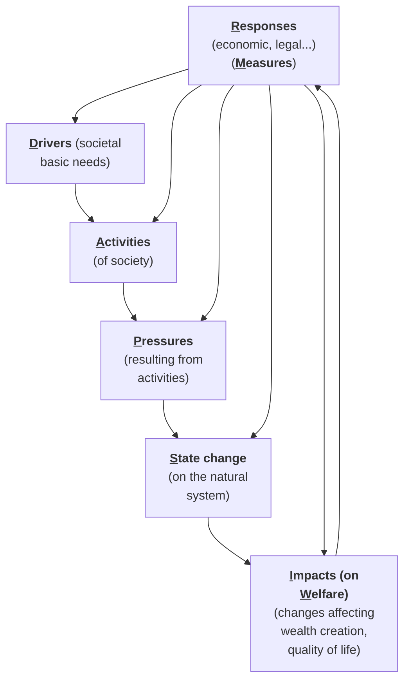
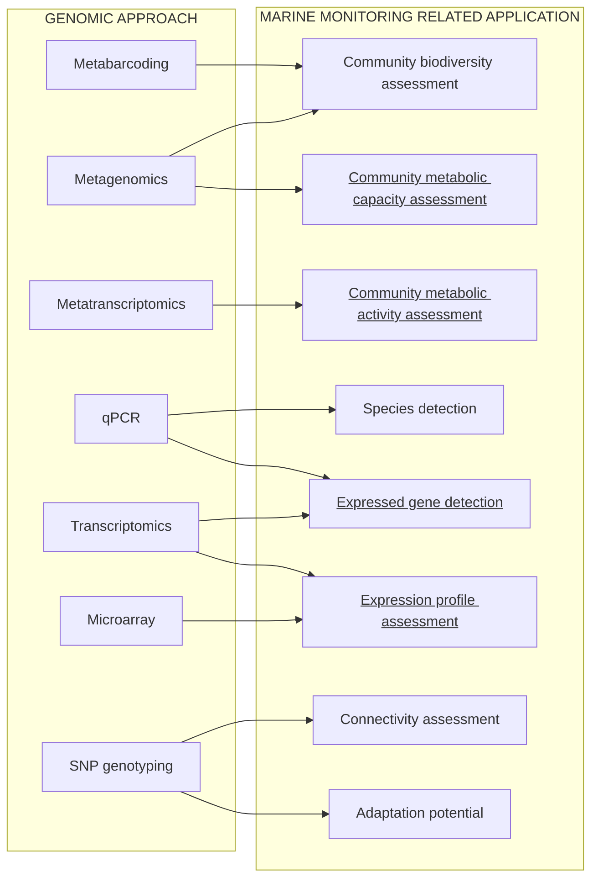
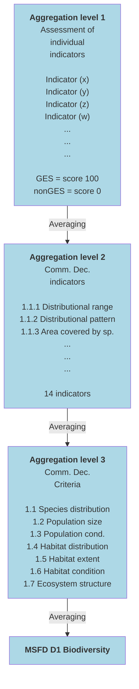
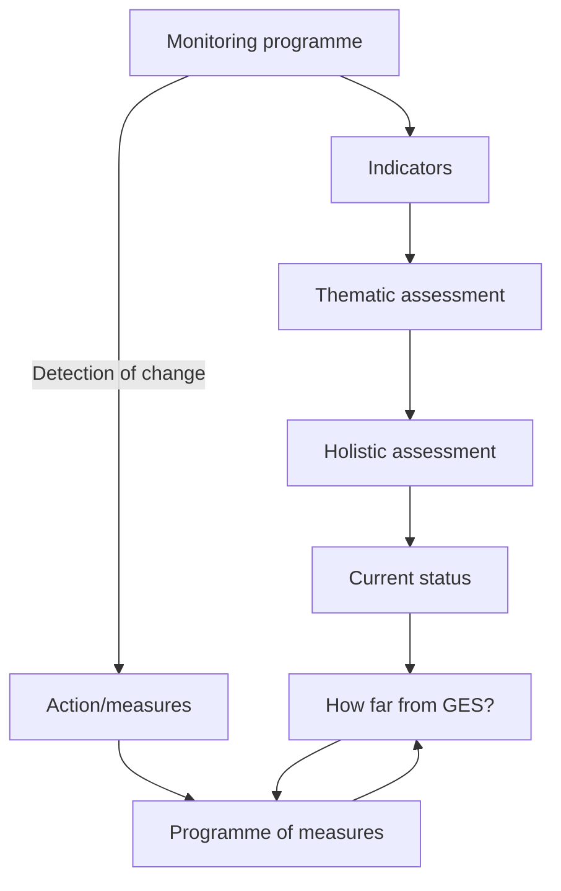

REVIEW
published: 01 March 2016
doi: 10.3389/fmars.2016.00020

# Overview of Integrative Assessment of Marine Systems: The Ecosystem Approach in Practice

**Angel Borja1\*, Michael Elliott2, Jesper H. Andersen3, Torsten Berg4, Jacob Carstensen5, Benjamin S. Halpern6, 7, 8, Anna-Stiina Heiskanen9, Samuli Korpinen9, Julia S. Stewart Lowndes7, Georg Martin10 and Naiara Rodriguez-Ezpeleta1**

1 Marine Research Division, AZTI-Tecnalia, Pasaia, Spain, 2 Institute of Estuarine and Coastal Studies, University of Hull, Hull, UK, 3 NIVA Denmark Water Research, Copenhagen, Denmark, 4 MariLim Aquatic Research GmbH, Schönkirchen, Germany, 5 Bioscience, Aarhus University, Roskilde, Denmark, 6 Bren School of Environmental Science and Management, University of California at Santa Barbara, Santa Barbara, CA, USA, 7 National Center for Ecological Analysis and Synthesis, University of California at Santa Barbara, Santa Barbara, CA, USA, 8 Department of Life Sciences, Imperial College London, Silwood Park, London, UK, 9 Marine Research Centre, Finnish Environment Institute (SYKE), Helsinki, Finland, 10 Estonian Marine Institute, University of Tartu, Tallinn, Estonia

**OPEN ACCESS**

**Edited by:**
Christos Dimitrios Arvanitidis, Hellenic Centre for Marine Research, Greece

**Reviewed by:**
Ana M. Queirós, Plymouth Marine Laboratory, UK
Antoine Jean Grémare, Université de Bordeaux, France
Tatiana Margo Tsagaraki, University of Bergen, Norway
Mathieu Cusson, Université du Québec à Chicoutimi, Canada

**\*Correspondence:**
Angel Borja
aborja@azti.es

**Specialty section:**
This article was submitted to Marine Ecosystem Ecology, a section of the journal Frontiers in Marine Science

**Received:** 11 November 2015
**Accepted:** 15 February 2016
**Published:** 01 March 2016

**Citation:**
Borja A, Elliott M, Andersen JH, Berg T, Carstensen J, Halpern BS, Heiskanen A-S, Korpinen S, Lowndes JSS, Martin G and Rodriguez-Ezpeleta N (2016) Overview of Integrative Assessment of Marine Systems: The Ecosystem Approach in Practice. Front. Mar. Sci. 3:20. doi: 10.3389/fmars.2016.00020

Traditional and emerging human activities are increasingly putting pressures on marine ecosystems and impacting their ability to sustain ecological and human communities. To evaluate the health status of marine ecosystems we need a science-based, integrated Ecosystem Approach, that incorporates knowledge of ecosystem function and services provided that can be used to track how management decisions change the health of marine ecosystems. Although many methods have been developed to assess the status of single components of the ecosystem, few exist for assessing multiple ecosystem components in a holistic way. To undertake such an integrative assessment, it is necessary to understand the response of marine systems to human pressures. Hence, innovative monitoring is needed to obtain data to determine the health of large marine areas, and in an holistic way. Here we review five existing methods that address both of these needs (monitoring and assessment): the Ecosystem Health Assessment Tool; a method for the Marine Strategy Framework Directive in the Bay of Biscay; the Ocean Health Index (OHI); the Marine Biodiversity Assessment Tool, and the Nested Environmental status Assessment Tool. We have highlighted their main characteristics and analyzing their commonalities and differences, in terms of: use of the Ecosystem Approach; inclusion of multiple components in the assessment; use of reference conditions; use of integrative assessments; use of a range of values to capture the status; weighting ecosystem components when integrating; determine the uncertainty; ensure spatial and temporal comparability; use of robust monitoring approaches, and address pressures and impacts. Ultimately, for any ecosystem assessment to be effective it needs to be: transparent and repeatable and, in order to inform marine management, the results should be easy to communicate to wide audiences, including scientists, managers, and policymakers.

**Keywords: assessment, integration, status, health, indicators, ecosystem approach, science-based communication**

Frontiers in Marine Science | www.frontiersin.org
1
March 2016 | Volume 3 | Article 20

Borja et al. Integrative Assessment of Marine Systems

# INTRODUCTION: WHY IS IT NECESSARY TO ASSESS THE STATUS OF MARINE ECOSYSTEMS?

Traditional and emerging human activities in coastal and coastal/open marine waters, including shipping, fishing, wastewater discharges, recreation, and renewable energy production, have increased greatly in recent years (OSPAR, 2009), in part due to increasing coastal populations worldwide (Halpern et al., 2015a) and the need for new resources to support that accelerated growth. Despite the benefits these activities deliver to humans, the resulting pressures, including noise, overfishing, habitat destruction, and pollution, alter marine ecosystems in a combination of synergistic and/or antagonistic ways (Crain et al., 2008; Ban et al., 2010; Piggott et al., 2015). In addition, the rapid increase in anthropogenic pressures has modified the types, frequency, extent, and duration of disturbances or impacts on aquatic species, communities, and ecosystems (Nõges et al., 2016).

Legislation at national or regional levels aims to control the potential adverse impacts of marine activities (Borja et al., 2008; Boyes and Elliott, 2014), thereby changing the paradigms of marine management from studying and managing individual pressures separately toward managing the cumulative and in-combination activities and their pressures in a holistic, ecosystem-based management approach (Agardy et al., 2011; **Box 1**). This represents one of the grand challenges in marine ecosystems ecology (Borja, 2014).

Healthy oceans provide multiple valuable ecosystem services, which in turn produce societal benefits through food provision, raw materials, energy and recreation (Costanza et al., 1997; Barbier et al., 2012; Turner et al., 2014; Turner and Schaafsma, 2015). Nevertheless, human activities can compromise the delivery of ecosystem services in the short or long term, prompting society (marine users, conservationists, policy makers, managers, and scientists) to respond. Thus ensuring that the benefits enjoyed by these stakeholders continues to rely on a scientific understanding of how various parts of the marine ecosystem are interlinked, affecting ecosystem services provision and hence human societies. Managing human activities impacting the marine environment will only be successful by undertaking a science-based integrated ecosystem approach (Agardy et al., 2011).

The Ecosystem Approach emanates from the original 12 principles defined in the Convention for Biological Diversity (CBD, 2000), which indicates that it is "a strategy for the integrated management of land," water and living resources that promotes conservation and sustainable use in an equitable way. The application of the Ecosystem Approach will help to reach a balance of the three objectives of the Convention: conservation, sustainable use and the fair and equitable sharing of the benefits arising out of the utilization of genetic resources" (CBD, 2000). In essence, this is taken to mean that the natural system structure and functioning are maintained and enhanced while at the same time the ecosystem will support human uses and deliver the ecosystem services and societal benefits required by society (Elliott, 2011). It has often been used to refer to a particular sector such as an "Ecosystem-based approach to fisheries" (Garcia et al., 2003) although the view here is that the true Ecosystem Approach cannot be sectoral but must cover all sectors. This true "Ecosystem Approach" to management requires several elements: (i) defining the source of the pressures emanating from activities; (ii) a risk assessment and risk management framework for each hazard; (iii) a vertical integration of governance structures from the local to the global; (iv) a framework of stakeholder involvement, and (v) the delivery of ecosystem services and societal benefits (Elliott, 2014). All of this may be regarded as a means of achieving both a healthy natural system and a healthy social system which is fit-for-purpose (Tett et al., 2013).

An important component of an integrated ecosystem approach to marine management is an adequate assessment of the actual environmental status, describing the health of marine ecosystems in an integrative way (Borja et al., 2013; Tett et al., 2013). Considering the spatial extent and complexity of marine ecosystems, a considerable amount of data is needed to assess the status of coastal and open seas systems with sufficient precision. For that reason cost-effective monitoring methods are needed, delivering harmonized data with an adequate spatial and temporal coverage (Borja and Elliott, 2013). To inform management planning adequately, it is especially important that assessment methods and management tools can incorporate new knowledge, new monitoring methods (to tackle the problem of covering large areas) and indicators into assessments, but still maintain comparability with previous assessments so that any change in the status can be measured and quantified.

In essence, the successful application of the Ecosystem Approach is centered around the concept of "health"—by achieving both the health of the natural, environmental system and the health of the human system (Tett et al., 2013). Health can be regarded as indicating the "fitness for survival of natural components" and maintenance of individual, population and societal well-being and so a healthy and sustainable ecosystem can also be described as one that is able to attain its full expected functioning (Costanza and Mageau, 1999). With regard to marine ecological functioning, marine monitoring should explicitly or implicitly encompass health at all levels of biological organization

> **BOX 1 | ECOSYSTEM APPROACH DEFINITION**
>
> The Ecosystem Approach [defined in CBD (2000)] is a management and resource planning procedure that integrates the management of human activities and their institutions with the knowledge of the functioning of ecosystems. In the management of marine ecosystems and resources, it requires to "identify and take action on influences that are critical to the health of marine ecosystems, thereby achieving sustainable use of ecosystem goods and services and maintenance of ecosystem integrity" (cf., Farmer et al., 2012, for a review of the concept of ecosystem approach in marine management). The Ecosystem Approach can be defined as the ability to fulfil the major aim of protecting and maintaining the natural structure and functioning while at the same time ensuring the creation of ecosystem services from which societal benefits can be obtained (Elliott, 2011).

Frontiers in Marine Science | www.frontiersin.org 2 March 2016 | Volume 3 | Article 20

Borja et al.
Integrative Assessment of Marine Systems

(Elliott, 2011), from the health of the cell, to the tissue level, individuals of a population, populations, and communities, which is currently the most used form of ecological monitoring (Gray and Elliott, 2009; Borja et al., 2013).

In addition, as emphasized throughout all major pieces of marine governance, there is a duty to assess and ensure the health of the whole ecosystem—as ensuring protection against adverse symptoms of ecosystem pathology (Elliott, 2011; Tett et al., 2013). This allows the detection of anomalous or malfunctioning attributes as well as the ability of the ecosystem to withstand change (its resistance) and/or its ability to recover after being subjected to a marine stressor (its resilience; Borja et al., 2010b; Duarte et al., 2015).

Hence, if the marine system can produce the provisioning, regulating, cultural and supporting ecosystem services then such well-being will be guaranteed. The role of marine management then requires an ecosystem health assessment (or monitoring) programme which analyses the main processes and structural characteristics of the coupled socio-ecological ecosystem and identifies the known or potential stressors. This then requires the development of hypotheses about how those stressors may affect the ecosystem and identifies measures of environmental quality and ecosystem health to test hypotheses. Because of this we need indicators to describe the condition of ecosystem components, the extent of pressures exerted on these components and the responses to either the condition or changes to it.

Given these challenges of applying the science-based ecosystem approach which by definition integrates the natural and societal features of the system, the objective of this position paper is to review and summarize the current knowledge on the assessment of marine health status, focussing on the Ecosystem Approach. Although very many methods have been developed to assess the status of single components of the ecosystem (see a review in Birk et al., 2012), there are very few assessing multiple components to give a holistic view of the ecosystem (e.g., Borja et al., 2014).

## MEASURING THE RESPONSE OF MARINE SYSTEMS TO HUMAN PRESSURES

Understanding the response of marine systems to human activities and resultant pressures requires a good conceptual basis that links the causes and consequences of change. This has been encapsulated in the DAPSI(W)R(M) approach (**Figure 1**, defined below), an improved version of the much used DPSIR approach (Wolanski and Elliott, 2015; Burdon et al., in press). This framework takes into account the different spatio-temporal scales at which **D**rivers, **A**ctivities, **P**ressures on the system, **S**tate changes, **I**mpacts (on human **W**elfare), and management **R**esponses (as **M**easures) operate. The **D**rivers relate to basic human needs including physiological desires, the requirement for safety and protection, employment, cultural satisfaction, or demand for goods and energy. The **I**mpacts on human **W**elfare encompasses the loss of ecosystem services and employment and the psychological effects of risks and hazards. The complexity of the estuarine and coastal environment results in multiple interactions between various DAPSI(W)R(M) elements, especially in multi-use/multi-user cases. Furthermore, the nested-DAPSI(W)R(M) framework specifically recognizes the impact of *Exogenic Unmanaged Pressures* (ExUP)—such as climate change—and *Endogenic Managed Pressures* (EnMP) on

**FIGURE 1 | Drivers, Activities, Pressures, State changes, Impacts on human Welfare, and management Responses as Measures [DAPSI(W)R(M)] scoping framework** (Wolanski and Elliott, 2015). This management framework quantifies and assesses the Pressures, State changes, and Impacts on human Welfare but manages (using Responses as Measures) the Drivers and Activities.

Frontiers in Marine Science | www.frontiersin.org
3
March 2016 | Volume 3 | Article 20

Borja et al. Integrative Assessment of Marine Systems

the system—such as new port developments or fisheries (Elliott, 2011). This management framework quantifies and assesses the Pressures, State changes and Impacts on human Welfare but it manages (using Responses as Measures) the Drivers and Activities.

Determining the adverse effects of human activities and their resultant pressures on ecosystems is essentially a risk assessment and risk management framework (Cormier et al., 2013) that has been included in the framework of Environmental Impact Assessments (EIA) for many decades. Scientific studies of effects of single pressures on the marine environment are already well-embedded in assessments but Halpern et al. (2008) was the first to assess cumulative human activities and their potential impact at high spatial resolution. This triggered a series of national and regional studies on the effect of multiple stressors on ecosystem components (Crain et al., 2008; Ban et al., 2010; Coll et al., 2012; Korpinen et al., 2012; Micheli et al., 2013; Marcotte et al., 2015; Piggott et al., 2015; Nõges et al., 2016), with each one also aiming to improve the method and bridge caveats of the method (Halpern and Fujita, 2013).

The "cumulative impact method" itself (Halpern et al., 2008, 2015a) is a straightforward additive model linking pressures and ecosystem components over a grid of assessment cells and using expert-based weights to estimate the impacts of each pressure on specific ecosystem components (i.e., species, habitats, ecosystems). The formula is:

$$ I = \sum_{i=1}^{n} \sum_{j=1}^{m} P_i \times E_j \times \mu_{i,j} \text{ (1)} $$

where $P_i$ is the log-transformed and normalized value of an anthropogenic pressure in an assessment unit $i$, $E_j$ is the presence or absence of an ecosystem component $j$ (i.e., populations, species, habitats, or broad-scale habitats), and $\mu_{i,j}$ is the weight score for $P_i$ in $E_j$. As the source data are high-resolution spatial layers for pressures and habitats, the scientific interest has often focused on the production of the weighing scores. As weighting scores are determined for stressor-habitat combinations, for global analyses they can miss nuanced interactions that better maps can provide, which has been done in smaller-scale assessments.

At smaller scales, weighing scores can be developed using local knowledge of system interactions, which, combined with local spatial data, has been shown to have a more significant role in the assessment results than the weighted scores in the Baltic (Korpinen et al., 2012) and the Mediterranean and Black Sea (Micheli et al., 2013). In the North Sea, Andersen et al. (2013) introduced the probability of species occurrence to the index, which is particularly suitable for highly mobile species such as seabirds, marine mammals, and big fish. With regards to pressure data, fuzzy logic was used in the U.K. sea area (Stelzenmüller et al., 2010) and in Hong Kong (Marcotte et al., 2015) to estimate the occurrence of pressures and spatial extent of adverse effects in the grid cells. In the Dutch sea area, the effects on species populations have been linked to the population demography, which allowed ecologically more realistic impact assessments (de Vries et al., 2011). When applying the index to smaller geographic scales, the need to account for the environmental variability increases. In the Finnish Archipelago Sea, a pilot study evaluated the effects of water depth and wave exposure (i.e., benthic energy) on the cumulative impacts in the index method (Sahla, 2015). The role of the two factors had significant effects on the index results in the small-scale study area.

Cumulative impacts have become a widely used element of marine assessments. For example, in Europe, the Marine Strategy Framework Directive (MSFD) particularly requires "the main cumulative and synergetic effects" to be included in Member States' assessments of Good Environmental Status (GES; European Commission, 2008). This GES should be achieved within all European seas by 2020, i.e., an area is deemed by the use of operational indicators to be one side or the other of the boundary between meeting or not-meeting GES (European Commission, 2008), using a set of 11 descriptors (biodiversity, alien species, fisheries, foodwebs, eutrophication, seafloor integrity, hydrography, pollutants in seafood and environment, litter, and noise), which encapsulate the whole ecosystem function. The European Commission (2010) proposed a set of 56 indicators to assess environmental status.

# NEED OF INNOVATIVE AND COST-EFFECTIVE MONITORING

In determining the effects of pressures over large geographical scales, and taking into account the holistic view of the new integrative assessment methods, there is a clear need for developing new monitoring approaches and especially those which encompass and combine all the relevant features of ecosystems; despite this, deciding on what, where, how, when, and how often monitor is not always as obvious (Borja and Elliott, 2013). Similarly, the role of monitoring in marine management and the pros and cons of the possible monitoring framework have to be determined, including the ability of the monitoring to detect a signal of change against a background of inherent variability (the "noise" in the system; Nevin, 1969). Elliott (2011) considered 10 types of monitoring, focusing on (i) the ability to determine the overall status of an area and over a time period—this includes surveillance monitoring and condition monitoring, i.e., to monitor the features of an area and its status and then *a posteriori* to detect a trend; (ii) the ability to determine whether an area or a time period meets a pre-determined and pre-agreed status such as a baseline, threshold, or trigger value, which may be defined in law or in licence conditions and hence *a priori* has the status defined—this includes compliance monitoring and operational monitoring, and (iii) once a difference has been detected between what is expected and what is found, i.e., change has occurred, then that sequence or trajectory of change, and its causes and consequences have to be determined—this requires investigative or diagnostic monitoring and possibly feedback monitoring and toxicity analyses in which the assessment has a direct and real-time link to management.

Taking this into account, here we summarize and focus on four main promising approaches, which can assist monitoring, with importance in marine systems: genomic tools, remote

Frontiers in Marine Science | www.frontiersin.org 4 March 2016 | Volume 3 | Article 20

Borja et al.
Integrative Assessment of Marine Systems

sensing, acoustic devices, and modeling, which can be combined in a novel way to cover the needs of monitoring large geographical areas.

Genomic tools are seen as a promising and emerging avenue to improve ecosystem monitoring, as these approaches have the potential to provide new, more accurate, and cost-effective measures. Several techniques have been identified as potential substitutes of traditional approaches for various applications (Bourlat et al., 2013), and some can even provide measurements that were not possible before the genomic era (**Figure 2**).

Meta-omic (metabarcoding, metagenomics, and metatranscriptomics) techniques are particularly appealing as they allow the analysis of environmental samples without the need to isolate organisms. Probably, the most promising, developed, and straight-forward genomic tool for environmental monitoring is metabarcoding (Cristescu, 2014; Chariton et al., 2015). This technique consists of taxonomically identifying the organisms present in a given sample based on a small DNA fragment (called a "barcode") that is unique to each species. Potential applications of metabarcoding in marine monitoring include calculating biotic indices based on taxonomic composition, detection of invasive species or understanding trophic interactions by analysing fecal samples or stomach contents (Aylagas et al., 2014; Chariton et al., 2015; Dafforn et al., 2015). However, the routine application of this technique still requires that standardized practices at each step of the procedure are developed. For example, sampling strategies, nature of the barcode selected, conditions of barcode amplification or available reference barcode library may affect the taxonomic composition inferred from genomic data (Aylagas et al., 2014). Several campaigns of sampling standardization have already been initiated, such as the Ocean Sampling Day (Kopf et al., 2015) for marine microbe sampling, and the use of Autonomous Reef Monitoring Structures (ARMS; http://www.pifsc.noaa.gov/cred/survey_methods/arms/overview.php) for sampling both prokaryotic and eukaryotic organisms. There is therefore an urgent need to compare both traditional and molecular based taxonomic composition inferences so that metabarcoding can be introduced as a regular tool in monitoring programs.

Satellite remote sensing is another promising monitoring approach. Although this has long been used to monitor chlorophyll *a* (Coppini et al., 2012), it has only recently been applied to determine phytoplankton size structure (Barnes et al., 2011; Brewin et al., 2011), composition and functionality (Moisan et al., 2013; Palacz et al., 2013; Rousseaux et al., 2013) and monitoring of harmful algal blooms (Frolov et al., 2013). However, there are still few studies which assess the ecological status of coastal and open marine waters based on the phytoplankton component (Gohin et al., 2008; Novoa et al., 2012), thus requiring the development in support of assessments in large marine areas.

Acoustic devices are a monitoring approach built on the traditional use of benthic habitat mapping (see Brown et al., 2011), that can be used to determine the composition and abundance of different biodiversity components, especially fish and cetaceans (André et al., 2011; Denes et al., 2014; Fujioka et al., 2014; Parks et al., 2014). Again, there are few studies regarding the use of underwater acoustics to assess the status of diverse ecosystem components and indicators (Trenkel et al., 2011). Furthermore, certain types of modeling provide a valuable accompanying approach to monitoring, for example to increase spatial coverage of environmental variables and predict spatial distribution patterns of different ecosystem components, i.e., through species distribution modeling (Reiss et al., 2015). Deterministic models can be used to predict physico-chemical characteristics such as water quality parameters or fish stock size,

**FIGURE 2 | Genomic approaches (left) and their potential marine potential application (right).** Metabarcoding, metagenomics, and metatranscriptomics consist respectively on sequencing a region of the genome, the genome or the transcriptome of a whole community; qPCR (quantitative PCR) and microarrays consist on measuring the quantity of DNA or RNA in a given sample at low and high throughput respectively; SNP genotyping consists on determining the genotype of selected Single Nucleotide Polymorphisms of individuals from the same species in order to estimate differences in allele frequencies among populations. Applications that cannot be performed using traditional techniques are underlined.

Frontiers in Marine Science | www.frontiersin.org
5
March 2016 | Volume 3 | Article 20

Borja et al.                                                                                                                                                    Integrative Assessment of Marine Systems

whereas empirical models are valuable to link species presence to habitat characteristics and thus extrapolate from a monitored area to the wider spatial coverage (Groeneveld et al., in press; Peck et al., in press). Ecological modeling is being used to describe or understand ecosystem processes, and is currently a valuable approach used to predict and understand the consequences of anthropogenic and climate-driven changes in the natural environment (Piroddi et al., 2015). Piroddi et al. (2015) have reviewed the most commonly used capabilities of the modeling community to provide information about indicators used to assess the status in marine waters, particularly on biodiversity, food webs, non-indigenous species and seafloor integrity. Ecosystem modeling has the potential to show the complex, integrative ecosystem dimensions while addressing ecosystem fundamental properties, such as interactions between structural components and ecosystem services provided (Groeneveld et al., in press). As such, some modeling tools (i.e., species distribution modeling) can be used in support of monitoring to predict the distribution of species in areas not monitored or to derive indicators in support of the assessment process.

Traditional monitoring tools (i.e., direct sampling, visual identification, etc.) and these new monitoring approaches are producing information to generate the indicators needed to assess the status of marine systems, as presented below.

## EXAMPLES OF HEALTH AND STATUS ASSESSMENT IN MARINE SYSTEMS

The following sub-sections give examples (in chronological order of publication) of integrative assessment methods. All can be applied to large marine areas in open and coastal waters. Most of the methods are motivated by international legislation or conventions and use various indicators to derive the status of marine systems, as presented below.

### Ecosystem Health Assessment Tool

With the adoption of the HELCOM (Baltic Marine Environment Protection Commission - Helsinki Commission) Baltic Sea Action Plan, the Contracting Parties to the Helsinki Convention launched an ambitious Action Plan to restore ecosystem health of the Baltic Sea (HELCOM, 2007). As the Action Plan is based on the Ecosystem Approach, tracking, and documenting progress in meeting the vision and objectives was required. Hence, a plan for establishing a region-wide baseline was developed and implemented through the production and publications of an indicator-based assessment of ecosystem health in the Baltic Sea region (HELCOM, 2010a).

The ecosystem health is based on a Baltic-wide application of a multi-metric indicator-based assessment tool, the HELCOM Ecosystem Health Assessment Tool (HELCOM EHI; HELCOM, 2010a). This is based on existing HELCOM tools for assessing "eutrophication status" (HEAT; HELCOM, 2009a and Andersen et al., 2010, 2011), "biodiversity status" (BEAT; HELCOM, 2009b and Andersen et al., 2014) and "chemical status" (CHASE; HELCOM, 2010b; Andersen et al., 2018). Currently, the HOLAS tool is under revision to ensure applicability for the MSFD assessments in the future. This will include revision of the aggregation rules for the indicators that have been developed and agreed in the HELCOM CORESET project (HELCOM, 2013) where the jointly agreed set of indicators is to be finalized currently. Three dilemmas were faced. First, using few groups of indicators (one or two) and averaging across many indicators may potentially lead to "thinning" and potentially to "upward"

<table>
<thead>
<tr>
<th>Characteristics of the methods</th>
<th>HOLAS</th>
<th>No name</th>
<th>OHI</th>
<th>MARMONI</th>
<th>NEAT</th>
</tr>
</thead>
<tbody>
<tr>
<td>References</td>
<td>HELCOM, 2010a</td>
<td>Borja et al., 2011</td>
<td>Halpern et al., 2012, 2015a</td>
<td>www.sea.ee/marmoni</td>
<td>www.devotes-project.eu</td>
</tr>
<tr>
<td>Application area</td>
<td>Baltic Sea</td>
<td>Bay of Biscay</td>
<td>Global and 11 smaller scales</td>
<td>Baltic Sea</td>
<td>European Seas</td>
</tr>
<tr>
<td>Associated legislation</td>
<td>HELCOM</td>
<td>MSFD</td>
<td>None at global scale, various national and international at smaller scales</td>
<td>HELCOM and MSFD</td>
<td>MSFD</td>
</tr>
<tr>
<td>Required input info</td>
<td>HELCOM indicators</td>
<td>MSFD indicators and descriptors</td>
<td>Indicators and goals</td>
<td>HELCOM or MSFD indicators</td>
<td>MSFD indicators</td>
</tr>
<tr>
<td>Weighting</td>
<td>Yes</td>
<td>Yes</td>
<td>Yes</td>
<td>Yes</td>
<td>Yes</td>
</tr>
<tr>
<td>Aggregation</td>
<td>OOAO</td>
<td>Mean</td>
<td>Mean</td>
<td>Mean</td>
<td>Mean, but others possible</td>
</tr>
<tr>
<td>Reference conditions</td>
<td>Yesa</td>
<td>Yes</td>
<td>Yes</td>
<td>Yes</td>
<td>Yes</td>
</tr>
<tr>
<td>Scale of result</td>
<td>0–1 and 0–∞</td>
<td>0–1</td>
<td>0–100</td>
<td>0–100</td>
<td>0–1</td>
</tr>
<tr>
<td>Status classification levels</td>
<td>5</td>
<td>2</td>
<td>2</td>
<td>2</td>
<td>2 to 5</td>
</tr>
<tr>
<td>Uncertainty</td>
<td>Yes</td>
<td>Yes</td>
<td>In developments</td>
<td>Yes, qualitative</td>
<td>Yes, quantitative</td>
</tr>
</tbody>
</table>

For the complete names of the methods, see text. MSFD, Marine Strategy Framework Directive; HELCOM, Helsinki Convention; OOAO, One out, all out.
aFor contaminants, target values are used instead of background values/reference conditions.

Frontiers in Marine Science | www.frontiersin.org6                                                                                                                                                    March 2016 | Volume 3 | Article 20

Borja et al.
Integrative Assessment of Marine Systems

misclassification (i.e., arriving at a better status classification compared to the use of more groups; lessons learned from the development of the CHASE prototype tool). Second, many groups of indicators and stringent use of the "one out, all out" principle, in which overall status of a region defaults to the status of the worst biological component (Hering et al., 2010), may potentially lead to "downward" misclassifications (i.e., arriving at a poor status classification compared to the use of fewer groups; lessons learned from HEAT and Borja and Rodríguez, 2010). The one-out-all-out principle has been adopted in the European Water Framework Directive (WFD; European Commission, 2000). Third, in some cases, good indicators and target values do not yet exist.

The HOLAS tool has four steps (**Figure 3**). In step 1, indicators are nested in three categories (CI: biology; CII: chemistry; CIII: supporting). In step 2, either an Ecological Quality Ratio (EQR) or a Chemical Score (CSchem) is calculated. For categories I and III, a weighted average Ecological Quality Ratio (EQRbio and EQRsupp; see Equation 2) is calculated (ranging from 0, bad status, to 1, high status, *sensu* the WFD, European Commission, 2000) and for category II, a Chemical Score (CSchem; see Equations 3 and 4) is calculated as the ratio of the status against a threshold value. In step 3, categories I, II, and III are classified in five classes (High, 0.0–0.5; Good, 0.5–1.0; Moderate, 1.0–5.0; Poor, 5.0–10.0; and Bad > 10.0). Finally, in step 4, category classifications are combined (using the lowest ranking classification cf. the "one out, all out" principle (see Borja and Rodríguez, 2010), into a final classification of "ecosystem health" (in 5 classes).

The applied assessment principles differ for category I and II indicators. For category II indicators, as well as category III, the assessment principles on the indicator level is straight-forward, the only difference relate to whether the response is numerically positive or negative to an increase in pressure:

$$ \begin{aligned} \text{EQR} &= \text{RefCon/Obs} \quad \text{(positive response)} \\ &= \text{Obs/RefCon} \quad \text{(negative response)} \end{aligned} \quad (2) $$

where RefCon is the reference condition and Obs is the observed value. Detailed descriptions of the above principles as well as integration principles within groups of indicators can be found in HELCOM (2010a) and Andersen et al. (2010, 2011, 2014).

For category II indicators each indicator is simply assessed against a threshold level by calculating the ratio and the results of the indicators are then combined to obtain the status for each element. For each of the indicators ($n$) in an assessment unit (i.e., a spatial quadratic unit), the Contamination Ratio ($CR$) of the measured concentration ($C_m$) to a relevant assessment criterion for GES ($C_{Threshold}$) is calculated using:

$$ CR = \frac{C_m}{C_{Threshold}} \quad (3) $$

Integration of the CRs of the indicators is calculated as a Contamination Score (CS; Equation 4):

$$ CS = \frac{1}{\sqrt{n}} \sum_{i=1}^{n} CR_i \quad (4) $$

**FIGURE 3 | Conceptual model of the HELCOM HOLAS tool.** Indicators used for thematic assessment are integrated by weighted averaging in three categories (steps 1 and 2), and the score-based classifications (step 3) are further integrated by the "One Out-All Out" principle (step 4). The fish represent the five status classes: high (blue), good (green), moderate (yellow), poor (orange), and bad (red) (see text and Andersen et al., 2014 for further details). EQR, Ecological Quality Ratio.

Frontiers in Marine Science | www.frontiersin.org
7
March 2016 | Volume 3 | Article 20

Borja et al.
Integrative Assessment of Marine Systems

A detailed description of these assessment principles and calculations as well as their practical use can be found in Andersen et al. (2016). As such, the HOLAS tools has been tested and applied in the Baltic Sea (HELCOM, 2010a) for the classification of ecosystem health status in selected open and coastal waters (**Figure 4**).

## A Method for the Marine Strategy Framework Directive, Within the Bay of Biscay

The first attempt for assessing status according to the MSFD, using the 56 indicators proposed by the European Commission (2010), was undertaken in the southern Bay of Biscay (Borja et al., 2011). The approach was based on combining indicators, by grouping the marine ecosystem components into four distinct and interlinked systems: (i) water and sediment physico-chemical quality (including general conditions and contaminants); (ii) planktonic (phyto- and zoo-plankton); (iii) mobile species (fishes, sea mammals, seabirds, etc.), and (iv) benthic species and habitats. These ecosystem components, affected by different human pressures, are linked to the 11 MSFD descriptors and, as such, indicating the quality of the different indicators (see Borja et al., 2010a, 2011).

Borja et al. (2011) assessed each indicator and descriptor by deriving an EQR (as in the WFD and the HOLAS method, see Section Ecosystem Health Assessment Tool) in which monitoring data are compared with reference conditions of each indicator, a fundamental step in any quality status assessment (Borja et al., 2012).

After calculating a status value for each of the indicators, the method integrates the values at the level of single descriptors and then combines all 11 descriptors into a final assessment (**Table 2**). Weighting each descriptor has been proposed, and could depend on its relationships with dominant pressures in the study area. Weighting would thus emphasize certain descriptors, e.g., fishing in **Table 2** (see also recommendations by Borja et al., 2010a).

An environmental status value was derived by multiplying the weight by the EQR of each descriptor and dividing by 100, and an overall environmental status value was obtained by adding all the values for each descriptor. The indicators and descriptors that have values below GES (see Section Measuring the Response of Marine Systems to Human Pressures) require management action and can be easily identified (**Table 2**). Criteria for achieving GES can be found in Rice et al. (2012), Borja et al. (2013), and ICES (2013). The method also assesses the reliability of the result in a qualitative way, taking into account data availability and confidence in the methods used in assessing the status, and following the same approach as for the assessment.

## Ocean Health Index

The Ocean Health Index (OHI; Halpern et al., 2012) was a logical progression following the development of the cumulative impacts framework (Halpern et al., 2008), as the OHI includes not only the negative impacts exerted on the oceans but also captures the tangible and less-tangible benefits derived from the oceans. The OHI framework scores a suite of benefits ("goals") that are delivered to people by assessing the current status and likely future state (including pressures and resilience measures) of each goal for each region that together comprise the whole assessment area (**Figure 5**). A single OHI Index score is calculated by

**FIGURE 4 | Classification of "ecosystem health status" in the Baltic Sea.** In panel **(A)**, classifications are spatially interpolated in order to illustrate that the impairment is a large scale problem. Panel **(B)** shown classification per sub-region [expressed as good (green), poor (yellow), poor (orange), or bad (red)], while panel **(C)** shows the confidence assessment of the classifications per sub-region [expressed as a high confidence (blue), a moderate but acceptable confidence (green), and a low confidence (red)]. See HELCOM (2010a) for details.

### Panel B: Ecosystem Health Status
<table>
  <thead>
    <tr>
        <th>Sub-region (n)</th>
        <th>good</th>
        <th>moderate</th>
        <th>poor</th>
        <th>bad</th>
    </tr>
  </thead>
  <tbody>
    <tr>
        <td>Bothnian Bay (6)</td>
        <td>17</td>
        <td>33</td>
        <td>50</td>
        <td>0</td>
    </tr>
    <tr>
        <td>Bothnian Sea (7)</td>
        <td>14</td>
        <td>43</td>
        <td>43</td>
        <td>0</td>
    </tr>
    <tr>
        <td>Åland and Archipelago Sea (3)</td>
        <td>0</td>
        <td>33</td>
        <td>67</td>
        <td>0</td>
    </tr>
    <tr>
        <td>Northern Baltic proper (3)</td>
        <td>0</td>
        <td>0</td>
        <td>100</td>
        <td>0</td>
    </tr>
    <tr>
        <td>Gulf of Finland (9)</td>
        <td>0</td>
        <td>11</td>
        <td>44</td>
        <td>45</td>
    </tr>
    <tr>
        <td>Western Gotland Basin (5)</td>
        <td>0</td>
        <td>0</td>
        <td>40</td>
        <td>60</td>
    </tr>
    <tr>
        <td>Eastern Baltic proper (6)</td>
        <td>0</td>
        <td>0</td>
        <td>50</td>
        <td>50</td>
    </tr>
    <tr>
        <td>Gulf of Riga (4)</td>
        <td>0</td>
        <td>25</td>
        <td>75</td>
        <td>0</td>
    </tr>
    <tr>
        <td>Gulf of Gdansk (3)</td>
        <td>0</td>
        <td>0</td>
        <td>33</td>
        <td>67</td>
    </tr>
    <tr>
        <td>Bornholm Basin (5)</td>
        <td>0</td>
        <td>0</td>
        <td>40</td>
        <td>60</td>
    </tr>
    <tr>
        <td>Arkona Basin (6)</td>
        <td>0</td>
        <td>0</td>
        <td>17</td>
        <td>83</td>
    </tr>
    <tr>
        <td>Kiel and Mecklenburg Bight (5)</td>
        <td>0</td>
        <td>0</td>
        <td>20</td>
        <td>80</td>
    </tr>
    <tr>
        <td>Belt Sea (8)</td>
        <td>0</td>
        <td>0</td>
        <td>25</td>
        <td>75</td>
    </tr>
    <tr>
        <td>Kattegat (14)</td>
        <td>0</td>
        <td>7</td>
        <td>50</td>
        <td>43</td>
    </tr>
  </tbody>
</table>

### Panel C: Confidence Assessment
<table>
  <thead>
    <tr>
        <th>Sub-region (n)</th>
        <th>high</th>
        <th>acceptable</th>
        <th>low</th>
    </tr>
  </thead>
  <tbody>
    <tr>
        <td>Bothnian Bay (6)</td>
        <td>0</td>
        <td>100</td>
        <td>0</td>
    </tr>
    <tr>
        <td>Bothnian Sea (7)</td>
        <td>0</td>
        <td>100</td>
        <td>0</td>
    </tr>
    <tr>
        <td>Åland and Archipelago Sea (3)</td>
        <td>0</td>
        <td>67</td>
        <td>33</td>
    </tr>
    <tr>
        <td>Northern Baltic proper (3)</td>
        <td>0</td>
        <td>100</td>
        <td>0</td>
    </tr>
    <tr>
        <td>Gulf of Finland (9)</td>
        <td>0</td>
        <td>100</td>
        <td>0</td>
    </tr>
    <tr>
        <td>Western Gotland Basin (5)</td>
        <td>40</td>
        <td>60</td>
        <td>0</td>
    </tr>
    <tr>
        <td>Eastern Baltic proper (6)</td>
        <td>50</td>
        <td>50</td>
        <td>0</td>
    </tr>
    <tr>
        <td>Gulf of Riga (4)</td>
        <td>0</td>
        <td>100</td>
        <td>0</td>
    </tr>
    <tr>
        <td>Gulf of Gdansk (3)</td>
        <td>0</td>
        <td>100</td>
        <td>0</td>
    </tr>
    <tr>
        <td>Bornholm Basin (5)</td>
        <td>0</td>
        <td>100</td>
        <td>0</td>
    </tr>
    <tr>
        <td>Arkona Basin (6)</td>
        <td>0</td>
        <td>100</td>
        <td>0</td>
    </tr>
    <tr>
        <td>Kiel and Mecklenburg Bight (5)</td>
        <td>0</td>
        <td>100</td>
        <td>0</td>
    </tr>
    <tr>
        <td>Belt Sea (8)</td>
        <td>0</td>
        <td>100</td>
        <td>0</td>
    </tr>
    <tr>
        <td>Kattegat (14)</td>
        <td>0</td>
        <td>100</td>
        <td>0</td>
    </tr>
  </tbody>
</table>

Frontiers in Marine Science | www.frontiersin.org
8
March 2016 | Volume 3 | Article 20

Borja et al.
Integrative Assessment of Marine Systems

**TABLE 2 | Example of an assessment of the environmental status, within the Marine Strategy Framework Directive, in the Bay of Biscay (modified from Borja et al., 2011).**

<table>
  <thead>
    <tr>
        <th>MSFD Descriptor</th>
        <th>Indicators used</th>
        <th>Reference conditions</th>
        <th>Reliability (%)</th>
        <th>Weight (%)</th>
        <th>EQR</th>
        <th>Final environmental status</th>
        <th>Final confidence ratio</th>
    </tr>
    <tr>
        <th>&lt;mark style="background-color: lightblue"&gt;1. Biological diversity</mark></th>
        <th>&lt;mark style="background-color: lightblue"&gt;Integrated biological value</mark></th>
        <th>    </th>
        <th>&lt;mark style="background-color: lightblue"&gt;69</mark></th>
        <th>&lt;mark style="background-color: lightblue"&gt;15</mark></th>
        <th>&lt;mark style="background-color: green"&gt;0.51</mark></th>
        <th>&lt;mark style="background-color: lightblue"&gt;0.08</mark></th>
        <th>&lt;mark style="background-color: lightblue"&gt;10.35</mark></th>
    </tr>
    <tr>
        <th>&lt;mark style="background-color: lightblue"&gt;2. Non-indigenous species</mark></th>
        <th>&lt;mark style="background-color: lightblue"&gt;Ratio non-indigenous sp.</mark></th>
        <th>&lt;mark style="background-color: lightblue"&gt;OSPAR</mark></th>
        <th>&lt;mark style="background-color: lightblue"&gt;80</mark></th>
        <th>&lt;mark style="background-color: lightblue"&gt;10</mark></th>
        <th>&lt;mark style="background-color: green"&gt;0.98</mark></th>
        <th>&lt;mark style="background-color: lightblue"&gt;0.10</mark></th>
        <th>&lt;mark style="background-color: lightblue"&gt;8</mark></th>
    </tr>
    <tr>
        <th>&lt;mark style="background-color: lightblue"&gt;3. Exploited fish and shellfish</mark></th>
        <th>    </th>
        <th>    </th>
        <th>&lt;mark style="background-color: lightblue"&gt;100</mark></th>
        <th>&lt;mark style="background-color: lightblue"&gt;15</mark></th>
        <th>&lt;mark style="background-color: red"&gt;0.48</mark></th>
        <th>&lt;mark style="background-color: lightblue"&gt;0.07</mark></th>
        <th>&lt;mark style="background-color: lightblue"&gt;15</mark></th>
    </tr>
  </thead>
  <tbody>
    <tr>
        <td>    </td>
        <td>&lt;mark style="background-color: yellow"&gt;Fishing mortality &lt; reference</mark></td>
        <td>    </td>
        <td>&lt;mark style="background-color: yellow"&gt;100</mark></td>
        <td>    </td>
        <td>&lt;mark style="background-color: red"&gt;0.18</mark></td>
        <td>    </td>
        <td>    </td>
    </tr>
    <tr>
        <td>    </td>
        <td>&lt;mark style="background-color: yellow"&gt;Spawning stock &lt; reference</mark></td>
        <td>    </td>
        <td>&lt;mark style="background-color: yellow"&gt;100</mark></td>
        <td>    </td>
        <td>&lt;mark style="background-color: green"&gt;0.67</mark></td>
        <td>    </td>
        <td>    </td>
    </tr>
    <tr>
        <td>    </td>
        <td>&lt;mark style="background-color: yellow"&gt;% large fish</mark></td>
        <td>    </td>
        <td>&lt;mark style="background-color: yellow"&gt;100</mark></td>
        <td>    </td>
        <td>&lt;mark style="background-color: red"&gt;0.59</mark></td>
        <td>    </td>
        <td>    </td>
    </tr>
    <tr>
        <th>&lt;mark style="background-color: lightblue"&gt;4. Marine food webs</mark></th>
        <th>    </th>
        <th>    </th>
        <th>&lt;mark style="background-color: lightblue"&gt;70</mark></th>
        <th>&lt;mark style="background-color: lightblue"&gt;10</mark></th>
        <th>&lt;mark style="background-color: red"&gt;0.40</mark></th>
        <th>&lt;mark style="background-color: lightblue"&gt;0.04</mark></th>
        <th>&lt;mark style="background-color: lightblue"&gt;7</mark></th>
    </tr>
    <tr>
        <th>&lt;mark style="background-color: lightblue"&gt;5. Human-induced eutrophication</mark></th>
        <th>    </th>
        <th>&lt;mark style="background-color: lightblue"&gt;WFD</mark></th>
        <th>&lt;mark style="background-color: lightblue"&gt;94</mark></th>
        <th>&lt;mark style="background-color: lightblue"&gt;10</mark></th>
        <th>&lt;mark style="background-color: green"&gt;0.96</mark></th>
        <th>&lt;mark style="background-color: lightblue"&gt;0.10</mark></th>
        <th>&lt;mark style="background-color: lightblue"&gt;9.4</mark></th>
    </tr>
    <tr>
        <td>    </td>
        <td>&lt;mark style="background-color: yellow"&gt;Nutrients in good status</mark></td>
        <td>    </td>
        <td>&lt;mark style="background-color: yellow"&gt;100</mark></td>
        <td>    </td>
        <td>&lt;mark style="background-color: green"&gt;0.80</mark></td>
        <td>    </td>
        <td>    </td>
    </tr>
    <tr>
        <td>    </td>
        <td>&lt;mark style="background-color: yellow"&gt;Chlorophyll in high status</mark></td>
        <td>    </td>
        <td>&lt;mark style="background-color: yellow"&gt;100</mark></td>
        <td>    </td>
        <td>&lt;mark style="background-color: green"&gt;1.00</mark></td>
        <td>    </td>
        <td>    </td>
    </tr>
    <tr>
        <td>    </td>
        <td>&lt;mark style="background-color: yellow"&gt;Optical properties in high status</mark></td>
        <td>    </td>
        <td>&lt;mark style="background-color: yellow"&gt;100</mark></td>
        <td>    </td>
        <td>&lt;mark style="background-color: green"&gt;1.00</mark></td>
        <td>    </td>
        <td>    </td>
    </tr>
    <tr>
        <td>    </td>
        <td>&lt;mark style="background-color: yellow"&gt;Bloom frequency in high status</mark></td>
        <td>    </td>
        <td>&lt;mark style="background-color: yellow"&gt;70</mark></td>
        <td>    </td>
        <td>&lt;mark style="background-color: green"&gt;1.00</mark></td>
        <td>    </td>
        <td>    </td>
    </tr>
    <tr>
        <td>    </td>
        <td>&lt;mark style="background-color: yellow"&gt;Oxygen in high status</mark></td>
        <td>    </td>
        <td>&lt;mark style="background-color: yellow"&gt;100</mark></td>
        <td>    </td>
        <td>&lt;mark style="background-color: green"&gt;1.00</mark></td>
        <td>    </td>
        <td>    </td>
    </tr>
    <tr>
        <th>&lt;mark style="background-color: lightblue"&gt;6. Seafloor integrity</mark></th>
        <th>    </th>
        <th>&lt;mark style="background-color: lightblue"&gt;WFD</mark></th>
        <th>&lt;mark style="background-color: lightblue"&gt;100</mark></th>
        <th>&lt;mark style="background-color: lightblue"&gt;10</mark></th>
        <th>&lt;mark style="background-color: green"&gt;0.89</mark></th>
        <th>&lt;mark style="background-color: lightblue"&gt;0.09</mark></th>
        <th>&lt;mark style="background-color: lightblue"&gt;10</mark></th>
    </tr>
    <tr>
        <td>    </td>
        <td>&lt;mark style="background-color: yellow"&gt;Area not affected</mark></td>
        <td>    </td>
        <td>&lt;mark style="background-color: yellow"&gt;100</mark></td>
        <td>    </td>
        <td>&lt;mark style="background-color: green"&gt;0.87</mark></td>
        <td>    </td>
        <td>    </td>
    </tr>
    <tr>
        <td>    </td>
        <td>&lt;mark style="background-color: yellow"&gt;% presence sensitive sp.</mark></td>
        <td>    </td>
        <td>&lt;mark style="background-color: yellow"&gt;100</mark></td>
        <td>    </td>
        <td>&lt;mark style="background-color: green"&gt;0.98</mark></td>
        <td>    </td>
        <td>    </td>
    </tr>
    <tr>
        <td>    </td>
        <td>&lt;mark style="background-color: yellow"&gt;Mean M-AMBI value</mark></td>
        <td>    </td>
        <td>&lt;mark style="background-color: yellow"&gt;100</mark></td>
        <td>    </td>
        <td>&lt;mark style="background-color: green"&gt;0.83</mark></td>
        <td>    </td>
        <td>    </td>
    </tr>
    <tr>
        <th>&lt;mark style="background-color: lightblue"&gt;7. Alteration of hydrographical conditions</mark></th>
        <th>    </th>
        <th>    </th>
        <th>&lt;mark style="background-color: lightblue"&gt;100</mark></th>
        <th>&lt;mark style="background-color: lightblue"&gt;2</mark></th>
        <th>&lt;mark style="background-color: green"&gt;1.00</mark></th>
        <th>&lt;mark style="background-color: lightblue"&gt;0.02</mark></th>
        <th>&lt;mark style="background-color: lightblue"&gt;2</mark></th>
    </tr>
    <tr>
        <th>&lt;mark style="background-color: lightblue"&gt;8. Concentrations of contaminants</mark></th>
        <th>&lt;mark style="background-color: lightblue"&gt;High % of samples &lt; Standard</mark></th>
        <th>&lt;mark style="background-color: lightblue"&gt;WFD</mark></th>
        <th>&lt;mark style="background-color: lightblue"&gt;100</mark></th>
        <th>&lt;mark style="background-color: lightblue"&gt;9</mark></th>
        <th>&lt;mark style="background-color: green"&gt;0.80</mark></th>
        <th>&lt;mark style="background-color: lightblue"&gt;0.07</mark></th>
        <th>&lt;mark style="background-color: lightblue"&gt;9</mark></th>
    </tr>
    <tr>
        <th>&lt;mark style="background-color: lightblue"&gt;9. Contaminants in fish and other seafood</mark></th>
        <th>&lt;mark style="background-color: lightblue"&gt;Values are 30% of the most affected in the NEA</mark></th>
        <th>&lt;mark style="background-color: lightblue"&gt;WFD</mark></th>
        <th>&lt;mark style="background-color: lightblue"&gt;30</mark></th>
        <th>&lt;mark style="background-color: lightblue"&gt;9</mark></th>
        <th>&lt;mark style="background-color: green"&gt;0.60</mark></th>
        <th>&lt;mark style="background-color: lightblue"&gt;0.05</mark></th>
        <th>&lt;mark style="background-color: lightblue"&gt;2.7</mark></th>
    </tr>
    <tr>
        <th>&lt;mark style="background-color: lightblue"&gt;10. Marine litter</mark></th>
        <th>&lt;mark style="background-color: lightblue"&gt;Values are 50% of the most affected in Europe</mark></th>
        <th>&lt;mark style="background-color: lightblue"&gt;OSPAR</mark></th>
        <th>&lt;mark style="background-color: lightblue"&gt;30</mark></th>
        <th>&lt;mark style="background-color: lightblue"&gt;5</mark></th>
        <th>&lt;mark style="background-color: green"&gt;0.57</mark></th>
        <th>&lt;mark style="background-color: lightblue"&gt;0.03</mark></th>
        <th>&lt;mark style="background-color: lightblue"&gt;1.5</mark></th>
    </tr>
    <tr>
        <th>&lt;mark style="background-color: lightblue"&gt;11. Energy and underwater noise</mark></th>
        <th>&lt;mark style="background-color: lightblue"&gt;Moderate ship activity</mark></th>
        <th>&lt;mark style="background-color: lightblue"&gt;OSPAR</mark></th>
        <th>&lt;mark style="background-color: lightblue"&gt;10</mark></th>
        <th>&lt;mark style="background-color: lightblue"&gt;5</mark></th>
        <th>&lt;mark style="background-color: green"&gt;0.70</mark></th>
        <th>&lt;mark style="background-color: lightblue"&gt;0.04</mark></th>
        <th>&lt;mark style="background-color: lightblue"&gt;0.5</mark></th>
    </tr>
    <tr>
        <th>Final assessment</th>
        <th>    </th>
        <th>    </th>
        <th>    </th>
        <th>100</th>
        <th>    </th>
        <th>&lt;mark style="background-color: green"&gt;0.68 Good</mark></th>
        <th>&lt;mark style="background-color: blue"&gt;75.5 High</mark></th>
    </tr>
  </tbody>
</table>

*EQR, Ecological Quality Ratio; WFD, Water Framework Directive; MSFD, Marine Strategy Framework Directive; OSPAR, Oslo-Paris Convention; NEA, North-East Atlantic; M-AMBI, multivariate-AMBI; Green, good status; Red, less than good status. Yellow color show the values for indicators included within several descriptors (in blue).*

combining all goal scores with the following equation:

$$ I = \sum_{i=1}^{N} \alpha_i I_i, $$

where $I_{1...N}$ are the n goal scores and $\alpha_i$ are the goal weightings (equal by default although can reflect relative importance of goals within the assessment area). Individual goal (and sub-goal) scores $I_i$ are based on the current status relative to its reference state along with the recent trend in status and the interaction of pressures and resilience measures. Assessments to date have generally evaluated 10 goals, some of which have sub-goals. The framework can be used to assess areas with different spatial scales, characteristics and priorities as it is tailored to the specific context, such that only relevant goals are assessed. Furthermore, scores are calculated relative to reference points based on what is important within the assessment area. OHI assessments use existing information so that assessments reflect the best available knowledge of the system at the time of the assessment; this can require indirect measures to be included in assessments where the direct measures that ideally would be included are unavailable. Therefore, assessments not only produce scores that can be used to inform policy decisions, but they also identify knowledge gaps that can also be highly valuable to prioritizing further management action.

To date, 11 assessments have been completed for seven different locations: globally for all coastal nations and territories for each year 2012–2015 (Halpern et al., 2012, 2015b), Brazilian coastal states (Elfes et al., 2014), the U.S. West Coast states and sub-states (Halpern et al., 2014), Fiji (Selig et al., 2015), Israeli Mediterranean districts (Tsemel et al., 2014), Canada (in prep), Ecuador Gulf of Guayaquil (in prep), and Chinese coastal provinces (in prep). Because the global assessment has been repeated annually for 4 years (Halpern et al., 2012, 2015b; www.ohi-science.org), emerging trends and patterns in calculated scores are becoming apparent. For example, continued improvement in the global economy since the economic collapse of 2008 is reflected in improving coastal livelihoods and economy scores, and the steady increase in creating marine protected areas

Frontiers in Marine Science | www.frontiersin.org
9
March 2016 | Volume 3 | Article 20

Borja et al.
Integrative Assessment of Marine Systems

**FIGURE 5 | Ocean Health Index scores are calculated for each goal and for each spatially defined and non-overlapping region within the assessment area. (A)** To calculate scores for a single goal, the best locally available information for each region is used for status and trend (d), pressures (p), and resilience (r). This information is used in mathematical models to calculate the status (S) and trend (T) of that goal, as well as the pressures (P) and resilience (R) relevant to that goal. S, T, P, and R are to calculate a score for each goal for each region. This process is done for all goals and sub-goals in the assessment framework. **(B)** After all scores are calculated for all goals for every region, those goal scores are combined with equal weighting (by default; unequal weighting based on context-specific priorities is possible) for each region to produce an Index score for each region, and finally for the entire assessment area.

worldwide has increased part of the sense of place goal. Repeated assessments also incorporate newly available data (e.g., when new satellites are launched creating a new data source), and can be used to evaluate if or how well particular policy actions are performing in changing ocean health. But to be relevant for policy, assessments should be conducted at governance scales appropriate for management action. At a minimum, this usually requires assessments at the regional sea or national scale.

The OHI framework was first applied in two countries of highly different sizes, both relatively information-limited: Brazil and Fiji. In each case, it was found that individual goal models could be redeveloped or improved with at least some local information, while relying on inputs and models from global assessments for goals where such information was unavailable (Elfes et al., 2014; Selig et al., 2015). The framework was also applied to a data-rich setting, the U.S. West Coast assessment. In this case high resolution and quality data were available for nearly all goals and data components of the Index. Regionally-appropriate reference points for some goals were also developed, allowing the assessment to better reflect region-specific preferences within the assessment area (Halpern et al., 2014).

Completion of the 11 assessments noted above as well as involvement in additional ongoing assessments has allowed refining and improving conceptual and technical aspects of the tools and resources available to conduct an OHI assessment (Lowndes et al., 2015). Computational and visual tools as well as instructions for their use have been developed, and these tools are shared and support is given with independent assessment efforts. As with the cumulative human impacts framework (Halpern et al., 2008), the OHI framework has also triggered independent groups to assess areas of interest using local input information representing local characteristics and priorities. Of the 11 completed OHI assessments, four have been independently-led. The first was led by the Israeli National Nature Assessment Program HaMaarag, assessing the Israeli Mediterranean coast and incorporating local measures, including tourism patterns and desalinated water and setting reference points based on local priorities (Tsemel et al., 2014). At the same time, a group funded by the Canada Healthy Oceans Network (CHONe) completed a feasibility study where they added attributes important to Canada and recalculated scores with methods from the global assessment. They also led a survey on how goals should be weighted and will be able to build from this initial work and calculate scores separately for each Canadian ocean. The most recently completed assessments were led by the governments of Ecuador and China. These assessments were able to use government statistics as input information and management targets as reference points

Frontiers in Marine Science | www.frontiersin.org
10
March 2016 | Volume 3 | Article 20

Borja et al. | Integrative Assessment of Marine Systems

for many goals. Additional independent assessments are also currently underway, in Spain, the Baltic Sea, Chile, Colombia, the Arctic, Hawaii, Peru and British Columbia.

Each OHI assessment can build from past assessments, conceptually and technically, since all data, methods and code are freely available online (www.ohi-science.org). Such transparency allows intercomparing methods and results, but perhaps more importantly facilitates repeated assessments within a given area, allowing managers, scientists, and stakeholders to track and compare scores through time. A single assessment provides an important baseline of overall ocean health and guidance on strategic actions to improve ocean health; repeated assessments allow determining the efficacy of management measures taken.

## MARMONI Tool

The MSFD Marine Biodiversity Assessment Tool (referred to as the MARMONI Tool) is a publicly available web-based application developed in the framework of the LIFE+ MARMONI project with the aim to perform MSFD compatible, indicator-based, integrated marine biodiversity assessment (www.sea.ee/marmoni/). It uses various indicators for the assessment area with several options for GES determination (see also Section A Method for the Marine Strategy Framework Directive, within the Bay of Biscay). The boundary value, determining when GES is attained, can be defined as a fixed value or an interval of values or through an acceptable deviation (value or percent) from reference condition. GES can also be defined as a direction of trend or by expert judgment (Auninš and Martin, 2015).

The MARMONI tool follows a hierarchical approach (Figure 6). The first level is the assessment of the operational indicators according to their specific methodology (indicator specific assessment methods including either GES is defined through reference conditions and acceptable deviation of GES is defined by a range of values of GES is defined by trend direction), resulting in attributing either GES or non-GES status. The tool uses a binary approach where an indicator reaching GES is scored 100, while an indicator which does not reach GES is scored 0. The second level constitutes the aggregation of assessment results to each Commission Decision (CommDec) indicator (e.g., distributional range, distributional pattern, habitat area; European Commission, 2010). This is carried out by calculating the mean of individual indicator scores within each aggregation unit. The next aggregation is at CommDec criteria level (e.g., species distribution, population size, and habitat extent) followed by a final aggregation at descriptor level (biodiversity in this case; European Commission, 2010). The method includes the possibility of weighting different indicators in three classes and the ability to test different scenarios by excluding different indicators entered in the database for scenario testing.

A separate procedure is performed to estimate the uncertainty of the assessment across four different elements: (i) spatial

Frontiers in Marine Science | www.frontiersin.org | March 2016 | Volume 3 | Article 20

Borja et al. Integrative Assessment of Marine Systems

uncertainty; (ii) temporal uncertainty; (iii) uncertainty associated with the measurement of operational indicator, and (iv) uncertainty associated with defining its GES level or targets. The spatial representation aims to describe how well the data used for the indicator calculation cover the area of interest, whether the sampling is complete in terms of spatial coverage and whether all relevant habitats are well covered. Uncertainty connected to temporal aspects can come from different sources of temporal variability (i.e., within year or assessment season, seasonal variability and between year variability) as relevant. To assess the confidence level at each level of temporal resolution, a measure of variance needs to be calculated. The quality of assessment data depends on whether the indicator values are entirely based on objective measurements, subjective estimations or modeled indicator values. Uncertainty is low when the GES boundary or target is based on robust historical data. Each of these uncertainty elements is attributed to one of three uncertainty classes. At each level of aggregation the median of the uncertainty elements is calculated and presented on each level in the same way as the assessment score.

The tool displays information about assessment scores at Descriptor and CommDec criteria levels, the number of operational indicators for different CommDec criteria and indicators, the biological features that are covered by indicators and the source of the greatest gaps, and the overall uncertainty class at each assessment level (Figure 7). Although the resulting assessment is intended as a basis for drawing conclusions on whether the assessed area has achieved GES or not, there are no strict MSFD guidelines on this kind of decision (e.g., how many or what proportion of the indicators not being in GES are allowed, for the area to still be considered being in GES). The tool is designed to illustrate on how far is the study area away from achieving GES for all indicators/criteria and where are the gaps in monitoring rather than to provide an unambiguous answer to whether an area is in GES or not. This is further complicated by the fact that Member States have not yet decided on the aggregation rules for combining the assessments based on individual descriptors (Borja et al., 2014).

The MARMONI tool has been tested on data from four areas within the Baltic Sea (Martin et al., 2015) and shows that it is an easy-to-use and straightforward method to perform assessment of the status of MSFD Descriptor 1 (biodiversity). The main limitations for the practical application can be the lack of operational indicators and data covering different biodiversity components of the assessment area. Using more operational indicators as well the even distribution of them between different biodiversity components and assessment criteria will increase the confidence of the assessment result.

## NEAT (Nested Environmental Status Assessment Tool)

This is a tool developed by the DEVOTES project (http://www.devotes-project.eu, based on Andersen et al., 2014) for assessing the environmental status of marine waters, within the European MSFD (European Commission, 2008). It focuses on

**FIGURE 7 | Information displayed at result screen of MARMONI biodiversity assessment tool.** MSFD, Marine Strategy Framework Directive.

Frontiers in Marine Science | www.frontiersin.org 12 March 2016 | Volume 3 | Article 20

Borja et al.                                                                                                                                    Integrative Assessment of Marine Systems

biodiversity status rather than the pressures leading to state changes. The indicators are thematically grouped, assigning them to the corresponding habitats, biodiversity components, spatially defining marine areas and pressures for which they are used (available as the DEVOTool software; Teixeira et al., 2014). This can be used to check for a suitable set of indicators in terms of coverage of all important biodiversity components and habitats within assessment. As NEAT is designed around the Ecosystem Approach (Tett et al., 2013), encompassing all ecosystem features relevant to the assessment (Gray and Elliott, 2009) can thus be safeguarded.

NEAT guides a user through the assessment process once the user defines the spatial scope of the assessment. This can be a regional sea or any other number of geographical entities and is based on Spatial Assessment Units (SAU). Since biodiversity is rooted in the spatial domain (without space there is no biodiversity; Sarkar and Margules, 2002), the indicators are assigned to a SAU and a habitat. To do this, multiple hierarchically nested SAUs can be used in one assessment and different indicators can be used for each of them. The tool includes a nested hierarchy of habitats from which to choose and each of the SAUs used in an assessment will thus be assigned to corresponding habitats. The combination of SAU and habitat then determines which indicators can be used in the chosen setting (Figure 8). Every indicator used in the tool also carries information on the numerical scale of its status classification (number of status classes, class boundary values).

The next step is to enter the observed indicator values for different combinations of SAUs and habitats. Indicator values are entered alongside with their classification scale. Before employing these values in the assessment calculation, they are mathematically transformed to a common normalized numerical scale (from 0 to 1). Furthermore, together with the indicator values, a value or judgment on their standard error must also be entered to allow an integrated uncertainty assessment.

NEAT uses weighting factors in the assessment calculation but, in contrast to other tools, it does not weight the indicators. Instead, the weighting is done on the entities of interest, namely the important features of the ecosystem such as the SAUs, habitats or biodiversity components. By default, all SAUs are weighted equally but SAUs within the assessment may be weighted differently in order to emphasize the importance of specific parts of the whole assessment area. For this, the SAUs can be weighted using their area and/or by their quality giving, for example, the relative value of SAUs, a feature of the assessment as quality is an assessment criterion. Further, habitats can also be weighted by either their area or their quality.

Essentially, the final assessment value is calculated as a weighted average, where the final weights are combined with the observed indicator values. In this simple example of synthesis, no special rules are applied but the tool design allows assigning different aggregation rules at the various steps in the calculation of the overall assessment value. As an example, instead of using the default algorithm, specific needs may require to employ the one-out-all-out principle between partial results of the weighted indicator values.

In order to assess the uncertainty in the final assessment value and thus the uncertainty of the biodiversity state classification, the standard error of every observed indicator value is used. The observed value is assumed to represent the mean value of a normal distribution with the standard error being its standard deviation. The resulting probability distribution is used to run a simulated assessment using the Monte-Carlo technique with 10,000 iterations. During each iteration the indicator values are picked randomly from the given probability distributions and the final assessment value is calculated. The 10,000 realizations integrate the uncertainty of the overall status assessment and can be displayed as a histogram of simulation results falling into the various status classes.

**FIGURE 8 | Conceptual model of the design of the Nested Environmental Assessment Tool (NEAT).** Every Spatial Assessment Unit (SAU) may be assigned to several habitats, every SAU/habitat combination to several indicators. SAUs and habitats are characterized by their area and a weight/quality while indicators are assigned to biodiversity components or other ecosystem features. The subsequent algorithms combine the indicator values using the weighting of their corresponding SAUs and habitats and result in the overall biodiversity status.

<table>
    <tr>
        <th>Spatial Assessment Units - area - weight</th>
        <th>Habitats - area - quality</th>
        <th>Indicators - bio. component - ecosystem feature</th>
        <th>Combination algorithms</th>
        <th>Biodiversity status</th>
    </tr>
    <tr>
        <td>[unchecked] regional sea</td>
        <td>Habitat 1</td>
        <td>Indicator 1</td>
        <td></td>
        <td></td>
    </tr>
    <tr>
        <td>northern bay</td>
        <td>Habitat 2</td>
        <td>Indicator 2</td>
        <td></td>
        <td></td>
    </tr>
    <tr>
        <td>coastal zone</td>
        <td>Habitat 3</td>
        <td>Indicator 3</td>
        <td></td>
        <td></td>
    </tr>
    <tr>
        <td>deep basin</td>
        <td>...</td>
        <td>...</td>
        <td></td>
        <td></td>
    </tr>
    <tr>
        <td>southern bay</td>
        <td></td>
        <td></td>
        <td></td>
        <td></td>
    </tr>
    <tr>
        <td>shelf area</td>
        <td></td>
        <td></td>
        <td></td>
        <td></td>
    </tr>
    <tr>
        <td>deep sea</td>
        <td></td>
        <td></td>
        <td></td>
        <td></td>
    </tr>
</table>

Frontiers in Marine Science \| www.frontiersin.org13                                                                                                                                                                                                                                                March 2016 | Volume 3 | Article 20

Borja et al.
Integrative Assessment of Marine Systems

# LESSONS LEARNED FROM COMPARING THE TOOLS

This review summarizes key attributes of some of the main tools and approaches currently available as an illustration of the means of assessing marine waters under an Ecosystem Approach. Such assessment relies on our ability to determine the source and effects of human activities which lead to pressures, by monitoring and assessing the status. While not detailing all methods, the aim of this overview has been to show tools which: (i) are fit for purpose; (ii) can cover the relevant temporal and spatial scales; (iii) have encompassed the range of marine responses to human activities and pressures, and (iv) have been tested with available data. In particular they have given assessments which are an integral part of making decisions and taking the necessary actions to ensure and/or improve that health. The assessment methods reviewed in this study share some common attributes, discussed below (see also **Table 1**), that provide lessons about key attributes needed for assessment of environmental status of open and coastal systems.

## Assessments Should Use the Ecosystem Approach

All methods presented here are designed around the Ecosystem Approach. In the case of European methods, the MSFD requires that the member states that share the same marine region (i.e., Baltic, Atlantic, Mediterranean, and Black Sea) should collaborate to develop marine strategies in order to ensure coherence in the assessment, setting environmental targets and monitoring programmes. The regional platforms for developing coherent marine strategies are the Regional Sea Conventions (RSCs), which are the required regional coordination structures. Similarly, the MSFD states that "Marine strategies shall apply an ecosystem-based approach to the management of human activities," but no clear definition of the Ecosystem Approach is provided in the MSFD, although it is described elsewhere (e.g., CBD, 2000). The KnowSeas project definition (Farmer et al., 2012) provides a simple definition as: "a resource planning and management approach that recognizes the connections between land, air and water and all living things, including people, their activities and institutions." However, this definition does not specify how and by which means the Ecosystem Approach will be applied and what targets will be used. Those targets are dependent on each specific case that may vary among sea areas.

Therefore, using the Ecosystem Approach requires a common and explicit vision of the desired status of the environment, and multiple stakeholders need to be involved in the definition of that status. Within Europe, all RSC have stated their visions of the marine environment (**Table 3**) which emphasize the protection of ecosystem health and biodiversity as well as the sustainable use of marine ecosystem resources, which are implicit in the definition of GES of the MSFD. The next step is to decide upon strategic goals for fulfilling different aspects of the vision (e.g., health, diversity, and sustainability aspects; **Table 3**), and operational objectives for the different goals (Backer and Leppänen, 2008). Those objectives can be both science-based, evolving from the ecosystem state evaluations, or society-based describing potential threats impacting ecosystems (Laffoley et al., 2004).

## Assessments Should Include Multiple Components of the Ecosystem

When applying an Ecosystem Approach in assessing environmental status, it is especially important to include both biotic and abiotic components of the natural system and a range of social components from the human system. The biotic components should be included in the assessment at different organizational levels (e.g., species, communities, biotopes) even though the assessments of the different levels may serve different purposes. For example, while information at the population level is required for stock evaluation, information at the community level is required for a broader biodiversity assessment. Similarly, as shown here, assessing community and ecosystem structure is central to surveillance monitoring, techniques for determining the cellular and individual health may be of more benefit in investigative or diagnostic monitoring (Elliott, 2011). The latter may also give early warning of change whereby deterioration in the health of a cell or individual, unless checked, will ultimately affect the population, community and ecosystem health (Tett et al., 2013). In turn, cellular (genomic) assessments as shown here may be of value in both explaining a likely response but also in predicting future changes to organisms and hence to populations and communities. Hence, the ecosystem level is represented by the combination of all species, habitats, communities, and their interactions, and the methods in this overview aim to include all these components.

In addition to the natural system, social components being monitored should include the many different ways that people interact with and benefit from natural systems. Of course, there are many potential indicators that can be used in the assessment of the components. In the case of the European MSFD, some of the 56 candidate indicators could potentially fulfill some of the desired criteria to be used and, at the same time, consider the characteristics, pressures, and impacts that are described in this directive (Teixeira et al., 2014).

## Assessments Should Use Reference Conditions or Baselines and Be Repeated to Track Changes

The importance of setting targets and reference conditions in assessing marine ecosystem quality has been highlighted several times (i.e., Mangialajo et al., 2007; Gray and Elliott, 2009; Borja et al., 2012; Andersen et al., 2014). It is especially important to track the changes in marine status due to management measures being taken to reduce human pressures. Hence, it is necessary to repeat assessments both to inform new management objectives and to detect whether existing policies are effective, by measuring the discrepancy between the values of the monitored indicators and the reference conditions or target values set; this has been defined as true monitoring as opposed to surveillance (Gray and Elliott, 2009). It is axiomatic that all environmental legislation aimed at preventing adverse effects due to human actions requires the current system to be assessed against what

Frontiers in Marine Science | www.frontiersin.org
14
March 2016 | Volume 3 | Article 20

Borja et al.
Integrative Assessment of Marine Systems

**TABLE 3 | Comparison of the visions of the Good Environmental Status (GES) characterized by the regional sea conventions, OSPAR (The Convention for the Protection of the Marine Environment in the North-East Atlantic), HELCOM (The Convention on the Protection of the Marine Environment in the Baltic Sea Area—the Helsinki Convention), UNEP/MAP (The Convention for the Protection of Marine Environment and the Coastal Region of the Mediterranean—the Barcelona Convention, implemented in the framework of UNEP/MAP), BSC (The Convention for the Protection of the Black Sea—the Bucharest Convention, implemented by the Black Sea Commission), and the Marine Strategy Framework Directive (MSFD).**

<table>
  <thead>
    <tr>
        <th>OSPAR</th>
        <th>HELCOM</th>
        <th>UNEP/MAP</th>
        <th>BSC</th>
        <th>MSFD</th>
    </tr>
    <tr>
        <th>N.E. Atlantic</th>
        <th>Baltic Sea</th>
        <th>Mediterranean</th>
        <th>Black Sea</th>
        <th>All regional seas</th>
    </tr>
  </thead>
  <tbody>
    <tr>
        <td>**Clean, healthy and biologically diverse** North-East Atlantic ocean, used **Sustainably.**</td>
        <td>**Healthy** Baltic Sea environment, with **diverse** biological components functioning in balance, resulting in a good environmental/ecological status and supporting a wide range of **sustainable** human economic and social activities.</td>
        <td>The **healthy** Mediterranean with marine and coastal ecosystems that are productive and biologically **diverse** for the **benefit** of present and future generations.</td>
        <td>Preserve its ecosystem as a **valuable natural endowment** of the region, whilst ensuring the **protection of its marine and coastal living resources** as a condition for **sustainable** development of the Black Sea coastal states, well-being, **health** and security of their population.</td>
        <td>'**Good environmental status**' means that marine waters provide ecologically **diverse and dynamic** oceans and seas which are **clean, healthy and productive** within their **intrinsic conditions**, and the **use of the marine environment is at a level that is sustainable**, thus safeguarding the potential for uses and activities by current and future generations.</td>
    </tr>
  </tbody>
</table>

is expected in an area if the actions were not present. For example, EIA, the WFD and MSFD, in Europe, and the Clean Water and Oceans Acts, in the US, all rely on detecting change from a known baseline, target, threshold, or reference value or determining a trend against the preferred situation (Borja et al., 2008). All of the methods reviewed here rely on the use of reference conditions to assess and track changes in the status; in turn this requires methods and calculations that can be repeated to enable future assessments with new information to be comparable. Repeatability is thus one fundamental characteristic of an ideal assessment.

## Use an Integrative Assessment of All Components

We emphasize that by definition an integrative assessment must include multiple ecosystem components (e.g., biological, chemical, physical, social, economic), numerous biodiversity elements (e.g., from microbes to cetaceans), different assessment scales (e.g., from local, to regional and global sea scale), some criteria to define spatial scales and some guidance on integrating information (see a review in Borja et al., 2014).

Once the indicators, each with their specific targets or reference conditions, have been set, tested, and validated and the monitoring programmes implemented to provide data for those indicators, the assessment cycle can be completed (e.g., for MSFD; **Figure 9**). Thematic, holistic assessments need to integrate indicators addressing different aspects of the ecosystem, as shown by all the methods described here, to indicate the overall ecosystem level health of the marine region as well as the spatially expressed pressure and impact indices (Korpinen et al., 2012).

Some authors (Borja et al., 2014) have concluded that any integration and aggregation principle used should be ecologically relevant, transparent and well documented, to make it comparable across different geographic regions, as exemplified by the methods reviewed here although they do differ in the way in which this is achieved. Some of the methods rely on an overall thematic integration, for example, the HELCOM HOLAS tool uses the themes biology, chemistry, and supporting indicators.

**FIGURE 9 | The overall cycle for the assessment of the marine ecosystem status that links marine monitoring, indicators, thematic assessments, holistic assessment, and programme of measures in order to detect changes in the status of the marine ecosystems and to assess how far the current status is from the Marine Strategy Framework Directive's Good Environmental Status (GES).**

The method from the Bay of Biscay groups indicators into four interlinked systems of ecosystem components. Another way of integration is to follow some external scheme such as the MSFD descriptors and subsequent criteria, as implemented in the MARMONI tool. Used in an unreflective manner, this can, however, involve some difficulties such as double counting the same ecosystem feature under different criteria (Berg et al., 2015).

Furthermore, there is the continuing discussion regarding whether an assessment of status should be a single value into which is embedded many descriptors or indicators or whether each element should be presented with its own quantified status. For example, in Europe, there is a continuing debate regarding whether the environmental status is presented as one single outcome (pass or fail), for a sea area by merging the assessments of all Descriptors, or whether each descriptor should be assessed independently and so a sea area would have 11 (one per Descriptor) indications of pass or fail at environmental status. The former approach has the benefit of simplicity in communicating the results (i.e., a sea area can be regarded as having passed or failed a definition of environmental status)

Frontiers in Marine Science | www.frontiersin.org
15
March 2016 | Volume 3 | Article 20

Borja et al. Integrative Assessment of Marine Systems

whereas presenting 11 separate indications of the status allows a cause of failure to be readily identified (if, for example an area failed the Descriptor for seafood contamination but passed the other descriptors then management actions are more identifiable).

## Use a Range of Values for Capturing Status
A value for the "deviance from target" is needed for planning the programme of measures and management actions to reduce or remove human pressures by controlling societal activities and drivers. This means that the assessment methods should show the variation in the status value. Usually this can be done through continuous ranges between 0 (bad status) and 1 (high status), as in the case of the methods for the WFD (see Birk et al., 2013). It has been adopted also for several of the methods reviewed in this study, for example the OHI (Halpern et al., 2012, 2015b; in this case uses a range from 0 to 100). The only method which has no continuous range is MARMONI, employing the binary scheme of only 0 and 100 as distinct values.

The MSFD similarly and implicitly uses a binary scale as it classifies an area as either in or not in GES. Using a common scale has the advantage of making assessment methods comparable, through intercalibration exercises, as those organized in Europe for the WFD implementation (Birk et al., 2013). Surprisingly, and in contrast to the WFD, the MSFD does not explicitly require intercalibration but the inescapable conclusion from the analysis here is that any member States, region or sea area using different methods will require intercalibration to demonstrate the coherence in application and implementation.

## Weighting Components When Integrating
Sometimes, weighting indicators when combining them allows comprehensive assessments to recognize and capture that some information is more relevant or directly related than other information. All tools reviewed here have a weighting option, allowing managers to give more weight to indicators or features taking into account: (i) the spatial and temporal variability of the indicator; (ii) the availability of reliable data; (iii) the accuracy of assessing methodologies for each indicator, and (iv) the differential response of each indicator to the main pressures in the area, among others. NEAT is the only method in this review not applying the weighting to the indicators but rather use ecosystem features for weighting. Thus, the weight (influence) of an indicator on the assessment result is determined by, for example, the size and/or quality of an area to which the indicator is applied (Probst and Lynam, 2016). This allows giving due weight to the major ecosystem components, which are much easier to characterize than the major indicators, although this depends on how the weight system is defined (Probst and Lynam, 2016).

As highlighted by Borja et al. (2014), an adequate basis for assigning weights is not always available and in such cases equal weighting is recommended by Ojaveer and Eero (2011). However, assigning weights often involves expert judgment and some degree of subjectivity, and Aubry and Elliott (2006) point out that in some cases, expert opinions on weights can show important divergence even though best expert judgment may be the most defendable and acceptable method.

## Calculate the Uncertainty Associated with the Assessment
Management of human activities to ensure GES naturally requires a solid foundation and a defensible approach, before decisions are made that may potentially have large economic consequences. Hence, it is important to ensure high confidence in the marine status assessment. Confidence quantification of the integrated status assessments has so far generally been neglected due to the complexity of such calculations. Only NEAT investigates the propagation of uncertainties from inputs of indicator values to the overall assessment in a quantitative way (using the Monte-Carlo method as described above), whilst the other methods assess uncertainty in a qualitative way. However, it is essential to associate indicator values with an uncertainty estimate which can be quantitative (as in case of natural variability) or qualitative (as in case of conceptual uncertainties behind the indicator). Unfortunately, most studies developing marine indicators do not consider indicator uncertainty or do not indicate how to calculate the uncertainty. The indicator uncertainty can be calculated based on estimates of various uncertainty components affecting observations used for the indicator, and the number of observations required to achieve a given accuracy and precision can be calculated (Carstensen, 2007). It is paramount that more focus is devoted toward quantifying the uncertainty of indicator values and how these affect the overall integrated assessment. Without knowing the confidence in marine environmental status assessments, or if the uncertainty is too large, decision-makers may decide not to adopt any measures to regulate human activities, due to the lack of precise information, especially if such measures have a high cost and uncertain outcome.

## Ensure Comparability across Regions and Time
All of the methods reviewed here allow spatial and temporal comparisons within and between regional seas but each have strengths and weaknesses which need to be considered to improve the assessments and their confidence in managing marine ecosystems. Give that the type of assessments described here are enshrined in marine governance (Boyes and Elliott, 2014), such as the European MSFD and the US Oceans Act, and in licensing or marine activities (such as national pollution control legislation) then again it is emphasized that it is increasingly possible that there will be legal challenges to the science being used. Hence, the methods have to be robust and legally defendable both inside and between countries and at one time and across various reporting periods (e.g., Hering et al., 2010).

## Use of Robust Monitoring Approaches and Data
As shown in the section Need of Innovative and Cost-Effective Monitoring, the monitoring methods are evolving and improving

Frontiers in Marine Science | www.frontiersin.org 16 March 2016 | Volume 3 | Article 20

Borja et al.
Integrative Assessment of Marine Systems

and thus the assessment methods or frameworks need to be sufficiently flexible to incorporate data acquired using new studies, instruments and methods, and which are used to derive new indicators with their own targets. The methods presented here can receive data from multiple sources and monitoring networks, making them sufficiently flexible to incorporate new indicators, for an Ecosystem Approach assessment.

### Approaches Should Address Pressures and Impacts

Elliott (2014) showed the need for a holistic marine management, which is focussed around a risk assessment and risk management approach, which accounts for vertical governance systems and horizontal integration across stakeholders. Successful and sustainable marine management relies on the detection of changes in pressures, state, and impacts on human welfare but then, following the implementation of responses and measures, it addresses the drivers and activities in the marine arena and the catchments affecting it. Reducing human impacts on marine ecosystems, produced by pressures, requires a scientific basis for any management measures and ultimately the need for spatial predictions of environmental status (Andersen et al., 2015). An independent verification of the cause of the problem requires pressure indicators especially as the presence of an activity cannot be assumed to cause a pressure. For example, seabed extraction of sand does not have to cause smothering if mitigation measures are employed. However, those pressure indicators have to accommodate the fact that the pressure impacts have different spatial and temporal scales depending on the activity footprints, the pressure types and trajectories and the species they affect and therefore the pressure-state link may not always be within detectable timeframes. Including the timescales to the assessment tools is, nonetheless, within our reach.

### CONCLUSIONS

Assessing the status of marine ecosystems under an Ecosystem Approach is fundamental to informing management decisions, and assessment frameworks have been developed to fit this need. As these frameworks are applied through time and to different regions, improvements with new information and increased understanding will be incorporated. Characteristics that are paramount to marine assessment frameworks include (i) transparency in describing which decisions were made and why; (ii) being scientifically defendable by being based on a sound conceptual understanding; (iii) repeatability, so change can be tracked through time, through understanding and quantification of uncertainty via access to detailed methods and computational code, and (vi) communicability of methods and scores through distillation and visualization to wide audiences (modified and expanded from Lowndes et al., 2015). Conducting assessments with these characteristics will not only make future assessments comparable between marine regions and through time for management interpretation but will also reduce the time and resources required for subsequent assessments and at the same time make the assessments legally defendable.

### AUTHOR CONTRIBUTIONS

AB and ME conceived the paper. All authors have contributed in an equal manner to the preparation of the paper, the introduction and lessons learned. Then each author has had a part of the paper to write: ME, SK, and JA that of pressures, NR and AB that of monitoring, HOLAS method by JA, SK, and AH, Bay of Biscay by AB, OHI by BH and JL, MARMONI by GM, NEAT by JC, JA and CM.

### ACKNOWLEDGMENTS

Several authors of this manuscript are supported by the DEVOTES (Development of innovative Tools for understanding marine biodiversity and assessing good Environmental Status) project, funded by the European Union under the 7th Framework Programme, "The Ocean of Tomorrow" Theme (grant agreement no. 308392), www.devotes-project.eu. This position paper has resulted from a Summer School organized in San Sebastián (Spain), from 9th to 11th June 2015, with the support of EuroMarine (Ref.: EM/PFB/2014.0015) and DEVOTES. The constructive comments from four reviewers have improved notably the first version of this manuscript. This paper is contribution number 755 from AZTI-Tecnalia (Marine Research Division).

### REFERENCES

Agardy, T., Davis, J., Sherwood, K., and Vestergaard, O. (2011). "Taking steps toward marine and coastal ecosystem-based management - an introductory guide," in *UNEP Regional Seas Reports and Studies*, Vol. 189 (Nairobi), 68.

Andersen, J. H., Axe, P., Backer, H., Carstensen, J., Claussen, U., Fleming-Lehtinen, V., et al. (2011). Getting the measure of eutrophication in the Baltic Sea: towards improved assessment principles and methods. *Biogeochemistry* 106, 137–156. doi: 10.1007/s10533-010-9508-4

Andersen, J. H., Dahl, K., Göke, C., Hartvig, M., Murray, C., Rindorf, A., et al. (2014). Integrated assessment of marine biodiversity status using a prototype indicator-based assessment tool. *Front. Mar. Sci.* 1:55. doi: 10.3389/fmars.2014.00055

Andersen, J. H., Halpern, B. S., Korpinen, S., Murray, C., and Reker, J. (2015). Baltic Sea biodiversity status vs. cumulative human pressures. *Estuar. Coast. Shelf Sci.* 161, 88–92. doi: 10.1016/j.ecss.2015.05.002

Andersen, J. H., Murray, C., Kaartokallio, H., Axe, P., and Molvær, J. (2010). A simple method for confidence rating of eutrophication status classifications. *Mar. Pollut. Bull.* 60, 919–924. doi: 10.1016/j.marpolbul.2010.03.020

Andersen, J. H., Murray, C., Larsen, M. M., Green, N., Høgåsen, T., Dahlgren, E., et al. (2016). Development and testing of a prototype tool for integrated assessment of chemical status in marine environments. *Environ. Monit. Assess.* 188:115. doi: 10.1007/s10661-016-5121-x

Andersen, J. H., Stock, A., Mannerla, M., Heinänen, S., and Vinther, M. (2013). *Human Uses, Pressures and Impacts in the Eastern North Sea*. Aarhus University, DCE – Danish Centre for Environment and Energy, 136. Technical

Frontiers in Marine Science | www.frontiersin.org
17
March 2016 | Volume 3 | Article 20

Borja et al. Integrative Assessment of Marine Systems

Report from DCE – Danish Centre for Environment and Energy No. 18. Available online at: http://www.dmu.dk/Pub/TR18.pdf: 139 p

André, M., van der Schaar, M., Zaugg, S., Houégnigan, L., Sánchez, A. M., and Castell, J. V. (2011). Listening to the Deep: live monitoring of ocean noise and cetacean acoustic signals. *Mar. Pollut. Bull.* 63, 18–26. doi: 10.1016/j.marpolbul.2011.04.038

Aubry, A., and Elliott, M. (2006). The use of environmental integrative indicators to assess seabed disturbance in estuaries and coasts: application to the Humber Estuary, UK. *Mar. Pollut. Bull.* 53, 175–185. doi: 10.1016/j.marpolbul.2005.09.021

Auniņš, A., and Martin, G. (eds.) (2015). *Biodiversity Assessment of MARMONI Project Areas*. Project report, 175. Available online at: http://marmoni.balticseaportal.net/wp/project-outcomes/

Aylagas, E., Borja, Á., and Rodríguez-Ezpeleta, N. (2014). Environmental status assessment using DNA metabarcoding: towards a genetics based Marine Biotic Index (gAMBI). *PLoS ONE* 9:e90529. doi: 10.1371/journal.pone.0090529

Backer, H., and Leppänen, J.-M. (2008). The HELCOM system of a vision, strategic goals and ecological objectives: implementing an ecosystem approach to the management of human activities in the Baltic Sea. *Aquat. Conserv. Freshw. Mar. Ecosyst.* 18, 321–334. doi: 10.1002/aqc.851

Ban, N. C., Alidina, H. M., and Ardron, J. A. (2010). Cumulative impact mapping: advances, relevance and limitations to marine management and conservation, using Canada’s Pacific waters as a case study. *Mar. Policy* 34, 876–886. doi: 10.1016/j.marpol.2010.01.010

Barbier, E. B., Hacker, S. D., Koch, E. W., Stier, A., and Silliman, B. (2012). “Estuarine and coastal ecosystems and their services: Ecological economics of estuaries and coasts,” in *Treatise on Estuarine and Coastal Science Series* by E. Wolanski and D. McLusky, Vol. 12, eds M. van den Belt and R. Costanza (Waltham, MA: Academic Press), 109–127.

Barnes, C., Irigoien, X., De Oliveira, J. A. A., Maxwell, D., and Jennings, S. (2011). Predicting marine phytoplankton community size structure from empirical relationships with remotely sensed variables. *J. Plankton Res.* 33, 13–24. doi: 10.1093/plankt/fbq088

Berg, T., Fürhaupter, K., Teixeira, H., Uusitalo, L., and Zampoukas, N. (2015). The marine strategy framework directive and the ecosystem-based approach – pitfalls and solutions. *Mar. Pollut. Bull.* 96, 18–28. doi: 10.1016/j.marpolbul.2015.04.050

Birk, S., Bonne, W., Borja, A., Brucet, S., Courrat, A., Poikane, S., et al. (2012). Three hundred ways to assess Europe’s surface waters: an almost complete overview of biological methods to implement the Water Framework Directive. *Ecol. Indic.* 18, 31–41. doi: 10.1016/j.ecolind.2011.10.009

Birk, S., Willby, N. J., Kelly, M. G., Bonne, W., Borja, A., Poikane, S., et al. (2013). Intercalibrating classifications of ecological status: Europe’s quest for common management objectives for aquatic ecosystems. *Sci. Total Environ.* 454–455, 490–499. doi: 10.1016/j.scitotenv.2013.03.037

Borja, A. (2014). Grand challenges in marine ecosystems ecology. *Front. Mar. Sci.* 1:1. doi: 10.3389/fmars.2014.00001

Borja, A., Bricker, S. B., Dauer, D. M., Demetriades, N. T., Ferreira, J. G., Forbes, A. T., et al. (2008). Overview of integrative tools and methods in assessing ecological integrity in estuarine and coastal systems worldwide. *Mar. Pollut. Bull.* 56, 1519–1537. doi: 10.1016/j.marpolbul.2008.07.005

Borja, Á., Dauer, D., Elliott, M., and Simenstad, C. (2010b). Medium- and long-term recovery of estuarine and coastal ecosystems: patterns, rates and restoration effectiveness. *Estuar. Coasts* 33, 1249–1260. doi: 10.1007/s12237-010-9347-5

Borja, Á., Dauer, D. M., and Grémare, A. (2012). The importance of setting targets and reference conditions in assessing marine ecosystem quality. *Ecol. Indic.* 12, 1–7. doi: 10.1016/j.ecolind.2011.06.018

Borja, A., and Elliott, M. (2013). Marine monitoring during an economic crisis: the cure is worse than the disease. *Mar. Pollut. Bull.* 68, 1–3. doi: 10.1016/j.marpolbul.2013.01.041

Borja, A., Elliott, M., Andersen, J. H., Cardoso, A. C., Carstensen, J., Ferreira, J. G., et al. (2013). Good Environmental Status of marine ecosystems: what is it and how do we know when we have attained it? *Mar. Pollut. Bull.* 76, 16–27. doi: 10.1016/j.marpolbul.2013.08.042

Borja, Á., Elliott, M., Carstensen, J., Heiskanen, A.-S., and van de Bund, W. (2010a). Marine management - Towards an integrated implementation of the European Marine Strategy Framework and the Water Framework Directives. *Mar. Pollut. Bull.* 60, 2175–2186. doi: 10.1016/j.marpolbul.2010.09.026

Borja, Á., Galparsoro, I., Irigoien, X., Iriondo, A., Menchaca, I., Muxika, I., et al. (2011). Implementation of the European Marine Strategy Framework Directive: a methodological approach for the assessment of environmental status, from the Basque Country (Bay of Biscay). *Mar. Pollut. Bull.* 62, 889–904. doi: 10.1016/j.marpolbul.2011.03.031

Borja, A., Prins, T., Simboura, N., Andersen, J. H., Berg, T., Marques, J. C., et al. (2014). Tales from a thousand and one ways to integrate marine ecosystem components when assessing the environmental status. *Front. Mar. Sci.* 1:72. doi: 10.3389/fmars.2014.00072

Borja, Á., and Rodríguez, J. G. (2010). Problems associated with the ‘one-out, all-out’ principle, when using multiple ecosystem components in assessing the ecological status of marine waters. *Mar. Pollut. Bull.* 60, 1143–1146. doi: 10.1016/j.marpolbul.2010.06.026

Bourlat, S. J., Borja, A., Gilbert, J., Taylor, M. I., Davies, N., Weisberg, S. B., et al. (2013). Genomics in marine monitoring: new opportunities for assessing marine health status. *Mar. Pollut. Bull.* 74, 19–31. doi: 10.1016/j.marpolbul.2013.05.042

Boyes, S. J., and Elliott, M. (2014). Marine legislation – The ultimate ‘horrendogram’: international law, European directives & national implementation. *Mar. Pollut. Bull.* 86, 39–47. doi: 10.1016/j.marpolbul.2014.06.055

Brewin, R. J. W., Hardman-Mountford, N. J., Lavender, S. J., Raitsos, D. E., Hirata, T., Uitz, J., et al. (2011). An intercomparison of bio-optical techniques for detecting dominant phytoplankton size class from satellite remote sensing. *Remote Sens. Environ.* 115, 325–339. doi: 10.1016/j.rse.2010.09.004

Brown, C. J., Smith, S. J., Lawton, P., and Anderson, J. T. (2011). Benthic habitat mapping: a review of progress towards improved understanding of the spatial ecology of the seafloor using acoustic techniques. *Estuar. Coast. Shelf Sci.* 92, 502–520. doi: 10.1016/j.ecss.2011.02.007

Burdon, D., Boyes, S. J., Elliott, M., Smyth, K., Atkins, J. P., Barnes, R. A., et al. (in press). Integrating natural and social sciences to manage sustainably vectors of change in the marine environment: dogger bank transnational case study. *Estuar. Coast. Shelf Sci.* doi: 10.1016/j.ecss.2015.09.012

Carstensen, J. (2007). Statistical principles for ecological status classification of Water Framework Directive monitoring data. *Mar. Pollut. Bull.* 55, 3–15. doi: 10.1016/j.marpolbul.2006.08.016

CBD (2000). *Convention on Biological Diversity United Nations*. Available online at: www.cbd.int/doc/legal/cbd-en.pdf

Chariton, A. A., Stephenson, S., Morgan, M., Steven, A. D. L., Colloff, M. J., Court, L. N., et al. (2015). Metabarcoding of benthic eukaryote communities predicts the ecological condition of estuaries. *Environ. Pollut.* 203, 165–174. doi: 10.1016/j.envpol.2015.03.047

Coll, M., Piroddi, C., Albouy, C., Ben Rais Lasram, F., Cheung, W. W. L., Christensen, V., et al. (2012). The Mediterranean Sea under siege: spatial overlap between marine biodiversity, cumulative threats and marine reserves. *Glob. Ecol. Biogeogr.* 21, 465–480. doi: 10.1111/j.1466-8238.2011.00697.x

Coppini, G., Lyubarstev, V., Pinardi, N., Colella, S., Santoleri, R., and Christiansen, T. (2012). Chl a trends in European seas estimated using ocean-colour products. *Ocean Sci. Discuss.* 9, 1481–1518. doi: 10.5194/osd-9-1481-2012

Cormier, R., Kannen, A., Elliott, M., Hall, P., and Davies, I. M. (eds.) (2013). “Marine and coastal ecosystem-based risk management handbook,” in *ICES Cooperative Research Report*, No. 317, ISBN 978-87-7472-115-1 (Copenhagen: International Council for the Exploration of the Sea), 60.

Costanza, R., and Mageau, M. (1999). What is a healthy ecosystem? *Aquat. Ecol.* 33, 105–115. doi: 10.1023/A:1009930313242

Costanza, R., d’Arge, R., de Groot, R., Farber, S., Grasso, M., Hannon, B., et al. (1997). The value of the world’s ecosystem services and natural capital. *Nature* 387, 253–260. doi: 10.1038/387253a0

Crain, C. M., Kroeker, K., and Halpern, B. S. (2008). Interactive and cumulative effects of multiple human stressors in marine systems. *Ecol. Lett.* 11, 1304–1315. doi: 10.1111/j.1461-0248.2008.01253.x

Cristescu, M. E. (2014). From barcoding single individuals to metabarcoding biological communities: towards an integrative approach to the study of global biodiversity. *Trends Ecol. Evol.* 29, 566–571. doi: 10.1016/j.tree.2014.08.001

Dafforn, K. A., Baird, D. J., Chariton, A. A., Sun, M. Y., Brown, M. V., Simpson, S. L., et al. (2015). Higher, faster and stronger? The pros and cons of molecular

Frontiers in Marine Science | www.frontiersin.org 18 March 2016 | Volume 3 | Article 20

Borja et al. Integrative Assessment of Marine Systems

faunal data for assessing ecosystem condition. *Adv. Ecol. Res.* 51, 1–40. doi: 10.1016/B978-0-08-099970-8.00003-8

Denes, S. L., Miksis-Olds, J. L., Mellinger, D. K., and Nystuen, J. A. (2014). Assessing the cross platform performance of marine mammal indicators between two collocated acoustic recorders. *Ecol. Inform.* 21, 74–80. doi: 10.1016/j.ecoinf.2013.10.005

de Vries, P., Tamis, J. E., Tjalling van der Wal, J. T., Jak, R. G., Slijkerman, D. M. E., and Schobben, J. H. M. (2011). “Scaling human-induced pressures to population level impacts in the marine environment. Implementation of the prototype CUMULEO-RAM model,” in *Werkdocument 285 Wettelijke Onderzoekstaken Natuur & Milieu* (Wageningen), 80.

Duarte, C., Borja, A., Carstensen, J., Elliott, M., Krause-Jensen, D., and Marbà, N. (2015). Paradigms in the recovery of estuarine and coastal ecosystems. *Estuar. Coasts* 38, 1202–1212. doi: 10.1007/s12237-013-9750-9

Elfes, C. T., Longo, C., Halpern, B. S., Hardy, D., Scarborough, C., Best, B. D., et al. (2014). A regional-scale ocean health index for Brazil. *PLoS ONE* 9:e92589. doi: 10.1371/journal.pone.0092589

Elliott, M. (2011). Marine science and management means tackling exogenic unmanaged pressures and endogenic managed pressures – A numbered guide. *Mar. Pollut. Bull.* 62, 651–655. doi: 10.1016/j.marpolbul.2010.11.033

Elliott, M. (2014). Integrated marine science and management: wading through the morass. *Mar. Pollut. Bull.* 86, 1–4. doi: 10.1016/j.marpolbul.2014.07.026

European Commission (2000). Directive 2000/60/EC of the European Parliament and of the Council of 23 Octobre 2000 establishing a framework for community action in the field of water policy. *Off. J. Eur. Union* L327, 1–72.

European Commission (2008). Directive 2008/56/EC of the European Parliament and of the Council establishing a framework for community action in the field of marine environmental policy (Marine Strategy Framework Directive). *Off. J. Eur. Union* L164, 19–40.

European Commission (2010). Commission decision of 1 September 2010 on criteria and methodological standards on good environmental status of marine waters. *Off. J. Eur. Commun.* L232/14, 12–24.

Farmer, A., Mee, L., Langmead, O., Cooper, P., Kannen, A., Kershaw, P., et al. (2012). *The Ecosystem Approach in Marine Management.* EU FP7 KNOWSEAS Project.

Frolov, S., Kudela, R. M., and Bellingham, J. G. (2013). Monitoring of harmful algal blooms in the era of diminishing resources: a case study of the U.S. West Coast. *Harmful Algae* 21–22, 1–12. doi: 10.1016/j.hal.2012.11.001

Fujioka, E., Soldevilla, M. S., Read, A. J., and Halpin, P. N. (2014). Integration of passive acoustic monitoring data into OBIS-SEAMAP, a global biogeographic database, to advance spatially-explicit ecological assessments. *Ecol. Inform.* 21, 59–73. doi: 10.1016/j.ecoinf.2013.12.004

Garcia, S. M., Zerbi, A., Aliaume, C., Do Chi, T., and Lasserre, G. (2003). “The ecosystem approach to fisheries: issues, terminology, principles, institutional foundations, implementation and outlook,” in *FAO Fisheries Technical Paper 443* (Rome: FAO), 71.

Gohin, F., Saulquin, B., Oger-Jeanneret, H., Lozac’h, L., Lampert, L., Lefebvre, A., et al. (2008). Towards a better assessment of the ecological status of coastal waters using satellite-derived chlorophyll-a concentrations. *Remote Sens. Environ.* 112, 3329–3340. doi: 10.1016/j.rse.2008.02.014

Gray, J. S., and Elliott, M. (2009). *Ecology of Marine Sediments. From Science to Management*, 2nd Edn. New York, NY: Oxford University Press.

Groeneveld, R. A, Bosello, F., Butenschön, M., Elliott, M., Peck, M. A., and Pinnegar, J. K. (in press). Defining scenarios of future vectors of change in marine life and associated economic sectors. *Estuar. Coast. Shelf Sci.* doi: 10.1016/j.ecss.2015.10.020

Halpern, B. S., Frazier, M., Potapenko, J., Casey, K. S., Koenig, K., Longo, C., et al. (2015a). Spatial and temporal changes in cumulative human impacts on the world’s ocean. *Nat. Commun.* 6:7615. doi: 10.1038/ncomms8615

Halpern, B. S., and Fujita, R. (2013). Assumptions, challenges, and future directions in cumulative impact analysis. *Ecosphere* 4:art131. doi: 10.1890/ES13-00181.1

Halpern, B. S., Longo, C., Hardy, D., McLeod, K. L., Samhouri, J. F., Katona, S. K., et al. (2012). An index to assess the health and benefits of the global ocean. *Nature* 488, 615–620. doi: 10.1038/nature11397

Halpern, B. S., Longo, C., Scarborough, C., Hardy, D., Best, B. D., Doney, S. C., et al. (2014). Assessing the Health of the U.S. West Coast with a Regional-Scale Application of the Ocean Health Index. *PLoS ONE* 9:e98995. doi: 10.1371/journal.pone.0098995

Halpern, B. S., Longo, C., Lowndes, J. S. S., Best, B. D., Frazier, M., Katona, K. M. et al. (2015b). Patterns and emerging trends in global ocean health. *PLoS ONE* 10:e0117863. doi: 10.1371/journal.pone.0117863

Halpern, B. S., Walbridge, S., Selkoe, K. A., Kappel, C. V., Micheli, F., D’Agrosa, C., et al. (2008). A global map of human impact on marine ecosystems. *Science* 319, 948–952. doi: 10.1126/science.1149345

HELCOM (2007). *HELCOM Baltic Sea Action Plan.* Helsinki: HELCOM.

HELCOM (2009a). “Eutrophication in the Baltic Sea. An integrated thematic assessment of eutrophication in the Baltic Sea region,” in *Baltic Sea Environmental Proceedings No. 115B.* Helsinki Commission, 148. Available online at: http://www.helcom.fi/Lists/Publications/BSEP115B.pdf

HELCOM (2009b). “Biodiversity in the Baltic Sea. An integrated thematic assessment of biodiversity and nature conservation in the Baltic Sea,” in *Baltic Sea Environmental Proceedings No. 116b.* Helsinki Commission, 188. Available online at: http://www.helcom.fi/Lists/Publications/BSEP116B.pdf

HELCOM (2010a). “Ecosystem health of the Baltic Sea. HELCOM initial holistic assessment 2003-2007,” in *Baltic Sea Environmental Proceedings, 122.* Helsinki Commission, 63. Available online at: http://helcom.fi/Lists/Publications/BSEP122.pdf

HELCOM (2010b). “Hazardous substances in the Baltic Sea. An integrated thematic assessment of hazardous substances in the Baltic Sea,” in *Baltic Sea Environmental Proceedings 120B.* Helsinki Commission, 116. Available online at: http://www.helcom.fi/Lists/Publications/BSEP120B.pdf

HELCOM (2013). “HELCOM core indicators: final report of the HELCOM CORESET project,” in *Baltic Sea Environmental Proceedings* (Helsinki), No. 136

Hering, D., Borja, A., Carstensen, J., Carvalho, L., Elliott, M., Feld, C., et al. (2010). The European Water Framework Directive at the age of 10: a critical review of the achievements with recommendations for the future. *Science Total Environ.* 408, 4007–4019. doi: 10.1016/j.scitotenv.2010.05.031

ICES (2013). *OSPAR Special Request on Review of the Technical Specification and Application of Common Indicators Under D1, D2, D4, and D6.* Copenhagen: International Council for the Exploration of the Sea.

Kopf, A., Bicak, M., Kottmann, R., Schnetzer, J., Kostadinov, I., Lehmann, K., et al. (2015). The ocean sampling day consortium. *GigaScience* 4:27. doi: 10.1186/s13742-015-0066-5

Korpinen, S., Meski, L., Andersen, J. H., and Laamanen, M. (2012). Human pressures and their potential impact on the Baltic Sea ecosystem. *Ecol. Indic.* 15, 105–114. doi: 10.1016/j.ecolind.2011.09.023

Laffoley, D., Maltby, E., Vincent, M. A., Mee, L., Dunn, E., Gilliland, P., et al. Pound, D. (2004). “The ecosystem approach, coherent actions for marine and coastal environment,” in *A Report to the UK Government* (Peterborough: English Nature), 65.

Lowndes, J. S. S., Pacheco, E. J., Best, B. D., Scarborough, C., Longo, C., Katona, S. K., et al. (2015). Best practices for assessing ocean health in multiple contexts using tailorable frameworks. *PeerJ* 3:e1503. doi: 10.7717/peerj.1503

Mangialajo, L., Ruggieri, N., Asnaghi, V., Chiantore, M., Povero, P., and Cattaneo-Vietti, R. (2007). Ecological status in the Ligurian Sea: the effect of coastline urbanisation and the importance of proper reference sites. *Mar. Pollut. Bull.* 55, 30–41. doi: 10.1016/j.marpolbul.2006.08.022

Marcotte, D., Hung, S. K., and Caquard, S. (2015). Mapping cumulative impacts on Hong Kong’s pink dolphin population. *Ocean Coast. Manag.* 109, 51–63. doi: 10.1016/j.ocecoaman.2015.02.002

Martin, G., Fammler, H., Veidemane, K., Wijkmark, N., Auniņš, A., Hällfors, H., et al. (eds.) (2015). “The MARMONI approach to marine biodiversity indicators - Volume I: development of indicators for assessing the state of marine biodiversity in the Baltic Sea within the LIFE MARMONI project,” in *Estonian Marine Institute Report Series* (Tartu), No. 16, 75.

Micheli, F., Halpern, B. S., Walbridge, S., Ciriaco, S., Ferretti, F., Fraschetti, S., et al. (2013). Cumulative human impacts on mediterranean and black sea marine ecosystems: assessing current pressures and opportunities. *PLoS ONE* 8:e79889. doi: 10.1371/journal.pone.0079889

Moisan, T. A. H., Moisan, J. R., Linkswiler, M. A., and Steinhardt, R. A. (2013). Algorithm development for predicting biodiversity based on phytoplankton absorption. *Cont. Shelf Res.* 55, 17–28. doi: 10.1016/j.csr.2012.12.011

Nevin, J. A. (1969). Signal detection theory and operant behaviour: a Review of David Green, M., and John A. Swets’ Signal Detection Theory and Psychophysics 1. *J. Exp. Anal. Behav.* 12, 475–480. doi: 10.1901/jeab.1969.12-475

Frontiers in Marine Science | www.frontiersin.org 19 March 2016 | Volume 3 | Article 20

Borja et al.
Integrative Assessment of Marine Systems

Nõges, P., Argillier, C., Borja, Á., Garmendia, J. M., Hanganu, J., Kodeš, V., et al. (2016). Quantified biotic and abiotic responses to multiple stress in freshwater, marine and ground waters. *Sci. Total Environ.* 540, 43–52. doi: 10.1016/j.scitotenv.2015.06.045

Novoa, S., Chust, G., Sagarminaga, Y., Revilla, M., Borja, A., and Franco, J. (2012). Water quality assessment using satellite-derived chlorophyll-a within the European directives, in the southeastern Bay of Biscay. *Mar. Pollut. Bull.* 64, 739–750. doi: 10.1016/j.marpolbul.2012.01.020

Ojaveer, H., and Eero, M. (2011). Methodological challenges in assessing the environmental status of a marine ecosystem: case study of the Baltic Sea. *PLoS ONE* 6:e19231. doi: 10.1371/journal.pone.0019231

OSPAR (2009). *Trend Analysis of Maritime Human Activities and their Collective Impact on the OSPAR Maritime Area*, Publication Number: 443/2009. London: OSPAR Commission.

Palacz, A. P., St John, M. A., Brewin, R. J. W., Hirata, T., and Gregg, W. W. (2013). Distribution of phytoplankton functional types in high-nitrate low-chlorophyll waters in a new diagnostic ecological indicator model. *Biogeosci. Discuss.* 10, 8103–8157. doi: 10.5194/bgd-10-8103-2013

Parks, S. E., Miksis-Olds, J. L., and Denes, S. L. (2014). Assessing marine ecosystem acoustic diversity across ocean basins. *Ecol. Inform.* 21, 81–88. doi: 10.1016/j.ecoinf.2013.11.003

Peck, M. A., Arvanitidis, C., Butenschön, M., Melaku Canu, D., Chatzinikolaou, E., Cucco, A., et al. (in press). Understanding and projecting changes in the distribution and productivity of living marine resources: a critical review of modelling approaches. *Estuar. Coast. Shelf Sci.*

Piggott, J. J., Townsend, C. R., and Matthaei, C. D. (2015). Reconceptualizing synergism and antagonism among multiple stressors. *Ecol. Evol.* 5, 1538–1547. doi: 10.1002/ece3.1465

Piroddi, C., Teixeira, H., Lynam, C. P., Smith, C., Alvarez, M. C., Mazik, K., et al. (2015). Using ecological models to assess ecosystem status in support of the European Marine Strategy Framework Directive. *Ecol. Indic.* 58, 175–191. doi: 10.1016/j.ecolind.2015.05.037

Probst, W. N., and Lynam, C. P. (2016). Integrated assessment results depend on aggregation method and framework structure – A case study within the European Marine Strategy Framework Directive. *Ecol. Indic.* 61(Pt 2), 871–881. doi: 10.1016/j.ecolind.2015.10.040

Reiss, H., Birchenough, S., Borja, A., Buhl-Mortensen, L., Craeymeersch, J., Dannheim, J., et al. (2015). Benthos distribution modelling and its relevance for marine ecosystem management. *ICES J. Mar. Sci.* 72, 297–315. doi: 10.1093/icesjms/fsu107

Rice, J., Arvanitidis, C., Borja, A., Frid, C., Hiddink, J. G., Krause, J., et al. (2012). Indicators for sea-floor integrity under the european marine strategy framework directive. *Ecol. Indic.* 12, 174–184. doi: 10.1016/j.ecolind.2011.03.021

Rousseaux, C. S., Hirata, T., and Gregg, W. W. (2013). Satellite views of global phytoplankton community distributions using an empirical algorithm and a numerical model. *Biogeosci. Discuss.* 10, 1083–1109. doi: 10.5194/bgd-10-1083-2013

Sahla, M. (2015). *Sensitivity and the Gaps of Knowledge for Cumulative Human Pressure Modelling in the Archipelago Sea*. M.Sc. thesis, University of Turku, Faculty of Mathematics and Natural Sciences, Department of Geography and Geology.

Sarkar, S., and Margules, C. (2002). Operationalizing biodiversity for conservation planning. *J. Biosci.* 27, 299–308. doi: 10.1007/BF02704961

Selig, E. R., Frazier, M., Leary, J. K. O., Jupiter, S. D., Halpern, B. S., Longo, C., et al. (2015). Measuring indicators of ocean health for an island nation: The ocean health index for Fiji. *Ecosyst. Serv.* 16, 403–412. doi: 10.1016/j.ecoser.2014.11.007

Stelzenmüller, V., Lee, J., South, A., and Rogers, S. I. (2010). Quantifying cumulative impacts of human pressures on the marine environment: a geospatial modelling framework. *Mar. Ecol. Prog. Ser.* 398, 19–32. doi: 10.3354/meps08345

Teixeira, H., Berg, T., Karin, F., Uusitalo, L., Papadopoulou, N., Bizsel, K. C., et al. (2014). “Existing biodiversity, non-indigenous species, food-web and seafloor integrity GEnS indicators,” in *Technical Report. Deliverable D3-1 of the DEVOTES project*. Available online at: http://www.devotes-project.eu/devotool/

Tett, P., Gowen, R. J., Painting, S. J., Elliott, M., Forster, R., Mills, D. K., et al. (2013). Framework for understanding marine ecosystem health. *Mar. Ecol. Prog. Ser.* 494, 1–27. doi: 10.3354/meps10539

Trenkel, V. M., Ressler, P. H., Jech, M., Giannoulaki, M., and Taylor, C. (2011). Underwater acoustics for ecosystem-based management: state of the science and proposals for ecosystem indicators. *Mar. Ecol. Prog. Ser.* 442, 285–301. doi: 10.3354/meps09425

Tsemel, A., Scheinin, A., and Suari, Y. (2014). D Grade for the Mediterranean-applying the ocean health index to Israel. *Ecol. Environ.* 5, 218–222.

Turner, K., Schaafsma, M., Elliott, M., Burdon, D., Atkins, J., Jickells, T., et al. (2014). “UK national ecosystem assessment follow-on,” in *Work Package Report 4: Coastal and Marine Ecosystem Services: Principles and Practice*. Cambridge, UK: UNEP-WCMC, LWEC, UK.

Turner, R. K., and Schaafsma, M. (eds.). (2015). *Coastal Zones Ecosystem Services: from Science to Values and Decision Making*. Heidelberg: Springer Ecological Economic Series, Springer International Publications.

Wolanski, E., and Elliott, M. (2015). *Estuarine Ecohydrology: an Introduction*. Amsterdam: Elsevier.

**Conflict of Interest Statement:** The authors declare that the research was conducted in the absence of any commercial or financial relationships that could be construed as a potential conflict of interest.

*Copyright © 2016 Borja, Elliott, Andersen, Berg, Carstensen, Halpern, Heiskanen, Korpinen, Lowndes, Martin and Rodriguez-Ezpeleta. This is an open-access article distributed under the terms of the Creative Commons Attribution License (CC BY). The use, distribution or reproduction in other forums is permitted, provided the original author(s) or licensor are credited and that the original publication in this journal is cited, in accordance with accepted academic practice. No use, distribution or reproduction is permitted which does not comply with these terms.*

Frontiers in Marine Science | www.frontiersin.org
20
March 2016 | Volume 3 | Article 20